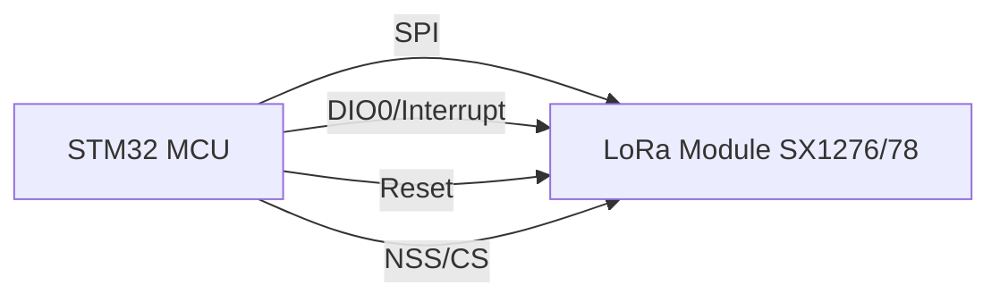

# STM32 LoRa Integration

## Introduction

LoRa (Long Range) is a wireless communication technology designed for low-power, long-range connectivity, making it ideal for Internet of Things (IoT) applications. When combined with STM32 microcontrollers, developers can create powerful IoT solutions that communicate over distances of several kilometers while maintaining battery life for years.

In this tutorial, we'll explore how to integrate LoRa modules with STM32 microcontrollers, configure the necessary hardware connections, and write firmware to establish reliable LoRa communication.

## What is LoRa?

LoRa is a physical layer protocol that defines the radio modulation technique for long-range communication. It uses a chirp spread spectrum (CSS) modulation that provides excellent resistance to interference while maximizing range and minimizing power consumption.

Key characteristics of LoRa include:

- Range: 2-15 km in urban areas, up to 45 km in rural areas
- Low power consumption (ideal for battery-powered devices)
- Relatively low data rates (0.3 kbps to 50 kbps)
- Operation in license-free ISM radio bands (usually 868 MHz in Europe, 915 MHz in North America)

LoRaWAN is a higher-level network protocol built on top of LoRa that defines how devices communicate with gateways connected to the internet.

## Required Hardware

To follow this tutorial, you'll need:

1. An STM32 development board (we'll use the Nucleo-F446RE in our examples)
2. A LoRa transceiver module (such as the SX1276/SX1278)
3. Jumper wires
4. Breadboard (optional)
5. USB cable for programming the STM32
6. Antennas for the LoRa modules

## Hardware Connection

The SX1276/78 LoRa module communicates with the STM32 microcontroller using the SPI protocol, plus a few additional pins for interrupt and control signals.

Here's the typical connection diagram:




Specific pin connections for the Nucleo-F446RE and SX1276:

| STM32 Pin | SX1276 Pin | Function |
|-----------|------------|----------|
| PA5       | SCK        | SPI Clock |
| PA6       | MISO       | SPI Master In Slave Out |
| PA7       | MOSI       | SPI Master Out Slave In |
| PB6       | NSS/CS     | SPI Chip Select |
| PC7       | DIO0       | Interrupt |
| PA8       | RESET      | Module Reset |
| 3.3V      | 3.3V       | Power |
| GND       | GND        | Ground |

## Software Requirements

For this tutorial, we'll use:

1. STM32CubeIDE for project creation and coding
2. STM32CubeMX for peripheral configuration
3. A LoRa library for STM32 (provided in this tutorial)

## Step 1: Setting Up the STM32CubeIDE Project

Let's start by creating a new project and configuring the required peripherals:

1. Open STM32CubeIDE and create a new STM32 project
2. Select your board or microcontroller (in our case, NUCLEO-F446RE)
3. Name your project, e.g., "STM32_LoRa_Integration"
4. In the pinout configuration:
   - Enable SPI1 in Full-Duplex Master mode
   - Configure PA5, PA6, and PA7 for SPI1
   - Configure PB6 as GPIO_Output for NSS
   - Configure PC7 as GPIO_Input with EXTI for DIO0 interrupt
   - Configure PA8 as GPIO_Output for RESET

5. In the Clock Configuration, set the system clock to 84 MHz
6. Generate the code to create your project

## Step 2: Creating a LoRa Library

To interact with the LoRa module efficiently, we'll create a simple library. First, create two new files in your project: `lora.h` and `lora.c`.

Here's the content for `lora.h`:

```c
#ifndef LORA_H
#define LORA_H

#include "main.h"
#include <stdbool.h>
#include <string.h>

// LoRa module commands
#define LORA_REG_FIFO                 0x00
#define LORA_REG_OP_MODE              0x01
#define LORA_REG_FRF_MSB              0x06
#define LORA_REG_FRF_MID              0x07
#define LORA_REG_FRF_LSB              0x08
#define LORA_REG_PA_CONFIG            0x09
#define LORA_REG_PA_RAMP              0x0A
#define LORA_REG_OCP                  0x0B
#define LORA_REG_LNA                  0x0C
#define LORA_REG_FIFO_ADDR_PTR        0x0D
#define LORA_REG_FIFO_TX_BASE_ADDR    0x0E
#define LORA_REG_FIFO_RX_BASE_ADDR    0x0F
#define LORA_REG_FIFO_RX_CURRENT_ADDR 0x10
#define LORA_REG_IRQ_FLAGS            0x12
#define LORA_REG_RX_NB_BYTES          0x13
#define LORA_REG_PKT_SNR_VALUE        0x19
#define LORA_REG_PKT_RSSI_VALUE       0x1A
#define LORA_REG_MODEM_CONFIG_1       0x1D
#define LORA_REG_MODEM_CONFIG_2       0x1E
#define LORA_REG_SYMB_TIMEOUT_LSB     0x1F
#define LORA_REG_PREAMBLE_MSB         0x20
#define LORA_REG_PREAMBLE_LSB         0x21
#define LORA_REG_PAYLOAD_LENGTH       0x22
#define LORA_REG_MODEM_CONFIG_3       0x26
#define LORA_REG_FREQ_ERROR_MSB       0x28
#define LORA_REG_FREQ_ERROR_MID       0x29
#define LORA_REG_FREQ_ERROR_LSB       0x2A
#define LORA_REG_RSSI_WIDEBAND        0x2C
#define LORA_REG_DETECTION_OPTIMIZE   0x31
#define LORA_REG_INVERTIQ             0x33
#define LORA_REG_DETECTION_THRESHOLD  0x37
#define LORA_REG_SYNC_WORD            0x39
#define LORA_REG_INVERTIQ2            0x3B
#define LORA_REG_DIO_MAPPING_1        0x40
#define LORA_REG_VERSION              0x42
#define LORA_REG_PA_DAC               0x4D

// LoRa operation modes
#define LORA_MODE_SLEEP               0x00
#define LORA_MODE_STDBY               0x01
#define LORA_MODE_TX                  0x03
#define LORA_MODE_RX_CONTINUOUS       0x05
#define LORA_MODE_RX_SINGLE           0x06

// LoRa module configuration structure
typedef struct {
    SPI_HandleTypeDef* hspi;
    GPIO_TypeDef* nss_port;
    uint16_t nss_pin;
    GPIO_TypeDef* reset_port;
    uint16_t reset_pin;
    GPIO_TypeDef* dio0_port;
    uint16_t dio0_pin;
    uint8_t spreading_factor; // 6-12
    uint8_t bandwidth;        // 0:125kHz, 1:250kHz, 2:500kHz
    uint8_t coding_rate;      // 1:4/5, 2:4/6, 3:4/7, 4:4/8
    uint32_t frequency;       // Hz
    uint8_t power;            // dBm
    uint8_t tx_buffer[256];
    uint8_t rx_buffer[256];
} LoRa_t;

// Function prototypes
void LoRa_Init(LoRa_t* lora);
void LoRa_Reset(LoRa_t* lora);
uint8_t LoRa_ReadRegister(LoRa_t* lora, uint8_t reg);
void LoRa_WriteRegister(LoRa_t* lora, uint8_t reg, uint8_t value);
void LoRa_SetMode(LoRa_t* lora, uint8_t mode);
void LoRa_SetFrequency(LoRa_t* lora, uint32_t frequency);
void LoRa_SetPower(LoRa_t* lora, uint8_t power);
void LoRa_SetSpreadingFactor(LoRa_t* lora, uint8_t sf);
void LoRa_SetBandwidth(LoRa_t* lora, uint8_t bw);
void LoRa_SetCodingRate(LoRa_t* lora, uint8_t cr);
void LoRa_EnableCRC(LoRa_t* lora);
void LoRa_DisableCRC(LoRa_t* lora);
void LoRa_Send(LoRa_t* lora, uint8_t* data, uint8_t size);
uint8_t LoRa_Receive(LoRa_t* lora, uint8_t* data);
int16_t LoRa_GetRSSI(LoRa_t* lora);
int8_t LoRa_GetSNR(LoRa_t* lora);
void LoRa_PrintConfig(LoRa_t* lora);

#endif /* LORA_H */
```

## Step 3: Using the LoRa Library in the Main Program

Let's create a simple application that sends and receives data using our LoRa library. Modify your `main.c` file to include:

```c
/* Includes ------------------------------------------------------------------*/
#include "main.h"
#include "spi.h"
#include "gpio.h"
#include "lora.h"
#include <stdio.h>
#include <string.h>

/* Private variables ---------------------------------------------------------*/
LoRa_t myLora;
uint8_t rxBuffer[256];
char message[100];
int messageCounter = 0;

/* Private function prototypes -----------------------------------------------*/
void SystemClock_Config(void);
void SendMessage(void);
void ReceiveMessage(void);

/* Main function -------------------------------------------------------------*/
int main(void)
{
  /* MCU Configuration--------------------------------------------------------*/
  HAL_Init();
  SystemClock_Config();

  /* Initialize all configured peripherals */
  MX_GPIO_Init();
  MX_SPI1_Init();

  /* Configure the LoRa module */
  myLora.hspi = &hspi1;
  myLora.nss_port = GPIOB;
  myLora.nss_pin = GPIO_PIN_6;
  myLora.reset_port = GPIOA;
  myLora.reset_pin = GPIO_PIN_8;
  myLora.dio0_port = GPIOC;
  myLora.dio0_pin = GPIO_PIN_7;

  // Communication parameters
  myLora.frequency = 868000000; // 868 MHz
  myLora.power = 17;            // 17 dBm
  myLora.spreading_factor = 7;  // SF7
  myLora.bandwidth = 0;         // 125 kHz
  myLora.coding_rate = 1;       // 4/5

  // Initialize the LoRa module
  LoRa_Init(&myLora);

  while (1)
  {
    // Send a message
    SendMessage();
    HAL_Delay(5000); // Wait 5 seconds

    // Try to receive a message
    ReceiveMessage();
    HAL_Delay(100); // Wait a bit
  }
}

/* Send a message using LoRa */
void SendMessage(void)
{
  // Create a message with a counter
  sprintf(message, "STM32 LoRa Test Message #%d", messageCounter++);

  // Send the message
  LoRa_Send(&myLora, (uint8_t*)message, strlen(message));
}

/* Receive a message using LoRa */
void ReceiveMessage(void)
{
  // Set LoRa to receive mode for a short time
  uint8_t len = LoRa_Receive(&myLora, rxBuffer);

  if (len > 0)
  {
    // We received something - null-terminate the string
    rxBuffer[len] = '\0';

    // Get signal quality information
    int16_t rssi = LoRa_GetRSSI(&myLora);
    int8_t snr = LoRa_GetSNR(&myLora);

    // Process the received message here
    // You could use UART to output the message, or process it in your application
    // Example: printf("Received: %s (RSSI: %d dBm, SNR: %d dB)\r\n", rxBuffer, rssi, snr);
  }
}

/* System Clock Configuration */
void SystemClock_Config(void)
{
  RCC_OscInitTypeDef RCC_OscInitStruct = {0};
  RCC_ClkInitTypeDef RCC_ClkInitStruct = {0};

  /** Configure the main internal regulator output voltage
  */
  __HAL_RCC_PWR_CLK_ENABLE();
  __HAL_PWR_VOLTAGESCALING_CONFIG(PWR_REGULATOR_VOLTAGE_SCALE3);
  /** Initializes the RCC Oscillators according to the specified parameters
  * in the RCC_OscInitTypeDef structure.
  */
  RCC_OscInitStruct.OscillatorType = RCC_OSCILLATORTYPE_HSI;
  RCC_OscInitStruct.HSIState = RCC_HSI_ON;
  RCC_OscInitStruct.HSICalibrationValue = RCC_HSICALIBRATION_DEFAULT;
  RCC_OscInitStruct.PLL.PLLState = RCC_PLL_ON;
  RCC_OscInitStruct.PLL.PLLSource = RCC_PLLSOURCE_HSI;
  RCC_OscInitStruct.PLL.PLLM = 16;
  RCC_OscInitStruct.PLL.PLLN = 336;
  RCC_OscInitStruct.PLL.PLLP = RCC_PLLP_DIV4;
  RCC_OscInitStruct.PLL.PLLQ = 4;
  if (HAL_RCC_OscConfig(&RCC_OscInitStruct) != HAL_OK)
  {
    Error_Handler();
  }
  /** Initializes the CPU, AHB and APB buses clocks
  */
  RCC_ClkInitStruct.ClockType = RCC_CLOCKTYPE_HCLK|RCC_CLOCKTYPE_SYSCLK
                              |RCC_CLOCKTYPE_PCLK1|RCC_CLOCKTYPE_PCLK2;
  RCC_ClkInitStruct.SYSCLKSource = RCC_SYSCLKSOURCE_PLLCLK;
  RCC_ClkInitStruct.AHBCLKDivider = RCC_SYSCLK_DIV1;
  RCC_ClkInitStruct.APB1CLKDivider = RCC_HCLK_DIV2;
  RCC_ClkInitStruct.APB2CLKDivider = RCC_HCLK_DIV1;

  if (HAL_RCC_ClockConfig(&RCC_ClkInitStruct, FLASH_LATENCY_2) != HAL_OK)
  {
    Error_Handler();
  }
}
```

## Step 4: Advanced LoRa Configuration

### Power Management

For battery-powered applications, you can implement sleep modes:

```c
void LoRa_Sleep(LoRa_t* lora) {
    LoRa_SetMode(lora, LORA_MODE_SLEEP);
}

void LoRa_Wakeup(LoRa_t* lora) {
    LoRa_SetMode(lora, LORA_MODE_STDBY);
}
```

### Interrupt-Based Reception

For more efficient operation, you can use interrupts instead of polling:

```c
// In your main.c, add this global variable
volatile bool rxDone = false;

// EXTI callback for DIO0 interrupt
void HAL_GPIO_EXTI_Callback(uint16_t GPIO_Pin)
{
  if (GPIO_Pin == GPIO_PIN_7) // DIO0 pin
  {
    rxDone = true;
  }
}

// Modified receive function using interrupts
uint8_t LoRa_ReceiveIT(LoRa_t* lora, uint8_t* data, uint32_t timeout_ms)
{
  rxDone = false;

  // Set the module to standby mode
  LoRa_SetMode(lora, LORA_MODE_STDBY);

  // Configure DIO0 to interrupt on RX Done
  LoRa_WriteRegister(lora, LORA_REG_DIO_MAPPING_1, 0x00);

  // Set module to continuous receive mode
  LoRa_SetMode(lora, LORA_MODE_RX_CONTINUOUS);

  // Wait for reception with timeout
  uint32_t startTime = HAL_GetTick();
  while (!rxDone && (HAL_GetTick() - startTime) < timeout_ms)
  {
    HAL_Delay(1);
  }

  if (!rxDone)
  {
    // Timeout occurred
    LoRa_SetMode(lora, LORA_MODE_STDBY);
    return 0;
  }

  // Clear IRQ flags
  LoRa_WriteRegister(lora, LORA_REG_IRQ_FLAGS, 0xFF);

  // Get payload length and read data (same as before)
  uint8_t len = LoRa_ReadRegister(lora, LORA_REG_RX_NB_BYTES);
  uint8_t addr = LoRa_ReadRegister(lora, LORA_REG_FIFO_RX_CURRENT_ADDR);
  LoRa_WriteRegister(lora, LORA_REG_FIFO_ADDR_PTR, addr);

  LoRa_NSS_Low(lora);
  uint8_t reg = LORA_REG_FIFO;
  HAL_SPI_Transmit(lora->hspi, &reg, 1, HAL_MAX_DELAY);
  HAL_SPI_Receive(lora->hspi, data, len, HAL_MAX_DELAY);
  LoRa_NSS_High(lora);

  LoRa_SetMode(lora, LORA_MODE_STDBY);

  return len;
}
```

## Step 5: Testing and Optimization

### Range Testing

To test the range of your LoRa setup:

1. Set up two devices with the same configuration
2. Start with devices close together and verify communication
3. Gradually increase distance while monitoring signal quality (RSSI and SNR)
4. Adjust parameters like spreading factor and transmit power as needed

### Parameter Optimization

Different LoRa parameters offer trade-offs between range, data rate, and power consumption:

**Spreading Factor (SF)**
- Higher SF = longer range, lower data rate, higher power consumption
- Lower SF = shorter range, higher data rate, lower power consumption

**Bandwidth**
- Wider bandwidth = higher data rate, lower range
- Narrower bandwidth = lower data rate, longer range

**Coding Rate**
- Higher coding rate = better error correction, lower data rate
- Lower coding rate = less error correction, higher data rate

### Performance Tuning

```c
// Configuration for maximum range
void LoRa_ConfigMaxRange(LoRa_t* lora) {
    LoRa_SetSpreadingFactor(lora, 12);  // Maximum SF
    LoRa_SetBandwidth(lora, 0);         // 125 kHz
    LoRa_SetCodingRate(lora, 4);        // 4/8 coding rate
    LoRa_SetPower(lora, 20);            // Maximum power
}

// Configuration for maximum data rate
void LoRa_ConfigMaxDataRate(LoRa_t* lora) {
    LoRa_SetSpreadingFactor(lora, 6);   // Minimum SF
    LoRa_SetBandwidth(lora, 2);         // 500 kHz
    LoRa_SetCodingRate(lora, 1);        // 4/5 coding rate
    LoRa_SetPower(lora, 14);            // Moderate power
}

// Configuration for low power consumption
void LoRa_ConfigLowPower(LoRa_t* lora) {
    LoRa_SetSpreadingFactor(lora, 7);   // Balanced SF
    LoRa_SetBandwidth(lora, 0);         // 125 kHz
    LoRa_SetCodingRate(lora, 1);        // 4/5 coding rate
    LoRa_SetPower(lora, 2);             // Minimum power
}
```

## Troubleshooting

### Common Issues

1. **No communication**: Check SPI connections, power supply, and antenna connections
2. **Short range**: Verify antenna impedance matching, increase transmit power, or use higher spreading factor
3. **High packet loss**: Adjust spreading factor, check for interference, or improve antenna positioning
4. **High power consumption**: Lower transmit power, use sleep modes, or optimize transmission intervals

### Debug Functions

```c
// Function to verify LoRa module communication
bool LoRa_TestCommunication(LoRa_t* lora) {
    uint8_t version = LoRa_ReadRegister(lora, LORA_REG_VERSION);
    return (version == 0x12); // SX1276/77/78/79 version
}

// Function to read all important registers for debugging
void LoRa_DebugRegisters(LoRa_t* lora) {
    // Example implementation - adapt based on your debug output method
    uint8_t version = LoRa_ReadRegister(lora, LORA_REG_VERSION);
    uint8_t opMode = LoRa_ReadRegister(lora, LORA_REG_OP_MODE);
    uint8_t config1 = LoRa_ReadRegister(lora, LORA_REG_MODEM_CONFIG_1);
    uint8_t config2 = LoRa_ReadRegister(lora, LORA_REG_MODEM_CONFIG_2);

    // Output these values using your preferred debug method
}
```

## Conclusion

This tutorial has covered the basics of integrating LoRa wireless communication with STM32 microcontrollers. You now have:

- A complete LoRa library for STM32
- Understanding of hardware connections and SPI communication
- Basic send and receive functionality
- Advanced features like interrupt-based reception and power management
- Optimization strategies for different use cases

The combination of STM32 microcontrollers and LoRa technology opens up many possibilities for IoT applications, from environmental monitoring to asset tracking. With the foundation provided in this tutorial, you can expand your implementation to include features like:

- Network protocols (LoRaWAN)
- Sensor data collection and transmission
- Over-the-air firmware updates
- Mesh networking capabilities
- Integration with cloud services

Remember to comply with local regulations regarding radio frequency usage and power limits when deploying your LoRa devices in real-world applications.