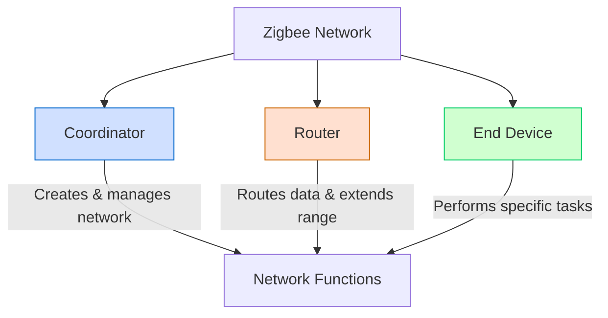
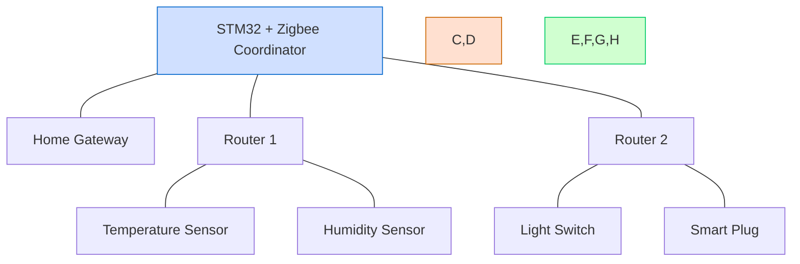

# STM32 Zigbee Integration

## Introduction

Zigbee is a low-power, low-data-rate wireless communication protocol specifically designed for Internet of Things (IoT) applications. It operates on the IEEE 802.15.4 standard and is perfect for creating mesh networks where devices can communicate with each other over extended ranges through routing messages across multiple nodes.

In this tutorial, we'll explore how to integrate Zigbee functionality with STM32 microcontrollers. STM32's extensive connectivity options make it an excellent platform for developing Zigbee-based applications. By the end of this guide, you'll understand the fundamentals of Zigbee technology and how to implement it on STM32 platforms.

## Understanding Zigbee Technology

Before diving into implementation, let's understand some key concepts of Zigbee technology:

### Zigbee Network Types

Zigbee networks consist of three types of devices:



1. **Coordinator**: The main controller that creates and manages the network. Every Zigbee network must have exactly one coordinator.

2. **Router**: Extends the network range by routing data between devices. Routers are always-on devices.

3. **End Device**: The simplest device type that performs specific tasks (like sensors or actuators). End devices can enter sleep mode to conserve power.

### Zigbee Protocol Layers

Zigbee is built on a layered architecture:

1. **Physical (PHY) Layer**: Handles radio transmission and reception.
2. **Media Access Control (MAC) Layer**: Manages access to the physical radio channel.
3. **Network Layer**: Handles network formation, routing, and security.
4. **Application Layer**: Contains the application profiles, clusters, and endpoints.

## STM32 and Zigbee Hardware Setup

### Required Components

To build a Zigbee application with STM32, you'll need:

1. An STM32 development board (such as NUCLEO-F401RE or NUCLEO-L476RG)
2. A Zigbee module compatible with STM32 (like the X-NUCLEO-IDB05A1 expansion board)
3. STM32CubeIDE for programming
4. STM32CubeMX for configuration
5. STM32Cube firmware package with Zigbee middleware

### Hardware Connection

Connect the Zigbee module to your STM32 board following these general steps:

1. **UART Connection**: Connect the UART pins of the Zigbee module to the UART pins of the STM32.
   - TX of the module to RX of STM32
   - RX of the module to TX of STM32

2. **Power Supply**: Connect VCC and GND pins.

3. **Control Pins**: Connect reset and other control pins if required by your specific module.

## Software Implementation

### Step 1: Setting Up the Project in STM32CubeMX

1. Open STM32CubeMX and create a new project.
2. Select your STM32 microcontroller.
3. Configure the clock settings according to your board's specifications.
4. Configure the UART interface that will communicate with the Zigbee module:

```c
// UART configuration example (in STM32CubeMX)
// Baud Rate: 115200
// Word Length: 8 bits
// Stop Bits: 1
// Parity: None
// Flow Control: None
```

5. Configure GPIO pins for controlling the Zigbee module (reset, sleep, etc.).
6. Generate the project code and open it in STM32CubeIDE.

### Step 2: Implementing the Zigbee Stack

ST provides middleware for Zigbee called STM32WB Zigbee stack that simplifies development. Here's how to initialize it:

```c
/* Include necessary headers */
#include "main.h"
#include "zigbee.h"
#include "zigbee_types.h"

/* Zigbee initialization function */
void Zigbee_Init(void)
{
  /* Initialize Zigbee stack */
  ZigBee_Init();
  
  /* Set device type (Coordinator, Router, or End Device) */
  ZigBee_SetDeviceType(ZIGBEE_DEVICE_COORDINATOR);
  
  /* Set Zigbee channel (11-26) */
  ZigBee_SetChannel(15);
  
  /* Set PAN ID */
  ZigBee_SetPanId(0x1234);
  
  /* Start Zigbee network */
  ZigBee_NetworkStart();
}
```

### Step 3: Creating a Zigbee Coordinator

The coordinator is responsible for starting the network. Here's a simplified implementation:

```c
/* Coordinator implementation */
void Zigbee_CreateNetwork(void)
{
  /* Define network parameters */
  zigbee_network_params_t networkParams;
  networkParams.panId = 0x1234;
  networkParams.channel = 15;
  networkParams.extendedPanId = 0xACDE48000000000A;
  networkParams.networkKey[0] = 0x01; /* Just an example, use secure keys in real applications */
  /* ... fill in other key bytes ... */
  
  /* Start the network as a coordinator */
  if (ZigBee_StartNetwork(&networkParams) == ZIGBEE_SUCCESS)
  {
    printf("Zigbee network created successfully!\r
");
  }
  else
  {
    printf("Failed to create Zigbee network!\r
");
  }
}
```

### Step 4: Implementing a Zigbee End Device

For an end device (like a sensor node), you would implement code like this:

```c
/* End device implementation */
void Zigbee_JoinNetwork(void)
{
  /* Define joining parameters */
  zigbee_join_params_t joinParams;
  joinParams.scanChannels = 0x00008000; /* Channel 15 */
  joinParams.scanDuration = 5;          /* Scan duration */
  
  /* Join an existing network */
  if (ZigBee_JoinNetwork(&joinParams) == ZIGBEE_SUCCESS)
  {
    printf("Joined Zigbee network successfully!\r
");
  }
  else
  {
    printf("Failed to join Zigbee network!\r
");
  }
}
```

### Step 5: Sending and Receiving Data

Once devices are connected to the network, they can exchange data:

```c
/* Structure to hold sensor data */
typedef struct {
  float temperature;
  float humidity;
  uint16_t light;
} sensor_data_t;

/* Function to send sensor data */
void Send_SensorData(void)
{
  /* Prepare sensor data */
  sensor_data_t sensorData;
  sensorData.temperature = 25.5;
  sensorData.humidity = 68.3;
  sensorData.light = 850;
  
  /* Destination address (coordinator in this case) */
  zigbee_addr_t destAddr;
  destAddr.addrMode = ZIGBEE_ADDR_16BIT;
  destAddr.addr.shortAddr = 0x0000; /* Coordinator address */
  
  /* Send data */
  if (ZigBee_SendData(&destAddr, (uint8_t*)&sensorData, sizeof(sensor_data_t)) == ZIGBEE_SUCCESS)
  {
    printf("Data sent successfully!\r
");
  }
  else
  {
    printf("Failed to send data!\r
");
  }
}

/* Function to handle received data */
void HandleReceivedData(uint8_t* data, uint16_t length, zigbee_addr_t* sourceAddr)
{
  if (length == sizeof(sensor_data_t))
  {
    sensor_data_t* sensorData = (sensor_data_t*)data;
    printf("Received data from device 0x%04X:\r
", sourceAddr->addr.shortAddr);
    printf("Temperature: %.1f°C\r
", sensorData->temperature);
    printf("Humidity: %.1f%%\r
", sensorData->humidity);
    printf("Light: %u lux\r
", sensorData->light);
  }
}
```

### Step 6: Setting Up Data Reception Callback

To receive data, you need to register a callback function:

```c
/* Main application initialization */
int main(void)
{
  /* Initialize HAL */
  HAL_Init();
  
  /* Configure system clock */
  SystemClock_Config();
  
  /* Initialize UART */
  MX_USART2_UART_Init();
  
  /* Initialize Zigbee */
  Zigbee_Init();
  
  /* Register data reception callback */
  ZigBee_RegisterDataCallback(HandleReceivedData);
  
  /* For coordinator: create network */
  Zigbee_CreateNetwork();
  
  /* For end device: join network */
  // Zigbee_JoinNetwork();
  
  /* Main loop */
  while (1)
  {
    /* Process Zigbee stack events */
    ZigBee_ProcessEvents();
    
    /* For end device: periodically send sensor data */
    // Send_SensorData();
    // HAL_Delay(5000); /* Send every 5 seconds */
    
    /* Other application tasks */
    HAL_Delay(100);
  }
}
```

## Real-World Example: Home Automation System

Let's see how to build a simple home automation system using STM32 and Zigbee:

### Example Architecture



### Coordinator Implementation (Home Gateway)

```c
/* Coordinator main function */
int main(void)
{
  /* Standard initialization code */
  HAL_Init();
  SystemClock_Config();
  MX_USART2_UART_Init();
  
  /* Initialize Zigbee as coordinator */
  Zigbee_Init();
  ZigBee_SetDeviceType(ZIGBEE_DEVICE_COORDINATOR);
  
  /* Create network */
  Zigbee_CreateNetwork();
  
  /* Register data reception callback */
  ZigBee_RegisterDataCallback(HandleHomeAutomationData);
  
  /* Main loop */
  while (1)
  {
    /* Process Zigbee stack events */
    ZigBee_ProcessEvents();
    
    /* Process user commands from UART */
    ProcessUserCommands();
    
    HAL_Delay(10);
  }
}

/* Process commands from user interface */
void ProcessUserCommands(void)
{
  /* Check if command received from UART */
  if (UartCommandReceived())
  {
    command_t cmd = ParseCommand();
    
    /* Handle different commands */
    switch (cmd.type)
    {
      case CMD_TOGGLE_LIGHT:
        SendLightCommand(cmd.deviceId, cmd.value);
        break;
        
      case CMD_SET_THERMOSTAT:
        SendThermostatCommand(cmd.deviceId, cmd.value);
        break;
        
      /* Other command types */
    }
  }
}
```

### End Device Implementation (Temperature Sensor)

```c
/* Temperature sensor main function */
int main(void)
{
  /* Standard initialization code */
  HAL_Init();
  SystemClock_Config();
  MX_USART2_UART_Init();
  MX_ADC1_Init(); /* For temperature sensor */
  
  /* Initialize Zigbee as end device */
  Zigbee_Init();
  ZigBee_SetDeviceType(ZIGBEE_DEVICE_END_DEVICE);
  
  /* Join network */
  Zigbee_JoinNetwork();
  
  /* Main loop */
  while (1)
  {
    /* Process Zigbee stack events */
    ZigBee_ProcessEvents();
    
    /* Read temperature and send data */
    float temperature = ReadTemperatureSensor();
    SendTemperatureData(temperature);
    
    /* Sleep to save power */
    ZigBee_EnterSleepMode();
    HAL_Delay(60000); /* Wake up every minute */
    ZigBee_ExitSleepMode();
  }
}

/* Function to read temperature sensor */
float ReadTemperatureSensor(void)
{
  uint32_t adcValue;
  float voltage, temperature;
  
  /* Start ADC conversion */
  HAL_ADC_Start(&hadc1);
  HAL_ADC_PollForConversion(&hadc1, 100);
  adcValue = HAL_ADC_GetValue(&hadc1);
  
  /* Convert ADC value to temperature */
  voltage = (float)adcValue * 3.3f / 4095.0f;
  temperature = (voltage - 0.76f) / 0.0025f + 25.0f;
  
  return temperature;
}

/* Function to send temperature data */
void SendTemperatureData(float temperature)
{
  /* Prepare data structure */
  sensor_data_t data;
  data.type = SENSOR_TEMPERATURE;
  data.value = temperature;
  data.deviceId = MY_DEVICE_ID;
  
  /* Destination address (coordinator) */
  zigbee_addr_t destAddr;
  destAddr.addrMode = ZIGBEE_ADDR_16BIT;
  destAddr.addr.shortAddr = 0x0000;
  
  /* Send data */
  ZigBee_SendData(&destAddr, (uint8_t*)&data, sizeof(data));
}
```

### End Device Implementation (Light Switch)

```c
/* Light switch main function */
int main(void)
{
  /* Standard initialization code */
  HAL_Init();
  SystemClock_Config();
  MX_USART2_UART_Init();
  MX_GPIO_Init(); /* For LED and button */
  
  /* Initialize Zigbee as router (since lights typically stay powered) */
  Zigbee_Init();
  ZigBee_SetDeviceType(ZIGBEE_DEVICE_ROUTER);
  
  /* Join network */
  Zigbee_JoinNetwork();
  
  /* Register data reception callback for light control commands */
  ZigBee_RegisterDataCallback(HandleLightCommand);
  
  /* Main loop */
  while (1)
  {
    /* Process Zigbee stack events */
    ZigBee_ProcessEvents();
    
    /* Check if button pressed */
    if (IsButtonPressed())
    {
      ToggleLight();
      SendLightStatus();
    }
    
    HAL_Delay(10);
  }
}

/* Function to handle light command from coordinator */
void HandleLightCommand(uint8_t* data, uint16_t length, zigbee_addr_t* sourceAddr)
{
  if (length == sizeof(light_command_t))
  {
    light_command_t* cmd = (light_command_t*)data;
    
    if (cmd->deviceId == MY_DEVICE_ID)
    {
      /* Set light state based on command */
      SetLightState(cmd->state);
      
      /* Send acknowledgment */
      SendLightStatus();
    }
  }
}

/* Function to toggle light */
void ToggleLight(void)
{
  /* Toggle GPIO pin connected to relay/LED */
  HAL_GPIO_TogglePin(LIGHT_GPIO_Port, LIGHT_Pin);
}

/* Function to set specific light state */
void SetLightState(uint8_t state)
{
  if (state)
  {
    HAL_GPIO_WritePin(LIGHT_GPIO_Port, LIGHT_Pin, GPIO_PIN_SET);
  }
  else
  {
    HAL_GPIO_WritePin(LIGHT_GPIO_Port, LIGHT_Pin, GPIO_PIN_RESET);
  }
}

/* Function to send current light status to coordinator */
void SendLightStatus(void)
{
  /* Prepare status data */
  light_status_t status;
  status.deviceId = MY_DEVICE_ID;
  status.state = HAL_GPIO_ReadPin(LIGHT_GPIO_Port, LIGHT_Pin);
  
  /* Destination address (coordinator) */
  zigbee_addr_t destAddr;
  destAddr.addrMode = ZIGBEE_ADDR_16BIT;
  destAddr.addr.shortAddr = 0x0000;
  
  /* Send status */
  ZigBee_SendData(&destAddr, (uint8_t*)&status, sizeof(status));
}
```

## Optimizing Zigbee Performance

To get the best results from your Zigbee network:

1. **Network Planning**: Place routers strategically to optimize coverage and minimize hops.

2. **Power Management**: Use sleep modes for battery-operated end devices:

```c
/* Example of power management for end devices */
void OptimizePower(void)
{
  /* Perform required operations */
  ReadSensors();
  SendData();
  
  /* Enter sleep mode to save power */
  printf("Entering sleep mode for 60 seconds...\r
");
  
  /* Prepare for sleep */
  ZigBee_PrepareSleep();
  
  /* Configure wake-up timer */
  HAL_RTCEx_SetWakeUpTimer_IT(&hrtc, 60, RTC_WAKEUPCLOCK_CK_SPRE_16BITS);
  
  /* Enter stop mode */
  HAL_PWR_EnterSTOPMode(PWR_LOWPOWERREGULATOR_ON, PWR_STOPENTRY_WFI);
  
  /* Code continues here after waking up */
  printf("Woke up from sleep mode\r
");
  
  /* Resume Zigbee stack */
  ZigBee_ResumeSleep();
}
```

3. **Security**: Always implement proper security measures:

```c
/* Example of secure network setup */
void ConfigureSecureNetwork(void)
{
  /* Define network parameters with security */
  zigbee_network_params_t secureNetParams;
  
  /* Configure parameters */
  secureNetParams.panId = 0x1234;
  secureNetParams.channel = 15;
  
  /* Set strong network key (should be randomly generated in production) */
  uint8_t networkKey[16] = {0x01, 0x23, 0x45, 0x67, 0x89, 0xAB, 0xCD, 0xEF,
                            0xFE, 0xDC, 0xBA, 0x98, 0x76, 0x54, 0x32, 0x10};
  memcpy(secureNetParams.networkKey, networkKey, 16);
  
  /* Enable security */
  secureNetParams.securityEnabled = true;
  
  /* Start the network with security enabled */
  ZigBee_StartSecureNetwork(&secureNetParams);
}
```

4. **Diagnostic Tools**: Implement network diagnostics:

```c
/* Example of network diagnostics function */
void DiagnoseNetwork(void)
{
  /* Get network statistics */
  zigbee_network_stats_t stats;
  ZigBee_GetNetworkStats(&stats);
  
  /* Print diagnostic information */
  printf("Network Diagnostics:\r
");
  printf("-----------------\r
");
  printf("Current channel: %d\r
", stats.channel);
  printf("Network PAN ID: 0x%04X\r
", stats.panId);
  printf("Signal strength: %d dBm\r
", stats.rssi);
  printf("Packet delivery rate: %.1f%%\r
", stats.deliveryRate);
  printf("Devices in network: %d\r
", stats.deviceCount);
}
```

## Troubleshooting Common Issues

### Communication Problems

If devices aren't communicating properly:

1. Check that all devices are on the same channel and PAN ID.
2. Verify signal strength and add routers if needed.
3. Check for interference from other wireless devices.

### Code Debugging

Use UART debugging to track Zigbee operations:

```c
/* Example of debug function */
void DebugZigbeeOperation(const char* operation, zigbee_status_t status)
{
  printf("[ZIGBEE] %s: ", operation);
  
  switch (status)
  {
    case ZIGBEE_SUCCESS:
      printf("SUCCESS\r
");
      break;
      
    case ZIGBEE_ERROR_NO_NETWORK:
      printf("ERROR - No network found\r
");
      break;
      
    case ZIGBEE_ERROR_SECURITY:
      printf("ERROR - Security failure\r
");
      break;
      
    /* Other status codes */
    
    default:
      printf("UNKNOWN ERROR (Code: %d)\r
", status);
      break;
  }
}
```

## Summary

In this tutorial, we've covered the essentials of integrating Zigbee wireless technology with STM32 microcontrollers:

1. We learned about Zigbee technology and its network architecture.
2. We implemented software to create Zigbee coordinators, routers, and end devices.
3. We explored a practical home automation example with multiple device types.
4. We discussed optimization techniques and troubleshooting methods.

Zigbee provides a powerful solution for IoT applications requiring low power consumption, reliable mesh networking, and industry-standard security. Combined with the versatility of STM32 microcontrollers, you can build sophisticated wireless systems for a wide range of applications.

## Additional Resources

To continue learning about STM32 Zigbee integration:

1. STMicroelectronics official documentation for STM32WB series with Zigbee support
2. Zigbee Alliance specifications and certification information
3. STM32CubeWB firmware package with Zigbee middleware examples
4. STM32WB55 reference designs and evaluation boards

## Exercises

1. **Basic Exercise**: Create a simple Zigbee network with one coordinator and one end device that sends periodic temperature readings.

2. **Intermediate Exercise**: Implement a smart lighting system with a coordinator and multiple light switches that can control each other.

3. **Advanced Exercise**: Build a complete home automation system with temperature sensors, motion detectors, and controllable appliances, all managed through a central STM32-based coordinator.