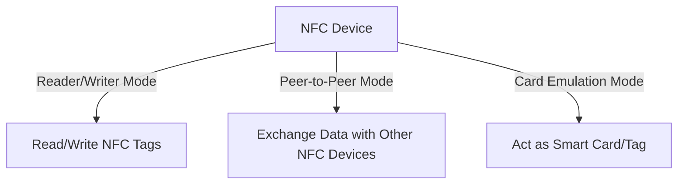

# STM32 NFC Implementation

## Introduction

Near Field Communication (NFC) is a short-range wireless communication technology that enables two electronic devices to exchange data when placed within a few centimeters of each other. In this tutorial, we'll explore how to implement NFC functionality using STM32 microcontrollers, which offer excellent support for NFC through specialized hardware and software libraries.

NFC technology has become ubiquitous in modern applications including:
- Contactless payments
- Access control systems
- Smart device pairing
- Public transportation tickets
- Product authentication

By the end of this tutorial, you'll understand the fundamentals of NFC, the hardware requirements for STM32 NFC implementation, and how to build basic NFC applications using the STM32 platform.

## NFC Basics

### What is NFC?

NFC operates at 13.56 MHz and provides data exchange rates from 106 to 424 kbit/s. It's based on RFID (Radio Frequency Identification) technology but offers bidirectional communication compared to traditional RFID's one-way communication.

### NFC Operating Modes

NFC devices can operate in three modes:

1. **Reader/Writer mode**: The NFC device reads or writes data to passive NFC tags
2. **Peer-to-peer mode**: Two NFC devices exchange data bidirectionally
3. **Card emulation mode**: The NFC device behaves like a contactless smart card



## Hardware Requirements

### STM32 NFC-Compatible MCUs

Not all STM32 microcontrollers support NFC directly. Here are some STM32 families with good NFC support:

- STM32L4 series (with ST25R3911B shield)
- STM32F4 series (with external NFC transceiver)
- STM32WB series (with built-in RF capabilities)

### NFC Hardware Setup

A typical STM32 NFC implementation requires:

1. **STM32 microcontroller**: The brain of the operation
2. **NFC transceiver**: Either integrated or external (like ST25R3911B)
3. **Antenna**: Typically a PCB loop antenna or external coil
4. **Matching circuit**: To match the antenna impedance

For beginners, ST offers evaluation boards like the X-NUCLEO-NFC05A1 which can be connected to various STM32 Nucleo boards, making it easy to start experimenting with NFC.

## Setting Up the Development Environment

Before diving into code, let's set up our development environment:

1. Install STM32CubeIDE
2. Download and install the STM32CubeL4 or STM32CubeF4 package (depending on your MCU)
3. Install the X-CUBE-NFC4 expansion package for STM32Cube

The X-CUBE-NFC4 package provides the middleware needed to communicate with ST's NFC readers/transceivers, along with sample applications and documentation.

## Basic NFC Reader Implementation

Let's start with a basic example of using an STM32 microcontroller to read an NFC tag.

### Hardware Configuration

We'll assume you're using an STM32 Nucleo board with the X-NUCLEO-NFC05A1 expansion board, which features the ST25R3911B NFC reader.

### Initializing the NFC Reader

First, we need to initialize the SPI communication with the NFC transceiver and configure it:

```c
/* Include necessary headers */
#include "main.h"
#include "st25r3911b.h"
#include "rfal_nfc.h"

/* SPI handle declaration */
extern SPI_HandleTypeDef hspi1;

int main(void)
{
  /* MCU Configuration */
  HAL_Init();
  SystemClock_Config();
  
  /* Initialize GPIO, SPI, etc. */
  MX_GPIO_Init();
  MX_SPI1_Init();
  
  /* Initialize ST25R3911B NFC reader */
  rfalNfcInitialize();
  
  /* Check if initialization was successful */
  if (rfalNfcIsInitialized()) {
    /* Turn on LED to indicate successful initialization */
    HAL_GPIO_WritePin(LD2_GPIO_Port, LD2_Pin, GPIO_PIN_SET);
  } else {
    /* Error handling */
    Error_Handler();
  }
  
  /* Main application loop */
  while (1) {
    /* Application code will be added here */
    HAL_Delay(100);
  }
}
```

### Detecting NFC Tags

Now, let's implement a simple polling mechanism to detect nearby NFC tags:

```c
/* NFC device discovery configuration */
rfalNfcDiscoverParam discParam;
rfalNfcDevice nfcDevice;

void NFC_TagDetection(void)
{
  ReturnCode ret;
  
  /* Configure discovery parameters */
  discParam.compMode            = RFAL_COMPLIANCE_MODE_NFC;
  discParam.devLimit            = 1;
  discParam.nfcfBR              = RFAL_BR_212;
  discParam.ap2pBR              = RFAL_BR_424;
  discParam.maxBR               = RFAL_BR_424;
  discParam.bIterations         = 1;
  discParam.wIterations         = 0;
  discParam.wActiveAfterB       = false;
  discParam.wNonDFAfterB        = false;
  discParam.notifyCb            = NULL;
  
  /* Tech detection configuration */
  discParam.techs2Find          = ( RFAL_NFC_POLL_TECH_A | 
                                   RFAL_NFC_POLL_TECH_B | 
                                   RFAL_NFC_POLL_TECH_F | 
                                   RFAL_NFC_POLL_TECH_V );
  
  /* Start discovery */
  ret = rfalNfcDiscover(&discParam);
  
  if (ret != ERR_NONE) {
    /* Error handling */
    return;
  }
  
  /* Process the discovery loop */
  ret = rfalNfcWorker();
  
  /* Check if a device was found */
  if (ret == ERR_NONE) {
    if (rfalNfcIsDevActivated(rfalNfcGetState())) {
      ret = rfalNfcGetActiveDevice(&nfcDevice);
      
      if (ret == ERR_NONE) {
        /* A device has been detected */
        ProcessTag(&nfcDevice);
      }
    }
  }
}
```

### Processing Different Tag Types

When a tag is detected, we need to identify its type and handle it accordingly:

```c
void ProcessTag(rfalNfcDevice *device)
{
  char tagInfo[100];
  
  switch (device->type) {
    case RFAL_NFC_LISTEN_TYPE_NFCA:
      /* NFC-A (ISO 14443A) tag detected */
      sprintf(tagInfo, "NFC-A Tag (UID: %02X:%02X:%02X:%02X)", 
              device->dev.nfca.nfcId1[0], device->dev.nfca.nfcId1[1],
              device->dev.nfca.nfcId1[2], device->dev.nfca.nfcId1[3]);
      
      /* Handle NFC-A tag */
      ReadNfcATag(device);
      break;
      
    case RFAL_NFC_LISTEN_TYPE_NFCB:
      /* NFC-B (ISO 14443B) tag detected */
      sprintf(tagInfo, "NFC-B Tag detected");
      
      /* Handle NFC-B tag */
      ReadNfcBTag(device);
      break;
      
    case RFAL_NFC_LISTEN_TYPE_NFCF:
      /* NFC-F (FeliCa) tag detected */
      sprintf(tagInfo, "NFC-F FeliCa Tag detected");
      
      /* Handle NFC-F tag */
      ReadNfcFTag(device);
      break;
      
    case RFAL_NFC_LISTEN_TYPE_NFCV:
      /* NFC-V (ISO 15693) tag detected */
      sprintf(tagInfo, "NFC-V Vicinity Tag detected");
      
      /* Handle NFC-V tag */
      ReadNfcVTag(device);
      break;
      
    default:
      sprintf(tagInfo, "Unknown tag type");
      break;
  }
  
  /* You could send this information via UART, display on LCD, etc. */
  Debug_Printf(tagInfo);
}
```

### Reading Data from an NFC-A Tag (MIFARE Classic)

Let's implement a function to read data from a common tag type, the MIFARE Classic:

```c
void ReadNfcATag(rfalNfcDevice *device)
{
  uint8_t txBuf[20];
  uint8_t rxBuf[256];
  uint16_t rxLen = 0;
  ReturnCode ret;
  
  /* Authentication key (default factory key) */
  uint8_t defaultKey[6] = {0xFF, 0xFF, 0xFF, 0xFF, 0xFF, 0xFF};
  
  /* Authenticate with the tag - for MIFARE Classic tags */
  txBuf[0] = 0x60; /* Authentication command with key A */
  txBuf[1] = 0x01; /* Block address to authenticate (block 1) */
  
  /* Copy the key and UID for authentication */
  memcpy(&txBuf[2], defaultKey, 6);
  memcpy(&txBuf[8], device->dev.nfca.nfcId1, 4);
  
  /* Send authentication command */
  ret = rfalTransceiveBlockingTxRx(txBuf, 12, rxBuf, sizeof(rxBuf), &rxLen, RFAL_TXRX_FLAGS_DEFAULT, 100);
  
  if (ret == ERR_NONE) {
    /* Authentication successful, now read block 1 */
    txBuf[0] = 0x30; /* READ command */
    txBuf[1] = 0x01; /* Block address to read (block 1) */
    
    ret = rfalTransceiveBlockingTxRx(txBuf, 2, rxBuf, sizeof(rxBuf), &rxLen, RFAL_TXRX_FLAGS_DEFAULT, 100);
    
    if (ret == ERR_NONE && rxLen == 16) {
      /* Data read successfully */
      char blockData[50];
      sprintf(blockData, "Block 1 data: %02X %02X %02X %02X %02X %02X %02X %02X %02X %02X %02X %02X %02X %02X %02X %02X",
              rxBuf[0], rxBuf[1], rxBuf[2], rxBuf[3],
              rxBuf[4], rxBuf[5], rxBuf[6], rxBuf[7],
              rxBuf[8], rxBuf[9], rxBuf[10], rxBuf[11],
              rxBuf[12], rxBuf[13], rxBuf[14], rxBuf[15]);
      
      Debug_Printf(blockData);
    } else {
      Debug_Printf("Failed to read block data");
    }
  } else {
    Debug_Printf("Authentication failed");
  }
}
```

### Writing Data to an NFC Tag

Similarly, we can write data to an NFC tag:

```c
void WriteNfcATag(rfalNfcDevice *device, uint8_t blockAddr, uint8_t *data)
{
  uint8_t txBuf[32];
  uint8_t rxBuf[16];
  uint16_t rxLen = 0;
  ReturnCode ret;
  
  /* Authentication key (default factory key) */
  uint8_t defaultKey[6] = {0xFF, 0xFF, 0xFF, 0xFF, 0xFF, 0xFF};
  
  /* Authenticate with the tag - for MIFARE Classic tags */
  txBuf[0] = 0x60; /* Authentication command with key A */
  txBuf[1] = blockAddr; /* Block address to authenticate */
  
  /* Copy the key and UID for authentication */
  memcpy(&txBuf[2], defaultKey, 6);
  memcpy(&txBuf[8], device->dev.nfca.nfcId1, 4);
  
  /* Send authentication command */
  ret = rfalTransceiveBlockingTxRx(txBuf, 12, rxBuf, sizeof(rxBuf), &rxLen, RFAL_TXRX_FLAGS_DEFAULT, 100);
  
  if (ret == ERR_NONE) {
    /* Authentication successful, now write to block */
    txBuf[0] = 0xA0; /* WRITE command */
    txBuf[1] = blockAddr; /* Block address to write */
    
    /* Copy the data to write (16 bytes for MIFARE Classic) */
    memcpy(&txBuf[2], data, 16);
    
    ret = rfalTransceiveBlockingTxRx(txBuf, 18, rxBuf, sizeof(rxBuf), &rxLen, RFAL_TXRX_FLAGS_DEFAULT, 100);
    
    if (ret == ERR_NONE) {
      Debug_Printf("Data written successfully");
    } else {
      Debug_Printf("Failed to write data");
    }
  } else {
    Debug_Printf("Authentication failed");
  }
}
```

### Integrating into the Main Application Loop

Now, let's update our main application loop to periodically scan for NFC tags:

```c
int main(void)
{
  /* MCU and NFC initialization as shown earlier */
  /* ... */
  
  /* Main application loop */
  while (1) {
    /* NFC polling state machine */
    switch (appState) {
      case APP_STATE_INIT:
        /* Initialize NFC discovery */
        rfalNfcDeactivate(false);
        rfalNfcDiscover(&discParam);
        appState = APP_STATE_DISCOVER;
        break;
        
      case APP_STATE_DISCOVER:
        /* NFC discovery process */
        if (rfalNfcIsDevActivated(rfalNfcGetState())) {
          /* Device detected, get device info */
          rfalNfcGetActiveDevice(&nfcDevice);
          appState = APP_STATE_PROCESS_TAG;
        }
        break;
        
      case APP_STATE_PROCESS_TAG:
        /* Process detected tag */
        ProcessTag(&nfcDevice);
        
        /* Toggle LED to indicate tag detection */
        HAL_GPIO_TogglePin(LD2_GPIO_Port, LD2_Pin);
        
        /* Wait a moment before returning to discovery */
        HAL_Delay(1000);
        
        /* Return to discovery state */
        appState = APP_STATE_INIT;
        break;
        
      default:
        appState = APP_STATE_INIT;
        break;
    }
    
    /* Run the RFAL Worker */
    rfalNfcWorker();
    
    /* System tasks */
    HAL_Delay(10);
  }
}
```

## Practical Example: NFC Business Card

Let's create a practical example: an electronic business card using an STM32 and NFC. This project will allow you to program an NFC tag with your contact information, which others can scan with their smartphones.

### Hardware Setup

- STM32 Nucleo board
- X-NUCLEO-NFC05A1 expansion board
- NTAG216 NFC tag (or similar)
- Optional: LED for visual feedback
- Optional: Button for triggering write operation

### Contact Information NDEF Format

NFC tags typically use the NDEF (NFC Data Exchange Format) to store data. For a business card, we'll use the vCard format:

```c
/* Create vCard NDEF message */
bool CreateVCardNDEF(uint8_t *buffer, uint16_t *bufferSize, const char *name, const char *company, const char *title, const char *phone, const char *email, const char *website)
{
  uint8_t *currentPos = buffer;
  uint16_t remainingSpace = *bufferSize;
  
  /* Create vCard content */
  char vCardContent[512];
  sprintf(vCardContent, 
          "BEGIN:VCARD\r
"
          "VERSION:3.0\r
"
          "N:%s\r
"
          "ORG:%s\r
"
          "TITLE:%s\r
"
          "TEL:%s\r
"
          "EMAIL:%s\r
"
          "URL:%s\r
"
          "END:VCARD", 
          name, company, title, phone, email, website);
  
  uint16_t vCardLen = strlen(vCardContent);
  
  /* Create NDEF record */
  if (remainingSpace < (vCardLen + 10)) {
    return false; /* Not enough space */
  }
  
  /* NDEF record header */
  *currentPos++ = 0xD2;                    /* MB=1, ME=1, CF=0, SR=1, IL=0, TNF=0x02 */
  *currentPos++ = 0x10;                    /* Record type length: 16 bytes */
  *currentPos++ = (uint8_t)vCardLen;       /* Payload length (assuming < 256 bytes) */
  
  /* Record type: "text/x-vcard" */
  const char *recordType = "text/x-vcard";
  memcpy(currentPos, recordType, 12);
  currentPos += 12;
  
  /* Payload: vCard content */
  memcpy(currentPos, vCardContent, vCardLen);
  currentPos += vCardLen;
  
  /* Calculate total size */
  *bufferSize = currentPos - buffer;
  
  return true;
}
```

### Writing the Business Card to an NFC Tag

Now, let's implement the function to write this NDEF message to an NFC tag:

```c
bool WriteBusinessCardToTag(rfalNfcDevice *device, const char *name, const char *company, const char *title, const char *phone, const char *email, const char *website)
{
  uint8_t ndefBuffer[512];
  uint16_t ndefSize = sizeof(ndefBuffer);
  ReturnCode ret;
  
  /* Create NDEF message */
  if (!CreateVCardNDEF(ndefBuffer, &ndefSize, name, company, title, phone, email, website)) {
    Debug_Printf("Failed to create NDEF message");
    return false;
  }
  
  /* Write NDEF message to tag - implementation depends on tag type */
  if (device->type == RFAL_NFC_LISTEN_TYPE_NFCA) {
    /* For NTAG, specific commands are needed */
    if (device->dev.nfca.type == RFAL_NFCA_T2T) {
      /* It's a Type 2 Tag (like NTAG) */
      uint8_t txBuf[18];
      uint8_t rxBuf[16];
      uint16_t rxLen = 0;
      uint16_t bytesWritten = 0;
      uint8_t blockAddr = 4; /* Usually, data starts at block 4 for NTAG */
      
      /* First, write the NDEF TLV container */
      txBuf[0] = 0xA2; /* WRITE command */
      txBuf[1] = blockAddr;
      txBuf[2] = 0x03; /* NDEF TLV Tag */
      txBuf[3] = (uint8_t)ndefSize; /* NDEF TLV Length */
      /* Fill the rest with zeros to make a complete block */
      memset(&txBuf[4], 0, 12);
      
      ret = rfalTransceiveBlockingTxRx(txBuf, 16, rxBuf, sizeof(rxBuf), &rxLen, RFAL_TXRX_FLAGS_DEFAULT, 100);
      
      if (ret != ERR_NONE) {
        Debug_Printf("Failed to write NDEF header");
        return false;
      }
      
      blockAddr++;
      bytesWritten = 0;
      
      /* Write the NDEF message content in 4-byte blocks */
      while (bytesWritten < ndefSize) {
        txBuf[0] = 0xA2; /* WRITE command */
        txBuf[1] = blockAddr;
        
        /* Copy payload data, up to 4 bytes per block */
        uint8_t bytesToWrite = MIN(4, ndefSize - bytesWritten);
        memcpy(&txBuf[2], &ndefBuffer[bytesWritten], bytesToWrite);
        
        /* Fill the rest with zeros */
        if (bytesToWrite < 4) {
          memset(&txBuf[2 + bytesToWrite], 0, 4 - bytesToWrite);
        }
        
        ret = rfalTransceiveBlockingTxRx(txBuf, 6, rxBuf, sizeof(rxBuf), &rxLen, RFAL_TXRX_FLAGS_DEFAULT, 100);
        
        if (ret != ERR_NONE) {
          Debug_Printf("Failed to write NDEF content at block %d", blockAddr);
          return false;
        }
        
        bytesWritten += bytesToWrite;
        blockAddr++;
      }
      
      /* Write end of NDEF message marker */
      txBuf[0] = 0xA2; /* WRITE command */
      txBuf[1] = blockAddr;
      txBuf[2] = 0xFE; /* Terminator TLV */
      memset(&txBuf[3], 0, 3); /* Fill with zeros */
      
      ret = rfalTransceiveBlockingTxRx(txBuf, 6, rxBuf, sizeof(rxBuf), &rxLen, RFAL_TXRX_FLAGS_DEFAULT, 100);
      
      if (ret != ERR_NONE) {
        Debug_Printf("Failed to write NDEF terminator");
        return false;
      }
      
      Debug_Printf("Business card written successfully!");
      return true;
    }
  }
  
  Debug_Printf("Unsupported tag type for business card");
  return false;
}
```

### Complete Application Example

In a real application, you might trigger the writing process with a button press:

```c
/* Main application loop */
while (1) {
  /* NFC polling state machine as shown earlier */
  /* ... */
  
  /* Check for button press to write business card */
  if (HAL_GPIO_ReadPin(BUTTON_GPIO_Port, BUTTON_Pin) == GPIO_PIN_SET) {
    /* If a tag is detected and in process state */
    if (appState == APP_STATE_PROCESS_TAG) {
      /* Write business card info to tag */
      WriteBusinessCardToTag(&nfcDevice, 
                             "John Doe",
                             "STM32 Programming Inc.",
                             "Embedded Developer",
                             "+1234567890",
                             "john.doe@example.com",
                             "https://www.example.com");
      
      /* Blink LED to indicate writing process */
      for (int i = 0; i < 5; i++) {
        HAL_GPIO_TogglePin(LD2_GPIO_Port, LD2_Pin);
        HAL_Delay(100);
      }
    }
  }
  
  /* System tasks */
  HAL_Delay(10);
}
```

## Example: NFC Access Control System

Another practical application is using NFC for access control. Here's a simplified implementation:

```c
/* Authorized UIDs database */
const uint8_t authorizedUIDs[][10] = {
  {0x04, 0x12, 0x34, 0x56, 0x78, 0x00, 0x00, 0x00, 0x00, 0x00}, /* ID 1 */
  {0x04, 0xAB, 0xCD, 0xEF, 0x12, 0x00, 0x00, 0x00, 0x00, 0x00}, /* ID 2 */
  /* Add more authorized UIDs as needed */
};

const uint8_t authorizedUIDsCount = sizeof(authorizedUIDs) / sizeof(authorizedUIDs[0]);

/* Access control function */
bool CheckAccess(rfalNfcDevice *device)
{
  bool authorized = false;
  
  if (device->type == RFAL_NFC_LISTEN_TYPE_NFCA) {
    /* For NFC-A cards */
    for (uint8_t i = 0; i < authorizedUIDsCount; i++) {
      /* Compare UID lengths */
      if (device->dev.nfca.nfcIdLen == authorizedUIDs[i][0]) {
        /* Compare UID values */
        if (memcmp(&device->dev.nfca.nfcId1[0], &authorizedUIDs[i][1], device->dev.nfca.nfcIdLen) == 0) {
          authorized = true;
          break;
        }
      }
    }
  }
  
  if (authorized) {
    /* Grant access - e.g., activate relay, unlock door */
    HAL_GPIO_WritePin(RELAY_GPIO_Port, RELAY_Pin, GPIO_PIN_SET);
    HAL_Delay(2000); /* Keep door unlocked for 2 seconds */
    HAL_GPIO_WritePin(RELAY_GPIO_Port, RELAY_Pin, GPIO_PIN_RESET);
    Debug_Printf("Access granted!");
  } else {
    /* Flash LED to indicate unauthorized access */
    for (int i = 0; i < 3; i++) {
      HAL_GPIO_WritePin(RED_LED_GPIO_Port, RED_LED_Pin, GPIO_PIN_SET);
      HAL_Delay(200);
      HAL_GPIO_WritePin(RED_LED_GPIO_Port, RED_LED_Pin, GPIO_PIN_RESET);
      HAL_Delay(200);
    }
    Debug_Printf("Access denied!");
  }
  
  return authorized;
}
```

## Troubleshooting NFC Implementations

When working with NFC, you might encounter various issues. Here are some common problems and solutions:

### Limited Read Range

**Problem**: The NFC reader can only detect tags at very short distances.

**Solutions**:
- Ensure proper antenna matching (typically 50 ohms)
- Check antenna design and dimensions
- Verify power supply is adequate
- Reduce electromagnetic interference in surrounding environment

### Communication Errors

**Problem**: Intermittent communication failures with tags.

**Solutions**:
- Implement proper error handling and retry mechanisms
- Check for metal objects near the antenna
- Verify tag compatibility with reader
- Adjust communication parameters (timing, etc.)

```c
/* Example of a retry mechanism */
ReturnCode CommunicateWithRetry(uint8_t *txBuf, uint16_t txSize, uint8_t *rxBuf, uint16_t rxSize, uint16_t *rxLen)
{
  ReturnCode ret;
  uint8_t retries = 0;
  const uint8_t MAX_RETRIES = 3;
  
  do {
    /* Attempt communication */
    ret = rfalTransceiveBlockingTxRx(txBuf, txSize, rxBuf, rxSize, rxLen, RFAL_TXRX_FLAGS_DEFAULT, 100);
    
    if (ret == ERR_NONE) {
      break; /* Success */
    }
    
    /* Delay before retry */
    HAL_Delay(50);
    retries++;
    
  } while (retries < MAX_RETRIES);
  
  return ret;
}
```

### Memory Management

**Problem**: Running out of memory when working with NDEF messages.

**Solution**: Be mindful of buffer sizes and implement checks:

```c
bool AppendToNDEFMessage(uint8_t *buffer, uint16_t *currentSize, uint16_t maxSize, const uint8_t *data, uint16_t dataSize)
{
  /* Check if there's enough space */
  if (*currentSize + dataSize > maxSize) {
    Debug_Printf("Buffer overflow prevented!");
    return false;
  }
  
  /* Append data to buffer */
  memcpy(&buffer[*currentSize], data, dataSize);
  *currentSize += dataSize;
  
  return true;
}
```

## Advanced Features

### Card Emulation Mode

STM32 microcontrollers can also emulate NFC cards. This is useful for applications like payment systems or advanced access control:

```c
void ConfigureCardEmulation(void)
{
  /* Configure the STM32 to emulate a Type A card */
  rfalNfcListenStart();
  
  /* Define the UID to use */
  uint8_t emulatedUID[7] = {0x04, 0x12, 0x34, 0x56, 0x78, 0x9A, 0xBC};
  rfalNfcSetListen(emulatedUID, sizeof(emulatedUID));
  
  /* Process commands in the main loop */
  while (1) {
    /* Process any incoming commands */
    ProcessEmulationCommands();
    HAL_Delay(10);
  }
}
```

### Peer-to-Peer Communication

NFC also supports peer-to-peer mode for direct communication between two devices:

```c
void ConfigureP2PMode(void)
{
  /* Configure STM32 for peer-to-peer communication */
  rfalNfcP2PInitialize();
  
  /* Exchange LLCP (Logical Link Control Protocol) messages */
  uint8_t txBuf[128] = "Hello NFC World!";
  uint8_t rxBuf[128];
  uint16_t rxLen = 0;
  
  /* Send data */
  rfalNfcP2PPollerTransceive(txBuf, strlen((char*)txBuf), rxBuf, sizeof(rxBuf), &rxLen);
  
  /* Process received data */
  if (rxLen > 0) {
    rxBuf[rxLen] = '\0'; /* Null-terminate for string operations */
    Debug_Printf("Received P2P message: %s", rxBuf);
  }
}
```

## Summary

In this tutorial, we've explored NFC implementation with STM32 microcontrollers, covering:

1. NFC basics and operating modes
2. Hardware requirements for STM32 NFC implementation
3. Setting up the development environment with STM32Cube and NFC middleware
4. Basic NFC reader implementation to detect and interact with tags
5. Reading from and writing to NFC tags
6. Practical examples including a business card application and access control system
7. Troubleshooting common NFC implementation issues
8. Advanced features like card emulation and peer-to-peer modes

NFC technology offers exciting possibilities for embedded systems, from simple tag reading to complex secure applications. The STM32 platform, with its dedicated NFC hardware and software libraries, provides an excellent foundation for developing NFC-enabled devices.

## Additional Resources

- [ST25R3911B Datasheet](https://www.st.com/resource/en/datasheet/st25r3911b.pdf