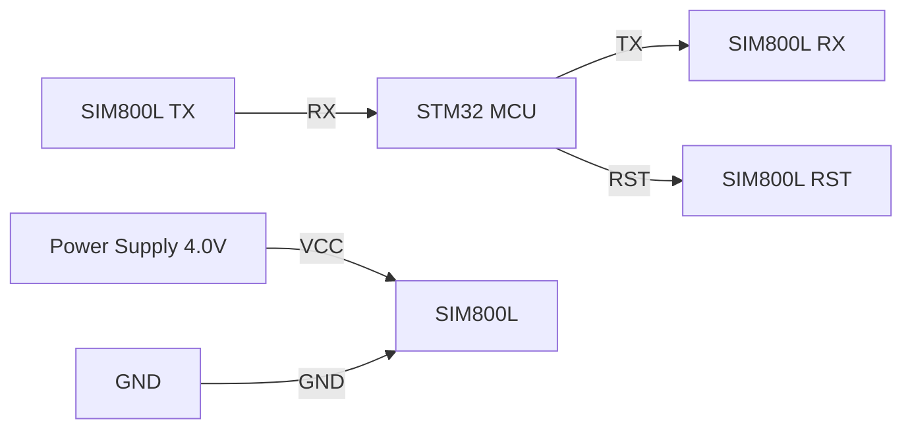

# STM32 GSM/GPRS Modules

## Introduction

GSM (Global System for Mobile Communications) and GPRS (General Packet Radio Service) modules are essential components for IoT and embedded systems that require cellular connectivity. These modules allow STM32 microcontrollers to connect to cellular networks, enabling remote data transmission, SMS messaging, and internet access in areas where Wi-Fi or other connectivity options aren't available.

In this tutorial, we'll explore how to integrate GSM/GPRS modules with STM32 microcontrollers, set up communication between them, and develop applications that leverage cellular connectivity.

## Understanding GSM/GPRS Technology

### What is GSM?

GSM is a standard developed for 2G digital cellular networks primarily used for voice calls and SMS messaging. It's widely adopted globally and provides a reliable foundation for mobile communications.

### What is GPRS?

GPRS extends GSM networks to enable packet-switched data transmission, essentially allowing internet connectivity. It's often referred to as 2.5G technology, bridging the gap between 2G and 3G networks.

### Common GSM/GPRS Modules for STM32

Several modules are compatible with STM32 microcontrollers:

- **SIM800L/SIM800C**: Small, low-cost modules with basic GSM/GPRS functionality
- **SIM900/SIM900A**: More powerful modules with enhanced features
- **SIM7600**: Advanced modules supporting 2G/3G/4G networks
- **Quectel M95**: Industrial-grade GSM/GPRS module

## Hardware Setup

### Components Required

- STM32 development board (like STM32F4Discovery or Nucleo)
- GSM/GPRS module (SIM800L is recommended for beginners)
- SIM card with active data plan
- Power supply (GSM modules need 3.7-4.2V and can draw up to 2A during transmission)
- Connecting wires
- Level shifter (if your STM32 is 3.3V and GSM module is 5V)
- Antenna (most modules come with one)

### Connection Diagram

Let's visualize the typical connection between an STM32 and a SIM800L module:



### Wiring Table

| STM32 Pin | GSM Module Pin | Notes |
|-----------|----------------|-------|
| PA2 (USART2_TX) | RX | Serial communication |
| PA3 (USART2_RX) | TX | Serial communication |
| PA4 | RST | Module reset (optional) |
| GND | GND | Common ground |
| - | VCC | Connect to external 3.7-4.2V power supply |

**Important:** GSM modules can draw high current peaks (up to 2A) during transmission. Do NOT power them directly from the STM32's power pins. Use a separate power supply capable of handling these current requirements.

## Software Setup

### Configuring UART Communication

We'll use UART to communicate between the STM32 and the GSM module. Here's how to configure it:

```c
/* Configure UART for GSM module communication */
void GSM_UART_Init(void)
{
  /* Enable USART2 clock */
  RCC->APB1ENR |= RCC_APB1ENR_USART2EN;
  
  /* Enable GPIOA clock */
  RCC->AHB1ENR |= RCC_AHB1ENR_GPIOAEN;
  
  /* Configure PA2 and PA3 as alternate function */
  GPIOA->MODER &= ~(GPIO_MODER_MODER2 | GPIO_MODER_MODER3);
  GPIOA->MODER |= (GPIO_MODER_MODER2_1 | GPIO_MODER_MODER3_1);
  
  /* Set alternate function to USART2 (AF7) */
  GPIOA->AFR[0] &= ~(GPIO_AFRL_AFRL2 | GPIO_AFRL_AFRL3);
  GPIOA->AFR[0] |= (7 << (4 * 2)) | (7 << (4 * 3));
  
  /* Configure USART2: 9600 baud, 8-bit data, no parity, 1 stop bit */
  USART2->BRR = SystemCoreClock / 9600;
  USART2->CR1 = USART_CR1_TE | USART_CR1_RE | USART_CR1_UE;
}
```

Or using HAL library:

```c
UART_HandleTypeDef huart2;

void GSM_UART_Init(void)
{
  huart2.Instance = USART2;
  huart2.Init.BaudRate = 9600;
  huart2.Init.WordLength = UART_WORDLENGTH_8B;
  huart2.Init.StopBits = UART_STOPBITS_1;
  huart2.Init.Parity = UART_PARITY_NONE;
  huart2.Init.Mode = UART_MODE_TX_RX;
  huart2.Init.HwFlowCtl = UART_HWCONTROL_NONE;
  
  HAL_UART_Init(&huart2);
}
```

### AT Commands Basics

GSM modules communicate via AT commands - a set of text-based instructions. Here are some essential commands:

- `AT` - Test command, should return "OK"
- `AT+CPIN?` - Check if SIM card is ready
- `AT+CSQ` - Check signal quality
- `AT+CREG?` - Check network registration status
- `AT+CGATT=1` - Attach to GPRS service
- `AT+CSTT="APN","username","password"` - Set APN for GPRS connection
- `AT+CIICR` - Bring up wireless connection
- `AT+CIFSR` - Get local IP address

### Sending AT Commands

Let's create functions to send AT commands and receive responses:

```c
/* Send AT command to GSM module */
void GSM_SendCommand(char* command)
{
  HAL_UART_Transmit(&huart2, (uint8_t*)command, strlen(command), 1000);
  HAL_UART_Transmit(&huart2, (uint8_t*)"\r
", 2, 100);
}

/* Receive response from GSM module with timeout */
void GSM_ReceiveResponse(char* buffer, uint16_t size, uint32_t timeout)
{
  uint32_t startTime = HAL_GetTick();
  uint16_t index = 0;
  
  memset(buffer, 0, size);
  
  while((HAL_GetTick() - startTime) < timeout && index < size - 1)
  {
    uint8_t c;
    if(HAL_UART_Receive(&huart2, &c, 1, 10) == HAL_OK)
    {
      buffer[index++] = c;
      
      /* Check if response is complete */
      if(index >= 4 && 
         (strstr(buffer, "OK\r
") || 
          strstr(buffer, "ERROR\r
") ||
          strstr(buffer, "> ")))
      {
        break;
      }
    }
  }
  
  buffer[index] = '\0';
}

/* Send command and wait for response */
bool GSM_SendCommandWithResponse(char* command, char* response, uint32_t timeout)
{
  char buffer[256];
  
  GSM_SendCommand(command);
  GSM_ReceiveResponse(buffer, sizeof(buffer), timeout);
  
  return (strstr(buffer, response) != NULL);
}
```

## Basic GSM Applications

### Initializing the GSM Module

Here's a complete initialization sequence:

```c
bool GSM_Init(void)
{
  bool status = false;
  char buffer[256];
  
  /* Initialize UART */
  GSM_UART_Init();
  
  /* Reset module if connected to reset pin */
  // GSM_HardReset();
  
  /* Test AT command */
  for(int i = 0; i < 5; i++)
  {
    if(GSM_SendCommandWithResponse("AT", "OK", 1000))
    {
      status = true;
      break;
    }
    HAL_Delay(1000);
  }
  
  if(!status) return false;
  
  /* Check SIM card */
  if(!GSM_SendCommandWithResponse("AT+CPIN?", "READY", 2000))
    return false;
  
  /* Wait for network registration */
  for(int i = 0; i < 20; i++)
  {
    GSM_SendCommand("AT+CREG?");
    GSM_ReceiveResponse(buffer, sizeof(buffer), 1000);
    
    if(strstr(buffer, "+CREG: 0,1") || strstr(buffer, "+CREG: 0,5"))
    {
      status = true;
      break;
    }
    
    HAL_Delay(1000);
  }
  
  if(!status) return false;
  
  /* Check signal quality */
  GSM_SendCommand("AT+CSQ");
  GSM_ReceiveResponse(buffer, sizeof(buffer), 1000);
  
  /* Disable echo */
  GSM_SendCommandWithResponse("ATE0", "OK", 1000);
  
  return true;
}
```

### Sending SMS Messages

Here's how to send an SMS message:

```c
bool GSM_SendSMS(char* number, char* message)
{
  char buffer[256];
  
  /* Set SMS mode to text */
  if(!GSM_SendCommandWithResponse("AT+CMGF=1", "OK", 1000))
    return false;
  
  /* Send phone number */
  sprintf(buffer, "AT+CMGS=\"%s\"", number);
  GSM_SendCommand(buffer);
  
  /* Wait for '>' prompt */
  if(!GSM_WaitForPrompt(5000))
    return false;
  
  /* Send message content */
  HAL_UART_Transmit(&huart2, (uint8_t*)message, strlen(message), 1000);
  
  /* Send CTRL+Z to end message */
  uint8_t ctrlZ = 0x1A;
  HAL_UART_Transmit(&huart2, &ctrlZ, 1, 100);
  
  /* Wait for confirmation */
  GSM_ReceiveResponse(buffer, sizeof(buffer), 10000);
  
  return (strstr(buffer, "+CMGS:") != NULL);
}
```

Example usage:

```c
if(GSM_Init())
{
  GSM_SendSMS("+1234567890", "Hello from STM32!");
}
```

### Receiving SMS Messages

To receive SMS messages:

```c
void GSM_ReadAllSMS(void)
{
  char buffer[512];
  
  /* Set SMS mode to text */
  GSM_SendCommandWithResponse("AT+CMGF=1", "OK", 1000);
  
  /* List all SMS messages */
  GSM_SendCommand("AT+CMGL=\"ALL\"");
  GSM_ReceiveResponse(buffer, sizeof(buffer), 5000);
  
  /* Parse and process messages */
  printf("Received messages:\r
%s\r
", buffer);
}
```

### Making Voice Calls

To initiate a voice call:

```c
bool GSM_MakeCall(char* number)
{
  char buffer[64];
  
  /* Dial number */
  sprintf(buffer, "ATD%s;", number);
  return GSM_SendCommandWithResponse(buffer, "OK", 5000);
}

/* To hang up a call */
bool GSM_HangupCall(void)
{
  return GSM_SendCommandWithResponse("ATH", "OK", 1000);
}
```

## GPRS Internet Connectivity

### Connecting to GPRS Network

To establish a GPRS connection:

```c
bool GSM_ConnectGPRS(char* apn, char* username, char* password)
{
  char buffer[128];
  
  /* Attach to GPRS service */
  if(!GSM_SendCommandWithResponse("AT+CGATT=1", "OK", 10000))
    return false;
  
  /* Set APN, username and password */
  sprintf(buffer, "AT+CSTT=\"%s\",\"%s\",\"%s\"", apn, username, password);
  if(!GSM_SendCommandWithResponse(buffer, "OK", 10000))
    return false;
  
  /* Bring up wireless connection */
  if(!GSM_SendCommandWithResponse("AT+CIICR", "OK", 10000))
    return false;
  
  /* Get local IP address */
  GSM_SendCommand("AT+CIFSR");
  GSM_ReceiveResponse(buffer, sizeof(buffer), 1000);
  
  /* Check if we got an IP address */
  return (strchr(buffer, '.') != NULL);
}
```

Example usage with a common APN:

```c
/* Connect to mobile internet using provider's APN */
GSM_ConnectGPRS("internet", "", "");
```

### HTTP GET Request

Performing an HTTP GET request:

```c
bool GSM_HTTPGet(char* server, uint16_t port, char* path, char* response, uint16_t responseSize)
{
  char buffer[128];
  bool status = false;
  
  /* Start multi-connection mode */
  if(!GSM_SendCommandWithResponse("AT+CIPMUX=0", "OK", 1000))
    return false;
  
  /* Start TCP connection with server */
  sprintf(buffer, "AT+CIPSTART=\"TCP\",\"%s\",%d", server, port);
  if(!GSM_SendCommandWithResponse(buffer, "CONNECT OK", 10000))
    return false;
  
  /* Build HTTP GET request */
  sprintf(buffer, "GET %s HTTP/1.1\r
Host: %s\r
Connection: close\r
\r
", path, server);
  
  /* Send data length command */
  sprintf(response, "AT+CIPSEND=%d", strlen(buffer));
  GSM_SendCommand(response);
  if(!GSM_WaitForPrompt(5000))
    goto cleanup;
  
  /* Send HTTP request */
  GSM_SendCommand(buffer);
  
  /* Receive response */
  memset(response, 0, responseSize);
  uint16_t index = 0;
  uint32_t startTime = HAL_GetTick();
  
  while((HAL_GetTick() - startTime) < 20000 && index < responseSize - 1)
  {
    uint8_t c;
    if(HAL_UART_Receive(&huart2, &c, 1, 10) == HAL_OK)
    {
      response[index++] = c;
      
      /* Check for connection close */
      if(index >= 12 && strstr(&response[index-12], "CLOSED\r
"))
      {
        status = true;
        break;
      }
    }
  }
  
  response[index] = '\0';
  
cleanup:
  /* Close connection if still open */
  GSM_SendCommandWithResponse("AT+CIPCLOSE", "OK", 1000);
  
  return status;
}
```

Example usage:

```c
char response[1024];

if(GSM_ConnectGPRS("internet", "", ""))
{
  if(GSM_HTTPGet("example.com", 80, "/", response, sizeof(response)))
  {
    printf("Response received:\r
%s\r
", response);
  }
}
```

### HTTP POST Request

Sending an HTTP POST request:

```c
bool GSM_HTTPPost(char* server, uint16_t port, char* path, char* data, char* response, uint16_t responseSize)
{
  char buffer[256];
  bool status = false;
  
  /* Start single connection mode */
  if(!GSM_SendCommandWithResponse("AT+CIPMUX=0", "OK", 1000))
    return false;
  
  /* Start TCP connection with server */
  sprintf(buffer, "AT+CIPSTART=\"TCP\",\"%s\",%d", server, port);
  if(!GSM_SendCommandWithResponse(buffer, "CONNECT OK", 10000))
    return false;
  
  /* Build HTTP POST request */
  char request[512];
  sprintf(request, "POST %s HTTP/1.1\r
Host: %s\r
Content-Type: application/x-www-form-urlencoded\r
Content-Length: %d\r
Connection: close\r
\r
%s", 
          path, server, strlen(data), data);
  
  /* Send data length command */
  sprintf(buffer, "AT+CIPSEND=%d", strlen(request));
  GSM_SendCommand(buffer);
  if(!GSM_WaitForPrompt(5000))
    goto cleanup;
  
  /* Send HTTP request */
  GSM_SendCommand(request);
  
  /* Receive response */
  memset(response, 0, responseSize);
  uint16_t index = 0;
  uint32_t startTime = HAL_GetTick();
  
  while((HAL_GetTick() - startTime) < 20000 && index < responseSize - 1)
  {
    uint8_t c;
    if(HAL_UART_Receive(&huart2, &c, 1, 10) == HAL_OK)
    {
      response[index++] = c;
      
      /* Check for connection close */
      if(index >= 12 && strstr(&response[index-12], "CLOSED\r
"))
      {
        status = true;
        break;
      }
    }
  }
  
  response[index] = '\0';
  
cleanup:
  /* Close connection if still open */
  GSM_SendCommandWithResponse("AT+CIPCLOSE", "OK", 1000);
  
  return status;
}
```

Example usage:

```c
char response[1024];
char postData[] = "sensor=temperature&value=25.6&unit=celsius";

if(GSM_ConnectGPRS("internet", "", ""))
{
  if(GSM_HTTPPost("example.com", 80, "/upload.php", postData, response, sizeof(response)))
  {
    printf("Response received:\r
%s\r
", response);
  }
}
```

## Real-World Applications

### Weather Station with SMS Alerts

Here's a simple application that monitors temperature and sends SMS alerts when it exceeds a threshold:

```c
float readTemperature(void)
{
  /* Read from your temperature sensor - this is just a placeholder */
  uint16_t adcValue = HAL_ADC_GetValue(&hadc1);
  return (adcValue * 3.3 / 4096) * 100; /* Convert to Celsius */
}

void MonitorTemperature(void)
{
  /* Initialize GSM module */
  if(!GSM_Init())
  {
    printf("Failed to initialize GSM module\r
");
    return;
  }
  
  float currentTemp;
  float alertThreshold = 30.0f; /* Alert if temperature exceeds 30°C */
  bool alertSent = false;
  
  while(1)
  {
    currentTemp = readTemperature();
    printf("Current temperature: %.1f°C\r
", currentTemp);
    
    /* Send alert SMS if temperature exceeds threshold */
    if(currentTemp > alertThreshold && !alertSent)
    {
      char message[64];
      sprintf(message, "ALERT: Temperature is %.1f°C, exceeding threshold of %.1f°C", 
              currentTemp, alertThreshold);
      
      if(GSM_SendSMS("+1234567890", message))
      {
        printf("Alert SMS sent\r
");
        alertSent = true;
      }
    }
    
    /* Reset alert flag if temperature drops below threshold */
    if(currentTemp < (alertThreshold - 2.0f) && alertSent)
    {
      alertSent = false;
    }
    
    HAL_Delay(60000); /* Check every minute */
  }
}
```

### Remote Data Logger

This application logs sensor data to a remote server periodically:

```c
void DataLoggerTask(void)
{
  /* Initialize GSM module */
  if(!GSM_Init())
  {
    printf("Failed to initialize GSM module\r
");
    return;
  }
  
  /* Connect to GPRS network */
  if(!GSM_ConnectGPRS("internet", "", ""))
  {
    printf("Failed to connect to GPRS\r
");
    return;
  }
  
  char postData[128];
  char response[256];
  
  while(1)
  {
    /* Read sensor data */
    float temperature = readTemperature();
    float humidity = readHumidity();
    float pressure = readPressure();
    
    /* Prepare data for HTTP POST */
    sprintf(postData, "temp=%.1f&humidity=%.1f&pressure=%.1f", 
            temperature, humidity, pressure);
    
    /* Send data to server */
    if(GSM_HTTPPost("yourserver.com", 80, "/logger.php", postData, response, sizeof(response)))
    {
      printf("Data sent successfully\r
");
    }
    else
    {
      printf("Failed to send data\r
");
      
      /* Reconnect to GPRS if connection was lost */
      GSM_ConnectGPRS("internet", "", "");
    }
    
    /* Wait for next logging interval */
    HAL_Delay(300000); /* Log data every 5 minutes */
  }
}
```

### GPS Tracker with GSM

Combining a GPS module with GSM for a location tracker:

```c
/* Structure to hold GPS data */
typedef struct {
  float latitude;
  float longitude;
  float speed;
  char time[20];
  char date[20];
} GPS_Data;

/* Parse GPS data from NMEA sentence */
bool GPS_ParseData(char* nmea, GPS_Data* data)
{
  /* Simplified parser for GPRMC sentence */
  if(strncmp(nmea, "$GPRMC,", 7) != 0)
    return false;
  
  /* Parse the NMEA string - this is just a placeholder */
  /* In a real application, you would parse the actual NMEA sentence */
  sscanf(nmea, "$GPRMC,%[^,],%*c,%f,%*c,%f,%*c,%f", 
         data->time, &data->latitude, &data->longitude, &data->speed);
  
  return true;
}

void GPSTrackerTask(void)
{
  /* Initialize GSM module */
  if(!GSM_Init())
  {
    printf("Failed to initialize GSM module\r
");
    return;
  }
  
  /* Initialize GPS module on a different UART */
  GPS_Init();
  
  GPS_Data gpsData;
  char smsBuffer[160];
  char serverData[128];
  char response[256];
  
  while(1)
  {
    /* Read and parse GPS data */
    if(GPS_GetPosition(&gpsData))
    {
      printf("Position: %.6f, %.6f\r
", gpsData.latitude, gpsData.longitude);
      
      /* Format location data */
      sprintf(smsBuffer, "Vehicle location: %.6f, %.6f, Speed: %.1f km/h", 
              gpsData.latitude, gpsData.longitude, gpsData.speed);
      
      /* Check for SMS command to request location */
      if(GSM_CheckForSMS("WHERE"))
      {
        /* Send current location as SMS reply */
        GSM_SendSMS("+1234567890", smsBuffer);
      }
      
      /* Send location to server periodically */
      if(HAL_GetTick() % (5 * 60 * 1000) < 100)
      {
        GSM_ConnectGPRS("internet", "", "");
        
        sprintf(serverData, "lat=%.6f&lon=%.6f&speed=%.1f&time=%s", 
                gpsData.latitude, gpsData.longitude, gpsData.speed, gpsData.time);
        
        GSM_HTTPPost("trackingserver.com", 80, "/update.php", serverData, response, sizeof(response));
      }
    }
    
    HAL_Delay(1000);
  }
}
```

## Troubleshooting Common Issues

### Power Supply Problems

GSM modules require a stable power supply capable of handling current spikes:

1. **Voltage Drops**: Use a capacitor (1000μF or more) close to the module's power pins
2. **Brown-outs**: Ensure your power supply can deliver at least 2A
3. **Separate Supply**: Use a separate power supply for the GSM module, not the same as the STM32

### Network Registration Issues

If your module fails to register with the network:

1. **Check SIM Card**: Ensure it's properly inserted and activated
2. **Check Antenna**: Make sure the antenna is connected properly
3. **Check Signal**: Use AT+CSQ command to verify signal strength
4. **Check Provider Restrictions**: Some providers block certain services for M2M SIMs

### AT Command Timeouts

If AT commands time out or fail:

1. **Baud Rate Mismatch**: Verify both STM32 and GSM module are configured for the same baud rate
2. **Buffer Size**: Ensure your receive buffer is large enough
3. **Response Time**: Some commands take longer to execute; increase your timeout

## Advanced Features

### Sleep Mode for Power Saving

GSM modules consume significant power. To conserve battery life:

```c
/* Enter sleep mode */
bool GSM_EnterSleepMode(void)
{
  return GSM_SendCommandWithResponse("AT+CSCLK=1", "OK", 1000);
}

/* Exit sleep mode by sending any AT command */
bool GSM_ExitSleepMode(void)
{
  /* Send AT to wake up module */
  HAL_UART_Transmit(&huart2, (uint8_t*)"AT\r
", 4, 100);
  HAL_Delay(100);
  
  /* Clear any response */
  uint8_t dummy;
  while(HAL_UART_Receive(&huart2, &dummy, 1, 10) == HAL_OK);
  
  /* Send another AT to verify module is awake */
  return GSM_SendCommandWithResponse("AT", "OK", 1000);
}
```

### Using FTP to Transfer Files

Some GSM modules support FTP for file transfers:

```c
bool GSM_UploadFileViaFTP(char* server, char* username, char* password, 
                          char* filename, uint8_t* data, uint16_t dataSize)
{
  char buffer[128];
  
  /* Set bearer profile */
  GSM_SendCommandWithResponse("AT+SAPBR=3,1,\"CONTYPE\",\"GPRS\"", "OK", 1000);
  GSM_SendCommandWithResponse("AT+SAPBR=3,1,\"APN\",\"internet\"", "OK", 1000);
  GSM_SendCommandWithResponse("AT+SAPBR=1,1", "OK", 10000);
  
  /* Initialize FTP service */
  GSM_SendCommandWithResponse("AT+FTPCID=1", "OK", 1000);
  
  /* Set FTP server parameters */
  sprintf(buffer, "AT+FTPSERV=\"%s\"", server);
  GSM_SendCommandWithResponse(buffer, "OK", 1000);
  
  sprintf(buffer, "AT+FTPUN=\"%s\"", username);
  GSM_SendCommandWithResponse(buffer, "OK", 1000);
  
  sprintf(buffer, "AT+FTPPW=\"%s\"", password);
  GSM_SendCommandWithResponse(buffer, "OK", 1000);
  
  /* Set filename and transfer mode (binary) */
  sprintf(buffer, "AT+FTPPUTNAME=\"%s\"", filename);
  GSM_SendCommandWithResponse(buffer, "OK", 1000);
  GSM_SendCommandWithResponse("AT+FTPPUTPATH=\"/\"", "OK", 1000);
  GSM_SendCommandWithResponse("AT+FTPPUT=1", "+FTPPUT: 1,1", 10000);
  
  /* Send file size and start data transfer */
  sprintf(buffer, "AT+FTPPUT=2,%d", dataSize);
  GSM_SendCommand(buffer);
  
  /* Wait for ready prompt */
  GSM_ReceiveResponse(buffer, sizeof(buffer), 5000);
  if(!strstr(buffer, "+FTPPUT: 2,"))
    return false;
  
  /* Send data */
  HAL_UART_Transmit(&huart2, data, dataSize, 10000);
  
  /* Check for success */
  GSM_ReceiveResponse(buffer, sizeof(buffer), 10000);
  
  /* Close FTP session */
  GSM_SendCommandWithResponse("AT+FTPPUT=2,0", "OK", 1000);
  
  /* Close bearer */
  GSM_SendCommandWithResponse("AT+SAPBR=0,1", "OK", 10000);
  
  return true;
}
```

## Summary

In this tutorial, we've covered:

1. The basics of GSM and GPRS technology
2. Hardware setup for connecting STM32 microcontrollers to GSM/GPRS modules
3. Software setup including UART configuration and AT commands
4. Implementation of basic GSM functions like sending/receiving SMS and making calls
5. GPRS internet connectivity for HTTP requests
6. Real-world applications including a weather station, data logger, and GPS tracker
7. Troubleshooting common issues
8. Advanced features like sleep mode and FTP transfers

GSM/GPRS modules provide versatile connectivity options for STM32-based IoT devices, enabling them to communicate in areas without Wi-Fi coverage. While the technology is considered older compared to newer cellular standards like 4G and 5G, it remains widely used for IoT applications due to its global coverage, reliability, and lower power requirements.

## Additional Resources

- [STM32 HAL Documentation](https://www.st.com/resource/en/user_manual/dm00105879-description-of-stm32f4-hal-and-ll-drivers-stmicroelectronics.pdf)
- [SIM800 Series AT Command Manual](https://simcom.ee/documents/SIM800/SIM800%20Series_AT%20Command%20Manual_V1.09.pdf)
- [GSM Association Standards](https://www.gsma.com/specifications/)

## Exercises