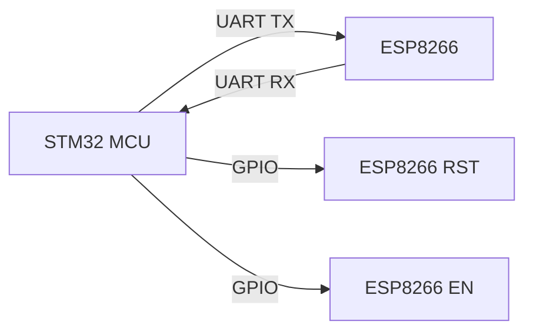
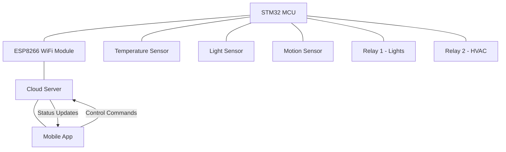

# STM32 WiFi Modules

## Introduction

WiFi connectivity has become an essential feature in modern embedded systems, enabling devices to connect to local networks and the internet. STM32 microcontrollers can be paired with various WiFi modules to create IoT (Internet of Things) devices, remote monitoring systems, and networked applications. This guide will explore the different WiFi connectivity options available for STM32 microcontrollers, how to interface with them, and practical examples to get you started.

## WiFi Module Options for STM32

STM32 microcontrollers can connect to WiFi networks using several approaches:

### 1. Integrated WiFi Solutions

Some STM32 microcontrollers come with built-in wireless capabilities:

- **STM32WB series**: These microcontrollers feature integrated Bluetooth and 802.15.4 wireless capabilities, though not WiFi directly.
- **STM32WL series**: Focused on LoRa and sub-GHz communications.

### 2. External WiFi Modules

The most common approach is to use external WiFi modules that interface with STM32 through common protocols:

- **ESP8266**: Low-cost WiFi module with UART interface
- **ESP32**: More powerful successor to ESP8266 with WiFi and Bluetooth
- **SPWF01SA/SPWF04SA**: ST's own WiFi modules
- **X-NUCLEO-IDW01M1**: WiFi expansion board for STM32 Nucleo boards

### 3. WiFi Network Processors

- **MXCHIP EMW3080**: WiFi module used in several ST development boards

Let's examine each option in more detail.

## Popular WiFi Modules for STM32

### ESP8266

The ESP8266 is one of the most popular and cost-effective WiFi modules for embedded systems.

#### Key Features
- 802.11 b/g/n WiFi
- Integrated TCP/IP stack
- AT command interface (in module firmware)
- UART communication with host MCU
- 3.3V power supply

#### Connecting ESP8266 to STM32

The ESP8266 module typically communicates with STM32 via UART:



#### Basic Connection Diagram

| STM32 Pin | ESP8266 Pin | Function |
|-----------|-------------|----------|
| USART TX  | RX          | Data transmission |
| USART RX  | TX          | Data reception |
| GPIO      | RST         | Reset control (optional) |
| GPIO      | CH_PD/EN    | Module enable (required) |
| 3.3V      | VCC         | Power supply |
| GND       | GND         | Ground |

### ESP32

The ESP32 is a more advanced module with WiFi and Bluetooth capabilities.

#### Key Features
- Dual-core processor
- WiFi 802.11 b/g/n
- Bluetooth 4.2 and BLE
- Rich peripheral set (SPI, I2C, UART, etc.)
- Can be used as a standalone processor or as a coprocessor with STM32

#### Communication Methods
- **UART**: Most common, using AT commands
- **SPI**: Higher speed communication

### X-NUCLEO-IDW01M1

This is an STM32 expansion board featuring the SPWF01SA WiFi module.

#### Key Features
- Full IEEE 802.11 b/g/n connectivity
- STM32 expansion board compatible with Arduino UNO R3 connector
- Integrated TCP/IP stack

## Programming Approaches

There are two main approaches to programming WiFi functionality with STM32:

### 1. AT Command Approach

The most straightforward approach is to use AT commands to communicate with WiFi modules like ESP8266 or ESP32.

#### Example: Connecting to WiFi Network with ESP8266

```c
/* Initialize UART for ESP8266 communication */
void ESP8266_Init(void) {
    /* UART initialization code here */
    
    /* Reset ESP8266 */
    HAL_GPIO_WritePin(ESP_RESET_GPIO_Port, ESP_RESET_Pin, GPIO_PIN_RESET);
    HAL_Delay(100);
    HAL_GPIO_WritePin(ESP_RESET_GPIO_Port, ESP_RESET_Pin, GPIO_PIN_SET);
    HAL_Delay(1000); /* Wait for module to boot */
}

/* Send AT command and wait for response */
bool ESP8266_SendCommand(char* command, char* response, uint32_t timeout) {
    char buffer[256];
    
    /* Clear buffer */
    memset(buffer, 0, sizeof(buffer));
    
    /* Send command */
    HAL_UART_Transmit(&huart2, (uint8_t*)command, strlen(command), 1000);
    
    /* Wait for response */
    uint32_t startTime = HAL_GetTick();
    uint16_t idx = 0;
    
    while (HAL_GetTick() - startTime < timeout) {
        if (HAL_UART_Receive(&huart2, (uint8_t*)&buffer[idx], 1, 10) == HAL_OK) {
            idx++;
            if (strstr(buffer, response) != NULL) {
                return true;
            }
        }
    }
    
    return false;
}

/* Connect to WiFi network */
bool ESP8266_ConnectToAP(char* ssid, char* password) {
    char command[64];
    
    /* Set to station mode */
    if (!ESP8266_SendCommand("AT+CWMODE=1\r
", "OK", 1000)) {
        return false;
    }
    
    /* Connect to AP */
    sprintf(command, "AT+CWJAP=\"%s\",\"%s\"\r
", ssid, password);
    return ESP8266_SendCommand(command, "OK", 10000);
}
```

### 2. STM32Cube Expansion Package

ST provides the X-CUBE-WIFI1 expansion package, which is a software package for STM32Cube. It includes drivers for the SPWF01SA module and example applications.

#### Steps to Use X-CUBE-WIFI1

1. Download and install STM32CubeIDE
2. Download the X-CUBE-WIFI1 package
3. Create a new project or open an example project
4. Configure the WiFi module in the STM32CubeMX interface
5. Generate code and add your application logic

## Practical Example: Weather Station with ESP8266

Let's create a simple weather station that reads temperature and humidity from a DHT11 sensor and sends the data to a web server.

### Hardware Requirements
- STM32 development board (e.g., NUCLEO-F401RE)
- ESP8266 WiFi module
- DHT11 temperature and humidity sensor
- Breadboard and connecting wires

### Software Setup

First, let's set up the required libraries and initializations:

```c
#include "main.h"
#include "dht11.h"  // DHT11 library

UART_HandleTypeDef huart2;  // For ESP8266 communication

float temperature, humidity;
char buffer[256];

/* ESP8266 functions from earlier example */
void ESP8266_Init(void);
bool ESP8266_SendCommand(char* command, char* response, uint32_t timeout);
bool ESP8266_ConnectToAP(char* ssid, char* password);

/* Function to send HTTP GET request */
bool ESP8266_SendHTTPRequest(char* server, int port, char* url, char* data) {
    char command[256];
    
    /* Start TCP connection */
    sprintf(command, "AT+CIPSTART=\"TCP\",\"%s\",%d\r
", server, port);
    if (!ESP8266_SendCommand(command, "OK", 5000)) {
        return false;
    }
    
    /* Prepare HTTP GET request */
    sprintf(buffer, "GET %s?%s HTTP/1.1\r
Host: %s\r
\r
", url, data, server);
    
    /* Send data length command */
    sprintf(command, "AT+CIPSEND=%d\r
", strlen(buffer));
    if (!ESP8266_SendCommand(command, ">", 5000)) {
        return false;
    }
    
    /* Send HTTP request */
    return ESP8266_SendCommand(buffer, "SEND OK", 5000);
}

int main(void) {
    /* MCU initialization */
    HAL_Init();
    SystemClock_Config();
    
    /* Initialize peripherals */
    MX_GPIO_Init();
    MX_USART2_UART_Init();
    
    /* Initialize ESP8266 */
    ESP8266_Init();
    
    /* Connect to WiFi network */
    ESP8266_ConnectToAP("YourSSID", "YourPassword");
    
    while (1) {
        /* Read temperature and humidity */
        if (DHT11_Read(&temperature, &humidity) == HAL_OK) {
            /* Format data string */
            sprintf(buffer, "temp=%.1f&humidity=%.1f", temperature, humidity);
            
            /* Send data to server */
            ESP8266_SendHTTPRequest("example.com", 80, "/update", buffer);
        }
        
        /* Wait 5 minutes before next reading */
        HAL_Delay(300000);
    }
}
```

### Explanation

1. The code initializes the ESP8266 module and connects to your WiFi network
2. It reads temperature and humidity from the DHT11 sensor
3. The data is formatted into a query string
4. An HTTP GET request is sent to a web server
5. The process repeats every 5 minutes

## Advanced Topic: Using MQTT for IoT Applications

For more sophisticated IoT applications, MQTT (Message Queuing Telemetry Transport) is a better protocol than simple HTTP requests. MQTT is lightweight, efficient, and designed for constrained devices.

### MQTT with STM32 and ESP8266

Here's a basic example of how to publish MQTT messages using the ESP8266:

```c
/* Connect to MQTT broker */
bool ESP8266_ConnectMQTT(char* broker, int port, char* clientID) {
    char command[128];
    
    /* Connect to broker */
    sprintf(command, "AT+CIPSTART=\"TCP\",\"%s\",%d\r
", broker, port);
    if (!ESP8266_SendCommand(command, "OK", 5000)) {
        return false;
    }
    
    /* Prepare MQTT CONNECT packet */
    uint8_t connectPacket[32];
    uint16_t packetLength = 0;
    
    /* Fixed header */
    connectPacket[packetLength++] = 0x10;  // CONNECT packet type
    
    /* We'll calculate remaining length later */
    uint16_t remainingLengthPos = packetLength++;
    
    /* Variable header */
    connectPacket[packetLength++] = 0x00;  // Protocol name length MSB
    connectPacket[packetLength++] = 0x04;  // Protocol name length LSB
    connectPacket[packetLength++] = 'M';
    connectPacket[packetLength++] = 'Q';
    connectPacket[packetLength++] = 'T';
    connectPacket[packetLength++] = 'T';
    connectPacket[packetLength++] = 0x04;  // Protocol version
    connectPacket[packetLength++] = 0x02;  // Connect flags (clean session)
    connectPacket[packetLength++] = 0x00;  // Keep alive MSB (60 seconds)
    connectPacket[packetLength++] = 0x3C;  // Keep alive LSB
    
    /* Client ID */
    uint16_t clientIDLength = strlen(clientID);
    connectPacket[packetLength++] = (clientIDLength >> 8) & 0xFF;  // Client ID length MSB
    connectPacket[packetLength++] = clientIDLength & 0xFF;         // Client ID length LSB
    
    /* Copy client ID */
    memcpy(&connectPacket[packetLength], clientID, clientIDLength);
    packetLength += clientIDLength;
    
    /* Update remaining length */
    connectPacket[remainingLengthPos] = packetLength - 2;
    
    /* Send packet size command */
    sprintf(command, "AT+CIPSEND=%d\r
", packetLength);
    if (!ESP8266_SendCommand(command, ">", 5000)) {
        return false;
    }
    
    /* Send MQTT packet */
    HAL_UART_Transmit(&huart2, connectPacket, packetLength, 1000);
    
    /* Wait for CONNACK */
    if (ESP8266_WaitForBytes(5000)) {
        return true;
    }
    
    return false;
}

/* Publish MQTT message */
bool ESP8266_PublishMQTT(char* topic, char* message) {
    char command[128];
    
    uint16_t topicLength = strlen(topic);
    uint16_t messageLength = strlen(message);
    uint16_t remainingLength = 2 + topicLength + messageLength;
    
    uint8_t publishPacket[256];
    uint16_t packetLength = 0;
    
    /* Fixed header */
    publishPacket[packetLength++] = 0x30;  // PUBLISH packet type
    publishPacket[packetLength++] = remainingLength;  // Remaining length
    
    /* Topic */
    publishPacket[packetLength++] = (topicLength >> 8) & 0xFF;  // Topic length MSB
    publishPacket[packetLength++] = topicLength & 0xFF;         // Topic length LSB
    memcpy(&publishPacket[packetLength], topic, topicLength);
    packetLength += topicLength;
    
    /* Message */
    memcpy(&publishPacket[packetLength], message, messageLength);
    packetLength += messageLength;
    
    /* Send packet size command */
    sprintf(command, "AT+CIPSEND=%d\r
", packetLength);
    if (!ESP8266_SendCommand(command, ">", 5000)) {
        return false;
    }
    
    /* Send MQTT packet */
    HAL_UART_Transmit(&huart2, publishPacket, packetLength, 1000);
    
    return ESP8266_SendCommand("", "SEND OK", 5000);
}
```

Note: This is a simplified implementation. A real-world application would require more robust error handling and state management.

## Using the HAL Library for WiFi Communication

The STM32 HAL (Hardware Abstraction Layer) library provides a set of functions that simplify the communication with peripherals. Here's how to use HAL functions for UART communication with WiFi modules:

```c
/* Receive data with timeout */
HAL_StatusTypeDef ESP8266_ReceiveData(char* buffer, uint16_t size, uint32_t timeout) {
    return HAL_UART_Receive(&huart2, (uint8_t*)buffer, size, timeout);
}

/* Transmit data */
HAL_StatusTypeDef ESP8266_TransmitData(char* data) {
    return HAL_UART_Transmit(&huart2, (uint8_t*)data, strlen(data), 1000);
}

/* Receive data with interrupt */
void ESP8266_ReceiveIT(char* buffer, uint16_t size) {
    HAL_UART_Receive_IT(&huart2, (uint8_t*)buffer, size);
}

/* UART RX complete callback */
void HAL_UART_RxCpltCallback(UART_HandleTypeDef *huart) {
    if (huart->Instance == USART2) {
        /* Process received data */
        // Your data processing code here
        
        /* Restart interrupt reception */
        ESP8266_ReceiveIT(rxBuffer, RX_BUFFER_SIZE);
    }
}
```

## Using DMA for More Efficient Communication

For more efficient communication, especially when dealing with large amounts of data, Direct Memory Access (DMA) can be used:

```c
/* Start DMA reception */
void ESP8266_ReceiveDMA(char* buffer, uint16_t size) {
    HAL_UART_Receive_DMA(&huart2, (uint8_t*)buffer, size);
}

/* Start DMA transmission */
void ESP8266_TransmitDMA(char* data, uint16_t size) {
    HAL_UART_Transmit_DMA(&huart2, (uint8_t*)data, size);
}

/* DMA reception complete callback */
void HAL_UART_RxCpltCallback(UART_HandleTypeDef *huart) {
    if (huart->Instance == USART2) {
        /* Process received data */
        // Your data processing code here
        
        /* Restart DMA reception */
        ESP8266_ReceiveDMA(rxBuffer, RX_BUFFER_SIZE);
    }
}
```

## Real-World Application: Home Automation System

Let's design a simple home automation system using STM32 and WiFi connectivity:



### Key Components

1. **STM32 Microcontroller**: The brain of the system
2. **ESP8266 WiFi Module**: Provides internet connectivity
3. **Sensors**: Temperature, light, and motion detection
4. **Relays**: To control lights and HVAC system
5. **Cloud Server**: For remote monitoring and control
6. **Mobile App**: User interface for the system

### Implementation Approach

1. STM32 reads sensor data at regular intervals
2. Data is processed and decisions are made locally (e.g., turn on lights if motion detected)
3. Status updates are sent to the cloud server via MQTT
4. The mobile app displays current status and allows manual control
5. Control commands from the app are sent to the STM32 via the cloud server

## Troubleshooting WiFi Connectivity

When working with WiFi modules and STM32, you might encounter various issues. Here are some common problems and their solutions:

### 1. Connection Failures

**Symptoms:**
- Module doesn't respond to AT commands
- Cannot connect to WiFi network

**Solutions:**
- Check power supply (ESP8266 needs stable 3.3V)
- Verify wiring connections
- Check UART baud rate settings
- Ensure correct WiFi credentials
- Try resetting the module

### 2. Communication Errors

**Symptoms:**
- Garbled data received from WiFi module
- Random characters in responses

**Solutions:**
- Verify baud rate settings
- Check for buffer overflow
- Ensure proper line termination in commands
- Add delay between commands
- Check for ground loops in your circuit

### 3. Intermittent Connectivity

**Symptoms:**
- Connection drops randomly
- Data transmission failures

**Solutions:**
- Improve power supply stability
- Reduce interference (keep WiFi module away from high-frequency signals)
- Implement reconnection mechanism in software
- Add error checking and retry logic

## Summary

STM32 microcontrollers can be connected to WiFi networks using various modules, with the ESP8266/ESP32 being the most popular and cost-effective options. The communication is typically done via UART using AT commands, although more advanced approaches using SPI or dedicated libraries are also possible.

The key steps for implementing WiFi connectivity with STM32 are:

1. Select an appropriate WiFi module based on your requirements
2. Establish hardware connection (wiring)
3. Implement communication protocol (usually AT commands over UART)
4. Connect to WiFi network
5. Implement application-specific protocols (HTTP, MQTT, etc.)
6. Handle error conditions and reconnection scenarios

With WiFi connectivity, STM32 microcontrollers can be used in a wide range of IoT applications, from simple sensor nodes to complex control systems.

## Additional Resources

Here are some resources to help you dive deeper into STM32 WiFi connectivity:

### Documentation
- [STM32 HAL Documentation](https://www.st.com/resource/en/user_manual/dm00105879-description-of-stm32f4-hal-and-ll-drivers-stmicroelectronics.pdf)
- [ESP8266 AT Command Reference](https://www.espressif.com/sites/default/files/documentation/4a-esp8266_at_instruction_set_en.pdf)

### Tools
- STM32CubeIDE: Integrated development environment for STM32
- STM32CubeMX: Configuration and code generation tool

### Libraries
- X-CUBE-WIFI1: STM32Cube expansion package for WiFi connectivity
- MQTT Client libraries for embedded systems

## Exercises

To enhance your understanding of STM32 WiFi connectivity, try these exercises:

1. **Basic Connectivity**:
   Connect an ESP8266 module to an STM32 development board and establish a WiFi connection.

2. **Web Server**:
   Create a simple web server on the ESP8266 that displays sensor data from the STM32.

3. **Data Logger**:
   Develop a system that reads sensor data and uploads it to a cloud service like ThingSpeak.

4. **Remote Control**:
   Build a remote-controlled device that can be operated through a web interface.

5. **MQTT Communication**:
   Implement an MQTT client on the STM32 to publish sensor data and subscribe to control commands.