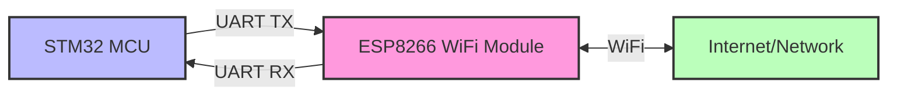

# STM32 ESP8266 Interface

## Introduction

The STM32 microcontroller family offers powerful processing capabilities, while the ESP8266 provides cost-effective WiFi connectivity. Combining these two components creates a versatile platform for Internet of Things (IoT) applications. This tutorial will guide you through interfacing an STM32 microcontroller with an ESP8266 WiFi module, enabling your STM32 projects to communicate over WiFi networks.

## Prerequisites

Before starting, ensure you have:
- An STM32 development board (F4, F3, or F1 series recommended)
- An ESP8266 module (ESP-01, ESP-01S, or NodeMCU)
- STM32CubeIDE or similar development environment
- UART to USB converter (if using ESP-01/ESP-01S)
- Jumper wires
- 3.3V power supply (ESP8266 is NOT 5V tolerant)

## How STM32 and ESP8266 Communicate

The STM32 and ESP8266 communicate primarily through UART (Universal Asynchronous Receiver-Transmitter) using AT commands. Here's a high-level overview of the communication flow:



## Hardware Connection

Connect the ESP8266 to your STM32 board as follows:

| ESP8266 Pin | STM32 Pin    | Function         |
|-------------|--------------|------------------|
| VCC         | 3.3V         | Power            |
| GND         | GND          | Ground           |
| TX          | RX (USART2)  | Data from ESP8266 to STM32 |
| RX          | TX (USART2)  | Data from STM32 to ESP8266 |
| CH_PD/EN    | 3.3V         | Chip Enable      |
| RST         | Any GPIO Pin | Reset (optional) |

**Important**: The ESP8266 operates at 3.3V logic levels. Do not connect it to 5V, as this will damage the module. If your STM32 board operates at 5V logic, you'll need a level shifter.

## Software Implementation

### 1. Configuring UART on STM32

First, we need to configure the UART peripheral on the STM32. This example uses STM32CubeIDE and the HAL library:

```c
// UART handle definition
UART_HandleTypeDef huart2; // For STM32-ESP8266 communication

void UART_Init(void)
{
  huart2.Instance = USART2;
  huart2.Init.BaudRate = 115200;
  huart2.Init.WordLength = UART_WORDLENGTH_8B;
  huart2.Init.StopBits = UART_STOPBITS_1;
  huart2.Init.Parity = UART_PARITY_NONE;
  huart2.Init.Mode = UART_MODE_TX_RX;
  huart2.Init.HwFlowCtl = UART_HWCONTROL_NONE;
  huart2.Init.OverSampling = UART_OVERSAMPLING_16;
  
  if(HAL_UART_Init(&huart2) != HAL_OK)
  {
    Error_Handler();
  }
}
```

### 2. ESP8266 AT Command Helper Functions

Create helper functions to send AT commands to the ESP8266 and receive responses:

```c
#include <string.h>
#include <stdio.h>

#define ESP8266_TIMEOUT 5000 // Response timeout in milliseconds
#define BUFFER_SIZE 512

char rxBuffer[BUFFER_SIZE];
uint8_t rxIndex = 0;

// Send AT command to ESP8266
void ESP8266_SendCommand(char *command)
{
  HAL_UART_Transmit(&huart2, (uint8_t*)command, strlen(command), 1000);
  HAL_UART_Transmit(&huart2, (uint8_t*)"\r
", 2, 100);
}

// Receive response from ESP8266 with timeout
HAL_StatusTypeDef ESP8266_ReceiveResponse(uint32_t timeout)
{
  uint8_t ch;
  uint32_t startTime = HAL_GetTick();
  
  // Clear buffer
  memset(rxBuffer, 0, BUFFER_SIZE);
  rxIndex = 0;
  
  // Receive characters until timeout
  while((HAL_GetTick() - startTime) < timeout)
  {
    if(HAL_UART_Receive(&huart2, &ch, 1, 10) == HAL_OK)
    {
      rxBuffer[rxIndex++] = ch;
      
      // Check if we've received "OK" or "ERROR"
      if(rxIndex > 4)
      {
        if(strstr(rxBuffer, "OK") || strstr(rxBuffer, "ERROR"))
        {
          return HAL_OK;
        }
      }
      
      // Prevent buffer overflow
      if(rxIndex >= BUFFER_SIZE - 1)
      {
        rxIndex = BUFFER_SIZE - 1;
      }
    }
  }
  
  return HAL_TIMEOUT;
}

// Combined function to send command and wait for response
HAL_StatusTypeDef ESP8266_SendCommandWithResponse(char *command, uint32_t timeout)
{
  ESP8266_SendCommand(command);
  return ESP8266_ReceiveResponse(timeout);
}
```

### 3. Initializing the ESP8266

Now let's initialize the ESP8266 and connect it to a WiFi network:

```c
HAL_StatusTypeDef ESP8266_Init(void)
{
  // Reset module
  if(ESP8266_SendCommandWithResponse("AT+RST", 2000) != HAL_OK)
    return HAL_ERROR;
  HAL_Delay(1000); // Wait for reboot
  
  // Test AT command
  if(ESP8266_SendCommandWithResponse("AT", 1000) != HAL_OK)
    return HAL_ERROR;
  
  // Set to station mode
  if(ESP8266_SendCommandWithResponse("AT+CWMODE=1", 1000) != HAL_OK)
    return HAL_ERROR;
  
  return HAL_OK;
}

HAL_StatusTypeDef ESP8266_ConnectToAP(char *ssid, char *password)
{
  char command[BUFFER_SIZE];
  
  // Format command
  sprintf(command, "AT+CWJAP=\"%s\",\"%s\"", ssid, password);
  
  // Connect to AP (longer timeout for connection)
  return ESP8266_SendCommandWithResponse(command, 20000);
}
```

### 4. Establishing a TCP Connection

After connecting to WiFi, we can establish TCP connections:

```c
HAL_StatusTypeDef ESP8266_EstablishTCPConnection(char *server, uint16_t port)
{
  char command[BUFFER_SIZE];
  
  // Enable multiple connections
  if(ESP8266_SendCommandWithResponse("AT+CIPMUX=1", 1000) != HAL_OK)
    return HAL_ERROR;
  
  // Connect to server
  sprintf(command, "AT+CIPSTART=0,\"TCP\",\"%s\",%d", server, port);
  return ESP8266_SendCommandWithResponse(command, 10000);
}
```

### 5. Sending Data Over TCP

Once connected, we can send data:

```c
HAL_StatusTypeDef ESP8266_SendData(char *data, uint16_t length)
{
  char command[BUFFER_SIZE];
  
  // Prepare to send data
  sprintf(command, "AT+CIPSEND=0,%d", length);
  if(ESP8266_SendCommandWithResponse(command, 1000) != HAL_OK)
    return HAL_ERROR;
  
  // Send actual data
  HAL_UART_Transmit(&huart2, (uint8_t*)data, length, 1000);
  
  // Wait for response
  return ESP8266_ReceiveResponse(5000);
}
```

### 6. Receiving Data

To receive data, we'll need to implement interrupt-based UART reception. This is more complex, but here's a simplified approach:

```c
// In your main.c file, add these variables
volatile uint8_t uartRxBuffer[BUFFER_SIZE];
volatile uint8_t uartRxData;
volatile uint16_t uartRxIndex = 0;
volatile uint8_t dataReceived = 0;

// Start reception in your initialization
void StartUartReception(void)
{
  // Enable UART receive interrupt
  HAL_UART_Receive_IT(&huart2, (uint8_t*)&uartRxData, 1);
}

// Handle UART interrupt
void HAL_UART_RxCpltCallback(UART_HandleTypeDef *huart)
{
  if(huart->Instance == USART2)
  {
    // Store received byte
    uartRxBuffer[uartRxIndex++] = uartRxData;
    
    // Check for data pattern like "+IPD," which indicates data from ESP8266
    if(uartRxIndex >= 5 && 
       uartRxBuffer[uartRxIndex-5] == '+' && 
       uartRxBuffer[uartRxIndex-4] == 'I' && 
       uartRxBuffer[uartRxIndex-3] == 'P' && 
       uartRxBuffer[uartRxIndex-2] == 'D' && 
       uartRxBuffer[uartRxIndex-1] == ',')
    {
      dataReceived = 1;
    }
    
    // Prevent buffer overflow
    if(uartRxIndex >= BUFFER_SIZE - 1)
    {
      uartRxIndex = 0;
    }
    
    // Restart reception
    HAL_UART_Receive_IT(&huart2, (uint8_t*)&uartRxData, 1);
  }
}

// Process received data in your main loop
void ProcessReceivedData(void)
{
  if(dataReceived)
  {
    // Parse and process data here
    // ...
    
    // Reset flags and buffer
    dataReceived = 0;
    uartRxIndex = 0;
    memset((void*)uartRxBuffer, 0, BUFFER_SIZE);
  }
}
```

## Complete Example: Weather Station

Let's implement a simple weather station that sends temperature and humidity data to a server:

```c
#include "stm32f4xx_hal.h"
#include <string.h>
#include <stdio.h>

// Function prototypes and variables from previous code sections...

// Simulated sensor readings (replace with actual sensor code)
float getTemperature(void) { return 25.5; }
float getHumidity(void) { return 60.0; }

int main(void)
{
  char dataBuffer[256];
  
  // Initialize system and peripherals
  HAL_Init();
  SystemClock_Config();
  UART_Init();
  
  // Initialize ESP8266
  if(ESP8266_Init() != HAL_OK)
  {
    // Handle error
    Error_Handler();
  }
  
  // Connect to WiFi
  if(ESP8266_ConnectToAP("YourSSID", "YourPassword") != HAL_OK)
  {
    Error_Handler();
  }
  
  // Main loop
  while(1)
  {
    // Connect to server
    if(ESP8266_EstablishTCPConnection("api.example.com", 80) == HAL_OK)
    {
      // Read sensor data
      float temperature = getTemperature();
      float humidity = getHumidity();
      
      // Format HTTP request
      sprintf(dataBuffer, 
              "GET /update?temp=%.1f&humidity=%.1f HTTP/1.1\r
"
              "Host: api.example.com\r
"
              "Connection: close\r
\r
",
              temperature, humidity);
      
      // Send data
      if(ESP8266_SendData(dataBuffer, strlen(dataBuffer)) != HAL_OK)
      {
        // Handle error
      }
      
      // Close connection
      ESP8266_SendCommandWithResponse("AT+CIPCLOSE=0", 1000);
    }
    
    // Wait before next update
    HAL_Delay(60000); // Send data every minute
  }
}
```

## Common Issues and Troubleshooting

### 1. Power Supply Issues

The ESP8266 requires a stable 3.3V power supply and can draw significant current during transmission (up to 300mA). Common power-related issues include:

- **Symptoms**: Random resets or unstable behavior
- **Solution**: Use a dedicated 3.3V regulator or power supply capable of delivering at least 500mA

### 2. UART Communication Problems

- **Symptoms**: No response from ESP8266, "ERROR" messages
- **Solutions**:
  - Verify baudrate (115200 is standard for ESP8266)
  - Check TX/RX connections (they should be crossed: STM32 TX → ESP8266 RX)
  - Add a small delay (10-50ms) between AT commands

### 3. AT Command Firmware

- **Symptoms**: Unknown commands, incorrect responses
- **Solution**: Update ESP8266 firmware to latest AT command firmware

## Advanced Features

### 1. Using ESP8266 as an Access Point

The ESP8266 can function as an access point, allowing devices to connect directly to it:

```c
// Set ESP8266 to AP mode
HAL_StatusTypeDef ESP8266_SetupAP(char *ssid, char *password)
{
  char command[BUFFER_SIZE];
  
  // Set to AP mode
  if(ESP8266_SendCommandWithResponse("AT+CWMODE=2", 1000) != HAL_OK)
    return HAL_ERROR;
  
  // Configure AP
  sprintf(command, "AT+CWSAP=\"%s\",\"%s\",1,4", ssid, password);
  return ESP8266_SendCommandWithResponse(command, 5000);
}
```

### 2. Implementing MQTT Protocol

For IoT applications, MQTT is often preferred over HTTP. Here's a simple implementation:

```c
HAL_StatusTypeDef MQTT_Connect(char *broker, uint16_t port, char *clientId)
{
  char command[BUFFER_SIZE];
  
  // Connect to broker
  sprintf(command, "AT+CIPSTART=0,\"TCP\",\"%s\",%d", broker, port);
  if(ESP8266_SendCommandWithResponse(command, 10000) != HAL_OK)
    return HAL_ERROR;
  
  // Construct MQTT CONNECT packet (simplified)
  uint8_t connectPacket[] = {
    0x10, 0x0C + strlen(clientId),  // CONNECT packet
    0x00, 0x04, 'M', 'Q', 'T', 'T',  // Protocol name
    0x04,  // Protocol level
    0x02,  // Connect flags (clean session)
    0x00, 0x3C,  // Keep alive (60 seconds)
    0x00, strlen(clientId)  // Client ID length
  };
  
  // Send CONNECT packet header
  char sendCommand[32];
  sprintf(sendCommand, "AT+CIPSEND=0,%d", sizeof(connectPacket) + strlen(clientId));
  if(ESP8266_SendCommandWithResponse(sendCommand, 1000) != HAL_OK)
    return HAL_ERROR;
  
  // Send header
  HAL_UART_Transmit(&huart2, connectPacket, sizeof(connectPacket), 1000);
  
  // Send client ID
  HAL_UART_Transmit(&huart2, (uint8_t*)clientId, strlen(clientId), 1000);
  
  // Wait for response (simplified)
  HAL_Delay(2000);
  
  return HAL_OK;
}
```

## Summary

In this tutorial, we've learned how to:
1. Connect an ESP8266 WiFi module to an STM32 microcontroller
2. Configure UART communication between the devices
3. Send AT commands to control the ESP8266
4. Connect to WiFi networks
5. Establish TCP connections and transmit data
6. Implement a simple weather station application

These skills form the foundation for creating IoT applications using the powerful combination of STM32 processing capabilities and ESP8266 WiFi connectivity.

## Additional Resources

To further expand your knowledge:

1. Explore the ESP8266 AT Command reference to discover more capabilities
2. Learn about more advanced protocols like MQTT for IoT applications
3. Implement security features like TLS/SSL for secure communications
4. Consider energy optimization for battery-powered applications

## Exercises

1. Modify the weather station example to send data to a free IoT platform like ThingSpeak
2. Implement bi-directional communication to control an LED connected to the STM32 from a web interface
3. Create a data logger that stores sensor readings locally and uploads them in batches
4. Implement a simple web server on the ESP8266 to display sensor data

By mastering the STM32-ESP8266 interface, you've taken an important step toward building sophisticated IoT applications that combine powerful processing with wireless connectivity.