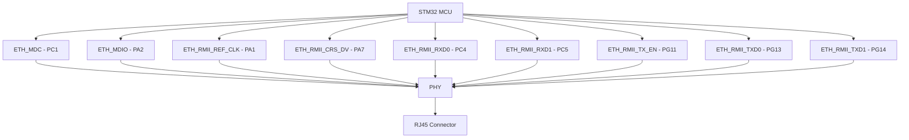

# STM32 Ethernet Setup

## Introduction

Ethernet connectivity is a powerful feature available on many higher-end STM32 microcontrollers, allowing them to communicate over standard TCP/IP networks. This capability opens up a wide range of applications, from IoT devices and industrial controls to home automation systems that can connect directly to local networks or the internet.

In this tutorial, we'll explore how to set up and use the Ethernet peripheral on STM32 microcontrollers. We'll cover hardware requirements, basic configuration, and how to implement both client and server applications using the lightweight LwIP (Lightweight IP) stack, which is commonly used with STM32 devices.

## Prerequisites

Before diving into Ethernet setup, you should have:

- An STM32 microcontroller with an Ethernet MAC (Media Access Controller)
- Basic knowledge of STM32 programming using HAL libraries
- STM32CubeIDE or a similar development environment
- A development board with Ethernet hardware or appropriate external Ethernet PHY

## Hardware Considerations

### Compatible STM32 Series

Ethernet functionality is available on several STM32 series:

- STM32F4 series (F407, F417, F427, F429, F437, F439)
- STM32F7 series
- STM32H7 series

### Required Hardware Components

For Ethernet connectivity, your setup needs:

1. An STM32 microcontroller with Ethernet MAC
2. An Ethernet PHY (Physical Layer) chip
3. RJ45 connector with integrated magnetics
4. 25MHz crystal oscillator for the PHY
5. Various passive components (resistors, capacitors)

Most development boards (like NUCLEO-F429ZI or STM32F4-DISCOVERY) already include these components.

## Basic Ethernet Configuration

Let's set up a basic Ethernet configuration using STM32CubeMX:

1. Open STM32CubeMX and create a new project for your microcontroller
2. Navigate to the Connectivity section and configure the Ethernet MAC:
   - Set Mode to RMII (Reduced Media-Independent Interface) for most applications
   - Enable the Ethernet global interrupt
   - Configure the PHY address (usually 0 or 1, check your board documentation)

3. Configure the required pins for RMII:
   - ETH_MDC and ETH_MDIO for management
   - ETH_RMII_REF_CLK for clock reference
   - ETH_RMII_CRS_DV for carrier sense
   - ETH_RMII_RXD0 and ETH_RMII_RXD1 for receive data
   - ETH_RMII_TX_EN for transmit enable
   - ETH_RMII_TXD0 and ETH_RMII_TXD1 for transmit data

4. In the Middleware section, enable LwIP:
   - Set DHCP to Enabled for automatic IP configuration or Disabled for static IP
   - Configure static IP, netmask, and gateway if using static addressing

5. Generate the code

Here's an example of pin configuration for STM32F4 series:



## Initializing the Ethernet Interface

After generating code with STM32CubeMX, the main application file will contain initialization code for the Ethernet interface. Let's examine the key parts:

```c
/* USER CODE BEGIN 0 */
/* USER CODE END 0 */

/* Private variables */
ETH_HandleTypeDef heth;

/* USER CODE BEGIN PV */
/* USER CODE END PV */

/* Private function prototypes */
void SystemClock_Config(void);
static void MX_GPIO_Init(void);
static void MX_ETH_Init(void);
/* USER CODE BEGIN PFP */
/* USER CODE END PFP */

/* USER CODE BEGIN 1 */
/* USER CODE END 1 */

int main(void)
{
  /* MCU Configuration--------------------------------------------------------*/

  /* Reset of all peripherals, Initializes the Flash interface and the Systick. */
  HAL_Init();

  /* USER CODE BEGIN Init */
  /* USER CODE END Init */

  /* Configure the system clock */
  SystemClock_Config();

  /* USER CODE BEGIN SysInit */
  /* USER CODE END SysInit */

  /* Initialize all configured peripherals */
  MX_GPIO_Init();
  MX_ETH_Init();
  
  /* Initialize the LwIP stack */
  MX_LWIP_Init();

  /* USER CODE BEGIN 2 */
  /* USER CODE END 2 */

  /* Infinite loop */
  while (1)
  {
    /* USER CODE BEGIN 3 */
    
    /* LwIP stack processing */
    MX_LWIP_Process();
    
    /* USER CODE END 3 */
  }
}
```

The key functions here are:

1. `MX_ETH_Init()` - Initializes the Ethernet peripheral
2. `MX_LWIP_Init()` - Initializes the LwIP stack
3. `MX_LWIP_Process()` - Processes incoming/outgoing packets (called in the main loop)

Let's look at the Ethernet initialization function:

```c
/**
  * @brief ETH Initialization Function
  * @param None
  * @retval None
  */
static void MX_ETH_Init(void)
{
  /* USER CODE BEGIN ETH_Init 0 */
  /* USER CODE END ETH_Init 0 */

  /* USER CODE BEGIN ETH_Init 1 */
  /* USER CODE END ETH_Init 1 */
  heth.Instance = ETH;
  heth.Init.AutoNegotiation = ETH_AUTONEGOTIATION_ENABLE;
  heth.Init.Speed = ETH_SPEED_100M;
  heth.Init.DuplexMode = ETH_MODE_FULLDUPLEX;
  heth.Init.PhyAddress = 0;
  heth.Init.MACAddr[0] = 0x00;
  heth.Init.MACAddr[1] = 0x80;
  heth.Init.MACAddr[2] = 0xE1;
  heth.Init.MACAddr[3] = 0x00;
  heth.Init.MACAddr[4] = 0x00;
  heth.Init.MACAddr[5] = 0x00;
  heth.Init.RxMode = ETH_RXPOLLING_MODE;
  heth.Init.ChecksumMode = ETH_CHECKSUM_BY_HARDWARE;
  heth.Init.MediaInterface = ETH_MEDIA_INTERFACE_RMII;

  /* Initialize ETH peripheral */
  if (HAL_ETH_Init(&heth) != HAL_OK)
  {
    Error_Handler();
  }
  /* USER CODE BEGIN ETH_Init 2 */
  /* USER CODE END ETH_Init 2 */
}
```

Key parameters to understand:

- `AutoNegotiation`: Enables the PHY to automatically negotiate connection parameters
- `Speed`: Sets the Ethernet speed (10 or 100 Mbps)
- `DuplexMode`: Full or half-duplex communication
- `PhyAddress`: Address of the PHY chip (check your board documentation)
- `MACAddr`: Media Access Control address (should be unique on your network)
- `RxMode`: Receive mode (polling or interrupt-based)
- `ChecksumMode`: Offloads checksum calculation to hardware
- `MediaInterface`: RMII or MII interface

## Working with LwIP

The LwIP stack provides TCP/IP functionality for embedded systems with limited resources. After initializing the stack with `MX_LWIP_Init()`, you can use its APIs to create network applications.

### TCP Server Example

Here's how to implement a simple TCP echo server:

```c
#include "lwip/opt.h"
#include "lwip/tcp.h"
#include "lwip/sys.h"

#define TCP_SERVER_PORT 7 // Echo server port

/* TCP server connection structure */
struct tcp_server_struct {
  struct tcp_pcb *pcb;
};

/* TCP server state */
static struct tcp_server_struct tcp_server;

/* Forward declarations of tcp callbacks */
static err_t tcp_server_accept(void *arg, struct tcp_pcb *newpcb, err_t err);
static err_t tcp_server_recv(void *arg, struct tcp_pcb *tpcb, struct pbuf *p, err_t err);
static void tcp_server_error(void *arg, err_t err);

/**
  * @brief  Initializes the TCP server
  * @param  None
  * @retval None
  */
void tcp_server_init(void)
{
  struct tcp_pcb *pcb;
  err_t err;
  
  /* Create a new TCP control block */
  pcb = tcp_new();
  
  if (pcb != NULL)
  {
    /* Bind to port 7 (echo) with default IP address */
    err = tcp_bind(pcb, IP_ADDR_ANY, TCP_SERVER_PORT);
    
    if (err == ERR_OK)
    {
      /* Start TCP listening for that pcb */
      tcp_server.pcb = tcp_listen(pcb);
      
      /* Register callback function for accepting connections */
      tcp_accept(tcp_server.pcb, tcp_server_accept);
    }
    else
    {
      /* Error occurred, deallocate the pcb */
      memp_free(MEMP_TCP_PCB, pcb);
    }
  }
}

/**
  * @brief  TCP connection established callback
  * @param  arg: user supplied argument
  * @param  newpcb: pointer to the newly established tcp connection
  * @param  err: error value
  * @retval error value
  */
static err_t tcp_server_accept(void *arg, struct tcp_pcb *newpcb, err_t err)
{
  err_t ret_err;
  
  /* Set priority to maximum */
  tcp_setprio(newpcb, TCP_PRIO_MAX);
  
  /* Register callbacks for this connection */
  tcp_recv(newpcb, tcp_server_recv);
  tcp_err(newpcb, tcp_server_error);
  
  ret_err = ERR_OK;
  return ret_err;
}

/**
  * @brief  TCP data received callback
  * @param  arg: user supplied argument
  * @param  tpcb: tcp connection handle
  * @param  p: pointer to received data
  * @param  err: error value
  * @retval error value
  */
static err_t tcp_server_recv(void *arg, struct tcp_pcb *tpcb, struct pbuf *p, err_t err)
{
  /* If we received data */
  if (p != NULL)
  {
    /* Echo the received data back to the sender */
    tcp_write(tpcb, p->payload, p->tot_len, 1);
    
    /* Free the buffer */
    pbuf_free(p);
  }
  else if (err == ERR_OK)
  {
    /* NULL pbuf received, the remote host closed the connection */
    tcp_close(tpcb);
  }
  
  return ERR_OK;
}

/**
  * @brief  TCP error callback
  * @param  arg: user supplied argument
  * @param  err: error value
  * @retval None
  */
static void tcp_server_error(void *arg, err_t err)
{
  /* Clean up any allocated resources */
  /* Note: the pcb is already deallocated by LwIP when this callback is called */
}
```

To initialize the server, call `tcp_server_init()` after `MX_LWIP_Init()` in your main function.

### TCP Client Example

Now let's implement a simple TCP client that sends a message to a server:

```c
#include "lwip/opt.h"
#include "lwip/tcp.h"
#include "lwip/dns.h"

/* TCP client connection structure */
struct tcp_client_struct {
  struct tcp_pcb *pcb;
  ip_addr_t remote_ip;
  u16_t remote_port;
  u8_t connected;
};

/* TCP client state */
static struct tcp_client_struct tcp_client;

/* Forward declarations of tcp callbacks */
static err_t tcp_client_connected(void *arg, struct tcp_pcb *tpcb, err_t err);
static err_t tcp_client_recv(void *arg, struct tcp_pcb *tpcb, struct pbuf *p, err_t err);
static void tcp_client_error(void *arg, err_t err);

/**
  * @brief  Connects to a remote TCP server
  * @param  ip_addr: IP address of the server
  * @param  port: TCP port of the server
  * @retval None
  */
void tcp_client_connect(ip_addr_t *ip_addr, u16_t port)
{
  struct tcp_pcb *pcb;
  err_t err;
  
  /* Create a new TCP control block */
  pcb = tcp_new();
  
  if (pcb != NULL)
  {
    /* Store the server information */
    tcp_client.remote_ip = *ip_addr;
    tcp_client.remote_port = port;
    tcp_client.connected = 0;
    tcp_client.pcb = pcb;
    
    /* Register callbacks */
    tcp_err(pcb, tcp_client_error);
    tcp_recv(pcb, tcp_client_recv);
    
    /* Connect to the server */
    err = tcp_connect(pcb, ip_addr, port, tcp_client_connected);
    
    if (err != ERR_OK)
    {
      /* Error occurred, deallocate the pcb */
      memp_free(MEMP_TCP_PCB, pcb);
      tcp_client.pcb = NULL;
    }
  }
}

/**
  * @brief  TCP connection established callback
  * @param  arg: user supplied argument
  * @param  tpcb: tcp connection handle
  * @param  err: error value
  * @retval error value
  */
static err_t tcp_client_connected(void *arg, struct tcp_pcb *tpcb, err_t err)
{
  /* Connection established */
  tcp_client.connected = 1;
  
  /* Send a message to the server */
  const char *message = "Hello from STM32!";
  tcp_write(tpcb, message, strlen(message), 1);
  
  return ERR_OK;
}

/**
  * @brief  TCP data received callback
  * @param  arg: user supplied argument
  * @param  tpcb: tcp connection handle
  * @param  p: pointer to received data
  * @param  err: error value
  * @retval error value
  */
static err_t tcp_client_recv(void *arg, struct tcp_pcb *tpcb, struct pbuf *p, err_t err)
{
  /* If we received data */
  if (p != NULL)
  {
    /* Process received data */
    /* ... */
    
    /* Free the buffer */
    pbuf_free(p);
  }
  else if (err == ERR_OK)
  {
    /* NULL pbuf received, the remote host closed the connection */
    tcp_client.connected = 0;
    tcp_close(tpcb);
    tcp_client.pcb = NULL;
  }
  
  return ERR_OK;
}

/**
  * @brief  TCP error callback
  * @param  arg: user supplied argument
  * @param  err: error value
  * @retval None
  */
static void tcp_client_error(void *arg, err_t err)
{
  /* Connection error occurred */
  tcp_client.connected = 0;
  tcp_client.pcb = NULL; /* The PCB is already deallocated by LwIP */
}
```

To connect to a server, you would use:

```c
ip_addr_t server_ip;
IP4_ADDR(&server_ip, 192, 168, 1, 100); // Server IP: 192.168.1.100
tcp_client_connect(&server_ip, 80); // Connect to port 80
```

## Using UDP

UDP (User Datagram Protocol) is simpler than TCP and is useful for applications where reliability is less critical than speed. Here's a simple UDP example:

```c
#include "lwip/udp.h"

#define UDP_PORT 7777

struct udp_pcb *udp_socket;

/* Forward declaration of callback */
void udp_receive_callback(void *arg, struct udp_pcb *upcb, struct pbuf *p, const ip_addr_t *addr, u16_t port);

/**
  * @brief  Initializes the UDP socket
  * @param  None
  * @retval None
  */
void udp_init(void)
{
  err_t err;
  
  /* Create a new UDP control block */
  udp_socket = udp_new();
  
  if (udp_socket != NULL)
  {
    /* Bind to specified port */
    err = udp_bind(udp_socket, IP_ADDR_ANY, UDP_PORT);
    
    if (err == ERR_OK)
    {
      /* Register callback function for data reception */
      udp_recv(udp_socket, udp_receive_callback, NULL);
    }
    else
    {
      /* Error occurred, deallocate the pcb */
      udp_remove(udp_socket);
      udp_socket = NULL;
    }
  }
}

/**
  * @brief  UDP data received callback
  * @param  arg: user supplied argument
  * @param  upcb: udp connection handle
  * @param  p: pointer to received data
  * @param  addr: pointer to the IP address of sender
  * @param  port: sender port number
  * @retval None
  */
void udp_receive_callback(void *arg, struct udp_pcb *upcb, struct pbuf *p, const ip_addr_t *addr, u16_t port)
{
  /* Process received data */
  /* ... */
  
  /* Echo data back to sender */
  struct pbuf *p_out = pbuf_alloc(PBUF_TRANSPORT, p->tot_len, PBUF_RAM);
  
  if (p_out != NULL)
  {
    pbuf_copy(p_out, p);
    udp_sendto(upcb, p_out, addr, port);
    pbuf_free(p_out);
  }
  
  /* Free the received pbuf */
  pbuf_free(p);
}

/**
  * @brief  Sends a UDP message
  * @param  data: pointer to data
  * @param  len: data length
  * @param  dest_ip: destination IP address
  * @param  dest_port: destination port
  * @retval None
  */
void udp_send_message(const void *data, size_t len, ip_addr_t *dest_ip, u16_t dest_port)
{
  struct pbuf *p;
  
  /* Allocate a new packet buffer */
  p = pbuf_alloc(PBUF_TRANSPORT, len, PBUF_RAM);
  
  if (p != NULL)
  {
    /* Copy data to the buffer */
    memcpy(p->payload, data, len);
    
    /* Send the packet */
    udp_sendto(udp_socket, p, dest_ip, dest_port);
    
    /* Free the packet buffer */
    pbuf_free(p);
  }
}
```

To send a UDP message:

```c
ip_addr_t dest_ip;
IP4_ADDR(&dest_ip, 192, 168, 1, 255); // Broadcast address for local network
const char *message = "Hello UDP!";
udp_send_message(message, strlen(message), &dest_ip, 7777);
```

## HTTP Server Example

LwIP includes a simple HTTP server that you can enable in the middleware configuration. Here's how to customize it:

1. In the generated code, locate the `httpd_server_init()` function call in `lwip.c`
2. Create a folder named `fs` in your project to store web content
3. Add an `index.html` file to this folder:

```html
<!DOCTYPE html>
<html>
<head>
  <title>STM32 Web Server</title>
  <style>
    body {
      font-family: Arial, sans-serif;
      margin: 20px;
    }
    h1 {
      color: #0066cc;
    }
    .data {
      border: 1px solid #ccc;
      padding: 10px;
      margin-top: 20px;
    }
  </style>
</head>
<body>
  <h1>STM32 Ethernet Web Server</h1>
  <p>This page is served by an STM32 microcontroller.</p>
  <div class="data">
    <h2>System Information</h2>
    <p>Uptime: <span id="uptime">--</span> seconds</p>
    <button onclick="getData()">Refresh</button>
  </div>
  
  <script>
    function getData() {
      fetch('/api/status')
        .then(response => response.json())
        .then(data => {
          document.getElementById('uptime').textContent = data.uptime;
        })
        .catch(error => console.error('Error:', error));
    }
    
    // Initial data load
    getData();
    // Refresh every 5 seconds
    setInterval(getData, 5000);
  </script>
</body>
</html>
```

4. Implement a custom HTTP handler for the API endpoint:

```c
#include "lwip/apps/httpd.h"
#include "lwip/apps/fs.h"

/* External variables */
extern uint32_t HAL_GetTick(void);

/**
  * @brief  Initialize HTTP server with custom handlers
  * @param  None
  * @retval None
  */
void http_server_init(void)
{
  /* Initialize the HTTP server */
  httpd_init();
  
  /* Register custom CGI handlers */
  http_set_cgi_handlers(http_cgi_handlers, 1);
}

/**
  * @brief  CGI handler for API endpoint
  * @param  iIndex: CGI handler index
  * @param  pcParam: Parameters
  * @param  pcValue: Parameter values
  * @param  iNumParams: Number of parameters
  * @param  pcConnection: HTTP connection handle
  * @retval response string
  */
const char* http_api_status_handler(int iIndex, int iNumParams, char *pcParam[], char *pcValue[], const char *pcConnection)
{
  /* Generate JSON response */
  static char jsonbuf[128];
  uint32_t uptime = HAL_GetTick() / 1000; // Convert milliseconds to seconds
  
  sprintf(jsonbuf, "{\"uptime\":%lu}", uptime);
  
  /* Set Content-Type header */
  http_set_response_header(pcConnection, "Content-Type", "application/json");
  
  /* Send JSON data */
  http_write_data(pcConnection, jsonbuf, strlen(jsonbuf));
  
  return "/api/status"; // Return URI to indicate processing complete
}

/* CGI handler array */
const tCGI http_cgi_handlers[] = {
  {"/api/status", http_api_status_handler}
};
```

## Real-World Application Example: Weather Station

Let's create a practical example of a weather station that reports temperature and humidity over Ethernet:

```c
#include "main.h"
#include "lwip/opt.h"
#include "lwip/tcp.h"
#include "lwip/udp.h"
#include "lwip/apps/httpd.h"
#include "stm32f4xx_hal.h"

/* Private define ------------------------------------------------------------*/
#define TEMP_SENSOR_I2C_ADDR 0x48
#define REPORT_INTERVAL      30000  // 30 seconds

/* Private variables ---------------------------------------------------------*/
I2C_HandleTypeDef hi2c1;
uint32_t last_report_time = 0;
float temperature = 0.0f;
float humidity = 0.0f;

/* Private function prototypes -----------------------------------------------*/
void SystemClock_Config(void);
static void MX_GPIO_Init(void);
static void MX_ETH_Init(void);
static void MX_I2C1_Init(void);
static void MX_LWIP_Init(void);
float read_temperature(void);
float read_humidity(void);
void send_weather_data(void);

/**
  * @brief  Main program
  * @param  None
  * @retval None
  */
int main(void)
{
  /* Reset of all peripherals, Initializes the Flash interface and the Systick. */
  HAL_Init();

  /* Configure the system clock */
  SystemClock_Config();

  /* Initialize all configured peripherals */
  MX_GPIO_Init();
  MX_ETH_Init();
  MX_I2C1_Init();
  MX_LWIP_Init();
  
  /* Initialize HTTP server */
  httpd_init();
  
  /* Infinite loop */
  while (1)
  {
    /* LwIP stack processing */
    MX_LWIP_Process();
    
    /* Read sensor data and report if needed */
    uint32_t current_time = HAL_GetTick();
    if (current_time - last_report_time >= REPORT_INTERVAL)
    {
      temperature = read_temperature();
      humidity = read_humidity();
      send_weather_data();
      last_report_time = current_time;
    }
  }
}

/**
  * @brief  Reads temperature from sensor
  * @param  None
  * @retval Temperature in Celsius
  */
float read_temperature(void)
{
  uint8_t data[2];
  float temp;
  
  /* Start I2C communication and read temperature data */
  HAL_I2C_Mem_Read(&hi2c1, TEMP_SENSOR_I2C_ADDR << 1, 0x00, I2C_MEMADD_SIZE_8BIT, data, 2, 100);
  
  /* Calculate temperature from raw data */
  int16_t raw_temp = (data[0] << 8) | data[1];
  temp = (float)raw_temp / 256.0f;
  
  return temp;
}

/**
  * @brief  Reads humidity from sensor
  * @param  None
  * @retval Humidity percentage
  */
float read_humidity(void)
{
  uint8_t data[2];
  float humid;
  
  /* Start I2C communication and read humidity data */
  HAL_I2C_Mem_Read(&hi2c1, TEMP_SENSOR_I2C_ADDR << 1, 0x01, I2C_MEMADD_SIZE_8BIT, data, 2, 100);
  
  /* Calculate humidity from raw data */
  uint16_t raw_humid = (data[0] << 8) | data[1];
  humid = (float)raw_humid / 10.0f;
  
  return humid;
}

/**
  * @brief  Sends weather data via UDP
  * @param  None
  * @retval None
  */
void send_weather_data(void)
{
  static struct udp_pcb *weather_pcb = NULL;
  ip_addr_t server_ip;
  char buffer[128];
  struct pbuf *p;
  
  /* Create UDP PCB if not already created */
  if (weather_pcb == NULL)
  {
    weather_pcb = udp_new();
  }
  
  if (weather_pcb != NULL)
  {
    /* Set server IP address (example: 192.168.1.100) */
    IP4_ADDR(&server_ip, 192, 168, 1, 100);
    
    /* Format the data as JSON */
    int len = sprintf(buffer, "{\"device_id\":\"STM32-WEATHER\",\"temperature\":%.1f,\"humidity\":%.1f,\"uptime\":%lu}",
                      temperature, humidity, HAL_GetTick() / 1000);
    
    /* Create packet buffer */
    p = pbuf_alloc(PBUF_TRANSPORT, len, PBUF_RAM);
    
    if (p != NULL)
    {
      /* Copy the data to the buffer */
      memcpy(p->payload, buffer, len);
      
      /* Send the data */
      udp_sendto(weather_pcb, p, &server_ip, 8080);
      
      /* Free the packet buffer */
      pbuf_free(p);
    }
  }
}
```

## Troubleshooting Ethernet Connectivity

When working with Ethernet on STM32, you might encounter various issues. Here are some common problems and solutions:

### No Physical Link

If the link LED on your Ethernet connector is not illuminated:

1. Check your cable and make sure it's connected properly
2. Verify the PHY configuration matches your hardware
3. Ensure the PHY reset sequence is correct
4. Check oscillator connection to the PHY

### Cannot Get IP Address via DHCP

If your device cannot obtain an IP address:

1. Verify your DHCP server is running
2. Check the Ethernet MAC address is unique
3. Increase the DHCP timeout value
4. Try using a static IP address temporarily

### TCP Connection Issues

If TCP connections fail:

1. Verify the IP configuration (IP address, subnet mask, gateway)
2. Check your firewall settings on the remote device
3. Ensure port numbers match between client and server
4. Monitor the connection state using the LwIP debug functions

### Debug Tips

The LwIP stack provides several debugging options that you can enable:

```c
/* In lwipopts.h */
#define LWIP_DEBUG 1
#define ETHARP_DEBUG LWIP_DBG_ON
#define NETIF_DEBUG LWIP_DBG_ON
#define PBUF_DEBUG LWIP_DBG_ON
#define API_LIB_DEBUG LWIP_DBG_ON
#define API_MSG_DEBUG LWIP_DBG_ON
#define SOCKETS_DEBUG LWIP_DBG_ON
#define ICMP_DEBUG LWIP_DBG_ON
#define IGMP_DEBUG LWIP_DBG_ON
#define INET_DEBUG LWIP_DBG_ON
```

You'll need to implement the `LWIP_PLATFORM_DIAG` macro to redirect debug output to your debug interface (UART, ITM, etc.).

## Summary

In this tutorial, we've covered the fundamentals of setting up and using Ethernet connectivity on STM32 microcontrollers