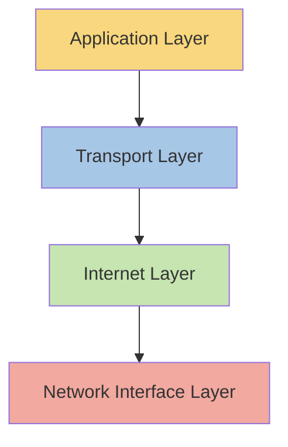

# STM32 TCP/IP Stack

## Introduction

The TCP/IP (Transmission Control Protocol/Internet Protocol) stack is a fundamental communication framework that enables STM32 microcontrollers to connect to networks and the internet. This capability transforms simple microcontrollers into powerful Internet of Things (IoT) devices capable of sending data to servers, communicating with other devices, and even hosting web applications.

In this tutorial, we'll explore how the TCP/IP stack works on STM32 devices, focusing on the lightweight LwIP (Lightweight IP) implementation that ST Microelectronics has integrated into their STM32 ecosystem.

## What is a TCP/IP Stack?

Before diving into STM32-specific implementations, let's understand what a TCP/IP stack actually is.

The TCP/IP stack is a set of communication protocols organized in layers that work together to transmit data between devices over networks. These layers include:



1. **Application Layer**: Protocols like HTTP, FTP, SMTP that applications use to communicate
2. **Transport Layer**: Protocols like TCP and UDP that manage end-to-end connections
3. **Internet Layer**: IP protocol for routing packets between networks
4. **Network Interface Layer**: Hardware-specific protocols for physical connectivity

On resource-constrained devices like STM32 microcontrollers, a full TCP/IP implementation would be too memory-intensive, which is why lightweight alternatives like LwIP are used.

## LwIP on STM32

LwIP (Lightweight IP) is an open-source TCP/IP stack designed specifically for embedded systems with limited resources. ST Microelectronics has integrated LwIP into their STM32 ecosystem through middleware packages and HAL (Hardware Abstraction Layer) drivers.

### Key Features of LwIP on STM32

- Small memory footprint (about 40KB ROM and RAM)
- Support for IPv4 and IPv6
- Implementation of TCP, UDP, ICMP, IGMP, and ARP protocols
- DHCP client for automatic IP configuration
- DNS for domain resolution
- Optional APIs for raw/callback, sequential, or socket-based programming

## Setting Up LwIP on STM32

To use the TCP/IP stack on an STM32 device, you'll need:

1. An STM32 microcontroller with Ethernet capability (like STM32F4, STM32F7, or STM32H7 series)
2. STM32CubeMX or STM32CubeIDE for project configuration
3. The STM32Cube middleware package that includes LwIP

Let's walk through a basic setup:

### Step 1: Configure Hardware in STM32CubeMX

1. Create a new project and select your STM32 device
2. Configure clock settings appropriate for your application
3. Enable Ethernet under the Connectivity section
4. Configure Ethernet pins and parameters

### Step 2: Enable LwIP Middleware

1. Go to the Middleware section in STM32CubeMX
2. Enable LwIP and configure basic settings:

```c
/* Ethernet configuration */
#define ETH_RX_BUF_SIZE                     1536
#define ETH_TX_BUF_SIZE                     1536
#define ETH_RX_BUF_NUM                      4
#define ETH_TX_BUF_NUM                      4

/* IP address configuration */
#define IP_ADDR0                            192
#define IP_ADDR1                            168
#define IP_ADDR2                            1
#define IP_ADDR3                            100

/* Network mask configuration */
#define NETMASK_ADDR0                       255
#define NETMASK_ADDR1                       255
#define NETMASK_ADDR2                       255
#define NETMASK_ADDR3                       0

/* Gateway address configuration */
#define GW_ADDR0                            192
#define GW_ADDR1                            168
#define GW_ADDR2                            1
#define GW_ADDR3                            1
```

3. Configure DHCP (if needed) and other advanced settings

### Step 3: Generate and Open the Project

1. Configure project settings and generate code
2. Open the project in your IDE

## Basic LwIP Usage Examples

Now let's look at some basic examples of using the TCP/IP stack on STM32.

### Example 1: Basic Network Initialization

Here's how to initialize the LwIP stack in your application:

```c
/* Includes */
#include "lwip/netif.h"
#include "lwip/tcpip.h"
#include "netif/etharp.h"
#include "ethernetif.h"

/* Network interface structure */
struct netif gnetif;

void network_initialize(void)
{
  ip4_addr_t ipaddr;
  ip4_addr_t netmask;
  ip4_addr_t gateway;
  
  /* Initialize the LwIP stack */
  tcpip_init(NULL, NULL);
  
  /* Configure IP addresses */
  IP4_ADDR(&ipaddr, IP_ADDR0, IP_ADDR1, IP_ADDR2, IP_ADDR3);
  IP4_ADDR(&netmask, NETMASK_ADDR0, NETMASK_ADDR1, NETMASK_ADDR2, NETMASK_ADDR3);
  IP4_ADDR(&gateway, GW_ADDR0, GW_ADDR1, GW_ADDR2, GW_ADDR3);
  
  /* Add the network interface */
  netif_add(&gnetif, &ipaddr, &netmask, &gateway, NULL, &ethernetif_init, &tcpip_input);
  
  /* Set the network interface as the default */
  netif_set_default(&gnetif);
  
  /* Set the network interface up */
  netif_set_up(&gnetif);
}
```

When this code executes, it will:
1. Initialize the TCP/IP thread
2. Configure IP addresses based on defined constants
3. Add and configure the ethernet interface
4. Set the interface as the default route
5. Bring the interface online

### Example 2: Using DHCP for Dynamic IP Configuration

For most networks, you'll want to use DHCP to automatically obtain IP settings:

```c
#include "lwip/dhcp.h"

void network_initialize_dhcp(void)
{
  /* Initialize the LwIP stack */
  tcpip_init(NULL, NULL);
  
  /* Configure IP addresses - we'll use all zeros for DHCP */
  IP4_ADDR(&ipaddr, 0, 0, 0, 0);
  IP4_ADDR(&netmask, 0, 0, 0, 0);
  IP4_ADDR(&gateway, 0, 0, 0, 0);
  
  /* Add the network interface */
  netif_add(&gnetif, &ipaddr, &netmask, &gateway, NULL, &ethernetif_init, &tcpip_input);
  
  /* Set the network interface as the default */
  netif_set_default(&gnetif);
  
  /* Set the network interface up */
  netif_set_up(&gnetif);
  
  /* Start DHCP client */
  dhcp_start(&gnetif);
  
  /* Wait for DHCP to complete */
  uint8_t dhcp_state;
  do {
    dhcp_state = DHCP_state;
    HAL_Delay(250);
  } while(dhcp_state != DHCP_BOUND);
  
  /* Print assigned IP address */
  printf("IP address assigned by DHCP: %d.%d.%d.%d\r
", 
    ip4_addr1(&gnetif.ip_addr), ip4_addr2(&gnetif.ip_addr),
    ip4_addr3(&gnetif.ip_addr), ip4_addr4(&gnetif.ip_addr));
}
```

Expected output:
```
IP address assigned by DHCP: 192.168.1.105
```

### Example 3: Creating a TCP Server

Let's create a simple TCP echo server that listens on port 7:

```c
#include "lwip/tcp.h"

/* TCP server structure */
struct tcp_pcb *echo_server_pcb;

/* TCP server callbacks */
static err_t echo_recv_callback(void *arg, struct tcp_pcb *tpcb, struct pbuf *p, err_t err);
static err_t echo_accept_callback(void *arg, struct tcp_pcb *newpcb, err_t err);

void tcp_server_init(void)
{
  /* Create new TCP protocol control block */
  echo_server_pcb = tcp_new();
  
  if (echo_server_pcb != NULL) {
    err_t err;
    
    /* Bind to port 7 (echo service) with default IP address */
    err = tcp_bind(echo_server_pcb, IP_ADDR_ANY, 7);
    
    if (err == ERR_OK) {
      /* Start listening for connections */
      echo_server_pcb = tcp_listen(echo_server_pcb);
      
      /* Register accept callback */
      tcp_accept(echo_server_pcb, echo_accept_callback);
    } else {
      /* Error in binding, cleanup */
      memp_free(MEMP_TCP_PCB, echo_server_pcb);
      printf("Error binding to port 7\r
");
    }
  }
}

static err_t echo_accept_callback(void *arg, struct tcp_pcb *newpcb, err_t err)
{
  if (err == ERR_OK) {
    /* Set up receive callback for this connection */
    tcp_recv(newpcb, echo_recv_callback);
    
    /* For simplicity, we don't implement other callbacks here */
    printf("New client connected\r
");
    
    return ERR_OK;
  }
  
  return ERR_VAL;
}

static err_t echo_recv_callback(void *arg, struct tcp_pcb *tpcb, struct pbuf *p, err_t err)
{
  /* If we received some data */
  if (p != NULL) {
    /* Echo back the received data */
    tcp_write(tpcb, p->payload, p->len, 1);
    
    /* Free the pbuf */
    pbuf_free(p);
    
    printf("Echoed %d bytes\r
", p->len);
  } else {
    /* NULL pbuf means remote host closed connection */
    tcp_close(tpcb);
    printf("Connection closed\r
");
  }
  
  return ERR_OK;
}
```

This server will:
1. Initialize a TCP control block
2. Bind to port 7 (the standard echo port)
3. Listen for incoming connections
4. For each connection, echo back any data received
5. Close connections when the remote host disconnects

## Real-World Application: Web Server on STM32

One of the most common applications of the TCP/IP stack on STM32 is creating a web server to monitor and control your embedded device. Let's build a simple web server that displays sensor data:

```c
#include "lwip/apps/httpd.h"
#include "lwip/apps/fs.h"

/* Sample sensor data (in a real application, this would come from actual sensors) */
float temperature = 25.3f;
float humidity = 65.7f;

/* Custom SSI (Server Side Includes) handler */
u16_t ssi_handler(int index, char *insert, int insert_len)
{
  char temp_str[16];
  
  switch (index) {
    case 0: /* Temperature reading */
      snprintf(temp_str, sizeof(temp_str), "%.1f °C", temperature);
      strcpy(insert, temp_str);
      break;
    case 1: /* Humidity reading */
      snprintf(temp_str, sizeof(temp_str), "%.1f %%", humidity);
      strcpy(insert, temp_str);
      break;
  }
  
  /* Return the length of the inserted string */
  return strlen(insert);
}

/* SSI tags to process */
const char *ssi_tags[] = {
  "temp", /* Will be replaced with temperature reading */
  "humi"  /* Will be replaced with humidity reading */
};

void webserver_init(void)
{
  /* Initialize the httpd server */
  httpd_init();
  
  /* Set up SSI handlers */
  http_set_ssi_handler(ssi_handler, ssi_tags, 2);
  
  printf("Web server started\r
");
}
```

With this code, you would also need to create an HTML file to store in your filesystem:

```html
<!DOCTYPE html>
<html>
<head>
  <title>STM32 Web Server</title>
  <meta http-equiv="refresh" content="5">
  <style>
    body { font-family: Arial, sans-serif; margin: 20px; }
    .sensor { margin: 10px; padding: 15px; background-color: #f0f0f0; border-radius: 5px; }
  </style>
</head>
<body>
  <h1>STM32 Sensor Monitor</h1>
  
  <div class="sensor">
    <h2>Temperature</h2>
    <p style="font-size: 24px;"><!--#temp--></p>
  </div>
  
  <div class="sensor">
    <h2>Humidity</h2>
    <p style="font-size: 24px;"><!--#humi--></p>
  </div>
  
  <p>Page auto-refreshes every 5 seconds</p>
</body>
</html>
```

This simple web server:
1. Initializes the httpd server provided by LwIP
2. Sets up Server Side Includes (SSI) to dynamically insert sensor data into HTML
3. Serves a webpage that displays temperature and humidity data
4. Auto-refreshes to show updated readings

When a user accesses the web server from a browser, they'll see the current temperature and humidity readings, which will update every 5 seconds.

## Advanced Topics

### Performance Optimization

For optimal performance of the TCP/IP stack on STM32:

1. **Buffer Sizes**: Adjust ETH_RX_BUF_SIZE, ETH_TX_BUF_SIZE based on your application needs
2. **Memory Pool Sizes**: Configure LwIP memory pools based on expected network load
3. **Checksum Offloading**: Enable hardware checksum calculation if your STM32 supports it

```c
/* Checksum configuration */
#define CHECKSUM_GEN_IP                 0  /* Hardware checksum generation for IP */
#define CHECKSUM_GEN_UDP                0  /* Hardware checksum generation for UDP */
#define CHECKSUM_GEN_TCP                0  /* Hardware checksum generation for TCP */
#define CHECKSUM_CHECK_IP               0  /* Hardware checksum checking for IP */
#define CHECKSUM_CHECK_UDP              0  /* Hardware checksum checking for UDP */
#define CHECKSUM_CHECK_TCP              0  /* Hardware checksum checking for TCP */
```

### Implementing Secure Communication

For secure communication, you can implement TLS/SSL with libraries like mbedTLS. The implementation is beyond the scope of this tutorial, but here's a high-level approach:

1. Include mbedTLS in your project
2. Initialize the TLS context and configure certificates
3. Create a wrapper around the LwIP socket interface to handle encryption/decryption
4. Implement secure versions of your network applications

## Common Issues and Troubleshooting

### 1. Link Status Problems

If your Ethernet connection isn't being established:

```c
/* Check link status */
void check_link_status(void)
{
  ETH_LinkState link_state = HAL_ETH_GetLinkState(&heth);
  
  if (link_state == ETH_LINK_DOWN) {
    printf("Ethernet link is DOWN\r
");
    /* Take appropriate action, such as retrying or notifying user */
  } else {
    printf("Ethernet link is UP\r
");
  }
}
```

### 2. DHCP Timeout

If DHCP isn't working:

```c
/* DHCP timeout handling */
uint32_t dhcp_timeout = 0;

void handle_dhcp_timeout(void)
{
  dhcp_timeout++;
  
  if (dhcp_timeout > 20) { /* 5 seconds (20 * 250ms) */
    printf("DHCP timeout, using static IP\r
");
    /* Fall back to static IP configuration */
    IP4_ADDR(&ipaddr, 192, 168, 1, 100);
    IP4_ADDR(&netmask, 255, 255, 255, 0);
    IP4_ADDR(&gateway, 192, 168,,1, 1);
    
    netif_set_addr(&gnetif, &ipaddr, &netmask, &gateway);
  }
}
```

## Summary

The TCP/IP stack on STM32 microcontrollers, implemented through LwIP, provides a powerful way to connect your embedded devices to networks and the internet. In this tutorial, we've covered:

- The basics of the TCP/IP stack and its layered architecture
- How to set up and configure LwIP on STM32 devices
- Basic network operations like initialization and DHCP
- Creating TCP servers and implementing a simple web server
- Advanced topics and troubleshooting tips

With these fundamentals, you can build a wide range of networked applications on STM32 devices, from simple data loggers to complex IoT solutions.

## Additional Resources and Exercises

### Resources

- [STM32 Ethernet HAL Driver Documentation](https://www.st.com)
- [LwIP Official Documentation](https://savannah.nongnu.org/projects/lwip/)
- [STM32CubeF4/F7 Ethernet Examples](https://www.st.com)

### Exercises

1. **Basic**: Modify the echo server to log received messages to a console or display.
2. **Intermediate**: Create a UDP client that sends sensor data to a server at regular intervals.
3. **Advanced**: Implement a RESTful API on your STM32 device that allows remote monitoring and control.
4. **Challenge**: Add mbedTLS to your web server to implement HTTPS for secure communication.

Try these exercises to strengthen your understanding of the STM32 TCP/IP stack and build practical networking skills for embedded systems development.