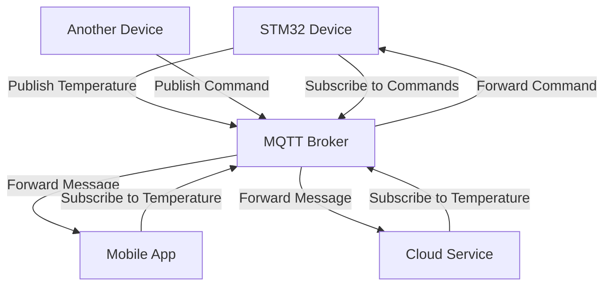
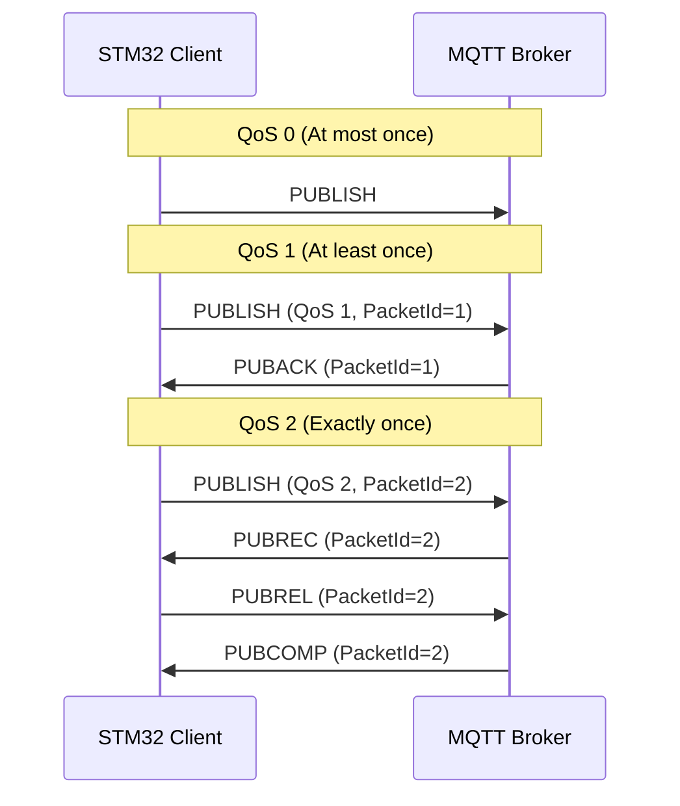

# STM32 MQTT Client

## Introduction

MQTT (Message Queuing Telemetry Transport) is a lightweight messaging protocol designed for constrained devices and low-bandwidth, high-latency, or unreliable networks. It's ideal for IoT (Internet of Things) applications where STM32 microcontrollers are commonly used. This tutorial will guide you through implementing an MQTT client on an STM32 device, allowing your embedded system to communicate with cloud services, mobile applications, and other IoT devices.

## What is MQTT?

MQTT operates on a publish/subscribe model where devices (clients) can:
- Publish messages to specific topics
- Subscribe to topics to receive messages
- Connect to a central broker that manages message distribution



## Prerequisites

Before we start, ensure you have:

1. An STM32 development board (F4, F7, or H7 series recommended)
2. STM32CubeIDE or similar development environment
3. Network connectivity hardware (Ethernet or WiFi module)
4. Basic knowledge of STM32 programming and networking concepts

## Setting Up Your Project

### 1. Initialize the Project with STM32CubeMX

First, we'll create a project with the necessary peripherals:

1. Create a new STM32CubeMX project
2. Configure your network interface (Ethernet or WiFi)
3. Enable the necessary middleware components

For Ethernet-based connectivity:

```c
/* Enable Ethernet in CubeMX */
ETH: Mode: RMII
```

### 2. Add Required Libraries

We'll use the STM32Cube expansion package for MQTT:

1. Download the X-CUBE-MQTT package from ST's website
2. Import it into your project
3. Enable the MQTT module in the Middleware section

Alternatively, you can use an open-source MQTT library like Eclipse Paho:

```c
/* Include necessary headers */
#include "mqtt_client.h"
#include "network_interface.h"
```

## Implementing the MQTT Client

### Step 1: Initialize Network Interface

First, we need to set up our network connection:

```c
/* Network interface initialization */
NetworkInterface_t network;
network_init(&network);

/* Connect to the network */
if (network_connect(&network, "192.168.1.1", 1883) != NETWORK_SUCCESS) {
    /* Handle connection error */
    Error_Handler();
}
```

### Step 2: Configure MQTT Client

Now, let's configure our MQTT client:

```c
/* MQTT client configuration */
MQTTClient_t mqttClient;
MQTTConfig_t mqttConfig;

/* Set client ID - must be unique */
mqttConfig.clientId = "STM32_Device_001";
mqttConfig.keepAliveInterval = 60; /* seconds */
mqttConfig.cleanSession = 1;
mqttConfig.username = "your_username"; /* if authentication is required */
mqttConfig.password = "your_password"; /* if authentication is required */

/* Initialize MQTT client */
MQTT_Init(&mqttClient, &network, &mqttConfig);
```

### Step 3: Connect to MQTT Broker

Now we can connect to the MQTT broker:

```c
/* Connect to MQTT broker */
MQTTConnectParams_t connectParams;
connectParams.keepAliveInterval = 60;
connectParams.cleanSession = 1;
connectParams.willFlag = 0; /* Set to 1 if you want to use Last Will and Testament */

/* Broker address */
char brokerAddress[] = "mqtt.example.com";
uint16_t brokerPort = 1883; /* Default MQTT port */

if (MQTT_Connect(&mqttClient, brokerAddress, brokerPort, &connectParams) != MQTT_SUCCESS) {
    /* Handle connection error */
    Error_Handler();
}
```

### Step 4: Subscribe to Topics

To receive messages, we need to subscribe to topics:

```c
/* Subscribe to a topic */
MQTTSubscribeParams_t subParams;
subParams.qos = QOS1; /* Quality of Service level */
subParams.topic = "device/commands";

if (MQTT_Subscribe(&mqttClient, &subParams) != MQTT_SUCCESS) {
    /* Handle subscription error */
    Error_Handler();
}
```

### Step 5: Publish Messages

To send data to the broker:

```c
/* Publish a message */
MQTTPublishParams_t pubParams;
pubParams.qos = QOS1;
pubParams.topic = "device/telemetry";
pubParams.payload = "{\"temperature\": 25.5, \"humidity\": 60}";
pubParams.payloadLen = strlen(pubParams.payload);
pubParams.retain = 0;

if (MQTT_Publish(&mqttClient, &pubParams) != MQTT_SUCCESS) {
    /* Handle publishing error */
    Error_Handler();
}
```

### Step 6: Process Incoming Messages

We need to set up a callback function to handle incoming messages:

```c
/* Message arrival callback */
void messageArrived(MessageData_t* data) {
    char topicBuffer[64];
    char payloadBuffer[256];
    
    /* Copy topic to buffer */
    uint16_t topicLen = data->topicName.lenstring.len;
    if (topicLen > sizeof(topicBuffer) - 1) {
        topicLen = sizeof(topicBuffer) - 1;
    }
    memcpy(topicBuffer, data->topicName.lenstring.data, topicLen);
    topicBuffer[topicLen] = '\0';
    
    /* Copy payload to buffer */
    uint16_t payloadLen = data->message.payloadlen;
    if (payloadLen > sizeof(payloadBuffer) - 1) {
        payloadLen = sizeof(payloadBuffer) - 1;
    }
    memcpy(payloadBuffer, data->message.payload, payloadLen);
    payloadBuffer[payloadLen] = '\0';
    
    /* Process the message */
    printf("Message arrived on topic: %s\r
", topicBuffer);
    printf("Payload: %s\r
", payloadBuffer);
    
    /* Parse and act upon the message */
    if (strcmp(topicBuffer, "device/commands") == 0) {
        /* Example: Parse JSON command */
        if (strstr(payloadBuffer, "\"command\":\"LED_ON\"") != NULL) {
            /* Turn on LED */
            HAL_GPIO_WritePin(LED_GPIO_Port, LED_Pin, GPIO_PIN_SET);
        } else if (strstr(payloadBuffer, "\"command\":\"LED_OFF\"") != NULL) {
            /* Turn off LED */
            HAL_GPIO_WritePin(LED_GPIO_Port, LED_Pin, GPIO_PIN_RESET);
        }
    }
}

/* Set the callback function */
mqttClient.messageHandler = messageArrived;
```

### Step 7: Keep the Connection Alive

We need to maintain the MQTT connection by regularly calling the `MQTT_Yield` function:

```c
/* Main loop */
while (1) {
    /* Allow the MQTT client to process incoming messages and maintain the connection */
    MQTT_Yield(&mqttClient, 100); /* Timeout in milliseconds */
    
    /* Your other application code here */
    HAL_Delay(1000);
    
    /* Publish periodic data if needed */
    float temperature = readTemperatureSensor();
    char payload[100];
    snprintf(payload, sizeof(payload), "{\"temperature\": %.1f}", temperature);
    
    pubParams.payload = payload;
    pubParams.payloadLen = strlen(payload);
    MQTT_Publish(&mqttClient, &pubParams);
}
```

## Complete Example: Temperature Monitoring System

Let's put everything together in a practical example of a temperature monitoring system:

```c
/* main.c */
#include "main.h"
#include "mqtt_client.h"
#include "network_interface.h"
#include "sensors.h"

/* Private function prototypes */
void SystemClock_Config(void);
static void MX_GPIO_Init(void);
static void MX_ETH_Init(void);
void messageArrived(MessageData_t* data);

/* MQTT client and network objects */
NetworkInterface_t network;
MQTTClient_t mqttClient;

int main(void) {
    /* MCU Configuration */
    HAL_Init();
    SystemClock_Config();
    
    /* Initialize all configured peripherals */
    MX_GPIO_Init();
    MX_ETH_Init();
    
    /* Initialize temperature sensor */
    tempSensor_init();
    
    /* Initialize network interface */
    if (network_init(&network) != NETWORK_SUCCESS) {
        Error_Handler();
    }
    
    /* Connect to network */
    printf("Connecting to network...\r
");
    if (network_connect(&network, NULL, 0) != NETWORK_SUCCESS) {
        Error_Handler();
    }
    printf("Network connected!\r
");
    
    /* Configure MQTT client */
    MQTTConfig_t mqttConfig;
    mqttConfig.clientId = "STM32_TempSensor";
    mqttConfig.keepAliveInterval = 60;
    mqttConfig.cleanSession = 1;
    mqttConfig.username = NULL; /* Set if your broker requires authentication */
    mqttConfig.password = NULL; /* Set if your broker requires authentication */
    
    /* Initialize MQTT client */
    MQTT_Init(&mqttClient, &network, &mqttConfig);
    
    /* Set message handler */
    mqttClient.messageHandler = messageArrived;
    
    /* Connect to MQTT broker */
    printf("Connecting to MQTT broker...\r
");
    MQTTConnectParams_t connectParams;
    connectParams.keepAliveInterval = 60;
    connectParams.cleanSession = 1;
    connectParams.willFlag = 0;
    
    if (MQTT_Connect(&mqttClient, "mqtt.example.com", 1883, &connectParams) != MQTT_SUCCESS) {
        printf("Failed to connect to MQTT broker\r
");
        Error_Handler();
    }
    printf("Connected to MQTT broker!\r
");
    
    /* Subscribe to command topic */
    MQTTSubscribeParams_t subParams;
    subParams.qos = QOS1;
    subParams.topic = "device/commands";
    
    if (MQTT_Subscribe(&mqttClient, &subParams) != MQTT_SUCCESS) {
        printf("Failed to subscribe to topic\r
");
        Error_Handler();
    }
    printf("Subscribed to commands topic\r
");
    
    /* Publish parameters */
    MQTTPublishParams_t pubParams;
    pubParams.qos = QOS1;
    pubParams.topic = "device/temperature";
    pubParams.retain = 0;
    
    /* Main loop */
    while (1) {
        /* Allow MQTT client to process messages */
        MQTT_Yield(&mqttClient, 100);
        
        /* Read temperature and publish every 5 seconds */
        static uint32_t lastPublishTime = 0;
        uint32_t currentTime = HAL_GetTick();
        
        if (currentTime - lastPublishTime >= 5000) {
            lastPublishTime = currentTime;
            
            /* Read temperature sensor */
            float temperature = tempSensor_readTemperature();
            
            /* Create JSON payload */
            char payload[100];
            snprintf(payload, sizeof(payload), 
                    "{\"deviceId\":\"STM32_TempSensor\",\"temperature\":%.2f,\"timestamp\":%lu}", 
                    temperature, currentTime);
            
            /* Publish temperature data */
            pubParams.payload = payload;
            pubParams.payloadLen = strlen(payload);
            
            printf("Publishing: %s\r
", payload);
            if (MQTT_Publish(&mqttClient, &pubParams) != MQTT_SUCCESS) {
                printf("Failed to publish message\r
");
            }
        }
        
        /* Check if still connected */
        if (!MQTT_IsConnected(&mqttClient)) {
            printf("Connection lost, reconnecting...\r
");
            if (MQTT_Connect(&mqttClient, "mqtt.example.com", 1883, &connectParams) != MQTT_SUCCESS) {
                printf("Failed to reconnect\r
");
            } else {
                printf("Reconnected to MQTT broker\r
");
                /* Resubscribe to topics */
                MQTT_Subscribe(&mqttClient, &subParams);
            }
        }
    }
}

/* Message handler callback */
void messageArrived(MessageData_t* data) {
    char topicBuffer[64];
    char payloadBuffer[256];
    
    /* Copy topic to buffer */
    uint16_t topicLen = data->topicName.lenstring.len;
    if (topicLen > sizeof(topicBuffer) - 1) {
        topicLen = sizeof(topicBuffer) - 1;
    }
    memcpy(topicBuffer, data->topicName.lenstring.data, topicLen);
    topicBuffer[topicLen] = '\0';
    
    /* Copy payload to buffer */
    uint16_t payloadLen = data->message.payloadlen;
    if (payloadLen > sizeof(payloadBuffer) - 1) {
        payloadLen = sizeof(payloadBuffer) - 1;
    }
    memcpy(payloadBuffer, data->message.payload, payloadLen);
    payloadBuffer[payloadLen] = '\0';
    
    printf("Message received - Topic: %s, Payload: %s\r
", topicBuffer, payloadBuffer);
    
    /* Process commands */
    if (strcmp(topicBuffer, "device/commands") == 0) {
        /* Example: Parse JSON command */
        if (strstr(payloadBuffer, "\"command\":\"LED_ON\"") != NULL) {
            printf("Turning LED ON\r
");
            HAL_GPIO_WritePin(LED_GPIO_Port, LED_Pin, GPIO_PIN_SET);
        } else if (strstr(payloadBuffer, "\"command\":\"LED_OFF\"") != NULL) {
            printf("Turning LED OFF\r
");
            HAL_GPIO_WritePin(LED_GPIO_Port, LED_Pin, GPIO_PIN_RESET);
        } else if (strstr(payloadBuffer, "\"command\":\"GET_TEMP\"") != NULL) {
            /* Immediately publish temperature */
            float temperature = tempSensor_readTemperature();
            char payload[100];
            snprintf(payload, sizeof(payload), 
                    "{\"deviceId\":\"STM32_TempSensor\",\"temperature\":%.2f,\"timestamp\":%lu}", 
                    temperature, HAL_GetTick());
                    
            pubParams.payload = payload;
            pubParams.payloadLen = strlen(payload);
            pubParams.topic = "device/temperature";
            
            MQTT_Publish(&mqttClient, &pubParams);
        }
    }
}

/* Error Handler */
void Error_Handler(void) {
    /* Turn on error LED */
    HAL_GPIO_WritePin(ERROR_LED_GPIO_Port, ERROR_LED_Pin, GPIO_PIN_SET);
    
    /* Infinite loop */
    while (1) {
    }
}
```

## Quality of Service (QoS) Levels

MQTT supports three Quality of Service (QoS) levels that affect message delivery guarantees:

| QoS Level | Description | Use Case |
|-----------|-------------|----------|
| QoS 0 | At most once | Data that's not critical if occasionally lost (e.g., frequent sensor readings) |
| QoS 1 | At least once | Important messages that must be delivered but can be handled if duplicated |
| QoS 2 | Exactly once | Critical data where duplicates would cause problems (e.g., billing information) |



## Security Considerations

When implementing MQTT, consider these security aspects:

1. **TLS/SSL Encryption**: For secure communication, use encrypted connections:

```c
/* Use TLS for secure MQTT */
#define MQTT_TLS_PORT 8883

/* Configure TLS parameters */
TLSParams_t tlsParams;
tlsParams.enableServerCertAuth = 1;
tlsParams.pRootCALocation = "ca_cert.pem";
tlsParams.pDeviceCertLocation = "client_cert.pem";
tlsParams.pDevicePrivateKeyLocation = "client_key.pem";

/* Connect securely */
if (MQTT_Connect_TLS(&mqttClient, "secure-mqtt.example.com", MQTT_TLS_PORT, 
                     &connectParams, &tlsParams) != MQTT_SUCCESS) {
    /* Handle TLS connection error */
    Error_Handler();
}
```

2. **Authentication**: Use username/password or client certificates
3. **Access Control**: Implement topic restrictions on the broker side

## Optimizing for Resource-Constrained Devices

STM32 devices often have limited resources. Here are some optimization tips:

1. **Minimize Payload Size**: Use compact formats like CBOR or MessagePack instead of JSON
2. **Use QoS Appropriately**: Higher QoS levels require more resources
3. **Optimize Connection Parameters**: Adjust keepalive intervals based on your application needs
4. **Implement Power Management**: Enter low-power modes between MQTT operations

## Troubleshooting Common Issues

| Issue | Possible Causes | Solutions |
|-------|----------------|-----------|
| Connection failures | Network issues, incorrect broker address | Check network settings, ping broker |
| Disconnections | Poor connectivity, missed keepalive messages | Implement auto-reconnect, check network reliability |
| Message not received | Wrong topic, QoS issues | Verify subscriptions, check QoS levels |
| Memory issues | Large message buffers, memory leaks | Optimize buffer sizes, check for leaks |

## Real-World Applications

### Home Automation

Connect STM32 devices to home automation systems:

```c
/* Topics for home automation */
#define TOPIC_LIVING_ROOM_TEMP "home/livingroom/temperature"
#define TOPIC_LIVING_ROOM_LIGHT "home/livingroom/light"
#define TOPIC_COMMANDS "home/commands"

/* Handle incoming commands */
void messageArrived(MessageData_t* data) {
    /* Process commands to control home devices */
    if (strstr(topicBuffer, "home/commands") != NULL) {
        if (strstr(payloadBuffer, "\"device\":\"light\",\"action\":\"on\"") != NULL) {
            turnOnLight();
        } else if (strstr(payloadBuffer, "\"device\":\"thermostat\",\"temp\":") != NULL) {
            int targetTemp = extractTemperatureFromJson(payloadBuffer);
            setThermostat(targetTemp);
        }
    }
}
```

### Industrial Monitoring

Monitor industrial equipment and send alerts:

```c
/* Check for anomalies and publish alerts */
void monitorEquipment(void) {
    float vibration = readVibrationSensor();
    float temperature = readTemperatureSensor();
    
    /* Check thresholds */
    if (vibration > VIBRATION_THRESHOLD || temperature > TEMP_THRESHOLD) {
        char alertPayload[200];
        snprintf(alertPayload, sizeof(alertPayload), 
                "{\"deviceId\":\"%s\",\"alert\":\"true\",\"vibration\":%.2f,\"temperature\":%.2f}", 
                DEVICE_ID, vibration, temperature);
                
        /* Publish with QoS 1 to ensure delivery */
        pubParams.qos = QOS1;
        pubParams.topic = "factory/alerts";
        pubParams.payload = alertPayload;
        pubParams.payloadLen = strlen(alertPayload);
        
        MQTT_Publish(&mqttClient, &pubParams);
    }
}
```

## Advanced Features

### Last Will and Testament (LWT)

LWT allows the broker to publish a message if a client disconnects unexpectedly:

```c
/* Configure Last Will and Testament */
connectParams.willFlag = 1;
connectParams.will.topicName = "device/status";
connectParams.will.message = "{\"status\":\"offline\",\"deviceId\":\"STM32_001\"}";
connectParams.will.retained = 1;
connectParams.will.qos = QOS1;
```

### Retained Messages

Retained messages are stored by the broker and sent to new subscribers:

```c
/* Publish device configuration as retained message */
MQTTPublishParams_t configParams;
configParams.qos = QOS1;
configParams.topic = "device/config";
configParams.payload = "{\"type\":\"temperature_sensor\",\"location\":\"room_1\",\"interval\":60}";
configParams.payloadLen = strlen(configParams.payload);
configParams.retain = 1; /* Set retain flag */

MQTT_Publish(&mqttClient, &configParams);
```

### Topic Filtering with Wildcards

MQTT supports wildcards in topic subscriptions:

```c
/* Subscribe to multiple topics using wildcards */
MQTTSubscribeParams_t subParams;
subParams.qos = QOS1;

/* Single-level wildcard (+) */
subParams.topic = "home/+/temperature";
MQTT_Subscribe(&mqttClient, &subParams);

/* Multi-level wildcard (#) */
subParams.topic = "device/alerts/#";
MQTT_Subscribe(&mqttClient, &subParams);
```

## Summary

In this tutorial, we've covered:

1. The basics of MQTT and its advantages for IoT applications
2. How to set up an MQTT client on an STM32 microcontroller
3. Publishing sensor data and subscribing to commands
4. Implementing security and reliability features
5. Optimizing for resource-constrained devices
6. Real-world applications and advanced MQTT features

By implementing an MQTT client on your STM32 device, you've enabled it to participate in the IoT ecosystem, exchanging data with cloud services, mobile apps, and other devices in a standardized, efficient way.

## Further Learning

To expand your knowledge of MQTT on STM32, consider exploring:

1. **Integration with Cloud Platforms**:
   - AWS IoT Core
   - Azure IoT Hub
   - Google Cloud IoT Core

2. **Advanced MQTT Features**:
   - MQTT 5.0 features
   - MQTT over WebSockets
   - Shared subscriptions

3. **Projects to Try**:
   - Build a comprehensive home monitoring system
   - Create a smart agriculture solution
   - Develop an industrial monitoring application

## Exercises

1. Modify the example to include additional sensor readings (humidity, pressure)
2. Implement a secure MQTT connection using TLS
3. Create a system that uses different QoS levels for different types of messages
4. Build a complete project that connects your STM32 to a cloud platform using MQTT