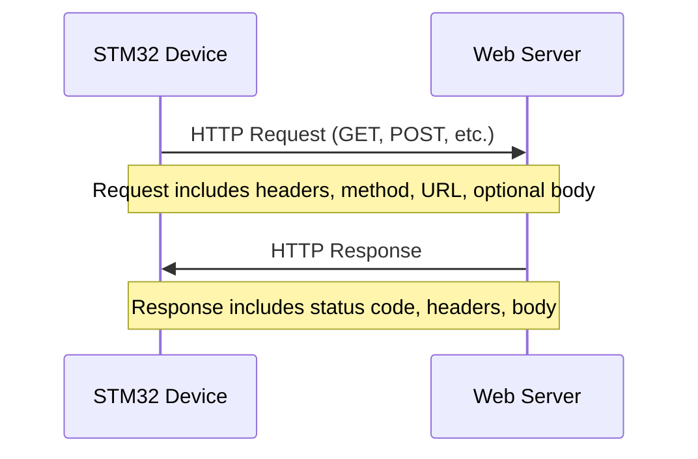
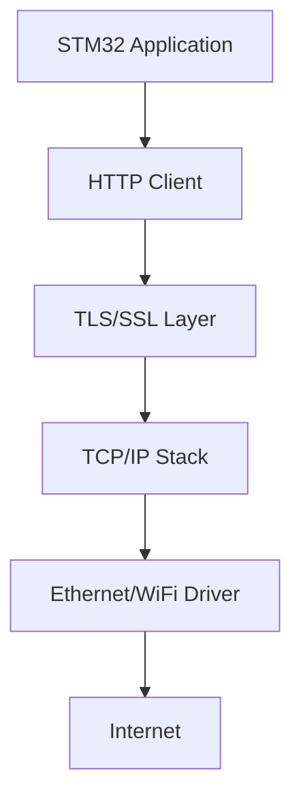

# STM32 HTTP Client

## Introduction

In today's interconnected world, even small embedded devices need to communicate with the internet. The STM32 family of microcontrollers provides powerful capabilities for implementing network connectivity, including HTTP clients that can interact with web services and APIs.

This tutorial will guide you through creating an HTTP client on STM32 microcontrollers, allowing your embedded projects to connect to web services, retrieve data, and send information to servers. We'll explore how to establish connections, format HTTP requests, process responses, and implement practical applications.

## Prerequisites

Before diving into HTTP client implementation, you should have:

- Basic knowledge of STM32 microcontrollers
- Familiarity with C programming
- An STM32 development board with network connectivity (Ethernet or WiFi)
- STM32CubeIDE or similar development environment
- STM32Cube firmware package installed

## Understanding HTTP Communication

HTTP (Hypertext Transfer Protocol) is the foundation of data communication on the web. When implementing an HTTP client on STM32, you need to understand the basic request-response cycle:



The HTTP client on your STM32 device will:
1. Establish a TCP connection with the server
2. Format and send an HTTP request
3. Receive and parse the HTTP response
4. Close the connection or keep it alive for additional requests

## Required Components

To implement an HTTP client on STM32, you'll need:

1. **Network Interface**: Either Ethernet (using STM32 Ethernet MAC) or WiFi (using modules like ESP8266 or built-in WiFi on some STM32 boards)
2. **TCP/IP Stack**: LwIP (Lightweight IP) is commonly used on STM32 devices
3. **HTTP Client Implementation**: Either custom code or middleware libraries

## Setting Up the Environment

First, we need to properly configure the STM32 project. We'll use STM32CubeMX to generate the project structure:

1. Create a new project in STM32CubeMX
2. Select your STM32 board or microcontroller
3. Configure the Ethernet or WiFi interface in the Connectivity section
4. Enable LwIP in the Middleware section
5. Configure the LwIP settings

### Example Configuration for Ethernet-based HTTP Client

For an STM32F4 or STM32F7 with Ethernet capability:

```c
/* Ethernet configuration */
ETH_HandleTypeDef heth;

/* LwIP configuration */
struct netif gnetif;
ip4_addr_t ipaddr;
ip4_addr_t netmask;
ip4_addr_t gateway;

void Network_Config(void)
{
  /* IP address setting */
  IP4_ADDR(&ipaddr, 192, 168, 1, 100);
  IP4_ADDR(&netmask, 255, 255, 255, 0);
  IP4_ADDR(&gateway, 192, 168, 1, 1);
  
  /* Initialize the LwIP stack */
  tcpip_init(NULL, NULL);
  
  /* Add the network interface */
  netif_add(&gnetif, &ipaddr, &netmask, &gateway, NULL, ethernetif_init, tcpip_input);
  netif_set_default(&gnetif);
  
  /* Set netif up */
  netif_set_up(&gnetif);
}
```

## Basic HTTP Client Implementation

Now, let's implement a simple HTTP client that can make GET requests:

```c
#include "lwip/api.h"
#include "lwip/tcp.h"
#include "lwip/dns.h"
#include <string.h>

#define HTTP_PORT 80
#define BUFFER_SIZE 2048

typedef struct {
    char *response;           // Buffer to store the HTTP response
    uint32_t response_len;    // Length of the response
    uint32_t buffer_size;     // Size of the buffer
    uint8_t complete;         // Flag to indicate complete response
} http_client_t;

/**
 * @brief Makes an HTTP GET request to the specified server and path
 * @param server_name The server hostname (e.g., "api.example.com")
 * @param server_path The path to request (e.g., "/data/weather")
 * @param response Pointer to store the response
 * @param max_len Maximum length of the response buffer
 * @return Length of response or error code
 */
int http_client_get(const char *server_name, const char *server_path, char *response, uint32_t max_len)
{
    struct netbuf *buf;
    struct netconn *conn;
    ip_addr_t server_ip;
    err_t err;
    http_client_t client;
    char *request_header;
    char *data;
    u16_t len;
    
    // Initialize the client structure
    client.response = response;
    client.response_len = 0;
    client.buffer_size = max_len;
    client.complete = 0;
    
    // Resolve the server hostname to an IP address
    err = netconn_gethostbyname(server_name, &server_ip);
    if (err != ERR_OK) {
        return -1; // Failed to resolve hostname
    }
    
    // Create a new TCP connection
    conn = netconn_new(NETCONN_TCP);
    if (conn == NULL) {
        return -2; // Failed to create connection
    }
    
    // Set a receive timeout
    netconn_set_recvtimeout(conn, 10000); // 10 seconds
    
    // Connect to the server
    err = netconn_connect(conn, &server_ip, HTTP_PORT);
    if (err != ERR_OK) {
        netconn_delete(conn);
        return -3; // Failed to connect
    }
    
    // Format the HTTP request header
    request_header = pvPortMalloc(BUFFER_SIZE);
    if (request_header == NULL) {
        netconn_close(conn);
        netconn_delete(conn);
        return -4; // Failed to allocate memory
    }
    
    // Construct HTTP GET request
    snprintf(request_header, BUFFER_SIZE,
             "GET %s HTTP/1.1\r
"
             "Host: %s\r
"
             "Connection: close\r
"
             "User-Agent: STM32HTTPClient/1.0\r
"
             "\r
",
             server_path, server_name);
             
    // Send the request
    err = netconn_write(conn, request_header, strlen(request_header), NETCONN_COPY);
    vPortFree(request_header);
    
    if (err != ERR_OK) {
        netconn_close(conn);
        netconn_delete(conn);
        return -5; // Failed to send request
    }
    
    // Receive and process the response
    while ((err = netconn_recv(conn, &buf)) == ERR_OK) {
        do {
            netbuf_data(buf, (void**)&data, &len);
            
            // Check if response buffer has enough space
            if (client.response_len + len > client.buffer_size) {
                netbuf_delete(buf);
                netconn_close(conn);
                netconn_delete(conn);
                return -6; // Response too large
            }
            
            // Copy the response data to the buffer
            memcpy(client.response + client.response_len, data, len);
            client.response_len += len;
        } while (netbuf_next(buf) >= 0);
        
        netbuf_delete(buf);
    }
    
    // Ensure the response is null-terminated
    if (client.response_len < client.buffer_size) {
        client.response[client.response_len] = '\0';
    } else {
        client.response[client.buffer_size - 1] = '\0';
    }
    
    // Clean up
    netconn_close(conn);
    netconn_delete(conn);
    
    return client.response_len;
}
```

## Parsing HTTP Responses

Once you've received an HTTP response, you'll need to parse it to extract the important information:

```c
/**
 * @brief Parses an HTTP response to extract status code and body
 * @param response The complete HTTP response
 * @param body Pointer that will be set to the start of the response body
 * @return HTTP status code or error code
 */
int http_parse_response(char *response, char **body)
{
    int status_code = 0;
    char *status_line = response;
    char *header_end;
    
    // Check for valid HTTP response
    if (strncmp(response, "HTTP/1.", 7) != 0) {
        return -1; // Not an HTTP response
    }
    
    // Extract status code
    status_line += 9; // Skip "HTTP/1.x "
    status_code = atoi(status_line);
    
    // Find the end of headers (marked by double CRLF)
    header_end = strstr(response, "\r
\r
");
    if (header_end != NULL) {
        *body = header_end + 4; // Point to start of body
    } else {
        *body = NULL;
        return -2; // Malformed response
    }
    
    return status_code;
}
```

## Making POST Requests

For sending data to a server, you'll need to implement HTTP POST requests:

```c
/**
 * @brief Makes an HTTP POST request with JSON data
 * @param server_name The server hostname
 * @param server_path The path to request
 * @param json_data JSON data to send in the request body
 * @param response Buffer to store the response
 * @param max_len Maximum length of the response buffer
 * @return Length of response or error code
 */
int http_client_post_json(const char *server_name, const char *server_path, 
                          const char *json_data, char *response, uint32_t max_len)
{
    struct netbuf *buf;
    struct netconn *conn;
    ip_addr_t server_ip;
    err_t err;
    http_client_t client;
    char *request_header;
    char *data;
    u16_t len;
    
    // Initialize the client structure
    client.response = response;
    client.response_len = 0;
    client.buffer_size = max_len;
    client.complete = 0;
    
    // Resolve the server hostname to an IP address
    err = netconn_gethostbyname(server_name, &server_ip);
    if (err != ERR_OK) {
        return -1; // Failed to resolve hostname
    }
    
    // Create a new TCP connection
    conn = netconn_new(NETCONN_TCP);
    if (conn == NULL) {
        return -2; // Failed to create connection
    }
    
    // Set a receive timeout
    netconn_set_recvtimeout(conn, 10000); // 10 seconds
    
    // Connect to the server
    err = netconn_connect(conn, &server_ip, HTTP_PORT);
    if (err != ERR_OK) {
        netconn_delete(conn);
        return -3; // Failed to connect
    }
    
    // Format the HTTP request header
    request_header = pvPortMalloc(BUFFER_SIZE);
    if (request_header == NULL) {
        netconn_close(conn);
        netconn_delete(conn);
        return -4; // Failed to allocate memory
    }
    
    // Construct HTTP POST request with JSON content
    snprintf(request_header, BUFFER_SIZE,
             "POST %s HTTP/1.1\r
"
             "Host: %s\r
"
             "Connection: close\r
"
             "Content-Type: application/json\r
"
             "Content-Length: %d\r
"
             "User-Agent: STM32HTTPClient/1.0\r
"
             "\r
",
             server_path, server_name, strlen(json_data));
             
    // Send the request header
    err = netconn_write(conn, request_header, strlen(request_header), NETCONN_COPY);
    vPortFree(request_header);
    
    if (err != ERR_OK) {
        netconn_close(conn);
        netconn_delete(conn);
        return -5; // Failed to send request header
    }
    
    // Send the JSON data
    err = netconn_write(conn, json_data, strlen(json_data), NETCONN_COPY);
    if (err != ERR_OK) {
        netconn_close(conn);
        netconn_delete(conn);
        return -6; // Failed to send JSON data
    }
    
    // Receive and process the response (same as GET request)
    while ((err = netconn_recv(conn, &buf)) == ERR_OK) {
        do {
            netbuf_data(buf, (void**)&data, &len);
            
            // Check if response buffer has enough space
            if (client.response_len + len > client.buffer_size) {
                netbuf_delete(buf);
                netconn_close(conn);
                netconn_delete(conn);
                return -7; // Response too large
            }
            
            // Copy the response data to the buffer
            memcpy(client.response + client.response_len, data, len);
            client.response_len += len;
        } while (netbuf_next(buf) >= 0);
        
        netbuf_delete(buf);
    }
    
    // Ensure the response is null-terminated
    if (client.response_len < client.buffer_size) {
        client.response[client.response_len] = '\0';
    } else {
        client.response[client.buffer_size - 1] = '\0';
    }
    
    // Clean up
    netconn_close(conn);
    netconn_delete(conn);
    
    return client.response_len;
}
```

## Real-World Example: Weather Data Retrieval

Let's implement a practical example of using our HTTP client to fetch weather data from a public API:

```c
#include "main.h"
#include "cmsis_os.h"
#include "stdio.h"
#include "string.h"

#define BUFFER_SIZE 4096

/* Response buffer */
char response_buffer[BUFFER_SIZE];

/* Weather API details */
#define WEATHER_SERVER "api.openweathermap.org"
#define WEATHER_API_KEY "your_api_key_here"  // Replace with your actual API key

/**
 * @brief Task to fetch and display weather data
 * @param argument Unused
 */
void WeatherTask(void const * argument)
{
  char api_path[128];
  char *body;
  int status;
  int temp;
  char weather_desc[64] = {0};
  
  /* Give the network time to initialize */
  osDelay(5000);
  
  for(;;)
  {
    /* Format the API request path with your API key */
    snprintf(api_path, sizeof(api_path), 
             "/data/2.5/weather?q=London,uk&units=metric&appid=%s", 
             WEATHER_API_KEY);
    
    /* Make the HTTP request */
    printf("Fetching weather data...\r
");
    int result = http_client_get(WEATHER_SERVER, api_path, response_buffer, BUFFER_SIZE);
    
    /* Check if request was successful */
    if (result > 0) {
      /* Parse the HTTP response */
      status = http_parse_response(response_buffer, &body);
      
      if (status == 200 && body != NULL) {
        /* Simple parsing of JSON response for temperature and description */
        /* Note: A proper JSON parser would be better for production use */
        char *temp_ptr = strstr(body, "\"temp\":");
        char *desc_ptr = strstr(body, "\"description\":\"");
        
        if (temp_ptr && desc_ptr) {
          temp_ptr += 7; // Skip "\"temp\":"
          temp = (int)atof(temp_ptr);
          
          desc_ptr += 14; // Skip "\"description\":\""
          char *desc_end = strchr(desc_ptr, '\"');
          if (desc_end) {
            int desc_len = desc_end - desc_ptr;
            strncpy(weather_desc, desc_ptr, desc_len < 63 ? desc_len : 63);
            weather_desc[desc_len] = '\0';
          }
          
          /* Display the weather information */
          printf("Current weather in London:\r
");
          printf("Temperature: %d°C\r
", temp);
          printf("Conditions: %s\r
", weather_desc);
        } else {
          printf("Failed to parse weather data\r
");
        }
      } else {
        printf("HTTP Error: %d\r
", status);
      }
    } else {
      printf("Request failed with code: %d\r
", result);
    }
    
    /* Wait for 30 minutes before next update */
    osDelay(30 * 60 * 1000);
  }
}
```

Output example:
```
Fetching weather data...
Current weather in London:
Temperature: 14°C
Conditions: light rain
```

## Using HTTPS (Secure HTTP)

Most modern web services require secure connections using HTTPS. To implement HTTPS on STM32, you'll need to add TLS/SSL support:



There are several options for adding TLS support:

1. **mbedTLS**: A lightweight TLS implementation that works well with STM32
2. **wolfSSL**: Another embedded-friendly TLS library
3. **ARM TLS**: Part of the mbed platform

Here's a basic example of how to integrate mbedTLS with our HTTP client:

```c
#include "mbedtls/net.h"
#include "mbedtls/ssl.h"
#include "mbedtls/entropy.h"
#include "mbedtls/ctr_drbg.h"
#include "mbedtls/debug.h"

#define HTTPS_PORT "443"

/**
 * @brief Makes an HTTPS GET request using mbedTLS
 * @param server_name The server hostname
 * @param server_path The path to request
 * @param response Buffer to store the response
 * @param max_len Maximum length of the response buffer
 * @return Length of response or error code
 */
int https_client_get(const char *server_name, const char *server_path, 
                     char *response, uint32_t max_len)
{
    int ret = 0;
    size_t len;
    mbedtls_net_context server_fd;
    mbedtls_entropy_context entropy;
    mbedtls_ctr_drbg_context ctr_drbg;
    mbedtls_ssl_context ssl;
    mbedtls_ssl_config conf;
    mbedtls_x509_crt cacert;
    uint32_t response_len = 0;
    
    char *request = NULL;
    unsigned char buf[1024];
    const char *pers = "https_client";
    
    /* Initialize the structures */
    mbedtls_net_init(&server_fd);
    mbedtls_ssl_init(&ssl);
    mbedtls_ssl_config_init(&conf);
    mbedtls_x509_crt_init(&cacert);
    mbedtls_ctr_drbg_init(&ctr_drbg);
    mbedtls_entropy_init(&entropy);
    
    /* Seed the random number generator */
    if ((ret = mbedtls_ctr_drbg_seed(&ctr_drbg, mbedtls_entropy_func, &entropy,
                               (const unsigned char *) pers, strlen(pers))) != 0) {
        return -1;
    }
    
    /* Initialize the SSL configuration */
    if ((ret = mbedtls_ssl_config_defaults(&conf,
                                    MBEDTLS_SSL_IS_CLIENT,
                                    MBEDTLS_SSL_TRANSPORT_STREAM,
                                    MBEDTLS_SSL_PRESET_DEFAULT)) != 0) {
        return -2;
    }
    
    /* Set up the SSL context */
    mbedtls_ssl_conf_authmode(&conf, MBEDTLS_SSL_VERIFY_OPTIONAL);
    mbedtls_ssl_conf_ca_chain(&conf, &cacert, NULL);
    mbedtls_ssl_conf_rng(&conf, mbedtls_ctr_drbg_random, &ctr_drbg);
    
    if ((ret = mbedtls_ssl_setup(&ssl, &conf)) != 0) {
        return -3;
    }
    
    if ((ret = mbedtls_ssl_set_hostname(&ssl, server_name)) != 0) {
        return -4;
    }
    
    /* Connect to the server */
    if ((ret = mbedtls_net_connect(&server_fd, server_name,
                              HTTPS_PORT, MBEDTLS_NET_PROTO_TCP)) != 0) {
        return -5;
    }
    
    /* Setup the SSL/TLS connection */
    mbedtls_ssl_set_bio(&ssl, &server_fd, mbedtls_net_send, mbedtls_net_recv, NULL);
    
    while ((ret = mbedtls_ssl_handshake(&ssl)) != 0) {
        if (ret != MBEDTLS_ERR_SSL_WANT_READ && ret != MBEDTLS_ERR_SSL_WANT_WRITE) {
            return -6;
        }
    }
    
    /* Format the HTTP request */
    request = pvPortMalloc(1024);
    if (request == NULL) {
        return -7;
    }
    
    snprintf(request, 1024,
             "GET %s HTTP/1.1\r
"
             "Host: %s\r
"
             "Connection: close\r
"
             "User-Agent: STM32HTTPSClient/1.0\r
"
             "\r
",
             server_path, server_name);
    
    /* Send the HTTP request */
    while ((ret = mbedtls_ssl_write(&ssl, (const unsigned char *)request, 
                                   strlen(request))) <= 0) {
        if (ret != MBEDTLS_ERR_SSL_WANT_READ && ret != MBEDTLS_ERR_SSL_WANT_WRITE) {
            vPortFree(request);
            return -8;
        }
    }
    
    vPortFree(request);
    
    /* Read the HTTP response */
    do {
        len = sizeof(buf) - 1;
        memset(buf, 0, sizeof(buf));
        ret = mbedtls_ssl_read(&ssl, buf, len);
        
        if (ret == MBEDTLS_ERR_SSL_WANT_READ || ret == MBEDTLS_ERR_SSL_WANT_WRITE)
            continue;
            
        if (ret == MBEDTLS_ERR_SSL_PEER_CLOSE_NOTIFY)
            break;
            
        if (ret < 0) {
            return -9;
        }
        
        if (ret == 0) {
            break;
        }
        
        /* Copy response to the buffer */
        if (response_len + ret < max_len) {
            memcpy(response + response_len, buf, ret);
            response_len += ret;
        } else {
            return -10; // Response too large
        }
    } while (1);
    
    /* Add null terminator */
    if (response_len < max_len) {
        response[response_len] = '\0';
    } else {
        response[max_len - 1] = '\0';
    }
    
    /* Clean up */
    mbedtls_ssl_close_notify(&ssl);
    mbedtls_net_free(&server_fd);
    mbedtls_x509_crt_free(&cacert);
    mbedtls_ssl_free(&ssl);
    mbedtls_ssl_config_free(&conf);
    mbedtls_ctr_drbg_free(&ctr_drbg);
    mbedtls_entropy_free(&entropy);
    
    return response_len;
}
```

## Best Practices for STM32 HTTP Clients

When implementing HTTP clients on STM32 devices, consider these best practices:

1. **Memory Management**: Carefully manage buffers to avoid stack overflow and memory leaks.
2. **Timeouts**: Always set appropriate timeouts for network operations.
3. **Error Handling**: Implement robust error handling for network failures.
4. **Power Optimization**: Minimize network usage to conserve power.
5. **Security**: Use HTTPS when connecting to online services.
6. **Connection Pooling**: For frequent requests, consider keeping connections open.
7. **Request Throttling**: Avoid sending too many requests in a short period.

## Common Challenges and Solutions

### 1. Memory Constraints

**Challenge**: STM32 devices have limited RAM.

**Solution**: 
- Use streaming parsers for large responses
- Process data in chunks
- Free memory as soon as possible

### 2. Timeout and Retry Mechanism

**Challenge**: Network connections can be unreliable.

**Solution**:
```c
/**
 * @brief HTTP client with retry mechanism
 */
int http_client_get_with_retry(const char *server, const char *path, 
                              char *response, uint32_t max_len, 
                              uint8_t max_retries)
{
    int result;
    uint8_t retry_count = 0;
    
    while (retry_count < max_retries) {
        result = http_client_get(server, path, response, max_len);
        
        if (result > 0) {
            return result; // Success
        }
        
        // Wait before retrying (exponential backoff)
        osDelay((1 << retry_count) * 1000);
        retry_count++;
    }
    
    return -100; // All retries failed
}
```

### 3. Handling Large Responses

**Challenge**: Some HTTP responses may be too large for memory.

**Solution**:
- Implement chunked processing
- Use server-side pagination if available
- Request only needed fields

## Project: IoT Weather Station

Let's apply what we've learned to create a simple IoT weather station that:
1. Retrieves weather data from an online API
2. Displays it on an LCD
3. Uploads local sensor readings to a cloud service

Here's the main application code:

```c
#include "main.h"
#include "cmsis_os.h"
#include "lwip/api.h"
#include "stdio.h"
#include "string.h"

/* Includes for sensors and display */
#include "bsp_lcd.h"
#include "bsp_dht22.h"

#define BUFFER_SIZE 4096
char response_buffer[BUFFER_SIZE];

/* Weather API details */
#define WEATHER_SERVER "api.openweathermap.org"
#define WEATHER_API_KEY "your_api_key_here"

/* IoT platform details */
#define IOT_SERVER "api.thingspeak.com"
#define IOT_API_KEY "your_thingspeak_key"

/* Sensor data structure */
typedef struct {
    float temperature;
    float humidity;
    float pressure;
    uint32_t timestamp;
} sensor_data_t;

sensor_data_t sensor_readings;

/**
 * @brief Task to read sensor data
 */
void SensorTask(void const * argument)
{
    for(;;)
    {
        /* Read temperature and humidity from DHT22 sensor */
        DHT22_Read(&sensor_readings.temperature, &sensor_readings.humidity);
        
        /* Read timestamp from RTC */
        RTC_TimeTypeDef time;
        RTC_DateTypeDef date;
        HAL_RTC_GetTime(&hrtc, &time, RTC_FORMAT_BIN);
        HAL_RTC_GetDate(&hrtc, &date, RTC_FORMAT_BIN);
        
        /* Convert to timestamp */
        /* ... timestamp calculation ... */
        
        /* Display on LCD */
        LCD_Clear();
        LCD_SetCursor(0, 0);
        LCD_Printf("Local Readings:");
        LCD_SetCursor(0, 1);
        LCD_Printf("Temp: %.1fC", sensor_readings.temperature);
        LCD_SetCursor(0, 2);
        LCD_Printf("Humidity: %.1f%%", sensor_readings.humidity);
        
        /* Wait for 60 seconds before next reading */
        osDelay(60000);
    }
}

/**
 * @brief Task to upload sensor data to IoT platform
 */
void UploadTask(void const * argument)
{
    char json_data[256];
    char api_path[128];
    
    for(;;)
    {
        /* Format the sensor data as JSON */
        snprintf(json_data, sizeof(json_data),
                 "{\"api_key\":\"%s\",\"field1\":%.2f,\"field2\":%.2f}",
                 IOT_API_KEY, sensor_readings.temperature, sensor_readings.humidity);
        
        /* Format the API path */
        strcpy(api_path, "/update");
        
        /* Upload the data */
        LCD_SetCursor(0, 4);
        LCD_Printf("Uploading data...");
        
        int result = http_client_post_json(IOT_SERVER, api_path, json_data, 
                                          response_buffer, BUFFER_SIZE);
        
        if (result > 0) {
            LCD_SetCursor(0, 4);
            LCD_Printf("Upload successful!");
        } else {
            LCD_SetCursor(0, 4);
            LCD_Printf("Upload failed: %d", result);
        }
        
        /* Wait for 5 minutes before next upload */
        osDelay(5 * 60 * 1000);
    }
}

/**
 * @brief Task to fetch online weather data
 */
void WeatherTask(void const * argument)
{
    char api_path[128];
    char *body;
    int status;
    float temp;
    char weather_desc[64] = {0};
    
    for(;;)
    {
        /* Format the API request path */
        snprintf(api_path, sizeof(api_path), 
                 "/data/2.5/weather?q=London,uk&units=metric&appid=%s", 
                 WEATHER_API_KEY);
        
        /* Fetch the weather data */
        LCD_SetCursor(0