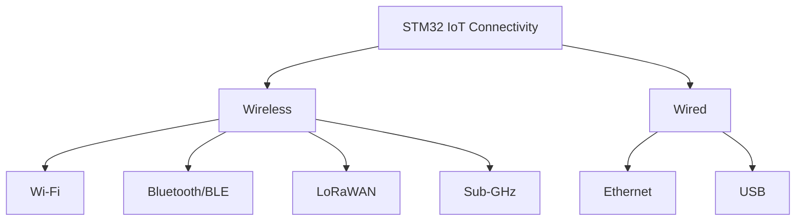
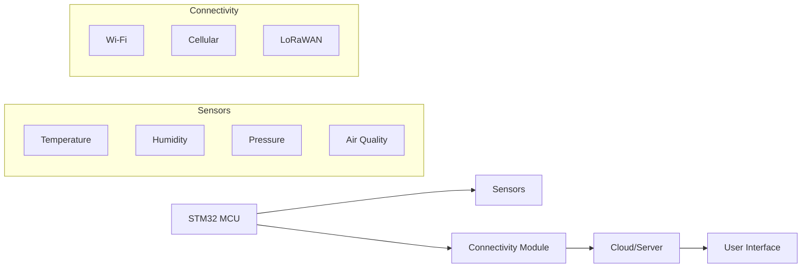

# STM32 IoT Connectivity

## Introduction

The Internet of Things (IoT) has revolutionized how we interact with technology, enabling devices to communicate, collect data, and perform actions without human intervention. STM32 microcontrollers, with their powerful processing capabilities and rich peripheral options, provide an excellent platform for creating IoT devices.

This guide explores how to connect your STM32 microcontroller to IoT networks using various connectivity options. Whether you're building a smart home device, an industrial sensor, or a wearable gadget, understanding how to implement IoT connectivity on STM32 will open up exciting possibilities for your projects.

## IoT Connectivity Options for STM32

STM32 microcontrollers support multiple connectivity options for IoT applications:



Let's explore these options in detail.

## Wi-Fi Connectivity

Wi-Fi is one of the most popular methods for connecting IoT devices to the internet due to its high bandwidth and widespread availability.

### Hardware Options

1. **STM32 with integrated Wi-Fi**:
   - STM32WB series (combines Arm® Cortex®-M4 and Bluetooth LE/Wi-Fi)
   - STM32WL series

2. **External Wi-Fi modules**:
   - ESP8266 or ESP32 as co-processors
   - SPWF modules from STMicroelectronics
   - Microchip WINC series modules

### Setting Up Wi-Fi with STM32

Here's a basic example of connecting an STM32 to Wi-Fi using an ESP8266 module:

```c
/* Include necessary libraries */
#include "stm32f4xx_hal.h"
#include "string.h"
#include "stdio.h"

/* UART handle declaration */
UART_HandleTypeDef huart2; // For ESP8266 communication

/* Function prototypes */
void SystemClock_Config(void);
static void MX_GPIO_Init(void);
static void MX_USART2_UART_Init(void);
HAL_StatusTypeDef ESP8266_SendCommand(char* command);
HAL_StatusTypeDef ESP8266_WaitForResponse(char* response, uint32_t timeout);

char esp8266_buffer[128];
char esp8266_cmd[64];

int main(void)
{
  /* MCU Configuration */
  HAL_Init();
  SystemClock_Config();
  MX_GPIO_Init();
  MX_USART2_UART_Init();
  
  /* Initialize ESP8266 */
  HAL_Delay(1000); // Wait for ESP8266 to boot
  
  // Reset module
  ESP8266_SendCommand("AT+RST\r
");
  HAL_Delay(2000);
  
  // Set mode to station (client)
  ESP8266_SendCommand("AT+CWMODE=1\r
");
  ESP8266_WaitForResponse("OK", 1000);
  
  // Connect to access point
  sprintf(esp8266_cmd, "AT+CWJAP=\"YOUR_WIFI_SSID\",\"YOUR_WIFI_PASSWORD\"\r
");
  ESP8266_SendCommand(esp8266_cmd);
  ESP8266_WaitForResponse("OK", 10000); // This may take a while
  
  // Check if connected and get IP
  ESP8266_SendCommand("AT+CIFSR\r
");
  ESP8266_WaitForResponse("OK", 1000);
  
  while (1)
  {
    /* Main application code */
    HAL_Delay(1000);
  }
}

/* Send command to ESP8266 */
HAL_StatusTypeDef ESP8266_SendCommand(char* command)
{
  return HAL_UART_Transmit(&huart2, (uint8_t*)command, strlen(command), 1000);
}

/* Wait for response from ESP8266 */
HAL_StatusTypeDef ESP8266_WaitForResponse(char* response, uint32_t timeout)
{
  uint32_t startTime = HAL_GetTick();
  uint16_t rxLen = 0;
  
  memset(esp8266_buffer, 0, sizeof(esp8266_buffer));
  
  while ((HAL_GetTick() - startTime) < timeout)
  {
    HAL_UART_Receive(&huart2, (uint8_t*)(esp8266_buffer + rxLen), 1, 100);
    if (strstr(esp8266_buffer, response) != NULL)
      return HAL_OK;
    rxLen++;
    if (rxLen >= sizeof(esp8266_buffer) - 1)
      rxLen = 0; // Reset to prevent buffer overflow
  }
  
  return HAL_TIMEOUT;
}

/* UART initialization function */
static void MX_USART2_UART_Init(void)
{
  huart2.Instance = USART2;
  huart2.Init.BaudRate = 115200;
  huart2.Init.WordLength = UART_WORDLENGTH_8B;
  huart2.Init.StopBits = UART_STOPBITS_1;
  huart2.Init.Parity = UART_PARITY_NONE;
  huart2.Init.Mode = UART_MODE_TX_RX;
  huart2.Init.HwFlowCtl = UART_HWCONTROL_NONE;
  huart2.Init.OverSampling = UART_OVERSAMPLING_16;
  
  if (HAL_UART_Init(&huart2) != HAL_OK)
  {
    Error_Handler();
  }
}
```

In this example:
1. We initialize UART communication with the ESP8266
2. Send AT commands to configure the module
3. Connect to a WiFi network
4. Check the connection status

## Bluetooth Low Energy (BLE) Connectivity

BLE is ideal for IoT applications due to its low power consumption and sufficient data transfer rates for many sensor applications.

### Hardware Options

1. **STM32 with integrated BLE**:
   - STM32WB series
   - STM32WBA series

2. **External BLE modules**:
   - SPBTLE-RF module
   - HM-10 BLE module

### BLE Implementation Example

Here's a simplified example using the STM32WB series with integrated BLE:

```c
/* Include necessary libraries */
#include "main.h"
#include "app_common.h"
#include "app_entry.h"
#include "app_ble.h"
#include "ble.h"
#include "tl.h"
#include "stm32_seq.h"
#include "shci.h"
#include "stm32_lpm.h"
#include "dbg_trace.h"

/* Private function prototypes */
static void SystemClock_Config(void);
static void SystemPower_Config(void);
static void Init_IPCC(void);
static void BLE_Init(void);

/* Private variables */
PLACE_IN_SECTION("MB_MEM1") ALIGN(4) static TL_CmdPacket_t BleCmdBuffer;

int main(void)
{
  /* MCU Configuration */
  HAL_Init();
  SystemClock_Config();
  SystemPower_Config();
  
  /* Initialize all peripherals */
  Init_IPCC();
  
  /* Initialize BLE */
  BLE_Init();
  
  /* Start the main work */
  UTIL_SEQ_RegTask(1<<CFG_TASK_BLE_HCI_EVENT_ID, UTIL_SEQ_RFU, hci_event_handler);
  
  while (1)
  {
    UTIL_SEQ_Run(UTIL_SEQ_DEFAULT);
  }
}

static void BLE_Init(void)
{
  /* Initialize BLE Transport Layer */
  TL_BLE_Init();
  
  /* Register event for handling BLE events */
  UTIL_SEQ_RegTask(1<<CFG_TASK_BLE_HCI_EVENT_ID, UTIL_SEQ_RFU, hci_event_handler);
  
  /* Configure and initialize the CPU2 (BLE stack) */
  SHCI_C2_BLE_Init_Cmd_Packet_t ble_init_cmd_packet =
  {
    .Header = {{0,0,0}},
    .param = {
      .BLE_Init_Mode = 1, // Thread mode 1
      .BLE_Init_BLE_Stack_Mode = 1, // Full stack mode
      .BLE_Init_BLE_Stack_Options = {0},
    }
  };
  
  SHCI_CmdStatus_t status = SHCI_C2_BLE_Init(&ble_init_cmd_packet);
  if (status != SHCI_Success)
  {
    /* Handle initialization error */
    Error_Handler();
  }
}

/* Initialize IPCC for communication between the two cores */
static void Init_IPCC(void)
{
  /* IPCC initialisation */
  MX_IPCC_Init();
  
  /* Enable IPCC interrupts */
  HAL_NVIC_SetPriority(IPCC_C1_RX_IRQn, 0, 0);
  HAL_NVIC_EnableIRQ(IPCC_C1_RX_IRQn);
  HAL_NVIC_SetPriority(IPCC_C1_TX_IRQn, 0, 0);
  HAL_NVIC_EnableIRQ(IPCC_C1_TX_IRQn);
}
```

This example demonstrates the initialization of the BLE stack on an STM32WB device. The actual application-specific BLE services and characteristics would be implemented on top of this foundation.

## MQTT Protocol for IoT Communication

MQTT (Message Queuing Telemetry Transport) is a lightweight messaging protocol designed for IoT applications. It operates on a publish-subscribe model and is ideal for devices with limited resources.

### MQTT Client Implementation

Here's an example of implementing an MQTT client on STM32 using the LwIP stack and MQTT client library:

```c
/* Include necessary libraries */
#include "lwip/apps/mqtt.h"
#include "lwip/netif.h"
#include "lwip/tcpip.h"
#include "ethernetif.h"

/* MQTT client */
static mqtt_client_t* mqtt_client;
static ip_addr_t mqtt_server_ip;

/* MQTT configuration */
#define MQTT_SERVER_IP  "192.168.1.100"
#define MQTT_SERVER_PORT 1883
#define MQTT_CLIENT_ID "stm32_device"
#define MQTT_USERNAME "user"
#define MQTT_PASSWORD "password"

/* MQTT callback functions */
static void mqtt_connection_cb(mqtt_client_t *client, void *arg, mqtt_connection_status_t status);
static void mqtt_incoming_publish_cb(void *arg, const char *topic, u32_t tot_len);
static void mqtt_incoming_data_cb(void *arg, const u8_t *data, u16_t len, u8_t flags);

/* Initialize MQTT client */
void mqtt_client_init(void)
{
  /* Create new MQTT client */
  mqtt_client = mqtt_client_new();
  
  if (mqtt_client != NULL)
  {
    /* Setup MQTT client info */
    struct mqtt_connect_client_info_t client_info;
    memset(&client_info, 0, sizeof(client_info));
    
    client_info.client_id = MQTT_CLIENT_ID;
    client_info.client_user = MQTT_USERNAME;
    client_info.client_pass = MQTT_PASSWORD;
    client_info.keep_alive = 60;
    client_info.will_topic = NULL; // No last will
    client_info.will_msg = NULL;
    client_info.will_retain = 0;
    client_info.will_qos = 0;
    
    /* Convert server address */
    IP4_ADDR(&mqtt_server_ip, 192, 168, 1, 100); // Replace with your broker IP
    
    /* Try to connect */
    mqtt_client_connect(mqtt_client, &mqtt_server_ip, MQTT_SERVER_PORT, 
                        mqtt_connection_cb, NULL, &client_info);
  }
}

/* MQTT connection callback */
static void mqtt_connection_cb(mqtt_client_t *client, void *arg, mqtt_connection_status_t status)
{
  if (status == MQTT_CONNECT_ACCEPTED)
  {
    printf("MQTT client connected\r
");
    
    /* Subscribe to topics */
    mqtt_set_inpub_callback(client, mqtt_incoming_publish_cb, mqtt_incoming_data_cb, NULL);
    mqtt_subscribe(client, "device/commands", 0, NULL, NULL);
  }
  else
  {
    printf("MQTT client connection failed: %d\r
", status);
    
    /* Try to reconnect after a delay */
    HAL_Delay(5000);
    mqtt_client_connect(client, &mqtt_server_ip, MQTT_SERVER_PORT, 
                        mqtt_connection_cb, NULL, NULL);
  }
}

/* Callback for incoming publish messages */
static void mqtt_incoming_publish_cb(void *arg, const char *topic, u32_t tot_len)
{
  printf("MQTT message received on topic: %s\r
", topic);
}

/* Callback for incoming message data */
static void mqtt_incoming_data_cb(void *arg, const u8_t *data, u16_t len, u8_t flags)
{
  /* Print received data */
  printf("Received data: ");
  for (uint16_t i = 0; i < len; i++)
  {
    printf("%c", data[i]);
  }
  printf("\r
");
  
  /* Process the data as needed for your application */
}

/* Example function to publish data */
void publish_sensor_data(float temperature, float humidity)
{
  char mqtt_message[64];
  sprintf(mqtt_message, "{\"temp\":%.2f,\"humidity\":%.2f}", temperature, humidity);
  
  mqtt_publish(mqtt_client, "device/sensors", mqtt_message, strlen(mqtt_message), 0, 0, NULL, NULL);
}
```

## LoRaWAN for Long-Range IoT Applications

LoRaWAN is perfect for applications that require long-range communication with low power consumption, such as agricultural sensors or smart city infrastructure.

### Hardware Options

1. **STM32 with integrated LoRa**:
   - STM32WL series

2. **External LoRa modules**:
   - SX1272/76/78 transceivers
   - RFM95/96/97/98 modules

### LoRaWAN Implementation Example

Here's a simplified example using the STM32WL series with the integrated LoRa modem:

```c
/* Include necessary libraries */
#include "main.h"
#include "app_lorawan.h"
#include "lora_app.h"
#include "sys_app.h"
#include "stm32_seq.h"

/* Private function prototypes */
static void SystemClock_Config(void);
static void MX_GPIO_Init(void);
static void MX_LoRaWAN_Init(void);

/* LoRaWAN application data */
static LmHandlerAppData_t AppData = {0};
static uint8_t AppDataBuffer[LORAWAN_APP_DATA_MAX_SIZE];

int main(void)
{
  /* MCU Configuration */
  HAL_Init();
  SystemClock_Config();
  MX_GPIO_Init();
  
  /* Initialize LoRaWAN */
  MX_LoRaWAN_Init();
  
  /* USER CODE BEGIN */
  
  /* Initialize sensor data buffer */
  AppData.Buffer = AppDataBuffer;
  AppData.BufferSize = 0;
  AppData.Port = LORAWAN_APP_PORT;
  
  /* Join the LoRaWAN network */
  LmHandlerJoin(ACTIVATION_TYPE_OTAA);
  
  while (1)
  {
    /* Run background tasks */
    UTIL_SEQ_Run(UTIL_SEQ_DEFAULT);
    
    /* Prepare sensor data - example with temperature */
    float temperature = 25.5; // Replace with actual sensor reading
    AppData.Buffer[0] = (uint8_t)temperature;
    AppData.Buffer[1] = (uint8_t)((temperature - AppData.Buffer[0]) * 100);
    AppData.BufferSize = 2;
    
    /* Send data */
    LmHandlerSend(&AppData, LORAWAN_CONFIRMED_MSG);
    
    /* Wait before next transmission */
    HAL_Delay(300000); // 5 minutes
  }
  /* USER CODE END */
}

/* LoRaWAN callback functions */
void OnTxDone(void)
{
  printf("LoRa transmission completed successfully\r
");
}

void OnRxDone(uint8_t *payload, uint16_t size, int16_t rssi, int8_t snr)
{
  printf("LoRa message received (RSSI: %d, SNR: %d)\r
", rssi, snr);
  
  /* Process the received data */
  printf("Payload: ");
  for (uint16_t i = 0; i < size; i++)
  {
    printf("%02X ", payload[i]);
  }
  printf("\r
");
}

void OnJoinRequest(LmHandlerJoinParams_t *joinParams)
{
  if (joinParams->Status == LORAMAC_HANDLER_SUCCESS)
  {
    printf("LoRaWAN network joined successfully\r
");
  }
  else
  {
    printf("LoRaWAN join failed\r
");
  }
}
```

## Ethernet Connectivity

For applications requiring high bandwidth and reliable connectivity, Ethernet is an excellent choice.

### Hardware Options

1. **STM32 with Ethernet MAC**:
   - STM32F4/F7 series
   - STM32H7 series

2. **External Ethernet PHY**:
   - LAN8720
   - DP83848

### Ethernet Implementation with LwIP

```c
/* Include necessary libraries */
#include "lwip/opt.h"
#include "lwip/init.h"
#include "lwip/netif.h"
#include "lwip/tcpip.h"
#include "lwip/dhcp.h"
#include "ethernetif.h"
#include "app_ethernet.h"

/* Network interface */
struct netif gnetif;

/* Ethernet initialization function */
void ethernet_init(void)
{
  /* Initialize the LwIP stack */
  tcpip_init(NULL, NULL);
  
  /* Configure the Network interface */
  ip_addr_t ipaddr, netmask, gateway;
  
#if LWIP_DHCP
  IP4_ADDR(&ipaddr, 0, 0, 0, 0);
  IP4_ADDR(&netmask, 0, 0, 0, 0);
  IP4_ADDR(&gateway, 0, 0, 0, 0);
#else
  IP4_ADDR(&ipaddr, 192, 168, 1, 10);
  IP4_ADDR(&netmask, 255, 255, 255, 0);
  IP4_ADDR(&gateway, 192, 168, 1, 1);
#endif
  
  /* Add the network interface */
  netif_add(&gnetif, &ipaddr, &netmask, &gateway, NULL, &ethernetif_init, &tcpip_input);
  netif_set_default(&gnetif);
  
  /* Initialize the interface */
  if (netif_is_link_up(&gnetif))
  {
    netif_set_up(&gnetif);
    
#if LWIP_DHCP
    /* Start DHCP client */
    dhcp_start(&gnetif);
#endif
  }
  else
  {
    netif_set_down(&gnetif);
  }
}

/* Function to handle link status changes */
void ethernetif_update_config(struct netif *netif)
{
  if (netif_is_link_up(netif))
  {
    netif_set_up(netif);
    
#if LWIP_DHCP
    /* Start DHCP client */
    dhcp_start(netif);
#endif
    
    printf("Ethernet link is up\r
");
  }
  else
  {
    netif_set_down(netif);
    
#if LWIP_DHCP
    /* Stop DHCP client */
    dhcp_stop(netif);
#endif
    
    printf("Ethernet link is down\r
");
  }
}

/* Function to check DHCP status */
void check_dhcp_status(void)
{
  static uint32_t last_time = 0;
  static uint8_t ip_assigned = 0;
  
  /* Check if IP address was assigned */
  if (ip_assigned == 0)
  {
    if (gnetif.ip_addr.addr != 0)
    {
      ip_assigned = 1;
      
      printf("IP address assigned: %d.%d.%d.%d\r
",
             ip4_addr1_16(&gnetif.ip_addr),
             ip4_addr2_16(&gnetif.ip_addr),
             ip4_addr3_16(&gnetif.ip_addr),
             ip4_addr4_16(&gnetif.ip_addr));
    }
    else
    {
      /* Check periodically */
      if (HAL_GetTick() - last_time >= 1000)
      {
        last_time = HAL_GetTick();
        printf("Waiting for IP address...\r
");
      }
    }
  }
}
```

## Real-World Application: Weather Monitoring System

Let's build a practical example of a weather monitoring system using STM32 and IoT connectivity.

### System Architecture



### Implementation Example

Here's a simplified implementation of a weather station that collects data and sends it to an IoT platform via MQTT:

```c
/* Include necessary libraries */
#include "main.h"
#include "sensors.h"
#include "wifi.h"
#include "mqtt_client.h"
#include "stm32f4xx_hal.h"

/* Task periods */
#define SENSOR_READ_PERIOD   30000  // 30 seconds
#define MQTT_PUBLISH_PERIOD  300000 // 5 minutes

/* Sensor data structure */
typedef struct {
  float temperature;
  float humidity;
  float pressure;
  uint16_t airQuality;
  uint32_t timestamp;
} SensorData_t;

/* Global variables */
SensorData_t sensorData;
uint32_t lastSensorRead = 0;
uint32_t lastPublish = 0;

/* Function prototypes */
void SystemClock_Config(void);
static void MX_GPIO_Init(void);
static void ReadSensors(void);
static void PublishData(void);

int main(void)
{
  /* MCU Configuration */
  HAL_Init();
  SystemClock_Config();
  MX_GPIO_Init();
  
  /* Initialize peripherals */
  Sensors_Init();
  WiFi_Init();
  MQTT_Init();
  
  /* Connect to WiFi */
  while (!WiFi_Connect("YourSSID", "YourPassword"))
  {
    printf("Retrying WiFi connection...\r
");
    HAL_Delay(5000);
  }
  
  /* Connect to MQTT broker */
  while (!MQTT_Connect("broker.example.com", 1883, "WeatherStation1"))
  {
    printf("Retrying MQTT connection...\r
");
    HAL_Delay(5000);
  }
  
  /* Main loop */
  while (1)
  {
    /* Read sensors periodically */
    if (HAL_GetTick() - lastSensorRead >= SENSOR_READ_PERIOD)
    {
      ReadSensors();
      lastSensorRead = HAL_GetTick();
    }
    
    /* Publish data periodically */
    if (HAL_GetTick() - lastPublish >= MQTT_PUBLISH_PERIOD)
    {
      PublishData();
      lastPublish = HAL_GetTick();
    }
    
    /* Check connectivity status */
    if (!WiFi_IsConnected())
    {
      WiFi_Reconnect();
    }
    
    if (!MQTT_IsConnected())
    {
      MQTT_Reconnect();
    }
    
    /* Process incoming messages */
    MQTT_Process();
    
    /* Low power mode between operations */
    HAL_PWR_EnterSLEEPMode(PWR_MAINREGULATOR_ON, PWR_SLEEPENTRY_WFI);
  }
}

/* Read sensor data */
static void ReadSensors(void)
{
  sensorData.temperature = Sensors_ReadTemperature();
  sensorData.humidity = Sensors_ReadHumidity();
  sensorData.pressure = Sensors_ReadPressure();
  sensorData.airQuality = Sensors_ReadAirQuality();
  sensorData.timestamp = HAL_GetTick() / 1000; // seconds since start
  
  printf("Sensors read: T=%.1f°C, H=%.1f%%, P=%.1fhPa, AQ=%d\r
",
         sensorData.temperature, sensorData.humidity, 
         sensorData.pressure, sensorData.airQuality);
}

/* Publish data to MQTT broker */
static void PublishData(void)
{
  char payload[128];
  
  /* Format data as JSON */
  sprintf(payload, "{\"temp\":%.1f,\"humidity\":%.1f,\"pressure\":%.1f,\"air_quality\":%d,\"timestamp\":%ld}",
          sensorData.temperature, sensorData.humidity, 
          sensorData.pressure, sensorData.airQuality, sensorData.timestamp);
  
  /* Publish to MQTT topic */
  if (MQTT_Publish("weather/station1", payload, 0))
  {
    printf("Data published successfully\r
");
  }
  else
  {
    printf("Failed to publish data\r
");
  }
}
```

## Power Management for IoT Devices

For battery-powered IoT devices, power management is crucial. STM32 provides several low-power modes that can be utilized:

```c
/* Example of using low power modes */
void enter_low_power_mode(void)
{
  /* Disable unused peripherals */
  HAL_ADC_DeInit(&hadc1);
  
  /* Configure GPIO pins to analog to reduce power consumption */
  GPIO_InitTypeDef GPIO_InitStruct = {0};
  GPIO_InitStruct.Mode = GPIO_MODE_ANALOG;
  GPIO_InitStruct.Pull = GPIO_NOPULL;
  GPIO_InitStruct.Pin = GPIO_PIN_All;
  
  HAL_GPIO_Init(GPIOA, &GPIO_InitStruct);
  HAL_GPIO_Init(GPIOB, &GPIO_InitStruct);
  HAL_GPIO_Init(GPIOC, &GPIO_InitStruct);
  
  /* Keep only essential GPIO pins configured */
  configure_essential_pins();
  
  /* Enter Stop mode */
  HAL_PWR_EnterSTOPMode(PWR_LOWPOWERREGULATOR_ON, PWR_STOPENTRY_WFI);
  
  /* After wakeup, reconfigure the system clock */
  SystemClock_Config();
  
  /* Re-initialize required peripherals */
  HAL_ADC_Init(&hadc1);
}
```

## Security Considerations for IoT Devices

Security is a critical aspect of IoT connectivity. Here are some best practices implemented on STM32:

```c
/* Example of secure communication */

/* Generate random data using hardware RNG */
void generate_random_data(uint8_t* buffer, uint32_t size)
{
  RNG_HandleTypeDef hrng;
  
  /* Initialize RNG */
  hrng.Instance = RNG;
  HAL_RNG_Init(&hrng);
  
  /* Generate random numbers */
  for (uint32_t i = 0; i < size/4; i++)
  {
    uint32_t random_number;
    HAL_RNG_GenerateRandomNumber(&hrng, &random_number);
    
    buffer[i*4]   = (random_number >> 24) & 0xFF;
    buffer[i*4+1] = (random_number >> 16) & 0xFF;
    buffer[i*4+2] = (random_number >> 8) & 0xFF;
    buffer[i*4+3] = random_number & 0xFF;
  }
  
  /* Handle remaining bytes */
  if (size % 4 != 0)
  {
    uint32_t random_number;
    HAL_RNG_GenerateRandomNumber(&hrng, &random_number);
    
    for (uint32_t i = 0; i < size % 4; i++)
    {
      buffer[4*(size/4) + i] = (random_number >> (8*(3-i))) & 0xFF;
    }
  }
  
  /* Deinitialize RNG */
  HAL_RNG_DeInit(&hrng);
}

/* Example of using hardware AES encryption */
void encrypt_data(uint8_t* plaintext, uint8_t* ciphertext, uint32_t size, uint8_t* key, uint8_t* iv)
{
  CRYP_HandleTypeDef hcryp;
  
  /* Initialize AES module */
  hcryp.Instance = AES;
  hcryp.Init.DataType = CRYP_DATATYPE_8B;
  hcryp.Init.KeySize = CRYP_KEYSIZE_128B;
  hcryp.Init.pKey = key;
  hcryp.Init.pInitVect = iv;
  hcryp.Init.Algorithm = CRYP_AES_CBC;
  hcryp.Init.DataWidthUnit = CRYP_DATAWIDTHUNIT_BYTE;
  
  HAL_CRYP_Init(&hcryp);
  
  /*