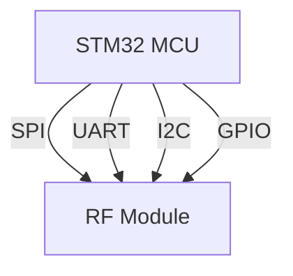

# STM32 RF Modules

## Introduction

Radio Frequency (RF) communication is a fundamental technology enabling wireless connectivity in embedded systems. STM32 microcontrollers can be paired with various RF modules to create wireless solutions for applications ranging from simple remote controls to complex IoT networks. This guide introduces you to RF modules compatible with STM32 microcontrollers, explaining their functionality, programming interfaces, and practical applications.

RF modules provide a convenient way to add wireless capabilities to your STM32 projects without designing complex RF circuitry from scratch. They operate across different frequency bands (commonly 433MHz, 868MHz, 915MHz, and 2.4GHz) and implement various protocols to suit different requirements for range, power consumption, and data throughput.

## Types of RF Modules for STM32

### 1. Sub-GHz RF Modules

STM32 microcontrollers can interface with sub-GHz RF modules (operating at frequencies below 1GHz), which offer excellent range and power efficiency.

#### S2-LP Module

The S2-LP is ST's low-power sub-GHz RF transceiver that works well with STM32 microcontrollers.

**Key features:**
- Frequency bands: 413-479MHz, 868-956MHz
- Low power consumption: 6.7mA RX, 10mA TX at +10dBm
- High sensitivity: -130dBm
- Data rates up to 500kbps
- SPI interface for communication with STM32

### 2. Bluetooth Modules

STM32 microcontrollers can be paired with Bluetooth modules for short-range, high-data-rate communication with mobile devices and other Bluetooth-enabled equipment.

#### STM32WB Series

The STM32WB series integrates both an application processor and a Bluetooth Low Energy (BLE) radio in a single package.

**Key features:**
- Bluetooth 5.0 compliant
- Integrated ARM Cortex-M4 and Cortex-M0+ cores
- Built-in radio transceiver
- Concurrent BLE and 802.15.4 (Thread/Zigbee) operation

### 3. Wi-Fi Modules

For Internet connectivity, STM32 microcontrollers can interface with Wi-Fi modules, enabling IoT applications.

#### SPWF04S Module

This is a standalone Wi-Fi module that can connect to STM32 microcontrollers through UART or SPI interfaces.

**Key features:**
- IEEE 802.11 b/g/n compliant
- Integrated TCP/IP stack
- Secure connections with TLS/SSL
- Low power modes
- Simple AT command interface

### 4. LoRa Modules

LoRa (Long Range) technology provides long-range, low-power wireless communication, ideal for IoT applications.

STM32 microcontrollers can interface with LoRa modules such as the SX1276 through SPI.

**Key features:**
- Ultra-long range capability (up to 15km)
- Low power consumption
- Resistant to interference
- Operates at sub-GHz frequencies
- Data rates from 0.3 kbps to 50 kbps

## Communication Interfaces

STM32 microcontrollers typically communicate with RF modules using these interfaces:



- **SPI (Serial Peripheral Interface)**: Fast, full-duplex communication, commonly used for high-speed RF modules
- **UART (Universal Asynchronous Receiver-Transmitter)**: Simple to implement, often used with modules that accept AT commands
- **I2C (Inter-Integrated Circuit)**: Less common but used with some sensor/RF combination modules
- **GPIO (General Purpose Input/Output)**: Used for control lines like chip select, reset, and interrupt

## Programming STM32 with RF Modules

Let's explore how to program an STM32 microcontroller to communicate with various RF modules.

### Basic SPI Communication with Sub-GHz Module

Here's an example of initializing and communicating with an S2-LP RF module using SPI:

```c
/* Configure SPI pins */
void SPI_GPIO_Init(void)
{
    /* Enable GPIO Clocks */
    __HAL_RCC_GPIOA_CLK_ENABLE();
    
    /* Configure SPI pins */
    GPIO_InitTypeDef GPIO_InitStruct = {0};
    
    /* SPI SCK Pin */
    GPIO_InitStruct.Pin = GPIO_PIN_5;
    GPIO_InitStruct.Mode = GPIO_MODE_AF_PP;
    GPIO_InitStruct.Pull = GPIO_NOPULL;
    GPIO_InitStruct.Speed = GPIO_SPEED_FREQ_HIGH;
    GPIO_InitStruct.Alternate = GPIO_AF5_SPI1;
    HAL_GPIO_Init(GPIOA, &GPIO_InitStruct);
    
    /* SPI MISO Pin */
    GPIO_InitStruct.Pin = GPIO_PIN_6;
    HAL_GPIO_Init(GPIOA, &GPIO_InitStruct);
    
    /* SPI MOSI Pin */
    GPIO_InitStruct.Pin = GPIO_PIN_7;
    HAL_GPIO_Init(GPIOA, &GPIO_InitStruct);
    
    /* SPI CS Pin (Software managed) */
    GPIO_InitStruct.Pin = GPIO_PIN_4;
    GPIO_InitStruct.Mode = GPIO_MODE_OUTPUT_PP;
    GPIO_InitStruct.Alternate = 0;
    HAL_GPIO_Init(GPIOA, &GPIO_InitStruct);
    
    /* Set CS high (inactive) */
    HAL_GPIO_WritePin(GPIOA, GPIO_PIN_4, GPIO_PIN_SET);
}

/* Initialize SPI peripheral */
void SPI_Init(void)
{
    /* Enable SPI1 clock */
    __HAL_RCC_SPI1_CLK_ENABLE();
    
    /* Configure SPI */
    hspi1.Instance = SPI1;
    hspi1.Init.Mode = SPI_MODE_MASTER;
    hspi1.Init.Direction = SPI_DIRECTION_2LINES;
    hspi1.Init.DataSize = SPI_DATASIZE_8BIT;
    hspi1.Init.CLKPolarity = SPI_POLARITY_LOW;
    hspi1.Init.CLKPhase = SPI_PHASE_1EDGE;
    hspi1.Init.NSS = SPI_NSS_SOFT;
    hspi1.Init.BaudRatePrescaler = SPI_BAUDRATEPRESCALER_16;
    hspi1.Init.FirstBit = SPI_FIRSTBIT_MSB;
    hspi1.Init.TIMode = SPI_TIMODE_DISABLE;
    hspi1.Init.CRCCalculation = SPI_CRCCALCULATION_DISABLE;
    
    HAL_SPI_Init(&hspi1);
}

/* S2-LP command functions */
void S2LP_WriteRegisters(uint8_t address, uint8_t* buffer, uint8_t length)
{
    uint8_t header = address;
    
    /* Activate CS */
    HAL_GPIO_WritePin(GPIOA, GPIO_PIN_4, GPIO_PIN_RESET);
    
    /* Send address */
    HAL_SPI_Transmit(&hspi1, &header, 1, HAL_MAX_DELAY);
    
    /* Send data */
    HAL_SPI_Transmit(&hspi1, buffer, length, HAL_MAX_DELAY);
    
    /* Deactivate CS */
    HAL_GPIO_WritePin(GPIOA, GPIO_PIN_4, GPIO_PIN_SET);
}

uint8_t S2LP_ReadRegisters(uint8_t address, uint8_t* buffer, uint8_t length)
{
    uint8_t header = address | 0x80; /* Set read bit */
    
    /* Activate CS */
    HAL_GPIO_WritePin(GPIOA, GPIO_PIN_4, GPIO_PIN_RESET);
    
    /* Send address */
    HAL_SPI_Transmit(&hspi1, &header, 1, HAL_MAX_DELAY);
    
    /* Read data */
    HAL_SPI_Receive(&hspi1, buffer, length, HAL_MAX_DELAY);
    
    /* Deactivate CS */
    HAL_GPIO_WritePin(GPIOA, GPIO_PIN_4, GPIO_PIN_SET);
    
    return buffer[0];
}

/* Initialize S2-LP module */
void S2LP_Init(void)
{
    /* Hardware reset of S2-LP */
    HAL_GPIO_WritePin(GPIOB, GPIO_PIN_0, GPIO_PIN_RESET);
    HAL_Delay(10);
    HAL_GPIO_WritePin(GPIOB, GPIO_PIN_0, GPIO_PIN_SET);
    HAL_Delay(10);
    
    /* Configure base registers */
    uint8_t tmp = 0x03;  /* Reset digital block */
    S2LP_WriteRegisters(0x01, &tmp, 1);
    
    HAL_Delay(1);
    
    /* Read the device part number */
    uint8_t partNumber[2];
    S2LP_ReadRegisters(0xF0, partNumber, 2);
    
    /* Configure RF frequency (868MHz) */
    uint8_t freqConfig[4] = {0x38, 0x35, 0xE8, 0x00};
    S2LP_WriteRegisters(0x20, freqConfig, 4);
    
    /* Configure modulation (GFSK, 38.4 kbps) */
    uint8_t modConfig = 0x03;
    S2LP_WriteRegisters(0x30, &modConfig, 1);
    
    /* Configure packet format */
    uint8_t pktConfig = 0x20;  /* Variable packet length */
    S2LP_WriteRegisters(0x30, &pktConfig, 1);
}

/* Function to send data */
void S2LP_SendData(uint8_t* data, uint8_t length)
{
    /* Set the packet length */
    S2LP_WriteRegisters(0x4B, &length, 1);
    
    /* Write data to TX FIFO */
    S2LP_WriteRegisters(0xFF, data, length);
    
    /* Send command to start transmission */
    uint8_t cmd = 0x60;
    S2LP_WriteRegisters(0xA0, &cmd, 1);
}

/* Receive data */
uint8_t S2LP_ReceiveData(uint8_t* buffer)
{
    uint8_t length = 0;
    
    /* Check if packet received */
    uint8_t status;
    S2LP_ReadRegisters(0xA2, &status, 1);
    
    if (status & 0x10) {  /* Check RX FIFO almost full flag */
        /* Read packet length */
        S2LP_ReadRegisters(0x4B, &length, 1);
        
        /* Read data from RX FIFO */
        if (length > 0) {
            S2LP_ReadRegisters(0xFF, buffer, length);
        }
        
        /* Flush RX FIFO */
        uint8_t cmd = 0x31;
        S2LP_WriteRegisters(0xA0, &cmd, 1);
    }
    
    return length;
}
```

### Example: Simple Weather Station with LoRa Transceiver

This example demonstrates how to set up an STM32 microcontroller to read temperature and humidity data and transmit it using a LoRa module:

```c
#include "stm32l4xx_hal.h"
#include "lora.h"  /* Custom LoRa library */
#include "dht22.h" /* Temperature/Humidity sensor library */

/* Structure for weather data */
typedef struct {
    float temperature;
    float humidity;
    uint16_t battery_voltage;
} WeatherData;

/* Initialize all peripherals */
void SystemInit(void)
{
    /* Initialize HAL */
    HAL_Init();
    
    /* Configure system clock */
    SystemClock_Config();
    
    /* Initialize GPIO */
    MX_GPIO_Init();
    
    /* Initialize LoRa module */
    LoRa_Init();
    
    /* Initialize DHT22 sensor */
    DHT22_Init();
    
    /* Initialize ADC for battery measurement */
    ADC_Init();
}

/* Read sensor data */
void ReadWeatherData(WeatherData* data)
{
    /* Read temperature and humidity */
    DHT22_Read(&(data->temperature), &(data->humidity));
    
    /* Read battery voltage */
    data->battery_voltage = ADC_ReadBatteryVoltage();
}

/* Transmit data via LoRa */
void TransmitWeatherData(WeatherData* data)
{
    uint8_t buffer[8];
    
    /* Pack data into buffer */
    /* Temperature (2 bytes): multiply by 100 and convert to integer */
    int16_t temp_int = (int16_t)(data->temperature * 100);
    buffer[0] = (temp_int >> 8) & 0xFF;
    buffer[1] = temp_int & 0xFF;
    
    /* Humidity (2 bytes): multiply by 100 and convert to integer */
    int16_t hum_int = (int16_t)(data->humidity * 100);
    buffer[2] = (hum_int >> 8) & 0xFF;
    buffer[3] = hum_int & 0xFF;
    
    /* Battery voltage (2 bytes) */
    buffer[4] = (data->battery_voltage >> 8) & 0xFF;
    buffer[5] = data->battery_voltage & 0xFF;
    
    /* Add CRC checksum (2 bytes) */
    uint16_t crc = CalculateCRC(buffer, 6);
    buffer[6] = (crc >> 8) & 0xFF;
    buffer[7] = crc & 0xFF;
    
    /* Send data */
    LoRa_SendPacket(buffer, 8);
}

int main(void)
{
    WeatherData weatherData;
    
    /* Initialize system */
    SystemInit();
    
    while (1) {
        /* Read sensor data */
        ReadWeatherData(&weatherData);
        
        /* Transmit data */
        TransmitWeatherData(&weatherData);
        
        /* Print data to debug UART */
        printf("Temperature: %.2f°C\r
", weatherData.temperature);
        printf("Humidity: %.2f%%\r
", weatherData.humidity);
        printf("Battery: %d mV\r
", weatherData.battery_voltage);
        
        /* Wait before next transmission */
        HAL_Delay(60000); /* 1 minute */
    }
}
```

### Receiving Data with Bluetooth Module (STM32WB)

Here's an example of setting up an STM32WB microcontroller to receive data via Bluetooth Low Energy:

```c
#include "app_common.h"
#include "stm32_seq.h"
#include "app_ble.h"
#include "custom_app.h"

/* BLE service and characteristic UUIDs */
#define CUSTOM_SERVICE_UUID        (0xFEE0)
#define CUSTOM_CHAR_UUID           (0xFEE1)

/* Global variables */
extern CUSTOM_App_Context_t Custom_App_Context;

/* Initialize BLE application */
void Custom_APP_Init(void)
{
    /* Initialize BLE application context */
    Custom_App_Context.Notification_Status = 0;
    
    /* Register event handlers */
    UTIL_SEQ_RegTask(1<<CFG_TASK_NOTIFY_ENABLE_ID, UTIL_SEQ_RFU, Custom_Switch_Notification);
    
    /* Register callbacks for BLE events */
    Custom_APP_Notification_Registration();
}

/* Callback for BLE events */
void Custom_APP_Notification_CB(Custom_App_Notification_evt_t *pNotification)
{
    switch(pNotification->Custom_Evt_Opcode) {
        case CUSTOM_CONN_HANDLE_EVT:
            Custom_App_Context.ConnectionHandle = pNotification->ConnectionHandle;
            break;
            
        case CUSTOM_DISCON_HANDLE_EVT:
            Custom_App_Context.ConnectionHandle = 0;
            break;
            
        case CUSTOM_CHAR_WRITE_EVT:
            /* Data received from client */
            ProcessReceivedData(pNotification->DataTransfered.pPayload, 
                               pNotification->DataTransfered.Length);
            break;
            
        default:
            break;
    }
}

/* Process received data */
void ProcessReceivedData(uint8_t* data, uint16_t length)
{
    /* Check received command */
    if (length >= 1) {
        switch (data[0]) {
            case 0x01: /* LED command */
                if (length >= 2) {
                    if (data[1] == 0x00) {
                        /* Turn LED off */
                        BSP_LED_Off(LED_BLUE);
                    } else {
                        /* Turn LED on */
                        BSP_LED_On(LED_BLUE);
                    }
                }
                break;
                
            case 0x02: /* Request sensor data */
                /* Prepare response */
                SendSensorData();
                break;
                
            default:
                /* Unknown command */
                break;
        }
    }
}

/* Send sensor data to connected BLE client */
void SendSensorData(void)
{
    uint8_t response[5];
    
    /* Command ID */
    response[0] = 0x02;
    
    /* Read temperature sensor (example) */
    int16_t temperature = (int16_t)(GetTemperature() * 100);
    response[1] = (temperature >> 8) & 0xFF;
    response[2] = temperature & 0xFF;
    
    /* Read battery level */
    uint16_t battery = GetBatteryLevel();
    response[3] = (battery >> 8) & 0xFF;
    response[4] = battery & 0xFF;
    
    /* Send notification to client */
    Custom_Update_Char(response, sizeof(response));
}

/* Main application loop */
void Custom_APP_Task(void)
{
    /* Periodic tasks */
    if (Custom_App_Context.ConnectionHandle != 0) {
        /* Device is connected */
        
        /* Perform periodic tasks if needed */
        UpdateDeviceStatus();
    }
}
```

## Practical Applications

### 1. Home Automation System

STM32 microcontrollers with RF modules can form the backbone of a home automation system:

- **Central Hub**: STM32F4 with Wi-Fi module to connect to the home network
- **Sensors**: STM32L0 with sub-GHz RF modules for low-power operation
- **Actuators**: STM32F0 with sub-GHz RF modules to control lights, blinds, etc.

The system uses a mesh network topology where each node can relay messages, extending the range throughout a large home.

### 2. Asset Tracking System

Track valuable assets using LoRa's long-range capabilities:

- **Tracker Devices**: STM32L4 with LoRa module and GPS
- **Gateway**: STM32H7 with LoRa and Ethernet connectivity
- **Backend**: Cloud service for data storage and visualization

This system can track assets over large areas with minimal infrastructure.

### 3. Industrial Monitoring

Monitor industrial equipment using BLE for local access and LoRa for wide-area connectivity:

- **Sensor Nodes**: STM32WB with integrated BLE and external sensors
- **Local Gateway**: STM32F7 with LoRa and Wi-Fi
- **Mobile Access**: Smartphone app connecting via BLE for maintenance

## Power Management Considerations

RF communication can be power-intensive, which is a concern for battery-powered applications. Here are strategies for power management:

1. **Duty cycling**: Transmit data at specific intervals rather than continuously
2. **Sleep modes**: Use STM32's low-power modes between transmissions
3. **Adaptive power**: Adjust transmit power based on distance and link quality
4. **Protocol selection**: Choose protocols like BLE or LoRa that are designed for low power

Example of implementing duty cycling with an STM32L4 and LoRa module:

```c
#include "stm32l4xx_hal.h"
#include "lora.h"

void EnterLowPowerMode(void)
{
    /* Put LoRa module to sleep */
    LoRa_Sleep();
    
    /* Configure RTC for wakeup */
    RTC_ConfigWakeup(60); /* Wake up every 60 seconds */
    
    /* Enter STOP mode */
    HAL_PWR_EnterSTOPMode(PWR_LOWPOWERREGULATOR_ON, PWR_STOPENTRY_WFI);
    
    /* System will wake up here after RTC interrupt */
    
    /* Re-configure system clock */
    SystemClock_Config();
    
    /* Wake up LoRa module */
    LoRa_Wakeup();
}

void main(void)
{
    /* Initialize system */
    SystemInit();
    
    while (1) {
        /* Read sensor data */
        SensorData_t data = ReadSensors();
        
        /* Send data via LoRa */
        LoRa_SendData(&data, sizeof(data));
        
        /* Enter low power mode until next measurement */
        EnterLowPowerMode();
    }
}
```

## Debugging RF Applications

Debugging wireless applications can be challenging since the communication is invisible. Here are some tools and techniques:

1. **Logic analyzer**: Monitor SPI/UART communication between STM32 and RF module
2. **Spectrum analyzer**: Visualize RF signals and detect interference
3. **Protocol analyzer**: Decode wireless packets (e.g., BLE sniffer)
4. **Status LEDs**: Indicate transmission/reception events visually
5. **Debug UART**: Output detailed logs of communication events

## Security Considerations

RF communications are susceptible to eavesdropping and interference. Implement security measures:

1. **Encryption**: Use AES encryption for sensitive data
2. **Authentication**: Implement device authentication to prevent unauthorized access
3. **Frequency hopping**: Change frequencies to avoid interference and jamming
4. **Message integrity**: Include checksums or cryptographic signatures

Example of implementing AES encryption with STM32:

```c
#include "stm32l4xx_hal.h"
#include "rf_module.h"
#include "aes.h"

/* AES encryption key (128 bits) */
static const uint8_t AES_Key[16] = {
    0x2B, 0x7E, 0x15, 0x16, 0x28, 0xAE, 0xD2, 0xA6,
    0xAB, 0xF7, 0x15, 0x88, 0x09, 0xCF, 0x4F, 0x3C
};

/* Initialization vector */
static uint8_t AES_IV[16] = {
    0x00, 0x01, 0x02, 0x03, 0x04, 0x05, 0x06, 0x07,
    0x08, 0x09, 0x0A, 0x0B, 0x0C, 0x0D, 0x0E, 0x0F
};

void SendEncryptedData(uint8_t* data, uint16_t length)
{
    /* Create buffer for encrypted data (must be multiple of 16 bytes) */
    uint16_t encrypted_length = ((length + 15) / 16) * 16;
    uint8_t encrypted_data[encrypted_length];
    
    /* Pad data if necessary */
    memcpy(encrypted_data, data, length);
    if (length < encrypted_length) {
        /* Add PKCS#7 padding */
        uint8_t padValue = encrypted_length - length;
        memset(encrypted_data + length, padValue, padValue);
    }
    
    /* Initialize AES context */
    AES_ctx ctx;
    AES_init_ctx_iv(&ctx, AES_Key, AES_IV);
    
    /* Encrypt data */
    AES_CBC_encrypt_buffer(&ctx, encrypted_data, encrypted_length);
    
    /* Send encrypted data */
    RF_SendPacket(encrypted_data, encrypted_length);
    
    /* Update IV for next transmission (optional) */
    for (int i = 0; i < 16; i++) {
        AES_IV[i] ^= encrypted_data[i];
    }
}

uint16_t ReceiveEncryptedData(uint8_t* buffer, uint16_t max_length)
{
    /* Receive encrypted data */
    uint16_t received_length = RF_ReceivePacket(buffer, max_length);
    
    if (received_length > 0 && (received_length % 16) == 0) {
        /* Initialize AES context */
        AES_ctx ctx;
        AES_init_ctx_iv(&ctx, AES_Key, AES_IV);
        
        /* Decrypt data */
        AES_CBC_decrypt_buffer(&ctx, buffer, received_length);
        
        /* Update IV for next reception (optional) */
        for (int i = 0; i < 16; i++) {
            AES_IV[i] ^= buffer[i];
        }
        
        /* Remove padding */
        uint8_t padValue = buffer[received_length - 1];
        if (padValue <= 16) {
            return received_length - padValue;
        }
    }
    
    return 0; /* Decryption failed */
}
```

## Summary

STM32 RF modules offer diverse wireless connectivity options for embedded systems, from short-range Bluetooth to long-range LoRa communications. They enable applications across various domains, including IoT, industrial monitoring, home automation, and asset tracking.

When working with RF modules:

1. Select the appropriate module based on your requirements for range, power consumption, and data throughput
2. Understand the communication interfaces (SPI, UART, I2C) between STM32 and RF modules
3. Implement power management strategies for battery-powered applications
4. Consider security implications and implement appropriate measures
5. Use proper debugging tools to troubleshoot wireless connections

## Additional Resources

For further learning, consider these resources:

1. **STM32 Programming**
   - STM32CubeIDE and HAL libraries
   - STM32 application notes for wireless communications

2. **RF Module Datasheets**
   - S2-LP Sub-GHz RF transceiver
   - STM32WB microcontroller with integrated BLE
   - SX1276 LoRa transceiver

3. **RF Communication Protocols**
   - Bluetooth SIG specifications
   - LoRaWAN protocol specification
   - Wi-Fi Alliance documentation

## Exercises

1. **Basic Communication**: Set up an STM32 microcontroller to communicate with a sub-GHz RF module using SPI. Send a simple "Hello World" message between two devices.

2. **Power Optimization**: Modify the weather station example to optimize power consumption. Measure current consumption in various states and calculate battery life.

3. **Secure Communication**: Implement AES encryption for a LoRa communication link between two STM32 devices. Test the security by attempting to intercept messages.

4. **Range Testing**: Build a simple range test application with an STM32 and LoRa module. Measure the maximum communication distance in different environments.

5. **Multi-Protocol Gateway**: Create a gateway device using an STM32H7 that bridges communications between BLE devices and a LoRaWAN network.