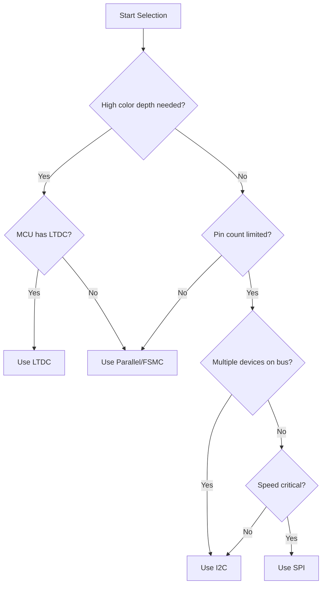

# STM32 Display Interfaces

## Introduction

When developing embedded applications with STM32 microcontrollers, adding a display can greatly enhance the user experience by providing visual feedback, data visualization, and interactive interfaces. STM32 microcontrollers support various display technologies through different communication interfaces, each with its own advantages and use cases.

In this guide, we'll explore the common display interfaces supported by STM32 microcontrollers, how to configure them, and how to implement basic graphics operations. Whether you're building a smart thermostat, a fitness tracker, or an industrial control panel, understanding these display interfaces will help you create more intuitive and feature-rich applications.

## Display Technologies Overview

Before diving into specific interfaces, let's understand the common display technologies used with STM32:

1. **LCD (Liquid Crystal Display)** - Basic monochrome or color displays, often with segmented or dot-matrix configurations
2. **TFT (Thin-Film Transistor)** - Color displays with better contrast and refresh rates
3. **OLED (Organic Light-Emitting Diode)** - High-contrast displays with self-illuminating pixels, excellent for low-power applications

## Common Display Interfaces

### 1. Parallel Interface (FSMC/FMC)

The Flexible Static Memory Controller (FSMC) or Flexible Memory Controller (FMC) allows STM32 microcontrollers to communicate with displays using a parallel interface, typically 8, 16, or 32 bits wide.

#### Key Features

- **High bandwidth** - Faster data transfer compared to serial interfaces
- **Direct addressing** - Memory-mapped interface for easy access
- **Multiple data lines** - Requires more GPIO pins but offers better performance

#### Configuration Example

```c
/* FSMC/FMC initialization for a 16-bit display */
void LCD_FSMC_Init(void) {
  FSMC_NORSRAMInitTypeDef fsmc_init;
  FSMC_NORSRAMTimingInitTypeDef timing_init;
  
  /* Enable FSMC clock */
  RCC_AHBPeriphClockCmd(RCC_AHBPeriph_FSMC, ENABLE);
  
  /* FSMC timing configuration */
  timing_init.FSMC_AddressSetupTime = 0x02;
  timing_init.FSMC_AddressHoldTime = 0x00;
  timing_init.FSMC_DataSetupTime = 0x05;
  timing_init.FSMC_BusTurnAroundDuration = 0x00;
  timing_init.FSMC_CLKDivision = 0x00;
  timing_init.FSMC_DataLatency = 0x00;
  timing_init.FSMC_AccessMode = FSMC_AccessMode_A;
  
  /* FSMC bank configuration */
  fsmc_init.FSMC_Bank = FSMC_Bank1_NORSRAM1;
  fsmc_init.FSMC_DataAddressMux = FSMC_DataAddressMux_Disable;
  fsmc_init.FSMC_MemoryType = FSMC_MemoryType_SRAM;
  fsmc_init.FSMC_MemoryDataWidth = FSMC_MemoryDataWidth_16b;
  fsmc_init.FSMC_BurstAccessMode = FSMC_BurstAccessMode_Disable;
  fsmc_init.FSMC_WaitSignalPolarity = FSMC_WaitSignalPolarity_Low;
  fsmc_init.FSMC_WrapMode = FSMC_WrapMode_Disable;
  fsmc_init.FSMC_WaitSignalActive = FSMC_WaitSignalActive_BeforeWaitState;
  fsmc_init.FSMC_WriteOperation = FSMC_WriteOperation_Enable;
  fsmc_init.FSMC_WaitSignal = FSMC_WaitSignal_Disable;
  fsmc_init.FSMC_ExtendedMode = FSMC_ExtendedMode_Disable;
  fsmc_init.FSMC_WriteBurst = FSMC_WriteBurst_Disable;
  fsmc_init.FSMC_ReadWriteTimingStruct = &timing_init;
  fsmc_init.FSMC_WriteTimingStruct = &timing_init;
  
  FSMC_NORSRAMInit(&fsmc_init);
  
  /* Enable FSMC Bank1_SRAM Bank */
  FSMC_NORSRAMCmd(FSMC_Bank1_NORSRAM1, ENABLE);
}
```

#### Accessing the Display

With FSMC/FMC, you can access the display as if it were a memory location:

```c
/* Define base address for display access */
#define LCD_REG  (*((volatile uint16_t *) 0x60000000)) /* LCD register address */
#define LCD_DATA (*((volatile uint16_t *) 0x60020000)) /* LCD data address */

/* Function to write a command to the display */
void LCD_WriteCommand(uint16_t command) {
  LCD_REG = command;
}

/* Function to write data to the display */
void LCD_WriteData(uint16_t data) {
  LCD_DATA = data;
}

/* Function to set pixel color */
void LCD_SetPixel(uint16_t x, uint16_t y, uint16_t color) {
  LCD_WriteCommand(0x2A); /* Column address set */
  LCD_WriteData(x >> 8);
  LCD_WriteData(x & 0xFF);
  
  LCD_WriteCommand(0x2B); /* Row address set */
  LCD_WriteData(y >> 8);
  LCD_WriteData(y & 0xFF);
  
  LCD_WriteCommand(0x2C); /* Memory write */
  LCD_WriteData(color);
}
```

### 2. SPI Interface

Serial Peripheral Interface (SPI) is a popular choice for connecting displays to STM32 microcontrollers, especially for smaller devices where pin count is limited.

#### Key Features

- **Fewer GPIO pins** - Typically requires 4-5 pins (SCK, MOSI, MISO, CS, DC)
- **Widely supported** - Compatible with many display modules
- **Moderate speed** - Faster than I2C but slower than parallel interfaces

#### Configuration Example

```c
/* SPI configuration for display interface */
void LCD_SPI_Init(void) {
  SPI_InitTypeDef spi_init;
  GPIO_InitTypeDef gpio_init;
  
  /* Enable SPI and GPIO clocks */
  RCC_APB2PeriphClockCmd(RCC_APB2Periph_SPI1, ENABLE);
  RCC_AHB1PeriphClockCmd(RCC_AHB1Periph_GPIOA, ENABLE);
  
  /* Configure SPI pins */
  gpio_init.GPIO_Pin = GPIO_Pin_5 | GPIO_Pin_6 | GPIO_Pin_7; /* SCK, MISO, MOSI */
  gpio_init.GPIO_Mode = GPIO_Mode_AF;
  gpio_init.GPIO_Speed = GPIO_Speed_50MHz;
  gpio_init.GPIO_OType = GPIO_OType_PP;
  gpio_init.GPIO_PuPd = GPIO_PuPd_NOPULL;
  GPIO_Init(GPIOA, &gpio_init);
  
  /* Connect SPI pins to SPI peripheral */
  GPIO_PinAFConfig(GPIOA, GPIO_PinSource5, GPIO_AF_SPI1); /* SCK */
  GPIO_PinAFConfig(GPIOA, GPIO_PinSource6, GPIO_AF_SPI1); /* MISO */
  GPIO_PinAFConfig(GPIOA, GPIO_PinSource7, GPIO_AF_SPI1); /* MOSI */
  
  /* Configure CS and DC pins as output */
  gpio_init.GPIO_Pin = GPIO_Pin_4; /* CS pin */
  gpio_init.GPIO_Mode = GPIO_Mode_OUT;
  GPIO_Init(GPIOA, &gpio_init);
  
  gpio_init.GPIO_Pin = GPIO_Pin_3; /* DC pin (Data/Command) */
  GPIO_Init(GPIOA, &gpio_init);
  
  /* SPI configuration */
  spi_init.SPI_Direction = SPI_Direction_2Lines_FullDuplex;
  spi_init.SPI_Mode = SPI_Mode_Master;
  spi_init.SPI_DataSize = SPI_DataSize_8b;
  spi_init.SPI_CPOL = SPI_CPOL_Low;
  spi_init.SPI_CPHA = SPI_CPHA_1Edge;
  spi_init.SPI_NSS = SPI_NSS_Soft;
  spi_init.SPI_BaudRatePrescaler = SPI_BaudRatePrescaler_4;
  spi_init.SPI_FirstBit = SPI_FirstBit_MSB;
  spi_init.SPI_CRCPolynomial = 7;
  SPI_Init(SPI1, &spi_init);
  
  /* Enable SPI */
  SPI_Cmd(SPI1, ENABLE);
}
```

#### Accessing the Display

```c
/* Define pins for display control */
#define LCD_CS_PIN  GPIO_Pin_4
#define LCD_DC_PIN  GPIO_Pin_3
#define LCD_CS_PORT GPIOA
#define LCD_DC_PORT GPIOA

/* Macros for CS and DC control */
#define LCD_CS_LOW()  GPIO_ResetBits(LCD_CS_PORT, LCD_CS_PIN)
#define LCD_CS_HIGH() GPIO_SetBits(LCD_CS_PORT, LCD_CS_PIN)
#define LCD_DC_LOW()  GPIO_ResetBits(LCD_DC_PORT, LCD_DC_PIN)
#define LCD_DC_HIGH() GPIO_SetBits(LCD_DC_PORT, LCD_DC_PIN)

/* Function to send a byte over SPI */
void LCD_SPI_Send(uint8_t data) {
  /* Wait until TX buffer is empty */
  while(SPI_I2S_GetFlagStatus(SPI1, SPI_I2S_FLAG_TXE) == RESET);
  
  /* Send data */
  SPI_I2S_SendData(SPI1, data);
  
  /* Wait until transmission complete */
  while(SPI_I2S_GetFlagStatus(SPI1, SPI_I2S_FLAG_BSY) == SET);
}

/* Function to write a command to the display */
void LCD_WriteCommand(uint8_t command) {
  LCD_DC_LOW();  /* Command mode */
  LCD_CS_LOW();  /* Select display */
  LCD_SPI_Send(command);
  LCD_CS_HIGH(); /* Deselect display */
}

/* Function to write data to the display */
void LCD_WriteData(uint8_t data) {
  LCD_DC_HIGH(); /* Data mode */
  LCD_CS_LOW();  /* Select display */
  LCD_SPI_Send(data);
  LCD_CS_HIGH(); /* Deselect display */
}
```

### 3. I2C Interface

I2C (Inter-Integrated Circuit) is a two-wire interface that requires minimal GPIO pins and is often used for small monochrome OLED displays.

#### Key Features

- **Minimal pin count** - Only requires 2 pins (SDA and SCL)
- **Multi-device support** - Can connect multiple devices on the same bus
- **Lower speed** - Typically slower than SPI or parallel interfaces

#### Configuration Example

```c
/* I2C configuration for display interface */
void LCD_I2C_Init(void) {
  I2C_InitTypeDef i2c_init;
  GPIO_InitTypeDef gpio_init;
  
  /* Enable I2C and GPIO clocks */
  RCC_APB1PeriphClockCmd(RCC_APB1Periph_I2C1, ENABLE);
  RCC_AHB1PeriphClockCmd(RCC_AHB1Periph_GPIOB, ENABLE);
  
  /* Configure I2C pins */
  gpio_init.GPIO_Pin = GPIO_Pin_6 | GPIO_Pin_7; /* SCL, SDA */
  gpio_init.GPIO_Mode = GPIO_Mode_AF;
  gpio_init.GPIO_Speed = GPIO_Speed_50MHz;
  gpio_init.GPIO_OType = GPIO_OType_OD;
  gpio_init.GPIO_PuPd = GPIO_PuPd_UP;
  GPIO_Init(GPIOB, &gpio_init);
  
  /* Connect I2C pins to I2C peripheral */
  GPIO_PinAFConfig(GPIOB, GPIO_PinSource6, GPIO_AF_I2C1); /* SCL */
  GPIO_PinAFConfig(GPIOB, GPIO_PinSource7, GPIO_AF_I2C1); /* SDA */
  
  /* I2C configuration */
  i2c_init.I2C_Mode = I2C_Mode_I2C;
  i2c_init.I2C_DutyCycle = I2C_DutyCycle_2;
  i2c_init.I2C_OwnAddress1 = 0x00;
  i2c_init.I2C_Ack = I2C_Ack_Enable;
  i2c_init.I2C_AcknowledgedAddress = I2C_AcknowledgedAddress_7bit;
  i2c_init.I2C_ClockSpeed = 400000; /* 400 KHz */
  I2C_Init(I2C1, &i2c_init);
  
  /* Enable I2C */
  I2C_Cmd(I2C1, ENABLE);
}
```

#### Accessing the Display

```c
/* OLED display I2C address */
#define OLED_I2C_ADDR 0x78 /* Common address for SSD1306 OLED display (0x3C << 1) */

/* Function to start I2C transmission */
void LCD_I2C_Start(void) {
  /* Wait until I2C peripheral is not busy */
  while(I2C_GetFlagStatus(I2C1, I2C_FLAG_BUSY));
  
  /* Generate start condition */
  I2C_GenerateSTART(I2C1, ENABLE);
  
  /* Wait until start condition generated */
  while(!I2C_CheckEvent(I2C1, I2C_EVENT_MASTER_MODE_SELECT));
  
  /* Send device address */
  I2C_Send7bitAddress(I2C1, OLED_I2C_ADDR, I2C_Direction_Transmitter);
  
  /* Wait until address sent */
  while(!I2C_CheckEvent(I2C1, I2C_EVENT_MASTER_TRANSMITTER_MODE_SELECTED));
}

/* Function to stop I2C transmission */
void LCD_I2C_Stop(void) {
  /* Generate stop condition */
  I2C_GenerateSTOP(I2C1, ENABLE);
}

/* Function to write a command to the OLED display */
void OLED_WriteCommand(uint8_t command) {
  LCD_I2C_Start();
  
  /* Send control byte (0x00 for command) */
  I2C_SendData(I2C1, 0x00);
  while(!I2C_CheckEvent(I2C1, I2C_EVENT_MASTER_BYTE_TRANSMITTED));
  
  /* Send command */
  I2C_SendData(I2C1, command);
  while(!I2C_CheckEvent(I2C1, I2C_EVENT_MASTER_BYTE_TRANSMITTED));
  
  LCD_I2C_Stop();
}

/* Function to write data to the OLED display */
void OLED_WriteData(uint8_t data) {
  LCD_I2C_Start();
  
  /* Send control byte (0x40 for data) */
  I2C_SendData(I2C1, 0x40);
  while(!I2C_CheckEvent(I2C1, I2C_EVENT_MASTER_BYTE_TRANSMITTED));
  
  /* Send data */
  I2C_SendData(I2C1, data);
  while(!I2C_CheckEvent(I2C1, I2C_EVENT_MASTER_BYTE_TRANSMITTED));
  
  LCD_I2C_Stop();
}
```

### 4. LTDC (LCD-TFT Display Controller)

Higher-end STM32 microcontrollers include a dedicated LCD-TFT Display Controller (LTDC) that provides hardware acceleration for color displays.

#### Key Features

- **Hardware acceleration** - Offloads graphics processing from the CPU
- **Direct memory access** - Uses DMA for efficient frame buffer updates
- **High color depth** - Supports up to 24-bit color (16.7M colors)
- **Multiple layers** - Supports overlays and transparency

#### Configuration Example

```c
/* LTDC initialization for a 480x272 RGB display */
void LCD_LTDC_Init(void) {
  LTDC_InitTypeDef ltdc_init;
  LTDC_Layer_InitTypeDef layer_init;
  
  /* Enable LTDC, DMA2D and GPIO clocks */
  RCC_APB2PeriphClockCmd(RCC_APB2Periph_LTDC, ENABLE);
  RCC_AHB1PeriphClockCmd(RCC_AHB1Periph_DMA2D, ENABLE);
  RCC_AHB1PeriphClockCmd(RCC_AHB1Periph_GPIOA | RCC_AHB1Periph_GPIOB | 
                         RCC_AHB1Periph_GPIOC | RCC_AHB1Periph_GPIOD | 
                         RCC_AHB1Periph_GPIOF | RCC_AHB1Periph_GPIOG, ENABLE);
  
  /* Configure GPIO pins for LTDC */
  /* ... (GPIO configuration for LTDC pins) ... */
  
  /* LTDC configuration */
  ltdc_init.LTDC_HSPolarity = LTDC_HSPolarity_AL;
  ltdc_init.LTDC_VSPolarity = LTDC_VSPolarity_AL;
  ltdc_init.LTDC_DEPolarity = LTDC_DEPolarity_AL;
  ltdc_init.LTDC_PCPolarity = LTDC_PCPolarity_IPC;
  
  /* Configure timing parameters for 480x272 display */
  ltdc_init.LTDC_HorizontalSync = 40;
  ltdc_init.LTDC_VerticalSync = 9;
  ltdc_init.LTDC_AccumulatedHBP = 53;
  ltdc_init.LTDC_AccumulatedVBP = 11;
  ltdc_init.LTDC_AccumulatedActiveW = 533;
  ltdc_init.LTDC_AccumulatedActiveH = 283;
  ltdc_init.LTDC_TotalWidth = 565;
  ltdc_init.LTDC_TotalHeigh = 294;
  
  /* Background color (black) */
  ltdc_init.LTDC_BackgroundRedValue = 0;
  ltdc_init.LTDC_BackgroundGreenValue = 0;
  ltdc_init.LTDC_BackgroundBlueValue = 0;
  
  LTDC_Init(&ltdc_init);
  
  /* Layer 1 configuration */
  layer_init.LTDC_HorizontalStart = ltdc_init.LTDC_AccumulatedHBP;
  layer_init.LTDC_HorizontalStop = ltdc_init.LTDC_AccumulatedActiveW;
  layer_init.LTDC_VerticalStart = ltdc_init.LTDC_AccumulatedVBP;
  layer_init.LTDC_VerticalStop = ltdc_init.LTDC_AccumulatedActiveH;
  
  /* Pixel format (RGB565) */
  layer_init.LTDC_PixelFormat = LTDC_Pixelformat_RGB565;
  
  /* Alpha constant (fully opaque) */
  layer_init.LTDC_ConstantAlpha = 255;
  
  /* Default color (transparent) */
  layer_init.LTDC_DefaultColorBlue = 0;
  layer_init.LTDC_DefaultColorGreen = 0;
  layer_init.LTDC_DefaultColorRed = 0;
  layer_init.LTDC_DefaultColorAlpha = 0;
  
  /* Frame buffer address */
  layer_init.LTDC_CFBStartAdress = (uint32_t)&frame_buffer;
  
  /* Blending factors */
  layer_init.LTDC_BlendingFactor_1 = LTDC_BlendingFactor1_CA;
  layer_init.LTDC_BlendingFactor_2 = LTDC_BlendingFactor2_CA;
  
  /* Frame buffer line length and pitch */
  layer_init.LTDC_CFBLineLength = ((480 * 2) + 3);
  layer_init.LTDC_CFBPitch = (480 * 2);
  layer_init.LTDC_CFBLineNumber = 272;
  
  LTDC_LayerInit(LTDC_Layer1, &layer_init);
  
  /* Enable layer and LTDC */
  LTDC_LayerCmd(LTDC_Layer1, ENABLE);
  LTDC_ReloadConfig(LTDC_IMReload);
  LTDC_Cmd(ENABLE);
}
```

#### Drawing on the Display

With LTDC, drawing is as simple as writing to the frame buffer in memory:

```c
/* Frame buffer in SDRAM */
uint16_t frame_buffer[272][480];

/* Function to set a pixel in the frame buffer */
void LCD_SetPixel(uint16_t x, uint16_t y, uint16_t color) {
  if (x < 480 && y < 272) {
    frame_buffer[y][x] = color;
  }
}

/* Function to draw a filled rectangle */
void LCD_FillRect(uint16_t x, uint16_t y, uint16_t width, uint16_t height, uint16_t color) {
  for (uint16_t i = 0; i < height; i++) {
    for (uint16_t j = 0; j < width; j++) {
      LCD_SetPixel(x + j, y + i, color);
    }
  }
}

/* Function to draw text (simplified example) */
void LCD_DrawChar(uint16_t x, uint16_t y, char ch, uint16_t color) {
  /* Assuming a 5x7 font */
  /* ... (Font mapping and character drawing) ... */
}
```

## Display Interface Selection Guide

Choosing the right display interface depends on several factors:



### Decision Factors

1. **Processing Power**: 
   - LTDC offloads graphics processing from the CPU
   - SPI/I2C require more CPU involvement

2. **Pin Count**:
   - FSMC/FMC: High (16+ pins)
   - SPI: Medium (4-5 pins)
   - I2C: Low (2 pins)

3. **Display Size and Color Depth**:
   - Large, high-color displays: LTDC or FSMC/FMC
   - Medium displays: SPI
   - Small monochrome displays: I2C or SPI

4. **Update Speed**:
   - Fastest: LTDC
   - Fast: FSMC/FMC
   - Medium: SPI
   - Slowest: I2C

## Practical Example: Weather Station Display

Let's implement a simple weather station display using an SPI-connected ILI9341 TFT display.

```c
/* Include necessary headers */
#include "stm32f4xx.h"
#include "stm32f4xx_spi.h"
#include "stm32f4xx_gpio.h"
#include "stm32f4xx_rcc.h"
#include "fonts.h"
#include "ili9341.h"

/* Weather data structure */
typedef struct {
  float temperature;
  float humidity;
  float pressure;
  uint8_t condition; /* 0: Sunny, 1: Cloudy, 2: Rainy, 3: Snowy */
} WeatherData;

/* Initialize display */
void Weather_Init(void) {
  ILI9341_Init(); /* Initialize ILI9341 display */
  ILI9341_SetRotation(1); /* Landscape mode */
  ILI9341_Fill(ILI9341_BLACK); /* Clear screen */
  
  /* Draw static UI elements */
  ILI9341_DrawText("Weather Station", 10, 10, ILI9341_WHITE, ILI9341_BLACK, 2);
  ILI9341_DrawLine(0, 40, 320, 40, ILI9341_CYAN);
  
  ILI9341_DrawText("Temperature:", 10, 50, ILI9341_YELLOW, ILI9341_BLACK, 1);
  ILI9341_DrawText("Humidity:", 10, 80, ILI9341_YELLOW, ILI9341_BLACK, 1);
  ILI9341_DrawText("Pressure:", 10, 110, ILI9341_YELLOW, ILI9341_BLACK, 1);
  ILI9341_DrawText("Condition:", 10, 140, ILI9341_YELLOW, ILI9341_BLACK, 1);
}

/* Update weather display */
void Weather_Update(WeatherData *data) {
  char buffer[32];
  
  /* Clear previous values */
  ILI9341_FillRectangle(150, 50, 160, 20, ILI9341_BLACK);
  ILI9341_FillRectangle(150, 80, 160, 20, ILI9341_BLACK);
  ILI9341_FillRectangle(150, 110, 160, 20, ILI9341_BLACK);
  ILI9341_FillRectangle(150, 140, 160, 20, ILI9341_BLACK);
  
  /* Update temperature */
  sprintf(buffer, "%.1f °C", data->temperature);
  ILI9341_DrawText(buffer, 150, 50, ILI9341_WHITE, ILI9341_BLACK, 1);
  
  /* Update humidity */
  sprintf(buffer, "%.1f %%", data->humidity);
  ILI9341_DrawText(buffer, 150, 80, ILI9341_WHITE, ILI9341_BLACK, 1);
  
  /* Update pressure */
  sprintf(buffer, "%.1f hPa", data->pressure);
  ILI9341_DrawText(buffer, 150, 110, ILI9341_WHITE, ILI9341_BLACK, 1);
  
  /* Update condition */
  const char *conditions[] = {"Sunny", "Cloudy", "Rainy", "Snowy"};
  if (data->condition < 4) {
    ILI9341_DrawText(conditions[data->condition], 150, 140, ILI9341_WHITE, ILI9341_BLACK, 1);
  }
  
  /* Draw weather icon */
  switch (data->condition) {
    case 0: /* Sunny */
      ILI9341_FillCircle(260, 120, 30, ILI9341_YELLOW);
      break;
    case 1: /* Cloudy */
      ILI9341_FillCircle(240, 110, 15, ILI9341_YELLOW);
      ILI9341_FillCircle(260, 110, 20, ILI9341_LIGHTGREY);
      ILI9341_FillCircle(280, 120, 20, ILI9341_LIGHTGREY);
      ILI9341_FillCircle(250, 125, 20, ILI9341_LIGHTGREY);
      break;
    case 2: /* Rainy */
      ILI9341_FillCircle(260, 100, 20, ILI9341_LIGHTGREY);
      for (int i = 0; i < 5; i++) {
        ILI9341_DrawLine(250 + i*5, 125, 245 + i*5, 140, ILI9341_BLUE);
      }
      break;
    case 3: /* Snowy */
      ILI9341_FillCircle(260, 100, 20, ILI9341_LIGHTGREY);
      for (int i = 0; i < 5; i++) {
        ILI9341_DrawChar(250 + i*5, 130, '*', ILI9341_WHITE);
      }
      break;
  }
}

/* Main application */
int main(void) {
  /* Initialize system and hardware */
  SystemInit();
  Weather_Init();
  
  /* Sample weather data (in real-world, this would come from sensors) */
  WeatherData weather = {
    .temperature = 22.5,
    .humidity = 65.0,
    .pressure = 1013.2,
    .condition = 0
  };
  
  /* Update display with initial data */
  Weather_Update(&weather);
  
  /* Main loop */
  while (1) {
    /* Simulate changing weather for demonstration */
    weather.temperature += 0.1;
    if (weather.temperature > 30.0) {
      weather.temperature = 15.0;
      weather.condition = (weather.condition + 1) % 4;
    }
    
    /* Update display */
    Weather_Update(&weather);
    
    /* Delay */
    for (volatile int i = 0; i < 1000000; i++);
  }
}
```

## Advanced Topics

### 1. Double Buffering

To prevent screen tearing and achieve smoother updates, you can implement double buffering:

```c
/* Define two frame buffers */
uint16_t frame_buffer_1[272][480];
uint16_t frame_buffer_2[272][480];

/* Current active and drawing buffers */
uint16_t (*active_buffer)[480] = frame_buffer_1;
uint16_t (*drawing_buffer)[480] = frame_buffer_2;

/* Function to swap buffers */
void LCD_SwapBuffers(void) {
  /* Wait for VSYNC to prevent tearing */
  while(LTDC_GetFlagStatus(LTDC_FLAG_VBD) == RESET);
  
  /*