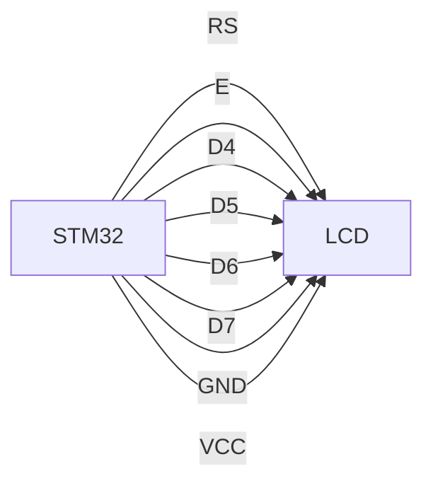
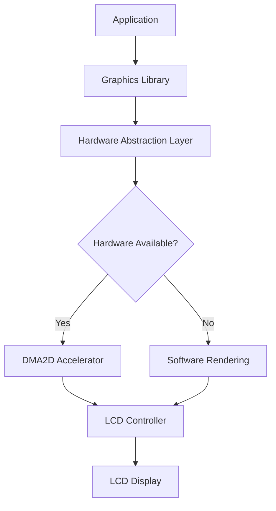

# STM32 LCD Basics

## Introduction

Liquid Crystal Displays (LCDs) are essential components in many embedded systems projects, providing a visual interface for users to interact with your application. In this tutorial, we'll explore how to interface various types of LCD displays with STM32 microcontrollers, from simple character LCDs to more advanced graphical displays.

STM32 microcontrollers offer several interfaces and peripherals that make connecting to LCDs straightforward, including GPIO pins, SPI, I2C, and dedicated LCD controllers on some higher-end models. By the end of this guide, you'll understand the fundamentals of LCD technology and be able to implement basic display functions in your STM32 projects.

## LCD Types and Interfaces

Before diving into the code, let's understand the common types of LCDs you might use with an STM32:

1. **Character LCDs** - Display a fixed number of characters (e.g., 16x2, 20x4)
2. **Graphical LCDs** - Display pixels that can form text or graphics (e.g., 128x64)
3. **TFT LCDs** - Thin-film transistor displays with color capabilities

These displays typically connect to the STM32 using one of these interfaces:

- **Parallel Interface** - Using multiple GPIO pins
- **I2C Interface** - Using an I2C adapter module
- **SPI Interface** - Common for graphical displays

Let's start with the most basic implementation: a character LCD using the HD44780 controller, which is very common for beginners.

## Interfacing a 16x2 Character LCD (HD44780)

### Hardware Connection

A typical 16x2 character LCD with HD44780 controller has 16 pins, but we can use it in 4-bit mode to save GPIO pins.



### Required Components

- STM32 development board (e.g., STM32F103C8 "Blue Pill")
- 16x2 Character LCD with HD44780 controller
- 10K potentiometer (for contrast adjustment)
- Jumper wires
- Breadboard

### Pin Connections

| LCD Pin | Function | STM32 Pin (Example) |
|---------|----------|---------------------|
| VSS     | Ground   | GND                 |
| VDD     | +5V      | 5V                  |
| V0      | Contrast | Potentiometer       |
| RS      | Register Select | PA0          |
| RW      | Read/Write | GND (We'll only write) |
| E       | Enable   | PA1                 |
| D0-D3   | Data Pins | Not used (4-bit mode) |
| D4      | Data Pin | PA2                 |
| D5      | Data Pin | PA3                 |
| D6      | Data Pin | PA4                 |
| D7      | Data Pin | PA5                 |
| A       | Backlight Anode | 5V           |
| K       | Backlight Cathode | GND        |

## STM32CubeMX Configuration

Let's start by configuring our project using STM32CubeMX:

1. Create a new project and select your STM32 model
2. Configure the GPIO pins for the LCD as OUTPUT
3. Generate the code

## Programming the Character LCD

First, let's create a custom library to handle the LCD operations. We'll create two files: `lcd.h` and `lcd.c`.

### lcd.h Header File

```c
#ifndef LCD_H
#define LCD_H

#include "main.h"
#include "stm32f1xx_hal.h"  // Change this according to your STM32 family

// LCD Commands
#define LCD_CLEAR_DISPLAY 0x01
#define LCD_RETURN_HOME 0x02
#define LCD_ENTRY_MODE_SET 0x04
#define LCD_DISPLAY_CONTROL 0x08
#define LCD_CURSOR_SHIFT 0x10
#define LCD_FUNCTION_SET 0x20
#define LCD_SET_CGRAM_ADDR 0x40
#define LCD_SET_DDRAM_ADDR 0x80

// LCD Entry Mode Set Flags
#define LCD_ENTRY_RIGHT 0x00
#define LCD_ENTRY_LEFT 0x02
#define LCD_ENTRY_SHIFT_INCREMENT 0x01
#define LCD_ENTRY_SHIFT_DECREMENT 0x00

// LCD Display Control Flags
#define LCD_DISPLAY_ON 0x04
#define LCD_DISPLAY_OFF 0x00
#define LCD_CURSOR_ON 0x02
#define LCD_CURSOR_OFF 0x00
#define LCD_BLINK_ON 0x01
#define LCD_BLINK_OFF 0x00

// LCD Function Set Flags
#define LCD_8BIT_MODE 0x10
#define LCD_4BIT_MODE 0x00
#define LCD_2_LINE 0x08
#define LCD_1_LINE 0x00
#define LCD_5x10_DOTS 0x04
#define LCD_5x8_DOTS 0x00

// Pin definitions - modify these according to your wiring
#define LCD_RS_PORT GPIOA
#define LCD_RS_PIN GPIO_PIN_0
#define LCD_E_PORT GPIOA
#define LCD_E_PIN GPIO_PIN_1
#define LCD_D4_PORT GPIOA
#define LCD_D4_PIN GPIO_PIN_2
#define LCD_D5_PORT GPIOA
#define LCD_D5_PIN GPIO_PIN_3
#define LCD_D6_PORT GPIOA
#define LCD_D6_PIN GPIO_PIN_4
#define LCD_D7_PORT GPIOA
#define LCD_D7_PIN GPIO_PIN_5

// Function prototypes
void LCD_Init(void);
void LCD_SendCommand(uint8_t cmd);
void LCD_SendData(uint8_t data);
void LCD_SendString(char *str);
void LCD_SetCursor(uint8_t row, uint8_t col);
void LCD_Clear(void);
void LCD_CreateCustomChar(uint8_t location, uint8_t *pattern);

#endif
```

### lcd.c Implementation File

```c
#include "lcd.h"

// Private function prototypes
static void LCD_Write4Bits(uint8_t value);
static void LCD_PulseEnable(void);
static void LCD_Write(uint8_t value, uint8_t mode);
static void LCD_DelayMs(uint32_t ms);

// Initialize the LCD display
void LCD_Init(void) {
    // Wait for LCD to power up and stabilize
    LCD_DelayMs(50);
    
    // Set RS pin low for command mode
    HAL_GPIO_WritePin(LCD_RS_PORT, LCD_RS_PIN, GPIO_PIN_RESET);
    // Set Enable pin low
    HAL_GPIO_WritePin(LCD_E_PORT, LCD_E_PIN, GPIO_PIN_RESET);
    
    // Initialize in 4-bit mode
    // First, force 8-bit mode (may be in unknown state)
    LCD_Write4Bits(0x03);
    LCD_DelayMs(5);
    LCD_Write4Bits(0x03);
    LCD_DelayMs(5);
    LCD_Write4Bits(0x03);
    LCD_DelayMs(1);
    // Now set to 4-bit mode
    LCD_Write4Bits(0x02);
    
    // Function set: 4-bit mode, 2 lines, 5x8 dots
    LCD_SendCommand(LCD_FUNCTION_SET | LCD_4BIT_MODE | LCD_2_LINE | LCD_5x8_DOTS);
    
    // Display control: display on, cursor off, blink off
    LCD_SendCommand(LCD_DISPLAY_CONTROL | LCD_DISPLAY_ON | LCD_CURSOR_OFF | LCD_BLINK_OFF);
    
    // Entry mode set: increment cursor position, no display shift
    LCD_SendCommand(LCD_ENTRY_MODE_SET | LCD_ENTRY_LEFT | LCD_ENTRY_SHIFT_DECREMENT);
    
    // Clear the display
    LCD_Clear();
}

// Send a command to the LCD
void LCD_SendCommand(uint8_t cmd) {
    LCD_Write(cmd, 0); // 0 for command mode
}

// Send data to the LCD
void LCD_SendData(uint8_t data) {
    LCD_Write(data, 1); // 1 for data mode
}

// Send a string to the LCD
void LCD_SendString(char *str) {
    while (*str) {
        LCD_SendData(*str++);
    }
}

// Set the cursor position
void LCD_SetCursor(uint8_t row, uint8_t col) {
    uint8_t row_offsets[] = {0x00, 0x40, 0x14, 0x54}; // For 16x2 and 20x4 LCDs
    LCD_SendCommand(LCD_SET_DDRAM_ADDR | (col + row_offsets[row]));
}

// Clear the LCD display
void LCD_Clear(void) {
    LCD_SendCommand(LCD_CLEAR_DISPLAY);
    LCD_DelayMs(2); // Clear command needs a longer delay
}

// Create a custom character
void LCD_CreateCustomChar(uint8_t location, uint8_t *pattern) {
    location &= 0x7; // We only have 8 custom character slots (0-7)
    LCD_SendCommand(LCD_SET_CGRAM_ADDR | (location << 3));
    for (int i = 0; i < 8; i++) {
        LCD_SendData(pattern[i]);
    }
}

// Private Functions

// Write 4 bits to the LCD
static void LCD_Write4Bits(uint8_t value) {
    // Set data pins according to value
    HAL_GPIO_WritePin(LCD_D4_PORT, LCD_D4_PIN, (value & 0x01) ? GPIO_PIN_SET : GPIO_PIN_RESET);
    HAL_GPIO_WritePin(LCD_D5_PORT, LCD_D5_PIN, (value & 0x02) ? GPIO_PIN_SET : GPIO_PIN_RESET);
    HAL_GPIO_WritePin(LCD_D6_PORT, LCD_D6_PIN, (value & 0x04) ? GPIO_PIN_SET : GPIO_PIN_RESET);
    HAL_GPIO_WritePin(LCD_D7_PORT, LCD_D7_PIN, (value & 0x08) ? GPIO_PIN_SET : GPIO_PIN_RESET);
    
    // Pulse the enable pin
    LCD_PulseEnable();
}

// Pulse the enable pin to send data/command
static void LCD_PulseEnable(void) {
    HAL_GPIO_WritePin(LCD_E_PORT, LCD_E_PIN, GPIO_PIN_RESET);
    LCD_DelayMs(1);
    HAL_GPIO_WritePin(LCD_E_PORT, LCD_E_PIN, GPIO_PIN_SET);
    LCD_DelayMs(1);
    HAL_GPIO_WritePin(LCD_E_PORT, LCD_E_PIN, GPIO_PIN_RESET);
    LCD_DelayMs(1);
}

// Write a byte to the LCD (either command or data)
static void LCD_Write(uint8_t value, uint8_t mode) {
    // Set RS pin (0 for command, 1 for data)
    HAL_GPIO_WritePin(LCD_RS_PORT, LCD_RS_PIN, mode ? GPIO_PIN_SET : GPIO_PIN_RESET);
    
    // Send the high nibble (4 bits)
    LCD_Write4Bits(value >> 4);
    // Send the low nibble (4 bits)
    LCD_Write4Bits(value & 0x0F);
}

// Simple delay function using HAL
static void LCD_DelayMs(uint32_t ms) {
    HAL_Delay(ms);
}
```

## Using the LCD Library

Now let's use our library in the main program:

```c
#include "main.h"
#include "lcd.h"

int main(void) {
    // STM32 HAL initialization code (generated by CubeMX)
    HAL_Init();
    SystemClock_Config();
    
    // Initialize GPIO for LCD
    MX_GPIO_Init();
    
    // Initialize the LCD
    LCD_Init();
    
    // Display a welcome message
    LCD_Clear();
    LCD_SetCursor(0, 0);
    LCD_SendString("STM32 LCD Demo");
    LCD_SetCursor(1, 0);
    LCD_SendString("Hello, World!");
    
    // Create a custom character (a heart symbol)
    uint8_t heartPattern[8] = {
        0b00000,
        0b01010,
        0b11111,
        0b11111,
        0b01110,
        0b00100,
        0b00000,
        0b00000
    };
    LCD_CreateCustomChar(0, heartPattern);
    
    // Display the custom character
    LCD_SetCursor(1, 15);
    LCD_SendData(0); // Display character at CGRAM location 0
    
    while (1) {
        // Main application loop
        HAL_Delay(1000);
    }
}
```

## I2C Character LCD Interface

Many modern LCD modules come with an I2C adapter (often based on the PCF8574 I/O expander) to reduce the number of required pins. Here's how to interface with an I2C LCD:

### I2C LCD Configuration in CubeMX

1. Enable an I2C peripheral (e.g., I2C1)
2. Configure the SCL and SDA pins
3. Set the I2C speed to 100 kHz (standard mode)

### I2C LCD Library

Let's create a library for I2C LCD control:

```c
// lcd_i2c.h
#ifndef LCD_I2C_H
#define LCD_I2C_H

#include "main.h"
#include "stm32f1xx_hal.h"

// Commands
#define LCD_CLEAR_DISPLAY 0x01
#define LCD_RETURN_HOME 0x02
#define LCD_ENTRY_MODE_SET 0x04
#define LCD_DISPLAY_CONTROL 0x08
#define LCD_CURSOR_SHIFT 0x10
#define LCD_FUNCTION_SET 0x20
#define LCD_SET_CGRAM_ADDR 0x40
#define LCD_SET_DDRAM_ADDR 0x80

// Flags for display entry mode
#define LCD_ENTRY_RIGHT 0x00
#define LCD_ENTRY_LEFT 0x02
#define LCD_ENTRY_SHIFT_INCREMENT 0x01
#define LCD_ENTRY_SHIFT_DECREMENT 0x00

// Flags for display on/off control
#define LCD_DISPLAY_ON 0x04
#define LCD_DISPLAY_OFF 0x00
#define LCD_CURSOR_ON 0x02
#define LCD_CURSOR_OFF 0x00
#define LCD_BLINK_ON 0x01
#define LCD_BLINK_OFF 0x00

// Flags for display/cursor shift
#define LCD_DISPLAY_MOVE 0x08
#define LCD_CURSOR_MOVE 0x00
#define LCD_MOVE_RIGHT 0x04
#define LCD_MOVE_LEFT 0x00

// Flags for function set
#define LCD_8BIT_MODE 0x10
#define LCD_4BIT_MODE 0x00
#define LCD_2_LINE 0x08
#define LCD_1_LINE 0x00
#define LCD_5x10_DOTS 0x04
#define LCD_5x8_DOTS 0x00

// I2C PCF8574 bit definitions for LCD control
#define LCD_BACKLIGHT 0x08
#define LCD_NOBACKLIGHT 0x00
#define LCD_EN 0x04
#define LCD_RW 0x02
#define LCD_RS 0x01

void LCD_I2C_Init(I2C_HandleTypeDef *hi2c, uint8_t lcd_addr);
void LCD_I2C_SendCommand(uint8_t cmd);
void LCD_I2C_SendData(uint8_t data);
void LCD_I2C_SendString(char *str);
void LCD_I2C_SetCursor(uint8_t row, uint8_t col);
void LCD_I2C_Clear(void);
void LCD_I2C_Backlight(uint8_t state);

#endif
```

```c
// lcd_i2c.c
#include "lcd_i2c.h"

// Private variables
static I2C_HandleTypeDef *lcd_hi2c;
static uint8_t lcd_address;
static uint8_t backlight_state = LCD_BACKLIGHT;

// Private functions
static void LCD_I2C_WriteCommand(uint8_t command);
static void LCD_I2C_WriteData(uint8_t data);
static void LCD_I2C_Write(uint8_t data, uint8_t rs);
static void LCD_I2C_Write4Bits(uint8_t data, uint8_t rs);
static void LCD_I2C_PulseEnable(uint8_t data);
static HAL_StatusTypeDef LCD_I2C_Send(uint8_t data);

// Initialize the LCD
void LCD_I2C_Init(I2C_HandleTypeDef *hi2c, uint8_t lcd_addr) {
    // Store I2C handle and address
    lcd_hi2c = hi2c;
    lcd_address = lcd_addr;
    
    // Wait for LCD power-up
    HAL_Delay(50);
    
    // Send initialization sequence for 4-bit mode
    LCD_I2C_Send(backlight_state);
    HAL_Delay(1000);
    
    // 4-bit mode initialization sequence
    LCD_I2C_Write4Bits(0x03 << 4, 0);
    HAL_Delay(5);
    LCD_I2C_Write4Bits(0x03 << 4, 0);
    HAL_Delay(5);
    LCD_I2C_Write4Bits(0x03 << 4, 0);
    HAL_Delay(1);
    LCD_I2C_Write4Bits(0x02 << 4, 0);
    
    // Function set: 4-bit mode, 2 lines, 5x8 dots
    LCD_I2C_SendCommand(LCD_FUNCTION_SET | LCD_4BIT_MODE | LCD_2_LINE | LCD_5x8_DOTS);
    
    // Display on, cursor off, blink off
    LCD_I2C_SendCommand(LCD_DISPLAY_CONTROL | LCD_DISPLAY_ON | LCD_CURSOR_OFF | LCD_BLINK_OFF);
    
    // Clear display
    LCD_I2C_Clear();
    
    // Entry mode set: increment cursor, no display shift
    LCD_I2C_SendCommand(LCD_ENTRY_MODE_SET | LCD_ENTRY_LEFT | LCD_ENTRY_SHIFT_DECREMENT);
}

// Send a command to the LCD
void LCD_I2C_SendCommand(uint8_t cmd) {
    LCD_I2C_Write(cmd, 0);
}

// Send data to the LCD
void LCD_I2C_SendData(uint8_t data) {
    LCD_I2C_Write(data, 1);
}

// Send a string to the LCD
void LCD_I2C_SendString(char *str) {
    while (*str) {
        LCD_I2C_SendData(*str++);
    }
}

// Set the cursor position
void LCD_I2C_SetCursor(uint8_t row, uint8_t col) {
    uint8_t row_offsets[] = {0x00, 0x40, 0x14, 0x54};
    LCD_I2C_SendCommand(LCD_SET_DDRAM_ADDR | (col + row_offsets[row]));
}

// Clear the LCD display
void LCD_I2C_Clear(void) {
    LCD_I2C_SendCommand(LCD_CLEAR_DISPLAY);
    HAL_Delay(2); // Clear command needs a longer delay
}

// Turn the backlight on or off
void LCD_I2C_Backlight(uint8_t state) {
    if (state) {
        backlight_state = LCD_BACKLIGHT;
    } else {
        backlight_state = LCD_NOBACKLIGHT;
    }
    LCD_I2C_Send(backlight_state);
}

// Private function implementations

// Write a byte to the LCD
static void LCD_I2C_Write(uint8_t data, uint8_t rs) {
    // Send high nibble
    LCD_I2C_Write4Bits(data & 0xF0, rs);
    // Send low nibble
    LCD_I2C_Write4Bits((data << 4) & 0xF0, rs);
}

// Write 4 bits to the LCD
static void LCD_I2C_Write4Bits(uint8_t data, uint8_t rs) {
    uint8_t packet = (data | (rs ? LCD_RS : 0) | backlight_state);
    LCD_I2C_PulseEnable(packet);
}

// Pulse the enable pin
static void LCD_I2C_PulseEnable(uint8_t data) {
    LCD_I2C_Send(data | LCD_EN);  // Enable high
    HAL_Delay(1);
    LCD_I2C_Send(data & ~LCD_EN); // Enable low
    HAL_Delay(1);
}

// Send a byte via I2C
static HAL_StatusTypeDef LCD_I2C_Send(uint8_t data) {
    return HAL_I2C_Master_Transmit(lcd_hi2c, lcd_address << 1, &data, 1, 100);
}
```

### Using the I2C LCD Library

Here's an example of using the I2C LCD library:

```c
#include "main.h"
#include "lcd_i2c.h"

extern I2C_HandleTypeDef hi2c1;  // This should be defined by CubeMX

int main(void) {
    // STM32 HAL initialization
    HAL_Init();
    SystemClock_Config();
    
    // Initialize I2C
    MX_I2C1_Init();
    
    // Initialize LCD (0x27 is a common I2C address for PCF8574 LCD adapter)
    LCD_I2C_Init(&hi2c1, 0x27);
    
    // Display a welcome message
    LCD_I2C_Clear();
    LCD_I2C_SetCursor(0, 0);
    LCD_I2C_SendString("I2C LCD Demo");
    LCD_I2C_SetCursor(1, 0);
    LCD_I2C_SendString("Hello, World!");
    
    while (1) {
        // Main application loop
        HAL_Delay(1000);
        
        // Toggle backlight every second
        static uint8_t backlight = 1;
        backlight = !backlight;
        LCD_I2C_Backlight(backlight);
    }
}
```

## Graphical LCD Interface (SPI)

For graphical displays, SPI is a common interface. Let's implement a basic driver for an SPI-based 128x64 OLED display with the SSD1306 controller:

### SSD1306 OLED Display Configuration in CubeMX

1. Enable an SPI peripheral (e.g., SPI1)
2. Configure the MOSI, SCK pins
3. Configure additional GPIO pins for Reset, Data/Command, and Chip Select
4. Set SPI mode to Master, with appropriate clock polarity and phase

### SSD1306 OLED Library Header

```c
// ssd1306.h
#ifndef SSD1306_H
#define SSD1306_H

#include "main.h"
#include "stm32f1xx_hal.h"

// Display dimensions
#define SSD1306_WIDTH 128
#define SSD1306_HEIGHT 64

// Command constants
#define SSD1306_SETCONTRAST 0x81
#define SSD1306_DISPLAYALLON_RESUME 0xA4
#define SSD1306_DISPLAYALLON 0xA5
#define SSD1306_NORMALDISPLAY 0xA6
#define SSD1306_INVERTDISPLAY 0xA7
#define SSD1306_DISPLAYOFF 0xAE
#define SSD1306_DISPLAYON 0xAF
#define SSD1306_SETDISPLAYOFFSET 0xD3
#define SSD1306_SETCOMPINS 0xDA
#define SSD1306_SETVCOMDETECT 0xDB
#define SSD1306_SETDISPLAYCLOCKDIV 0xD5
#define SSD1306_SETPRECHARGE 0xD9
#define SSD1306_SETMULTIPLEX 0xA8
#define SSD1306_SETLOWCOLUMN 0x00
#define SSD1306_SETHIGHCOLUMN 0x10
#define SSD1306_SETSTARTLINE 0x40
#define SSD1306_MEMORYMODE 0x20
#define SSD1306_COLUMNADDR 0x21
#define SSD1306_PAGEADDR 0x22
#define SSD1306_COMSCANINC 0xC0
#define SSD1306_COMSCANDEC 0xC8
#define SSD1306_SEGREMAP 0xA0
#define SSD1306_CHARGEPUMP 0x8D

// Color definitions
#define SSD1306_BLACK 0
#define SSD1306_WHITE 1

// Buffer size (128x64 / 8 = 1024 bytes)
#define SSD1306_BUFFER_SIZE (SSD1306_WIDTH * SSD1306_HEIGHT / 8)

// Initialization
void SSD1306_Init(SPI_HandleTypeDef *hspi);

// Display control
void SSD1306_UpdateScreen(void);
void SSD1306_ClearScreen(void);
void SSD1306_ToggleInvert(void);
void SSD1306_DisplayOn(void);
void SSD1306_DisplayOff(void);

// Drawing functions
void SSD1306_DrawPixel(uint8_t x, uint8_t y, uint8_t color);
void SSD1306_DrawLine(uint8_t x1, uint8_t y1, uint8_t x2, uint8_t y2, uint8_t color);
void SSD1306_DrawRectangle(uint8_t x, uint8_t y, uint8_t width, uint8_t height, uint8_t color);
void SSD1306_DrawFilledRectangle(uint8_t x, uint8_t y, uint8_t width, uint8_t height, uint8_t color);
void SSD1306_DrawCircle(uint8_t x0, uint8_t y0, uint8_t radius, uint8_t color);

// Text functions
void SSD1306_SetCursor(uint8_t x, uint8_t y);
void SSD1306_SetFont(const uint8_t *font);
void SSD1306_WriteChar(char ch, uint8_t color);
void SSD1306_WriteString(char *str, uint8_t color);

#endif
```

For brevity, I'll skip the full implementation of the SSD1306 driver, but here's a simple usage example:

```c
#include "main.h"
#include "ssd1306.h"

extern SPI_HandleTypeDef hspi1;  // Defined by CubeMX

int main(void) {
    // STM32 HAL initialization
    HAL_Init();
    SystemClock_Config();
    
    // Initialize SPI and GPIO
    MX_SPI1_Init();
    MX_GPIO_Init();
    
    // Initialize OLED display
    SSD1306_Init(&hspi1);
    
    // Clear the display
    SSD1306_ClearScreen();
    
    // Draw some text
    SSD1306_SetCursor(0, 0);
    SSD1306_WriteString("STM32 OLED Demo", SSD1306_WHITE);
    
    // Draw a rectangle
    SSD1306_DrawRectangle(10, 20, 108, 30, SSD1306_WHITE);
    
    // Draw a filled circle inside the rectangle
    SSD1306_DrawCircle(64, 35, 10, SSD1306_WHITE);
    
    // Update the display
    SSD1306_UpdateScreen();
    
    while (1) {
        // Main application loop
        HAL_Delay(1000);
    }
}
```

## Advanced Graphics with STM32 Hardware Accelerator

Some higher-end STM32 models (like STM32F4, STM32F7, and STM32H7) include the Chrom-ART Accelerator (DMA2D), which can speed up graphics operations. Here's a basic overview of using it:



## Working with Touch Screens

Many TFT displays also include a touch interface. Here's how to integrate touch functionality with your display:

```c
// Example of reading touch coordinates from a resistive touchscreen via ADC
void TouchScreen_GetPosition(uint16_t *x, uint16_t *y) {
    // Drive Y- to GND and Y+ to VCC, read X position from ADC on X+
    HAL_GPIO_WritePin(Y_MINUS_PORT, Y_MINUS_PIN, GPIO_PIN_RESET);
    HAL_GPIO_WritePin(Y_PLUS_PORT, Y_PLUS_PIN, GPIO_PIN_SET);
    
    // Read X position
    HAL_ADC_Start(&hadc1);
    HAL_ADC_PollForConversion(&hadc1, 100);
    *x = HAL_ADC_GetValue(&hadc1);
    
    // Drive X- to GND and X+ to VCC, read Y position from ADC on Y+
    HAL_GPIO_WritePin(X_MINUS_PORT, X_MINUS_PIN, GPIO_PIN_RESET);
    HAL_GPIO_WritePin(X_PLUS_PORT, X_PLUS_PIN, GPIO_PIN_SET);
    
    // Read Y position
    HAL_ADC_Start(&hadc2);
    HAL_ADC_PollForConversion(&hadc2, 100);
    *y = HAL_ADC_GetValue(&hadc2);
}
```

## Real-World Application: Weather Station Display

Let's create a simple weather station display application combining several concepts:

```c
#include "main.h"
#include "lcd_i2c.h"
#include "dht11.h"  // Temperature/humidity sensor library

extern I2C_HandleTypeDef hi2c1;

// Custom characters for temperature and humidity icons
uint8_t temper