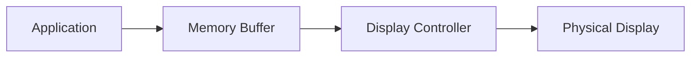

# STM32 Display Buffering

## Introduction

Display buffering is a fundamental concept in graphics programming for embedded systems like the STM32 microcontrollers. When working with displays such as LCDs or OLEDs, understanding how to properly manage display data is crucial for creating smooth and responsive user interfaces.

In this tutorial, we'll explore different buffering techniques for STM32 displays, their advantages and disadvantages, and how to implement them in your projects. Whether you're creating a simple gauge, a complex UI, or even a basic game, mastering display buffering will significantly improve your application's performance and user experience.

## What is Display Buffering?

Display buffering refers to the technique of storing pixel data in memory before sending it to the physical display. Instead of updating the display pixel-by-pixel (which can be slow and cause visual artifacts), we create a representation of the display in RAM first, manipulate it as needed, and then transfer the entire buffer to the display at once.



## Types of Display Buffering

### 1. Direct Mode (No Buffering)

The simplest approach is to write directly to the display without any buffering. While this method uses minimal RAM, it often results in flickering and slow updates.

```c
// Example of direct mode (no buffering)
void drawPixel(uint16_t x, uint16_t y, uint16_t color) {
    // Set cursor position
    LCD_SetCursor(x, y);
    
    // Write directly to display
    LCD_WriteData(color);
}
```

**Advantages:**
- Minimal RAM usage
- Simple implementation

**Disadvantages:**
- Slow performance
- Visible flickering
- Can't perform complex drawing operations easily

### 2. Single Buffering

With single buffering, we maintain one complete copy of the display in RAM. We modify this buffer and then send it to the display all at once.

```c
// Example of single buffering
#define DISPLAY_WIDTH  320
#define DISPLAY_HEIGHT 240

uint16_t displayBuffer[DISPLAY_WIDTH * DISPLAY_HEIGHT];

void drawPixel(uint16_t x, uint16_t y, uint16_t color) {
    if (x < DISPLAY_WIDTH && y < DISPLAY_HEIGHT) {
        displayBuffer[y * DISPLAY_WIDTH + x] = color;
    }
}

void updateDisplay(void) {
    // Send entire buffer to display
    LCD_SetCursor(0, 0);
    LCD_WriteMultipleData(displayBuffer, DISPLAY_WIDTH * DISPLAY_HEIGHT);
}
```

**Advantages:**
- Reduced flickering
- Ability to perform complex drawing operations
- Only updates the display when needed

**Disadvantages:**
- Requires significant RAM
- May still show tearing during updates

### 3. Double Buffering

Double buffering uses two complete frame buffers. While one buffer is being displayed, the other is being modified. Once the modification is complete, we swap the buffers.

```c
// Example of double buffering
#define DISPLAY_WIDTH  320
#define DISPLAY_HEIGHT 240

uint16_t frontBuffer[DISPLAY_WIDTH * DISPLAY_HEIGHT];
uint16_t backBuffer[DISPLAY_WIDTH * DISPLAY_HEIGHT];
uint16_t* currentDrawBuffer = backBuffer;
uint16_t* currentDisplayBuffer = frontBuffer;

void drawPixel(uint16_t x, uint16_t y, uint16_t color) {
    if (x < DISPLAY_WIDTH && y < DISPLAY_HEIGHT) {
        currentDrawBuffer[y * DISPLAY_WIDTH + x] = color;
    }
}

void swapBuffers(void) {
    uint16_t* temp = currentDisplayBuffer;
    currentDisplayBuffer = currentDrawBuffer;
    currentDrawBuffer = temp;
    
    // Send new display buffer to screen
    LCD_SetCursor(0, 0);
    LCD_WriteMultipleData(currentDisplayBuffer, DISPLAY_WIDTH * DISPLAY_HEIGHT);
}
```

**Advantages:**
- Eliminates flickering
- Smooth animations
- No visual artifacts during drawing

**Disadvantages:**
- Doubles the RAM requirement
- More complex to implement

### 4. Partial Buffering

For STM32 devices with limited RAM, you can implement partial buffering, where you buffer only a portion of the screen at a time.

```c
// Example of partial buffering
#define DISPLAY_WIDTH  320
#define DISPLAY_HEIGHT 240
#define BUFFER_HEIGHT  40  // Buffer only 40 rows at a time

uint16_t partialBuffer[DISPLAY_WIDTH * BUFFER_HEIGHT];

void updateDisplaySection(uint16_t startY, uint16_t endY) {
    uint16_t rows = endY - startY;
    if (rows > BUFFER_HEIGHT) rows = BUFFER_HEIGHT;
    
    // Set cursor to the starting position
    LCD_SetCursor(0, startY);
    
    // Send the partial buffer to display
    LCD_WriteMultipleData(partialBuffer, DISPLAY_WIDTH * rows);
}
```

**Advantages:**
- Works with limited RAM
- Better than direct mode
- Can be optimized for specific applications

**Disadvantages:**
- More complex to manage
- May still show some visual artifacts

## Memory Considerations

STM32 microcontrollers have varying amounts of RAM, so it's important to calculate your buffer size needs:

```
Buffer Size (bytes) = Width × Height × (Bits Per Pixel ÷ 8)
```

For example, a 320×240 display with 16 bits per pixel (65,536 colors) requires:

```
320 × 240 × (16 ÷ 8) = 320 × 240 × 2 = 153,600 bytes
```

This is significant for many STM32 devices, especially if double buffering (which would require 307,200 bytes).

Some strategies to reduce memory usage:

1. Use a lower color depth (e.g., 8-bit instead of 16-bit)
2. Buffer only a portion of the screen
3. Use smaller displays
4. Leverage DMA for transfers to free up CPU time

## Practical Implementation: Animated Gauge

Let's implement a simple animated gauge using single buffering:

```c
#include "stm32f4xx_hal.h"
#include "lcd_driver.h"  // Your LCD driver

#define DISPLAY_WIDTH  320
#define DISPLAY_HEIGHT 240
#define CENTER_X       (DISPLAY_WIDTH / 2)
#define CENTER_Y       (DISPLAY_HEIGHT / 2)
#define RADIUS         100

uint16_t displayBuffer[DISPLAY_WIDTH * DISPLAY_HEIGHT];

// Draw a single pixel in the buffer
void drawPixel(uint16_t x, uint16_t y, uint16_t color) {
    if (x < DISPLAY_WIDTH && y < DISPLAY_HEIGHT) {
        displayBuffer[y * DISPLAY_WIDTH + x] = color;
    }
}

// Draw a line using Bresenham's algorithm
void drawLine(int x0, int y0, int x1, int y1, uint16_t color) {
    int dx = abs(x1 - x0);
    int dy = -abs(y1 - y0);
    int sx = x0 < x1 ? 1 : -1;
    int sy = y0 < y1 ? 1 : -1;
    int err = dx + dy;
    int e2;
    
    while (1) {
        drawPixel(x0, y0, color);
        
        if (x0 == x1 && y0 == y1) break;
        
        e2 = 2 * err;
        if (e2 >= dy) {
            if (x0 == x1) break;
            err += dy;
            x0 += sx;
        }
        if (e2 <= dx) {
            if (y0 == y1) break;
            err += dx;
            y0 += sy;
        }
    }
}

// Clear the buffer
void clearBuffer(uint16_t color) {
    for (int i = 0; i < DISPLAY_WIDTH * DISPLAY_HEIGHT; i++) {
        displayBuffer[i] = color;
    }
}

// Draw the gauge with needle at specified angle
void drawGauge(float angle) {
    // Clear buffer with black background
    clearBuffer(0x0000);
    
    // Draw gauge outline
    for (int i = 0; i < 270; i += 5) {
        float rad = (i - 45) * 3.14159 / 180.0;
        int x = CENTER_X + (int)(RADIUS * cos(rad));
        int y = CENTER_Y + (int)(RADIUS * sin(rad));
        
        if (i % 45 == 0) {
            // Draw major tick
            int x2 = CENTER_X + (int)((RADIUS - 15) * cos(rad));
            int y2 = CENTER_Y + (int)((RADIUS - 15) * sin(rad));
            drawLine(x, y, x2, y2, 0xFFFF);  // White
        } else {
            // Draw minor tick
            int x2 = CENTER_X + (int)((RADIUS - 5) * cos(rad));
            int y2 = CENTER_Y + (int)((RADIUS - 5) * sin(rad));
            drawLine(x, y, x2, y2, 0xFFFF);  // White
        }
    }
    
    // Draw needle
    float rad = (angle - 45) * 3.14159 / 180.0;
    int needleX = CENTER_X + (int)((RADIUS - 20) * cos(rad));
    int needleY = CENTER_Y + (int)((RADIUS - 20) * sin(rad));
    drawLine(CENTER_X, CENTER_Y, needleX, needleY, 0xF800);  // Red
    
    // Draw center hub
    for (int y = CENTER_Y - 5; y <= CENTER_Y + 5; y++) {
        for (int x = CENTER_X - 5; x <= CENTER_X + 5; x++) {
            if ((x - CENTER_X) * (x - CENTER_X) + (y - CENTER_Y) * (y - CENTER_Y) <= 25) {
                drawPixel(x, y, 0xFFFF);  // White
            }
        }
    }
    
    // Update the display
    LCD_SetCursor(0, 0);
    LCD_WriteMultipleData(displayBuffer, DISPLAY_WIDTH * DISPLAY_HEIGHT);
}

// Main function
int main(void) {
    // Initialize system, clocks, LCD, etc.
    SystemInit();
    LCD_Init();
    
    float angle = 0;
    
    while (1) {
        // Update gauge angle
        angle += 1.0;
        if (angle >= 270) angle = 0;
        
        // Draw gauge with current angle
        drawGauge(angle);
        
        // Wait a short time before next update
        HAL_Delay(50);
    }
}
```

This example creates a gauge with a sweeping needle animation. The entire display is buffered in RAM, and the complete frame is sent to the display with each update.

## Optimizing Performance

### DMA Transfers

For STM32 devices with DMA (Direct Memory Access), you can significantly improve performance by offloading data transfers to the DMA controller:

```c
// Setup DMA for display transfer
void setupDisplayDMA(void) {
    // Configure DMA (specific to your STM32 model)
    __HAL_RCC_DMA2_CLK_ENABLE();
    
    hdma_spi.Instance = DMA2_Stream3;
    hdma_spi.Init.Channel = DMA_CHANNEL_3;
    hdma_spi.Init.Direction = DMA_MEMORY_TO_PERIPH;
    hdma_spi.Init.PeriphInc = DMA_PINC_DISABLE;
    hdma_spi.Init.MemInc = DMA_MINC_ENABLE;
    hdma_spi.Init.PeriphDataAlignment = DMA_PDATAALIGN_HALFWORD;
    hdma_spi.Init.MemDataAlignment = DMA_MDATAALIGN_HALFWORD;
    hdma_spi.Init.Mode = DMA_NORMAL;
    hdma_spi.Init.Priority = DMA_PRIORITY_HIGH;
    
    HAL_DMA_Init(&hdma_spi);
    
    __HAL_LINKDMA(&hspi, hdmatx, hdma_spi);
    
    HAL_NVIC_SetPriority(DMA2_Stream3_IRQn, 0, 0);
    HAL_NVIC_EnableIRQ(DMA2_Stream3_IRQn);
}

// Function to update display using DMA
void updateDisplayDMA(void) {
    LCD_SetCursor(0, 0);
    
    // Start DMA transfer
    HAL_SPI_Transmit_DMA(&hspi, (uint8_t*)displayBuffer, DISPLAY_WIDTH * DISPLAY_HEIGHT * 2);
    
    // CPU is free to do other tasks while DMA is transferring
}
```

### Using Hardware Acceleration

Some STM32 models include hardware graphics acceleration. For example, the STM32F4 and STM32F7 series include a Chrom-ART Accelerator (DMA2D) for 2D graphics operations:

```c
// Example of using DMA2D to fill a rectangle
void fillRect(uint16_t x, uint16_t y, uint16_t width, uint16_t height, uint16_t color) {
    // Configure DMA2D
    hdma2d.Init.Mode = DMA2D_R2M;  // Register to memory mode
    hdma2d.Init.ColorMode = DMA2D_OUTPUT_RGB565;
    hdma2d.Init.OutputOffset = DISPLAY_WIDTH - width;
    
    hdma2d.Instance = DMA2D;
    
    // Start transfer
    HAL_DMA2D_Init(&hdma2d);
    HAL_DMA2D_ConfigLayer(&hdma2d, 0);
    HAL_DMA2D_Start(&hdma2d, color, (uint32_t)&displayBuffer[y * DISPLAY_WIDTH + x], width, height);
    HAL_DMA2D_PollForTransfer(&hdma2d, 100);
}
```

## Practical Example: Menu System with Double Buffering

Here's a more advanced example that implements a simple menu system using double buffering:

```c
#include "stm32f4xx_hal.h"
#include "lcd_driver.h"
#include "font.h"  // Include a font library

#define DISPLAY_WIDTH  320
#define DISPLAY_HEIGHT 240

uint16_t frontBuffer[DISPLAY_WIDTH * DISPLAY_HEIGHT];
uint16_t backBuffer[DISPLAY_WIDTH * DISPLAY_HEIGHT];
uint16_t* currentDrawBuffer = backBuffer;
uint16_t* currentDisplayBuffer = frontBuffer;

typedef struct {
    char title[20];
    uint8_t selected;
} MenuItem;

MenuItem menuItems[5] = {
    {"Settings", 0},
    {"Status", 0},
    {"Calibration", 0},
    {"Data Log", 0},
    {"About", 0}
};

uint8_t currentMenuIndex = 0;
uint8_t menuItemCount = 5;

// Draw a single pixel
void drawPixel(uint16_t x, uint16_t y, uint16_t color) {
    if (x < DISPLAY_WIDTH && y < DISPLAY_HEIGHT) {
        currentDrawBuffer[y * DISPLAY_WIDTH + x] = color;
    }
}

// Draw a filled rectangle
void fillRect(uint16_t x, uint16_t y, uint16_t width, uint16_t height, uint16_t color) {
    for (uint16_t j = 0; j < height; j++) {
        for (uint16_t i = 0; i < width; i++) {
            if ((x + i) < DISPLAY_WIDTH && (y + j) < DISPLAY_HEIGHT) {
                currentDrawBuffer[(y + j) * DISPLAY_WIDTH + (x + i)] = color;
            }
        }
    }
}

// Draw text (simplified - you'd need a proper font implementation)
void drawText(uint16_t x, uint16_t y, char* text, uint16_t color) {
    // This is a placeholder - implement with your font library
    // For each character, draw it at the position using font data
    uint16_t xPos = x;
    
    for (int i = 0; text[i] != '\0'; i++) {
        // Draw character from font data
        // This is simplified - actual implementation depends on your font format
        char c = text[i];
        // ... draw character pixels ...
        
        xPos += 8; // Advance by character width
    }
}

// Draw the menu
void drawMenu(void) {
    // Clear back buffer
    fillRect(0, 0, DISPLAY_WIDTH, DISPLAY_HEIGHT, 0x0000);  // Black background
    
    // Draw title bar
    fillRect(0, 0, DISPLAY_WIDTH, 30, 0x001F);  // Blue title bar
    drawText(10, 8, "Main Menu", 0xFFFF);  // White text
    
    // Draw menu items
    for (int i = 0; i < menuItemCount; i++) {
        uint16_t itemY = 40 + i * 35;
        
        if (i == currentMenuIndex) {
            // Selected item
            fillRect(10, itemY, DISPLAY_WIDTH - 20, 30, 0x07E0);  // Green
            drawText(20, itemY + 8, menuItems[i].title, 0x0000);  // Black text
        } else {
            // Unselected item
            fillRect(10, itemY, DISPLAY_WIDTH - 20, 30, 0xCE59);  // Light gray
            drawText(20, itemY + 8, menuItems[i].title, 0x0000);  // Black text
        }
    }
    
    // Draw footer
    fillRect(0, DISPLAY_HEIGHT - 30, DISPLAY_WIDTH, 30, 0x001F);  // Blue footer
    drawText(10, DISPLAY_HEIGHT - 22, "Press UP/DOWN to navigate", 0xFFFF);
}

// Swap buffers and update display
void swapBuffers(void) {
    uint16_t* temp = currentDisplayBuffer;
    currentDisplayBuffer = currentDrawBuffer;
    currentDrawBuffer = temp;
    
    // Send the display buffer to the screen
    LCD_SetCursor(0, 0);
    LCD_WriteMultipleData(currentDisplayBuffer, DISPLAY_WIDTH * DISPLAY_HEIGHT);
}

void handleKeyPress(uint8_t key) {
    switch (key) {
        case KEY_UP:
            if (currentMenuIndex > 0) currentMenuIndex--;
            break;
            
        case KEY_DOWN:
            if (currentMenuIndex < menuItemCount - 1) currentMenuIndex++;
            break;
            
        case KEY_SELECT:
            menuItems[currentMenuIndex].selected = 1;
            // Handle menu selection
            break;
    }
    
    // Redraw menu with updated selection
    drawMenu();
    
    // Swap buffers to update display
    swapBuffers();
}

// Main function
int main(void) {
    // Initialize system, clocks, LCD, etc.
    SystemInit();
    LCD_Init();
    
    // Initialize both buffers to black
    for (int i = 0; i < DISPLAY_WIDTH * DISPLAY_HEIGHT; i++) {
        frontBuffer[i] = 0x0000;
        backBuffer[i] = 0x0000;
    }
    
    // Draw initial menu
    drawMenu();
    swapBuffers();
    
    while (1) {
        // Check for key presses
        uint8_t key = readKey();  // Implement this function based on your hardware
        
        if (key != KEY_NONE) {
            handleKeyPress(key);
            
            // Add debounce delay
            HAL_Delay(200);
        }
    }
}
```

## When to Use Each Buffering Method

Choose the appropriate buffering method based on your application's needs:

1. **Direct Mode (No Buffering):**
   - Very simple displays with minimal graphics
   - Extremely memory-constrained devices
   - Static content that rarely changes

2. **Single Buffering:**
   - Most general-purpose applications
   - Good balance of performance and memory usage
   - When display updates are not frequent

3. **Double Buffering:**
   - Animation-heavy applications
   - Games or video playback
   - When smooth transitions are critical
   - User interfaces that need to be highly responsive

4. **Partial Buffering:**
   - When memory is constrained but better performance than direct mode is needed
   - Applications where only specific areas of the screen are updated frequently
   - Segmented displays where different areas have different update requirements

## Summary

Display buffering is a critical technique for creating smooth and responsive graphical interfaces on STM32 microcontrollers. By understanding the different buffering strategies and their trade-offs, you can choose the most appropriate approach for your specific application.

Key takeaways:
- Direct mode is simple but provides poor performance
- Single buffering offers a good balance of performance and memory usage
- Double buffering provides the smoothest visuals but consumes the most memory
- Partial buffering can be used when memory is limited
- DMA and hardware acceleration can significantly improve performance

Remember to always consider your STM32 device's memory constraints when designing your graphics system, and choose the appropriate buffering strategy accordingly.

## Exercise: Implement a Progress Bar

Try implementing a progress bar that updates smoothly using one of the buffering techniques described. The progress bar should:
1. Fill from left to right as progress increases
2. Change color based on progress (e.g., red to green)
3. Show percentage text in the center
4. Update smoothly without flickering

## Additional Resources

- [STM32 Graphics Library (STemWin)](https://www.st.com/en/embedded-software/stemwin.html)
- [AN4861: LCD-TFT display controller (LTDC) on STM32 MCUs](https://www.st.com/resource/en/application_note/an4861-lcdtft-display-controller-ltdc-on-stm32-mcus-stmicroelectronics.pdf)
- [TouchGFX](https://www.st.com/en/embedded-software/touchgfx.html) - Advanced graphics framework for STM32
- [STM32CubeF4](https://www.st.com/en/embedded-software/stm32cubef4.html) - Contains examples of LCD interfacing