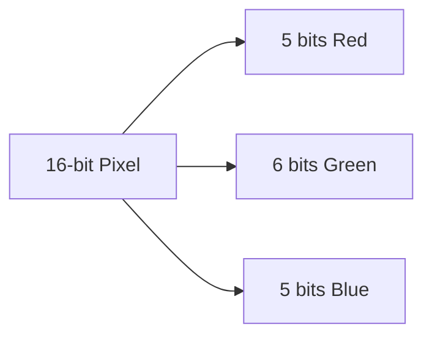
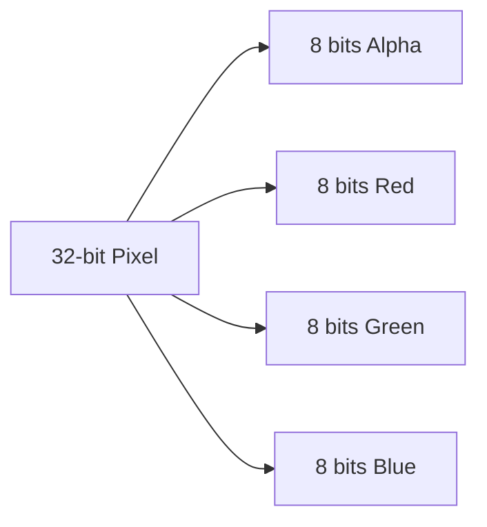
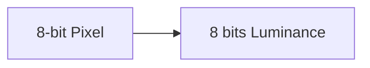

# STM32 Color Formats

## Introduction

When working with graphics on STM32 microcontrollers, understanding color formats is essential for efficient rendering and accurate color representation. Different display technologies and applications require specific color formats to balance visual quality with memory and processing constraints. This guide will introduce you to the most common color formats used in STM32 graphics programming and help you choose the right format for your project.

## Color Basics

Before diving into specific formats, let's understand how colors are represented digitally:

- **Color Depth**: The number of bits used to represent each pixel, determining how many unique colors can be displayed
- **Color Channels**: Components that make up a color (typically Red, Green, and Blue)
- **Pixel Format**: How color information is organized in memory

## Common STM32 Color Formats

STM32 microcontrollers support several color formats, each with different advantages and memory requirements.

### RGB565 (16-bit)

RGB565 is one of the most popular formats for embedded systems due to its good balance between color quality and memory usage.



In RGB565:
- Red channel: 5 bits (32 shades)
- Green channel: 6 bits (64 shades)
- Blue channel: 5 bits (32 shades)
- Total: 65,536 possible colors
- Memory required: 2 bytes per pixel

The green channel has an extra bit because the human eye is more sensitive to green variations.

#### Example: Creating RGB565 Colors

```c
// Define RGB565 color format
typedef uint16_t RGB565;

// Create RGB565 color from individual R, G, B components (0-255)
RGB565 RGB565_FROM_RGB(uint8_t r, uint8_t g, uint8_t b) {
    return ((r & 0xF8) << 8) | ((g & 0xFC) << 3) | (b >> 3);
}

// Example colors in RGB565
#define RGB565_BLACK    0x0000  // (0, 0, 0)
#define RGB565_WHITE    0xFFFF  // (255, 255, 255)
#define RGB565_RED      0xF800  // (255, 0, 0)
#define RGB565_GREEN    0x07E0  // (0, 255, 0)
#define RGB565_BLUE     0x001F  // (0, 0, 255)
#define RGB565_CYAN     0x07FF  // (0, 255, 255)
#define RGB565_MAGENTA  0xF81F  // (255, 0, 255)
#define RGB565_YELLOW   0xFFE0  // (255, 255, 0)
```

### ARGB8888 (32-bit)

ARGB8888 is a high-quality format that includes an alpha channel for transparency.



In ARGB8888:
- Alpha channel: 8 bits (256 levels of transparency)
- Red channel: 8 bits (256 shades)
- Green channel: 8 bits (256 shades)
- Blue channel: 8 bits (256 shades)
- Total: 16.7 million colors with 256 transparency levels
- Memory required: 4 bytes per pixel

#### Example: Working with ARGB8888

```c
// Define ARGB8888 color format
typedef uint32_t ARGB8888;

// Create ARGB8888 color from individual A, R, G, B components (0-255)
ARGB8888 ARGB8888_FROM_ARGB(uint8_t a, uint8_t r, uint8_t g, uint8_t b) {
    return (a << 24) | (r << 16) | (g << 8) | b;
}

// Example colors in ARGB8888
#define ARGB8888_BLACK        0xFF000000  // (255, 0, 0, 0)
#define ARGB8888_WHITE        0xFFFFFFFF  // (255, 255, 255, 255)
#define ARGB8888_RED          0xFFFF0000  // (255, 255, 0, 0)
#define ARGB8888_GREEN        0xFF00FF00  // (255, 0, 255, 0)
#define ARGB8888_BLUE         0xFF0000FF  // (255, 0, 0, 255)
#define ARGB8888_TRANSPARENT  0x00000000  // (0, 0, 0, 0)
#define ARGB8888_SEMI_TRANS   0x80FFFFFF  // (128, 255, 255, 255)
```

### RGB888 (24-bit)

RGB888 offers full 24-bit color without an alpha channel.


In RGB888:
- Red channel: 8 bits (256 shades)
- Green channel: 8 bits (256 shades)
- Blue channel: 8 bits (256 shades)
- Total: 16.7 million colors
- Memory required: 3 bytes per pixel

#### Example: Working with RGB888

```c
// Define RGB888 color format (often stored in 32 bits for alignment)
typedef struct {
    uint8_t b;
    uint8_t g;
    uint8_t r;
    uint8_t unused;  // For 32-bit alignment
} RGB888;

// Create RGB888 color from individual R, G, B components (0-255)
RGB888 RGB888_FROM_RGB(uint8_t r, uint8_t g, uint8_t b) {
    RGB888 color;
    color.r = r;
    color.g = g;
    color.b = b;
    color.unused = 0;
    return color;
}
```

### L8 (8-bit Grayscale)

L8 is an 8-bit grayscale format useful for monochrome displays or when color isn't needed.



In L8:
- Single luminance channel: 8 bits (256 shades of gray)
- Memory required: 1 byte per pixel

#### Example: Working with L8

```c
// Define L8 color format
typedef uint8_t L8;

// Create L8 grayscale from RGB (0-255)
L8 L8_FROM_RGB(uint8_t r, uint8_t g, uint8_t b) {
    // Standard conversion weights for human perception
    return (uint8_t)(0.299f * r + 0.587f * g + 0.114f * b);
}

// Example shades in L8
#define L8_BLACK   0x00  // (0)
#define L8_DARK    0x40  // (64)
#define L8_MEDIUM  0x80  // (128)
#define L8_LIGHT   0xC0  // (192)
#define L8_WHITE   0xFF  // (255)
```

## Color Format Conversion

Converting between color formats is a common task in graphics programming. Let's look at how to convert between some common formats.

### RGB565 to RGB888

```c
void RGB565_to_RGB888(uint16_t rgb565, uint8_t *r, uint8_t *g, uint8_t *b) {
    // Extract components
    *r = (rgb565 >> 11) & 0x1F;
    *g = (rgb565 >> 5) & 0x3F;
    *b = rgb565 & 0x1F;
    
    // Scale to 8 bits per channel
    *r = (*r * 255 + 15) / 31;
    *g = (*g * 255 + 31) / 63;
    *b = (*b * 255 + 15) / 31;
}
```

### RGB888 to RGB565

```c
uint16_t RGB888_to_RGB565(uint8_t r, uint8_t g, uint8_t b) {
    return ((r & 0xF8) << 8) | ((g & 0xFC) << 3) | (b >> 3);
}
```

### RGB to Grayscale

```c
uint8_t RGB_to_Grayscale(uint8_t r, uint8_t g, uint8_t b) {
    // Standard luminance conversion
    return (uint8_t)(0.299f * r + 0.587f * g + 0.114f * b);
}
```

## Practical Applications

Let's explore some real-world applications of these color formats in STM32 graphics programming.

### Memory Optimization with RGB565

When working with limited RAM, RGB565 can significantly reduce memory usage compared to 24-bit formats.

```c
// Example: Calculator for display buffer size
uint32_t calculateBufferSize(uint16_t width, uint16_t height, uint8_t bytesPerPixel) {
    return width * height * bytesPerPixel;
}

// For a 320x240 display:
// RGB565: 320 * 240 * 2 = 153,600 bytes (150 KB)
// RGB888: 320 * 240 * 3 = 230,400 bytes (225 KB)
// ARGB8888: 320 * 240 * 4 = 307,200 bytes (300 KB)
```

### Double Buffering Implementation

```c
// Define buffers for double buffering (using RGB565)
#define DISPLAY_WIDTH  320
#define DISPLAY_HEIGHT 240
#define BYTES_PER_PIXEL 2  // RGB565

// Two frame buffers (front and back)
uint16_t frameBuffer1[DISPLAY_WIDTH * DISPLAY_HEIGHT];
uint16_t frameBuffer2[DISPLAY_WIDTH * DISPLAY_HEIGHT];

// Pointer to active buffer
uint16_t* activeFrameBuffer = frameBuffer1;
uint16_t* backFrameBuffer = frameBuffer2;

// Function to swap buffers
void swapBuffers(void) {
    uint16_t* temp = activeFrameBuffer;
    activeFrameBuffer = backFrameBuffer;
    backFrameBuffer = temp;
    
    // Then send activeFrameBuffer to display
    // displaySendBuffer(activeFrameBuffer);
}
```

### Color Gradient Generation

```c
// Generate a gradient between two RGB565 colors
void generateGradient(uint16_t* buffer, uint16_t width, uint16_t startColor, uint16_t endColor) {
    // Extract start color components
    uint8_t startR = (startColor >> 11) & 0x1F;
    uint8_t startG = (startColor >> 5) & 0x3F;
    uint8_t startB = startColor & 0x1F;
    
    // Extract end color components
    uint8_t endR = (endColor >> 11) & 0x1F;
    uint8_t endG = (endColor >> 5) & 0x3F;
    uint8_t endB = endColor & 0x1F;
    
    // For each pixel in the gradient
    for(uint16_t i = 0; i < width; i++) {
        float factor = (float)i / (float)(width - 1);
        
        // Interpolate components
        uint8_t r = startR + factor * (endR - startR);
        uint8_t g = startG + factor * (endG - startG);
        uint8_t b = startB + factor * (endB - startB);
        
        // Combine into RGB565
        buffer[i] = (r << 11) | (g << 5) | b;
    }
}
```

## Hardware Considerations

Different STM32 series have varying hardware support for color formats:

- **STM32F4/F7/H7**: Support direct handling of multiple color formats, including hardware acceleration for some conversions
- **STM32F0/F1/F3**: Often limited to simpler color formats due to memory constraints
- **STM32 with LTDC (LCD-TFT Display Controller)**: Support for multiple formats with hardware acceleration

### DMA2D (Chrom-ART Accelerator)

Higher-end STM32 microcontrollers feature the Chrom-ART accelerator, which provides hardware acceleration for:

- Color format conversion
- Color fill operations
- Image blending
- Image copy operations

```c
/* Example: Using DMA2D for RGB888 to RGB565 conversion (pseudo-code) */
void convertFormatWithDMA2D(uint8_t* srcBuffer, uint16_t* dstBuffer, uint16_t width, uint16_t height) {
    // Configure DMA2D
    DMA2D->CR = DMA2D_CR_MODE_M2M_PFC;  // Memory to memory with pixel format conversion
    
    // Source configuration (RGB888)
    DMA2D->FGPFCCR = DMA2D_INPUT_RGB888;
    DMA2D->FGMAR = (uint32_t)srcBuffer;
    DMA2D->FGOR = 0;
    
    // Destination configuration (RGB565)
    DMA2D->OPFCCR = DMA2D_OUTPUT_RGB565;
    DMA2D->OMAR = (uint32_t)dstBuffer;
    DMA2D->OOR = 0;
    
    // Set size
    DMA2D->NLR = (height << 16) | width;
    
    // Start transfer
    DMA2D->CR |= DMA2D_CR_START;
    
    // Wait for completion
    while(DMA2D->CR & DMA2D_CR_START);
}
```

## Best Practices

1. **Match hardware capabilities**: Choose a color format that your STM32 model can efficiently process.
2. **Balance quality and performance**: 
   - Use RGB565 for most embedded applications
   - Use ARGB8888 when transparency is required
   - Use L8 for monochrome displays or memory-constrained applications
3. **Align data**: Ensure data alignment for better performance (e.g., 32-bit alignment)
4. **Use hardware acceleration**: Leverage DMA2D when available for faster operations
5. **Pre-compute colors**: Define common colors as constants to avoid runtime calculations

## Summary

STM32 color formats offer a range of options to balance visual quality with memory and processing requirements. Understanding these formats is crucial for efficient graphics programming on STM32 microcontrollers:

- **RGB565** offers a good balance for most applications
- **ARGB8888** provides high quality with transparency support
- **RGB888** delivers full color range without transparency
- **L8** is efficient for grayscale applications

Choose the appropriate format based on your display hardware, memory constraints, and visual requirements. When possible, use hardware acceleration features like DMA2D to optimize performance.

## Exercises

1. Write a function to create a color wheel in RGB565 format.
2. Implement a function to convert an image from RGB888 to RGB565.
3. Create a dithering algorithm to simulate more colors on a display using RGB565.
4. Implement alpha blending between two RGB565 images without using hardware acceleration.
5. Optimize a gradient drawing function using DMA2D on an STM32F7 series microcontroller.

## Additional Resources

- STM32 Graphics Library Documentation
- STM32F7/H7 Series Reference Manuals (DMA2D sections)
- STM32 LCD-TFT Display Controller (LTDC) Application Notes
- Embedded Graphics Optimization Techniques