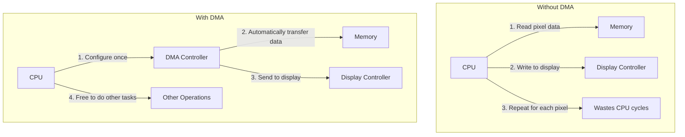

# STM32 Display DMA

## Introduction

Updating displays on embedded systems can be resource-intensive. When your STM32 microcontroller needs to refresh a display, it typically requires transferring large amounts of data from memory to the display controller. If handled directly by the CPU, this process can consume significant processing time, preventing the CPU from performing other tasks.

This is where Direct Memory Access (DMA) comes to the rescue. DMA allows data transfers to occur independently of the CPU, freeing it up for other operations. In this tutorial, we'll explore how to leverage DMA for efficient display updates on STM32 microcontrollers.

## What is DMA?

DMA (Direct Memory Access) is a feature that allows hardware subsystems to access memory independently of the CPU. With DMA:

- Data transfers occur in the background without CPU intervention
- The CPU can perform other tasks during data transfers
- Overall system performance improves significantly
- Display updates become smoother and more efficient

## Why Use DMA for Displays?

Let's compare the traditional method with the DMA approach:



For displays with many pixels, the difference is dramatic:

- A 320×240 color display has 76,800 pixels
- Each pixel might require 2 bytes (16-bit color)
- That's 153,600 bytes to transfer for each frame
- At 30 frames per second, you're moving 4.6MB every second!

## STM32 DMA Basics

STM32 microcontrollers include multiple DMA channels that can be configured for various peripherals. For displays, we typically use DMA with:

- SPI (Serial Peripheral Interface)
- FSMC (Flexible Static Memory Controller)
- LTDC (LCD-TFT Display Controller) on more advanced STM32s

Each DMA transfer requires configuring:

1. Source address (your frame buffer in memory)
2. Destination address (the display controller's data register)
3. Transfer size (how many bytes/pixels to send)
4. Transfer direction (memory-to-peripheral in our case)
5. Increment settings (typically increment source address, fixed destination)

## Setting Up DMA for SPI Display

Many beginner projects use SPI displays like ILI9341 or ST7735. Here's how to set up DMA for an SPI display:

```c
/* Define our frame buffer */
uint16_t frameBuffer[320 * 240]; // For a 320x240 display with 16-bit color

/* DMA configuration structure */
DMA_InitTypeDef DMA_InitStructure;

void initDisplayDMA(void) {
    /* Enable DMA clock */
    RCC_AHB1PeriphClockCmd(RCC_AHB1Periph_DMA2, ENABLE);
    
    /* Configure DMA2 - this example uses DMA2 Stream 3 Channel 3 for SPI1 TX */
    DMA_InitStructure.DMA_Channel = DMA_Channel_3;
    DMA_InitStructure.DMA_PeripheralBaseAddr = (uint32_t)&SPI1->DR; // SPI1 data register
    DMA_InitStructure.DMA_Memory0BaseAddr = (uint32_t)frameBuffer;
    DMA_InitStructure.DMA_DIR = DMA_DIR_MemoryToPeripheral;
    DMA_InitStructure.DMA_BufferSize = 320 * 240; // Number of data items
    DMA_InitStructure.DMA_PeripheralInc = DMA_PeripheralInc_Disable; // Don't increment peripheral address
    DMA_InitStructure.DMA_MemoryInc = DMA_MemoryInc_Enable; // Increment memory address
    DMA_InitStructure.DMA_PeripheralDataSize = DMA_PeripheralDataSize_HalfWord; // 16-bit data
    DMA_InitStructure.DMA_MemoryDataSize = DMA_MemoryDataSize_HalfWord; // 16-bit data
    DMA_InitStructure.DMA_Mode = DMA_Mode_Normal; // Not circular
    DMA_InitStructure.DMA_Priority = DMA_Priority_High;
    DMA_InitStructure.DMA_FIFOMode = DMA_FIFOMode_Disable;
    DMA_InitStructure.DMA_MemoryBurst = DMA_MemoryBurst_Single;
    DMA_InitStructure.DMA_PeripheralBurst = DMA_PeripheralBurst_Single;
    
    DMA_Init(DMA2_Stream3, &DMA_InitStructure);
    
    /* Enable SPI TX DMA requests */
    SPI_I2S_DMACmd(SPI1, SPI_I2S_DMAReq_Tx, ENABLE);
}
```

## Sending a Frame with DMA

Once configured, sending data to the display becomes much simpler:

```c
void sendFrameBufferDMA(void) {
    /* Set the display address window first */
    LCD_SetAddressWindow(0, 0, 319, 239); // Full screen
    
    /* Send command to begin memory write */
    LCD_WriteCommand(CMD_MEMORY_WRITE);
    
    /* Make sure DMA stream is disabled */
    DMA_Cmd(DMA2_Stream3, DISABLE);
    
    /* Set memory address and size */
    DMA2_Stream3->M0AR = (uint32_t)frameBuffer;
    DMA2_Stream3->NDTR = 320 * 240;
    
    /* Enable DMA stream to start transfer */
    DMA_Cmd(DMA2_Stream3, ENABLE);
    
    /* Optionally, you can wait for transfer completion */
    // while (DMA_GetFlagStatus(DMA2_Stream3, DMA_FLAG_TCIF3) == RESET) {}
    // DMA_ClearFlag(DMA2_Stream3, DMA_FLAG_TCIF3);
}
```

## Double Buffering for Smoother Updates

To prevent visual artifacts ("tearing"), we can implement double buffering:

```c
uint16_t frameBuffer1[320 * 240]; // Display buffer
uint16_t frameBuffer2[320 * 240]; // Drawing buffer
uint16_t* displayBuffer = frameBuffer1;
uint16_t* drawBuffer = frameBuffer2;

void swapBuffers(void) {
    /* Wait for any ongoing DMA transfer to complete */
    while (DMA_GetFlagStatus(DMA2_Stream3, DMA_FLAG_TCIF3) == RESET) {}
    DMA_ClearFlag(DMA2_Stream3, DMA_FLAG_TCIF3);
    
    /* Swap buffers */
    uint16_t* temp = displayBuffer;
    displayBuffer = drawBuffer;
    drawBuffer = temp;
    
    /* Start new transfer with updated display buffer */
    sendFrameWithBuffer(displayBuffer);
}

void sendFrameWithBuffer(uint16_t* buffer) {
    /* Set the display address window */
    LCD_SetAddressWindow(0, 0, 319, 239);
    
    /* Send command to begin memory write */
    LCD_WriteCommand(CMD_MEMORY_WRITE);
    
    /* Configure DMA with the new buffer */
    DMA_Cmd(DMA2_Stream3, DISABLE);
    DMA2_Stream3->M0AR = (uint32_t)buffer;
    DMA2_Stream3->NDTR = 320 * 240;
    DMA_Cmd(DMA2_Stream3, ENABLE);
}
```

## Handling DMA Interrupts

To make your code even more efficient, you can set up DMA interrupts to notify your program when a transfer completes:

```c
void configureDMAInterrupts(void) {
    /* Enable DMA Stream Transfer Complete interrupt */
    DMA_ITConfig(DMA2_Stream3, DMA_IT_TC, ENABLE);
    
    /* Configure NVIC for DMA */
    NVIC_InitTypeDef NVIC_InitStructure;
    NVIC_InitStructure.NVIC_IRQChannel = DMA2_Stream3_IRQn;
    NVIC_InitStructure.NVIC_IRQChannelPreemptionPriority = 0;
    NVIC_InitStructure.NVIC_IRQChannelSubPriority = 0;
    NVIC_InitStructure.NVIC_IRQChannelCmd = ENABLE;
    NVIC_Init(&NVIC_InitStructure);
}

/* DMA interrupt handler */
void DMA2_Stream3_IRQHandler(void) {
    if (DMA_GetFlagStatus(DMA2_Stream3, DMA_FLAG_TCIF3) != RESET) {
        /* Clear the DMA transfer complete flag */
        DMA_ClearFlag(DMA2_Stream3, DMA_FLAG_TCIF3);
        
        /* Handle transfer complete event */
        TransferCompleteCallback();
    }
}

void TransferCompleteCallback(void) {
    /* This function gets called when DMA transfer is complete */
    /* You can set a flag, signal a semaphore, or start the next operation */
    transferCompleteFlag = 1;
}
```

## Advanced: DMA with LTDC Controller

Higher-end STM32 microcontrollers (like F4, F7, and H7 series) feature an LCD-TFT Display Controller (LTDC) that integrates with DMA2D for even better performance:

```c
/* Frame buffer in SDRAM for LTDC */
uint32_t frameBuffer[480 * 272] __attribute__((section(".sdram")));

void initLTDC(void) {
    /* LTDC configuration code */
    LTDC_InitTypeDef LTDC_InitStruct;
    /* Initialize LTDC with appropriate settings for your display */
    
    /* Layer configuration */
    LTDC_Layer_InitTypeDef LTDC_Layer_InitStruct;
    LTDC_Layer_InitStruct.LTDC_CFBStartAdress = (uint32_t)frameBuffer;
    /* Other layer settings */
    
    LTDC_LayerInit(LTDC_Layer1, &LTDC_Layer_InitStruct);
    
    /* Enable layers and LTDC */
    LTDC_LayerCmd(LTDC_Layer1, ENABLE);
    LTDC_ReloadConfig(LTDC_IMReload);
    LTDC_Cmd(ENABLE);
}

/* With LTDC, DMA is handled automatically! Just update the frame buffer */
void drawPixel(uint16_t x, uint16_t y, uint32_t color) {
    frameBuffer[y * 480 + x] = color;
    /* No need to trigger DMA manually - LTDC continuously reads from frame buffer */
}
```

## Complete Example: Animation with DMA

Let's put it all together with a simple bouncing ball animation:

```c
#include "stm32f4xx.h"
#include "stm32f4xx_spi.h"
#include "stm32f4xx_dma.h"
#include "display.h" // Your display driver

#define DISPLAY_WIDTH  320
#define DISPLAY_HEIGHT 240
#define BALL_RADIUS    15
#define BG_COLOR       0x0000 // Black
#define BALL_COLOR     0xF800 // Red

uint16_t frameBuffer1[DISPLAY_WIDTH * DISPLAY_HEIGHT];
uint16_t frameBuffer2[DISPLAY_WIDTH * DISPLAY_HEIGHT];
uint16_t* displayBuffer = frameBuffer1;
uint16_t* drawBuffer = frameBuffer2;

volatile uint8_t transferComplete = 1;

int main(void) {
    /* System initialization */
    SystemInit();
    
    /* Initialize display */
    Display_Init();
    
    /* Initialize DMA for display */
    initDisplayDMA();
    configureDMAInterrupts();
    
    /* Ball animation variables */
    int ballX = DISPLAY_WIDTH / 2;
    int ballY = DISPLAY_HEIGHT / 2;
    int ballSpeedX = 3;
    int ballSpeedY = 2;
    
    /* Main loop */
    while (1) {
        /* Wait for previous transfer to complete */
        while (!transferComplete) { /* wait */ }
        transferComplete = 0;
        
        /* Clear drawing buffer */
        for (int i = 0; i < DISPLAY_WIDTH * DISPLAY_HEIGHT; i++) {
            drawBuffer[i] = BG_COLOR;
        }
        
        /* Update ball position */
        ballX += ballSpeedX;
        ballY += ballSpeedY;
        
        /* Bounce off edges */
        if (ballX <= BALL_RADIUS || ballX >= DISPLAY_WIDTH - BALL_RADIUS) {
            ballSpeedX = -ballSpeedX;
        }
        if (ballY <= BALL_RADIUS || ballY >= DISPLAY_HEIGHT - BALL_RADIUS) {
            ballSpeedY = -ballSpeedY;
        }
        
        /* Draw ball in the drawing buffer */
        for (int y = 0; y < DISPLAY_HEIGHT; y++) {
            for (int x = 0; x < DISPLAY_WIDTH; x++) {
                int dx = x - ballX;
                int dy = y - ballY;
                if (dx*dx + dy*dy <= BALL_RADIUS*BALL_RADIUS) {
                    drawBuffer[y * DISPLAY_WIDTH + x] = BALL_COLOR;
                }
            }
        }
        
        /* Swap buffers and trigger DMA */
        swapBuffers();
        
        /* Small delay */
        for (volatile int i = 0; i < 100000; i++);
    }
}

void TransferCompleteCallback(void) {
    transferComplete = 1;
}
```

## Performance Considerations

When using DMA for displays, keep these tips in mind:

1. **Memory alignment**: Some DMA controllers work better with aligned memory. Consider using `__attribute__((aligned(4)))` for your frame buffers.

2. **Cache management**: On STM32F7/H7, you may need to flush/invalidate cache before/after DMA operations:
   ```c
   SCB_CleanDCache_by_Addr((uint32_t*)frameBuffer, DISPLAY_WIDTH * DISPLAY_HEIGHT * sizeof(uint16_t));
   ```

3. **Transfer size limits**: Check your STM32's datasheet for maximum DMA transfer size limitations.

4. **Priority settings**: Set appropriate DMA priority based on your application's needs.

## Common Issues and Solutions

| Issue | Possible Cause | Solution |
|-------|---------------|----------|
| Screen flickers | Buffer swapping during active display refresh | Implement V-sync or timed buffer swaps |
| DMA transfer fails | Incorrect peripheral address | Double-check the data register address for your peripheral |
| Display shows corrupted image | Improper DMA configuration | Verify data width settings match your display (8/16/32-bit) |
| CPU freezes | Waiting for DMA in a tight loop | Use interrupts or flags instead of blocking waits |

## Summary

Using DMA for display updates on STM32 microcontrollers offers significant performance advantages:

- CPU resources are freed up for other tasks
- Display updates happen more efficiently
- Higher frame rates become possible
- More complex graphics can be implemented

By mastering DMA for display updates, you've taken a significant step toward creating professional-quality graphics applications on STM32 microcontrollers.

## Additional Exercises

1. Modify the bouncing ball example to include multiple balls with different colors.
2. Implement a simple game (like Pong) using DMA for display updates.
3. Create a spectrum analyzer that visualizes audio data using DMA for both ADC sampling and display updates.
4. Compare the performance of direct CPU display updates versus DMA-based updates by measuring CPU usage.

## Further Reading

- STM32 Reference Manual (RM0090 for STM32F4 series) - DMA controller section
- STM32 Application Note AN4861: "LCD-TFT display controller (LTDC) on STM32 MCUs"
- STM32 Application Note AN4031: "Using the STM32F2, STM32F4 and STM32F7 Series DMA controller"