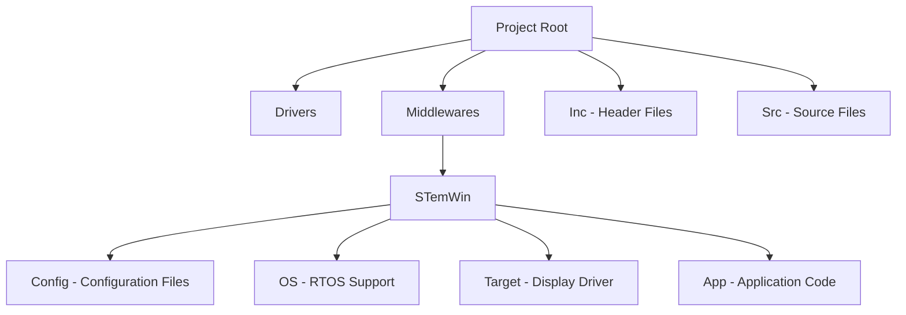

# STM32 STemWin Graphics Library

## Introduction

STemWin (also known as emWin) is a professional graphics library developed by SEGGER Microcontroller and licensed to STMicroelectronics for use with STM32 microcontrollers. It provides a powerful and efficient way to implement graphical user interfaces (GUIs) on resource-constrained embedded systems. STemWin is particularly valuable for creating touchscreen applications, information displays, and interactive panels in industrial, medical, automotive, and consumer electronics.

In this tutorial, we'll explore what STemWin offers, how to set it up with your STM32 project, and walk through practical examples to get you started with embedded graphics programming.

## Key Features of STemWin

STemWin comes packed with features that make GUI development on STM32 devices more accessible:

- **Memory Efficiency**: Optimized for embedded systems with limited RAM and flash
- **Wide Display Support**: Compatible with monochrome, grayscale, and color displays
- **Rich Widget Library**: Buttons, windows, dialogs, menus, and more pre-built components
- **Font Support**: Various font sizes and types, including anti-aliased fonts
- **Multiple Language Support**: Unicode text display for internationalization
- **Touch Interface**: Built-in support for touchscreen input
- **Window Manager**: Hierarchical window system for complex interfaces

## Getting Started with STemWin

### Prerequisites

Before you begin working with STemWin, you'll need:

1. An STM32 development board (preferably one with a display or connected to an external display)
2. STM32CubeIDE or your preferred STM32 development environment
3. STM32CubeMX for initial project configuration
4. STM32 Graphics Utility (if using X-CUBE-GRAPH package)

### Setting Up Your Project

Let's walk through the steps to create a basic STemWin project:

1. **Install the Graphics Package**:
   - Open STM32CubeMX
   - Navigate to Help > Manage Embedded Software Packages
   - Find and install the X-CUBE-GRAPH package which contains STemWin

2. **Create a New Project**:
   - Select your STM32 microcontroller
   - Configure clocks and peripherals
   - In the Middleware section, enable Graphics and select STemWin

3. **Configure Display Interface**:
   - Set up the appropriate interface for your display (SPI, RGB, FMC, etc.)
   - Configure GPIO pins for display control signals
   - Enable DMA for efficient data transfer if applicable

4. **Generate Code**:
   - Click "Generate Code" to create the project structure
   - Open the generated project in your IDE

Let's look at the directory structure of a typical STemWin project:



## Basic Concepts in STemWin

### 1. Initialization

Every STemWin application starts with proper initialization. Here's a minimal example:

```c
#include "GUI.h"

int main(void) {
  /* MCU and peripheral initialization */
  HAL_Init();
  SystemClock_Config();
  
  /* Initialize STemWin */
  GUI_Init();
  
  /* Your code goes here */
  GUI_SetBkColor(GUI_BLUE);
  GUI_Clear();
  GUI_SetColor(GUI_WHITE);
  GUI_SetFont(&GUI_Font24_ASCII);
  GUI_DispStringHCenterAt("Hello World!", LCD_GetXSize() / 2, LCD_GetYSize() / 2);
  
  while(1) {
    /* Main loop */
  }
}
```

This simple code initializes the graphics library, sets a blue background, and displays "Hello World!" in white text at the center of the screen.

### 2. Drawing Basics

STemWin provides various drawing functions for shapes, text, and images:

```c
/* Draw a rectangle */
GUI_SetColor(GUI_RED);
GUI_FillRect(10, 10, 100, 50);

/* Draw a circle */
GUI_SetColor(GUI_GREEN);
GUI_FillCircle(150, 30, 20);

/* Draw a line */
GUI_SetColor(GUI_YELLOW);
GUI_DrawLine(10, 70, 200, 70);

/* Display text */
GUI_SetColor(GUI_WHITE);
GUI_SetFont(&GUI_Font16B_ASCII);
GUI_DispStringAt("STemWin Demo", 50, 80);
```

### 3. Using Widgets

Widgets are pre-built UI elements like buttons, checkboxes, and dropdown menus. Here's how to create a button:

```c
#include "BUTTON.h"

BUTTON_Handle hButton;

void CreateButton(void) {
  hButton = BUTTON_Create(100, 100, 120, 40, GUI_ID_BUTTON0, WM_CF_SHOW);
  BUTTON_SetText(hButton, "Press Me");
  BUTTON_SetFont(hButton, &GUI_Font13_1);
}

void ButtonCallback(WM_MESSAGE * pMsg) {
  switch (pMsg->MsgId) {
    case WM_TOUCH:
      /* Handle button press */
      break;
    default:
      BUTTON_Callback(pMsg);
      break;
  }
}
```

## Practical Example: Creating a Simple Temperature Display

Let's create a practical example of a temperature monitoring display using STemWin:

```c
#include "GUI.h"
#include "GRAPH.h"
#include "TEXT.h"
#include "FRAMEWIN.h"

#define MAX_DATA_POINTS 100
#define ID_GRAPH        1
#define ID_TEXT         2

GRAPH_DATA_Handle  hData;
GRAPH_SCALE_Handle hScale;
GRAPH_Handle       hGraph;
TEXT_Handle        hText;
int                aData[MAX_DATA_POINTS];
int                DataIndex = 0;

void AddNewTemperatureValue(int Temperature) {
  char acText[20];
  
  /* Add new data point to graph */
  if (DataIndex < MAX_DATA_POINTS) {
    aData[DataIndex] = Temperature;
    GRAPH_DATA_YT_AddValue(hData, aData[DataIndex]);
    DataIndex++;
  } else {
    /* Shift data points and add new value */
    memmove(&aData[0], &aData[1], (MAX_DATA_POINTS - 1) * sizeof(int));
    aData[MAX_DATA_POINTS - 1] = Temperature;
    GRAPH_DATA_YT_Clear(hData);
    for (int i = 0; i < MAX_DATA_POINTS; i++) {
      GRAPH_DATA_YT_AddValue(hData, aData[i]);
    }
  }
  
  /* Update temperature text */
  sprintf(acText, "Temp: %d°C", Temperature);
  TEXT_SetText(hText, acText);
}

void CreateTemperatureDisplay(void) {
  /* Create a frame window */
  FRAMEWIN_Handle hFrameWin = FRAMEWIN_Create("Temperature Monitor", NULL, WM_CF_SHOW, 10, 10, 220, 200);
  WM_HWIN hClient = WM_GetClientWindow(hFrameWin);
  
  /* Create graph widget */
  hGraph = GRAPH_CreateEx(10, 10, 200, 130, hClient, WM_CF_SHOW, 0, ID_GRAPH);
  GRAPH_SetGridVis(hGraph, 1);
  GRAPH_SetBorder(hGraph, 20, 5, 5, 5);
  GRAPH_SetGridDistX(hGraph, 20);
  GRAPH_SetGridDistY(hGraph, 10);
  
  /* Create graph data object */
  hData = GRAPH_DATA_YT_Create(GUI_RED, MAX_DATA_POINTS, 0, 0);
  GRAPH_AttachData(hGraph, hData);
  
  /* Create scale */
  hScale = GRAPH_SCALE_Create(30, GUI_TA_RIGHT, GRAPH_SCALE_CF_VERTICAL, 10);
  GRAPH_SCALE_SetNumDecs(hScale, 0);
  GRAPH_SCALE_SetFactor(hScale, 1);
  GRAPH_AttachScale(hGraph, hScale);
  
  /* Create temperature text */
  hText = TEXT_CreateEx(10, 150, 200, 20, hClient, WM_CF_SHOW, TEXT_CF_HCENTER, ID_TEXT, "Temp: --°C");
  TEXT_SetFont(hText, &GUI_Font16B_ASCII);
  
  /* Initialize with some sample data */
  for (int i = 0; i < 10; i++) {
    AddNewTemperatureValue(25 + (i % 5));
  }
}

int main(void) {
  /* Initialize hardware */
  HAL_Init();
  SystemClock_Config();
  
  /* Initialize display and STemWin */
  BSP_LCD_Init();
  GUI_Init();
  WM_MULTIBUF_Enable(1);  /* Enable multi-buffering */
  
  /* Create temperature display */
  CreateTemperatureDisplay();
  
  /* Main loop */
  while (1) {
    /* Simulate reading temperature sensor every second */
    int temperature = GetTemperature();  /* Replace with actual sensor reading */
    AddNewTemperatureValue(temperature);
    
    GUI_Delay(1000);  /* Update every second */
    GUI_Exec();       /* Execute pending operations */
  }
}

/* Simulate temperature reading - replace with actual sensor code */
int GetTemperature(void) {
  static int temp = 25;
  /* Simple simulation: temperature varies between 20 and 30 */
  temp += (rand() % 3) - 1;
  if (temp < 20) temp = 20;
  if (temp > 30) temp = 30;
  return temp;
}
```

This example creates a window with a graph that shows temperature values over time and a text field displaying the current temperature.

## Advanced Topics

### 1. Memory Management

STemWin provides several memory management options to optimize performance on resource-constrained devices:

```c
/* Configure custom memory management */
void * MyMalloc(U32 Size) {
  return malloc(Size);
}

void MyFree(void * p) {
  free(p);
}

/* Set custom allocators */
void ConfigureMemory(void) {
  GUI_ALLOC_SetUserData(MyMalloc, MyFree);
}
```

### 2. Creating Custom Widgets

You can create custom widgets by extending existing ones:

```c
void DrawMyCustomButton(BUTTON_Handle hObj) {
  GUI_RECT Rect;
  
  /* Get button dimensions */
  WM_GetClientRect(&Rect);
  
  /* Draw custom button appearance */
  GUI_SetColor(GUI_DARKBLUE);
  GUI_FillRoundedRect(0, 0, Rect.x1, Rect.y1, 5);
  
  /* Draw button text */
  GUI_SetColor(GUI_WHITE);
  GUI_SetTextMode(GUI_TM_TRANS);
  GUI_SetFont(&GUI_Font16_1);
  GUI_DispStringInRect(BUTTON_GetText(hObj), &Rect, GUI_TA_HCENTER | GUI_TA_VCENTER);
}

BUTTON_Handle CreateMyCustomButton(int x0, int y0, int xSize, int ySize, const char * pText) {
  BUTTON_Handle hButton;
  
  /* Create button */
  hButton = BUTTON_CreateEx(x0, y0, xSize, ySize, WM_HBKWIN, WM_CF_SHOW, 0, GUI_ID_BUTTON0);
  
  /* Set custom draw function */
  BUTTON_SetUserDraw(hButton, DrawMyCustomButton);
  
  /* Set text */
  BUTTON_SetText(hButton, pText);
  
  return hButton;
}
```

### 3. Working with Multiple Layers

Some STM32 display controllers support multiple layers, which STemWin can utilize:

```c
void ConfigureLayers(void) {
  /* Set up two layers */
  GUI_SelectLayer(0);  /* Select background layer */
  GUI_SetBkColor(GUI_BLACK);
  GUI_Clear();
  
  GUI_SelectLayer(1);  /* Select foreground layer */
  GUI_SetBkColor(GUI_TRANSPARENT);
  GUI_Clear();
  
  /* Set transparency for foreground layer */
  LCD_SetAlphaMode(LCD_ALPHA_BLEND);
  LCD_SetAlphaValue(128);  /* 50% transparency */
}
```

## Troubleshooting STemWin Applications

When working with STemWin, you might encounter these common issues:

1. **Display not working**: Check the display configuration, GPIO pins, and display driver implementation.

2. **Slow performance**: Enable multi-buffering, optimize your drawing operations, and use hardware acceleration if available.

3. **Memory issues**: Reduce the color depth, use fewer widgets, or implement a more efficient memory allocation strategy.

4. **Flickering display**: Enable multi-buffering or adjust your refresh rate and GUI update strategy.

## Example: Complete Touch-Based Interface

Let's create a more complex touch interface with multiple windows:

```c
#include "GUI.h"
#include "DIALOG.h"
#include "BUTTON.h"
#include "DROPDOWN.h"
#include "EDIT.h"

#define ID_WINDOW_0     1
#define ID_BUTTON_0     2
#define ID_BUTTON_1     3
#define ID_DROPDOWN_0   4
#define ID_EDIT_0       5

static const GUI_WIDGET_CREATE_INFO _aDialogCreate[] = {
  { WINDOW_CreateIndirect,   "Window",       ID_WINDOW_0,   0,   0, 240, 320, 0, 0 },
  { BUTTON_CreateIndirect,   "Settings",     ID_BUTTON_0,  20,  20, 100,  40, 0, 0 },
  { BUTTON_CreateIndirect,   "Info",         ID_BUTTON_1, 140,  20, 100,  40, 0, 0 },
  { DROPDOWN_CreateIndirect, "Options",      ID_DROPDOWN_0, 20,  80, 120,  80, 0, 0 },
  { EDIT_CreateIndirect,     "",             ID_EDIT_0,    20, 180, 200,  25, 0, 0 },
};

static void _cbDialog(WM_MESSAGE * pMsg) {
  WM_HWIN hItem;
  int Id, NCode;
  
  switch (pMsg->MsgId) {
    case WM_INIT_DIALOG:
      /* Initialize dropdown */
      hItem = WM_GetDialogItem(pMsg->hWin, ID_DROPDOWN_0);
      DROPDOWN_AddString(hItem, "Option 1");
      DROPDOWN_AddString(hItem, "Option 2");
      DROPDOWN_AddString(hItem, "Option 3");
      
      /* Initialize edit field */
      hItem = WM_GetDialogItem(pMsg->hWin, ID_EDIT_0);
      EDIT_SetText(hItem, "Enter text here");
      break;
      
    case WM_NOTIFY_PARENT:
      Id    = WM_GetId(pMsg->hWinSrc);
      NCode = pMsg->Data.v;
      
      switch (Id) {
        case ID_BUTTON_0:
          if (NCode == WM_NOTIFICATION_RELEASED) {
            /* Handle Settings button press */
            GUI_MessageBox("Settings", "Settings dialog would open here", GUI_MESSAGEBOX_CF_MODAL);
          }
          break;
          
        case ID_BUTTON_1:
          if (NCode == WM_NOTIFICATION_RELEASED) {
            /* Handle Info button press */
            GUI_MessageBox("Info", "Application information", GUI_MESSAGEBOX_CF_MODAL);
          }
          break;
          
        case ID_DROPDOWN_0:
          if (NCode == WM_NOTIFICATION_SEL_CHANGED) {
            /* Handle dropdown selection changed */
            char acBuffer[100];
            hItem = WM_GetDialogItem(pMsg->hWin, ID_DROPDOWN_0);
            sprintf(acBuffer, "Selected: %s", DROPDOWN_GetItemText(hItem, DROPDOWN_GetSel(hItem)));
            
            hItem = WM_GetDialogItem(pMsg->hWin, ID_EDIT_0);
            EDIT_SetText(hItem, acBuffer);
          }
          break;
      }
      break;
      
    default:
      WM_DefaultProc(pMsg);
      break;
  }
}

void MainTask(void) {
  /* Initialize GUI */
  GUI_Init();
  
  /* Enable multi-buffering */
  WM_MULTIBUF_Enable(1);
  
  /* Set colors */
  GUI_SetBkColor(GUI_WHITE);
  GUI_Clear();
  
  /* Create dialog */
  GUI_CreateDialogBox(_aDialogCreate, GUI_COUNTOF(_aDialogCreate), _cbDialog, WM_HBKWIN, 0, 0);
  
  /* Execute GUI */
  while (1) {
    GUI_Delay(10);
  }
}
```

## Optimizing STemWin Applications

When developing STemWin GUIs for resource-constrained STM32 devices, consider these optimization techniques:

1. **Use Appropriate Color Depth**: Lower color depths (1-bit, 4-bit, 8-bit) require less memory and processing power:

```c
void OptimizeColorConfig(void) {
  /* Use 8-bit color depth instead of 16-bit or 24-bit */
  LCD_SetColorConversionFunc(GUICC_8666, LCD_ControlCache);
}
```

2. **Minimize Drawing Operations**: Combine drawing operations where possible:

```c
/* Inefficient - multiple draw operations */
GUI_DrawHLine(10, 10, 100);
GUI_DrawHLine(11, 10, 100);
GUI_DrawHLine(12, 10, 100);

/* More efficient - one operation */
GUI_FillRect(10, 10, 100, 12);
```

3. **Use Hardware Acceleration**: Many STM32 devices with Chrom-ART or DMA2D can accelerate graphics operations:

```c
/* Enable hardware acceleration in STemWin configuration */
void LCD_X_Config(void) {
  /* ... other configuration ... */
  
  /* Enable DMA2D hardware acceleration */
  LCD_SetDevFunc(0, LCD_DEVFUNC_FILLRECT, (void(*)(void))DMA2D_FillRect);
  LCD_SetDevFunc(0, LCD_DEVFUNC_COPYRECT, (void(*)(void))DMA2D_CopyRect);
}
```

## Summary

In this tutorial, we've explored the powerful STemWin graphics library for STM32 microcontrollers. We've covered:

- Basic concepts and initialization
- Drawing fundamentals and widget usage
- Creating practical applications like temperature monitors
- Advanced topics like memory management and custom widgets
- Optimization techniques for better performance

STemWin provides a robust foundation for creating professional-looking graphical interfaces on embedded systems. By leveraging its comprehensive feature set, you can develop intuitive and visually appealing interfaces for your STM32-based projects.

## Additional Resources

To further develop your skills with STemWin:

1. **STM32 Graphics Package Documentation**: Available through STM32CubeIDE help or the ST website
2. **emWin Documentation**: SEGGER provides extensive documentation for emWin, which is very similar to STemWin
3. **Sample Projects**: Explore the sample projects that come with the X-CUBE-GRAPH package

## Exercises

To practice your STemWin skills, try these exercises:

1. Create a digital clock display with hour, minute, and second indicators
2. Implement a simple calculator with a numeric keypad and basic operations
3. Design a weather station interface that displays temperature, humidity, and pressure
4. Build a settings menu with multiple pages and configuration options
5. Develop a simple game like Tic-Tac-Toe or Pong using STemWin's drawing capabilities