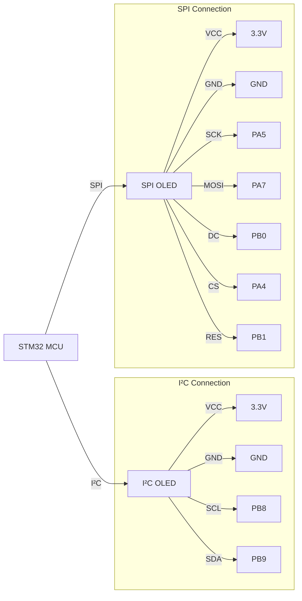

# STM32 OLED Displays

## Introduction

OLED (Organic Light-Emitting Diode) displays are popular components in embedded systems due to their high contrast, wide viewing angles, and low power consumption. In this tutorial, we'll learn how to interface OLED displays with STM32 microcontrollers to create vibrant visual outputs for your embedded projects.

Unlike traditional LCD displays, OLEDs emit their own light, eliminating the need for backlighting. This makes them perfect for battery-powered projects where power efficiency is crucial. The most common OLED displays used with STM32 microcontrollers are monochrome displays with resolution ranging from 64×32 to 128×64 pixels.

## Prerequisites

Before we begin, make sure you have:

- Basic knowledge of STM32 microcontrollers
- Familiarity with STM32CubeIDE or your preferred STM32 development environment
- An STM32 development board (F4, F1, G0, etc.)
- An SSD1306 or SH1106-based OLED display (I²C or SPI)
- Jumper wires for connections

## Hardware Connection

### I²C Connection

Most OLED displays communicate via I²C or SPI protocols. Let's start with the more common I²C connection:

| OLED Pin | STM32 Pin | Description |
|----------|-----------|-------------|
| VCC      | 3.3V      | Power supply |
| GND      | GND       | Ground |
| SCL      | PB8       | I²C clock line (can vary) |
| SDA      | PB9       | I²C data line (can vary) |

### SPI Connection

For SPI-based OLED displays:

| OLED Pin | STM32 Pin | Description |
|----------|-----------|-------------|
| VCC      | 3.3V      | Power supply |
| GND      | GND       | Ground |
| SCK      | PA5       | SPI clock line (can vary) |
| MOSI     | PA7       | SPI data line (can vary) |
| DC       | PB0       | Data/Command control pin |
| CS       | PA4       | Chip Select pin |
| RES      | PB1       | Reset pin |

## Connection Diagram



## Software Setup

### Required Libraries

For this tutorial, we'll use a popular library for SSD1306 OLED displays by Olivier Van den Eede. You can find it on GitHub or download it directly from this tutorial. The library provides a simple API to control OLED displays with STM32 microcontrollers.

To implement our OLED graphics, we'll need these files:
- `ssd1306.h` and `ssd1306.c` - Main driver files
- `fonts.h` and `fonts.c` - Font definitions for text display

### STM32CubeIDE Configuration

1. Create a new STM32 project or use an existing one
2. Configure the I²C or SPI peripheral in the `.ioc` file:

For I²C:
- Enable I²C1 in I²C mode
- Set the speed to standard (100 kHz) or fast (400 kHz)
- Generate the code

For SPI:
- Enable SPI1 in transmit-only master mode
- Configure GPIO pins for DC, CS, and RES as output
- Generate the code

## Basic Implementation

### Initializing the Display

Let's start with a simple example to initialize and clear the display:

```c
#include "main.h"
#include "ssd1306.h"

I2C_HandleTypeDef hi2c1;  // I²C handle (if using I²C)
SPI_HandleTypeDef hspi1;  // SPI handle (if using SPI)

int main(void)
{
  /* MCU Configuration */
  HAL_Init();
  SystemClock_Config();
  
  /* Initialize all configured peripherals */
  MX_GPIO_Init();
  MX_I2C1_Init();  // or MX_SPI1_Init() for SPI
  
  /* Initialize OLED display */
  SSD1306_Init();
  
  /* Clear buffer and display */
  SSD1306_Fill(0);
  SSD1306_UpdateScreen();
  
  /* Infinite loop */
  while (1)
  {
    HAL_Delay(1000);
  }
}
```

### Displaying Text

Now, let's display some text on our OLED:

```c
/* Display some text */
SSD1306_GotoXY(0, 0);
SSD1306_Puts("STM32", &Font_11x18, 1);
SSD1306_GotoXY(0, 30);
SSD1306_Puts("OLED Test", &Font_7x10, 1);
SSD1306_UpdateScreen();
```

### Drawing Shapes

Let's draw some basic shapes on the display:

```c
/* Draw rectangle */
SSD1306_DrawRectangle(5, 35, 123, 63, 1);

/* Draw filled rectangle */
SSD1306_DrawFilledRectangle(10, 40, 30, 60, 1);

/* Draw circle */
SSD1306_DrawCircle(80, 50, 10, 1);

/* Draw line */
SSD1306_DrawLine(40, 40, 100, 60, 1);

/* Update display */
SSD1306_UpdateScreen();
```

## Advanced Features

### Creating Custom Graphics

For custom graphics, you can create bitmap arrays in your code:

```c
// Define a small 8x8 pixel bitmap (heart shape)
static const uint8_t heart_bitmap[] = {
  0b00100100,
  0b01111110,
  0b11111111,
  0b11111111,
  0b01111110,
  0b00111100,
  0b00011000,
  0b00000000
};

// Later in your code, display the bitmap:
SSD1306_DrawBitmap(60, 20, heart_bitmap, 8, 8, 1);
SSD1306_UpdateScreen();
```

### Animation

You can create simple animations by updating the display in a loop:

```c
uint8_t x = 0;

while (1)
{
  SSD1306_Fill(0);  // Clear display
  
  // Draw a moving circle
  SSD1306_DrawCircle(x, 32, 8, 1);
  
  SSD1306_UpdateScreen();
  
  x = (x + 1) % 128;  // Move circle position
  
  HAL_Delay(10);  // Control animation speed
}
```

### Complete Demo Example

Here's a complete example that demonstrates text, shapes, and animations:

```c
#include "main.h"
#include "ssd1306.h"
#include "fonts.h"
#include <stdio.h>

I2C_HandleTypeDef hi2c1;

void SystemClock_Config(void);
static void MX_GPIO_Init(void);
static void MX_I2C1_Init(void);

int main(void)
{
  /* Initialize HAL */
  HAL_Init();
  SystemClock_Config();
  MX_GPIO_Init();
  MX_I2C1_Init();
  
  /* Initialize OLED */
  SSD1306_Init();
  
  /* Welcome screen */
  SSD1306_Fill(0);
  SSD1306_GotoXY(0, 0);
  SSD1306_Puts("STM32", &Font_11x18, 1);
  SSD1306_GotoXY(0, 25);
  SSD1306_Puts("OLED Demo", &Font_7x10, 1);
  SSD1306_GotoXY(0, 45);
  SSD1306_Puts("Starting...", &Font_7x10, 1);
  SSD1306_UpdateScreen();
  
  HAL_Delay(2000);
  
  uint8_t x = 0;
  char temp_str[20];
  
  /* Main loop */
  while (1)
  {
    /* Clear display */
    SSD1306_Fill(0);
    
    /* Display counter */
    sprintf(temp_str, "Count: %d", x);
    SSD1306_GotoXY(0, 0);
    SSD1306_Puts(temp_str, &Font_7x10, 1);
    
    /* Draw rectangle that moves */
    SSD1306_DrawRectangle(x, 20, x+20, 40, 1);
    
    /* Draw line */
    SSD1306_DrawLine(0, 50, 127, 50, 1);
    
    /* Draw text at the bottom */
    SSD1306_GotoXY(0, 52);
    SSD1306_Puts("STM32 OLED", &Font_7x10, 1);
    
    /* Update display */
    SSD1306_UpdateScreen();
    
    /* Increment counter */
    x++;
    if (x > 107) x = 0;
    
    /* Small delay */
    HAL_Delay(50);
  }
}

/* Clock configuration function */
void SystemClock_Config(void)
{
  // Clock configuration code (generated by CubeMX)
}

/* GPIO initialization function */
static void MX_GPIO_Init(void)
{
  // GPIO initialization code (generated by CubeMX)
}

/* I2C initialization function */
static void MX_I2C1_Init(void)
{
  hi2c1.Instance = I2C1;
  hi2c1.Init.ClockSpeed = 400000;
  hi2c1.Init.DutyCycle = I2C_DUTYCYCLE_2;
  hi2c1.Init.OwnAddress1 = 0;
  hi2c1.Init.AddressingMode = I2C_ADDRESSINGMODE_7BIT;
  hi2c1.Init.DualAddressMode = I2C_DUALADDRESS_DISABLE;
  hi2c1.Init.OwnAddress2 = 0;
  hi2c1.Init.GeneralCallMode = I2C_GENERALCALL_DISABLE;
  hi2c1.Init.NoStretchMode = I2C_NOSTRETCH_DISABLE;
  
  if (HAL_I2C_Init(&hi2c1) != HAL_OK)
  {
    Error_Handler();
  }
}
```

## Building a Custom Graphics Library

For more complex projects, you might want to build a higher-level graphics library on top of the basic OLED driver. Here's a simple example of a menu system:

```c
typedef struct {
  char* title;
  void (*function)(void);
} MenuItem;

MenuItem menu[] = {
  {"Temperature", show_temperature},
  {"Settings", show_settings},
  {"About", show_about},
  {"Exit", NULL}
};

uint8_t current_item = 0;
uint8_t item_count = 4;

void display_menu(void) {
  SSD1306_Fill(0);
  
  SSD1306_GotoXY(0, 0);
  SSD1306_Puts("MAIN MENU", &Font_7x10, 1);
  
  for (uint8_t i = 0; i < item_count; i++) {
    if (i == current_item) {
      // Highlight selected item
      SSD1306_DrawFilledRectangle(0, 12 + i*10, 127, 12 + (i+1)*10, 1);
      SSD1306_GotoXY(5, 13 + i*10);
      SSD1306_Puts(menu[i].title, &Font_7x10, 0); // Inverted colors
    } else {
      SSD1306_GotoXY(5, 13 + i*10);
      SSD1306_Puts(menu[i].title, &Font_7x10, 1);
    }
  }
  
  SSD1306_UpdateScreen();
}

void process_button_press(Button_t button) {
  switch (button) {
    case BUTTON_UP:
      if (current_item > 0) current_item--;
      break;
    case BUTTON_DOWN:
      if (current_item < item_count - 1) current_item++;
      break;
    case BUTTON_SELECT:
      if (menu[current_item].function != NULL) {
        menu[current_item].function();
      }
      break;
    default:
      break;
  }
  
  display_menu();
}
```

## Real-World Applications

### Weather Station Display

OLED displays are perfect for small weather stations. Here's a simple example:

```c
void display_weather(float temperature, float humidity, float pressure) {
  char temp_str[20];
  
  SSD1306_Fill(0);
  
  // Title
  SSD1306_GotoXY(0, 0);
  SSD1306_Puts("Weather Station", &Font_7x10, 1);
  
  // Temperature
  sprintf(temp_str, "Temp: %.1f C", temperature);
  SSD1306_GotoXY(0, 15);
  SSD1306_Puts(temp_str, &Font_7x10, 1);
  
  // Humidity
  sprintf(temp_str, "Hum: %.1f %%", humidity);
  SSD1306_GotoXY(0, 30);
  SSD1306_Puts(temp_str, &Font_7x10, 1);
  
  // Pressure
  sprintf(temp_str, "Press: %.1f hPa", pressure);
  SSD1306_GotoXY(0, 45);
  SSD1306_Puts(temp_str, &Font_7x10, 1);
  
  SSD1306_UpdateScreen();
}
```

### Digital Clock

Create a simple digital clock:

```c
void update_clock(uint8_t hours, uint8_t minutes, uint8_t seconds) {
  char time_str[10];
  static uint8_t last_seconds = 0;
  
  // Only update when seconds change to avoid flickering
  if (seconds == last_seconds) return;
  last_seconds = seconds;
  
  SSD1306_Fill(0);
  
  // Display time in large font
  sprintf(time_str, "%02d:%02d:%02d", hours, minutes, seconds);
  SSD1306_GotoXY(10, 20);
  SSD1306_Puts(time_str, &Font_11x18, 1);
  
  // Display date
  SSD1306_GotoXY(25, 0);
  SSD1306_Puts("2025-03-12", &Font_7x10, 1);
  
  SSD1306_UpdateScreen();
}
```

### System Monitor

For an embedded system monitor:

```c
void display_system_status(uint32_t cpu_load, uint32_t memory_used, uint32_t uptime) {
  char status_str[20];
  
  SSD1306_Fill(0);
  
  // Title
  SSD1306_GotoXY(0, 0);
  SSD1306_Puts("System Monitor", &Font_7x10, 1);
  
  // CPU load with bar graph
  sprintf(status_str, "CPU: %d%%", cpu_load);
  SSD1306_GotoXY(0, 15);
  SSD1306_Puts(status_str, &Font_7x10, 1);
  SSD1306_DrawRectangle(60, 16, 127, 24, 1);
  SSD1306_DrawFilledRectangle(60, 16, 60 + (cpu_load * 67 / 100), 24, 1);
  
  // Memory used
  sprintf(status_str, "MEM: %d KB", memory_used);
  SSD1306_GotoXY(0, 30);
  SSD1306_Puts(status_str, &Font_7x10, 1);
  
  // Uptime in hours:minutes
  sprintf(status_str, "Uptime: %d:%02d", uptime / 3600, (uptime % 3600) / 60);
  SSD1306_GotoXY(0, 45);
  SSD1306_Puts(status_str, &Font_7x10, 1);
  
  SSD1306_UpdateScreen();
}
```

## Performance Optimization

Working with OLED displays on resource-constrained microcontrollers requires careful optimization:

1. **Buffer Updates**: Instead of calling `SSD1306_UpdateScreen()` after each drawing operation, batch your operations and update once.

2. **Partial Updates**: Modify the library to support partial updates of the display buffer to reduce I²C/SPI traffic.

3. **Font Selection**: Smaller fonts use less memory and render faster.

4. **Use Fast Drawing Algorithms**: Implement optimized versions of drawing functions for frequently used shapes.

5. **DMA Transfers**: For SPI displays, configure DMA for display updates to free up the CPU for other tasks.

## Troubleshooting Common Issues

### Display Not Working

If your display is not working:

1. **Check Connections**: Verify all wiring between the STM32 and OLED display.
2. **Check Power**: Ensure the display is receiving 3.3V power.
3. **I²C Address**: Some OLED displays use 0x3C instead of 0x78. Modify the address in the library if needed.
4. **Initialize I²C/SPI**: Make sure peripherals are properly initialized before the display.
5. **Reset Sequence**: Implement a proper reset sequence before initialization.

### Display Shows Garbage

If your display shows random pixels:

1. **Buffer Size**: Ensure the buffer size in the library matches your display resolution.
2. **Initialization**: Check initialization parameters match your specific OLED type.
3. **Memory Corruption**: Look for buffer overflows in your drawing functions.

## Summary

In this tutorial, we've explored working with OLED displays using STM32 microcontrollers. We've covered:

- Basic hardware connections for both I²C and SPI OLED displays
- Software initialization and configuration
- Drawing text, shapes, and custom graphics
- Creating animations and interactive interfaces
- Real-world applications like weather stations and system monitors
- Performance optimization tips
- Troubleshooting common issues

OLED displays are versatile components that can greatly enhance your embedded projects by providing clear visual feedback and user interfaces. With the knowledge gained from this tutorial, you can now integrate these displays into your own STM32 projects.

## Exercises

To practice what you've learned:

1. Create a simple digital watch with date and time display
2. Build a menu system with navigation using external buttons
3. Implement a simple game like Pong or Snake using the OLED display
4. Design a data logger that displays temperature readings in both text and graph form
5. Create a system monitor for your STM32 showing CPU usage, memory, and GPIO states

## Additional Resources

- SSD1306 Display Datasheet
- STM32 HAL Documentation
- Advanced Graphics Algorithms for Embedded Systems
- GitHub repositories with OLED libraries for STM32