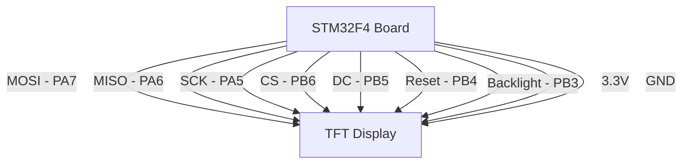

# STM32 TFT Displays

## Introduction

TFT (Thin-Film Transistor) displays are color LCD modules that provide a powerful way to add graphical interfaces to your STM32 projects. These displays use active matrix technology where each pixel is controlled by one to four transistors, allowing for vibrant colors and faster refresh rates compared to traditional LCDs.

In this tutorial, we'll explore how to connect, configure, and program TFT displays with STM32 microcontrollers. Whether you're building a smart thermostat, an oscilloscope, or just want to add a graphical interface to your project, TFT displays offer an accessible and powerful solution.

## Understanding TFT Displays

Before diving into code, let's understand the key components and technologies behind TFT displays:

### Types of TFT Displays Compatible with STM32

1. **SPI TFT Displays**: These communicate via the Serial Peripheral Interface protocol. They're slower but require fewer pins.
2. **Parallel TFT Displays**: These use 8-bit or 16-bit parallel interfaces for faster data transfer but require more GPIO pins.
3. **RGB TFT Displays**: These connect directly to dedicated LCD controllers in advanced STM32 chips.

### Common Controllers

The most popular TFT display controllers used with STM32 include:

- ILI9341: 2.8" to 3.2" displays, 240×320 resolution
- ST7735: 1.8" displays, 128×160 resolution
- SSD1306: Small OLED displays
- ILI9488: Larger 3.5" to 4" displays

### Key Specifications

When selecting a TFT display, consider these specifications:

- **Resolution**: Typically ranges from 128×160 for small displays to 480×800 for larger ones
- **Color Depth**: From 16-bit (65K colors) to 24-bit (16M colors)
- **Interface**: SPI, parallel, RGB, etc.
- **Size**: From 1.8" to 7" or larger
- **Touch Support**: Resistive or capacitive touch options

## Hardware Setup

### Basic SPI Connection

Here's how to connect a typical SPI TFT display (like ILI9341) to an STM32F4 Discovery board:



### Component List

- STM32 development board (STM32F4 Discovery recommended for beginners)
- TFT display module (ILI9341-based 2.8" or ST7735-based 1.8" are good options)
- Jumper wires
- Breadboard (optional)
- 3.3V power supply

## Software Configuration

### Setting Up the Project with STM32CubeIDE

1. Create a new STM32 project for your specific board
2. Configure the SPI peripheral (we'll use SPI1):
   - Set Mode to Full-Duplex Master
   - Set Hardware NSS Signal to Disabled
   - Set Data Size to 8 bits
   - Set First Bit to MSB
   - Clock Polarity (CPOL) and Clock Phase (CPHA) depend on your display (Usually CPOL=1, CPHA=1 for ILI9341)

3. Configure GPIO pins for CS, DC, Reset, and Backlight as output pins
4. Enable any necessary DMA channels for smooth graphics rendering

### Basic Driver Structure

Let's create a basic driver structure for an ILI9341 display:

```c
/* tft_display.h */
#ifndef TFT_DISPLAY_H
#define TFT_DISPLAY_H

#include "main.h"

// Display dimensions
#define TFT_WIDTH  240
#define TFT_HEIGHT 320

// Colors (RGB565 format)
#define BLACK   0x0000
#define BLUE    0x001F
#define RED     0xF800
#define GREEN   0x07E0
#define CYAN    0x07FF
#define MAGENTA 0xF81F
#define YELLOW  0xFFE0
#define WHITE   0xFFFF

// ILI9341 Commands
#define ILI9341_RESET         0x01
#define ILI9341_SLEEP_OUT     0x11
#define ILI9341_DISPLAY_ON    0x29
#define ILI9341_COLUMN_ADDR   0x2A
#define ILI9341_PAGE_ADDR     0x2B
#define ILI9341_GRAM          0x2C
#define ILI9341_MAC           0x36
#define ILI9341_PIXEL_FORMAT  0x3A

// Function declarations
void TFT_Init(void);
void TFT_SetRotation(uint8_t r);
void TFT_FillScreen(uint16_t color);
void TFT_DrawPixel(uint16_t x, uint16_t y, uint16_t color);
void TFT_DrawLine(uint16_t x0, uint16_t y0, uint16_t x1, uint16_t y1, uint16_t color);
void TFT_DrawRectangle(uint16_t x, uint16_t y, uint16_t w, uint16_t h, uint16_t color);
void TFT_DrawFilledRectangle(uint16_t x, uint16_t y, uint16_t w, uint16_t h, uint16_t color);
void TFT_DrawCircle(uint16_t x0, uint16_t y0, uint16_t r, uint16_t color);
void TFT_DrawFilledCircle(uint16_t x0, uint16_t y0, uint16_t r, uint16_t color);
void TFT_DrawChar(uint16_t x, uint16_t y, char ch, uint16_t color, uint16_t bg, uint8_t size);
void TFT_DrawText(uint16_t x, uint16_t y, const char *text, uint16_t color, uint16_t bg, uint8_t size);
void TFT_DrawImage(uint16_t x, uint16_t y, uint16_t w, uint16_t h, const uint16_t* data);

#endif /* TFT_DISPLAY_H */
```

## Implementation Details

### Initializing the Display

Here's how to implement the initialization function:

```c
/* tft_display.c */
#include "tft_display.h"

// Define GPIO and SPI handles
extern SPI_HandleTypeDef hspi1;
#define TFT_SPI hspi1

#define TFT_CS_PIN  GPIO_PIN_6
#define TFT_CS_PORT GPIOB
#define TFT_DC_PIN  GPIO_PIN_5
#define TFT_DC_PORT GPIOB
#define TFT_RST_PIN GPIO_PIN_4
#define TFT_RST_PORT GPIOB
#define TFT_BL_PIN  GPIO_PIN_3
#define TFT_BL_PORT GPIOB

// Helper functions
static void TFT_Select(void) {
    HAL_GPIO_WritePin(TFT_CS_PORT, TFT_CS_PIN, GPIO_PIN_RESET);
}

static void TFT_Unselect(void) {
    HAL_GPIO_WritePin(TFT_CS_PORT, TFT_CS_PIN, GPIO_PIN_SET);
}

static void TFT_SendCommand(uint8_t cmd) {
    HAL_GPIO_WritePin(TFT_DC_PORT, TFT_DC_PIN, GPIO_PIN_RESET); // Command mode
    TFT_Select();
    HAL_SPI_Transmit(&TFT_SPI, &cmd, 1, HAL_MAX_DELAY);
    TFT_Unselect();
}

static void TFT_SendData(uint8_t data) {
    HAL_GPIO_WritePin(TFT_DC_PORT, TFT_DC_PIN, GPIO_PIN_SET); // Data mode
    TFT_Select();
    HAL_SPI_Transmit(&TFT_SPI, &data, 1, HAL_MAX_DELAY);
    TFT_Unselect();
}

static void TFT_SendDataMultiple(uint8_t *data, uint16_t size) {
    HAL_GPIO_WritePin(TFT_DC_PORT, TFT_DC_PIN, GPIO_PIN_SET); // Data mode
    TFT_Select();
    HAL_SPI_Transmit(&TFT_SPI, data, size, HAL_MAX_DELAY);
    TFT_Unselect();
}

static void TFT_Reset(void) {
    HAL_GPIO_WritePin(TFT_RST_PORT, TFT_RST_PIN, GPIO_PIN_RESET);
    HAL_Delay(10);
    HAL_GPIO_WritePin(TFT_RST_PORT, TFT_RST_PIN, GPIO_PIN_SET);
    HAL_Delay(120);
}

void TFT_Init(void) {
    // Initialize GPIO pins
    HAL_GPIO_WritePin(TFT_CS_PORT, TFT_CS_PIN, GPIO_PIN_SET);
    HAL_GPIO_WritePin(TFT_DC_PORT, TFT_DC_PIN, GPIO_PIN_SET);
    HAL_GPIO_WritePin(TFT_RST_PORT, TFT_RST_PIN, GPIO_PIN_SET);
    HAL_GPIO_WritePin(TFT_BL_PORT, TFT_BL_PIN, GPIO_PIN_SET);
    
    // Reset the display
    TFT_Reset();
    
    // Initialize the display with configuration commands
    TFT_SendCommand(0xEF);
    TFT_SendData(0x03);
    TFT_SendData(0x80);
    TFT_SendData(0x02);
    
    TFT_SendCommand(0xCF);
    TFT_SendData(0x00);
    TFT_SendData(0XC1);
    TFT_SendData(0X30);
    
    TFT_SendCommand(0xED);
    TFT_SendData(0x64);
    TFT_SendData(0x03);
    TFT_SendData(0X12);
    TFT_SendData(0X81);
    
    TFT_SendCommand(0xE8);
    TFT_SendData(0x85);
    TFT_SendData(0x00);
    TFT_SendData(0x78);
    
    TFT_SendCommand(0xCB);
    TFT_SendData(0x39);
    TFT_SendData(0x2C);
    TFT_SendData(0x00);
    TFT_SendData(0x34);
    TFT_SendData(0x02);
    
    TFT_SendCommand(0xF7);
    TFT_SendData(0x20);
    
    TFT_SendCommand(0xEA);
    TFT_SendData(0x00);
    TFT_SendData(0x00);
    
    // Power Control
    TFT_SendCommand(0xC0);  // Power Control 1
    TFT_SendData(0x23);
    
    TFT_SendCommand(0xC1);  // Power Control 2
    TFT_SendData(0x10);
    
    // VCOM
    TFT_SendCommand(0xC5);  // VCOM Control 1
    TFT_SendData(0x3e);
    TFT_SendData(0x28);
    
    TFT_SendCommand(0xC7);  // VCOM Control 2
    TFT_SendData(0x86);
    
    // Memory Access Control
    TFT_SendCommand(ILI9341_MAC);
    TFT_SendData(0x48);  // Default orientation
    
    // Pixel Format Set
    TFT_SendCommand(ILI9341_PIXEL_FORMAT);
    TFT_SendData(0x55); // 16-bit per pixel
    
    // Frame Rate Control
    TFT_SendCommand(0xB1);
    TFT_SendData(0x00);
    TFT_SendData(0x18);
    
    // Display Function Control
    TFT_SendCommand(0xB6);
    TFT_SendData(0x08);
    TFT_SendData(0x82);
    TFT_SendData(0x27);
    
    // 3Gamma Function Disable
    TFT_SendCommand(0xF2);
    TFT_SendData(0x00);
    
    // Gamma curve selected
    TFT_SendCommand(0x26);
    TFT_SendData(0x01);
    
    // Set Gamma
    TFT_SendCommand(0xE0);
    TFT_SendData(0x0F);
    TFT_SendData(0x31);
    TFT_SendData(0x2B);
    TFT_SendData(0x0C);
    TFT_SendData(0x0E);
    TFT_SendData(0x08);
    TFT_SendData(0x4E);
    TFT_SendData(0xF1);
    TFT_SendData(0x37);
    TFT_SendData(0x07);
    TFT_SendData(0x10);
    TFT_SendData(0x03);
    TFT_SendData(0x0E);
    TFT_SendData(0x09);
    TFT_SendData(0x00);
    
    TFT_SendCommand(0xE1);
    TFT_SendData(0x00);
    TFT_SendData(0x0E);
    TFT_SendData(0x14);
    TFT_SendData(0x03);
    TFT_SendData(0x11);
    TFT_SendData(0x07);
    TFT_SendData(0x31);
    TFT_SendData(0xC1);
    TFT_SendData(0x48);
    TFT_SendData(0x08);
    TFT_SendData(0x0F);
    TFT_SendData(0x0C);
    TFT_SendData(0x31);
    TFT_SendData(0x36);
    TFT_SendData(0x0F);
    
    // Exit Sleep
    TFT_SendCommand(ILI9341_SLEEP_OUT);
    HAL_Delay(120);
    
    // Display on
    TFT_SendCommand(ILI9341_DISPLAY_ON);
    
    // Turn on the backlight
    HAL_GPIO_WritePin(TFT_BL_PORT, TFT_BL_PIN, GPIO_PIN_SET);
    
    // Set default orientation
    TFT_SetRotation(0);
    
    // Clear the screen
    TFT_FillScreen(BLACK);
}
```

### Drawing Basic Shapes

Let's implement basic drawing functions:

```c
void TFT_SetAddressWindow(uint16_t x0, uint16_t y0, uint16_t x1, uint16_t y1) {
    // Column address set
    TFT_SendCommand(ILI9341_COLUMN_ADDR);
    TFT_SendData(x0 >> 8);
    TFT_SendData(x0 & 0xFF);
    TFT_SendData(x1 >> 8);
    TFT_SendData(x1 & 0xFF);

    // Page address set
    TFT_SendCommand(ILI9341_PAGE_ADDR);
    TFT_SendData(y0 >> 8);
    TFT_SendData(y0 & 0xFF);
    TFT_SendData(y1 >> 8);
    TFT_SendData(y1 & 0xFF);

    // Memory write
    TFT_SendCommand(ILI9341_GRAM);
}

void TFT_FillScreen(uint16_t color) {
    TFT_DrawFilledRectangle(0, 0, TFT_WIDTH, TFT_HEIGHT, color);
}

void TFT_DrawPixel(uint16_t x, uint16_t y, uint16_t color) {
    if(x >= TFT_WIDTH || y >= TFT_HEIGHT) return;
    
    TFT_SetAddressWindow(x, y, x, y);
    
    uint8_t data[2];
    data[0] = color >> 8;
    data[1] = color & 0xFF;
    
    HAL_GPIO_WritePin(TFT_DC_PORT, TFT_DC_PIN, GPIO_PIN_SET);
    TFT_Select();
    HAL_SPI_Transmit(&TFT_SPI, data, 2, HAL_MAX_DELAY);
    TFT_Unselect();
}

void TFT_DrawFilledRectangle(uint16_t x, uint16_t y, uint16_t w, uint16_t h, uint16_t color) {
    // Clipping
    if(x >= TFT_WIDTH || y >= TFT_HEIGHT) return;
    if((x + w - 1) >= TFT_WIDTH) w = TFT_WIDTH - x;
    if((y + h - 1) >= TFT_HEIGHT) h = TFT_HEIGHT - y;
    
    TFT_SetAddressWindow(x, y, x + w - 1, y + h - 1);
    
    uint8_t data[2];
    data[0] = color >> 8;
    data[1] = color & 0xFF;
    
    HAL_GPIO_WritePin(TFT_DC_PORT, TFT_DC_PIN, GPIO_PIN_SET);
    TFT_Select();
    
    // Fill with color data
    for(uint32_t i = 0; i < w * h; i++) {
        HAL_SPI_Transmit(&TFT_SPI, data, 2, HAL_MAX_DELAY);
    }
    
    TFT_Unselect();
}
```

### Setting Rotation

```c
void TFT_SetRotation(uint8_t r) {
    TFT_SendCommand(ILI9341_MAC);
    switch(r) {
        case 0:
            TFT_SendData(0x48); // Portrait
            break;
        case 1:
            TFT_SendData(0x28); // Landscape
            break;
        case 2:
            TFT_SendData(0x88); // Portrait flipped
            break;
        case 3:
            TFT_SendData(0xE8); // Landscape flipped
            break;
    }
}
```

## Drawing Text and Images

Text rendering requires a font, so let's define a simple font and implement text drawing:

```c
// Include a simple 5x7 font
#include "font5x7.h"

void TFT_DrawChar(uint16_t x, uint16_t y, char ch, uint16_t color, uint16_t bg, uint8_t size) {
    if(x >= TFT_WIDTH || y >= TFT_HEIGHT) return;
    
    // ASCII offset
    if(ch < ' ') ch = ' ';
    else if(ch > '~') ch = '~';
    ch -= ' ';
    
    for(int8_t i = 0; i < 5; i++) {
        uint8_t line = font5x7[ch * 5 + i];
        
        for(int8_t j = 0; j < 8; j++) {
            if(line & 0x01) {
                if(size == 1)
                    TFT_DrawPixel(x + i, y + j, color);
                else
                    TFT_DrawFilledRectangle(x + i*size, y + j*size, size, size, color);
            }
            else if(bg != color) {
                if(size == 1)
                    TFT_DrawPixel(x + i, y + j, bg);
                else
                    TFT_DrawFilledRectangle(x + i*size, y + j*size, size, size, bg);
            }
            line >>= 1;
        }
    }
}

void TFT_DrawText(uint16_t x, uint16_t y, const char *text, uint16_t color, uint16_t bg, uint8_t size) {
    while(*text) {
        TFT_DrawChar(x, y, *text++, color, bg, size);
        x += 6 * size; // 5 pixel wide font + 1 pixel space
        
        if(x > TFT_WIDTH - 6*size) {
            x = 0;
            y += 8*size; // 7 pixel height + 1 pixel space
        }
    }
}
```

## Practical Examples

### Example 1: Simple Digital Thermometer

Let's create a simple temperature display using an STM32 with a TFT display and a temperature sensor:

```c
#include "main.h"
#include "tft_display.h"
#include <stdio.h>

extern ADC_HandleTypeDef hadc1;  // ADC for temperature sensor

int main(void) {
    // Initialize system
    HAL_Init();
    SystemClock_Config();
    
    // Initialize peripherals
    MX_GPIO_Init();
    MX_SPI1_Init();
    MX_ADC1_Init();
    
    // Initialize display
    TFT_Init();
    
    // Display title
    TFT_FillScreen(BLACK);
    TFT_DrawText(20, 20, "STM32 Thermometer", WHITE, BLACK, 2);
    TFT_DrawLine(20, 50, 220, 50, WHITE);
    
    char buffer[20];
    float temperature;
    uint32_t adcValue;
    
    while (1) {
        // Read temperature from ADC
        HAL_ADC_Start(&hadc1);
        HAL_ADC_PollForConversion(&hadc1, 100);
        adcValue = HAL_ADC_GetValue(&hadc1);
        
        // Convert ADC value to temperature (°C)
        // This calculation depends on your specific sensor
        temperature = (adcValue * 3.3 / 4096.0 - 0.76) / 0.0025 + 25.0;
        
        // Format temperature string
        sprintf(buffer, "Temp: %.1f C", temperature);
        
        // Update display
        TFT_DrawFilledRectangle(60, 100, 150, 30, BLACK);
        TFT_DrawText(60, 100, buffer, WHITE, BLACK, 2);
        
        // Draw temperature trend indicator
        static float lastTemp = 0;
        if(lastTemp > 0) {
            if(temperature > lastTemp) {
                TFT_DrawText(180, 100, "↑", RED, BLACK, 2);
            } else if(temperature < lastTemp) {
                TFT_DrawText(180, 100, "↓", BLUE, BLACK, 2);
            } else {
                TFT_DrawText(180, 100, "→", GREEN, BLACK, 2);
            }
        }
        lastTemp = temperature;
        
        // Update every second
        HAL_Delay(1000);
    }
}
```

### Example 2: Simple Digital Clock

Here's a basic digital clock implementation:

```c
#include "main.h"
#include "tft_display.h"
#include <stdio.h>

extern RTC_HandleTypeDef hrtc;  // RTC for time

int main(void) {
    // Initialize system
    HAL_Init();
    SystemClock_Config();
    
    // Initialize peripherals
    MX_GPIO_Init();
    MX_SPI1_Init();
    MX_RTC_Init();
    
    // Initialize display
    TFT_Init();
    
    // Display title
    TFT_FillScreen(BLUE);
    TFT_DrawFilledRectangle(20, 20, 200, 40, NAVY);
    TFT_DrawText(55, 30, "Digital Clock", WHITE, NAVY, 2);
    
    char timeStr[20];
    char dateStr[20];
    RTC_TimeTypeDef sTime;
    RTC_DateTypeDef sDate;
    
    while (1) {
        // Get current time and date
        HAL_RTC_GetTime(&hrtc, &sTime, RTC_FORMAT_BIN);
        HAL_RTC_GetDate(&hrtc, &sDate, RTC_FORMAT_BIN);
        
        // Format time string
        sprintf(timeStr, "%02d:%02d:%02d", sTime.Hours, sTime.Minutes, sTime.Seconds);
        
        // Format date string
        sprintf(dateStr, "%02d/%02d/20%02d", sDate.Date, sDate.Month, sDate.Year);
        
        // Draw time in large format
        static char lastTimeStr[20] = "";
        if(strcmp(timeStr, lastTimeStr) != 0) {
            TFT_DrawFilledRectangle(40, 80, 160, 60, BLACK);
            TFT_DrawText(40, 100, timeStr, WHITE, BLACK, 3);
            strcpy(lastTimeStr, timeStr);
        }
        
        // Draw date
        TFT_DrawFilledRectangle(70, 160, 100, 30, BLACK);
        TFT_DrawText(70, 170, dateStr, YELLOW, BLACK, 1);
        
        // Update every 100ms
        HAL_Delay(100);
    }
}
```

## Using Graphics Libraries

For more complex graphics, consider using a graphics library like µGFX, LVGL, or EmWin. These provide advanced features like widgets, touch support, and animations.

### LVGL Example (Setup Only)

Here's how to set up LVGL with STM32:

```c
// LVGL configuration example

// 1. Include necessary headers
#include "lvgl/lvgl.h"
#include "tft_display.h"

// 2. Define display buffer
static lv_disp_buf_t disp_buf;
static lv_color_t buf[LV_HOR_RES_MAX * 10]; // Horizontal resolution * 10 lines

// 3. Implement display driver callback
static void my_disp_flush(lv_disp_drv_t *disp, const lv_area_t *area, lv_color_t *color_p) {
    int32_t x, y;
    
    // Set the drawing window
    TFT_SetAddressWindow(area->x1, area->y1, area->x2, area->y2);
    
    // Convert LVGL color format to display format
    uint16_t* buffer_16bit = (uint16_t*)color_p;
    
    HAL_GPIO_WritePin(TFT_DC_PORT, TFT_DC_PIN, GPIO_PIN_SET);
    TFT_Select();
    
    // Send color data
    for(y = area->y1; y <= area->y2; y++) {
        for(x = area->x1; x <= area->x2; x++) {
            // Send the data
            HAL_SPI_Transmit(&TFT_SPI, (uint8_t*)buffer_16bit, 2, HAL_MAX_DELAY);
            buffer_16bit++;
        }
    }
    
    TFT_Unselect();
    
    // Indicate to LVGL that you are ready with flushing
    lv_disp_flush_ready(disp);
}

// 4. Initialize LVGL
void LVGL_Init(void) {
    lv_init();
    
    // Initialize display buffer
    lv_disp_buf_init(&disp_buf, buf, NULL, LV_HOR_RES_MAX * 10);
    
    // Register display driver
    lv_disp_drv_t disp_drv;
    lv_disp_drv_init(&disp_drv);
    disp_drv.flush_cb = my_disp_flush;
    disp_drv.buffer = &disp_buf;
    lv_disp_drv_register(&disp_drv);
    
    // Create a sample button
    lv_obj_t* btn = lv_btn_create(lv_scr_act(), NULL);
    lv_obj_set_pos(btn, 10, 10);
    lv_obj_set_size(btn, 120, 50);
    
    // Add label to the button
    lv_obj_t* label = lv_label_create(btn, NULL);
    lv_label_set_text(label, "Button");
}
```

## Performance Optimization

Here are some tips for optimizing TFT display performance:

1. **Use DMA**: Direct Memory Access can significantly speed up SPI transfers:

```c
// Example of using DMA for faster data transfer
static void TFT_SendDataDMA(uint8_t* data, uint16_t size) {
    HAL_GPIO_WritePin(TFT_DC_PORT, TFT_DC_PIN, GPIO_PIN_SET); // Data mode
    TFT_Select();
    HAL_SPI_Transmit_DMA(&TFT_SPI, data, size);
    // Note: You'll need a callback to deselect CS when transfer completes
}

// In stm32xxxx_it.c
void DMA2_Stream3_IRQHandler(void) {
    HAL_DMA_IRQHandler(&hdma_spi1_tx);
}

// SPI TX Complete callback
void HAL_SPI_TxCpltCallback(SPI_HandleTypeDef *hspi) {
    if(hspi == &TFT_SPI) {
        TFT_Unselect();
    }
}
```

2. **Batch Updates**: Update larger regions at once rather than pixel by pixel.

3. **Double Buffering**: Draw to an off-screen buffer first, then transfer the entire screen.

## Debugging TFT Display Issues

Common issues and solutions:

1. **No Display Output**:
   - Check power connections
   - Verify SPI pin connections
   - Confirm correct initialization sequence
   - Check backlight