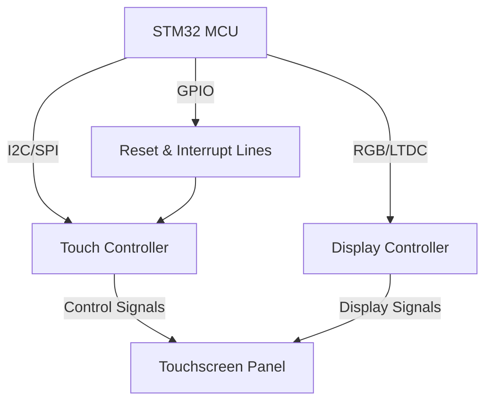

# STM32 TouchScreen Programming

## Introduction

Touchscreens have become an essential part of modern embedded systems, providing intuitive user interaction without the need for additional input devices. In this tutorial, we'll explore how to implement touchscreen functionality using STM32 microcontrollers. We'll cover everything from basic concepts to building complete interactive applications.

The STM32 family offers excellent support for touchscreen interfaces, making it possible to create sophisticated touch-based user interfaces even with limited resources. Whether you're building a smart thermostat, an industrial control panel, or any device requiring user interaction, this knowledge will be invaluable.

## Touchscreen Basics

### Types of Touchscreens

Before diving into implementation, let's understand the different types of touchscreens commonly used with STM32:

1. **Resistive Touchscreens**: 
   - Operate based on pressure
   - Can be used with any object (stylus, gloved finger)
   - Typically less expensive
   - Lower clarity but more durable

2. **Capacitive Touchscreens**:
   - Detect electrical properties of the human body
   - Offer better clarity and multi-touch support
   - Require a conductive object (usually a finger)
   - More common in modern applications

### Touchscreen Controller Communication

STM32 microcontrollers typically communicate with touchscreen controllers through one of these interfaces:

- **I2C**: Simple two-wire interface, good for basic touchscreens
- **SPI**: Faster than I2C, suitable for more responsive applications
- **UART**: Less common, but used in some configurations
- **Direct GPIO**: For simple resistive touchscreens with analog outputs

## Hardware Setup

### Components Needed

To follow this tutorial, you'll need:

- STM32 development board (such as STM32F429I-DISC1 which includes a touchscreen)
- Touchscreen display (if not included with your board)
- Touchscreen controller (often integrated with the display)
- Connecting cables and power supply

### Typical Connection Diagram



### Common Touch Controllers

STM32 boards are often paired with these popular touch controllers:

- STMPE811: I2C/SPI-based controller by ST
- FT5336: Capacitive touch controller (I2C)
- TSC2046: Resistive touch controller (SPI)

## Software Implementation

### Initializing the Touchscreen

Let's start with initializing a touchscreen using the STMPE811 controller via I2C:

```c
/* Include necessary headers */
#include "stm32f4xx_hal.h"
#include "stm32f4xx_hal_i2c.h"
#include "stm32_stmpe811.h"

/* I2C handle */
I2C_HandleTypeDef hi2c1;

/* Touch initialization function */
uint8_t BSP_TS_Init(uint16_t ts_SizeX, uint16_t ts_SizeY)
{
  uint8_t status = TS_OK;
  
  /* Initialize the I2C */
  /* Assuming I2C has been already initialized in the main program */
  
  /* Initialize the STMPE811 touch screen controller */
  if(stmpe811_ts_drv.Init(TS_I2C_ADDRESS) != STMPE811_OK)
  {
    status = TS_ERROR;
  }
  else
  {
    /* Store touchscreen information */
    ts_driver = &stmpe811_ts_drv;
    ts_x_size = ts_SizeX;
    ts_y_size = ts_SizeY;
  }
  
  return status;
}
```

### Reading Touch Points

After initialization, we can read the touch coordinates:

```c
/**
  * @brief  Get touch screen position
  * @param  pPositions: Pointer to touch position structure
  * @retval TS_OK if successful, TS_ERROR otherwise
  */
uint8_t BSP_TS_GetState(TS_StateTypeDef *pState)
{
  static uint32_t _x = 0, _y = 0;
  uint16_t xDiff, yDiff, x, y, xr, yr;
  uint16_t swap;
  
  pState->TouchDetected = ts_driver->DetectTouch();

  if(pState->TouchDetected)
  {
    ts_driver->GetXY(&x, &y);
    
    /* Y value first displays the position correspondingly to the screen orientation */
    /* Handle LCD and TS orientations */
    xr = x;
    yr = y;
    
    /* Apply calibration coefficients if necessary */
    x = (xr * ts_x_size) / 4096;
    y = (yr * ts_y_size) / 4096;
    
    /* Store values in state structure */
    pState->x = x;
    pState->y = y;
  }
  
  return TS_OK;
}
```

### Creating a Complete Touch Detection Loop

Here's how to implement a continuous touch detection loop:

```c
void TouchDetectionTask(void)
{
  TS_StateTypeDef ts_state;
  
  /* Initialize LCD and touchscreen */
  BSP_LCD_Init();
  BSP_TS_Init(BSP_LCD_GetXSize(), BSP_LCD_GetYSize());
  
  /* Initial display */
  BSP_LCD_Clear(LCD_COLOR_WHITE);
  BSP_LCD_SetTextColor(LCD_COLOR_BLUE);
  BSP_LCD_DisplayStringAt(0, 0, (uint8_t *)"Touch the screen", CENTER_MODE);
  
  while(1)
  {
    /* Check for touch */
    BSP_TS_GetState(&ts_state);
    
    if(ts_state.TouchDetected)
    {
      /* Draw a filled circle at touch point */
      BSP_LCD_SetTextColor(LCD_COLOR_RED);
      BSP_LCD_FillCircle(ts_state.x, ts_state.y, 5);
      
      /* Display coordinates */
      char coords[30];
      sprintf(coords, "X: %d, Y: %d", ts_state.x, ts_state.y);
      BSP_LCD_SetTextColor(LCD_COLOR_BLACK);
      BSP_LCD_DisplayStringAt(0, BSP_LCD_GetYSize() - 20, (uint8_t *)coords, CENTER_MODE);
      
      /* Small delay to avoid multiple detections */
      HAL_Delay(50);
    }
  }
}
```

## Touchscreen Calibration

Touchscreens often require calibration to accurately map raw touch coordinates to display coordinates.

### Why Calibration is Necessary

- Manufacturing variances in touchscreens
- Alignment differences between touch panel and display
- Different scaling factors between touch coordinates and pixels

### Simple Calibration Procedure

```c
typedef struct {
  float An;
  float Bn;
  float Cn;
  float Dn;
  float En;
  float Fn;
} TS_Calibration_t;

TS_Calibration_t calib;

void Calibrate_Touch(void)
{
  uint16_t x_points[3] = {20, BSP_LCD_GetXSize()/2, BSP_LCD_GetXSize() - 20};
  uint16_t y_points[3] = {20, BSP_LCD_GetYSize()/2, BSP_LCD_GetYSize() - 20};
  uint16_t raw_x[3], raw_y[3];
  
  BSP_LCD_Clear(LCD_COLOR_WHITE);
  
  /* Collect calibration points */
  for(int i = 0; i < 3; i++)
  {
    /* Draw calibration point */
    BSP_LCD_SetTextColor(LCD_COLOR_RED);
    BSP_LCD_FillCircle(x_points[i], y_points[i], 5);
    BSP_LCD_SetTextColor(LCD_COLOR_BLACK);
    BSP_LCD_DisplayStringAt(0, 0, (uint8_t *)"Touch the circle", CENTER_MODE);
    
    /* Wait for touch */
    TS_StateTypeDef ts_state;
    do {
      BSP_TS_GetState(&ts_state);
    } while(!ts_state.TouchDetected);
    
    /* Record raw coordinates */
    raw_x[i] = ts_state.raw_x;
    raw_y[i] = ts_state.raw_y;
    
    HAL_Delay(500); /* Wait before next point */
    BSP_LCD_Clear(LCD_COLOR_WHITE);
  }
  
  /* Calculate calibration coefficients */
  CalculateCalibrationCoefficients(x_points, y_points, raw_x, raw_y);
}

void CalculateCalibrationCoefficients(uint16_t *lcd_x, uint16_t *lcd_y, uint16_t *touch_x, uint16_t *touch_y)
{
  /* Matrix calculations to find the calibration coefficients */
  /* This is a simplified example - a real implementation would use matrix math */
  
  calib.An = /* coefficient calculation */;
  calib.Bn = /* coefficient calculation */;
  calib.Cn = /* coefficient calculation */;
  calib.Dn = /* coefficient calculation */;
  calib.En = /* coefficient calculation */;
  calib.Fn = /* coefficient calculation */;
  
  /* Store calibration data to Flash or EEPROM for future use */
}

void ApplyCalibration(uint16_t touch_x, uint16_t touch_y, uint16_t *lcd_x, uint16_t *lcd_y)
{
  /* Apply calibration formula */
  *lcd_x = calib.An * touch_x + calib.Bn * touch_y + calib.Cn;
  *lcd_y = calib.Dn * touch_x + calib.En * touch_y + calib.Fn;
}
```

## Building User Interface Elements

Now that we can detect touches, let's create some UI components.

### Button Implementation

```c
typedef struct {
  uint16_t x;
  uint16_t y;
  uint16_t width;
  uint16_t height;
  char *label;
  uint32_t bg_color;
  uint32_t text_color;
  uint8_t is_pressed;
} Button_TypeDef;

void Draw_Button(Button_TypeDef *button)
{
  /* Draw button background */
  BSP_LCD_SetTextColor(button->bg_color);
  BSP_LCD_FillRect(button->x, button->y, button->width, button->height);
  
  /* Draw button border */
  BSP_LCD_SetTextColor(LCD_COLOR_BLACK);
  BSP_LCD_DrawRect(button->x, button->y, button->width, button->height);
  
  /* Draw button label */
  BSP_LCD_SetTextColor(button->text_color);
  BSP_LCD_SetBackColor(button->bg_color);
  BSP_LCD_SetFont(&Font16);
  BSP_LCD_DisplayStringAt(button->x + button->width/2 - strlen(button->label)*4, 
                          button->y + button->height/2 - 8, 
                          (uint8_t *)button->label, 
                          LEFT_MODE);
}

uint8_t Is_Button_Pressed(Button_TypeDef *button, uint16_t touch_x, uint16_t touch_y)
{
  if(touch_x >= button->x && touch_x <= (button->x + button->width) &&
     touch_y >= button->y && touch_y <= (button->y + button->height))
  {
    return 1;
  }
  return 0;
}
```

### Implementing a Slider Control

```c
typedef struct {
  uint16_t x;
  uint16_t y;
  uint16_t width;
  uint16_t height;
  uint32_t bg_color;
  uint32_t fill_color;
  uint32_t thumb_color;
  uint8_t value;  /* 0-100 */
} Slider_TypeDef;

void Draw_Slider(Slider_TypeDef *slider)
{
  uint16_t fill_width;
  
  /* Draw slider background */
  BSP_LCD_SetTextColor(slider->bg_color);
  BSP_LCD_FillRect(slider->x, slider->y, slider->width, slider->height);
  
  /* Draw slider fill based on value */
  fill_width = (slider->width * slider->value) / 100;
  BSP_LCD_SetTextColor(slider->fill_color);
  BSP_LCD_FillRect(slider->x, slider->y, fill_width, slider->height);
  
  /* Draw slider thumb */
  BSP_LCD_SetTextColor(slider->thumb_color);
  BSP_LCD_FillCircle(slider->x + fill_width, slider->y + slider->height/2, slider->height/2 + 5);
}

void Update_Slider_Value(Slider_TypeDef *slider, uint16_t touch_x)
{
  /* Calculate new slider value based on touch position */
  if(touch_x < slider->x)
    slider->value = 0;
  else if(touch_x > (slider->x + slider->width))
    slider->value = 100;
  else
    slider->value = ((touch_x - slider->x) * 100) / slider->width;
  
  /* Redraw the slider */
  Draw_Slider(slider);
}
```

## Practical Example: Simple Drawing Application

Let's create a simple drawing application to demonstrate touchscreen capabilities:

```c
#define COLOR_PALETTE_HEIGHT 40
#define TOOL_PALETTE_WIDTH   50

typedef enum {
  TOOL_PEN,
  TOOL_ERASER,
  TOOL_CLEAR
} DrawingTool_TypeDef;

void Drawing_Application(void)
{
  TS_StateTypeDef ts_state;
  uint32_t colors[5] = {LCD_COLOR_BLACK, LCD_COLOR_RED, LCD_COLOR_GREEN, LCD_COLOR_BLUE, LCD_COLOR_YELLOW};
  Button_TypeDef colorButtons[5];
  Button_TypeDef toolButtons[3];
  uint32_t currentColor = LCD_COLOR_BLACK;
  DrawingTool_TypeDef currentTool = TOOL_PEN;
  uint8_t penSize = 2;
  
  /* Initialize LCD and touchscreen */
  BSP_LCD_Init();
  BSP_TS_Init(BSP_LCD_GetXSize(), BSP_LCD_GetYSize());
  
  /* Clear screen */
  BSP_LCD_Clear(LCD_COLOR_WHITE);
  
  /* Setup color palette */
  for(int i = 0; i < 5; i++)
  {
    colorButtons[i].x = i * (BSP_LCD_GetXSize() / 5);
    colorButtons[i].y = BSP_LCD_GetYSize() - COLOR_PALETTE_HEIGHT;
    colorButtons[i].width = BSP_LCD_GetXSize() / 5;
    colorButtons[i].height = COLOR_PALETTE_HEIGHT;
    colorButtons[i].bg_color = colors[i];
    colorButtons[i].text_color = LCD_COLOR_WHITE;
    colorButtons[i].label = "";
    Draw_Button(&colorButtons[i]);
  }
  
  /* Setup tool palette */
  char* toolLabels[3] = {"Pen", "Erase", "Clear"};
  for(int i = 0; i < 3; i++)
  {
    toolButtons[i].x = 0;
    toolButtons[i].y = i * 50;
    toolButtons[i].width = TOOL_PALETTE_WIDTH;
    toolButtons[i].height = 50;
    toolButtons[i].bg_color = LCD_COLOR_LIGHTGRAY;
    toolButtons[i].text_color = LCD_COLOR_BLACK;
    toolButtons[i].label = toolLabels[i];
    Draw_Button(&toolButtons[i]);
  }
  
  /* Main drawing loop */
  while(1)
  {
    /* Check for touch */
    BSP_TS_GetState(&ts_state);
    
    if(ts_state.TouchDetected)
    {
      /* Check if color palette was touched */
      for(int i = 0; i < 5; i++)
      {
        if(Is_Button_Pressed(&colorButtons[i], ts_state.x, ts_state.y))
        {
          currentColor = colors[i];
          break;
        }
      }
      
      /* Check if tool palette was touched */
      for(int i = 0; i < 3; i++)
      {
        if(Is_Button_Pressed(&toolButtons[i], ts_state.x, ts_state.y))
        {
          currentTool = (DrawingTool_TypeDef)i;
          break;
        }
      }
      
      /* Handle drawing */
      if(ts_state.x > TOOL_PALETTE_WIDTH && ts_state.y < (BSP_LCD_GetYSize() - COLOR_PALETTE_HEIGHT))
      {
        switch(currentTool)
        {
          case TOOL_PEN:
            BSP_LCD_SetTextColor(currentColor);
            BSP_LCD_FillCircle(ts_state.x, ts_state.y, penSize);
            break;
            
          case TOOL_ERASER:
            BSP_LCD_SetTextColor(LCD_COLOR_WHITE);
            BSP_LCD_FillCircle(ts_state.x, ts_state.y, penSize * 3);
            break;
            
          case TOOL_CLEAR:
            /* Clear the drawing area only */
            BSP_LCD_SetTextColor(LCD_COLOR_WHITE);
            BSP_LCD_FillRect(TOOL_PALETTE_WIDTH, 0, 
                          BSP_LCD_GetXSize() - TOOL_PALETTE_WIDTH, 
                          BSP_LCD_GetYSize() - COLOR_PALETTE_HEIGHT);
            break;
        }
      }
    }
    
    /* Small delay to avoid too many detections */
    HAL_Delay(10);
  }
}
```

## Touch Gesture Recognition

Modern applications often include gesture recognition for a more intuitive interface.

### Implementing Simple Gestures

```c
typedef enum {
  GESTURE_NONE,
  GESTURE_SWIPE_RIGHT,
  GESTURE_SWIPE_LEFT,
  GESTURE_SWIPE_UP,
  GESTURE_SWIPE_DOWN,
  GESTURE_PINCH,
  GESTURE_ZOOM
} Gesture_TypeDef;

typedef struct {
  uint16_t start_x;
  uint16_t start_y;
  uint16_t end_x;
  uint16_t end_y;
  uint32_t start_time;
  uint32_t end_time;
} Touch_TrackingTypeDef;

Gesture_TypeDef Detect_Gesture(Touch_TrackingTypeDef *touch)
{
  int16_t dx = touch->end_x - touch->start_x;
  int16_t dy = touch->end_y - touch->start_y;
  uint32_t duration = touch->end_time - touch->start_time;
  
  /* Only detect gestures if they happen in reasonable time */
  if(duration > 1000) /* more than 1 second */
    return GESTURE_NONE;
  
  /* Calculate distance and direction */
  uint16_t distance = sqrt(dx*dx + dy*dy);
  
  /* Minimum distance for a swipe */
  if(distance < 50)
    return GESTURE_NONE;
  
  /* Determine swipe direction based on which axis has greater change */
  if(abs(dx) > abs(dy))
  {
    /* Horizontal swipe */
    if(dx > 0)
      return GESTURE_SWIPE_RIGHT;
    else
      return GESTURE_SWIPE_LEFT;
  }
  else
  {
    /* Vertical swipe */
    if(dy > 0)
      return GESTURE_SWIPE_DOWN;
    else
      return GESTURE_SWIPE_UP;
  }
}

/* Usage example */
void Track_Gestures(void)
{
  TS_StateTypeDef ts_state;
  Touch_TrackingTypeDef touch_tracking;
  uint8_t touch_active = 0;
  
  while(1)
  {
    BSP_TS_GetState(&ts_state);
    
    if(ts_state.TouchDetected && !touch_active)
    {
      /* Start of touch */
      touch_active = 1;
      touch_tracking.start_x = ts_state.x;
      touch_tracking.start_y = ts_state.y;
      touch_tracking.start_time = HAL_GetTick();
    }
    else if(!ts_state.TouchDetected && touch_active)
    {
      /* End of touch */
      touch_active = 0;
      touch_tracking.end_x = ts_state.x;
      touch_tracking.end_y = ts_state.y;
      touch_tracking.end_time = HAL_GetTick();
      
      /* Detect and handle gesture */
      Gesture_TypeDef gesture = Detect_Gesture(&touch_tracking);
      
      switch(gesture)
      {
        case GESTURE_SWIPE_RIGHT:
          /* Handle swipe right */
          BSP_LCD_DisplayStringAt(0, 0, (uint8_t *)"Swipe Right", CENTER_MODE);
          break;
          
        case GESTURE_SWIPE_LEFT:
          /* Handle swipe left */
          BSP_LCD_DisplayStringAt(0, 0, (uint8_t *)"Swipe Left", CENTER_MODE);
          break;
          
        /* Handle other gestures */
        default:
          break;
      }
    }
    
    HAL_Delay(10);
  }
}
```

## Multi-Touch Support

Some STM32 boards support multi-touch displays, enabling more complex interactions:

```c
void Handle_MultiTouch(void)
{
  TS_StateTypeDef ts_state;
  
  /* Initialize touchscreen with multi-touch support */
  BSP_TS_Init(BSP_LCD_GetXSize(), BSP_LCD_GetYSize());
  
  while(1)
  {
    BSP_TS_GetState(&ts_state);
    
    if(ts_state.TouchDetected)
    {
      /* Clear previous display */
      BSP_LCD_SetTextColor(LCD_COLOR_WHITE);
      BSP_LCD_FillRect(0, 0, BSP_LCD_GetXSize(), 30);
      
      /* Display number of touches detected */
      char message[30];
      sprintf(message, "Touches: %d", ts_state.TouchDetected);
      BSP_LCD_SetTextColor(LCD_COLOR_BLACK);
      BSP_LCD_DisplayStringAt(0, 0, (uint8_t *)message, LEFT_MODE);
      
      /* Process each touch point */
      for(int i = 0; i < ts_state.TouchDetected; i++)
      {
        /* Draw a circle at each touch point */
        BSP_LCD_SetTextColor(LCD_COLOR_RED);
        BSP_LCD_FillCircle(ts_state.touchX[i], ts_state.touchY[i], 20);
        
        /* Display touch coordinates */
        sprintf(message, "T%d: %d,%d", i, ts_state.touchX[i], ts_state.touchY[i]);
        BSP_LCD_SetTextColor(LCD_COLOR_BLACK);
        BSP_LCD_DisplayStringAt(0, 30 + i*20, (uint8_t *)message, LEFT_MODE);
      }
    }
    
    HAL_Delay(50);
  }
}
```

## Optimizing Touch Performance

### Improving Touch Responsiveness

```c
/* Configure touch interrupt for better performance */
void Configure_Touch_Interrupt(void)
{
  GPIO_InitTypeDef GPIO_InitStruct;
  
  /* Enable GPIO clock */
  __HAL_RCC_GPIOA_CLK_ENABLE();
  
  /* Configure GPIO pin for touchscreen interrupt */
  GPIO_InitStruct.Pin = TS_INT_PIN;
  GPIO_InitStruct.Mode = GPIO_MODE_IT_FALLING;
  GPIO_InitStruct.Pull = GPIO_PULLUP;
  HAL_GPIO_Init(TS_INT_GPIO_PORT, &GPIO_InitStruct);
  
  /* Enable and set EXTI Interrupt priority */
  HAL_NVIC_SetPriority(TS_INT_EXTI_IRQn, 0x0F, 0x00);
  HAL_NVIC_EnableIRQ(TS_INT_EXTI_IRQn);
}

/* Touch interrupt handler */
void EXTI15_10_IRQHandler(void)
{
  HAL_GPIO_EXTI_IRQHandler(TS_INT_PIN);
}

/* EXTI callback */
void HAL_GPIO_EXTI_Callback(uint16_t GPIO_Pin)
{
  if(GPIO_Pin == TS_INT_PIN)
  {
    /* A touch has been detected, process it */
    ProcessTouch();
  }
}

void ProcessTouch(void)
{
  TS_StateTypeDef ts_state;
  
  BSP_TS_GetState(&ts_state);
  
  if(ts_state.TouchDetected)
  {
    /* Process touch event here */
    /* This will be called only when touch is detected */
    /* rather than polling continuously */
  }
}
```

### Reducing Power Consumption

```c
void Low_Power_Touch_Mode(void)
{
  /* Configure touch controller for low power */
  uint8_t control_reg;
  
  /* Read current control register */
  BSP_I2C_ReadReg(TS_I2C_ADDRESS, STMPE811_CTRL_REG, &control_reg, 1);
  
  /* Enable hibernation mode - controller will wake on touch */
  control_reg |= STMPE811_HIBERNATE_BIT;
  BSP_I2C_WriteReg(TS_I2C_ADDRESS, STMPE811_CTRL_REG, &control_reg, 1);
  
  /* Configure touch interrupt for wake-up */
  Configure_Touch_Interrupt();
  
  /* Put MCU in low power mode until touch detected */
  HAL_PWR_EnterSLEEPMode(PWR_MAINREGULATOR_ON, PWR_SLEEPENTRY_WFI);
}
```

## Integrating with RTOS

Many STM32 applications use FreeRTOS or another RTOS. Here's how to integrate touchscreen handling:

```c
/* Touch task handle */
osThreadId TouchTaskHandle;

/* Touch event queue */
osMessageQId TouchEventQueueHandle;

/* Touch event structure */
typedef struct {
  uint16_t x;
  uint16_t y;
  uint8_t event;  /* TOUCH_DOWN, TOUCH_MOVE, TOUCH_UP */
} TouchEvent_TypeDef;

/* RTOS touch detection task */
void TouchDetectionTask(void const * argument)
{
  TS_StateTypeDef ts_state;
  TouchEvent_TypeDef touchEvent;
  uint8_t touchActive = 0;
  
  /* Configure and initialize touch screen */
  BSP_TS_Init(BSP_LCD_GetXSize(), BSP_LCD_GetYSize());
  
  for(;;)
  {
    BSP_TS_GetState(&ts_state);
    
    if(ts_state.TouchDetected)
    {
      /* Fill touch event structure */
      touchEvent.x = ts_state.x;
      touchEvent.y = ts_state.y;
      
      if(!touchActive)
      {
        /* Touch down event */
        touchEvent.event = TOUCH_DOWN;
        touchActive = 1;
      }
      else
      {
        /* Touch move event */
        touchEvent.event = TOUCH_MOVE;
      }
      
      /* Send event to queue */
      osMessagePut(TouchEventQueueHandle, (uint32_t)&touchEvent, 0);
    }
    else if(touchActive)
    {
      /* Touch up event */
      touchEvent.event = TOUCH_UP;
      touchActive = 0;
      
      /* Send event to queue */
      osMessagePut(TouchEventQueueHandle, (uint32_t)&touchEvent, 0);
    }
    
    /* Delay for a short period */
    osDelay(20);
  }
}

/* GUI task that consumes touch events */
void GUITask(void const * argument)
{
  osEvent event;
  TouchEvent_TypeDef *touchEvent;
  
  /* Initialize GUI */
  GUI_Init();
  
  for(;;)
  {
    /* Wait for touch event */
    event = osMessageGet(TouchEventQueueHandle, osWaitForever);
    
    if(event.status == osEventMessage)
    {
      touchEvent = (TouchEvent_TypeDef *)event.value.p;
      
      /* Process touch event */
      switch(touchEvent->event)
      {
        case TOUCH_DOWN:
          /* Handle touch down */
          GUI_HandleTouchDown(touchEvent->x, touchEvent->y);
          break;
          
        case TOUCH_MOVE:
          /* Handle touch move */
          GUI_HandleTouchMove(touchEvent->x, touchEvent->y);
          break;
          
        case TOUCH_UP:
          /* Handle touch up */
          GUI_HandleTouchUp();
          break;
      }
    }
  }
}

/* Start touch handling in RTOS */
void StartTouchHandling(void)
{
  /* Create touch event queue */
  osMessageQDef(TouchEventQueue, 10, TouchEvent_TypeDef);
  TouchEventQueueHandle = osMessageCreate(osMessageQ(TouchEventQueue), NULL);
  
  /* Create touch detection task */
  osThreadDef(TouchTask, TouchDetectionTask, osPriorityNormal, 0, 128);
  TouchTaskHandle = osThreadCreate(osThreadDef(TouchTask), NULL);
  
  /* Create GUI task */
  osThreadDef(GUITask, GUITask, osPriorityNormal, 0, 256);
  osThreadCreate(osThreadDef(GUITask), NULL);
}
```

## Case Study: Building a Smart Thermostat UI

Let's create a complete touchscreen application - a smart thermostat:

```c
/* Thermostat states */
typedef enum {
  THERMOSTAT_OFF,
  THERMOSTAT_COOLING,
  THERMOSTAT_HEATING,
  THERMOSTAT_FAN
} ThermostatState_TypeDef;

/* Thermostat settings */
typedef struct {
  float currentTemp;
  float targetTemp;
  ThermostatState_TypeDef state;
  uint8_t fanSpeed;  /* 0-100% */
  uint8_t schedule[7][24];  /* Schedule for week */
} ThermostatSettings_TypeD