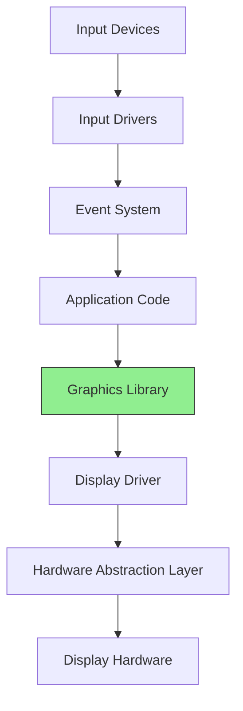

# STM32 Graphics Library

## Introduction

Welcome to the world of embedded graphics programming with STM32 microcontrollers! In this guide, we'll explore how to use graphics libraries to create visually appealing user interfaces and graphical elements on displays connected to STM32 microcontrollers.

The STM32 family of microcontrollers, produced by STMicroelectronics, offers powerful capabilities for handling graphical applications through dedicated libraries. These libraries simplify the process of drawing shapes, displaying text, and creating interactive interfaces on LCD and OLED displays, making them accessible even for beginners.

## What is a Graphics Library?

A graphics library is a collection of functions and tools that help you draw visual elements on a display. For STM32 microcontrollers, these libraries provide an abstraction layer that handles the complex tasks of communicating with display hardware and managing graphical elements.

The main graphics libraries available for STM32 include:

1. **STM32 TouchGFX** - A professional-grade C++ graphics library with a designer tool
2. **STemWin** - ST's implementation of the SEGGER emWin graphics library
3. **LVGL (Light and Versatile Graphics Library)** - An open-source graphics library with rich features
4. **µGFX** - A lightweight graphics library with good performance

## Getting Started with STM32 Graphics

### Hardware Requirements

Before diving into programming, ensure you have:

- An STM32 development board (F4, F7, or H7 series are recommended for graphics applications)
- A compatible display (TFT LCD, OLED, etc.)
- ST-Link programmer/debugger
- STM32CubeIDE or your preferred development environment

### Software Setup

Let's start by setting up a basic project with the STM32 HAL library and a graphics library.

```c
/* Include necessary headers */
#include "main.h"
#include "stm32f4xx_hal.h"
#include "lcd_driver.h"
#include "gfx_library.h" // This will vary based on the library you choose
```

## Basic Graphics Operations

### Initializing the Display

The first step in any graphics application is initializing the display:

```c
/* Display initialization example */
void Display_Init(void)
{
  /* Hardware-specific initialization */
  LCD_Init();
  
  /* Graphics library initialization */
  GFX_Init();
  
  /* Set default background */
  GFX_SetBackgroundColor(COLOR_BLACK);
  GFX_ClearScreen();
}
```

### Drawing Primitive Shapes

Let's explore how to draw basic shapes:

```c
/* Drawing primitive shapes */
void DrawShapes(void)
{
  /* Draw a rectangle */
  GFX_DrawRectangle(10, 10, 100, 50, COLOR_RED);
  
  /* Draw a filled circle */
  GFX_FillCircle(150, 100, 30, COLOR_BLUE);
  
  /* Draw a line */
  GFX_DrawLine(0, 0, 200, 200, COLOR_GREEN);
  
  /* Draw a triangle */
  GFX_DrawTriangle(50, 200, 150, 150, 200, 250, COLOR_YELLOW);
}
```

### Displaying Text

Text rendering is a common requirement in graphical interfaces:

```c
/* Text rendering example */
void DisplayText(void)
{
  /* Select font */
  GFX_SetFont(&Font16);
  
  /* Set text color and background */
  GFX_SetTextColor(COLOR_WHITE);
  GFX_SetTextBackgroundColor(COLOR_TRANSPARENT);
  
  /* Display text */
  GFX_PrintString(10, 10, "Hello, STM32 Graphics!");
  
  /* Change font and position */
  GFX_SetFont(&Font24);
  GFX_PrintString(10, 50, "Larger text");
}
```

## Creating a Simple User Interface

Now let's create a basic user interface with some interactive elements:

```c
/* Structure to represent a button */
typedef struct {
  uint16_t x;
  uint16_t y;
  uint16_t width;
  uint16_t height;
  char* label;
  uint16_t color;
  uint16_t textColor;
  bool pressed;
} Button_t;

/* Draw a button on the screen */
void DrawButton(Button_t* button)
{
  /* Draw button background */
  GFX_FillRectangle(button->x, button->y, button->width, button->height, button->color);
  
  /* Draw button border */
  GFX_DrawRectangle(button->x, button->y, button->width, button->height, COLOR_BLACK);
  
  /* Center and draw the text */
  GFX_SetFont(&Font16);
  GFX_SetTextColor(button->textColor);
  
  uint16_t textWidth = GFX_GetStringWidth(button->label);
  uint16_t textX = button->x + (button->width - textWidth) / 2;
  uint16_t textY = button->y + (button->height - 16) / 2;
  
  GFX_PrintString(textX, textY, button->label);
}

/* Check if a touch point is inside a button */
bool IsButtonPressed(Button_t* button, uint16_t touchX, uint16_t touchY)
{
  return (touchX >= button->x && touchX <= button->x + button->width &&
          touchY >= button->y && touchY <= button->y + button->height);
}
```

## Working with Images

Many applications require displaying images. Here's how you can work with bitmap images:

```c
/* Displaying a bitmap image from flash memory */
void DisplayBitmap(void)
{
  /* Bitmap data stored in flash */
  extern const uint8_t myImageBitmap[];
  
  /* Display the bitmap at position (50, 50) */
  GFX_DrawBitmap(50, 50, myImageBitmap);
}
```

## Animation Basics

Creating simple animations by updating the display in a loop:

```c
/* A simple bouncing ball animation */
void BouncingBallAnimation(void)
{
  int16_t x = 50, y = 50;
  int16_t dx = 2, dy = 3;
  uint8_t radius = 15;
  uint16_t screenWidth = 320, screenHeight = 240;
  
  while(1)
  {
    /* Clear previous ball */
    GFX_ClearScreen();
    
    /* Update position */
    x += dx;
    y += dy;
    
    /* Boundary checking */
    if(x <= radius || x >= screenWidth - radius)
    {
      dx = -dx;
    }
    if(y <= radius || y >= screenHeight - radius)
    {
      dy = -dy;
    }
    
    /* Draw ball at new position */
    GFX_FillCircle(x, y, radius, COLOR_RED);
    
    /* Delay to control animation speed */
    HAL_Delay(10);
  }
}
```

## Double Buffering for Smoother Graphics

To prevent flickering, especially in animations, double buffering is a useful technique:

```c
/* Double buffering example */
void DoubleBufferingExample(void)
{
  /* Create a back buffer */
  uint16_t* backBuffer = (uint16_t*)malloc(LCD_WIDTH * LCD_HEIGHT * sizeof(uint16_t));
  
  /* Switch to drawing to the back buffer */
  GFX_SetDrawBuffer(backBuffer);
  
  /* Draw to the back buffer */
  GFX_FillRectangle(10, 10, 100, 100, COLOR_RED);
  GFX_DrawCircle(120, 120, 50, COLOR_BLUE);
  
  /* Swap buffers - this copies the back buffer to the display */
  GFX_SwapBuffers();
  
  /* Free the buffer when done */
  free(backBuffer);
}
```

## Project Example: Temperature Display

Let's create a practical example of a temperature monitoring display:

```c
/* Temperature display with graphical representation */
void TemperatureMonitor(void)
{
  float temperature = 0.0f;
  char tempStr[20];
  
  /* Create a custom color gradient for temperature */
  uint16_t GetTempColor(float temp)
  {
    if(temp < 10.0f) return COLOR_BLUE;
    else if(temp < 25.0f) return COLOR_GREEN;
    else if(temp < 35.0f) return COLOR_YELLOW;
    else return COLOR_RED;
  }
  
  while(1)
  {
    /* Simulate temperature reading */
    temperature = GetTemperatureFromSensor();
    
    /* Clear screen */
    GFX_ClearScreen();
    
    /* Draw temperature value */
    GFX_SetFont(&Font24);
    GFX_SetTextColor(COLOR_WHITE);
    sprintf(tempStr, "%.1f°C", temperature);
    GFX_PrintString(10, 10, tempStr);
    
    /* Draw temperature bar */
    uint16_t barHeight = (uint16_t)(temperature * 2);
    uint16_t barColor = GetTempColor(temperature);
    GFX_FillRectangle(50, 240 - barHeight, 100, barHeight, barColor);
    
    /* Draw scale */
    GFX_SetFont(&Font12);
    GFX_PrintString(160, 230, "0°C");
    GFX_PrintString(160, 130, "50°C");
    GFX_PrintString(160, 30, "100°C");
    
    /* Update every second */
    HAL_Delay(1000);
  }
}
```

## Graphics Library Architecture

Let's visualize the architecture of a typical STM32 graphics system:



## Performance Considerations

When working with graphics on embedded systems, performance is crucial:

1. **Use hardware acceleration** when available
2. **Minimize drawing operations** by updating only changed areas
3. **Optimize memory usage** with appropriate color depths
4. **Consider double buffering** for smooth animations
5. **Use appropriate MCU** - higher-end STM32 chips have dedicated graphics acceleration

Example of partial screen update:

```c
/* Partial screen update example */
void UpdateChangedAreaOnly(uint16_t x, uint16_t y, uint16_t width, uint16_t height)
{
  /* Set the area to update */
  LCD_SetWindow(x, y, width, height);
  
  /* Update only this portion */
  GFX_UpdateArea(x, y, width, height);
}
```

## Integrating TouchGFX

For more advanced interfaces, ST provides TouchGFX, a powerful C++ based graphics library:

```cpp
/* Basic TouchGFX application class */
class MyApplication : public Application
{
public:
    MyApplication() { }
    virtual ~MyApplication() { }
    
    virtual void handleTickEvent()
    {
        // Called for each frame
        // Update your interface here
    }
};

/* Main function */
int main(void)
{
    hw_init();
    touchgfx_init();
    
    MyApplication app;
    app.run();
    
    return 0;
}
```

## Using LVGL with STM32

LVGL (Light and Versatile Graphics Library) is a popular open-source option:

```c
/* LVGL initialization example */
void LVGL_Init(void)
{
    /* Initialize LVGL library */
    lv_init();
    
    /* Register display driver */
    static lv_disp_buf_t disp_buf;
    static lv_color_t buf[LV_HOR_RES_MAX * 10];
    lv_disp_buf_init(&disp_buf, buf, NULL, LV_HOR_RES_MAX * 10);
    
    lv_disp_drv_t disp_drv;
    lv_disp_drv_init(&disp_drv);
    disp_drv.flush_cb = my_disp_flush;
    disp_drv.buffer = &disp_buf;
    lv_disp_drv_register(&disp_drv);
    
    /* Create a simple button */
    lv_obj_t * btn = lv_btn_create(lv_scr_act(), NULL);
    lv_obj_set_pos(btn, 10, 10);
    lv_obj_set_size(btn, 120, 50);
    
    /* Add label to the button */
    lv_obj_t * label = lv_label_create(btn, NULL);
    lv_label_set_text(label, "Button");
    
    /* Main loop */
    while(1) {
        lv_task_handler();
        HAL_Delay(5);
    }
}
```

## Summary

In this guide, we've explored the fundamentals of working with graphics libraries on STM32 microcontrollers. We've covered:

- Setting up a basic graphics project
- Drawing shapes and text
- Creating simple UI elements like buttons
- Working with images and animations
- Implementing double buffering for smoother graphics
- Building a practical temperature monitoring application
- Introduction to professional libraries like TouchGFX and LVGL

Graphics programming on STM32 opens up a world of possibilities for creating intuitive and visually appealing embedded interfaces. While we've covered the basics, each graphics library offers extensive capabilities that you can explore further.

## Further Exercises

1. Create a digital clock display with date and time
2. Implement a simple game like Pong or Snake
3. Design a thermostat interface with touch controls
4. Build a data logger with graphical charts
5. Develop an MP3 player interface

## Additional Resources

- STM32CubeIDE and STM32CubeMX documentation
- TouchGFX documentation from STMicroelectronics
- LVGL documentation and examples
- STM32 Community forums and projects
- STM32 Graphics webinars from STMicroelectronics

Remember, the key to mastering graphics programming is practice. Start with simple projects and gradually build up to more complex interfaces as your skills improve!