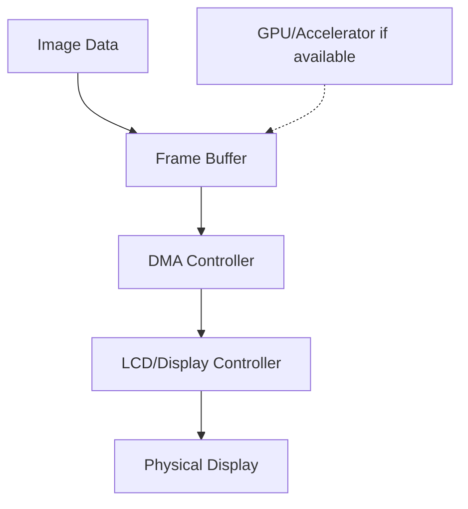

# STM32 Image Rendering

## Introduction

Image rendering on STM32 microcontrollers is a powerful capability that allows embedded systems to display visual content on connected displays. Whether you're building a smart home device, an industrial control panel, or a portable gadget, adding graphical elements enhances user experience and functionality significantly.

In this tutorial, we'll explore how to implement image rendering on STM32 microcontrollers. We'll cover everything from basic pixel manipulation to more advanced techniques using ST's graphics libraries. By the end, you'll have the knowledge to incorporate visually appealing elements into your STM32 projects.

## Prerequisites

Before diving into image rendering, make sure you have:

- Basic knowledge of STM32 microcontrollers
- Familiarity with C programming
- An STM32 development board with a display (or connected LCD)
- STM32CubeIDE or similar development environment
- Basic understanding of display technologies (RGB, color depth, etc.)

## Understanding the Graphics Pipeline on STM32

To effectively render images on STM32 devices, you need to understand the graphics pipeline:



1. **Image Data**: Raw pixel data stored in flash memory or received from external sources
2. **Frame Buffer**: Memory region that holds the current screen contents
3. **DMA Controller**: Efficiently transfers data from memory to the display controller
4. **Display Controller**: Converts digital data into signals the physical display can understand
5. **Physical Display**: LCD, OLED, or other display technology

Some higher-end STM32 microcontrollers include hardware acceleration (Chrom-ART, DMA2D) that can significantly improve rendering performance.

## Basic Concepts

### Color Formats

STM32 displays typically support various color formats:

1. **RGB565**: 16-bit color (5 bits red, 6 bits green, 5 bits blue)
2. **RGB888**: 24-bit color (8 bits per channel)
3. **ARGB8888**: 32-bit color with alpha channel

RGB565 is commonly used as it balances color quality with memory requirements.

### Frame Buffers

A frame buffer is a memory area that holds pixel data for the display. On STM32, you can use:

1. **Single Buffering**: Direct rendering to the display buffer
2. **Double Buffering**: Render to an off-screen buffer, then swap buffers
3. **Layer-Based**: Multiple buffers representing different layers

Here's how to declare a simple frame buffer for a 320x240 display using RGB565:

```c
// 320x240 display with RGB565 color format
#define DISPLAY_WIDTH  320
#define DISPLAY_HEIGHT 240
#define BYTES_PER_PIXEL 2  // RGB565 = 16 bits = 2 bytes

// Allocate the frame buffer
uint16_t frameBuffer[DISPLAY_WIDTH * DISPLAY_HEIGHT];
```

## Setting Up the Display Hardware

Before rendering images, you need to initialize your display hardware. This typically involves:

1. Configuring GPIO pins for the display interface
2. Setting up the appropriate peripheral (LTDC, SPI, FMC, etc.)
3. Initializing the display controller

Here's a basic example for an SPI-based display:

```c
void Display_Init(void)
{
  // Initialize SPI peripheral
  HAL_SPI_Init(&hspi1);
  
  // Reset display
  HAL_GPIO_WritePin(DISPLAY_RESET_GPIO_Port, DISPLAY_RESET_Pin, GPIO_PIN_RESET);
  HAL_Delay(10);
  HAL_GPIO_WritePin(DISPLAY_RESET_GPIO_Port, DISPLAY_RESET_Pin, GPIO_PIN_SET);
  HAL_Delay(120);
  
  // Send initialization commands
  Display_WriteCommand(0x11); // Exit sleep mode
  HAL_Delay(120);
  
  Display_WriteCommand(0x29); // Display on
  
  // Additional display-specific initialization...
}
```

## Rendering Static Images

### Bitmap Images from Flash Memory

One of the simplest ways to display images is to store them as raw bitmap data in flash memory:

```c
// RGB565 color format, 16-bit per pixel
const uint16_t LOGO_IMAGE[] = {
  0xFFFF, 0xFFFF, 0xFFFF, /* ... more pixel data ... */
};

void Display_DrawImage(uint16_t x, uint16_t y, uint16_t width, uint16_t height, const uint16_t* image)
{
  // Set the drawing window
  Display_SetWindow(x, y, x + width - 1, y + height - 1);
  
  // Write pixel data
  Display_WriteCommand(0x2C); // Memory write command
  
  // Send all pixels
  for(uint32_t i = 0; i < width * height; i++)
  {
    Display_WriteData(image[i]);
  }
}
```

### Converting Images for STM32

To convert images from standard formats (PNG, JPEG) to C arrays, you can use tools like:

1. **STM32CubeMX**: Has utilities for image conversion
2. **ImageConverter**: Part of the TouchGFX suite
3. **GIMP** with export plugins

Here's a typical workflow:

1. Create or obtain your image
2. Resize to match your display resolution
3. Convert to the appropriate color format (e.g., RGB565)
4. Export as a C array
5. Include in your project

## Using STM32 Graphics Libraries

### LCD_DISCO Library

For STM32 Discovery boards with displays, ST provides the LCD_DISCO library:

```c
#include "stm32_lcd.h"

void DisplayImageExample(void)
{
  // Initialize the LCD
  BSP_LCD_Init();
  
  // Clear the display
  BSP_LCD_Clear(LCD_COLOR_WHITE);
  
  // Display an image from flash memory
  BSP_LCD_DrawBitmap(10, 10, (uint8_t *)MY_BITMAP_DATA);
}
```

### STM32 DMA2D (Chrom-ART Accelerator)

Higher-end STM32 microcontrollers feature a DMA2D peripheral that accelerates graphics operations:

```c
void DrawImageWithDMA2D(uint16_t x, uint16_t y, uint16_t width, uint16_t height, uint16_t *imageData)
{
  // Configure DMA2D
  hdma2d.Init.Mode = DMA2D_M2M;
  hdma2d.Init.ColorMode = DMA2D_OUTPUT_RGB565;
  hdma2d.Init.OutputOffset = DISPLAY_WIDTH - width;
  
  // Calculate destination address
  uint32_t dstAddr = (uint32_t)frameBuffer + (y * DISPLAY_WIDTH + x) * 2;
  
  // Start transfer
  HAL_DMA2D_Start(&hdma2d, (uint32_t)imageData, dstAddr, width, height);
  HAL_DMA2D_PollForTransfer(&hdma2d, 100);
}
```

## Image Manipulation Techniques

### Resizing Images

For displaying images at different scales:

```c
void Display_DrawResizedImage(uint16_t x, uint16_t y, uint16_t original_width, uint16_t original_height, 
                              uint16_t new_width, uint16_t new_height, const uint16_t* image)
{
  float x_ratio = ((float)original_width - 1) / new_width;
  float y_ratio = ((float)original_height - 1) / new_height;
  
  Display_SetWindow(x, y, x + new_width - 1, y + new_height - 1);
  Display_WriteCommand(0x2C); // Memory write
  
  for (uint16_t y_pos = 0; y_pos < new_height; y_pos++) {
    for (uint16_t x_pos = 0; x_pos < new_width; x_pos++) {
      uint16_t src_x = (uint16_t)(x_ratio * x_pos);
      uint16_t src_y = (uint16_t)(y_ratio * y_pos);
      
      uint32_t src_index = src_y * original_width + src_x;
      Display_WriteData(image[src_index]);
    }
  }
}
```

### Applying Transparency

To render images with transparency (using a specific color key):

```c
void Display_DrawImageWithTransparency(uint16_t x, uint16_t y, uint16_t width, uint16_t height, 
                                      const uint16_t* image, uint16_t transparentColor)
{
  for (uint16_t y_pos = 0; y_pos < height; y_pos++) {
    for (uint16_t x_pos = 0; x_pos < width; x_pos++) {
      uint32_t src_index = y_pos * width + x_pos;
      
      // Skip transparent pixels
      if (image[src_index] != transparentColor) {
        Display_SetPixel(x + x_pos, y + y_pos, image[src_index]);
      }
    }
  }
}
```

## Real-World Applications

### User Interface Elements

STM32 image rendering can be used to create UI elements like buttons, icons, and status indicators:

```c
// Render a button with an icon
void RenderButton(uint16_t x, uint16_t y, bool isPressed)
{
  if (isPressed) {
    Display_DrawImage(x, y, BUTTON_PRESSED_WIDTH, BUTTON_PRESSED_HEIGHT, buttonPressedImage);
  } else {
    Display_DrawImage(x, y, BUTTON_NORMAL_WIDTH, BUTTON_NORMAL_HEIGHT, buttonNormalImage);
  }
  
  // Draw the icon centered on the button
  uint16_t iconX = x + (BUTTON_WIDTH - ICON_WIDTH) / 2;
  uint16_t iconY = y + (BUTTON_HEIGHT - ICON_HEIGHT) / 2;
  Display_DrawImageWithTransparency(iconX, iconY, ICON_WIDTH, ICON_HEIGHT, iconImage, 0x0000);
}
```

### Data Visualization

Display sensor data as graphs or gauges:

```c
void DrawTemperatureGauge(uint16_t x, uint16_t y, float temperature)
{
  // Draw the gauge background
  Display_DrawImage(x, y, GAUGE_WIDTH, GAUGE_HEIGHT, gaugeBackgroundImage);
  
  // Calculate needle position based on temperature
  float angle = MapTemperatureToAngle(temperature, MIN_TEMP, MAX_TEMP);
  
  // Draw the needle
  int16_t needleEndX = x + GAUGE_CENTER_X + (int16_t)(cos(angle) * NEEDLE_LENGTH);
  int16_t needleEndY = y + GAUGE_CENTER_Y + (int16_t)(sin(angle) * NEEDLE_LENGTH);
  
  Display_DrawLine(x + GAUGE_CENTER_X, y + GAUGE_CENTER_Y, needleEndX, needleEndY, NEEDLE_COLOR);
}
```

### Animation

Create simple animations by rendering image sequences:

```c
const uint16_t* animationFrames[] = {frame1, frame2, frame3, frame4, frame5};
const uint8_t FRAME_COUNT = 5;

void PlayAnimation(uint16_t x, uint16_t y, uint16_t width, uint16_t height, uint16_t frameDelayMs)
{
  for (uint8_t i = 0; i < FRAME_COUNT; i++) {
    Display_DrawImage(x, y, width, height, animationFrames[i]);
    HAL_Delay(frameDelayMs);
  }
}
```

## Optimizing Rendering Performance

### Use Hardware Acceleration

When available, use hardware accelerators like DMA2D:

```c
// Blend two images using DMA2D
void BlendImagesWithDMA2D(uint16_t x, uint16_t y, uint16_t width, uint16_t height, 
                         uint16_t *foregroundImage, uint16_t *backgroundImage, uint8_t alpha)
{
  // Configure DMA2D for blending operation
  hdma2d.Init.Mode = DMA2D_M2M_BLEND;
  hdma2d.Init.ColorMode = DMA2D_OUTPUT_RGB565;
  hdma2d.Init.OutputOffset = DISPLAY_WIDTH - width;
  
  // Foreground layer configuration
  hdma2d.LayerCfg[1].InputColorMode = DMA2D_INPUT_RGB565;
  hdma2d.LayerCfg[1].InputOffset = 0;
  hdma2d.LayerCfg[1].AlphaMode = DMA2D_REPLACE_ALPHA;
  hdma2d.LayerCfg[1].InputAlpha = alpha; // 0-255
  
  // Background layer configuration
  hdma2d.LayerCfg[0].InputColorMode = DMA2D_INPUT_RGB565;
  hdma2d.LayerCfg[0].InputOffset = 0;
  hdma2d.LayerCfg[0].AlphaMode = DMA2D_REPLACE_ALPHA;
  hdma2d.LayerCfg[0].InputAlpha = 0xFF; // Fully opaque
  
  // Calculate destination address
  uint32_t dstAddr = (uint32_t)frameBuffer + (y * DISPLAY_WIDTH + x) * 2;
  
  // Start transfer
  HAL_DMA2D_ConfigLayer(&hdma2d, 0);
  HAL_DMA2D_ConfigLayer(&hdma2d, 1);
  HAL_DMA2D_Start(&hdma2d, (uint32_t)foregroundImage, (uint32_t)backgroundImage, dstAddr, width, height);
  HAL_DMA2D_PollForTransfer(&hdma2d, 100);
}
```

### Partial Updates

Only update the portions of the screen that have changed:

```c
void UpdateRegion(uint16_t x, uint16_t y, uint16_t width, uint16_t height)
{
  // Set the update window
  Display_SetWindow(x, y, x + width - 1, y + height - 1);
  
  // Write pixel data
  Display_WriteCommand(0x2C);
  
  for (uint16_t yPos = 0; yPos < height; yPos++) {
    for (uint16_t xPos = 0; xPos < width; xPos++) {
      uint32_t bufferIndex = (y + yPos) * DISPLAY_WIDTH + (x + xPos);
      Display_WriteData(frameBuffer[bufferIndex]);
    }
  }
}
```

### Memory Management

Use appropriate memory sections for your frame buffers:

```c
// Place frame buffer in SRAM for faster access
#if defined ( __ICCARM__ )
#pragma data_alignment=32
#pragma location="SRAM"
__no_init uint16_t frameBuffer[DISPLAY_WIDTH * DISPLAY_HEIGHT];
#elif defined ( __CC_ARM )
__attribute__((section(".RAM_D1"))) __attribute__ ((aligned (32)))
uint16_t frameBuffer[DISPLAY_WIDTH * DISPLAY_HEIGHT];
#elif defined ( __GNUC__ )
__attribute__((section(".RAM_D1"))) __attribute__ ((aligned (32)))
uint16_t frameBuffer[DISPLAY_WIDTH * DISPLAY_HEIGHT];
#endif
```

## Advanced Techniques

### Alpha Blending and Transparency

Implement alpha blending for smoother visual effects:

```c
// Alpha blending function (software implementation)
uint16_t AlphaBlend565(uint16_t foreground, uint16_t background, uint8_t alpha)
{
  // Extract RGB components
  uint8_t fR = (foreground >> 11) & 0x1F;
  uint8_t fG = (foreground >> 5) & 0x3F;
  uint8_t fB = foreground & 0x1F;
  
  uint8_t bR = (background >> 11) & 0x1F;
  uint8_t bG = (background >> 5) & 0x3F;
  uint8_t bB = background & 0x1F;
  
  // Perform alpha blending
  uint8_t r = ((fR * alpha) + (bR * (255 - alpha))) / 255;
  uint8_t g = ((fG * alpha) + (bG * (255 - alpha))) / 255;
  uint8_t b = ((fB * alpha) + (bB * (255 - alpha))) / 255;
  
  // Combine components back into RGB565
  return ((r & 0x1F) << 11) | ((g & 0x3F) << 5) | (b & 0x1F);
}
```

### Font Rendering with Images

Combine text and images for rich interfaces:

```c
void DrawTextOverImage(uint16_t x, uint16_t y, const char* text, const FONT_INFO* font, 
                      uint16_t textColor, uint16_t backgroundColor, bool transparent)
{
  // First draw the background image
  Display_DrawImage(x, y, BG_IMAGE_WIDTH, BG_IMAGE_HEIGHT, backgroundImage);
  
  // Then render text on top
  uint16_t xPos = x + TEXT_PADDING_X;
  uint16_t yPos = y + TEXT_PADDING_Y;
  
  while (*text) {
    // Get character data from font
    uint16_t charWidth = Font_GetCharWidth(font, *text);
    
    // Render character
    Display_DrawChar(xPos, yPos, *text, font, textColor, backgroundColor, transparent);
    
    // Move to next character position
    xPos += charWidth + font->spacing;
    text++;
  }
}
```

## Practical Example: Image Viewer

Let's create a simple image viewer application that allows cycling through multiple images:

```c
typedef struct {
  const uint16_t* data;
  uint16_t width;
  uint16_t height;
  const char* name;
} Image_TypeDef;

// Array of images
const Image_TypeDef images[] = {
  {image1_data, IMAGE1_WIDTH, IMAGE1_HEIGHT, "Image 1"},
  {image2_data, IMAGE2_WIDTH, IMAGE2_HEIGHT, "Image 2"},
  {image3_data, IMAGE3_WIDTH, IMAGE3_HEIGHT, "Image 3"}
};

const uint8_t IMAGE_COUNT = sizeof(images) / sizeof(Image_TypeDef);
uint8_t currentImageIndex = 0;

void ImageViewer_Init(void)
{
  // Initialize display
  Display_Init();
  
  // Show first image
  ImageViewer_ShowCurrentImage();
}

void ImageViewer_ShowCurrentImage(void)
{
  // Clear screen
  Display_FillScreen(LCD_COLOR_BLACK);
  
  const Image_TypeDef* img = &images[currentImageIndex];
  
  // Calculate centered position
  uint16_t x = (DISPLAY_WIDTH - img->width) / 2;
  uint16_t y = (DISPLAY_HEIGHT - img->height) / 2;
  
  // Draw image
  Display_DrawImage(x, y, img->width, img->height, img->data);
  
  // Draw image name
  Display_SetFont(&Font12);
  Display_SetTextColor(LCD_COLOR_WHITE);
  Display_SetBackColor(LCD_COLOR_BLACK);
  
  uint16_t textWidth = strlen(img->name) * Font12.width;
  uint16_t textX = (DISPLAY_WIDTH - textWidth) / 2;
  
  Display_DisplayString(textX, DISPLAY_HEIGHT - 20, (uint8_t*)img->name);
}

void ImageViewer_NextImage(void)
{
  currentImageIndex = (currentImageIndex + 1) % IMAGE_COUNT;
  ImageViewer_ShowCurrentImage();
}

void ImageViewer_PreviousImage(void)
{
  currentImageIndex = (currentImageIndex > 0) ? (currentImageIndex - 1) : (IMAGE_COUNT - 1);
  ImageViewer_ShowCurrentImage();
}
```

## Summary

In this tutorial, we've covered the fundamentals of image rendering on STM32 microcontrollers. We've explored:

- Basic concepts of color formats and frame buffers
- Setting up display hardware
- Rendering static images from memory
- Using STM32's graphics libraries
- Image manipulation techniques
- Real-world applications
- Optimization strategies
- Advanced rendering techniques

With these tools and techniques, you can create visually appealing and interactive embedded applications on STM32 microcontrollers.

## Additional Resources

- **STM32 Graphics Libraries**: Explore ST's official graphics libraries including TouchGFX, STemWin, and more
- **DMA2D Documentation**: Review the Chrom-ART Accelerator documentation for hardware-accelerated graphics
- **Display Technologies**: Learn more about different display interfaces (SPI, RGB, MIPI DSI)

## Exercises

1. Create a simple image slideshow that transitions between images with a fade effect
2. Implement a basic sprite animation system for moving characters or objects
3. Build a weather station display that shows different weather icons based on conditions
4. Develop a simple gauge display for visualizing sensor readings
5. Create a basic UI with buttons and indicators using image rendering techniques

By working through these exercises, you'll gain practical experience with image rendering on STM32 microcontrollers and be well-equipped to implement graphical interfaces in your embedded projects.