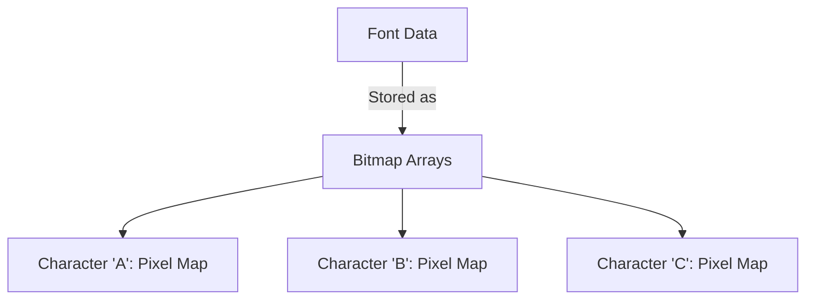

# STM32 Font Rendering

Text is a fundamental element in almost every graphical user interface. Whether you're building a smart thermostat, an industrial control panel, or a custom media player, displaying readable text is essential for user interaction. In this tutorial, we'll explore how to implement efficient font rendering on STM32 microcontrollers.

## Introduction to Font Rendering on STM32

Font rendering involves converting digital font data into pixel patterns that can be displayed on a screen. On resource-constrained systems like STM32 microcontrollers, this process needs to be optimized for both memory usage and processing speed.

STM32 microcontrollers don't have built-in text rendering capabilities like personal computers. Instead, we need to implement font handling ourselves, considering the limited resources available.

## Font Representation Methods

There are several ways to represent fonts in embedded systems:

### 1. Bitmap Fonts

Bitmap fonts store each character as a pre-rendered pixel array. This is the simplest approach and works well for fixed-size fonts.



### 2. Vector Fonts

Vector fonts define characters using mathematical formulas and shapes. They're scalable but require more processing power to render.

### 3. Stroke Fonts

Stroke fonts represent characters as a series of lines rather than filled shapes, making them lightweight but less visually appealing for complex characters.

For most STM32 applications, bitmap fonts provide the best balance of simplicity and performance.

## Setting Up Your Project

Before we begin, make sure you have:

1. An STM32 development board
2. A compatible display (LCD, OLED, etc.)
3. STM32CubeIDE or your preferred development environment
4. Basic knowledge of STM32 GPIO and peripheral configuration

## Creating a Basic Font Library

Let's start by creating a simple bitmap font library. We'll use a 5x7 pixel font, which is common for small displays.

First, we need to define our font data structure:

```c
// Font structure
typedef struct {
    const uint8_t width;       // Character width
    const uint8_t height;      // Character height
    const uint8_t *data;       // Pointer to character data
} Font_t;

// Character structure
typedef struct {
    const uint8_t width;       // Width of this specific character
    const uint8_t *data;       // Pointer to character bitmap data
} FontChar_t;
```

Next, we'll define a simple 5x7 font. For compactness, we'll store each character as a byte array where each byte represents one row of pixels:

```c
// 5x7 Font data for basic ASCII characters (32-127)
const uint8_t font5x7Data[] = {
    // Space (ASCII 32)
    0x00, 0x00, 0x00, 0x00, 0x00, 0x00, 0x00,
    
    // ! (ASCII 33)
    0x00, 0x00, 0x5F, 0x00, 0x00, 0x00, 0x00,
    
    // " (ASCII 34)
    0x00, 0x07, 0x00, 0x07, 0x00, 0x00, 0x00,
    
    // # (ASCII 35)
    0x14, 0x7F, 0x14, 0x7F, 0x14, 0x00, 0x00,
    
    // And so on for other characters...
};

// Font descriptor
const Font_t Font5x7 = {
    5,                      // Width
    7,                      // Height
    font5x7Data             // Data pointer
};
```

## Basic Text Rendering Function

Now let's create a function to draw text on our display. We'll assume we have already initialized our display and have a function to set individual pixels:

```c
/**
 * @brief Draws a text string on the display
 * @param x Starting X coordinate
 * @param y Starting Y coordinate
 * @param text Text to display
 * @param font Font to use
 * @param color Text color
 */
void LCD_DrawText(uint16_t x, uint16_t y, char* text, const Font_t* font, uint16_t color) {
    uint16_t cursorX = x;
    
    // Loop through each character in the string
    while (*text) {
        // Draw the character
        LCD_DrawChar(cursorX, y, *text, font, color);
        
        // Move cursor to the next character position
        cursorX += font->width + 1; // +1 for spacing between characters
        
        // Move to next character in string
        text++;
    }
}

/**
 * @brief Draws a single character on the display
 * @param x X coordinate
 * @param y Y coordinate
 * @param c Character to draw
 * @param font Font to use
 * @param color Character color
 */
void LCD_DrawChar(uint16_t x, uint16_t y, char c, const Font_t* font, uint16_t color) {
    // Calculate position in font data array
    uint32_t charOffset = (c - 32) * font->height; // Assuming font starts at ASCII 32 (space)
    
    // Loop through character height
    for (uint8_t row = 0; row < font->height; row++) {
        uint8_t rowData = font->data[charOffset + row];
        
        // Loop through character width
        for (uint8_t col = 0; col < font->width; col++) {
            // If bit is set, draw pixel
            if (rowData & (1 << (font->width - col - 1))) {
                LCD_DrawPixel(x + col, y + row, color);
            }
        }
    }
}
```

## Memory Optimization Techniques

### 1. Using Flash Memory for Font Data

Store font data in flash memory instead of RAM by using the `const` qualifier:

```c
const uint8_t font5x7Data[] = { /* font data */ };
```

### 2. Implementing Variable Width Characters

For more natural-looking text, we can implement variable-width characters:

```c
// Variable width character data structure
typedef struct {
    const uint8_t width;    // Width of this character
    const uint8_t* data;    // Pointer to character bitmap
} VarWidthChar_t;

// Font structure for variable width fonts
typedef struct {
    const uint8_t height;              // Font height
    const VarWidthChar_t* characters;  // Array of character data
} VarWidthFont_t;
```

### 3. Run-Length Encoding

For larger fonts, consider using Run-Length Encoding (RLE) to compress the font data:

```c
// RLE-encoded font structure
typedef struct {
    uint8_t width;
    uint8_t height;
    const uint8_t* rleData;  // RLE-encoded data
} RLEFont_t;

// Decode and draw RLE-encoded character
void LCD_DrawRLEChar(uint16_t x, uint16_t y, char c, const RLEFont_t* font, uint16_t color) {
    // Calculate position in font data
    uint32_t charOffset = /* calculation based on font format */;
    
    uint16_t currentX = x;
    uint16_t currentY = y;
    uint8_t index = 0;
    
    while (index < /* character data length */) {
        uint8_t runLength = font->rleData[charOffset + index++];
        uint8_t runValue = (runLength & 0x80) ? 1 : 0;
        runLength = runLength & 0x7F;
        
        // Draw run
        for (uint8_t i = 0; i < runLength; i++) {
            if (runValue) {
                LCD_DrawPixel(currentX, currentY, color);
            }
            
            currentX++;
            if (currentX >= x + font->width) {
                currentX = x;
                currentY++;
            }
        }
    }
}
```

## Advanced Font Rendering Techniques

### Anti-aliasing

On displays with sufficient color depth, we can implement basic anti-aliasing to smooth text edges:

```c
void LCD_DrawAntiAliasedChar(uint16_t x, uint16_t y, char c, const Font_t* font, uint16_t fgColor, uint16_t bgColor) {
    // Similar to LCD_DrawChar but with additional processing for edge smoothing
    // For each pixel at the edge of the character:
    // 1. Determine the number of sub-pixels that would be covered
    // 2. Calculate a color between foreground and background based on coverage
    // 3. Draw the pixel with the calculated color
    
    // Simplified example for edge detection:
    for (uint8_t row = 0; row < font->height; row++) {
        uint8_t rowData = font->data[(c - 32) * font->height + row];
        for (uint8_t col = 0; col < font->width; col++) {
            if (rowData & (1 << (font->width - col - 1))) {
                // Check if this is an edge pixel
                bool isEdge = false;
                
                // Check surrounding pixels
                // (simplified - real implementation would check actual font data)
                if (col > 0 && !(rowData & (1 << (font->width - col)))) isEdge = true;
                if (col < font->width-1 && !(rowData & (1 << (font->width - col - 2)))) isEdge = true;
                
                if (isEdge) {
                    // Blend colors for anti-aliasing (50% blend in this simple example)
                    uint16_t blendedColor = BlendColors(fgColor, bgColor, 128);
                    LCD_DrawPixel(x + col, y + row, blendedColor);
                } else {
                    LCD_DrawPixel(x + col, y + row, fgColor);
                }
            }
        }
    }
}

// Helper function to blend colors
uint16_t BlendColors(uint16_t color1, uint16_t color2, uint8_t alpha) {
    // Extract RGB components (assuming RGB565 format)
    uint8_t r1 = (color1 >> 11) & 0x1F;
    uint8_t g1 = (color1 >> 5) & 0x3F;
    uint8_t b1 = color1 & 0x1F;
    
    uint8_t r2 = (color2 >> 11) & 0x1F;
    uint8_t g2 = (color2 >> 5) & 0x3F;
    uint8_t b2 = color2 & 0x1F;
    
    // Blend components
    uint8_t r = (r1 * alpha + r2 * (255 - alpha)) / 255;
    uint8_t g = (g1 * alpha + g2 * (255 - alpha)) / 255;
    uint8_t b = (b1 * alpha + b2 * (255 - alpha)) / 255;
    
    // Combine back to RGB565
    return (r << 11) | (g << 5) | b;
}
```

### Text Rotation

For more flexible UI design, we can implement text rotation:

```c
void LCD_DrawRotatedText(uint16_t x, uint16_t y, char* text, const Font_t* font, 
                         uint16_t color, uint16_t angle) {
    float radians = angle * 3.14159f / 180.0f;
    float cosA = cos(radians);
    float sinA = sin(radians);
    
    uint16_t cursorX = 0;
    
    while (*text) {
        // Calculate rotated position
        int16_t newX = x + (int16_t)(cursorX * cosA);
        int16_t newY = y + (int16_t)(cursorX * sinA);
        
        // Draw rotated character
        LCD_DrawRotatedChar(newX, newY, *text, font, color, angle);
        
        // Move cursor
        cursorX += font->width + 1;
        text++;
    }
}

void LCD_DrawRotatedChar(uint16_t x, uint16_t y, char c, const Font_t* font, 
                         uint16_t color, uint16_t angle) {
    float radians = angle * 3.14159f / 180.0f;
    float cosA = cos(radians);
    float sinA = sin(radians);
    
    // Calculate position in font data
    uint32_t charOffset = (c - 32) * font->height;
    
    // Draw each pixel after rotation
    for (uint8_t row = 0; row < font->height; row++) {
        uint8_t rowData = font->data[charOffset + row];
        
        for (uint8_t col = 0; col < font->width; col++) {
            if (rowData & (1 << (font->width - col - 1))) {
                // Apply rotation transformation
                int16_t newX = x + (int16_t)(col * cosA - row * sinA);
                int16_t newY = y + (int16_t)(col * sinA + row * cosA);
                
                LCD_DrawPixel(newX, newY, color);
            }
        }
    }
}
```

## Using STM32 Hardware Acceleration

Some STM32 devices include hardware acceleration for graphics operations. For example, STM32F4 and STM32F7 series often include the Chrom-ART accelerator (DMA2D) which can significantly speed up font rendering.

Here's how to use DMA2D for filling a memory area (useful for text background):

```c
/**
 * @brief Initialize DMA2D for hardware acceleration
 */
void DMA2D_Init(void) {
    // Enable DMA2D clock
    RCC->AHB1ENR |= RCC_AHB1ENR_DMA2DEN;
    
    // Configure DMA2D for register-to-memory transfer
    DMA2D->CR = DMA2D_CR_MODE_0; // Register to memory mode
}

/**
 * @brief Fill a rectangle with color using DMA2D
 */
void DMA2D_FillRect(uint32_t *outputBuffer, uint16_t offsetX, uint16_t offsetY, 
                    uint16_t width, uint16_t height, uint16_t bufferWidth, uint16_t color) {
    // Set output address
    DMA2D->OMAR = (uint32_t)(outputBuffer + offsetY * bufferWidth + offsetX);
    
    // Set output offset
    DMA2D->OOR = bufferWidth - width;
    
    // Set output color format (RGB565)
    DMA2D->OPFCCR = DMA2D_OPFCCR_CM_0;
    
    // Set output color
    DMA2D->OCOLR = color;
    
    // Set dimensions
    DMA2D->NLR = (height << DMA2D_NLR_NL_Pos) | (width << DMA2D_NLR_PL_Pos);
    
    // Start transfer
    DMA2D->CR |= DMA2D_CR_START;
    
    // Wait for completion
    while (DMA2D->CR & DMA2D_CR_START) {}
}
```

## Real-World Example: Building a Simple UI

Let's build a simple temperature display interface using our font rendering functions:

```c
void DrawTemperatureUI(float temperature, uint8_t humidity) {
    // Clear screen
    LCD_FillScreen(BLACK);
    
    // Draw title
    LCD_DrawText(10, 10, "TEMPERATURE MONITOR", &Font5x7, WHITE);
    
    // Draw horizontal line
    for (int i = 0; i < 128; i++) {
        LCD_DrawPixel(i, 20, GRAY);
    }
    
    // Format temperature string
    char tempStr[16];
    sprintf(tempStr, "%.1f C", temperature);
    
    // Draw temperature with larger font
    LCD_DrawText(20, 30, tempStr, &Font7x10, WHITE);
    
    // Draw temperature icon
    DrawThermometerIcon(5, 32);
    
    // Format humidity string
    char humStr[16];
    sprintf(humStr, "Humidity: %d%%", humidity);
    
    // Draw humidity
    LCD_DrawText(5, 50, humStr, &Font5x7, LIGHT_BLUE);
    
    // Draw time
    RTC_TimeTypeDef time;
    HAL_RTC_GetTime(&hrtc, &time, RTC_FORMAT_BIN);
    
    char timeStr[16];
    sprintf(timeStr, "Time: %02d:%02d", time.Hours, time.Minutes);
    LCD_DrawText(5, 70, timeStr, &Font5x7, GREEN);
}
```

## Performance Optimization Tips

1. **Buffer updates**: Instead of drawing directly to the display, update a buffer in memory and then flush it to the display to reduce flicker.

2. **Dirty rectangle tracking**: Only update parts of the screen that have changed.

3. **Font caching**: Cache commonly used characters to avoid regenerating them repeatedly.

4. **Use hardware acceleration**: Whenever possible, utilize DMA2D or other hardware accelerators.

5. **Optimize critical paths**: Use assembly for critical rendering functions if necessary.

```c
// Example of using a frame buffer
uint16_t frameBuffer[LCD_WIDTH * LCD_HEIGHT];

void UpdateDisplay(void) {
    // Render to frame buffer
    LCD_DrawText_Buffer(10, 10, "Hello World", &Font5x7, WHITE, frameBuffer);
    
    // Flush buffer to display
    LCD_Flush(frameBuffer);
}

// Optimized text rendering for frame buffer
void LCD_DrawText_Buffer(uint16_t x, uint16_t y, char* text, const Font_t* font, 
                         uint16_t color, uint16_t* buffer) {
    uint16_t cursorX = x;
    uint16_t bufferWidth = LCD_WIDTH;
    
    while (*text) {
        // Calculate character offset
        uint32_t charOffset = (*text - 32) * font->height;
        
        // Draw character to buffer
        for (uint8_t row = 0; row < font->height; row++) {
            uint8_t rowData = font->data[charOffset + row];
            
            for (uint8_t col = 0; col < font->width; col++) {
                if (rowData & (1 << (font->width - col - 1))) {
                    // Calculate buffer position
                    uint32_t bufPos = (y + row) * bufferWidth + (cursorX + col);
                    
                    // Update buffer directly
                    buffer[bufPos] = color;
                }
            }
        }
        
        // Move cursor
        cursorX += font->width + 1;
        text++;
    }
}
```

## Using External Font Resources

For more advanced applications, you might want to use standard font formats like TrueType. There are lightweight libraries like TinyTTF that can render vector fonts with a small footprint:

```c
// Example of integrating a lightweight TTF renderer (pseudocode)
#include "tinyTTF.h"

TTF_Font* ttfFont = NULL;

void InitTTFFont(void) {
    // Load TTF font from flash memory
    ttfFont = TTF_LoadFont(arial_ttf_data);
    
    // Set font size (in pixels)
    TTF_SetFontSize(ttfFont, 12);
}

void RenderTTFText(uint16_t x, uint16_t y, char* text, uint16_t color) {
    // Create a temporary surface for rendering
    TTF_Surface* surface = TTF_RenderText(ttfFont, text, color);
    
    // Copy surface to display
    for (int row = 0; row < surface->h; row++) {
        for (int col = 0; col < surface->w; col++) {
            uint16_t pixel = surface->pixels[row * surface->pitch + col];
            if (pixel != 0) {  // Non-transparent pixel
                LCD_DrawPixel(x + col, y + row, pixel);
            }
        }
    }
    
    // Free temporary surface
    TTF_FreeSurface(surface);
}
```

## Creating Custom Font Tools

For optimal performance, you may want to create custom tools to convert PC fonts to STM32-friendly formats:

1. Create a Python script that converts TTF fonts to bitmap arrays:

```python
# Example Python script snippet (font_converter.py)
from PIL import Image, ImageDraw, ImageFont
import sys

def convert_font(font_path, font_size, output_file):
    # Create font object
    font = ImageFont.truetype(font_path, font_size)
    
    # Open output file
    with open(output_file, 'w') as f:
        # Write header
        f.write("// Font generated from %s at %dpx
" % (font_path, font_size))
        f.write("const uint8_t fontData[] = {
")
        
        # Process each character (ASCII 32-127)
        for char_code in range(32, 128):
            char = chr(char_code)
            
            # Calculate size
            text_width, text_height = font.getsize(char)
            
            # Create image for character
            img = Image.new('1', (text_width, text_height), 0)
            draw = ImageDraw.Draw(img)
            
            # Draw character
            draw.text((0, 0), char, font=font, fill=1)
            
            # Convert to bitmap
            bitmap = []
            for y in range(text_height):
                row_byte = 0
                for x in range(text_width):
                    if img.getpixel((x, y)) > 0:
                        row_byte |= (1 << (7 - (x % 8)))
                    if (x % 8) == 7 or x == text_width - 1:
                        bitmap.append(row_byte)
                        row_byte = 0
            
            # Write character data
            f.write("    // '%s' (ASCII %d)
    " % (char, char_code))
            for i, byte in enumerate(bitmap):
                f.write("0x%02X, " % byte)
                if (i + 1) % 8 == 0:
                    f.write("
    ")
            f.write("

")
        
        # Write footer
        f.write("};
")

if __name__ == "__main__":
    if len(sys.argv) != 4:
        print("Usage: python font_converter.py <font_file> <font_size> <output_file>")
        sys.exit(1)
    
    convert_font(sys.argv[1], int(sys.argv[2]), sys.argv[3])
```

## Summary

In this tutorial, we've covered the fundamentals of font rendering on STM32 microcontrollers:

1. Different types of font representations (bitmap, vector, stroke)
2. Creating a basic font library with fixed-width characters
3. Implementing text rendering functions
4. Memory optimization techniques
5. Advanced rendering features like anti-aliasing and rotation
6. Using hardware acceleration with DMA2D
7. Building a real-world UI example
8. Performance optimization strategies
9. Working with external font resources
10. Creating custom font conversion tools

Font rendering is a critical component of any graphical interface, and the techniques presented here will help you create efficient, readable text displays in your STM32 projects.

## Exercises

1. Modify the font rendering code to support variable-width characters.
2. Implement a scrolling text function for displaying long messages on small screens.
3. Create a multi-line text rendering function with word wrapping.
4. Optimize the font rendering for DMA2D hardware acceleration.
5. Implement a basic text input field with cursor and character editing.

## Additional Resources

- [STM32 Graphics HAL Documentation](https://www.st.com/resource/en/user_manual/dm00105879-description-of-stm32f4-hal-and-ll-drivers-stmicroelectronics.pdf)
- [FreeType Library](https://www.freetype.org/) - A more comprehensive font engine that can be adapted for STM32
- [STM32 DMA2D Application Note](https://www.st.com/resource/en/application_note/dm00047230-stm32f429-discovery-board-lcd-and-touchscreen-demonstration-stmicroelectronics.pdf)
- [STM32F4/F7 Chrom-ART Accelerator](https://www.st.com/en/microcontrollers-microprocessors/stm32f7-series.html)