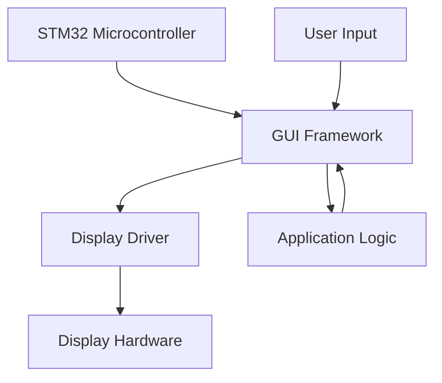

# STM32 GUI Development

## Introduction

Modern embedded applications often require sophisticated graphical user interfaces (GUIs) to provide intuitive user experiences. STM32 microcontrollers, with their powerful processing capabilities and dedicated graphics hardware, are excellent platforms for developing GUI-based applications. This guide will introduce you to GUI development on STM32 platforms, covering the fundamentals, popular frameworks, and practical implementation techniques.

## What is STM32 GUI Development?

STM32 GUI development involves creating graphical interfaces for applications running on STM32 microcontrollers. These interfaces can range from simple status displays to complex interactive applications with animations, touch input, and sophisticated visual elements.



## GUI Frameworks for STM32

Several GUI frameworks are available for STM32 development, each with different features, performance characteristics, and complexity levels.

### 1. TouchGFX

TouchGFX is ST's official high-performance GUI framework designed specifically for STM32 microcontrollers.

**Key Features:**
- High-performance rendering optimized for STM32
- Designer tool for WYSIWYG development
- C++ based programming model
- Rich widget library
- Supports animations and effects
- Integrated with STM32CubeMX

### 2. LVGL (Light and Versatile Graphics Library)

LVGL is a free, open-source graphics library designed for embedded systems with limited resources.

**Key Features:**
- Low resource requirements
- Written in C for portability
- Extensive widget collection
- Support for various input devices
- Theming capabilities
- Active community and development

### 3. emWin

emWin is a professional GUI toolkit from SEGGER that's bundled with STM32 microcontrollers through ST's partnership.

**Key Features:**
- Professional-grade quality
- Comprehensive widget set
- Memory efficiency
- Hardware acceleration support
- Window manager

## Hardware Requirements

To develop GUIs for STM32, you'll need:

1. **STM32 Development Board** - Preferably one with:
   - Sufficient flash memory and RAM
   - High clock speed (Cortex-M4 or M7 recommended for complex GUIs)
   - External memory interface (for larger applications)

2. **Display Hardware**:
   - TFT LCD with RGB interface for high-performance applications
   - SPI or I2C based displays for simpler interfaces
   - Touch panel (resistive or capacitive) for interactive applications

3. **Development Environment**:
   - STM32CubeIDE or another IDE
   - Framework-specific tools (e.g., TouchGFX Designer)

## Getting Started with TouchGFX

Let's walk through setting up a simple TouchGFX project as an example.

### Step 1: Project Setup with STM32CubeMX

1. Open STM32CubeMX and create a new project
2. Select your target STM32 microcontroller
3. Configure the necessary peripherals:
   - Clock configuration
   - Display interface (LTDC, SPI, etc.)
   - External memory (if needed)
   - Touch interface

4. Navigate to the Software Packs menu and select X-CUBE-TOUCHGFX
5. Generate the project code

### Step 2: Opening the Project in TouchGFX Designer

```bash
# Navigate to your project directory
cd MyTouchGFXProject

# Launch TouchGFX Designer
# The designer executable location depends on your installation
TouchGFXDesigner
```

### Step 3: Creating a Simple UI

In TouchGFX Designer:

1. Create a new screen
2. Add widgets (buttons, labels, images) by dragging from the widget gallery
3. Customize properties like position, size, and appearance
4. Define interactions and events

### Step 4: Generating and Building the Code

1. Click "Generate Code" in TouchGFX Designer
2. Open your project in your IDE (e.g., STM32CubeIDE)
3. Build and flash to your device

## Code Example: Simple Button Interaction

Here's a simple example of handling a button press in TouchGFX:

```cpp
// In YourView.hpp
#include <gui_generated/your_screen/YourViewBase.hpp>
#include <gui/your_screen/YourPresenter.hpp>

class YourView : public YourViewBase
{
public:
    YourView();
    virtual ~YourView() {}
    virtual void setupScreen();
    virtual void tearDownScreen();
    
    // Button callback
    virtual void buttonClicked();
};

// In YourView.cpp
#include <gui/your_screen/YourView.hpp>

YourView::YourView()
{
}

void YourView::setupScreen()
{
    YourViewBase::setupScreen();
}

void YourView::tearDownScreen()
{
    YourViewBase::tearDownScreen();
}

void YourView::buttonClicked()
{
    // Change the text of a label when button is clicked
    textArea1.setWildcard(touchgfx::TypedText(T_WILDCARD1).getText());
    textArea1.invalidate();
    
    // Or trigger an animation
    buttonPressed.startAnimation(buttonPressedAnimationEnded);
}
```

## Getting Started with LVGL

LVGL is a popular alternative, especially for projects where TouchGFX's resource requirements are too high.

### Step 1: Adding LVGL to Your Project

First, include LVGL in your project:

```c
// Include LVGL header files
#include "lvgl/lvgl.h"
#include "lv_conf.h"
```

### Step 2: Initialize LVGL and Display

```c
static lv_disp_buf_t disp_buf;
static lv_color_t buf[LV_HOR_RES_MAX * 10];

void gui_init(void)
{
    // Initialize LVGL
    lv_init();
    
    // Initialize buffer for display
    lv_disp_buf_init(&disp_buf, buf, NULL, LV_HOR_RES_MAX * 10);
    
    // Register display driver
    lv_disp_drv_t disp_drv;
    lv_disp_drv_init(&disp_drv);
    disp_drv.flush_cb = my_disp_flush;  // Your display-specific function
    disp_drv.buffer = &disp_buf;
    lv_disp_drv_register(&disp_drv);
    
    // Initialize input device driver (if touch is used)
    lv_indev_drv_t indev_drv;
    lv_indev_drv_init(&indev_drv);
    indev_drv.type = LV_INDEV_TYPE_POINTER;
    indev_drv.read_cb = my_touchpad_read;  // Your touch-specific function
    lv_indev_drv_register(&indev_drv);
}
```

### Step 3: Create UI Elements

```c
void create_demo_ui(void)
{
    // Create a button
    lv_obj_t * btn = lv_btn_create(lv_scr_act(), NULL);
    lv_obj_set_pos(btn, 10, 10);
    lv_obj_set_size(btn, 120, 50);
    lv_obj_set_event_cb(btn, btn_event_handler);
    
    // Add label to button
    lv_obj_t * label = lv_label_create(btn, NULL);
    lv_label_set_text(label, "Button");
    
    // Create a simple gauge
    lv_obj_t * gauge = lv_gauge_create(lv_scr_act(), NULL);
    lv_obj_set_size(gauge, 200, 200);
    lv_obj_align(gauge, NULL, LV_ALIGN_CENTER, 0, 50);
    lv_gauge_set_value(gauge, 0, 75);
}

// Button event handler
static void btn_event_handler(lv_obj_t * obj, lv_event_t event)
{
    if(event == LV_EVENT_CLICKED) {
        // Handle button click
        static uint8_t cnt = 0;
        cnt++;
        
        // Find gauge and update its value
        lv_obj_t * gauge = lv_obj_get_child_back(lv_scr_act(), NULL);
        lv_gauge_set_value(gauge, 0, cnt * 10);
    }
}
```

### Step 4: Main Loop

```c
int main(void)
{
    // Hardware initialization
    system_init();
    
    // Initialize GUI
    gui_init();
    create_demo_ui();
    
    // Main loop
    while(1) {
        lv_task_handler();
        HAL_Delay(5);  // Small delay
    }
}
```

## Practical Example: Temperature Monitor

Let's create a practical example of a temperature monitoring application using TouchGFX.

### Hardware Setup
- STM32F746G-DISCO board with integrated display
- Temperature sensor (e.g., LM75 connected via I2C)

### User Interface Design

Our application will display:
- Current temperature with numeric display
- Historical temperature graph
- Temperature alerts with color coding

### Code Implementation (TouchGFX)

```cpp
// In TemperatureView.hpp
class TemperatureView : public TemperatureViewBase
{
public:
    TemperatureView();
    virtual void setupScreen();
    virtual void tearDownScreen();
    
    // Update temperature display
    void updateTemperature(float temperature);
    
    // Graph update timer callback
    virtual void handleTickEvent();
    
private:
    static const int GRAPH_POINTS = 100;
    float temperatureHistory[GRAPH_POINTS];
    int historyIndex;
};

// In TemperatureView.cpp
#include "TemperatureView.hpp"

TemperatureView::TemperatureView() : historyIndex(0)
{
    // Initialize temperature history
    for (int i = 0; i < GRAPH_POINTS; i++) {
        temperatureHistory[i] = 0;
    }
}

void TemperatureView::setupScreen()
{
    TemperatureViewBase::setupScreen();
    
    // Start update timer (updates every 100ms)
    Application::getInstance()->registerTimerWidget(this);
}

void TemperatureView::tearDownScreen()
{
    Application::getInstance()->unregisterTimerWidget(this);
    TemperatureViewBase::tearDownScreen();
}

void TemperatureView::updateTemperature(float temperature)
{
    // Update current temperature display
    Unicode::snprintf(temperatureBuffer, TEMPERATURE_SIZE, "%d.%01d°C", 
                      (int)temperature, (int)(temperature * 10) % 10);
    temperatureText.invalidate();
    
    // Update history array
    temperatureHistory[historyIndex] = temperature;
    historyIndex = (historyIndex + 1) % GRAPH_POINTS;
    
    // Update graph (assuming a graph widget is configured in the designer)
    for (int i = 0; i < GRAPH_POINTS; i++) {
        int idx = (historyIndex + i) % GRAPH_POINTS;
        temperatureGraph.setGraphPoint(i, (int)(temperatureHistory[idx] * 10));
    }
    temperatureGraph.invalidate();
    
    // Update alert color based on temperature
    if (temperature > 30.0f) {
        temperatureText.setColor(touchgfx::Color::getColorFrom24BitRGB(255, 0, 0));  // Red
    } else if (temperature < 10.0f) {
        temperatureText.setColor(touchgfx::Color::getColorFrom24BitRGB(0, 0, 255));  // Blue
    } else {
        temperatureText.setColor(touchgfx::Color::getColorFrom24BitRGB(0, 255, 0));  // Green
    }
    temperatureText.invalidate();
}

void TemperatureView::handleTickEvent()
{
    // In a real application, this would get data from the temperature sensor
    // For demonstration, we'll simulate temperature readings
    static float simulatedTemp = 25.0f;
    static float direction = 0.1f;
    
    simulatedTemp += direction;
    if (simulatedTemp > 35.0f || simulatedTemp < 15.0f) {
        direction = -direction;
    }
    
    updateTemperature(simulatedTemp);
}
```

### Main Application Code (C)

```c
// Main application code
#include "main.h"
#include "app_touchgfx.h"
#include "i2c.h"

// LM75 temperature sensor address
#define LM75_ADDR        0x48
#define LM75_TEMP_REG    0x00

float readTemperature(void)
{
    uint8_t data[2];
    int16_t temp;
    float temperature;
    
    // Read temperature register from LM75 sensor
    HAL_I2C_Mem_Read(&hi2c1, LM75_ADDR << 1, LM75_TEMP_REG, I2C_MEMADD_SIZE_8BIT, data, 2, 100);
    
    // Convert the data
    temp = ((data[0] << 8) | data[1]) >> 5;
    if (temp > 0x3FF) {
        temp |= 0xF800; // Sign extension for negative values
    }
    
    // Convert to degrees Celsius (each bit = 0.125°C)
    temperature = temp * 0.125f;
    
    return temperature;
}

// Entry point for TouchGFX application
extern "C" void touchgfx_init(void)
{
    // Initialize HAL, LCD, and TouchGFX
    hw_init();
    touchgfx_components_init();
    
    // Main loop
    for (;;)
    {
        // Read temperature and update UI
        float temp = readTemperature();
        
        // Send temperature to UI
        // Note: This requires passing the temperature to the view through the presenter
        // which is not shown in this simplified example
        
        // Process TouchGFX tasks
        touchgfx_taskEntry();
    }
}
```

## Best Practices for STM32 GUI Development

1. **Memory Management**
   - Use external SDRAM for frame buffers when available
   - Optimize image formats (consider using compressed formats)
   - Minimize the number of screens and transitions

2. **Performance Optimization**
   - Use hardware acceleration where available
   - Limit animations and complex rendering on lower-end devices
   - Use partial screen updates instead of full refreshes

3. **Power Efficiency**
   - Implement sleep modes when the UI is inactive
   - Dim or turn off the display when not in use
   - Use event-driven architecture to reduce unnecessary updates

4. **User Experience**
   - Design for touch accuracy (make touch targets sufficiently large)
   - Provide visual feedback for user interactions
   - Ensure consistent response times

## Common Challenges and Solutions

### Limited Resources

**Challenge**: STM32 microcontrollers have limited RAM and processing power compared to application processors.

**Solutions**:
- Use external memory for resource-intensive applications
- Optimize graphics (reduce color depth, use smaller images)
- Implement partial screen updates

### Display Driver Complexity

**Challenge**: Interfacing with displays can be complex, especially for high-resolution displays.

**Solutions**:
- Use ST's BSP (Board Support Package) when available
- Leverage DMA for efficient data transfer
- Use hardware acceleration features (LTDC, DMA2D)

### Touch Calibration

**Challenge**: Touch screens often require calibration for accurate input.

**Solutions**:
- Implement a calibration screen in your application
- Store calibration data in non-volatile memory
- Use filtering algorithms to improve touch stability

## Summary

STM32 GUI development offers a powerful way to create modern interfaces for embedded applications. By choosing the right framework, understanding the hardware capabilities, and applying proper optimization techniques, you can create sophisticated GUIs even on resource-constrained devices.

The key points to remember:
- Select the appropriate GUI framework based on your requirements and target hardware
- Design your UI with the hardware limitations in mind
- Optimize for performance and memory usage
- Implement responsive user interactions
- Follow best practices for embedded GUI development

## Additional Resources

### Documentation and Tutorials

- **STM32 Graphics Solutions**: ST's official documentation
- **TouchGFX Documentation**: Comprehensive guides for TouchGFX development
- **LVGL Documentation**: Tutorials and API references for LVGL

### Example Projects

- **STM32CubeF7 Examples**: Contains GUI examples for F7 series
- **TouchGFX Demo Applications**: Pre-built examples demonstrating various UI features
- **LVGL Demo Projects**: Sample projects showing LVGL capabilities

### Exercises

1. Create a simple thermostat interface with temperature display and setpoint controls
2. Implement a music player UI with playlist navigation and playback controls
3. Design a home automation dashboard with multiple device status displays and controls
4. Build a fitness tracker interface with activity graphs and statistics