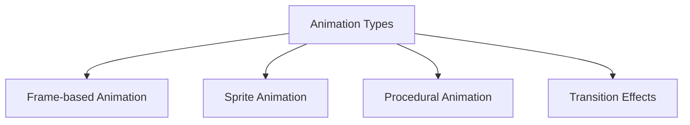

# STM32 Animation

## Introduction

Animation adds a dynamic element to graphical interfaces on embedded systems, making your applications more engaging and interactive. In this tutorial, we'll explore how to create smooth animations on STM32 microcontrollers, starting with basic concepts and progressing to practical implementations.

Animations on resource-constrained systems like STM32 require careful planning to achieve smooth performance while maintaining responsive application behavior. We'll learn techniques to efficiently update graphics, manage timing, and create visually appealing animations without overwhelming the limited resources available on these microcontrollers.

## Prerequisites

Before diving into animations, you should be familiar with:

- Basic STM32 programming and setup
- Fundamental graphics concepts on STM32 (covered in previous sections)
- A connected display (LCD, OLED, or TFT)
- Basic understanding of timers in STM32

## Animation Fundamentals

### What Makes Animation Work?

Animation works on the principle of displaying a sequence of images (frames) rapidly enough that the human eye perceives continuous motion. For smooth animation, we generally need:

- A frame rate of at least 24 frames per second (FPS)
- Consistent timing between frames
- Efficient graphics updates

On STM32 microcontrollers, we need to be particularly mindful of:

1. **Memory usage**: Each frame consumes memory
2. **Processing power**: Rendering complex graphics can be CPU-intensive
3. **Refresh rate**: The physical limitations of the display

### Animation Types on STM32

There are several approaches to animation on embedded systems:



1. **Frame-based Animation**: Displaying pre-rendered images in sequence
2. **Sprite Animation**: Moving small graphical elements across the screen
3. **Procedural Animation**: Generating frames on-the-fly using algorithms
4. **Transition Effects**: Fades, slides, and other UI transitions

We'll explore each of these approaches with practical examples.

## Setting Up the Animation Framework

First, let's establish a basic framework for managing animations:

```c
// Animation structure
typedef struct {
    uint32_t start_time;     // Time when animation started
    uint32_t duration;       // Total duration in milliseconds
    uint32_t current_frame;  // Current frame number
    uint32_t total_frames;   // Total number of frames
    bool is_running;         // Animation state
    bool loop;               // Whether animation should loop
    void (*update_func)(struct Animation* anim, void* param); // Frame update function
    void* param;             // Additional parameters
} Animation;

// Initialize animation
void Animation_Init(Animation* anim, uint32_t duration, uint32_t total_frames, bool loop) {
    anim->start_time = HAL_GetTick();
    anim->duration = duration;
    anim->current_frame = 0;
    anim->total_frames = total_frames;
    anim->is_running = true;
    anim->loop = loop;
    anim->update_func = NULL;
    anim->param = NULL;
}

// Update animation state
bool Animation_Update(Animation* anim) {
    if (!anim->is_running) {
        return false;
    }
    
    uint32_t current_time = HAL_GetTick();
    uint32_t elapsed = current_time - anim->start_time;
    
    // Calculate current frame based on elapsed time
    uint32_t new_frame = (elapsed * anim->total_frames) / anim->duration;
    
    // Check if animation is complete
    if (new_frame >= anim->total_frames) {
        if (anim->loop) {
            // Restart animation
            anim->start_time = current_time;
            anim->current_frame = 0;
        } else {
            // Stop animation
            anim->is_running = false;
            anim->current_frame = anim->total_frames - 1;
            return false;
        }
    } else {
        anim->current_frame = new_frame;
    }
    
    // Call update function if set
    if (anim->update_func != NULL) {
        anim->update_func(anim, anim->param);
    }
    
    return true;
}
```

This framework provides the basic structure for managing animation timing and progression. Now, let's implement specific animation types.

## Example 1: Basic Sprite Animation

Let's start with a simple sprite moving across the screen:

```c
// Sprite structure
typedef struct {
    int16_t x, y;           // Position
    int16_t width, height;  // Dimensions
    int16_t velocity_x;     // Horizontal velocity
    int16_t velocity_y;     // Vertical velocity
    const uint8_t* bitmap;  // Sprite image data
} Sprite;

// Sprite animation update function
void Sprite_AnimationUpdate(Animation* anim, void* param) {
    Sprite* sprite = (Sprite*)param;
    
    // Update sprite position
    sprite->x += sprite->velocity_x;
    sprite->y += sprite->velocity_y;
    
    // Handle screen boundaries
    if (sprite->x < 0 || sprite->x > LCD_WIDTH - sprite->width) {
        sprite->velocity_x = -sprite->velocity_x;
    }
    if (sprite->y < 0 || sprite->y > LCD_HEIGHT - sprite->height) {
        sprite->velocity_y = -sprite->velocity_y;
    }
    
    // Draw sprite at new position
    LCD_DrawBitmap(sprite->x, sprite->y, sprite->bitmap, sprite->width, sprite->height);
}

// Example usage
void MovingLogoExample(void) {
    // Initialize display
    LCD_Init();
    LCD_Clear(BLACK);
    
    // Create sprite
    Sprite logo = {
        .x = 10,
        .y = 10,
        .width = 32,
        .height = 32,
        .velocity_x = 2,
        .velocity_y = 1,
        .bitmap = logo_bitmap // Your bitmap data
    };
    
    // Create animation
    Animation anim;
    Animation_Init(&anim, 10000, 100, true); // 10 seconds, 100 frames, looping
    anim.update_func = Sprite_AnimationUpdate;
    anim.param = &logo;
    
    // Animation loop
    while (1) {
        LCD_Clear(BLACK);
        Animation_Update(&anim);
        HAL_Delay(100); // 10 FPS for this example
    }
}
```

This example shows a logo bouncing around the screen. The animation framework handles timing while the update function handles the sprite's movement and drawing logic.

## Example 2: Procedural Animation - Loading Spinner

Now let's create a procedural animation for a loading spinner:

```c
// Loading spinner parameters
typedef struct {
    int16_t center_x, center_y;  // Center position
    uint16_t radius;             // Radius of spinner
    uint16_t dot_radius;         // Size of dots
    uint16_t dot_count;          // Number of dots
    uint16_t color;              // Dot color
} Spinner;

// Spinner animation update
void Spinner_AnimationUpdate(Animation* anim, void* param) {
    Spinner* spinner = (Spinner*)param;
    
    // Calculate angle based on current frame
    float angle_step = 2.0f * 3.14159f / spinner->dot_count;
    
    // Draw each dot with size based on its position in the sequence
    for (uint16_t i = 0; i < spinner->dot_count; i++) {
        // Calculate dot position
        float angle = angle_step * i + (angle_step * anim->current_frame / 2.0f);
        int16_t x = spinner->center_x + cosf(angle) * spinner->radius;
        int16_t y = spinner->center_y + sinf(angle) * spinner->radius;
        
        // Calculate dot size (pulsating effect)
        uint16_t size = spinner->dot_radius;
        if ((i + anim->current_frame) % spinner->dot_count == 0) {
            size = spinner->dot_radius * 2;
        }
        
        // Draw the dot
        LCD_FillCircle(x, y, size, spinner->color);
    }
}

// Example usage
void LoadingSpinnerExample(void) {
    // Initialize display
    LCD_Init();
    
    // Create spinner
    Spinner spinner = {
        .center_x = LCD_WIDTH / 2,
        .center_y = LCD_HEIGHT / 2,
        .radius = 40,
        .dot_radius = 5,
        .dot_count = 8,
        .color = BLUE
    };
    
    // Create animation
    Animation anim;
    Animation_Init(&anim, 2000, 16, true); // 2 seconds per rotation, 16 frames, looping
    anim.update_func = Spinner_AnimationUpdate;
    anim.param = &spinner;
    
    // Animation loop
    while (1) {
        LCD_Clear(BLACK);
        Animation_Update(&anim);
        LCD_UpdateScreen(); // Flush to display
        HAL_Delay(50); // ~20 FPS
    }
}
```

This creates a rotating spinner where one dot is always larger than the others, creating the illusion of a spinning motion. We're generating each frame procedurally rather than using pre-rendered images.

## Example 3: Transition Effects - Fade Between Screens

Transitions are important for UI navigation. Let's implement a fade transition:

```c
// Fade transition parameters
typedef struct {
    const uint8_t* image_start;  // Starting image
    const uint8_t* image_end;    // Ending image
    uint16_t width, height;      // Image dimensions
} FadeTransition;

// Fade animation update
void Fade_AnimationUpdate(Animation* anim, void* param) {
    FadeTransition* fade = (FadeTransition*)param;
    
    // Calculate blend factor (0.0 - 1.0)
    float blend = (float)anim->current_frame / anim->total_frames;
    
    // Blend images pixel by pixel
    for (uint16_t y = 0; y < fade->height; y++) {
        for (uint16_t x = 0; x < fade->width; x++) {
            // Get pixel from both images
            uint16_t pixel_idx = y * fade->width + x;
            uint16_t color1 = ((uint16_t*)fade->image_start)[pixel_idx];
            uint16_t color2 = ((uint16_t*)fade->image_end)[pixel_idx];
            
            // Extract RGB components
            uint8_t r1 = (color1 >> 11) & 0x1F;
            uint8_t g1 = (color1 >> 5) & 0x3F;
            uint8_t b1 = color1 & 0x1F;
            
            uint8_t r2 = (color2 >> 11) & 0x1F;
            uint8_t g2 = (color2 >> 5) & 0x3F;
            uint8_t b2 = color2 & 0x1F;
            
            // Blend components
            uint8_t r = r1 + (uint8_t)((r2 - r1) * blend);
            uint8_t g = g1 + (uint8_t)((g2 - g1) * blend);
            uint8_t b = b1 + (uint8_t)((b2 - b1) * blend);
            
            // Combine back to RGB565
            uint16_t blended_color = (r << 11) | (g << 5) | b;
            
            // Draw pixel
            LCD_DrawPixel(x, y, blended_color);
        }
    }
}

// Example usage
void FadeTransitionExample(void) {
    // Initialize display
    LCD_Init();
    
    // Load images
    const uint16_t* screen1 = screen1_data; // Your first screen data
    const uint16_t* screen2 = screen2_data; // Your second screen data
    
    // Create transition
    FadeTransition fade = {
        .image_start = (const uint8_t*)screen1,
        .image_end = (const uint8_t*)screen2,
        .width = LCD_WIDTH,
        .height = LCD_HEIGHT
    };
    
    // Create animation
    Animation anim;
    Animation_Init(&anim, 1000, 20, false); // 1 second, 20 frames, no loop
    anim.update_func = Fade_AnimationUpdate;
    anim.param = &fade;
    
    // Run transition
    while (Animation_Update(&anim)) {
        LCD_UpdateScreen();
        HAL_Delay(50); // 20 FPS
    }
}
```

This creates a smooth fade transition between two screens. For better performance on limited hardware, you could reduce the resolution or only update changed pixels.

## Example 4: Frame-based Animation with Double Buffering

For complex animations, double buffering can prevent flickering:

```c
// Double buffer structure
typedef struct {
    uint16_t* front_buffer;  // Currently displayed buffer
    uint16_t* back_buffer;   // Buffer being drawn to
    uint16_t width, height;  // Buffer dimensions
} DoubleBuffer;

// Swap buffers
void DoubleBuffer_Swap(DoubleBuffer* buffer) {
    uint16_t* temp = buffer->front_buffer;
    buffer->front_buffer = buffer->back_buffer;
    buffer->back_buffer = temp;
    
    // Display front buffer
    LCD_DrawRGB565Buffer(0, 0, buffer->width, buffer->height, buffer->front_buffer);
}

// Animation update function
void FrameAnimation_Update(Animation* anim, void* param) {
    DoubleBuffer* buffer = (DoubleBuffer*)param;
    
    // Clear back buffer
    memset(buffer->back_buffer, 0, buffer->width * buffer->height * sizeof(uint16_t));
    
    // Draw current frame to back buffer
    switch (anim->current_frame) {
        case 0:
            // Draw frame 0
            DrawFrame0(buffer->back_buffer, buffer->width, buffer->height);
            break;
        case 1:
            // Draw frame 1
            DrawFrame1(buffer->back_buffer, buffer->width, buffer->height);
            break;
        // Additional frames...
        default:
            break;
    }
    
    // Swap buffers to display the new frame
    DoubleBuffer_Swap(buffer);
}

// Example usage
void FrameAnimationExample(void) {
    // Initialize display
    LCD_Init();
    
    // Allocate double buffer
    DoubleBuffer buffer;
    buffer.width = LCD_WIDTH;
    buffer.height = LCD_HEIGHT;
    buffer.front_buffer = (uint16_t*)malloc(buffer.width * buffer.height * sizeof(uint16_t));
    buffer.back_buffer = (uint16_t*)malloc(buffer.width * buffer.height * sizeof(uint16_t));
    
    if (!buffer.front_buffer || !buffer.back_buffer) {
        // Error handling
        Error_Handler();
    }
    
    // Clear buffers
    memset(buffer.front_buffer, 0, buffer.width * buffer.height * sizeof(uint16_t));
    memset(buffer.back_buffer, 0, buffer.width * buffer.height * sizeof(uint16_t));
    
    // Create animation
    Animation anim;
    Animation_Init(&anim, 1000, 10, true); // 1 second, 10 frames, looping
    anim.update_func = FrameAnimation_Update;
    anim.param = &buffer;
    
    // Animation loop
    while (1) {
        Animation_Update(&anim);
        HAL_Delay(100); // 10 FPS
    }
    
    // Cleanup (if we exit the loop)
    free(buffer.front_buffer);
    free(buffer.back_buffer);
}
```

Double buffering allows you to build the next frame "behind the scenes" and then display it all at once, reducing visual artifacts that can occur when drawing directly to the screen.

## Optimizing Animation Performance

Animation on resource-constrained systems requires optimization. Here are some techniques:

### 1. Partial Updates

Instead of redrawing the entire screen, only update changed areas:

```c
// Define the region that needs updating
typedef struct {
    int16_t x, y;
    uint16_t width, height;
} UpdateRegion;

// Only update changed region
void UpdateChangedRegion(UpdateRegion* region, const uint16_t* buffer) {
    LCD_SetWindow(region->x, region->y, region->x + region->width - 1, region->y + region->height - 1);
    
    for (uint16_t y = 0; y < region->height; y++) {
        for (uint16_t x = 0; x < region->width; x++) {
            uint16_t pixel = buffer[(region->y + y) * LCD_WIDTH + (region->x + x)];
            LCD_WriteData(pixel);
        }
    }
}
```

### 2. Use DMA for Display Updates

DMA (Direct Memory Access) can transfer data to the display in the background, freeing the CPU:

```c
// Initialize DMA for display
void LCD_InitDMA(void) {
    // Enable DMA clock
    __HAL_RCC_DMA1_CLK_ENABLE();
    
    // Configure DMA
    hdma_spi.Instance = DMA1_Channel3;
    hdma_spi.Init.Direction = DMA_MEMORY_TO_PERIPH;
    hdma_spi.Init.PeriphInc = DMA_PINC_DISABLE;
    hdma_spi.Init.MemInc = DMA_MINC_ENABLE;
    hdma_spi.Init.PeriphDataAlignment = DMA_PDATAALIGN_HALFWORD;
    hdma_spi.Init.MemDataAlignment = DMA_MDATAALIGN_HALFWORD;
    hdma_spi.Init.Mode = DMA_NORMAL;
    hdma_spi.Init.Priority = DMA_PRIORITY_HIGH;
    
    HAL_DMA_Init(&hdma_spi);
    
    // Associate DMA with SPI
    __HAL_LINKDMA(&hspi1, hdmatx, hdma_spi);
}

// Send display data using DMA
void LCD_SendBufferDMA(const uint16_t* buffer, uint32_t size) {
    HAL_SPI_Transmit_DMA(&hspi1, (uint8_t*)buffer, size);
}
```

### 3. Use Hardware Acceleration

Some STM32 models have hardware graphics accelerators:

```c
// Example for STM32 with Chrom-ART (DMA2D)
void FillRectangle_DMA2D(int16_t x, int16_t y, uint16_t width, uint16_t height, uint16_t color) {
    // Configure DMA2D
    hdma2d.Instance = DMA2D;
    hdma2d.Init.Mode = DMA2D_R2M; // Register to memory
    hdma2d.Init.ColorMode = DMA2D_OUTPUT_RGB565;
    hdma2d.Init.OutputOffset = LCD_WIDTH - width;
    
    HAL_DMA2D_Init(&hdma2d);
    
    // Start transfer
    HAL_DMA2D_Start(&hdma2d, color, (uint32_t)&framebuffer[y * LCD_WIDTH + x], width, height);
    HAL_DMA2D_PollForTransfer(&hdma2d, 100);
}
```

### 4. Reduce Color Depth

Consider using lower color depths for faster rendering:

```c
// Convert RGB565 to grayscale for faster processing
uint16_t ConvertToGrayscale(uint16_t color) {
    // Extract RGB components
    uint8_t r = (color >> 11) & 0x1F;
    uint8_t g = (color >> 5) & 0x3F;
    uint8_t b = color & 0x1F;
    
    // Convert to grayscale (weighted average)
    uint8_t gray = (r * 77 + g * 151 + b * 28) >> 8;
    
    // Convert back to RGB565 format
    uint16_t gray_color = (gray >> 3) << 11 | (gray >> 2) << 5 | (gray >> 3);
    
    return gray_color;
}
```

## Real-World Application: Animated Weather Station

Let's combine these concepts to create a weather station display with animations:

```c
// Weather display elements
typedef struct {
    int16_t temperature;
    int16_t humidity;
    uint8_t weather_type; // 0 = sunny, 1 = cloudy, 2 = rainy, 3 = snowy
    Animation temp_animation;
    Animation weather_animation;
    Sprite weather_icon;
} WeatherDisplay;

// Temperature animation update
void Temperature_AnimationUpdate(Animation* anim, void* param) {
    WeatherDisplay* weather = (WeatherDisplay*)param;
    
    // Get animation progress (0.0 to 1.0)
    float progress = (float)anim->current_frame / anim->total_frames;
    
    // Draw temperature bar with animation
    int16_t bar_height = 100 * progress;
    LCD_FillRect(50, 150 - bar_height, 30, bar_height, RED);
    
    // Draw temperature text
    char temp_text[10];
    sprintf(temp_text, "%d°C", weather->temperature);
    LCD_DrawString(45, 160, temp_text, Font16, WHITE, BLACK);
}

// Weather icon animation update
void WeatherIcon_AnimationUpdate(Animation* anim, void* param) {
    WeatherDisplay* weather = (WeatherDisplay*)param;
    
    // Update sprite based on weather type
    const uint8_t* current_frame;
    
    switch (weather->weather_type) {
        case 0: // Sunny
            current_frame = sunny_frames[anim->current_frame % 4];
            break;
        case 1: // Cloudy
            current_frame = cloudy_frames[anim->current_frame % 4];
            break;
        case 2: // Rainy
            current_frame = rainy_frames[anim->current_frame % 4];
            break;
        case 3: // Snowy
            current_frame = snowy_frames[anim->current_frame % 4];
            break;
        default:
            current_frame = sunny_frames[0];
            break;
    }
    
    // Update sprite bitmap
    weather->weather_icon.bitmap = current_frame;
    
    // Draw the sprite
    LCD_DrawBitmap(weather->weather_icon.x, weather->weather_icon.y, 
                  weather->weather_icon.bitmap, 
                  weather->weather_icon.width, weather->weather_icon.height);
}

// Main weather station function
void WeatherStation(void) {
    // Initialize display
    LCD_Init();
    
    // Create weather display
    WeatherDisplay weather = {
        .temperature = 23,
        .humidity = 45,
        .weather_type = 0, // Sunny
        .weather_icon = {
            .x = 150,
            .y = 50,
            .width = 64,
            .height = 64,
            .velocity_x = 0,
            .velocity_y = 0,
            .bitmap = NULL
        }
    };
    
    // Initialize animations
    Animation_Init(&weather.temp_animation, 2000, 20, true);
    weather.temp_animation.update_func = Temperature_AnimationUpdate;
    weather.temp_animation.param = &weather;
    
    Animation_Init(&weather.weather_animation, 1000, 16, true);
    weather.weather_animation.update_func = WeatherIcon_AnimationUpdate;
    weather.weather_animation.param = &weather;
    
    // Main loop
    while (1) {
        // Clear screen
        LCD_Clear(BLACK);
        
        // Draw static UI elements
        LCD_DrawString(80, 10, "Weather Station", Font16, WHITE, BLACK);
        LCD_DrawString(150, 130, "Humidity:", Font12, WHITE, BLACK);
        
        char humidity_text[10];
        sprintf(humidity_text, "%d%%", weather.humidity);
        LCD_DrawString(220, 130, humidity_text, Font12, WHITE, BLACK);
        
        // Update animations
        Animation_Update(&weather.temp_animation);
        Animation_Update(&weather.weather_animation);
        
        // Update display
        LCD_UpdateScreen();
        
        // Delay for next frame
        HAL_Delay(50); // 20 FPS
    }
}
```

This weather station combines several animation concepts:
- Frame-based animation for the weather icons
- Procedural animation for the temperature display
- Static elements for the overall UI

## Summary

In this tutorial, we've explored various animation techniques for STM32 microcontrollers:

1. **Basic Animation Framework**: Creating a flexible foundation for timing and frame management
2. **Sprite Animation**: Moving graphical elements around the screen
3. **Procedural Animation**: Generating animations algorithmically
4. **Transition Effects**: Creating smooth transitions between screens
5. **Double Buffering**: Preventing flicker in complex animations
6. **Optimization Techniques**: Making animations run smoothly on limited hardware

Animation adds a dynamic element to your embedded applications, making them more engaging and user-friendly. With careful optimization and planning, even resource-constrained microcontrollers can provide visually appealing animated interfaces.

## Exercises

1. Modify the sprite animation example to add acceleration and deceleration
2. Create a progress bar animation that fills up smoothly
3. Implement a page flip transition effect between two screens
4. Create an animated clock with moving hands
5. Add sound synchronization to an animation using the STM32's timer and DAC

## Additional Resources

- STM32 Graphics Library Documentation
- [STM32 DMA2D (Chrom-ART) Application Note](https://www.st.com/resource/en/application_note/dm00565103-chromeart-accelerator-dma2d-on-stm32-mcus-stmicroelectronics.pdf)
- [Embedded Graphics Optimization Techniques](https://community.arm.com/developer/tools-software/graphics/b/blog/posts/optimizing-embedded-graphics)
- [Animation Principles for Embedded Systems](https://www.embedded.com/designing-embedded-graphics-thinking-beyond-the-hardware/)

Remember that animation on embedded systems requires balancing visual appeal with resource constraints. Start simple, optimize where needed, and gradually increase complexity as you become more comfortable with the techniques.