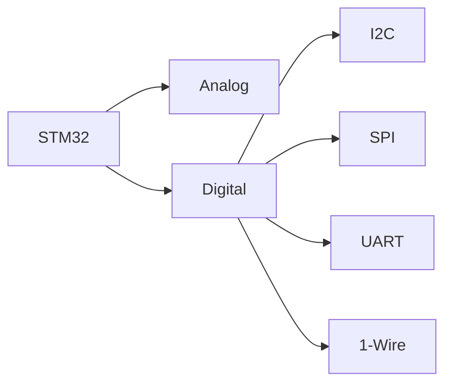

# STM32 Sensor Basics

## Introduction

Sensors are the bridge between the physical world and digital systems, allowing microcontrollers like the STM32 to perceive and interact with their environment. Whether you're building a weather station, a smart home device, or an industrial monitoring system, understanding how to integrate sensors with STM32 microcontrollers is a fundamental skill for embedded developers.

In this guide, we'll explore the basics of connecting various sensors to STM32 microcontrollers, understanding common communication protocols, and implementing basic sensor reading techniques. By the end, you'll have the knowledge to start integrating sensors into your own STM32-based projects.

## Understanding Sensors

### What is a Sensor?

A sensor is a device that detects changes in its environment and converts these changes into electrical signals that can be processed by a microcontroller. Sensors can measure a wide range of physical parameters:

- Temperature
- Humidity
- Pressure
- Light intensity
- Motion/acceleration
- Proximity
- Gas concentration
- Sound levels

### Sensor Characteristics

When working with sensors, it's important to understand their key specifications:

1. **Accuracy**: How close the measured value is to the actual value
2. **Precision**: The consistency of repeated measurements
3. **Range**: The minimum and maximum values a sensor can measure
4. **Resolution**: The smallest change a sensor can detect
5. **Response time**: How quickly a sensor responds to changes

## Common Sensor Interface Types

STM32 microcontrollers support various interface types for connecting sensors:



### Analog Sensors

Analog sensors output a continuous voltage that represents the measured physical quantity. These sensors require an Analog-to-Digital Converter (ADC) to convert the analog signal into a digital value that the microcontroller can process.

Examples of analog sensors include:
- Thermistors (temperature)
- Photoresistors (light)
- Potentiometers (position)
- Some gas sensors

### Digital Sensors

Digital sensors incorporate built-in signal processing and communicate with microcontrollers through digital protocols. They often provide more accurate readings and additional features compared to analog sensors.

Common digital communication protocols include:

1. **I2C (Inter-Integrated Circuit)**:
   - Uses just two wires (SCL and SDA)
   - Supports multiple sensors on the same bus
   - Generally operates at lower speeds (100kHz - 400kHz)

2. **SPI (Serial Peripheral Interface)**:
   - Faster than I2C
   - Uses more pins (MOSI, MISO, SCK, CS)
   - Good for high-speed data transfer

3. **UART (Universal Asynchronous Receiver/Transmitter)**:
   - Simple two-wire communication (TX and RX)
   - No clock signal, relies on predetermined baud rate
   - Typically used for longer-distance communication

4. **1-Wire**:
   - Uses a single wire for both power and data
   - Slower but requires minimal connections

## Setting Up the STM32 Development Environment

Before we start interfacing with sensors, let's ensure your development environment is properly configured.

### Required Tools

- An STM32 development board (e.g., Nucleo, Discovery)
- STM32CubeIDE or your preferred IDE
- ST-Link debugger (usually integrated into development boards)
- Jumper wires and breadboard
- Sensors for testing

### Basic Configuration Steps

1. Install STM32CubeIDE
2. Create a new STM32 project for your specific board
3. Configure the clock settings
4. Enable the peripherals needed for your sensor interface (GPIO, ADC, I2C, SPI, etc.)

## Reading from an Analog Sensor

Let's start with a simple example: reading temperature from an analog temperature sensor (like LM35) using the STM32's ADC.

### Hardware Connection

```
LM35 Temperature Sensor:
- VCC → 3.3V
- GND → GND
- OUT → PA0 (ADC1_IN0)
```

### Code Example

```c
#include "main.h"
#include "stdio.h"

ADC_HandleTypeDef hadc1;
UART_HandleTypeDef huart2;

void SystemClock_Config(void);
static void MX_GPIO_Init(void);
static void MX_ADC1_Init(void);
static void MX_USART2_UART_Init(void);

float readTemperature(void);

int main(void)
{
  /* MCU Configuration */
  HAL_Init();
  SystemClock_Config();
  
  /* Initialize peripherals */
  MX_GPIO_Init();
  MX_ADC1_Init();
  MX_USART2_UART_Init();
  
  /* Infinite loop */
  while (1)
  {
    float temperature = readTemperature();
    
    char msg[50];
    sprintf(msg, "Temperature: %.2f°C\r
", temperature);
    HAL_UART_Transmit(&huart2, (uint8_t*)msg, strlen(msg), HAL_MAX_DELAY);
    
    HAL_Delay(1000); // Read every second
  }
}

float readTemperature(void)
{
  uint32_t adcValue = 0;
  
  // Start ADC conversion
  HAL_ADC_Start(&hadc1);
  
  // Wait for conversion to complete
  if (HAL_ADC_PollForConversion(&hadc1, 100) == HAL_OK)
  {
    // Read ADC value
    adcValue = HAL_ADC_GetValue(&hadc1);
  }
  
  // Convert ADC value to voltage (mV)
  // For 12-bit ADC with 3.3V reference: 3300 mV / 4096 steps
  float voltage = (adcValue * 3300.0f) / 4096.0f;
  
  // Convert voltage to temperature (LM35: 10mV per °C)
  float temperature = voltage / 10.0f;
  
  return temperature;
}
```

### How It Works

1. The ADC peripheral is initialized to read from the channel connected to PA0
2. In an infinite loop, we:
   - Call `readTemperature()` function to get the current temperature
   - Format the temperature as a string and send it via UART for display
   - Wait for 1 second before the next reading

3. The `readTemperature()` function:
   - Starts an ADC conversion
   - Waits for the conversion to complete
   - Reads the raw ADC value
   - Converts the raw value to voltage in millivolts
   - Converts the voltage to temperature (LM35 outputs 10mV per °C)

### Expected Output

```
Temperature: 23.56°C
Temperature: 23.48°C
Temperature: 23.51°C
...
```

## Using a Digital Sensor with I2C

Now, let's explore how to interface with a digital sensor. The BME280 is a popular environmental sensor that measures temperature, humidity, and pressure using the I2C protocol.

### Hardware Connection

```
BME280 Sensor:
- VCC → 3.3V
- GND → GND
- SCL → PB8 (I2C1_SCL)
- SDA → PB9 (I2C1_SDA)
```

### Code Example

```c
#include "main.h"
#include "stdio.h"
#include "string.h"

I2C_HandleTypeDef hi2c1;
UART_HandleTypeDef huart2;

#define BME280_ADDRESS 0x76 << 1  // BME280 I2C address (shifted for HAL)
#define BME280_REG_ID 0xD0
#define BME280_ID 0x60

void SystemClock_Config(void);
static void MX_GPIO_Init(void);
static void MX_I2C1_Init(void);
static void MX_USART2_UART_Init(void);

uint8_t readBME280ID(void);

int main(void)
{
  /* MCU Configuration */
  HAL_Init();
  SystemClock_Config();
  
  /* Initialize peripherals */
  MX_GPIO_Init();
  MX_I2C1_Init();
  MX_USART2_UART_Init();
  
  /* Read BME280 ID to verify communication */
  uint8_t id = readBME280ID();
  
  char msg[50];
  if (id == BME280_ID)
  {
    sprintf(msg, "BME280 found! ID: 0x%02X\r
", id);
  }
  else
  {
    sprintf(msg, "BME280 not found! Read ID: 0x%02X\r
", id);
  }
  HAL_UART_Transmit(&huart2, (uint8_t*)msg, strlen(msg), HAL_MAX_DELAY);
  
  /* Infinite loop */
  while (1)
  {
    HAL_Delay(1000);
  }
}

uint8_t readBME280ID(void)
{
  uint8_t id = 0;
  uint8_t reg = BME280_REG_ID;
  
  // Send register address
  HAL_I2C_Master_Transmit(&hi2c1, BME280_ADDRESS, &reg, 1, HAL_MAX_DELAY);
  
  // Read register value
  HAL_I2C_Master_Receive(&hi2c1, BME280_ADDRESS, &id, 1, HAL_MAX_DELAY);
  
  return id;
}
```

### How It Works

1. The I2C peripheral is initialized to communicate with the BME280 sensor
2. We define a function `readBME280ID()` to read the sensor's ID register
3. In the main function, we read the ID and check if it matches the expected value
4. If the sensor is found, we display a success message; otherwise, we display an error message

### Expected Output

```
BME280 found! ID: 0x60
```

## Common Sensor Reading Patterns

When working with sensors, there are some common patterns you'll encounter:

### 1. Polling vs. Interrupt-Based Reading

**Polling**: Checking the sensor at regular intervals
```c
while (1)
{
  float sensorValue = readSensor();
  // Process the value
  HAL_Delay(1000);  // Wait for 1 second
}
```

**Interrupt-Based**: Sensor triggers an interrupt when new data is available
```c
// In initialization:
HAL_GPIO_EXTI_Callback(uint16_t GPIO_Pin)
{
  if (GPIO_Pin == SENSOR_INT_Pin)
  {
    // New sensor data available
    float sensorValue = readSensor();
    // Process the value
  }
}
```

### 2. One-Shot vs. Continuous Reading

**One-Shot**: Reading the sensor on demand
```c
float readSensorOneShot(void)
{
  // Configure sensor for one-shot measurement
  // Wait for measurement to complete
  // Read and return value
}
```

**Continuous**: Sensor continuously measures and updates its registers
```c
void initSensorContinuous(void)
{
  // Configure sensor for continuous measurement
}

float readSensorContinuous(void)
{
  // Just read the latest value from the sensor
}
```

### 3. Filtering and Noise Reduction

Using a simple moving average filter to reduce noise:
```c
#define FILTER_SIZE 10

float readFilteredSensor(void)
{
  static float values[FILTER_SIZE];
  static int index = 0;
  static int count = 0;
  
  // Read raw sensor value
  float rawValue = readSensor();
  
  // Add to filter buffer
  values[index] = rawValue;
  index = (index + 1) % FILTER_SIZE;
  if (count < FILTER_SIZE) count++;
  
  // Calculate average
  float sum = 0;
  for (int i = 0; i < count; i++)
  {
    sum += values[i];
  }
  
  return sum / count;
}
```

## Advanced Sensor Topics

### Sensor Fusion

Sensor fusion combines data from multiple sensors to achieve more accurate or comprehensive information. For example, combining accelerometer and gyroscope data can provide more accurate orientation information than either sensor alone.

```c
typedef struct {
  float accel_x, accel_y, accel_z;  // Accelerometer data
  float gyro_x, gyro_y, gyro_z;     // Gyroscope data
} SensorData;

float calculatePitch(SensorData *data)
{
  // Simple complementary filter
  static float pitch = 0;
  float accel_pitch = atan2f(data->accel_x, sqrtf(data->accel_y * data->accel_y + data->accel_z * data->accel_z)) * 180.0f / PI;
  
  // Integrate gyroscope data (dt = time between readings)
  float dt = 0.01f;  // 10ms
  pitch = 0.98f * (pitch + data->gyro_x * dt) + 0.02f * accel_pitch;
  
  return pitch;
}
```

### Low-Power Sensor Operation

For battery-powered applications, minimizing power consumption is crucial. Modern sensors often provide low-power modes:

```c
void configureSensorLowPower(void)
{
  // Example for a hypothetical sensor
  uint8_t configReg = 0;
  uint8_t data[2];
  
  // Read current configuration
  data[0] = CONFIG_REG_ADDR;
  HAL_I2C_Master_Transmit(&hi2c1, SENSOR_ADDR, data, 1, HAL_MAX_DELAY);
  HAL_I2C_Master_Receive(&hi2c1, SENSOR_ADDR, &configReg, 1, HAL_MAX_DELAY);
  
  // Set low power mode bit
  configReg |= LOW_POWER_MODE_BIT;
  
  // Write back configuration
  data[0] = CONFIG_REG_ADDR;
  data[1] = configReg;
  HAL_I2C_Master_Transmit(&hi2c1, SENSOR_ADDR, data, 2, HAL_MAX_DELAY);
}
```

## Real-World Application: Weather Station

Let's create a simple weather station using the STM32 and multiple sensors:

- BME280 for temperature, humidity, and pressure
- BH1750 for light intensity

### Hardware Connections

```
BME280:
- VCC → 3.3V
- GND → GND
- SCL → PB8 (I2C1_SCL)
- SDA → PB9 (I2C1_SDA)

BH1750:
- VCC → 3.3V
- GND → GND
- SCL → PB8 (I2C1_SCL)
- SDA → PB9 (I2C1_SDA)
```

Both sensors use I2C and can share the same bus.

### Code Structure

```c
// Weather station main components
typedef struct {
  float temperature;   // in °C
  float humidity;      // in %
  float pressure;      // in hPa
  float light;         // in lux
  uint32_t timestamp;  // in seconds since start
} WeatherData;

WeatherData readAllSensors(void);
void displayWeatherData(WeatherData *data);
void logWeatherData(WeatherData *data);

int main(void)
{
  // Initialize peripherals and sensors
  
  while (1)
  {
    WeatherData weather = readAllSensors();
    displayWeatherData(&weather);
    logWeatherData(&weather);
    
    HAL_Delay(60000);  // Update every minute
  }
}
```

## Troubleshooting Sensor Integration

When working with sensors, several common issues may arise:

### 1. No Response from Sensor

**Possible causes:**
- Incorrect wiring
- Wrong I2C/SPI address
- Power issues
- Damaged sensor

**Solutions:**
- Double-check connections
- Verify the sensor address
- Measure voltage at sensor pins
- Try a different sensor

### 2. Inconsistent or Noisy Readings

**Possible causes:**
- Electrical noise
- Incorrect voltage levels
- Poor sensor positioning
- Software timing issues

**Solutions:**
- Add filtering (hardware or software)
- Ensure proper power supply filtering
- Reposition the sensor
- Check for interference from other components

### 3. Sensor Communication Timeouts

**Possible causes:**
- Clock speed too high
- Pull-up resistors missing
- Bus contention
- Long cables

**Solutions:**
- Reduce clock speed
- Add appropriate pull-up resistors
- Check for other devices on the bus
- Use shorter cables or lower capacitance cables

## Summary

In this guide, we've covered the fundamentals of interfacing sensors with STM32 microcontrollers:

1. Understanding different types of sensors and their interfaces
2. Setting up the development environment
3. Reading data from analog sensors using the ADC
4. Communicating with digital sensors using I2C
5. Common patterns for sensor reading
6. Advanced topics like sensor fusion and low-power operation
7. A real-world application example
8. Troubleshooting sensor integration issues

Working with sensors is a gateway to creating embedded systems that can interact with the physical world. With the knowledge gained from this guide, you're now ready to incorporate sensors into your STM32 projects, enabling applications ranging from environmental monitoring to motion detection and beyond.

## Exercises

1. **Basic:** Connect an analog temperature sensor (like LM35) to your STM32 board and display the temperature readings via UART.

2. **Intermediate:** Interface with a digital sensor (like BME280) using I2C and create a simple data logger that records environmental data at regular intervals.

3. **Advanced:** Build a multi-sensor system that combines data from at least three different sensors, implements filtering to reduce noise, and provides a user interface to configure sampling rates and display modes.

4. **Challenge:** Implement a low-power weather station that wakes up at regular intervals, takes measurements, transmits the data wirelessly, and then returns to a deep sleep mode.

## Further Learning

To deepen your understanding of STM32 sensor integration, consider exploring these topics:

- DMA (Direct Memory Access) for efficient sensor data collection
- RTOS (Real-Time Operating System) for managing multiple sensors
- Sensor calibration techniques
- Advanced filtering algorithms
- Communication protocols for sending sensor data to the cloud