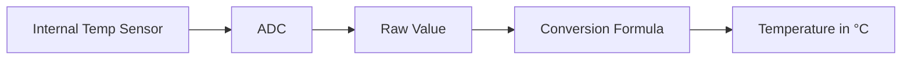

# STM32 Temperature Sensors

## Introduction

Temperature measurement is one of the most common sensing requirements in embedded systems. From environmental monitoring to thermal protection circuits, accurate temperature readings are essential for many applications. STM32 microcontrollers offer several ways to interface with temperature sensors, making them versatile for various temperature-sensing projects.

In this guide, we'll explore how to integrate different types of temperature sensors with STM32 microcontrollers. We'll cover both the internal temperature sensor that comes built into many STM32 chips and how to connect external temperature sensors through various interfaces.

## Internal Temperature Sensor

Most STM32 microcontrollers come with a built-in temperature sensor that can be accessed through the Analog-to-Digital Converter (ADC). This sensor provides a convenient way to monitor the chip's temperature without any external components.

### How the Internal Temperature Sensor Works

The internal temperature sensor produces a voltage that varies linearly with temperature. This voltage is read using the ADC, and then converted to a temperature value using a calibration formula.



### Enabling the Internal Temperature Sensor

To use the internal temperature sensor in STM32 microcontrollers, you need to:

1. Enable the ADC clock
2. Configure the ADC
3. Enable the internal temperature sensor
4. Read and convert the temperature value

Here's a step-by-step example using the STM32F4 series with HAL libraries:

```c
#include "stm32f4xx_hal.h"

ADC_HandleTypeDef hadc1;

void SystemClock_Config(void);
static void MX_ADC1_Init(void);
float Get_InternalTemperature(void);

int main(void)
{
  /* MCU Configuration */
  HAL_Init();
  SystemClock_Config();
  
  /* Initialize ADC */
  MX_ADC1_Init();
  
  float temperature;
  
  while (1)
  {
    /* Get temperature value */
    temperature = Get_InternalTemperature();
    
    /* Do something with the temperature value */
    
    HAL_Delay(1000);
  }
}

static void MX_ADC1_Init(void)
{
  ADC_ChannelConfTypeDef sConfig = {0};

  /* Configure the ADC peripheral */
  hadc1.Instance = ADC1;
  hadc1.Init.ClockPrescaler = ADC_CLOCK_SYNC_PCLK_DIV4;
  hadc1.Init.Resolution = ADC_RESOLUTION_12B;
  hadc1.Init.ScanConvMode = DISABLE;
  hadc1.Init.ContinuousConvMode = DISABLE;
  hadc1.Init.DiscontinuousConvMode = DISABLE;
  hadc1.Init.ExternalTrigConvEdge = ADC_EXTERNALTRIGCONVEDGE_NONE;
  hadc1.Init.ExternalTrigConv = ADC_SOFTWARE_START;
  hadc1.Init.DataAlign = ADC_DATAALIGN_RIGHT;
  hadc1.Init.NbrOfConversion = 1;
  hadc1.Init.DMAContinuousRequests = DISABLE;
  HAL_ADC_Init(&hadc1);

  /* Configure for the selected ADC regular channel to be converted */
  sConfig.Channel = ADC_CHANNEL_TEMPSENSOR;
  sConfig.Rank = 1;
  sConfig.SamplingTime = ADC_SAMPLETIME_480CYCLES;
  HAL_ADC_ConfigChannel(&hadc1, &sConfig);
}

float Get_InternalTemperature(void)
{
  uint32_t adcValue = 0;
  float temperature;
  
  /* Enable temperature sensor */
  ADC->CCR |= ADC_CCR_TSVREFE;
  
  /* Start ADC conversion */
  HAL_ADC_Start(&hadc1);
  
  /* Wait for conversion complete */
  HAL_ADC_PollForConversion(&hadc1, HAL_MAX_DELAY);
  
  /* Get ADC value */
  adcValue = HAL_ADC_GetValue(&hadc1);
  
  /* Convert ADC value to temperature (°C) */
  // For STM32F4, the formula is:
  // Temperature (°C) = ((V_SENSE - V_25) / Avg_Slope) + 25
  // where:
  // V_SENSE = ADC value * (3.3/4096)
  // V_25 = 0.76V (typical value at 25°C)
  // Avg_Slope = 2.5 mV/°C

  float V_SENSE = (float)adcValue * (3.3 / 4096);
  float V_25 = 0.76;
  float Avg_Slope = 0.0025;
  
  temperature = ((V_SENSE - V_25) / Avg_Slope) + 25;
  
  return temperature;
}
```

### Example Output

When running this code, you might see output like:

```
Internal Temperature: 32.5°C
Internal Temperature: 32.7°C
Internal Temperature: 33.1°C
```

### Limitations of the Internal Sensor

While convenient, the internal temperature sensor has some limitations:

- **Accuracy**: Typically ±1.5°C, which may not be sufficient for precise applications
- **Range**: Usually limited to operating temperature of the chip (typically -40°C to 85°C)
- **Self-heating**: The sensor measures the die temperature, which can be affected by the chip's own operation

## External Temperature Sensors

For more accurate or specialized temperature measurements, external sensors can be interfaced with STM32 microcontrollers. Here are some common types:

### 1. Digital Temperature Sensors (I2C/SPI)

Digital temperature sensors like the DS18B20, LM75, or TMP102 provide higher accuracy and can be connected via I2C or SPI interfaces.

#### Example: Interfacing with DS18B20 (1-Wire Protocol)

The DS18B20 is a popular digital temperature sensor that uses the 1-Wire protocol. Here's how to interface it with an STM32:

```c
#include "stm32f4xx_hal.h"
#include "ds18b20.h"  // Custom library for DS18B20

GPIO_InitTypeDef GPIO_InitStruct = {0};
uint8_t DS18B20_Init(void);
float DS18B20_ReadTemp(void);

int main(void)
{
  /* MCU Configuration */
  HAL_Init();
  SystemClock_Config();
  
  /* Initialize DS18B20 */
  if (DS18B20_Init() != HAL_OK)
  {
    /* Error handling */
    Error_Handler();
  }
  
  float temperature;
  
  while (1)
  {
    /* Read temperature from DS18B20 */
    temperature = DS18B20_ReadTemp();
    
    /* Process the temperature value */
    
    HAL_Delay(1000);
  }
}

/* Custom implementation of DS18B20 functions */
/* Note: This is a simplified example. A complete implementation would require 
   bit-banging the 1-Wire protocol or using a dedicated library */
```

#### Example: Interfacing with LM75 (I2C)

The LM75 is an I2C temperature sensor that offers good accuracy and simple interfacing:

```c
#include "stm32f4xx_hal.h"

I2C_HandleTypeDef hi2c1;

#define LM75_ADDR        0x48 << 1    // LM75 address (0x48) shifted left
#define LM75_TEMP_REG    0x00         // Temperature register

void SystemClock_Config(void);
static void MX_I2C1_Init(void);
float LM75_ReadTemperature(void);

int main(void)
{
  /* MCU Configuration */
  HAL_Init();
  SystemClock_Config();
  
  /* Initialize I2C */
  MX_I2C1_Init();
  
  float temperature;
  
  while (1)
  {
    /* Read temperature from LM75 */
    temperature = LM75_ReadTemperature();
    
    /* Process the temperature value */
    
    HAL_Delay(1000);
  }
}

static void MX_I2C1_Init(void)
{
  hi2c1.Instance = I2C1;
  hi2c1.Init.ClockSpeed = 100000;
  hi2c1.Init.DutyCycle = I2C_DUTYCYCLE_2;
  hi2c1.Init.OwnAddress1 = 0;
  hi2c1.Init.AddressingMode = I2C_ADDRESSINGMODE_7BIT;
  hi2c1.Init.DualAddressMode = I2C_DUALADDRESS_DISABLE;
  hi2c1.Init.OwnAddress2 = 0;
  hi2c1.Init.GeneralCallMode = I2C_GENERALCALL_DISABLE;
  hi2c1.Init.NoStretchMode = I2C_NOSTRETCH_DISABLE;
  HAL_I2C_Init(&hi2c1);
}

float LM75_ReadTemperature(void)
{
  uint8_t buffer[2];
  int16_t raw;
  float temperature;
  
  /* Read 2 bytes from temperature register */
  HAL_I2C_Mem_Read(&hi2c1, LM75_ADDR, LM75_TEMP_REG, I2C_MEMADD_SIZE_8BIT, buffer, 2, HAL_MAX_DELAY);
  
  /* Convert the data */
  raw = (buffer[0] << 8) | buffer[1];
  raw = raw >> 5;  // The LM75 gives 11-bit resolution
  
  /* Convert to temperature in Celsius */
  temperature = (float)raw * 0.125;  // Each bit represents 0.125°C
  
  return temperature;
}
```

### 2. Analog Temperature Sensors

Analog sensors like thermistors and thermocouples can be connected to STM32's ADC inputs.

#### Example: Using an NTC Thermistor

NTC (Negative Temperature Coefficient) thermistors change resistance based on temperature. By using a voltage divider circuit and the ADC, we can measure temperature:

```c
#include "stm32f4xx_hal.h"
#include <math.h>  // For log function

ADC_HandleTypeDef hadc1;

/* Thermistor parameters */
#define THERMISTOR_R25    10000.0f  // Resistance at 25°C (10kΩ)
#define THERMISTOR_B      3950.0f   // B-coefficient of the thermistor
#define PULLUP_R          10000.0f  // Pull-up resistor value

void SystemClock_Config(void);
static void MX_ADC1_Init(void);
float Calculate_NTC_Temperature(uint16_t adc_value);

int main(void)
{
  /* MCU Configuration */
  HAL_Init();
  SystemClock_Config();
  
  /* Initialize ADC */
  MX_ADC1_Init();
  
  uint16_t adc_value;
  float temperature;
  
  while (1)
  {
    /* Start ADC conversion */
    HAL_ADC_Start(&hadc1);
    
    /* Wait for conversion complete */
    HAL_ADC_PollForConversion(&hadc1, HAL_MAX_DELAY);
    
    /* Get ADC value */
    adc_value = HAL_ADC_GetValue(&hadc1);
    
    /* Calculate temperature */
    temperature = Calculate_NTC_Temperature(adc_value);
    
    /* Process the temperature value */
    
    HAL_Delay(1000);
  }
}

static void MX_ADC1_Init(void)
{
  ADC_ChannelConfTypeDef sConfig = {0};

  /* Configure the ADC peripheral */
  hadc1.Instance = ADC1;
  hadc1.Init.ClockPrescaler = ADC_CLOCK_SYNC_PCLK_DIV4;
  hadc1.Init.Resolution = ADC_RESOLUTION_12B;
  hadc1.Init.ScanConvMode = DISABLE;
  hadc1.Init.ContinuousConvMode = DISABLE;
  hadc1.Init.DiscontinuousConvMode = DISABLE;
  hadc1.Init.ExternalTrigConvEdge = ADC_EXTERNALTRIGCONVEDGE_NONE;
  hadc1.Init.ExternalTrigConv = ADC_SOFTWARE_START;
  hadc1.Init.DataAlign = ADC_DATAALIGN_RIGHT;
  hadc1.Init.NbrOfConversion = 1;
  hadc1.Init.DMAContinuousRequests = DISABLE;
  HAL_ADC_Init(&hadc1);

  /* Configure for the selected ADC regular channel (PA0) to be converted */
  sConfig.Channel = ADC_CHANNEL_0;
  sConfig.Rank = 1;
  sConfig.SamplingTime = ADC_SAMPLETIME_480CYCLES;
  HAL_ADC_ConfigChannel(&hadc1, &sConfig);
}

float Calculate_NTC_Temperature(uint16_t adc_value)
{
  float voltage, resistance, temperature;
  
  /* Calculate voltage from ADC value */
  voltage = (float)adc_value * (3.3f / 4095.0f);
  
  /* Calculate resistance of thermistor */
  resistance = PULLUP_R * (3.3f - voltage) / voltage;
  
  /* Calculate temperature using B-equation */
  /* T = 1 / (1/T0 + (1/B) * ln(R/R0)) */
  temperature = 1.0f / (1.0f / (273.15f + 25.0f) + (1.0f / THERMISTOR_B) * log(resistance / THERMISTOR_R25));
  
  /* Convert from Kelvin to Celsius */
  temperature -= 273.15f;
  
  return temperature;
}
```

## Communication and Display

Once you've successfully read temperature data, you often need to communicate it to other systems or display it to users. Here are some common approaches:

### 1. Serial Communication (UART)

Sending temperature data to a computer or another device via UART:

```c
/* Add this to your main loop */
char buffer[50];
sprintf(buffer, "Temperature: %.2f°C\r
", temperature);
HAL_UART_Transmit(&huart2, (uint8_t*)buffer, strlen(buffer), HAL_MAX_DELAY);
```

### 2. Display on LCD

Displaying temperature on an LCD (using HD44780 LCD as an example):

```c
/* Assuming you have an LCD_Init() and LCD_Print() function */
LCD_Init();

/* In your main loop */
char buffer[16];
sprintf(buffer, "Temp: %.1f C", temperature);
LCD_SetCursor(0, 0);
LCD_Print(buffer);
```

## Practical Applications

### 1. Simple Thermostat

Here's a basic thermostat implementation that controls an output pin based on temperature:

```c
#include "stm32f4xx_hal.h"

#define TEMP_THRESHOLD   25.0f  // Temperature threshold in Celsius
#define RELAY_PIN        GPIO_PIN_5
#define RELAY_PORT       GPIOA

float Get_InternalTemperature(void);  // Assuming this function exists

int main(void)
{
  /* MCU Configuration */
  HAL_Init();
  SystemClock_Config();
  
  /* Configure GPIO for relay control */
  GPIO_InitTypeDef GPIO_InitStruct = {0};
  __HAL_RCC_GPIOA_CLK_ENABLE();
  GPIO_InitStruct.Pin = RELAY_PIN;
  GPIO_InitStruct.Mode = GPIO_MODE_OUTPUT_PP;
  GPIO_InitStruct.Pull = GPIO_NOPULL;
  GPIO_InitStruct.Speed = GPIO_SPEED_FREQ_LOW;
  HAL_GPIO_Init(RELAY_PORT, &GPIO_InitStruct);
  
  float temperature;
  
  while (1)
  {
    /* Get temperature */
    temperature = Get_InternalTemperature();
    
    /* Simple thermostat logic */
    if (temperature > TEMP_THRESHOLD)
    {
      /* Turn on cooling (or turn off heating) */
      HAL_GPIO_WritePin(RELAY_PORT, RELAY_PIN, GPIO_PIN_SET);
    }
    else
    {
      /* Turn off cooling (or turn on heating) */
      HAL_GPIO_WritePin(RELAY_PORT, RELAY_PIN, GPIO_PIN_RESET);
    }
    
    HAL_Delay(1000);
  }
}
```

### 2. Temperature Data Logger

This example logs temperature data to an SD card using FatFS:

```c
#include "stm32f4xx_hal.h"
#include "fatfs.h"
#include "rtc.h"  // For timestamp

extern FATFS SDFatFS;    /* File system object for SD card logical drive */
extern FIL SDFile;       /* File object */
extern RTC_HandleTypeDef hrtc;

float Get_Temperature(void);  // Assuming this function exists

int main(void)
{
  /* MCU Configuration */
  HAL_Init();
  SystemClock_Config();
  
  /* Initialize peripherals */
  MX_FATFS_Init();  // Initialize SD card and file system
  MX_RTC_Init();    // Initialize RTC for timestamps
  
  /* Mount SD card */
  if(f_mount(&SDFatFS, "", 1) != FR_OK)
  {
    Error_Handler();
  }
  
  /* Create or open log file */
  if(f_open(&SDFile, "templog.csv", FA_OPEN_ALWAYS | FA_WRITE | FA_READ) != FR_OK)
  {
    Error_Handler();
  }
  
  /* If file is new, add CSV header */
  if(f_size(&SDFile) == 0)
  {
    f_puts("Date,Time,Temperature(C)\r
", &SDFile);
  }
  else
  {
    /* Move to end of file for appending */
    f_lseek(&SDFile, f_size(&SDFile));
  }
  
  while (1)
  {
    float temperature = Get_Temperature();
    
    /* Get current time */
    RTC_TimeTypeDef time;
    RTC_DateTypeDef date;
    HAL_RTC_GetTime(&hrtc, &time, RTC_FORMAT_BIN);
    HAL_RTC_GetDate(&hrtc, &date, RTC_FORMAT_BIN);
    
    /* Format log entry */
    char buffer[64];
    sprintf(buffer, "%02d/%02d/%02d,%02d:%02d:%02d,%.2f\r
",
            date.Date, date.Month, date.Year,
            time.Hours, time.Minutes, time.Seconds,
            temperature);
    
    /* Write to file */
    f_puts(buffer, &SDFile);
    f_sync(&SDFile);
    
    HAL_Delay(60000);  // Log once per minute
  }
}
```

## Best Practices for Temperature Sensing

1. **Calibration**: For accurate readings, calibrate your sensors against a known reference.

2. **Filtering**: Use averaging or digital filters to reduce noise in temperature readings:

```c
/* Simple moving average filter */
#define FILTER_SIZE 10
float temp_buffer[FILTER_SIZE];
uint8_t buffer_index = 0;

float filtered_temperature = 0.0f;

/* In your main loop */
temperature = Get_Temperature();
temp_buffer[buffer_index] = temperature;
buffer_index = (buffer_index + 1) % FILTER_SIZE;

/* Calculate average */
filtered_temperature = 0.0f;
for(int i = 0; i < FILTER_SIZE; i++)
{
  filtered_temperature += temp_buffer[i];
}
filtered_temperature /= FILTER_SIZE;
```

3. **Error Handling**: Always check for sensor connection issues or reading errors.

4. **Low Power**: For battery-powered applications, put the MCU to sleep between readings.

## Summary

In this guide, we've covered:

- Using the STM32's internal temperature sensor
- Interfacing with external digital temperature sensors (DS18B20, LM75)
- Working with analog temperature sensors (NTC thermistors)
- Communicating temperature data via UART and displaying it on an LCD
- Building practical applications like a thermostat and a data logger
- Best practices for accurate and reliable temperature sensing

Temperature sensing is a fundamental capability in many embedded systems projects. With STM32 microcontrollers, you have the flexibility to choose from internal sensors for basic monitoring or external sensors for more precise measurements. The examples provided should give you a solid foundation to build your own temperature-based applications.

## Exercises

1. Modify the internal temperature sensor example to display the temperature on an LCD.
2. Create a temperature monitor that triggers an alarm (LED or buzzer) when the temperature exceeds a threshold.
3. Implement a temperature sensor system that uses two different sensors and compares their readings for error detection.
4. Extend the data logger example to include humidity readings alongside temperature (using a sensor like DHT11 or DHT22).
5. Design a web server on an STM32 with Ethernet capability that reports temperature data via a simple web page.

## Additional Resources

- STM32 ADC and Temperature Sensor Application Notes (AN3964)
- DS18B20, LM75, and other temperature sensor datasheets
- STM32 HAL Documentation
- STM32CubeIDE or STM32CubeMX for project setup and code generation