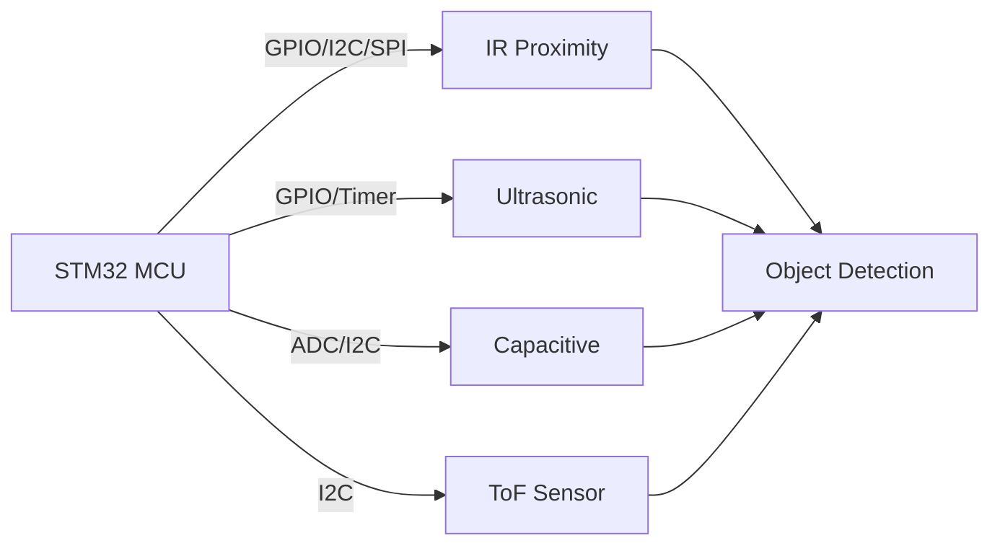
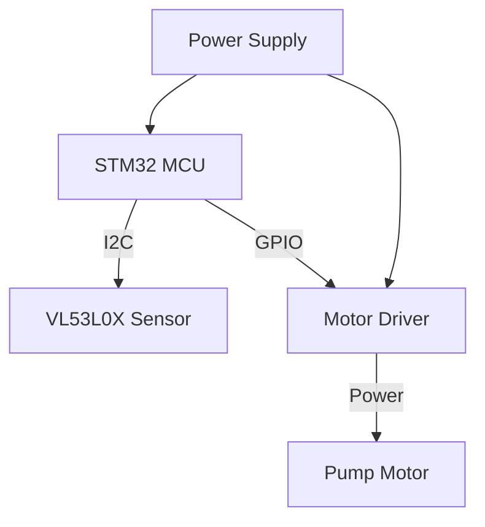

# STM32 Proximity Sensors

## Introduction

Proximity sensors are crucial components in many modern electronic systems, allowing devices to detect the presence of nearby objects without physical contact. When integrated with STM32 microcontrollers, these sensors can power a wide range of applications from simple object detection to complex gesture recognition systems.

In this tutorial, we'll explore how to connect, configure, and use various proximity sensors with STM32 microcontrollers. By the end, you'll understand the fundamentals of proximity sensing and be able to implement basic proximity detection in your own STM32 projects.

## Types of Proximity Sensors Compatible with STM32

Several types of proximity sensors can be integrated with STM32 microcontrollers:

1. **Infrared (IR) Proximity Sensors**: Detect objects by emitting and receiving infrared light
2. **Ultrasonic Sensors**: Use sound waves to detect objects
3. **Capacitive Sensors**: Detect changes in electrical capacitance
4. **Time-of-Flight (ToF) Sensors**: Measure the time it takes for light to bounce back from an object

Let's visualize how these different sensors work with STM32:



## Hardware Requirements

To follow this tutorial, you'll need:

- STM32 development board (F4 or L4 series recommended)
- Proximity sensor (we'll use VL53L0X ToF sensor and APDS-9960 IR proximity sensor as examples)
- Breadboard and jumper wires
- USB cable for programming the STM32
- STM32CubeIDE installed on your computer

## Basic IR Proximity Sensor Integration

Let's start with a simple IR proximity sensor integration. We'll use a basic IR proximity sensor that outputs a digital signal when an object is detected.

### Hardware Connection

Connect your IR proximity sensor to the STM32 as follows:

- VCC → 3.3V
- GND → GND
- OUT → PA0 (or any available GPIO pin)

### Software Implementation

First, we need to configure the GPIO pin to read the sensor output:

```c
/* Configure GPIO pin for proximity sensor */
void ProximitySensor_Init(void)
{
  GPIO_InitTypeDef GPIO_InitStruct = {0};
  
  /* Enable GPIOA clock */
  __HAL_RCC_GPIOA_CLK_ENABLE();
  
  /* Configure GPIO pin : PA0 */
  GPIO_InitStruct.Pin = GPIO_PIN_0;
  GPIO_InitStruct.Mode = GPIO_MODE_INPUT;
  GPIO_InitStruct.Pull = GPIO_PULLUP;
  HAL_GPIO_Init(GPIOA, &GPIO_InitStruct);
}
```

Now, we can read the sensor status with a simple function:

```c
/* Read proximity sensor status */
uint8_t ProximitySensor_Read(void)
{
  /* Return 1 if object detected, 0 otherwise */
  /* Note: Logic may be inverted depending on your sensor */
  return (HAL_GPIO_ReadPin(GPIOA, GPIO_PIN_0) == GPIO_PIN_RESET) ? 1 : 0;
}
```

### Simple Demo Application

Here's a complete example that toggles an LED when an object is detected:

```c
#include "main.h"

/* Private function prototypes */
void SystemClock_Config(void);
void ProximitySensor_Init(void);
uint8_t ProximitySensor_Read(void);

int main(void)
{
  /* MCU Configuration */
  HAL_Init();
  SystemClock_Config();
  
  /* Initialize LED pin (using the onboard LED) */
  __HAL_RCC_GPIOA_CLK_ENABLE();
  GPIO_InitTypeDef GPIO_InitStruct = {0};
  GPIO_InitStruct.Pin = GPIO_PIN_5;  // Assuming LED on PA5 (common on many STM32 boards)
  GPIO_InitStruct.Mode = GPIO_MODE_OUTPUT_PP;
  GPIO_InitStruct.Pull = GPIO_NOPULL;
  GPIO_InitStruct.Speed = GPIO_SPEED_FREQ_LOW;
  HAL_GPIO_Init(GPIOA, &GPIO_InitStruct);
  
  /* Initialize proximity sensor */
  ProximitySensor_Init();
  
  /* Infinite loop */
  while (1)
  {
    /* Check if object is detected */
    if (ProximitySensor_Read())
    {
      /* Object detected, turn on LED */
      HAL_GPIO_WritePin(GPIOA, GPIO_PIN_5, GPIO_PIN_SET);
    }
    else
    {
      /* No object detected, turn off LED */
      HAL_GPIO_WritePin(GPIOA, GPIO_PIN_5, GPIO_PIN_RESET);
    }
    
    /* Small delay */
    HAL_Delay(100);
  }
}
```

## Advanced Proximity Sensing: VL53L0X Time-of-Flight Sensor

For more accurate distance measurements, let's use the VL53L0X Time-of-Flight (ToF) sensor from ST Microelectronics, which is perfectly suited for STM32 integration.

### Hardware Connection

The VL53L0X uses I2C for communication:

- VCC → 3.3V
- GND → GND
- SCL → PB8 (I2C1_SCL)
- SDA → PB9 (I2C1_SDA)
- XSHUT → PA1 (optional, for shutdown control)

### I2C Configuration

First, configure the I2C peripheral:

```c
/* I2C handle */
I2C_HandleTypeDef hi2c1;

/* Configure I2C for VL53L0X sensor */
void VL53L0X_I2C_Init(void)
{
  hi2c1.Instance = I2C1;
  hi2c1.Init.Timing = 0x10909CEC; // 100 kHz for STM32F4 at 84 MHz
  hi2c1.Init.OwnAddress1 = 0;
  hi2c1.Init.AddressingMode = I2C_ADDRESSINGMODE_7BIT;
  hi2c1.Init.DualAddressMode = I2C_DUALADDRESS_DISABLE;
  hi2c1.Init.OwnAddress2 = 0;
  hi2c1.Init.GeneralCallMode = I2C_GENERALCALL_DISABLE;
  hi2c1.Init.NoStretchMode = I2C_NOSTRETCH_DISABLE;
  
  /* Initialize I2C */
  if (HAL_I2C_Init(&hi2c1) != HAL_OK)
  {
    Error_Handler();
  }
  
  /* Configure GPIO pins for I2C */
  GPIO_InitTypeDef GPIO_InitStruct = {0};
  
  __HAL_RCC_GPIOB_CLK_ENABLE();
  
  GPIO_InitStruct.Pin = GPIO_PIN_8|GPIO_PIN_9;
  GPIO_InitStruct.Mode = GPIO_MODE_AF_OD;
  GPIO_InitStruct.Pull = GPIO_PULLUP;
  GPIO_InitStruct.Speed = GPIO_SPEED_FREQ_VERY_HIGH;
  GPIO_InitStruct.Alternate = GPIO_AF4_I2C1;
  HAL_GPIO_Init(GPIOB, &GPIO_InitStruct);
}
```

### Using the VL53L0X Library

ST provides a library for the VL53L0X that makes it easy to use. Here's how to initialize and use the sensor:

```c
#include "vl53l0x_api.h"

/* VL53L0X device structure */
VL53L0X_Dev_t VL53L0XDev;

/* Initialize VL53L0X sensor */
uint8_t VL53L0X_Init(void)
{
  uint8_t status = VL53L0X_ERROR_NONE;
  uint32_t refSpadCount;
  uint8_t isApertureSpads;
  uint8_t VhvSettings;
  uint8_t PhaseCal;
  
  /* Initialize I2C */
  VL53L0X_I2C_Init();
  
  /* Data initialization */
  VL53L0XDev.I2cDevAddr = 0x52; // Default address
  VL53L0XDev.comms_type = 1;    // I2C communication
  VL53L0XDev.comms_speed_khz = 100;
  
  /* VL53L0X initialization */
  status = VL53L0X_DataInit(&VL53L0XDev);
  if (status != VL53L0X_ERROR_NONE) return status;
  
  /* Perform reference SPAD calibration */
  status = VL53L0X_PerformRefSpadManagement(&VL53L0XDev, &refSpadCount, &isApertureSpads);
  if (status != VL53L0X_ERROR_NONE) return status;
  
  /* Perform reference calibration */
  status = VL53L0X_PerformRefCalibration(&VL53L0XDev, &VhvSettings, &PhaseCal);
  if (status != VL53L0X_ERROR_NONE) return status;
  
  /* Set measurement mode */
  status = VL53L0X_SetDeviceMode(&VL53L0XDev, VL53L0X_DEVICEMODE_SINGLE_RANGING);
  if (status != VL53L0X_ERROR_NONE) return status;
  
  /* Enable sigma check */
  status = VL53L0X_SetLimitCheckEnable(&VL53L0XDev, VL53L0X_CHECKENABLE_SIGMA_FINAL_RANGE, 1);
  if (status != VL53L0X_ERROR_NONE) return status;
  
  /* Set sigma limit */
  status = VL53L0X_SetLimitCheckValue(&VL53L0XDev, VL53L0X_CHECKENABLE_SIGMA_FINAL_RANGE, (FixPoint1616_t)(18 * 65536));
  if (status != VL53L0X_ERROR_NONE) return status;
  
  /* Enable range check */
  status = VL53L0X_SetLimitCheckEnable(&VL53L0XDev, VL53L0X_CHECKENABLE_RANGE_IGNORE_THRESHOLD, 1);
  if (status != VL53L0X_ERROR_NONE) return status;
  
  /* Set timing budget */
  status = VL53L0X_SetMeasurementTimingBudgetMicroSeconds(&VL53L0XDev, 33000);
  if (status != VL53L0X_ERROR_NONE) return status;
  
  return status;
}

/* Measure distance using VL53L0X */
uint16_t VL53L0X_MeasureDistance(void)
{
  VL53L0X_RangingMeasurementData_t rangingData;
  uint8_t status;
  
  /* Start measurement */
  status = VL53L0X_PerformSingleRangingMeasurement(&VL53L0XDev, &rangingData);
  
  if (status == VL53L0X_ERROR_NONE && rangingData.RangeStatus == 0)
  {
    /* Return distance in millimeters */
    return rangingData.RangeMilliMeter;
  }
  else
  {
    /* Return 0 if measurement failed */
    return 0;
  }
}
```

### Distance Threshold Example

Here's how to implement a proximity threshold detection using the VL53L0X:

```c
#include "main.h"
#include "vl53l0x_api.h"

/* Define distance threshold in mm */
#define PROXIMITY_THRESHOLD 150

int main(void)
{
  /* MCU Configuration */
  HAL_Init();
  SystemClock_Config();
  
  /* Initialize LED */
  __HAL_RCC_GPIOA_CLK_ENABLE();
  GPIO_InitTypeDef GPIO_InitStruct = {0};
  GPIO_InitStruct.Pin = GPIO_PIN_5;
  GPIO_InitStruct.Mode = GPIO_MODE_OUTPUT_PP;
  GPIO_InitStruct.Pull = GPIO_NOPULL;
  GPIO_InitStruct.Speed = GPIO_SPEED_FREQ_LOW;
  HAL_GPIO_Init(GPIOA, &GPIO_InitStruct);
  
  /* Initialize VL53L0X sensor */
  if (VL53L0X_Init() != VL53L0X_ERROR_NONE)
  {
    /* Error handling - blink LED rapidly */
    while (1)
    {
      HAL_GPIO_TogglePin(GPIOA, GPIO_PIN_5);
      HAL_Delay(100);
    }
  }
  
  /* Main loop */
  while (1)
  {
    /* Measure distance */
    uint16_t distance = VL53L0X_MeasureDistance();
    
    /* Check if object is within proximity threshold */
    if (distance > 0 && distance < PROXIMITY_THRESHOLD)
    {
      /* Object detected within threshold, turn on LED */
      HAL_GPIO_WritePin(GPIOA, GPIO_PIN_5, GPIO_PIN_SET);
    }
    else
    {
      /* No object detected or too far, turn off LED */
      HAL_GPIO_WritePin(GPIOA, GPIO_PIN_5, GPIO_PIN_RESET);
    }
    
    /* Small delay */
    HAL_Delay(100);
  }
}
```

## APDS-9960 Gesture and Proximity Sensor

The APDS-9960 is a versatile sensor that can detect proximity, ambient light, color, and gestures. Let's focus on its proximity sensing capabilities with STM32.

### Hardware Connection

Connect the APDS-9960 to STM32:

- VCC → 3.3V
- GND → GND
- SCL → PB8 (I2C1_SCL)
- SDA → PB9 (I2C1_SDA)
- INT → PA2 (for interrupt-based detection, optional)

### APDS-9960 Proximity Detection

Here's a basic implementation for proximity detection using the APDS-9960:

```c
#include "main.h"

/* I2C handle */
I2C_HandleTypeDef hi2c1;

/* APDS-9960 registers */
#define APDS9960_ADDRESS           0x39
#define APDS9960_ID                0xAB
#define APDS9960_REG_ID            0x92
#define APDS9960_REG_ENABLE        0x80
#define APDS9960_REG_PROXIMITY     0x9C
#define APDS9960_REG_CONTROL       0x8F
#define APDS9960_REG_CONFIG2       0x90
#define APDS9960_REG_POFFSET_UR    0x9D
#define APDS9960_REG_POFFSET_DL    0x9E
#define APDS9960_REG_CONFIG3       0x9F

/* APDS-9960 bit masks */
#define APDS9960_ENABLE_PON        0x01
#define APDS9960_ENABLE_PEN        0x04

/* Initialize I2C for APDS-9960 */
void APDS9960_I2C_Init(void)
{
  hi2c1.Instance = I2C1;
  hi2c1.Init.Timing = 0x10909CEC;
  hi2c1.Init.OwnAddress1 = 0;
  hi2c1.Init.AddressingMode = I2C_ADDRESSINGMODE_7BIT;
  hi2c1.Init.DualAddressMode = I2C_DUALADDRESS_DISABLE;
  hi2c1.Init.OwnAddress2 = 0;
  hi2c1.Init.GeneralCallMode = I2C_GENERALCALL_DISABLE;
  hi2c1.Init.NoStretchMode = I2C_NOSTRETCH_DISABLE;
  
  if (HAL_I2C_Init(&hi2c1) != HAL_OK)
  {
    Error_Handler();
  }
  
  /* Configure GPIO pins for I2C */
  GPIO_InitTypeDef GPIO_InitStruct = {0};
  
  __HAL_RCC_GPIOB_CLK_ENABLE();
  
  GPIO_InitStruct.Pin = GPIO_PIN_8|GPIO_PIN_9;
  GPIO_InitStruct.Mode = GPIO_MODE_AF_OD;
  GPIO_InitStruct.Pull = GPIO_PULLUP;
  GPIO_InitStruct.Speed = GPIO_SPEED_FREQ_VERY_HIGH;
  GPIO_InitStruct.Alternate = GPIO_AF4_I2C1;
  HAL_GPIO_Init(GPIOB, &GPIO_InitStruct);
}

/* Write to APDS-9960 register */
HAL_StatusTypeDef APDS9960_Write(uint8_t reg, uint8_t data)
{
  uint8_t buf[2];
  buf[0] = reg;
  buf[1] = data;
  return HAL_I2C_Master_Transmit(&hi2c1, APDS9960_ADDRESS << 1, buf, 2, 100);
}

/* Read from APDS-9960 register */
HAL_StatusTypeDef APDS9960_Read(uint8_t reg, uint8_t *data)
{
  HAL_StatusTypeDef status;
  
  status = HAL_I2C_Master_Transmit(&hi2c1, APDS9960_ADDRESS << 1, &reg, 1, 100);
  if (status != HAL_OK) return status;
  
  return HAL_I2C_Master_Receive(&hi2c1, APDS9960_ADDRESS << 1, data, 1, 100);
}

/* Initialize APDS-9960 for proximity detection */
uint8_t APDS9960_Init(void)
{
  uint8_t id;
  
  /* Initialize I2C */
  APDS9960_I2C_Init();
  
  /* Check device ID */
  if (APDS9960_Read(APDS9960_REG_ID, &id) != HAL_OK || id != APDS9960_ID)
  {
    return 0; // Failed to communicate or wrong ID
  }
  
  /* Disable all features */
  if (APDS9960_Write(APDS9960_REG_ENABLE, 0) != HAL_OK)
  {
    return 0;
  }
  
  /* Set proximity gain */
  if (APDS9960_Write(APDS9960_REG_CONTROL, 0x20) != HAL_OK) // 4x gain
  {
    return 0;
  }
  
  /* Enable proximity detection */
  if (APDS9960_Write(APDS9960_REG_ENABLE, APDS9960_ENABLE_PON | APDS9960_ENABLE_PEN) != HAL_OK)
  {
    return 0;
  }
  
  return 1; // Initialization successful
}

/* Read proximity value from APDS-9960 */
uint8_t APDS9960_ReadProximity(void)
{
  uint8_t proximity = 0;
  
  /* Read proximity data register */
  if (APDS9960_Read(APDS9960_REG_PROXIMITY, &proximity) == HAL_OK)
  {
    return proximity;
  }
  
  return 0;
}
```

### Proximity Threshold Detection Example

Here's a complete example that sets up the APDS-9960 and monitors for proximity events:

```c
#include "main.h"

/* Define proximity threshold */
#define PROXIMITY_THRESHOLD 50

int main(void)
{
  uint8_t proximity;
  
  /* MCU Configuration */
  HAL_Init();
  SystemClock_Config();
  
  /* Initialize LED */
  __HAL_RCC_GPIOA_CLK_ENABLE();
  GPIO_InitTypeDef GPIO_InitStruct = {0};
  GPIO_InitStruct.Pin = GPIO_PIN_5;
  GPIO_InitStruct.Mode = GPIO_MODE_OUTPUT_PP;
  GPIO_InitStruct.Pull = GPIO_NOPULL;
  GPIO_InitStruct.Speed = GPIO_SPEED_FREQ_LOW;
  HAL_GPIO_Init(GPIOA, &GPIO_InitStruct);
  
  /* Initialize APDS-9960 sensor */
  if (!APDS9960_Init())
  {
    /* Error handling - blink LED rapidly */
    while (1)
    {
      HAL_GPIO_TogglePin(GPIOA, GPIO_PIN_5);
      HAL_Delay(100);
    }
  }
  
  /* Main loop */
  while (1)
  {
    /* Read proximity value */
    proximity = APDS9960_ReadProximity();
    
    /* Check if proximity exceeds threshold */
    if (proximity > PROXIMITY_THRESHOLD)
    {
      /* Object detected, turn on LED */
      HAL_GPIO_WritePin(GPIOA, GPIO_PIN_5, GPIO_PIN_SET);
    }
    else
    {
      /* No object detected, turn off LED */
      HAL_GPIO_WritePin(GPIOA, GPIO_PIN_5, GPIO_PIN_RESET);
    }
    
    /* Small delay */
    HAL_Delay(100);
  }
}
```

## Real-World Application: Automatic Hand Sanitizer Dispenser

Let's build a practical application: an automatic hand sanitizer dispenser using an STM32 and a proximity sensor.

### Hardware Requirements

- STM32 development board
- VL53L0X or IR proximity sensor
- Small pump motor or servo motor
- Motor driver (L293D or similar)
- Power supply for the motor

### Circuit Diagram



### Implementation Code

```c
#include "main.h"

/* Define distance threshold in mm */
#define HAND_DETECTION_THRESHOLD 150
#define DISPENSE_TIME 1000 // Time to activate pump in milliseconds

/* I2C and GPIO handles */
I2C_HandleTypeDef hi2c1;
TIM_HandleTypeDef htim2;

/* Function prototypes */
uint8_t VL53L0X_Init(void);
uint16_t VL53L0X_MeasureDistance(void);
void Pump_Init(void);
void Pump_Activate(uint32_t duration);

int main(void)
{
  uint16_t distance;
  uint8_t dispensing = 0;
  uint32_t dispenseStartTime = 0;
  
  /* MCU Configuration */
  HAL_Init();
  SystemClock_Config();
  
  /* Initialize ToF sensor */
  if (VL53L0X_Init() != VL53L0X_ERROR_NONE)
  {
    Error_Handler();
  }
  
  /* Initialize pump control */
  Pump_Init();
  
  /* Main loop */
  while (1)
  {
    /* Check if currently dispensing */
    if (dispensing)
    {
      if (HAL_GetTick() - dispenseStartTime >= DISPENSE_TIME)
      {
        /* Stop dispensing after time elapsed */
        Pump_Activate(0);
        dispensing = 0;
        
        /* Wait cooldown period to prevent multiple dispenses */
        HAL_Delay(2000);
      }
    }
    else
    {
      /* Measure distance */
      distance = VL53L0X_MeasureDistance();
      
      /* Check if hand is detected */
      if (distance > 0 && distance < HAND_DETECTION_THRESHOLD)
      {
        /* Start dispensing */
        Pump_Activate(1);
        dispensing = 1;
        dispenseStartTime = HAL_GetTick();
      }
    }
    
    /* Small delay */
    HAL_Delay(50);
  }
}

/* Initialize pump control pin */
void Pump_Init(void)
{
  GPIO_InitTypeDef GPIO_InitStruct = {0};
  
  /* Enable GPIOA clock */
  __HAL_RCC_GPIOA_CLK_ENABLE();
  
  /* Configure GPIO pin : PA4 */
  GPIO_InitStruct.Pin = GPIO_PIN_4;
  GPIO_InitStruct.Mode = GPIO_MODE_OUTPUT_PP;
  GPIO_InitStruct.Pull = GPIO_NOPULL;
  GPIO_InitStruct.Speed = GPIO_SPEED_FREQ_LOW;
  HAL_GPIO_Init(GPIOA, &GPIO_InitStruct);
  
  /* Initialize pump as off */
  HAL_GPIO_WritePin(GPIOA, GPIO_PIN_4, GPIO_PIN_RESET);
}

/* Activate or deactivate pump */
void Pump_Activate(uint32_t state)
{
  if (state)
  {
    HAL_GPIO_WritePin(GPIOA, GPIO_PIN_4, GPIO_PIN_SET);
  }
  else
  {
    HAL_GPIO_WritePin(GPIOA, GPIO_PIN_4, GPIO_PIN_RESET);
  }
}
```

## Common Challenges and Troubleshooting

When working with STM32 and proximity sensors, you might encounter these common issues:

### 1. Sensor Not Responding

If your sensor is not responding:
- Check power connections and voltage levels
- Verify I2C address and ensure no address conflicts
- Use an oscilloscope to check I2C signals
- Check pull-up resistors on I2C lines

### 2. Inconsistent Readings

If readings are inconsistent:
- Add filtering to your sensor readings (e.g., moving average)
- Check for environmental interference (light, EMI)
- Adjust sensor gain or sensitivity settings
- Ensure stable power supply

### 3. Code Example for Moving Average Filter

```c
#define FILTER_SIZE 5

uint16_t filterBuffer[FILTER_SIZE];
uint8_t filterIndex = 0;

uint16_t Filter_MovingAverage(uint16_t newValue)
{
  uint32_t sum = 0;
  
  /* Add new value to buffer */
  filterBuffer[filterIndex] = newValue;
  filterIndex = (filterIndex + 1) % FILTER_SIZE;
  
  /* Calculate average */
  for (uint8_t i = 0; i < FILTER_SIZE; i++)
  {
    sum += filterBuffer[i];
  }
  
  return (uint16_t)(sum / FILTER_SIZE);
}
```

## Summary

In this tutorial, we've explored how to integrate various proximity sensors with STM32 microcontrollers. We've covered:

1. Basic IR proximity sensors for simple object detection
2. VL53L0X Time-of-Flight sensors for accurate distance measurement
3. APDS-9960 for versatile proximity and gesture detection
4. A real-world application with an automatic sanitizer dispenser

The proximity sensors we've explored are fundamental components in many modern electronics applications, including:
- Smartphone proximity detection to turn off the screen during calls
- Automatic doors and touchless controls
- Robotics obstacle avoidance
- Industrial automation and safety systems

## Exercises

Here are some exercises to improve your understanding:

1. Modify the code to add a distance display on an LCD or OLED screen.
2. Implement a gesture recognition system using the APDS-9960.
3. Create a project that uses multiple proximity sensors for better coverage.
4. Add an alert system that triggers when an object stays within proximity for too long.
5. Design a proximity-based security system that logs detection events.

## Additional Resources

- [STM32F4 Reference Manual](https://www.st.com/resource/en/reference_manual/dm00031020-stm32f405-415-stm32f407-417-stm32f427-437-and-stm32f429-439-advanced-arm-based-32-bit-mcus-stmicroelectronics.pdf)
- [VL53L0X API Documentation](https://www.st.com/en/embedded-software/stsw-img005.html)
- [APDS-9960 Datasheet](https://cdn.sparkfun.com/assets/learn_tutorials/3/2/1/Avago-APDS-9960-datasheet.pdf)
- [STM32 HAL Documentation](https://www.st.com/resource/en/user_manual/dm00105879-description-of-stm32f4-hal-and-ll-drivers-stmicroelectronics.pdf)