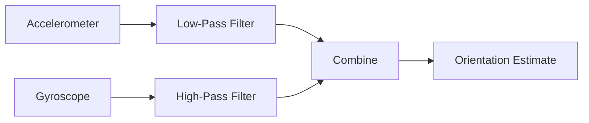
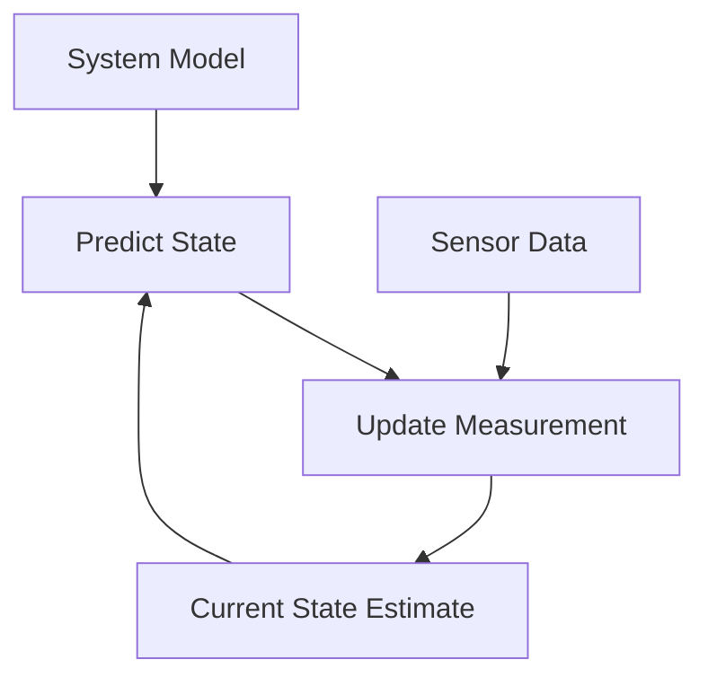

# STM32 Sensor Fusion

## Introduction

Sensor fusion is a powerful technique that combines data from multiple sensors to achieve more accurate, reliable, and comprehensive information than would be possible using individual sensors alone. When implemented on STM32 microcontrollers, sensor fusion enables developers to create sophisticated systems for orientation tracking, position estimation, and environmental monitoring.

In this tutorial, we'll explore how to implement sensor fusion on STM32 microcontrollers, focusing on combining data from inertial measurement units (IMUs) which typically include accelerometers, gyroscopes, and sometimes magnetometers. We'll walk through the concepts, algorithms, and practical implementations to help you harness the power of sensor fusion in your STM32 projects.

## Understanding Sensor Fusion

### What is Sensor Fusion?

Sensor fusion is the process of combining data from multiple sensors to:

1. **Improve accuracy**: Reduce noise and uncertainty by cross-validating measurements
2. **Fill in gaps**: Compensate for limitations of individual sensors
3. **Extend capabilities**: Create new types of measurements by combining different sensor data
4. **Increase reliability**: Continue functioning even if one sensor fails

### Common Sensor Combinations for STM32

STM32 microcontrollers are frequently paired with:

- Accelerometers: Measure linear acceleration
- Gyroscopes: Measure angular velocity
- Magnetometers: Measure magnetic fields (can be used as a compass)
- Barometers: Measure atmospheric pressure (can be used for altitude)
- Temperature sensors: Measure ambient temperature
- Light sensors: Measure ambient light intensity

### Why Use STM32 for Sensor Fusion?

STM32 microcontrollers are ideal for sensor fusion applications because they offer:

- Sufficient processing power to run fusion algorithms
- Multiple communication interfaces (I2C, SPI, UART) to connect different sensors
- DMA (Direct Memory Access) capabilities for efficient sensor data collection
- Floating-point units in many models for faster mathematical operations
- Low power modes for battery-powered applications
- Extensive libraries and middleware to simplify development

## Basic Sensor Fusion Approaches

Before diving into code, let's understand some common sensor fusion approaches:

### Complementary Filter

The complementary filter is a simple and computationally efficient method for combining high-frequency and low-frequency sensor data. It's often used to combine gyroscope and accelerometer data for orientation estimation.



### Kalman Filter

The Kalman filter is a more sophisticated algorithm that provides optimal estimates by considering sensor noise and system dynamics. It's widely used in navigation, robotics, and motion tracking.



### Madgwick and Mahony Filters

These are specialized algorithms designed specifically for attitude estimation using IMU data. They offer good performance with lower computational requirements than a full Kalman filter.

## Setting Up Your STM32 for Sensor Fusion

### Required Hardware

To follow this tutorial, you'll need:

- An STM32 development board (like STM32F4Discovery or Nucleo-F401RE)
- An IMU sensor module (such as MPU6050, LSM9DS1, or BMI160)
- Breadboard and jumper wires
- USB cable for programming

### Software Requirements

- STM32CubeIDE or your preferred STM32 development environment
- STM32CubeMX for initializing peripherals
- HAL (Hardware Abstraction Layer) libraries for STM32

### Connecting IMU Sensors to STM32

Most IMU sensors use I2C or SPI communication protocols. Here's an example of connecting an MPU6050 IMU sensor to an STM32 microcontroller using I2C:

```
STM32          MPU6050
PB8 (SCL) ---- SCL
PB9 (SDA) ---- SDA
3.3V      ---- VCC
GND       ---- GND
```

## Implementing Basic Sensor Fusion

Let's start with a simple implementation of a complementary filter for combining accelerometer and gyroscope data to estimate pitch and roll angles.

### Step 1: Initialize the I2C Interface

First, we need to initialize the I2C interface to communicate with our IMU sensor.

```c
/* Initialize I2C */
void I2C_Init(void)
{
  hi2c1.Instance = I2C1;
  hi2c1.Init.ClockSpeed = 400000;
  hi2c1.Init.DutyCycle = I2C_DUTYCYCLE_2;
  hi2c1.Init.OwnAddress1 = 0;
  hi2c1.Init.AddressingMode = I2C_ADDRESSINGMODE_7BIT;
  hi2c1.Init.DualAddressMode = I2C_DUALADDRESS_DISABLE;
  hi2c1.Init.OwnAddress2 = 0;
  hi2c1.Init.GeneralCallMode = I2C_GENERALCALL_DISABLE;
  hi2c1.Init.NoStretchMode = I2C_NOSTRETCH_DISABLE;
  
  if (HAL_I2C_Init(&hi2c1) != HAL_OK)
  {
    Error_Handler();
  }
}
```

### Step 2: Initialize the MPU6050 Sensor

```c
/* MPU6050 I2C address */
#define MPU6050_ADDR 0x68 << 1

/* Initialize MPU6050 */
HAL_StatusTypeDef MPU6050_Init(void)
{
  uint8_t check;
  uint8_t data;
  
  /* Check device ID */
  HAL_I2C_Mem_Read(&hi2c1, MPU6050_ADDR, 0x75, 1, &check, 1, 1000);
  
  if (check == 0x68)  /* If device ID is correct */
  {
    /* Wake up sensor */
    data = 0x00;
    HAL_I2C_Mem_Write(&hi2c1, MPU6050_ADDR, 0x6B, 1, &data, 1, 1000);
    
    /* Configure accelerometer (+/-2g) */
    data = 0x00;
    HAL_I2C_Mem_Write(&hi2c1, MPU6050_ADDR, 0x1C, 1, &data, 1, 1000);
    
    /* Configure gyroscope (500 deg/s) */
    data = 0x08;
    HAL_I2C_Mem_Write(&hi2c1, MPU6050_ADDR, 0x1B, 1, &data, 1, 1000);
    
    return HAL_OK;
  }
  
  return HAL_ERROR;
}
```

### Step 3: Read Raw Sensor Data

```c
/* Structure to hold sensor data */
typedef struct {
  int16_t accel_x;
  int16_t accel_y;
  int16_t accel_z;
  int16_t temp;
  int16_t gyro_x;
  int16_t gyro_y;
  int16_t gyro_z;
} MPU6050_t;

/* Read raw data from MPU6050 */
void MPU6050_Read_All(MPU6050_t *data)
{
  uint8_t buffer[14];
  
  /* Read 14 bytes of data: 3 accel, 1 temp, 3 gyro */
  HAL_I2C_Mem_Read(&hi2c1, MPU6050_ADDR, 0x3B, 1, buffer, 14, 1000);
  
  /* Format data */
  data->accel_x = (int16_t)(buffer[0] << 8 | buffer[1]);
  data->accel_y = (int16_t)(buffer[2] << 8 | buffer[3]);
  data->accel_z = (int16_t)(buffer[4] << 8 | buffer[5]);
  data->temp = (int16_t)(buffer[6] << 8 | buffer[7]);
  data->gyro_x = (int16_t)(buffer[8] << 8 | buffer[9]);
  data->gyro_y = (int16_t)(buffer[10] << 8 | buffer[11]);
  data->gyro_z = (int16_t)(buffer[12] << 8 | buffer[13]);
}
```

### Step 4: Implement the Complementary Filter

```c
/* Complementary filter for sensor fusion */
void ComplementaryFilter(MPU6050_t *data, float *pitch, float *roll, float dt)
{
  /* Calculate accel angles */
  float accel_pitch = atan2f((float)data->accel_y, sqrtf(powf((float)data->accel_x, 2) + powf((float)data->accel_z, 2))) * 180.0f / M_PI;
  float accel_roll = atan2f(-(float)data->accel_x, (float)data->accel_z) * 180.0f / M_PI;
  
  /* Convert gyro values to deg/s */
  float gyro_pitch_rate = (float)data->gyro_x / 65.5f;  // Adjusted for sensitivity
  float gyro_roll_rate = (float)data->gyro_y / 65.5f;   // Adjusted for sensitivity
  
  /* Complementary filter */
  *pitch = 0.98f * (*pitch + gyro_pitch_rate * dt) + 0.02f * accel_pitch;
  *roll = 0.98f * (*roll + gyro_roll_rate * dt) + 0.02f * accel_roll;
}
```

### Step 5: Main Application

```c
int main(void)
{
  /* Initialize system */
  HAL_Init();
  SystemClock_Config();
  
  /* Initialize peripherals */
  I2C_Init();
  
  /* Initialize MPU6050 */
  if (MPU6050_Init() != HAL_OK)
  {
    Error_Handler();
  }
  
  MPU6050_t mpu_data;
  float pitch = 0.0f;
  float roll = 0.0f;
  uint32_t prev_time = 0;
  uint32_t curr_time = 0;
  float dt = 0.0f;
  
  /* Main loop */
  while (1)
  {
    /* Calculate delta time */
    curr_time = HAL_GetTick();
    dt = (curr_time - prev_time) / 1000.0f;
    prev_time = curr_time;
    
    /* Read sensor data */
    MPU6050_Read_All(&mpu_data);
    
    /* Apply sensor fusion filter */
    ComplementaryFilter(&mpu_data, &pitch, &roll, dt);
    
    /* Print or use the orientation data */
    printf("Pitch: %.2f, Roll: %.2f\r
", pitch, roll);
    
    /* Wait for a short period */
    HAL_Delay(10);
  }
}
```

### Expected Output

When running this code, you'll see the following output on your serial terminal:

```
Pitch: 0.25, Roll: 1.18
Pitch: 0.35, Roll: 1.22
Pitch: 0.42, Roll: 1.25
...
```

As you tilt the sensor, you'll see the pitch and roll values change accordingly. Rotate the sensor around the X-axis to change the pitch, and around the Y-axis to change the roll.

## Advanced Implementation: Kalman Filter for IMU Sensor Fusion

The complementary filter is simple but has limitations. Let's implement a more advanced approach using a Kalman filter, which is better at handling noise and providing optimal estimates.

### Step 1: Define the Kalman Filter Structures

```c
/* Kalman filter structure */
typedef struct {
  float Q_angle;   // Process noise covariance for the accelerometer
  float Q_bias;    // Process noise covariance for the gyro bias
  float R_measure; // Measurement noise covariance
  
  float angle;     // The angle calculated by the Kalman filter
  float bias;      // The gyro bias calculated by the Kalman filter
  float rate;      // Unbiased rate calculated from the rate and the calculated bias
  
  float P[2][2];   // Error covariance matrix
} Kalman_t;

/* Initialize Kalman filter */
void Kalman_Init(Kalman_t *Kalman)
{
  /* Default values from Kalman filter paper */
  Kalman->Q_angle = 0.001f;
  Kalman->Q_bias = 0.003f;
  Kalman->R_measure = 0.03f;
  
  Kalman->angle = 0.0f;
  Kalman->bias = 0.0f;
  
  Kalman->P[0][0] = 0.0f;
  Kalman->P[0][1] = 0.0f;
  Kalman->P[1][0] = 0.0f;
  Kalman->P[1][1] = 0.0f;
}
```

### Step 2: Implement the Kalman Filter Algorithm

```c
/* Kalman filter algorithm */
float Kalman_Update(Kalman_t *Kalman, float newAngle, float newRate, float dt)
{
  /* Step 1: Predict */
  Kalman->rate = newRate - Kalman->bias;
  Kalman->angle += dt * Kalman->rate;
  
  /* Update estimation error covariance */
  Kalman->P[0][0] += dt * (dt * Kalman->P[1][1] - Kalman->P[0][1] - Kalman->P[1][0] + Kalman->Q_angle);
  Kalman->P[0][1] -= dt * Kalman->P[1][1];
  Kalman->P[1][0] -= dt * Kalman->P[1][1];
  Kalman->P[1][1] += Kalman->Q_bias * dt;
  
  /* Step 2: Calculate Kalman gain */
  float S = Kalman->P[0][0] + Kalman->R_measure;
  float K[2];
  K[0] = Kalman->P[0][0] / S;
  K[1] = Kalman->P[1][0] / S;
  
  /* Step 3: Calculate angle and bias */
  float y = newAngle - Kalman->angle;
  Kalman->angle += K[0] * y;
  Kalman->bias += K[1] * y;
  
  /* Step 4: Update error covariance matrix */
  float P00_temp = Kalman->P[0][0];
  float P01_temp = Kalman->P[0][1];
  
  Kalman->P[0][0] -= K[0] * P00_temp;
  Kalman->P[0][1] -= K[0] * P01_temp;
  Kalman->P[1][0] -= K[1] * P00_temp;
  Kalman->P[1][1] -= K[1] * P01_temp;
  
  return Kalman->angle;
}
```

### Step 3: Use the Kalman Filter for Pitch and Roll Estimation

```c
int main(void)
{
  /* Initialize system */
  HAL_Init();
  SystemClock_Config();
  
  /* Initialize peripherals */
  I2C_Init();
  
  /* Initialize MPU6050 */
  if (MPU6050_Init() != HAL_OK)
  {
    Error_Handler();
  }
  
  MPU6050_t mpu_data;
  Kalman_t kalmanX, kalmanY;
  Kalman_Init(&kalmanX);
  Kalman_Init(&kalmanY);
  
  float pitch = 0.0f;
  float roll = 0.0f;
  uint32_t prev_time = 0;
  uint32_t curr_time = 0;
  float dt = 0.0f;
  
  /* Main loop */
  while (1)
  {
    /* Calculate delta time */
    curr_time = HAL_GetTick();
    dt = (curr_time - prev_time) / 1000.0f;
    prev_time = curr_time;
    
    /* Read sensor data */
    MPU6050_Read_All(&mpu_data);
    
    /* Calculate accelerometer angles */
    float accel_pitch = atan2f((float)mpu_data.accel_y, sqrtf(powf((float)mpu_data.accel_x, 2) + powf((float)mpu_data.accel_z, 2))) * 180.0f / M_PI;
    float accel_roll = atan2f(-(float)mpu_data.accel_x, (float)mpu_data.accel_z) * 180.0f / M_PI;
    
    /* Convert gyro values to deg/s */
    float gyro_pitch_rate = (float)mpu_data.gyro_x / 65.5f;
    float gyro_roll_rate = (float)mpu_data.gyro_y / 65.5f;
    
    /* Apply Kalman filter */
    pitch = Kalman_Update(&kalmanX, accel_pitch, gyro_pitch_rate, dt);
    roll = Kalman_Update(&kalmanY, accel_roll, gyro_roll_rate, dt);
    
    /* Print or use the orientation data */
    printf("Pitch: %.2f, Roll: %.2f\r
", pitch, roll);
    
    /* Wait for a short period */
    HAL_Delay(10);
  }
}
```

## Real-World Application: Attitude and Heading Reference System (AHRS)

Let's implement a more complete sensor fusion solution that combines accelerometer, gyroscope, and magnetometer data to create an Attitude and Heading Reference System (AHRS). We'll use the Mahony algorithm, which is computationally efficient for STM32 microcontrollers.

### Step 1: Define the AHRS Structure

```c
/* AHRS structure */
typedef struct {
  float q0, q1, q2, q3;  // Quaternion representation of orientation
  float sampleFreq;      // Sample frequency in Hz
  float Kp;              // Proportional gain
  float Ki;              // Integral gain
  float integralFBx;     // Integral error term for X
  float integralFBy;     // Integral error term for Y
  float integralFBz;     // Integral error term for Z
} AHRS_t;

/* Initialize AHRS */
void AHRS_Init(AHRS_t *AHRS, float sampleFreq)
{
  AHRS->q0 = 1.0f;
  AHRS->q1 = 0.0f;
  AHRS->q2 = 0.0f;
  AHRS->q3 = 0.0f;
  AHRS->sampleFreq = sampleFreq;
  AHRS->Kp = 2.0f;
  AHRS->Ki = 0.005f;
  AHRS->integralFBx = 0.0f;
  AHRS->integralFBy = 0.0f;
  AHRS->integralFBz = 0.0f;
}
```

### Step 2: Implement the Mahony AHRS Algorithm

```c
/* Mahony AHRS algorithm */
void AHRS_Update(AHRS_t *AHRS, float gx, float gy, float gz, float ax, float ay, float az, float mx, float my, float mz)
{
  float recipNorm;
  float q0q0, q0q1, q0q2, q0q3, q1q1, q1q2, q1q3, q2q2, q2q3, q3q3;  
  float hx, hy, bx, bz;
  float halfvx, halfvy, halfvz, halfwx, halfwy, halfwz;
  float halfex, halfey, halfez;
  float qa, qb, qc;

  // Convert gyroscope readings to radians/s
  gx *= 0.0174533f;
  gy *= 0.0174533f;
  gz *= 0.0174533f;
  
  // Compute feedback only if accelerometer measurement valid (avoid NaN)
  if(!((ax == 0.0f) && (ay == 0.0f) && (az == 0.0f))) {

    // Normalize accelerometer measurement
    recipNorm = 1.0f / sqrtf(ax * ax + ay * ay + az * az);
    ax *= recipNorm;
    ay *= recipNorm;
    az *= recipNorm;     

    // Normalize magnetometer measurement
    recipNorm = 1.0f / sqrtf(mx * mx + my * my + mz * mz);
    mx *= recipNorm;
    my *= recipNorm;
    mz *= recipNorm;

    // Auxiliary variables to avoid repeated calculations
    q0q0 = AHRS->q0 * AHRS->q0;
    q0q1 = AHRS->q0 * AHRS->q1;
    q0q2 = AHRS->q0 * AHRS->q2;
    q0q3 = AHRS->q0 * AHRS->q3;
    q1q1 = AHRS->q1 * AHRS->q1;
    q1q2 = AHRS->q1 * AHRS->q2;
    q1q3 = AHRS->q1 * AHRS->q3;
    q2q2 = AHRS->q2 * AHRS->q2;
    q2q3 = AHRS->q2 * AHRS->q3;
    q3q3 = AHRS->q3 * AHRS->q3;   

    // Reference direction of Earth's magnetic field
    hx = 2.0f * (mx * (0.5f - q2q2 - q3q3) + my * (q1q2 - q0q3) + mz * (q1q3 + q0q2));
    hy = 2.0f * (mx * (q1q2 + q0q3) + my * (0.5f - q1q1 - q3q3) + mz * (q2q3 - q0q1));
    bx = sqrtf(hx * hx + hy * hy);
    bz = 2.0f * (mx * (q1q3 - q0q2) + my * (q2q3 + q0q1) + mz * (0.5f - q1q1 - q2q2));

    // Estimated direction of gravity and magnetic field
    halfvx = q1q3 - q0q2;
    halfvy = q0q1 + q2q3;
    halfvz = q0q0 - 0.5f + q3q3;
    halfwx = bx * (0.5f - q2q2 - q3q3) + bz * (q1q3 - q0q2);
    halfwy = bx * (q1q2 - q0q3) + bz * (q0q1 + q2q3);
    halfwz = bx * (q0q2 + q1q3) + bz * (0.5f - q1q1 - q2q2);  
  
    // Error is sum of cross product between estimated direction and measured direction of field vectors
    halfex = (ay * halfvz - az * halfvy) + (my * halfwz - mz * halfwy);
    halfey = (az * halfvx - ax * halfvz) + (mz * halfwx - mx * halfwz);
    halfez = (ax * halfvy - ay * halfvx) + (mx * halfwy - my * halfwx);

    // Compute and apply integral feedback if enabled
    if(AHRS->Ki > 0.0f) {
      AHRS->integralFBx += AHRS->Ki * halfex * (1.0f / AHRS->sampleFreq);  // Integral error scaled by Ki
      AHRS->integralFBy += AHRS->Ki * halfey * (1.0f / AHRS->sampleFreq);
      AHRS->integralFBz += AHRS->Ki * halfez * (1.0f / AHRS->sampleFreq);
      gx += AHRS->integralFBx;  // Apply integral feedback
      gy += AHRS->integralFBy;
      gz += AHRS->integralFBz;
    }
    else {
      AHRS->integralFBx = 0.0f;  // Prevent integral windup
      AHRS->integralFBy = 0.0f;
      AHRS->integralFBz = 0.0f;
    }

    // Apply proportional feedback
    gx += AHRS->Kp * halfex;
    gy += AHRS->Kp * halfey;
    gz += AHRS->Kp * halfez;
  }
  
  // Integrate rate of change of quaternion
  gx *= (0.5f * (1.0f / AHRS->sampleFreq));   // Pre-multiply common factors
  gy *= (0.5f * (1.0f / AHRS->sampleFreq));
  gz *= (0.5f * (1.0f / AHRS->sampleFreq));
  qa = AHRS->q0;
  qb = AHRS->q1;
  qc = AHRS->q2;
  AHRS->q0 += (-qb * gx - qc * gy - AHRS->q3 * gz);
  AHRS->q1 += (qa * gx + qc * gz - AHRS->q3 * gy);
  AHRS->q2 += (qa * gy - qb * gz + AHRS->q3 * gx);
  AHRS->q3 += (qa * gz + qb * gy - qc * gx); 
  
  // Normalize quaternion
  recipNorm = 1.0f / sqrtf(AHRS->q0 * AHRS->q0 + AHRS->q1 * AHRS->q1 + AHRS->q2 * AHRS->q2 + AHRS->q3 * AHRS->q3);
  AHRS->q0 *= recipNorm;
  AHRS->q1 *= recipNorm;
  AHRS->q2 *= recipNorm;
  AHRS->q3 *= recipNorm;
}
```

### Step 3: Convert Quaternions to Euler Angles

```c
/* Convert quaternion to Euler angles (in degrees) */
void AHRS_GetEulerAngles(AHRS_t *AHRS, float *roll, float *pitch, float *yaw)
{
  *roll = atan2f(2.0f * (AHRS->q0 * AHRS->q1 + AHRS->q2 * AHRS->q3), 1.0f - 2.0f * (AHRS->q1 * AHRS->q1 + AHRS->q2 * AHRS->q2)) * 57.29578f;
  *pitch = asinf(2.0f * (AHRS->q0 * AHRS->q2 - AHRS->q3 * AHRS->q1)) * 57.29578f;
  *yaw = atan2f(2.0f * (AHRS->q0 * AHRS->q3 + AHRS->q1 * AHRS->q2), 1.0f - 2.0f * (AHRS->q2 * AHRS->q2 + AHRS->q3 * AHRS->q3)) * 57.29578f;
}
```

### Step 4: Main Application with 9-DOF Sensor Fusion

```c
int main(void)
{
  /* Initialize system */
  HAL_Init();
  SystemClock_Config();
  
  /* Initialize peripherals */
  I2C_Init();
  
  /* Initialize 9-DOF IMU (this is just a placeholder - use your actual IMU initialization) */
  IMU_Init();
  
  AHRS_t ahrs;
  AHRS_Init(&ahrs, 100.0f);  // 100Hz sample rate
  
  float roll, pitch, yaw;
  float accel_x, accel_y, accel_z;
  float gyro_x, gyro_y, gyro_z;
  float mag_x, mag_y, mag_z;
  
  /* Main loop */
  while (1)
  {
    /* Read sensor data (replace with your actual sensor reading functions) */
    IMU_ReadAccelerometer(&accel_x, &accel_y, &accel_z);
    IMU_ReadGyroscope(&gyro_x, &gyro_y, &gyro_z);
    IMU_ReadMagnetometer(&mag_x, &mag_y, &mag_z);
    
    /* Update AHRS */
    AHRS_Update(&ahrs, gyro_x, gyro_y, gyro_z, accel_x, accel_y, accel_z, mag_x, mag_y, mag_z);
    
    /* Get Euler angles */
    AHRS_GetEulerAngles(&ahrs, &roll, &pitch, &yaw);
    
    /* Print or use the orientation data */
    printf("Roll: %.2f, Pitch: %.2f, Yaw: %.2f\r
", roll, pitch, yaw);
    
    /* Wait for next sample */
    HAL_Delay(10);  // 100Hz sample rate
  }
}
```

## Practical Project: Inertial Navigation System

Let's build a complete inertial navigation system that tracks position by integrating accelerometer data and correcting drift using sensor fusion techniques.

### Step 1: Define the INS Structure

```c
/* Inertial Navigation System structure */
typedef struct {
  AHRS_t ahrs;                    // Attitude reference
  float position[3];              // Position in x, y, z (meters)
  float velocity[3];              // Velocity in x, y, z (meters/second)
  float accel_bias[3];            // Accelerometer bias
  float prev_accel_world[3];      // Previous acceleration in world frame
  float dt;                       // Time step
} INS_t;

/* Initialize INS */
void INS_Init(INS_t *ins, float sampleFreq)
{
  AHRS_Init(&ins->ahrs, sampleFreq);
  
  ins->position[