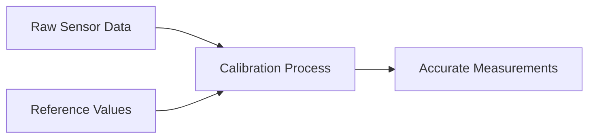

# STM32 Sensor Calibration

Sensor calibration is a crucial step in any measurement system. Even the most expensive sensors can provide inaccurate readings if not properly calibrated. In this tutorial, we'll explore how to calibrate various sensors using STM32 microcontrollers to ensure your projects deliver reliable and accurate data.

## What is Sensor Calibration?

Sensor calibration is the process of comparing the output of a sensor with a known reference value and adjusting it to match the reference as closely as possible. This helps eliminate various sources of error:

- **Manufacturing variations**: Two identical sensors may give slightly different readings
- **Environmental factors**: Temperature, humidity, and pressure can affect sensor readings
- **Aging**: Sensor characteristics can change over time
- **Nonlinearity**: Many sensors don't have a perfectly linear response

## Why Calibration Matters

Let's consider a simple example: suppose you're building a weather station that measures temperature using an analog temperature sensor. Without calibration, your readings might be off by several degrees, making your weather data unreliable.



## Types of Calibration

### 1. Offset Calibration

Offset calibration corrects a constant error across all measurements. For example, if your temperature sensor consistently reads 2°C higher than the actual temperature, you can subtract 2°C from all readings.

### 2. Gain/Slope Calibration

Gain calibration adjusts for errors that change proportionally with the measurement value. For instance, if your sensor reads 10% too high across its range, you can multiply all readings by 0.9.

### 3. Multi-point Calibration

For sensors with nonlinear responses, you'll need to calibrate at multiple points and possibly use interpolation between these points.

## Calibrating Sensors with STM32

Now, let's look at how to implement calibration on STM32 microcontrollers. We'll start with a simple example using an analog temperature sensor.

### Basic Offset Calibration

```c
// Constants for a simple temperature sensor
#define ADC_REFERENCE_VOLTAGE 3.3f
#define ADC_RESOLUTION        4096.0f  // 12-bit ADC
#define TEMP_SENSOR_OFFSET    -2.5f    // Determined through calibration

float readTemperature(void) {
    uint16_t adcValue = readADC();  // Read ADC value from sensor
    
    // Convert ADC value to voltage
    float voltage = (adcValue / ADC_RESOLUTION) * ADC_REFERENCE_VOLTAGE;
    
    // Convert voltage to temperature (example: 10mV per °C)
    float temperature = voltage * 100.0f;
    
    // Apply calibration offset
    float calibratedTemperature = temperature + TEMP_SENSOR_OFFSET;
    
    return calibratedTemperature;
}
```

### Determining the Offset Value

To find the offset value for calibration:

1. Place your sensor in an environment with a known temperature (e.g., use an accurate reference thermometer)
2. Read the value from your sensor
3. Calculate the difference: `offset = known_temperature - sensor_reading`

### Two-point Calibration

For more accurate results, you can perform a two-point calibration that corrects both offset and gain errors:

```c
// Calibration constants (determined experimentally)
#define CAL_POINT1_ACTUAL     0.0f    // Known reference temperature 1 (e.g., ice water)
#define CAL_POINT1_MEASURED   1.2f    // Sensor reading at reference point 1
#define CAL_POINT2_ACTUAL     100.0f  // Known reference temperature 2 (e.g., boiling water)
#define CAL_POINT2_MEASURED   98.7f   // Sensor reading at reference point 2

float calibrateTemperature(float rawTemperature) {
    // Calculate slope and offset for linear correction
    float slope = (CAL_POINT2_ACTUAL - CAL_POINT1_ACTUAL) / 
                 (CAL_POINT2_MEASURED - CAL_POINT1_MEASURED);
                 
    float offset = CAL_POINT1_ACTUAL - (slope * CAL_POINT1_MEASURED);
    
    // Apply calibration
    float calibratedTemperature = (slope * rawTemperature) + offset;
    
    return calibratedTemperature;
}
```

## Practical Example: Calibrating an Accelerometer

Let's look at a more complex example using an I2C accelerometer (such as the MPU6050):

```c
/* Accelerometer calibration values */
typedef struct {
    float x_offset;
    float y_offset;
    float z_offset;
    float x_scale;
    float y_scale;
    float z_scale;
} AccelCalibration_t;

AccelCalibration_t accelCal = {
    .x_offset = -0.05f,
    .y_offset = 0.02f,
    .z_offset = 0.12f,
    .x_scale = 0.985f,
    .y_scale = 1.012f,
    .z_scale = 0.997f
};

void calibrateAccelerometerReadings(float *x, float *y, float *z) {
    // Apply offset correction first
    *x = *x - accelCal.x_offset;
    *y = *y - accelCal.y_offset;
    *z = *z - accelCal.z_offset;
    
    // Then apply scale correction
    *x = *x * accelCal.x_scale;
    *y = *y * accelCal.y_scale;
    *z = *z * accelCal.z_scale;
}

void readAccelerometer(void) {
    float accel_x, accel_y, accel_z;
    
    // Read raw values from accelerometer
    I2C_ReadAccelerometer(&accel_x, &accel_y, &accel_z);
    
    // Apply calibration
    calibrateAccelerometerReadings(&accel_x, &accel_y, &accel_z);
    
    // Now accel_x, accel_y, and accel_z contain calibrated values
    printf("Calibrated Accelerometer: X=%.2f, Y=%.2f, Z=%.2f\r
", 
           accel_x, accel_y, accel_z);
}
```

### How to Determine Accelerometer Calibration Values

To calibrate an accelerometer:

1. **For offset**: Place the accelerometer on a flat, level surface. The X and Y readings should be 0, and Z should read 1g (9.81 m/s²). Any deviation represents your offset error.

2. **For scale**: Rotate the accelerometer through each axis, measuring the +1g and -1g positions. The difference between these positions should be exactly 2g. Adjust your scale factor accordingly.

## Storing Calibration Data in Flash Memory

Calibration is usually performed once during manufacturing or initial setup. You'll want to store these values in non-volatile memory:

```c
#include "stm32f4xx_flash.h"

#define FLASH_SECTOR_CALIBRATION  FLASH_Sector_11
#define FLASH_ADDRESS_CALIBRATION 0x080E0000  // Address in flash memory

typedef struct {
    uint32_t magic;             // Magic number to verify data validity
    float temp_offset;
    float temp_scale;
    AccelCalibration_t accelCal;
    uint32_t checksum;
} CalibrationData_t;

// Save calibration data to flash
void saveCalibrationData(CalibrationData_t *calibData) {
    // Calculate checksum
    calibData->checksum = calculateChecksum(calibData);
    
    // Unlock flash
    FLASH_Unlock();
    
    // Erase sector
    FLASH_EraseSector(FLASH_SECTOR_CALIBRATION, VoltageRange_3);
    
    // Write data to flash (simplified - in reality, you need to write word by word)
    uint32_t *sourcePtr = (uint32_t *)calibData;
    for (int i = 0; i < sizeof(CalibrationData_t)/4; i++) {
        FLASH_ProgramWord(FLASH_ADDRESS_CALIBRATION + (i*4), sourcePtr[i]);
    }
    
    // Lock flash
    FLASH_Lock();
}

// Load calibration data from flash
bool loadCalibrationData(CalibrationData_t *calibData) {
    // Copy data from flash
    memcpy(calibData, (void*)FLASH_ADDRESS_CALIBRATION, sizeof(CalibrationData_t));
    
    // Verify magic number and checksum
    if (calibData->magic != CALIB_MAGIC_NUMBER ||
        calibData->checksum != calculateChecksum(calibData)) {
        // Invalid data, use defaults
        return false;
    }
    
    return true;
}
```

## Implementing a Calibration Mode

It's useful to include a calibration mode in your firmware that users can trigger (e.g., by holding a button during startup):

```c
void enterCalibrationMode(void) {
    printf("Entering calibration mode...\r
");
    
    // Create calibration data structure
    CalibrationData_t calibData;
    calibData.magic = CALIB_MAGIC_NUMBER;
    
    // 1. Zero-point calibration for accelerometer
    printf("Place device on level surface and press button\r
");
    waitForButtonPress();
    
    float accel_x, accel_y, accel_z;
    I2C_ReadAccelerometer(&accel_x, &accel_y, &accel_z);
    
    // Calculate offsets (on level surface, x and y should be 0, z should be 1g)
    calibData.accelCal.x_offset = accel_x;
    calibData.accelCal.y_offset = accel_y;
    calibData.accelCal.z_offset = accel_z - 9.81f;
    
    // Default scales (to be refined in a full calibration procedure)
    calibData.accelCal.x_scale = 1.0f;
    calibData.accelCal.y_scale = 1.0f;
    calibData.accelCal.z_scale = 1.0f;
    
    // 2. Temperature calibration
    // ... (similar procedure with known reference)
    
    // Save calibration data
    saveCalibrationData(&calibData);
    
    printf("Calibration complete!\r
");
}
```

## Real-World Application: Weather Station

Let's implement a simple weather station that uses calibrated sensors:

```c
typedef struct {
    float temperature;
    float humidity;
    float pressure;
} WeatherData_t;

void initWeatherStation(void) {
    // Initialize hardware
    SystemClock_Config();
    BSP_LED_Init(LED2);
    BSP_COM_Init(COM1);
    
    // Initialize sensors
    BSP_TSENSOR_Init();
    BSP_HSENSOR_Init();
    BSP_PSENSOR_Init();
    
    // Load calibration data
    CalibrationData_t calibData;
    if (!loadCalibrationData(&calibData)) {
        printf("Warning: Using default calibration values\r
");
        // Set default values
    }
    
    printf("Weather station initialized\r
");
}

WeatherData_t readWeatherData(CalibrationData_t *calibData) {
    WeatherData_t data;
    
    // Read raw temperature and apply calibration
    float rawTemp = BSP_TSENSOR_ReadTemp();
    data.temperature = (rawTemp * calibData->temp_scale) + calibData->temp_offset;
    
    // Read raw humidity and apply calibration
    float rawHumidity = BSP_HSENSOR_ReadHumidity();
    data.humidity = (rawHumidity * calibData->hum_scale) + calibData->hum_offset;
    
    // Read raw pressure and apply calibration
    float rawPressure = BSP_PSENSOR_ReadPressure();
    data.pressure = (rawPressure * calibData->press_scale) + calibData->press_offset;
    
    return data;
}

void runWeatherStation(void) {
    CalibrationData_t calibData;
    loadCalibrationData(&calibData);
    
    while (1) {
        WeatherData_t weatherData = readWeatherData(&calibData);
        
        printf("Temperature: %.1f°C\r
", weatherData.temperature);
        printf("Humidity: %.1f%%\r
", weatherData.humidity);
        printf("Pressure: %.1f hPa\r
", weatherData.pressure);
        
        HAL_Delay(5000);  // Update every 5 seconds
    }
}
```

## Automating Calibration with the STM32 ADC

STM32 microcontrollers include built-in hardware for calibrating their ADCs:

```c
void calibrateADC(ADC_HandleTypeDef *hadc) {
    // Ensure ADC is disabled
    HAL_ADC_Stop(hadc);
    
    // Start ADC calibration
    if (HAL_ADCEx_Calibration_Start(hadc) != HAL_OK) {
        Error_Handler();
    }
    
    printf("ADC calibration complete\r
");
}
```

## Factory Calibration vs. User Calibration

It's important to distinguish between different types of calibration:

1. **Factory Calibration**: Performed during manufacturing using precise reference equipment
2. **User Calibration**: Performed by the end-user in the field, typically less accurate but can compensate for drift over time

Your application may implement both:

```c
typedef enum {
    CALIB_TYPE_FACTORY = 0,
    CALIB_TYPE_USER
} CalibType_t;

// Two sets of calibration data
CalibrationData_t factoryCalibration;
CalibrationData_t userCalibration;

void loadAppropriateCalibration(void) {
    // First try to load user calibration
    if (loadCalibrationData(&userCalibration, FLASH_ADDRESS_USER_CALIB)) {
        printf("Using user calibration\r
");
        applyCalibration(&userCalibration);
    }
    // Fall back to factory calibration
    else if (loadCalibrationData(&factoryCalibration, FLASH_ADDRESS_FACTORY_CALIB)) {
        printf("Using factory calibration\r
");
        applyCalibration(&factoryCalibration);
    }
    // No valid calibration found
    else {
        printf("No calibration data found, using defaults\r
");
        useDefaultCalibration();
    }
}
```

## Summary

Proper sensor calibration is essential for accurate and reliable measurements in embedded systems. In this tutorial, we've covered:

- The importance of sensor calibration
- Different types of calibration (offset, gain, multi-point)
- How to implement calibration on STM32 microcontrollers
- Storing calibration data in flash memory
- Creating a calibration mode in your firmware
- Real-world applications of calibrated sensors

By applying these techniques in your STM32 projects, you'll achieve more accurate readings and build more reliable sensing applications.

## Exercises

1. Implement a temperature sensor calibration routine using a known reference (like a commercial thermometer).
2. Create a program that calibrates an analog light sensor at two points (darkness and bright light).
3. Design a calibration procedure for a digital pressure sensor and store the values in flash memory.
4. Modify the weather station example to include a user calibration mode triggered by a button press.
5. Implement multi-point calibration for a non-linear sensor (like some pH sensors or gas sensors).

## Additional Resources

- STM32 HAL ADC documentation for hardware calibration functions
- STM32 Flash memory programming guides
- Application notes for specific sensors (check manufacturer websites)
- STM32CubeIDE for developing and debugging your calibration routines