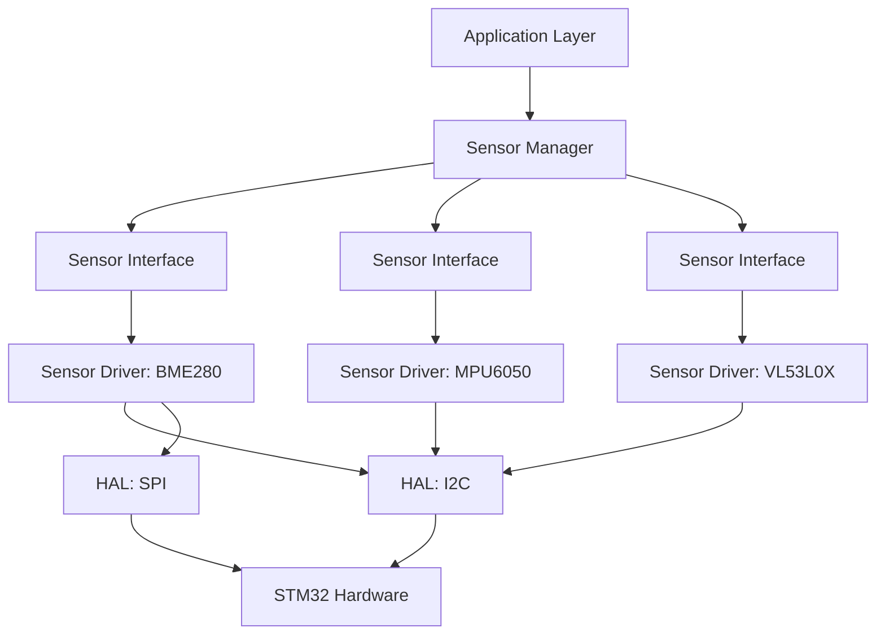

# STM32 Sensor Frameworks

## Introduction

When working with sensors on STM32 microcontrollers, organizing your code effectively becomes crucial as your projects grow in complexity. Sensor frameworks provide a structured approach to integrating and managing multiple sensors in your STM32 applications. Rather than writing ad-hoc code for each sensor, frameworks offer reusable patterns and abstractions that simplify development, improve maintainability, and enhance scalability.

In this tutorial, we'll explore how to design and implement sensor frameworks for STM32 microcontrollers. Whether you're building a weather station, a drone, or an IoT device, these concepts will help you create robust sensor systems.

## What is a Sensor Framework?

A sensor framework is an organized collection of software components that provides a consistent approach to:

1. **Sensor initialization and configuration**
2. **Data acquisition and processing**
3. **Error handling and diagnostics**
4. **Resource management**
5. **Higher-level sensor fusion**

Think of it as a structured blueprint that standardizes how your application interacts with various sensors, regardless of their specific type or communication protocol.

## Benefits of Using Sensor Frameworks

Before diving into implementation details, let's understand why frameworks are valuable:

- **Code reusability**: Write common functionality once and reuse it across multiple sensors
- **Abstraction**: Hide low-level details behind clean interfaces
- **Maintainability**: Easier to update or replace individual sensors without affecting the entire system
- **Scalability**: Seamlessly add new sensors to your project
- **Testability**: Simplified testing through well-defined interfaces

## Architecture of an STM32 Sensor Framework

Let's examine a typical architecture for an STM32 sensor framework:



The key components include:

1. **Sensor Interface**: A common abstraction that defines how to interact with any sensor
2. **Sensor Drivers**: Implementations of the sensor interface for specific sensors
3. **Sensor Manager**: Coordinates multiple sensors and provides unified access
4. **Hardware Abstraction Layer (HAL)**: Provides access to STM32 peripherals

## Implementing a Sensor Framework

Let's implement a simple sensor framework for STM32. We'll use C for our implementation.

### Step 1: Define the Sensor Interface

First, let's define a common interface that all sensors will implement:

```c
/* sensor_interface.h */
#ifndef SENSOR_INTERFACE_H
#define SENSOR_INTERFACE_H

#include <stdint.h>
#include <stdbool.h>

typedef struct {
    float x;
    float y;
    float z;
} vector3_t;

typedef enum {
    SENSOR_OK,
    SENSOR_ERROR_COMMUNICATION,
    SENSOR_ERROR_TIMEOUT,
    SENSOR_ERROR_NOT_INITIALIZED,
    SENSOR_ERROR_INVALID_PARAM
} sensor_status_t;

typedef struct sensor_interface_t sensor_interface_t;

struct sensor_interface_t {
    // Initialization function
    sensor_status_t (*init)(sensor_interface_t *sensor);
    
    // Read raw data
    sensor_status_t (*read_raw)(sensor_interface_t *sensor, void *data);
    
    // Read processed data
    sensor_status_t (*read)(sensor_interface_t *sensor, void *data);
    
    // Configure sensor
    sensor_status_t (*configure)(sensor_interface_t *sensor, void *config);
    
    // Check if sensor is ready
    bool (*is_ready)(sensor_interface_t *sensor);
    
    // Power management
    sensor_status_t (*set_power_mode)(sensor_interface_t *sensor, uint8_t mode);
    
    // Private data for sensor implementation
    void *private_data;
};

#endif /* SENSOR_INTERFACE_H */
```

This interface defines common operations that any sensor should support. The `private_data` field allows each sensor implementation to store its own state.

### Step 2: Implement a Specific Sensor Driver

Now, let's implement a driver for a popular temperature and humidity sensor, the BME280:

```c
/* bme280_driver.h */
#ifndef BME280_DRIVER_H
#define BME280_DRIVER_H

#include "sensor_interface.h"
#include "stm32f4xx_hal.h"

typedef struct {
    float temperature;
    float humidity;
    float pressure;
} bme280_data_t;

typedef struct {
    I2C_HandleTypeDef *hi2c;
    uint8_t address;
    uint8_t calibration_data[32];
    bool initialized;
} bme280_private_t;

// Create a BME280 sensor instance
sensor_interface_t* bme280_create(I2C_HandleTypeDef *hi2c, uint8_t address);

// Destroy a BME280 sensor instance
void bme280_destroy(sensor_interface_t *sensor);

#endif /* BME280_DRIVER_H */
```

Now the implementation:

```c
/* bme280_driver.c */
#include "bme280_driver.h"
#include <stdlib.h>

#define BME280_REG_ID          0xD0
#define BME280_ID              0x60
#define BME280_REG_CTRL_HUM    0xF2
#define BME280_REG_CTRL_MEAS   0xF4
#define BME280_REG_CONFIG      0xF5
#define BME280_REG_DATA        0xF7

// BME280 initialization function
static sensor_status_t bme280_init(sensor_interface_t *sensor) {
    if (sensor == NULL || sensor->private_data == NULL) {
        return SENSOR_ERROR_INVALID_PARAM;
    }
    
    bme280_private_t *priv = (bme280_private_t *)sensor->private_data;
    uint8_t id;
    HAL_StatusTypeDef hal_status;
    
    // Read sensor ID to confirm communication
    hal_status = HAL_I2C_Mem_Read(priv->hi2c, priv->address << 1, BME280_REG_ID, 1, &id, 1, 100);
    if (hal_status != HAL_OK || id != BME280_ID) {
        return SENSOR_ERROR_COMMUNICATION;
    }
    
    // Configure sensor (simplified for this example)
    uint8_t config[3] = {
        0x01,  // humidity oversampling x1
        0x27,  // temperature oversampling x1, pressure oversampling x1, normal mode
        0x00   // no filtering, no standby time
    };
    
    hal_status = HAL_I2C_Mem_Write(priv->hi2c, priv->address << 1, BME280_REG_CTRL_HUM, 1, &config[0], 1, 100);
    if (hal_status != HAL_OK) return SENSOR_ERROR_COMMUNICATION;
    
    hal_status = HAL_I2C_Mem_Write(priv->hi2c, priv->address << 1, BME280_REG_CTRL_MEAS, 1, &config[1], 1, 100);
    if (hal_status != HAL_OK) return SENSOR_ERROR_COMMUNICATION;
    
    hal_status = HAL_I2C_Mem_Write(priv->hi2c, priv->address << 1, BME280_REG_CONFIG, 1, &config[2], 1, 100);
    if (hal_status != HAL_OK) return SENSOR_ERROR_COMMUNICATION;
    
    // In a real implementation, we would read calibration data here
    // For simplicity, we're skipping that in this example
    
    priv->initialized = true;
    return SENSOR_OK;
}

// Read raw data from BME280
static sensor_status_t bme280_read_raw(sensor_interface_t *sensor, void *data) {
    if (sensor == NULL || sensor->private_data == NULL || data == NULL) {
        return SENSOR_ERROR_INVALID_PARAM;
    }
    
    bme280_private_t *priv = (bme280_private_t *)sensor->private_data;
    if (!priv->initialized) {
        return SENSOR_ERROR_NOT_INITIALIZED;
    }
    
    uint8_t raw_data[8];
    HAL_StatusTypeDef hal_status;
    
    hal_status = HAL_I2C_Mem_Read(priv->hi2c, priv->address << 1, BME280_REG_DATA, 1, raw_data, 8, 100);
    if (hal_status != HAL_OK) {
        return SENSOR_ERROR_COMMUNICATION;
    }
    
    // Copy raw data to the output buffer
    memcpy(data, raw_data, 8);
    
    return SENSOR_OK;
}

// Process and read sensor data
static sensor_status_t bme280_read(sensor_interface_t *sensor, void *data) {
    if (sensor == NULL || sensor->private_data == NULL || data == NULL) {
        return SENSOR_ERROR_INVALID_PARAM;
    }
    
    bme280_private_t *priv = (bme280_private_t *)sensor->private_data;
    if (!priv->initialized) {
        return SENSOR_ERROR_NOT_INITIALIZED;
    }
    
    bme280_data_t *output = (bme280_data_t *)data;
    uint8_t raw_data[8];
    
    sensor_status_t status = bme280_read_raw(sensor, raw_data);
    if (status != SENSOR_OK) {
        return status;
    }
    
    // In a real implementation, we would apply calibration formulas here
    // For simplicity, we're using dummy values
    
    // Extract pressure (20-bit value)
    int32_t raw_pressure = (raw_data[0] << 12) | (raw_data[1] << 4) | (raw_data[2] >> 4);
    
    // Extract temperature (20-bit value)
    int32_t raw_temp = (raw_data[3] << 12) | (raw_data[4] << 4) | (raw_data[5] >> 4);
    
    // Extract humidity (16-bit value)
    int32_t raw_humidity = (raw_data[6] << 8) | raw_data[7];
    
    // Simplified conversion (in a real driver, we'd use calibration data)
    output->temperature = raw_temp / 100.0f;
    output->pressure = raw_pressure / 100.0f;
    output->humidity = raw_humidity / 1024.0f;
    
    return SENSOR_OK;
}

// Check if sensor is ready
static bool bme280_is_ready(sensor_interface_t *sensor) {
    if (sensor == NULL || sensor->private_data == NULL) {
        return false;
    }
    
    bme280_private_t *priv = (bme280_private_t *)sensor->private_data;
    return priv->initialized;
}

// Configure BME280 sensor
static sensor_status_t bme280_configure(sensor_interface_t *sensor, void *config) {
    // Configuration implementation
    return SENSOR_OK;
}

// Set power mode
static sensor_status_t bme280_set_power_mode(sensor_interface_t *sensor, uint8_t mode) {
    // Power mode implementation
    return SENSOR_OK;
}

// Create a BME280 sensor instance
sensor_interface_t* bme280_create(I2C_HandleTypeDef *hi2c, uint8_t address) {
    sensor_interface_t *sensor = (sensor_interface_t *)malloc(sizeof(sensor_interface_t));
    if (sensor == NULL) {
        return NULL;
    }
    
    bme280_private_t *private_data = (bme280_private_t *)malloc(sizeof(bme280_private_t));
    if (private_data == NULL) {
        free(sensor);
        return NULL;
    }
    
    // Initialize private data
    private_data->hi2c = hi2c;
    private_data->address = address;
    private_data->initialized = false;
    
    // Set up interface functions
    sensor->init = bme280_init;
    sensor->read_raw = bme280_read_raw;
    sensor->read = bme280_read;
    sensor->configure = bme280_configure;
    sensor->is_ready = bme280_is_ready;
    sensor->set_power_mode = bme280_set_power_mode;
    sensor->private_data = private_data;
    
    return sensor;
}

// Destroy a BME280 sensor instance
void bme280_destroy(sensor_interface_t *sensor) {
    if (sensor != NULL) {
        if (sensor->private_data != NULL) {
            free(sensor->private_data);
        }
        free(sensor);
    }
}
```

### Step 3: Create a Sensor Manager

Now let's implement a sensor manager to coordinate multiple sensors:

```c
/* sensor_manager.h */
#ifndef SENSOR_MANAGER_H
#define SENSOR_MANAGER_H

#include "sensor_interface.h"

#define MAX_SENSORS 10

typedef struct {
    sensor_interface_t *sensors[MAX_SENSORS];
    uint8_t count;
} sensor_manager_t;

// Initialize the sensor manager
void sensor_manager_init(sensor_manager_t *manager);

// Add a sensor to the manager
sensor_status_t sensor_manager_add_sensor(sensor_manager_t *manager, sensor_interface_t *sensor);

// Initialize all sensors
sensor_status_t sensor_manager_init_all(sensor_manager_t *manager);

// Read data from a specific sensor
sensor_status_t sensor_manager_read(sensor_manager_t *manager, uint8_t index, void *data);

// Get sensor by index
sensor_interface_t* sensor_manager_get_sensor(sensor_manager_t *manager, uint8_t index);

#endif /* SENSOR_MANAGER_H */
```

And its implementation:

```c
/* sensor_manager.c */
#include "sensor_manager.h"

// Initialize the sensor manager
void sensor_manager_init(sensor_manager_t *manager) {
    if (manager == NULL) {
        return;
    }
    
    for (int i = 0; i < MAX_SENSORS; i++) {
        manager->sensors[i] = NULL;
    }
    manager->count = 0;
}

// Add a sensor to the manager
sensor_status_t sensor_manager_add_sensor(sensor_manager_t *manager, sensor_interface_t *sensor) {
    if (manager == NULL || sensor == NULL) {
        return SENSOR_ERROR_INVALID_PARAM;
    }
    
    if (manager->count >= MAX_SENSORS) {
        return SENSOR_ERROR_INVALID_PARAM;  // Could use a more specific error
    }
    
    manager->sensors[manager->count++] = sensor;
    return SENSOR_OK;
}

// Initialize all sensors
sensor_status_t sensor_manager_init_all(sensor_manager_t *manager) {
    if (manager == NULL) {
        return SENSOR_ERROR_INVALID_PARAM;
    }
    
    sensor_status_t overall_status = SENSOR_OK;
    
    for (int i = 0; i < manager->count; i++) {
        sensor_status_t status = manager->sensors[i]->init(manager->sensors[i]);
        if (status != SENSOR_OK) {
            overall_status = status;  // In a real implementation, you might want to track which sensors failed
        }
    }
    
    return overall_status;
}

// Read data from a specific sensor
sensor_status_t sensor_manager_read(sensor_manager_t *manager, uint8_t index, void *data) {
    if (manager == NULL || data == NULL || index >= manager->count) {
        return SENSOR_ERROR_INVALID_PARAM;
    }
    
    return manager->sensors[index]->read(manager->sensors[index], data);
}

// Get sensor by index
sensor_interface_t* sensor_manager_get_sensor(sensor_manager_t *manager, uint8_t index) {
    if (manager == NULL || index >= manager->count) {
        return NULL;
    }
    
    return manager->sensors[index];
}
```

### Step 4: Application Example

Let's see how to use our framework in a real application:

```c
/* main.c (excerpt) */
#include "main.h"
#include "sensor_manager.h"
#include "bme280_driver.h"
#include "stm32f4xx_hal.h"

I2C_HandleTypeDef hi2c1;
sensor_manager_t sensor_manager;

int main(void) {
    // Standard STM32 initialization
    HAL_Init();
    SystemClock_Config();
    MX_GPIO_Init();
    MX_I2C1_Init();
    
    // Initialize our sensor framework
    sensor_manager_init(&sensor_manager);
    
    // Create BME280 sensor instance (I2C address 0x76)
    sensor_interface_t *bme280_sensor = bme280_create(&hi2c1, 0x76);
    
    // Add sensor to manager
    sensor_manager_add_sensor(&sensor_manager, bme280_sensor);
    
    // Initialize all sensors
    sensor_status_t init_status = sensor_manager_init_all(&sensor_manager);
    if (init_status != SENSOR_OK) {
        Error_Handler();
    }
    
    // Main loop
    while (1) {
        // Read environmental data
        bme280_data_t env_data;
        sensor_status_t read_status = sensor_manager_read(&sensor_manager, 0, &env_data);
        
        if (read_status == SENSOR_OK) {
            // Process data (e.g., display on LCD, transmit, etc.)
            printf("Temperature: %.2f°C, Humidity: %.2f%%, Pressure: %.2fhPa\r
",
                   env_data.temperature, env_data.humidity, env_data.pressure);
        }
        
        // Wait before next reading
        HAL_Delay(1000);
    }
}
```

## Extended Framework Features

Our basic framework is functional, but real-world applications often need additional features:

### Sensor Fusion

For complex applications like orientation tracking, you might need to combine data from multiple sensors:

```c
/* sensor_fusion.h (excerpt) */
#include "sensor_interface.h"

typedef struct {
    float roll;
    float pitch;
    float yaw;
} orientation_t;

// Fuse accelerometer and gyroscope data to get orientation
sensor_status_t sensor_fusion_get_orientation(
    sensor_interface_t *accel,
    sensor_interface_t *gyro,
    orientation_t *orientation
);
```

### Event-Based Sensing

Instead of polling, you might want sensors to notify your application when important events occur:

```c
/* sensor_events.h (excerpt) */
typedef enum {
    SENSOR_EVENT_DATA_READY,
    SENSOR_EVENT_THRESHOLD_EXCEEDED,
    SENSOR_EVENT_ERROR
} sensor_event_type_t;

typedef void (*sensor_event_callback_t)(sensor_interface_t *sensor, sensor_event_type_t event, void *data);

// Add event listener to a sensor
void sensor_add_event_listener(sensor_interface_t *sensor, sensor_event_type_t event, sensor_event_callback_t callback);
```

### Power Management

Managing power consumption is critical for battery-powered devices:

```c
/* power_manager.h (excerpt) */
typedef enum {
    POWER_MODE_NORMAL,
    POWER_MODE_LOW_POWER,
    POWER_MODE_SLEEP,
    POWER_MODE_DEEP_SLEEP
} power_mode_t;

// Set all sensors to a specific power mode
void sensor_manager_set_power_mode(sensor_manager_t *manager, power_mode_t mode);
```

## Real-World Implementation Example

Let's create a practical example of a weather monitoring station using our framework:

```c
/* weather_station.c (excerpt) */
#include "sensor_manager.h"
#include "bme280_driver.h"
#include "ldr_driver.h"     // Light sensor
#include "wind_driver.h"    // Wind speed/direction sensor
#include "rain_driver.h"    // Rain gauge
#include "stm32f4xx_hal.h"

// External variables
extern I2C_HandleTypeDef hi2c1;
extern UART_HandleTypeDef huart2;

// Data structure for weather readings
typedef struct {
    float temperature;
    float humidity;
    float pressure;
    float light_level;
    float wind_speed;
    float wind_direction;
    float rain_amount;
    uint32_t timestamp;
} weather_data_t;

// Weather station application
void weather_station_run(void) {
    // Initialize sensor manager
    sensor_manager_t manager;
    sensor_manager_init(&manager);
    
    // Create sensor instances
    sensor_interface_t *bme280 = bme280_create(&hi2c1, 0x76);
    sensor_interface_t *ldr = ldr_create(ADC_CHANNEL_0);
    sensor_interface_t *wind = wind_create(TIM3, GPIO_PIN_0);
    sensor_interface_t *rain = rain_create(TIM4);
    
    // Add sensors to manager
    sensor_manager_add_sensor(&manager, bme280);
    sensor_manager_add_sensor(&manager, ldr);
    sensor_manager_add_sensor(&manager, wind);
    sensor_manager_add_sensor(&manager, rain);
    
    // Initialize all sensors
    if (sensor_manager_init_all(&manager) != SENSOR_OK) {
        Error_Handler();
    }
    
    weather_data_t weather_data;
    char uart_buffer[128];
    
    // Main loop
    while (1) {
        // Get timestamp
        weather_data.timestamp = HAL_GetTick();
        
        // Read environmental data
        bme280_data_t env_data;
        if (sensor_manager_read(&manager, 0, &env_data) == SENSOR_OK) {
            weather_data.temperature = env_data.temperature;
            weather_data.humidity = env_data.humidity;
            weather_data.pressure = env_data.pressure;
        }
        
        // Read light level
        float light_level;
        if (sensor_manager_read(&manager, 1, &light_level) == SENSOR_OK) {
            weather_data.light_level = light_level;
        }
        
        // Read wind data
        wind_data_t wind_data;
        if (sensor_manager_read(&manager, 2, &wind_data) == SENSOR_OK) {
            weather_data.wind_speed = wind_data.speed;
            weather_data.wind_direction = wind_data.direction;
        }
        
        // Read rain data
        if (sensor_manager_read(&manager, 3, &weather_data.rain_amount) != SENSOR_OK) {
            weather_data.rain_amount = 0.0f;
        }
        
        // Format data as JSON
        snprintf(uart_buffer, sizeof(uart_buffer),
                 "{"
                 "\"time\":%lu,"
                 "\"temp\":%.1f,"
                 "\"humidity\":%.1f,"
                 "\"pressure\":%.1f,"
                 "\"light\":%.1f,"
                 "\"wind_speed\":%.1f,"
                 "\"wind_dir\":%.1f,"
                 "\"rain\":%.1f"
                 "}\r
",
                 weather_data.timestamp,
                 weather_data.temperature,
                 weather_data.humidity,
                 weather_data.pressure,
                 weather_data.light_level,
                 weather_data.wind_speed,
                 weather_data.wind_direction,
                 weather_data.rain_amount
        );
        
        // Send data over UART
        HAL_UART_Transmit(&huart2, (uint8_t*)uart_buffer, strlen(uart_buffer), 100);
        
        // Wait before next reading
        HAL_Delay(60000);  // Update every minute
    }
}
```

This example shows how our framework makes it easy to integrate multiple sensors into a cohesive application.

## Best Practices for STM32 Sensor Frameworks

When implementing your own sensor framework, keep these guidelines in mind:

1. **Error Handling**: Robust error handling is crucial. Always check return values and implement recovery mechanisms.

2. **Resource Management**: Be mindful of memory usage, especially on constrained devices. Use static allocation where appropriate.

3. **Timeouts**: Always implement timeouts for I/O operations to prevent hanging.

4. **State Management**: Keep track of sensor states (initialized, ready, error) and handle them appropriately.

5. **Abstraction Balance**: Find the right balance between abstraction and efficiency. Too much abstraction can lead to overhead.

6. **Documentation**: Thoroughly document your interfaces and implementations.

7. **Testing Strategy**: Implement unit tests and integration tests to verify your framework's functionality.

## Summary

In this tutorial, we've explored how to design and implement a sensor framework for STM32 microcontrollers. We covered:

- The concept and benefits of sensor frameworks
- A layered architecture for organizing sensor code
- Implementation of a sensor interface, driver, and manager
- Extended features like sensor fusion and power management
- A practical weather station example

By adopting a framework-based approach, you can significantly improve the maintainability and scalability of your sensor projects. This structured methodology allows you to focus on your application logic rather than repeatedly solving the same low-level sensor integration challenges.

## Exercises

1. Extend the BME280 driver to use actual calibration data for accurate readings.
2. Implement a new sensor driver for another common sensor (e.g., MPU6050 accelerometer/gyroscope).
3. Add event-based capabilities to the sensor framework.
4. Implement a power management system that puts sensors into low-power modes when not in use.
5. Create a data logging system that stores sensor readings in flash memory.

## Additional Resources

- ST Microelectronics has extensive documentation on their [STM32 HAL libraries](https://www.st.com)
- The [STM32CubeF4](https://www.st.com/en/embedded-software/stm32cubef4.html) package includes examples of sensor integration
- Check manufacturer datasheets for detailed information on specific sensors
- Consider exploring [FreeRTOS](https://www.freertos.org/) for more complex, multi-threaded sensor applications