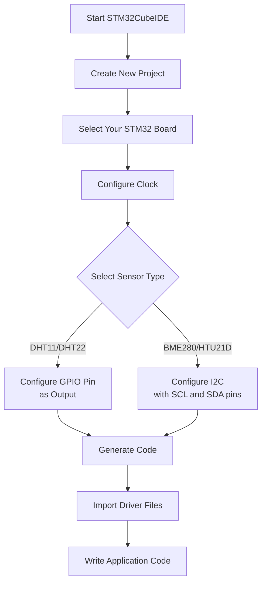

# STM32 Humidity Sensors

## Introduction

Humidity sensors are essential components in many embedded systems, from weather stations to HVAC controls and environmental monitoring applications. These sensors measure the amount of water vapor in the air, which is crucial for comfort, industrial processes, and scientific measurements.

In this tutorial, we'll explore how to integrate humidity sensors with STM32 microcontrollers. We'll cover commonly used sensors like the DHT11/DHT22 and the more precise I²C-based sensors such as the BME280 and HTU21D. By the end of this tutorial, you'll be able to connect a humidity sensor to your STM32 board, read humidity (and often temperature) values, and use this data in your embedded applications.

## Hardware Overview

### Common Humidity Sensors

Before we dive into the code, let's understand the most commonly used humidity sensors for STM32 projects:

1. **DHT11/DHT22**:
   - Simple, low-cost sensors
   - Use a single-wire digital interface
   - DHT11: ±5% humidity accuracy, 0-50°C temperature range
   - DHT22: ±2-5% humidity accuracy, -40 to 80°C temperature range

2. **BME280**:
   - High precision environmental sensor (humidity, temperature, pressure)
   - I²C or SPI interface
   - ±3% humidity accuracy
   - Small form factor

3. **HTU21D/SHT21**:
   - High accuracy (±2% RH)
   - I²C interface
   - Low power consumption

### Hardware Connections

Let's look at how to connect these sensors to your STM32 board:

#### DHT11/DHT22 Connection

| DHT11/22 Pin | STM32 Pin   | Notes                      |
|--------------|-------------|----------------------------|
| VCC          | 3.3V or 5V  | Check sensor specifications |
| DATA         | GPIO Pin    | Needs a 4.7kΩ pullup resistor |
| GND          | GND         |                            |

#### BME280/HTU21D Connection (I²C)

| Sensor Pin   | STM32 Pin   | Notes                      |
|--------------|-------------|----------------------------|
| VCC          | 3.3V        | Do not use 5V              |
| GND          | GND         |                            |
| SCL          | SCL (PB6)*  | I²C clock line             |
| SDA          | SDA (PB7)*  | I²C data line              |

*Note: I²C pins may vary depending on your specific STM32 model. Check your datasheet for the correct I²C pins.

## Software Implementation

### DHT11/DHT22 Sensor Integration

The DHT sensors use a custom single-wire protocol that requires precise timing. Here's how to implement it using the STM32 HAL library:

```c
/* DHT11/DHT22 driver for STM32 */
#include "main.h"
#include "dht.h"

#define DHT_PORT GPIOA
#define DHT_PIN GPIO_PIN_1

DHT_DataTypedef DHT_Data;

static void DHT_DelayUs(uint16_t time) {
    uint16_t delay = time * (HAL_RCC_GetHCLKFreq() / 1000000);
    while (delay--) {
        __NOP();
    }
}

static void DHT_SetPinOutput(GPIO_TypeDef *GPIOx, uint16_t GPIO_Pin) {
    GPIO_InitTypeDef GPIO_InitStruct = {0};
    GPIO_InitStruct.Pin = GPIO_Pin;
    GPIO_InitStruct.Mode = GPIO_MODE_OUTPUT_PP;
    GPIO_InitStruct.Pull = GPIO_NOPULL;
    GPIO_InitStruct.Speed = GPIO_SPEED_FREQ_LOW;
    HAL_GPIO_Init(GPIOx, &GPIO_InitStruct);
}

static void DHT_SetPinInput(GPIO_TypeDef *GPIOx, uint16_t GPIO_Pin) {
    GPIO_InitTypeDef GPIO_InitStruct = {0};
    GPIO_InitStruct.Pin = GPIO_Pin;
    GPIO_InitStruct.Mode = GPIO_MODE_INPUT;
    GPIO_InitStruct.Pull = GPIO_PULLUP;
    GPIO_InitStruct.Speed = GPIO_SPEED_FREQ_LOW;
    HAL_GPIO_Init(GPIOx, &GPIO_InitStruct);
}

uint8_t DHT_ReadSensor(DHT_DataTypedef *DHT_Data, uint8_t sensor_type) {
    uint8_t i, j, temp;
    uint8_t data[5] = {0, 0, 0, 0, 0};
    uint8_t error = 0;
    
    // Start communication
    DHT_SetPinOutput(DHT_PORT, DHT_PIN);
    HAL_GPIO_WritePin(DHT_PORT, DHT_PIN, GPIO_PIN_RESET);
    
    // DHT11 needs at least 18ms, DHT22 needs at least 1ms
    if (sensor_type == DHT11_SENSOR) {
        HAL_Delay(18);
    } else {
        HAL_Delay(1);
    }
    
    HAL_GPIO_WritePin(DHT_PORT, DHT_PIN, GPIO_PIN_SET);
    DHT_DelayUs(40);
    
    // Switch to input mode and wait for sensor response
    DHT_SetPinInput(DHT_PORT, DHT_PIN);
    
    if (HAL_GPIO_ReadPin(DHT_PORT, DHT_PIN) == GPIO_PIN_RESET) {
        // Sensor responded with low pulse
        while (HAL_GPIO_ReadPin(DHT_PORT, DHT_PIN) == GPIO_PIN_RESET); // Wait for high
        while (HAL_GPIO_ReadPin(DHT_PORT, DHT_PIN) == GPIO_PIN_SET);   // Wait for low
        
        // Read 40 bits (5 bytes)
        for (i = 0; i < 5; i++) {
            for (j = 0; j < 8; j++) {
                while (HAL_GPIO_ReadPin(DHT_PORT, DHT_PIN) == GPIO_PIN_RESET); // Wait for high
                
                DHT_DelayUs(40); // Wait to see if pulse is long or short
                
                if (HAL_GPIO_ReadPin(DHT_PORT, DHT_PIN) == GPIO_PIN_SET) {
                    // If still high, it's a '1' bit
                    temp = 1;
                } else {
                    // If low, it's a '0' bit
                    temp = 0;
                }
                
                data[i] |= temp << (7 - j);
                
                while (HAL_GPIO_ReadPin(DHT_PORT, DHT_PIN) == GPIO_PIN_SET); // Wait for next bit
            }
        }
        
        // Verify checksum
        if (data[4] == ((data[0] + data[1] + data[2] + data[3]) & 0xFF)) {
            // Process humidity and temperature based on sensor type
            if (sensor_type == DHT11_SENSOR) {
                DHT_Data->Humidity = data[0];
                DHT_Data->Temperature = data[2];
            } else { // DHT22
                DHT_Data->Humidity = ((data[0] << 8) | data[1]) / 10.0;
                // Check if temperature is negative
                if (data[2] & 0x80) {
                    DHT_Data->Temperature = -(((data[2] & 0x7F) << 8) | data[3]) / 10.0;
                } else {
                    DHT_Data->Temperature = ((data[2] << 8) | data[3]) / 10.0;
                }
            }
        } else {
            error = DHT_CHECKSUM_ERROR;
        }
    } else {
        error = DHT_RESPONSE_ERROR;
    }
    
    return error;
}
```

Here's the accompanying header file:

```c
/* dht.h */
#ifndef DHT_H
#define DHT_H

#include "main.h"

#define DHT11_SENSOR 0
#define DHT22_SENSOR 1

#define DHT_OK              0
#define DHT_CHECKSUM_ERROR  1
#define DHT_RESPONSE_ERROR  2

typedef struct {
    float Temperature;
    float Humidity;
} DHT_DataTypedef;

uint8_t DHT_ReadSensor(DHT_DataTypedef *DHT_Data, uint8_t sensor_type);

#endif
```

### BME280 Sensor Integration via I²C

For I²C sensors like the BME280, the implementation is cleaner as we can leverage the STM32 HAL I²C library:

```c
/* bme280.h simplified header */
#ifndef BME280_H
#define BME280_H

#include "main.h"

#define BME280_ADDRESS 0x76 << 1  // Default I2C address (SDO to GND)
// Alternative address: 0x77 << 1 (SDO to VDD)

typedef struct {
    float temperature;
    float pressure;
    float humidity;
} BME280_Data;

uint8_t BME280_Init(I2C_HandleTypeDef *hi2c);
uint8_t BME280_ReadData(I2C_HandleTypeDef *hi2c, BME280_Data *data);

#endif
```

Here's a simplified implementation focusing on the humidity reading:

```c
/* BME280 driver for STM32 - simplified for this tutorial */
#include "bme280.h"

// BME280 registers
#define BME280_REG_ID         0xD0
#define BME280_REG_CTRL_HUM   0xF2
#define BME280_REG_CTRL_MEAS  0xF4
#define BME280_REG_CONFIG     0xF5
#define BME280_REG_DATA       0xF7

// Calibration data
static uint16_t dig_T1, dig_P1;
static int16_t dig_T2, dig_T3, dig_P2, dig_P3, dig_P4, dig_P5, dig_P6, dig_P7, dig_P8, dig_P9;
static uint8_t dig_H1, dig_H3;
static int16_t dig_H2, dig_H4, dig_H5;
static int8_t dig_H6;

static int32_t t_fine; // Used for temperature compensation

// Helper function to write a single byte to a register
static HAL_StatusTypeDef BME280_WriteReg(I2C_HandleTypeDef *hi2c, uint8_t reg, uint8_t value) {
    return HAL_I2C_Mem_Write(hi2c, BME280_ADDRESS, reg, I2C_MEMADD_SIZE_8BIT, &value, 1, HAL_MAX_DELAY);
}

// Read calibration data from the sensor
static HAL_StatusTypeDef BME280_ReadCalibration(I2C_HandleTypeDef *hi2c) {
    uint8_t calib_data[26];
    
    // Read calibration data for temperature and pressure (registers 0x88-0xA1)
    if (HAL_I2C_Mem_Read(hi2c, BME280_ADDRESS, 0x88, I2C_MEMADD_SIZE_8BIT, calib_data, 26, HAL_MAX_DELAY) != HAL_OK) {
        return HAL_ERROR;
    }
    
    dig_T1 = (calib_data[1] << 8) | calib_data[0];
    dig_T2 = (calib_data[3] << 8) | calib_data[2];
    dig_T3 = (calib_data[5] << 8) | calib_data[4];
    
    dig_P1 = (calib_data[7] << 8) | calib_data[6];
    dig_P2 = (calib_data[9] << 8) | calib_data[8];
    dig_P3 = (calib_data[11] << 8) | calib_data[10];
    dig_P4 = (calib_data[13] << 8) | calib_data[12];
    dig_P5 = (calib_data[15] << 8) | calib_data[14];
    dig_P6 = (calib_data[17] << 8) | calib_data[16];
    dig_P7 = (calib_data[19] << 8) | calib_data[18];
    dig_P8 = (calib_data[21] << 8) | calib_data[20];
    dig_P9 = (calib_data[23] << 8) | calib_data[22];
    
    dig_H1 = calib_data[25];
    
    // Read humidity calibration data
    uint8_t calib_data_h[7];
    if (HAL_I2C_Mem_Read(hi2c, BME280_ADDRESS, 0xE1, I2C_MEMADD_SIZE_8BIT, calib_data_h, 7, HAL_MAX_DELAY) != HAL_OK) {
        return HAL_ERROR;
    }
    
    dig_H2 = (calib_data_h[1] << 8) | calib_data_h[0];
    dig_H3 = calib_data_h[2];
    dig_H4 = (calib_data_h[3] << 4) | (calib_data_h[4] & 0x0F);
    dig_H5 = (calib_data_h[5] << 4) | (calib_data_h[4] >> 4);
    dig_H6 = calib_data_h[6];
    
    return HAL_OK;
}

// Initialize the BME280 sensor
uint8_t BME280_Init(I2C_HandleTypeDef *hi2c) {
    uint8_t id;
    
    // Verify sensor ID
    if (HAL_I2C_Mem_Read(hi2c, BME280_ADDRESS, BME280_REG_ID, I2C_MEMADD_SIZE_8BIT, &id, 1, HAL_MAX_DELAY) != HAL_OK) {
        return 0;
    }
    
    if (id != 0x60) { // BME280 ID should be 0x60
        return 0;
    }
    
    // Read calibration data
    if (BME280_ReadCalibration(hi2c) != HAL_OK) {
        return 0;
    }
    
    // Configure sensor
    // Humidity oversampling x1
    BME280_WriteReg(hi2c, BME280_REG_CTRL_HUM, 0x01);
    
    // Temperature and pressure oversampling x1, normal mode
    BME280_WriteReg(hi2c, BME280_REG_CTRL_MEAS, 0x27);
    
    // Filter off, standby time 0.5ms
    BME280_WriteReg(hi2c, BME280_REG_CONFIG, 0x00);
    
    // Wait for stabilization
    HAL_Delay(100);
    
    return 1;
}

// Compensate temperature
static float BME280_CompensateTemperature(int32_t adc_T) {
    int32_t var1, var2;
    
    var1 = ((((adc_T >> 3) - ((int32_t)dig_T1 << 1))) * ((int32_t)dig_T2)) >> 11;
    var2 = (((((adc_T >> 4) - ((int32_t)dig_T1)) * ((adc_T >> 4) - ((int32_t)dig_T1))) >> 12) * ((int32_t)dig_T3)) >> 14;
    
    t_fine = var1 + var2;
    
    float temperature = (t_fine * 5 + 128) >> 8;
    return temperature / 100.0f;
}

// Compensate pressure
static float BME280_CompensatePressure(int32_t adc_P) {
    int64_t var1, var2, p;
    
    var1 = ((int64_t)t_fine) - 128000;
    var2 = var1 * var1 * (int64_t)dig_P6;
    var2 = var2 + ((var1 * (int64_t)dig_P5) << 17);
    var2 = var2 + (((int64_t)dig_P4) << 35);
    var1 = ((var1 * var1 * (int64_t)dig_P3) >> 8) + ((var1 * (int64_t)dig_P2) << 12);
    var1 = (((((int64_t)1) << 47) + var1)) * ((int64_t)dig_P1) >> 33;
    
    if (var1 == 0) {
        return 0;  // Avoid division by zero
    }
    
    p = 1048576 - adc_P;
    p = (((p << 31) - var2) * 3125) / var1;
    var1 = (((int64_t)dig_P9) * (p >> 13) * (p >> 13)) >> 25;
    var2 = (((int64_t)dig_P8) * p) >> 19;
    
    p = ((p + var1 + var2) >> 8) + (((int64_t)dig_P7) << 4);
    return (float)p / 256.0f;
}

// Compensate humidity
static float BME280_CompensateHumidity(int32_t adc_H) {
    int32_t v_x1_u32r;
    
    v_x1_u32r = (t_fine - ((int32_t)76800));
    v_x1_u32r = (((((adc_H << 14) - (((int32_t)dig_H4) << 20) - (((int32_t)dig_H5) * v_x1_u32r)) +
                   ((int32_t)16384)) >> 15) * (((((((v_x1_u32r * ((int32_t)dig_H6)) >> 10) *
                   (((v_x1_u32r * ((int32_t)dig_H3)) >> 11) + ((int32_t)32768))) >> 10) +
                   ((int32_t)2097152)) * ((int32_t)dig_H2) + 8192) >> 14));
    
    v_x1_u32r = (v_x1_u32r - (((((v_x1_u32r >> 15) * (v_x1_u32r >> 15)) >> 7) * ((int32_t)dig_H1)) >> 4));
    v_x1_u32r = (v_x1_u32r < 0 ? 0 : v_x1_u32r);
    v_x1_u32r = (v_x1_u32r > 419430400 ? 419430400 : v_x1_u32r);
    
    return (float)(v_x1_u32r >> 12) / 1024.0f;
}

// Read sensor data
uint8_t BME280_ReadData(I2C_HandleTypeDef *hi2c, BME280_Data *data) {
    uint8_t raw_data[8];
    
    // Read all data registers at once (0xF7 to 0xFE)
    if (HAL_I2C_Mem_Read(hi2c, BME280_ADDRESS, BME280_REG_DATA, I2C_MEMADD_SIZE_8BIT, raw_data, 8, HAL_MAX_DELAY) != HAL_OK) {
        return 0;
    }
    
    // Parse pressure (20 bits)
    int32_t adc_P = (raw_data[0] << 12) | (raw_data[1] << 4) | (raw_data[2] >> 4);
    
    // Parse temperature (20 bits)
    int32_t adc_T = (raw_data[3] << 12) | (raw_data[4] << 4) | (raw_data[5] >> 4);
    
    // Parse humidity (16 bits)
    int32_t adc_H = (raw_data[6] << 8) | raw_data[7];
    
    // Calculate actual values using compensation formulas
    data->temperature = BME280_CompensateTemperature(adc_T);
    data->pressure = BME280_CompensatePressure(adc_P) / 100.0f; // Convert to hPa
    data->humidity = BME280_CompensateHumidity(adc_H);
    
    return 1;
}
```

## Step-by-Step Implementation Guide

Now that we've seen the driver code, let's implement a complete humidity monitoring application step by step.

### 1. Project Setup in STM32CubeIDE

1. Create a new STM32 project for your microcontroller
2. Configure the necessary peripherals:
   - For DHT11/DHT22: Configure one GPIO pin as output
   - For BME280/HTU21D: Configure I²C peripheral

Here's an example peripheral configuration in CubeMX:



### 2. Using the DHT11/DHT22 Sensor

Here's how to use the DHT driver in your main application:

```c
/* main.c */
#include "main.h"
#include "dht.h"
#include <stdio.h>

// ... STM32 peripheral initialization code here ...

int main(void) {
  HAL_Init();
  SystemClock_Config();
  
  // Initialize GPIO, UART, etc.
  MX_GPIO_Init();
  MX_USART2_UART_Init();  // Assuming UART is configured for debugging
  
  DHT_DataTypedef dhtData;
  char msg[50];
  uint8_t status;
  
  while (1) {
    // Read from DHT22 sensor (or use DHT11_SENSOR for DHT11)
    status = DHT_ReadSensor(&dhtData, DHT22_SENSOR);
    
    if (status == DHT_OK) {
      sprintf(msg, "Temperature: %.1f°C, Humidity: %.1f%%\r
", 
              dhtData.Temperature, dhtData.Humidity);
      HAL_UART_Transmit(&huart2, (uint8_t*)msg, strlen(msg), HAL_MAX_DELAY);
    } else {
      sprintf(msg, "Sensor reading failed, error: %d\r
", status);
      HAL_UART_Transmit(&huart2, (uint8_t*)msg, strlen(msg), HAL_MAX_DELAY);
    }
    
    HAL_Delay(2000);  // DHT sensors can't be read more frequently than every 2 seconds
  }
}
```

### 3. Using the BME280 I²C Sensor

And here's how to use the BME280 driver:

```c
/* main.c */
#include "main.h"
#include "bme280.h"
#include <stdio.h>

// ... STM32 peripheral initialization code here ...

I2C_HandleTypeDef hi2c1;
UART_HandleTypeDef huart2;

int main(void) {
  HAL_Init();
  SystemClock_Config();
  
  // Initialize peripherals
  MX_GPIO_Init();
  MX_I2C1_Init();
  MX_USART2_UART_Init();
  
  BME280_Data envData;
  char msg[80];
  
  // Initialize BME280 sensor
  if (!BME280_Init(&hi2c1)) {
    sprintf(msg, "BME280 initialization failed!\r
");
    HAL_UART_Transmit(&huart2, (uint8_t*)msg, strlen(msg), HAL_MAX_DELAY);
    Error_Handler();
  }
  
  while (1) {
    // Read environmental data
    if (BME280_ReadData(&hi2c1, &envData)) {
      sprintf(msg, "Temperature: %.2f°C, Pressure: %.2f hPa, Humidity: %.2f%%\r
", 
              envData.temperature, envData.pressure, envData.humidity);
      HAL_UART_Transmit(&huart2, (uint8_t*)msg, strlen(msg), HAL_MAX_DELAY);
    } else {
      sprintf(msg, "Failed to read BME280 sensor!\r
");
      HAL_UART_Transmit(&huart2, (uint8_t*)msg, strlen(msg), HAL_MAX_DELAY);
    }
    
    HAL_Delay(1000);
  }
}
```

## Real-World Applications

### 1. Smart Environment Monitor

This application records temperature and humidity data over time and alerts the user when conditions fall outside acceptable ranges.

```c
/* Simplified code for a smart environment monitor */
#define MIN_HUMIDITY 30.0f
#define MAX_HUMIDITY 70.0f

typedef struct {
    float humidity;
    float temperature;
    uint32_t timestamp;
} EnvironmentRecord;

#define MAX_RECORDS 24  // Store 24 hours of data

EnvironmentRecord historyData[MAX_RECORDS];
uint8_t recordIndex = 0;

void AddEnvironmentRecord(float humidity, float temperature) {
    historyData[recordIndex].humidity = humidity;
    historyData[recordIndex].temperature = temperature;
    historyData[recordIndex].timestamp = HAL_GetTick();
    
    // Move to next record position (circular buffer)
    recordIndex = (recordIndex + 1) % MAX_RECORDS;
}

void CheckAlertConditions(float humidity) {
    if (humidity < MIN_HUMIDITY) {
        // Humidity too low alert
        HAL_GPIO_WritePin(ALERT_LED_GPIO_Port, ALERT_LED_Pin, GPIO_PIN_SET);
        // Maybe also trigger a buzzer or send an alert message
    } else if (humidity > MAX_HUMIDITY) {
        // Humidity too high alert
        HAL_GPIO_TogglePin(ALERT_LED_GPIO_Port, ALERT_LED_Pin);  // Blink for high humidity
        HAL_Delay(200);
    } else {
        // Normal conditions
        HAL_GPIO_WritePin(ALERT_LED_GPIO_Port, ALERT_LED_Pin, GPIO_PIN_RESET);
    }
}
```

### 2. Weather Station with Data Logging

This application stores humidity and temperature readings to an SD card using FatFS:

```c
/* Simplified code for an SD card data logger */
#include "fatfs.h"

FATFS fs;
FIL logFile;
FRESULT res;

void InitSDCard() {
    res = f_mount(&fs, "", 0);
    if (res != FR_OK) {
        Error_Handler();
    }
}

void LogEnvironmentalData(float temperature, float humidity, float pressure) {
    char logLine[100];
    UINT bytesWritten;
    
    // Get current time from RTC
    RTC_TimeTypeDef time;
    RTC_DateTypeDef date;
    HAL_RTC_GetTime(&hrtc, &time, RTC_FORMAT_BIN);
    HAL_RTC_GetDate(&hrtc, &date, RTC_FORMAT_BIN);
    
    // Format log entry
    sprintf(logLine, "%02d/%02d/%02d,%02d:%02d:%02d,%.1f,%.1f,%.1f\r
",
            date.Date, date.Month, date.Year,
            time.Hours, time.Minutes, time.Seconds,
            temperature, humidity, pressure);
    
    // Open and write to log file
    if (f_open(&logFile, "WEATHER.CSV", FA_OPEN_APPEND | FA_WRITE | FA_CREATE_ALWAYS) == FR_OK) {
        f_write(&logFile, logLine, strlen(logLine), &bytesWritten);
        f_close(&logFile);
    }
}
```

### 3. Greenhouse Automation System

This example shows how to use humidity data to control a fan:

```c
/* Simplified greenhouse automation system */
#define FAN_GPIO_Port GPIOC
#define FAN_Pin GPIO_PIN_13

#define HUMIDITY_THRESHOLD 80.0f  // 80% humidity threshold for activating the fan

void ControlGreenhouse(float humidity) {
    if (humidity > HUMIDITY_THRESHOLD) {
        // Too humid, activate fan
        HAL_GPIO_WritePin(FAN_GPIO_Port, FAN_Pin, GPIO_PIN_SET);
    } else if (humidity < (HUMIDITY_THRESHOLD - 5.0f)) {
        // Humidity is below threshold with hysteresis, turn off fan
        HAL_GPIO_WritePin(FAN_GPIO_Port, FAN_Pin, GPIO_PIN_RESET);
    }
    // Otherwise maintain current state (hysteresis prevents oscillation)
}
```

## Troubleshooting

When working with humidity sensors, you might encounter these common issues:

1. **Incorrect Readings**:
   - Check power supply voltage (3.3V vs 5V compatibility)
   - Verify pull-up resistors for DHT sensors (4.7kΩ recommended)
   - Ensure correct I²C address for BME280/HTU21D

2. **Communication Failures**:
   - Check wiring connections
   - Verify timing parameters for DHT sensors
   - For I²C sensors, check for correct SDA/SCL pins and pull-up resistors

3. **Sensor Drift/Inaccuracy**:
   - Calibrate against a reference sensor
   - Avoid placing sensors near heat sources
   - Some sensors need time to stabilize after power-up

4. **Code Debugging**:
   - Use HAL_Delay() after initialization to give sensors time to boot
   - For DHT sensors, timing is critical - adjust delay functions if needed
   - For I²C sensors, reduce clock speed if communication is unreliable

## Summary

In this tutorial, we've covered the integration of humidity sensors with STM32 microcontrollers. We've learned:

1. How to interface with both simple single-wire sensors (DHT11/DHT22) and more advanced I²C sensors (BME280/HTU21