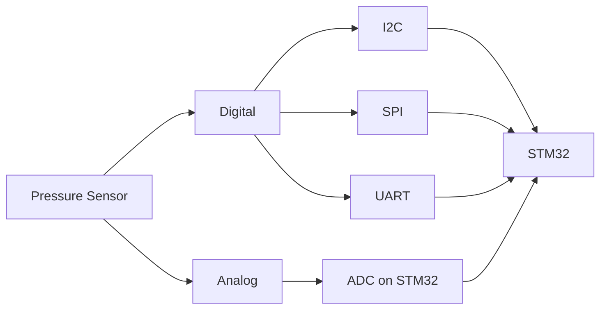
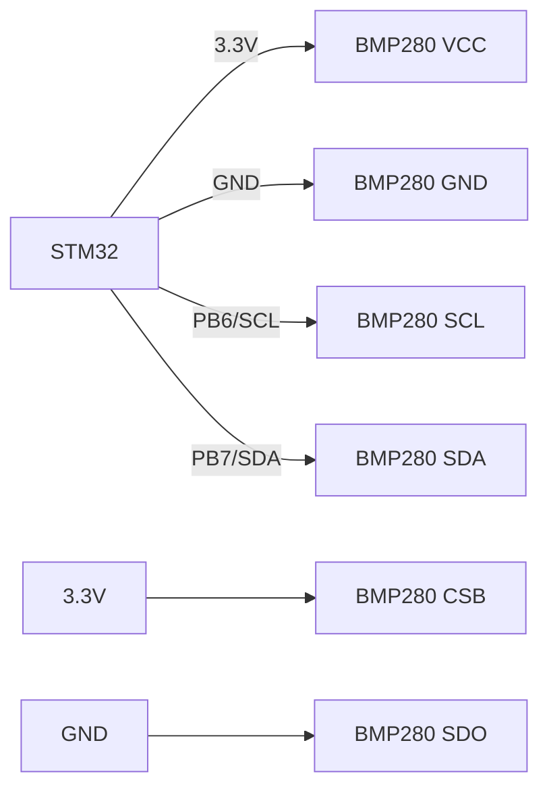

# STM32 Pressure Sensors

## Introduction

Pressure sensors are essential components in many embedded applications, from weather stations and altimeters to industrial process control and automotive systems. These sensors measure physical pressure—the force applied to an area—and convert it into an electrical signal that our microcontroller can interpret.

In this guide, we'll explore how to integrate pressure sensors with STM32 microcontrollers, which are powerful ARM Cortex-M based devices widely used in embedded systems. We'll cover different types of pressure sensors, their working principles, communication protocols, and provide practical examples for reading and processing pressure data.

## Understanding Pressure Sensors

### What is a Pressure Sensor?

A pressure sensor is a device that measures physical pressure and converts it into an electrical signal. Pressure is typically measured in units like Pascal (Pa), bar, PSI (pounds per square inch), or atmospheres (atm).

### Types of Pressure Sensors Compatible with STM32

1. **Analog Pressure Sensors** - Output a voltage proportional to the measured pressure
2. **Digital Pressure Sensors** - Communicate via protocols like I2C, SPI, or UART
3. **MEMS (Micro-Electro-Mechanical Systems) Pressure Sensors** - Miniaturized sensors often integrating multiple sensing capabilities

### Common Pressure Sensor Parameters

- **Pressure Range**: The minimum and maximum pressure the sensor can measure
- **Accuracy**: How close the measurement is to the actual value
- **Resolution**: The smallest change in pressure that can be detected
- **Response Time**: How quickly the sensor responds to pressure changes
- **Operating Temperature Range**: The temperatures at which the sensor functions correctly

## Popular STM32-Compatible Pressure Sensors

Some commonly used pressure sensors that work well with STM32 microcontrollers include:

1. **BMP280/BMP388** (Bosch) - Digital barometric pressure sensors with I2C/SPI interface
2. **LPS22HB/LPS25HB** (ST Microelectronics) - MEMS pressure sensors with digital output
3. **MS5611/MS5607** (TE Connectivity) - High-resolution altimeter sensors
4. **MPX5010/MPX4115** (NXP) - Analog pressure sensors

## Communication Interfaces

STM32 microcontrollers support various interfaces to communicate with pressure sensors:



### Analog Sensors

Analog sensors output a voltage proportional to the pressure. To read these sensors, we use the STM32's Analog-to-Digital Converter (ADC).

### Digital Sensors

Digital sensors communicate using protocols like:

1. **I2C (Inter-Integrated Circuit)** - A two-wire interface using SCL (clock) and SDA (data)
2. **SPI (Serial Peripheral Interface)** - A four-wire interface using MOSI, MISO, SCK, and CS
3. **UART (Universal Asynchronous Receiver-Transmitter)** - A serial communication protocol

## Hardware Setup

### Connecting an I2C Pressure Sensor (BMP280 Example)

Here's how to connect a BMP280 sensor to an STM32 microcontroller:

1. Connect VCC to 3.3V power supply
2. Connect GND to ground
3. Connect SCL to the I2C clock pin (e.g., PB6 on many STM32 boards)
4. Connect SDA to the I2C data pin (e.g., PB7 on many STM32 boards)
5. Connect CSB to VCC for I2C mode (or to a GPIO pin for SPI mode)
6. Connect SDO to GND to set the I2C address to 0x76 (or to VCC for 0x77)



### Connecting an Analog Pressure Sensor (MPX5010 Example)

For an analog sensor like the MPX5010:

1. Connect VCC to 5V power supply
2. Connect GND to ground
3. Connect the output pin to an ADC channel on the STM32 (e.g., PA0)
4. You may need a voltage divider if the sensor output exceeds 3.3V

## Software Implementation

### STM32CubeMX Configuration

1. **For I2C Digital Sensors:**
   - Enable the I2C peripheral in STM32CubeMX
   - Configure the appropriate pins (e.g., PB6 and PB7 for I2C1)
   - Set the I2C speed (typically 100kHz or 400kHz)

2. **For SPI Digital Sensors:**
   - Enable the SPI peripheral
   - Configure MOSI, MISO, SCK pins, and an additional GPIO for CS

3. **For Analog Sensors:**
   - Enable the ADC peripheral
   - Configure the appropriate ADC channel
   - Set ADC parameters (resolution, sampling time, etc.)

### Reading a Digital Pressure Sensor (BMP280 Example)

Here's how to read pressure from a BMP280 sensor using the I2C interface:

```c
#include "main.h"
#include <stdio.h>
#include <string.h>

extern I2C_HandleTypeDef hi2c1;  // I2C handle defined in main.c

#define BMP280_ADDRESS 0x76 << 1  // Shifted for STM32 HAL
#define BMP280_ID_REG 0xD0
#define BMP280_CTRL_MEAS_REG 0xF4
#define BMP280_CONFIG_REG 0xF5
#define BMP280_PRESSURE_MSB_REG 0xF7

// Calibration data structure
typedef struct {
    uint16_t dig_T1;
    int16_t dig_T2;
    int16_t dig_T3;
    uint16_t dig_P1;
    int16_t dig_P2;
    int16_t dig_P3;
    int16_t dig_P4;
    int16_t dig_P5;
    int16_t dig_P6;
    int16_t dig_P7;
    int16_t dig_P8;
    int16_t dig_P9;
} BMP280_CalibData;

BMP280_CalibData calibData;
int32_t t_fine;

// Function to read calibration data
void BMP280_ReadCalibrationData() {
    uint8_t data[24];
    HAL_I2C_Mem_Read(&hi2c1, BMP280_ADDRESS, 0x88, I2C_MEMADD_SIZE_8BIT, data, 24, HAL_MAX_DELAY);
    
    calibData.dig_T1 = (data[1] << 8) | data[0];
    calibData.dig_T2 = (data[3] << 8) | data[2];
    calibData.dig_T3 = (data[5] << 8) | data[4];
    calibData.dig_P1 = (data[7] << 8) | data[6];
    calibData.dig_P2 = (data[9] << 8) | data[8];
    calibData.dig_P3 = (data[11] << 8) | data[10];
    calibData.dig_P4 = (data[13] << 8) | data[12];
    calibData.dig_P5 = (data[15] << 8) | data[14];
    calibData.dig_P6 = (data[17] << 8) | data[16];
    calibData.dig_P7 = (data[19] << 8) | data[18];
    calibData.dig_P8 = (data[21] << 8) | data[20];
    calibData.dig_P9 = (data[23] << 8) | data[22];
}

// Function to initialize BMP280
uint8_t BMP280_Init() {
    uint8_t id;
    
    // Check sensor ID
    HAL_I2C_Mem_Read(&hi2c1, BMP280_ADDRESS, BMP280_ID_REG, I2C_MEMADD_SIZE_8BIT, &id, 1, HAL_MAX_DELAY);
    
    if (id != 0x58) {  // 0x58 is the expected ID for BMP280
        return 0;  // Initialization failed
    }
    
    // Read calibration data
    BMP280_ReadCalibrationData();
    
    // Configure the sensor
    uint8_t config = 0;
    config = (0x04 << 5) | (0x04 << 2) | 0x00;  // standby time, filter, SPI disabled
    HAL_I2C_Mem_Write(&hi2c1, BMP280_ADDRESS, BMP280_CONFIG_REG, I2C_MEMADD_SIZE_8BIT, &config, 1, HAL_MAX_DELAY);
    
    // Set measurement mode
    config = (0x05 << 5) | (0x05 << 2) | 0x03;  // temp oversampling x16, pressure oversampling x16, normal mode
    HAL_I2C_Mem_Write(&hi2c1, BMP280_ADDRESS, BMP280_CTRL_MEAS_REG, I2C_MEMADD_SIZE_8BIT, &config, 1, HAL_MAX_DELAY);
    
    return 1;  // Initialization successful
}

// Calculate temperature from raw data
int32_t BMP280_CompensateTemperature(int32_t adc_T) {
    int32_t var1, var2, T;
    
    var1 = ((((adc_T >> 3) - ((int32_t)calibData.dig_T1 << 1))) * ((int32_t)calibData.dig_T2)) >> 11;
    var2 = (((((adc_T >> 4) - ((int32_t)calibData.dig_T1)) * ((adc_T >> 4) - ((int32_t)calibData.dig_T1))) >> 12) * ((int32_t)calibData.dig_T3)) >> 14;
    
    t_fine = var1 + var2;
    T = (t_fine * 5 + 128) >> 8;
    
    return T;  // Temperature in 0.01 °C
}

// Calculate pressure from raw data
uint32_t BMP280_CompensatePressure(int32_t adc_P) {
    int64_t var1, var2, p;
    
    var1 = ((int64_t)t_fine) - 128000;
    var2 = var1 * var1 * (int64_t)calibData.dig_P6;
    var2 = var2 + ((var1 * (int64_t)calibData.dig_P5) << 17);
    var2 = var2 + (((int64_t)calibData.dig_P4) << 35);
    var1 = ((var1 * var1 * (int64_t)calibData.dig_P3) >> 8) + ((var1 * (int64_t)calibData.dig_P2) << 12);
    var1 = (((((int64_t)1) << 47) + var1)) * ((int64_t)calibData.dig_P1) >> 33;
    
    if (var1 == 0) {
        return 0;  // Avoid division by zero
    }
    
    p = 1048576 - adc_P;
    p = (((p << 31) - var2) * 3125) / var1;
    var1 = (((int64_t)calibData.dig_P9) * (p >> 13) * (p >> 13)) >> 25;
    var2 = (((int64_t)calibData.dig_P8) * p) >> 19;
    
    p = ((p + var1 + var2) >> 8) + (((int64_t)calibData.dig_P7) << 4);
    
    return (uint32_t)p;  // Pressure in Pa/256
}

// Read temperature and pressure
void BMP280_ReadMeasurements(float *temperature, float *pressure) {
    uint8_t data[6];
    int32_t adc_P, adc_T;
    
    // Read 6 bytes of data starting from register 0xF7
    HAL_I2C_Mem_Read(&hi2c1, BMP280_ADDRESS, BMP280_PRESSURE_MSB_REG, I2C_MEMADD_SIZE_8BIT, data, 6, HAL_MAX_DELAY);
    
    adc_P = (data[0] << 12) | (data[1] << 4) | (data[2] >> 4);
    adc_T = (data[3] << 12) | (data[4] << 4) | (data[5] >> 4);
    
    // Compensate temperature and pressure
    int32_t temp = BMP280_CompensateTemperature(adc_T);
    uint32_t pres = BMP280_CompensatePressure(adc_P);
    
    *temperature = temp / 100.0f;  // Temperature in °C
    *pressure = pres / 256.0f;     // Pressure in Pa
}

// Example usage in main.c
void ExampleUsage() {
    // Initialize BMP280
    if (!BMP280_Init()) {
        printf("BMP280 initialization failed!\r
");
        while (1);
    }
    
    while (1) {
        float temperature, pressure;
        BMP280_ReadMeasurements(&temperature, &pressure);
        
        float pressure_hPa = pressure / 100.0f;  // Convert Pa to hPa
        
        printf("Temperature: %.2f °C\r
", temperature);
        printf("Pressure: %.2f hPa\r
", pressure_hPa);
        
        HAL_Delay(1000);  // Read every second
    }
}
```

**Example Output:**
```
Temperature: 25.12 °C
Pressure: 1013.25 hPa
Temperature: 25.14 °C
Pressure: 1013.22 hPa
```

### Reading an Analog Pressure Sensor (MPX5010 Example)

Here's how to read an analog pressure sensor using the STM32's ADC:

```c
#include "main.h"
#include <stdio.h>

extern ADC_HandleTypeDef hadc1;  // ADC handle defined in main.c

// MPX5010 sensor parameters
#define V_SUPPLY 5.0f             // Supply voltage (V)
#define SENSITIVITY 0.009f        // Sensitivity (V/kPa)
#define OFFSET_VOLTAGE 0.2f       // Offset voltage (V)
#define MAX_PRESSURE 10.0f        // Maximum pressure (kPa)

// Read pressure from MPX5010 analog sensor
float MPX5010_ReadPressure() {
    uint32_t adcValue;
    float voltage, pressure;
    
    // Start ADC conversion
    HAL_ADC_Start(&hadc1);
    
    // Wait for conversion to complete
    HAL_ADC_PollForConversion(&hadc1, HAL_MAX_DELAY);
    
    // Get ADC value
    adcValue = HAL_ADC_GetValue(&hadc1);
    
    // Convert ADC value to voltage (assuming 12-bit ADC with 3.3V reference)
    voltage = (adcValue * 3.3f) / 4095.0f;
    
    // Convert voltage to pressure (kPa)
    pressure = (voltage - OFFSET_VOLTAGE) / SENSITIVITY;
    
    // Ensure pressure is within valid range
    if (pressure < 0.0f) pressure = 0.0f;
    if (pressure > MAX_PRESSURE) pressure = MAX_PRESSURE;
    
    return pressure;
}

// Example usage in main.c
void ExampleUsage() {
    while (1) {
        float pressure = MPX5010_ReadPressure();
        
        printf("Pressure: %.2f kPa\r
", pressure);
        
        HAL_Delay(1000);  // Read every second
    }
}
```

**Example Output:**
```
Pressure: 1.25 kPa
Pressure: 1.27 kPa
```

## Practical Applications

### Altitude Calculation

You can use pressure sensors to calculate altitude based on barometric pressure:

```c
// Calculate altitude based on barometric pressure
float CalculateAltitude(float pressure_hPa) {
    // Standard atmospheric pressure at sea level
    const float P0 = 1013.25f;
    
    // Altitude formula based on international barometric formula
    return 44330.0f * (1.0f - pow(pressure_hPa / P0, 0.1903f));
}

// Usage example
float altitude = CalculateAltitude(pressure_hPa);
printf("Altitude: %.2f meters\r
", altitude);
```

### Weather Monitoring Station

This simple weather monitoring application uses pressure trends to predict weather changes:

```c
// Define a structure to store pressure history
typedef struct {
    float values[24];  // Store 24 hours of pressure readings
    uint8_t index;     // Current index in the circular buffer
    uint8_t count;     // Number of valid readings in buffer
} PressureHistory;

PressureHistory pressureHistory = {0};

// Add a new pressure reading to history
void AddPressureReading(float pressure) {
    pressureHistory.values[pressureHistory.index] = pressure;
    pressureHistory.index = (pressureHistory.index + 1) % 24;
    if (pressureHistory.count < 24) pressureHistory.count++;
}

// Analyze pressure trend to predict weather
const char* AnalyzeWeatherTrend() {
    if (pressureHistory.count < 3) return "Insufficient data";
    
    // Calculate 3-hour pressure change
    uint8_t current = pressureHistory.index == 0 ? 23 : pressureHistory.index - 1;
    uint8_t prev = (current + 21) % 24;  // 3 hours ago (3 readings)
    
    float pressureChange = pressureHistory.values[current] - pressureHistory.values[prev];
    
    // Simple weather prediction based on pressure trends
    if (pressureChange > 1.6f)      return "Rapid improvement, short duration";
    else if (pressureChange > 0.7f)  return "Improvement";
    else if (pressureChange > 0.3f)  return "Slight improvement";
    else if (pressureChange > -0.3f) return "No significant change";
    else if (pressureChange > -0.7f) return "Slight deterioration";
    else if (pressureChange > -1.6f) return "Deterioration";
    else                             return "Rapid deterioration, short duration";
}
```

### Leak Detection System

This example demonstrates a simple leak detection system using pressure sensors:

```c
// Define thresholds for leak detection
#define NORMAL_PRESSURE 100.0f  // Normal operating pressure (kPa)
#define LEAK_THRESHOLD 5.0f     // Pressure drop threshold (kPa)
#define ALARM_DELAY 10          // Number of consecutive low readings to trigger alarm

// Leak detection variables
uint8_t lowPressureCount = 0;
bool alarmActive = false;

// Check for leaks
void DetectLeak(float currentPressure) {
    // Check if pressure has dropped below threshold
    if ((NORMAL_PRESSURE - currentPressure) > LEAK_THRESHOLD) {
        lowPressureCount++;
        
        if (lowPressureCount >= ALARM_DELAY && !alarmActive) {
            // Activate alarm
            alarmActive = true;
            printf("LEAK DETECTED! Pressure: %.2f kPa\r
", currentPressure);
            
            // Turn on alarm GPIO pin
            HAL_GPIO_WritePin(ALARM_GPIO_Port, ALARM_Pin, GPIO_PIN_SET);
        }
    } else {
        // Reset counter if pressure returns to normal
        lowPressureCount = 0;
        
        if (alarmActive) {
            // Deactivate alarm
            alarmActive = false;
            printf("Leak condition cleared. Pressure: %.2f kPa\r
", currentPressure);
            
            // Turn off alarm GPIO pin
            HAL_GPIO_WritePin(ALARM_GPIO_Port, ALARM_Pin, GPIO_PIN_RESET);
        }
    }
}
```

## Advanced Features and Optimization

### Power Consumption Optimization

For battery-powered applications, optimize power consumption by:

1. Using the sensor's low-power modes
2. Reading the sensor only when necessary
3. Putting the STM32 into sleep mode between readings

```c
// Example of power-saving implementation for BMP280
void PowerSaving_Example() {
    // Put BMP280 in sleep mode
    uint8_t ctrl_meas = 0x00;  // Sleep mode
    HAL_I2C_Mem_Write(&hi2c1, BMP280_ADDRESS, BMP280_CTRL_MEAS_REG, I2C_MEMADD_SIZE_8BIT, &ctrl_meas, 1, HAL_MAX_DELAY);
    
    // Put STM32 in sleep mode
    HAL_SuspendTick();
    HAL_PWR_EnterSLEEPMode(PWR_MAINREGULATOR_ON, PWR_SLEEPENTRY_WFI);
    HAL_ResumeTick();
    
    // Wake up BMP280 before next reading
    ctrl_meas = (0x05 << 5) | (0x05 << 2) | 0x03;  // Normal mode
    HAL_I2C_Mem_Write(&hi2c1, BMP280_ADDRESS, BMP280_CTRL_MEAS_REG, I2C_MEMADD_SIZE_8BIT, &ctrl_meas, 1, HAL_MAX_DELAY);
    
    // Wait for sensor to wake up
    HAL_Delay(10);
}
```

### Implementing a Digital Filter

To reduce noise in sensor readings, implement a simple moving average filter:

```c
#define FILTER_SIZE 10

// Moving average filter
float MovingAverageFilter(float newValue) {
    static float values[FILTER_SIZE] = {0};
    static uint8_t index = 0;
    static uint8_t count = 0;
    float sum = 0.0f;
    
    // Store new value
    values[index] = newValue;
    index = (index + 1) % FILTER_SIZE;
    if (count < FILTER_SIZE) count++;
    
    // Calculate average
    for (uint8_t i = 0; i < count; i++) {
        sum += values[i];
    }
    
    return sum / count;
}

// Usage example
float rawPressure = MPX5010_ReadPressure();
float filteredPressure = MovingAverageFilter(rawPressure);
```

## Troubleshooting Common Issues

### Sensor Not Responding

If your pressure sensor doesn't respond:

1. Check power connections and voltage levels
2. Verify I2C/SPI/UART configuration
3. Check if the correct address is being used (for I2C sensors)
4. Ensure pull-up resistors are present on I2C lines (typically 4.7kΩ)
5. Check if the sensor is damaged or incompatible

### Noisy or Unstable Readings

If readings are noisy or unstable:

1. Add filtering (as shown in the previous section)
2. Check for proper grounding
3. Reduce wire lengths
4. Add bypass capacitors near the sensor (e.g., 0.1μF)
5. Ensure the sensor is mechanically stable
6. Check for interference from other components

### Calibration Issues

To improve accuracy:

1. Compare readings with a reference pressure source
2. Apply calibration offsets and scaling factors
3. Consider temperature compensation if needed

```c
// Example of simple calibration
float CalibrateReading(float rawPressure) {
    const float OFFSET = -0.3f;  // Pressure offset (kPa)
    const float SCALE = 1.02f;   // Scaling factor
    
    return (rawPressure * SCALE) + OFFSET;
}
```

## Summary

In this guide, we've covered:

1. The basics of pressure sensors and their types
2. How to connect different pressure sensors to STM32 microcontrollers
3. Reading data from both digital (I2C) and analog sensors
4. Processing and interpreting pressure data
5. Practical applications like altitude calculation, weather monitoring, and leak detection
6. Advanced topics including power optimization and filtering
7. Common troubleshooting tips

Pressure sensors are versatile components that enable many exciting applications in embedded systems. With the knowledge from this guide, you should be able to integrate various pressure sensors with your STM32 microcontroller and use them in your projects.

## Exercises

1. **Basic Integration**: Connect a BMP280 sensor to your STM32 board and display temperature and pressure readings on a serial terminal.

2. **Altitude Tracker**: Create a simple altimeter that calculates and displays your current altitude based on barometric pressure.

3. **Data Logger**: Modify the example code to log pressure data to an SD card at regular intervals.

4. **Weather Station**: Build a weather station that predicts weather changes based on pressure trends over time.

5. **Pressure Alert System**: Implement a system that triggers an alert (LED or buzzer) when pressure exceeds or falls below certain thresholds.

## Additional Resources

- [ST Microelectronics Pressure Sensor Documentation](https://www.st.com/en/mems-and-sensors/pressure-sensors.html)
- [Bosch BMP280 Datasheet](https://www.bosch-sensortec.com/products/environmental-sensors/pressure-sensors/bmp280/)
- [STM32 HAL Documentation](https://www.st.com/resource/en/user_manual/dm00105879-description-of-stm32f4-hal-and-ll-drivers-stmicroelectronics.pdf)
- [STM32CubeIDE User Guide](https://www.st.com/resource/en/user_manual/dm00603964-stm32cubeide-user-guide-stmicroelectronics.pdf)