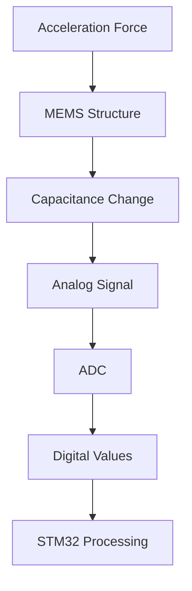

# STM32 Accelerometers

Accelerometers are vital sensors in modern embedded systems, enabling motion detection, orientation sensing, and vibration analysis. This guide will walk you through everything you need to know about integrating accelerometers with STM32 microcontrollers.

## What is an Accelerometer?

An accelerometer is a sensor that measures proper acceleration (g-force) along one or more axes. Unlike position or velocity sensors, accelerometers detect the rate of change in velocity - in other words, acceleration.

Modern accelerometers typically use microelectromechanical systems (MEMS) technology, making them small, affordable, and easily integrated with microcontrollers like the STM32 series.



## Types of Accelerometers for STM32

Several accelerometer options are compatible with STM32 microcontrollers:

1. **ST's own accelerometers** - LIS3DH, LSM303, etc.
2. **Third-party accelerometers** - ADXL345, MPU6050, etc.

These sensors generally communicate via:
- I2C (most common)
- SPI (higher speed)
- Analog outputs (less common)

## Hardware Setup

### Components Needed

- STM32 development board (e.g., Nucleo, Discovery)
- Accelerometer module (e.g., LIS3DH, ADXL345, MPU6050)
- Jumper wires
- Breadboard (optional)

### Connection Diagram for I2C Communication

For this example, we'll use the LIS3DH accelerometer with I2C communication:

| STM32 Pin | LIS3DH Pin |
|-----------|------------|
| 3.3V      | VCC        |
| GND       | GND        |
| PB8 (SCL) | SCL        |
| PB9 (SDA) | SDA        |

## Software Setup

### Required Libraries and Tools

To get started, you'll need:

1. **STM32CubeIDE** or your preferred STM32 development environment
2. **STM32CubeMX** for hardware configuration
3. **HAL libraries** for STM32
4. Optionally, a sensor-specific library (we'll provide custom code that works without this)

### Basic STM32CubeMX Configuration

1. Create a new project in STM32CubeMX
2. Configure the I2C peripheral:
   - Enable I2C1 in I2C mode
   - Set the clock speed to 100 kHz (standard for most accelerometers)
3. Configure pins PB8 and PB9 for I2C1 SCL and SDA
4. Generate the code

## Reading Data from an Accelerometer

Let's implement code to read data from the LIS3DH accelerometer, one of the most popular options for STM32 projects.

### Initialization Code

```c
#include "main.h"
#include <stdio.h>

/* I2C handle declaration */
extern I2C_HandleTypeDef hi2c1;

/* LIS3DH I2C address */
#define LIS3DH_ADDR (0x19 << 1)  // Default address is 0x19 (with SDO/SA0 to GND)

/* LIS3DH registers */
#define LIS3DH_REG_WHOAMI        0x0F
#define LIS3DH_REG_CTRL_REG1     0x20
#define LIS3DH_REG_OUT_X_L       0x28
#define LIS3DH_REG_OUT_X_H       0x29
#define LIS3DH_REG_OUT_Y_L       0x2A
#define LIS3DH_REG_OUT_Y_H       0x2B
#define LIS3DH_REG_OUT_Z_L       0x2C
#define LIS3DH_REG_OUT_Z_H       0x2D

/* Function to write data to LIS3DH register */
HAL_StatusTypeDef LIS3DH_WriteReg(uint8_t reg, uint8_t data)
{
    return HAL_I2C_Mem_Write(&hi2c1, LIS3DH_ADDR, reg, I2C_MEMADD_SIZE_8BIT, &data, 1, HAL_MAX_DELAY);
}

/* Function to read data from LIS3DH register */
HAL_StatusTypeDef LIS3DH_ReadReg(uint8_t reg, uint8_t *data)
{
    return HAL_I2C_Mem_Read(&hi2c1, LIS3DH_ADDR, reg, I2C_MEMADD_SIZE_8BIT, data, 1, HAL_MAX_DELAY);
}

/* Function to initialize LIS3DH */
HAL_StatusTypeDef LIS3DH_Init(void)
{
    HAL_StatusTypeDef status;
    uint8_t whoami = 0;
    
    /* Check device ID */
    status = LIS3DH_ReadReg(LIS3DH_REG_WHOAMI, &whoami);
    if (status != HAL_OK || whoami != 0x33) {
        return HAL_ERROR;  // Not found or wrong device
    }
    
    /* Configure accelerometer: 
       - Enable all axes (X, Y, Z)
       - 100Hz data rate
       - Normal power mode
    */
    status = LIS3DH_WriteReg(LIS3DH_REG_CTRL_REG1, 0x57);
    
    return status;
}
```

### Reading Acceleration Data

```c
/* Function to read acceleration data */
HAL_StatusTypeDef LIS3DH_ReadAcceleration(int16_t *x, int16_t *y, int16_t *z)
{
    uint8_t data[6];
    HAL_StatusTypeDef status;
    
    /* Read all acceleration data at once (6 bytes) */
    status = HAL_I2C_Mem_Read(&hi2c1, LIS3DH_ADDR, LIS3DH_REG_OUT_X_L | 0x80, 
                             I2C_MEMADD_SIZE_8BIT, data, 6, HAL_MAX_DELAY);
    
    if (status == HAL_OK) {
        /* Combine high and low bytes to form 16-bit values */
        *x = (int16_t)(data[1] << 8 | data[0]);
        *y = (int16_t)(data[3] << 8 | data[2]);
        *z = (int16_t)(data[5] << 8 | data[4]);
    }
    
    return status;
}

/* Function to convert raw values to g-force */
void LIS3DH_ConvertToG(int16_t raw_x, int16_t raw_y, int16_t raw_z, 
                      float *g_x, float *g_y, float *g_z)
{
    /* 
     * Convert to g-force (±2g range by default)
     * Scale factor for ±2g range is 1 mg/digit = 0.001 g/digit
     */
    const float sensitivity = 0.001f;
    
    *g_x = raw_x * sensitivity;
    *g_y = raw_y * sensitivity;
    *g_z = raw_z * sensitivity;
}
```

### Usage Example in Main Function

```c
int main(void)
{
    /* MCU Configuration */
    HAL_Init();
    SystemClock_Config();
    
    /* Initialize all configured peripherals */
    MX_GPIO_Init();
    MX_I2C1_Init();
    
    /* Initialize LIS3DH accelerometer */
    if (LIS3DH_Init() != HAL_OK) {
        Error_Handler();
    }
    
    /* Infinite loop */
    while (1) {
        int16_t raw_x, raw_y, raw_z;
        float g_x, g_y, g_z;
        
        /* Read acceleration data */
        if (LIS3DH_ReadAcceleration(&raw_x, &raw_y, &raw_z) == HAL_OK) {
            /* Convert to g-force */
            LIS3DH_ConvertToG(raw_x, raw_y, raw_z, &g_x, &g_y, &g_z);
            
            /* Process the data as needed */
            /* For example, you could transmit it via UART for debugging */
            
            /* Wait before next reading */
            HAL_Delay(100);
        }
    }
}
```

## Data Interpretation

Accelerometers provide acceleration values typically measured in g-forces (where 1g = 9.81 m/s²). Here's how to interpret the data:

- When the device is stationary and flat, expect readings near:
  - X: 0g
  - Y: 0g
  - Z: 1g (due to Earth's gravity)
  
- When tilting the device, the gravity vector gets distributed across axes.
- Sudden movements will cause short spikes in acceleration values.

## Practical Applications

### 1. Tilt Detection

```c
/* Function to detect tilt based on accelerometer data */
void detect_tilt(float g_x, float g_y, float g_z)
{
    /* Calculate angles in degrees */
    float pitch = atan2(g_x, sqrt(g_y * g_y + g_z * g_z)) * 180.0f / M_PI;
    float roll = atan2(g_y, sqrt(g_x * g_x + g_z * g_z)) * 180.0f / M_PI;
    
    /* Detect orientation */
    if (pitch > 45.0f) {
        printf("Tilted forward\r
");
    } else if (pitch < -45.0f) {
        printf("Tilted backward\r
");
    } else if (roll > 45.0f) {
        printf("Tilted right\r
");
    } else if (roll < -45.0f) {
        printf("Tilted left\r
");
    } else {
        printf("Flat\r
");
    }
}
```

### 2. Step Counter

```c
/* Simple step counter using accelerometer */
void step_counter(float g_x, float g_y, float g_z)
{
    static uint32_t steps = 0;
    static uint32_t last_step_time = 0;
    static float last_accel = 0;
    
    /* Calculate total acceleration magnitude */
    float accel_mag = sqrt(g_x * g_x + g_y * g_y + g_z * g_z);
    
    /* Remove gravity component (when at rest, accel_mag is around 1.0) */
    float accel_mag_no_gravity = accel_mag - 1.0f;
    
    /* Step detection based on acceleration change threshold */
    if ((accel_mag_no_gravity > 0.3f) && (last_accel <= 0.3f)) {
        uint32_t current_time = HAL_GetTick();
        
        /* Avoid counting bounces (require minimum 250ms between steps) */
        if (current_time - last_step_time > 250) {
            steps++;
            printf("Steps: %lu\r
", steps);
            last_step_time = current_time;
        }
    }
    
    last_accel = accel_mag_no_gravity;
}
```

### 3. Vibration Monitoring

```c
/* Function to monitor vibration levels */
void monitor_vibration(float g_x, float g_y, float g_z)
{
    static float vibration_history[10] = {0};
    static uint8_t history_index = 0;
    
    /* Calculate total acceleration magnitude */
    float accel_mag = sqrt(g_x * g_x + g_y * g_y + g_z * g_z);
    
    /* Remove gravity component */
    float vibration = fabs(accel_mag - 1.0f);
    
    /* Store in circular buffer */
    vibration_history[history_index] = vibration;
    history_index = (history_index + 1) % 10;
    
    /* Calculate average vibration */
    float sum = 0;
    for (int i = 0; i < 10; i++) {
        sum += vibration_history[i];
    }
    float avg_vibration = sum / 10.0f;
    
    /* Classify vibration level */
    if (avg_vibration < 0.05f) {
        printf("Vibration: Low\r
");
    } else if (avg_vibration < 0.2f) {
        printf("Vibration: Medium\r
");
    } else {
        printf("Vibration: High\r
");
    }
}
```

## Advanced Topics

### Calibrating Your Accelerometer

Accelerometer readings often have biases and scale factor errors. Here's a simple calibration procedure:

```c
/* Accelerometer calibration structure */
typedef struct {
    float x_bias;
    float y_bias;
    float z_bias;
} AccelCalibration_t;

/* Function to calibrate accelerometer - requires the device to be perfectly flat */
void calibrate_accelerometer(AccelCalibration_t *cal)
{
    const int samples = 100;
    float sum_x = 0, sum_y = 0, sum_z = 0;
    
    /* Collect multiple samples */
    for (int i = 0; i < samples; i++) {
        int16_t raw_x, raw_y, raw_z;
        float g_x, g_y, g_z;
        
        LIS3DH_ReadAcceleration(&raw_x, &raw_y, &raw_z);
        LIS3DH_ConvertToG(raw_x, raw_y, raw_z, &g_x, &g_y, &g_z);
        
        sum_x += g_x;
        sum_y += g_y;
        sum_z += g_z;
        
        HAL_Delay(10);
    }
    
    /* Calculate average values */
    float avg_x = sum_x / samples;
    float avg_y = sum_y / samples;
    float avg_z = sum_z / samples;
    
    /* Determine bias (ideally, X and Y should be 0, Z should be 1) */
    cal->x_bias = avg_x;
    cal->y_bias = avg_y;
    cal->z_bias = avg_z - 1.0f;  /* Z should read 1g when flat */
    
    printf("Calibration complete:\r
");
    printf("X bias: %.3f g\r
", cal->x_bias);
    printf("Y bias: %.3f g\r
", cal->y_bias);
    printf("Z bias: %.3f g\r
", cal->z_bias);
}

/* Apply calibration to raw readings */
void apply_calibration(float *g_x, float *g_y, float *g_z, const AccelCalibration_t *cal)
{
    *g_x -= cal->x_bias;
    *g_y -= cal->y_bias;
    *g_z -= cal->z_bias;
}
```

### Low-Power Considerations

Accelerometers can be configured for low-power operation, which is crucial for battery-powered applications:

```c
/* Configure LIS3DH for low-power mode */
HAL_StatusTypeDef LIS3DH_SetLowPowerMode(void)
{
    /* Configure for:
       - Low-power mode
       - 10 Hz data rate (instead of 100Hz)
       - Only Z-axis enabled (if that's all you need)
    */
    return LIS3DH_WriteReg(LIS3DH_REG_CTRL_REG1, 0x29);
}
```

### Combining with Other Sensors

Accelerometers are often paired with gyroscopes and magnetometers to form an Inertial Measurement Unit (IMU). The MPU6050 is a popular combined accelerometer and gyroscope.

```c
/* MPU6050 I2C address and registers */
#define MPU6050_ADDR      (0x68 << 1)
#define MPU6050_ACCEL_XOUT_H  0x3B
#define MPU6050_GYRO_XOUT_H   0x43
#define MPU6050_PWR_MGMT_1    0x6B

/* Initialize MPU6050 */
HAL_StatusTypeDef MPU6050_Init(void)
{
    HAL_StatusTypeDef status;
    uint8_t data;
    
    /* Wake up the MPU6050 (it starts in sleep mode) */
    data = 0x00;
    status = HAL_I2C_Mem_Write(&hi2c1, MPU6050_ADDR, MPU6050_PWR_MGMT_1, 
                              I2C_MEMADD_SIZE_8BIT, &data, 1, HAL_MAX_DELAY);
    
    return status;
}

/* Read accelerometer and gyroscope data */
HAL_StatusTypeDef MPU6050_ReadData(int16_t *accel_x, int16_t *accel_y, int16_t *accel_z,
                                 int16_t *gyro_x, int16_t *gyro_y, int16_t *gyro_z)
{
    uint8_t data[14];
    HAL_StatusTypeDef status;
    
    /* Read all data at once (accelerometer and gyroscope, 14 bytes total) */
    status = HAL_I2C_Mem_Read(&hi2c1, MPU6050_ADDR, MPU6050_ACCEL_XOUT_H, 
                             I2C_MEMADD_SIZE_8BIT, data, 14, HAL_MAX_DELAY);
    
    if (status == HAL_OK) {
        /* Combine high and low bytes to form 16-bit values */
        *accel_x = (int16_t)(data[0] << 8 | data[1]);
        *accel_y = (int16_t)(data[2] << 8 | data[3]);
        *accel_z = (int16_t)(data[4] << 8 | data[5]);
        
        /* Temperature data is at index 6-7, which we skip */
        
        *gyro_x = (int16_t)(data[8] << 8 | data[9]);
        *gyro_y = (int16_t)(data[10] << 8 | data[11]);
        *gyro_z = (int16_t)(data[12] << 8 | data[13]);
    }
    
    return status;
}
```

## Troubleshooting Common Issues

### 1. No Communication with Sensor

If your STM32 can't communicate with the accelerometer:

- **Check wiring**: Verify all connections, especially SDA and SCL
- **Verify I2C address**: Some accelerometers have adjustable addresses
- **Check power supply**: Most accelerometers need 3.3V power
- **Try slower clock**: Reduce I2C clock rate to 50 kHz temporarily
- **Check pull-up resistors**: I2C requires pull-up resistors on SDA and SCL

### 2. Noisy or Unstable Readings

If your readings are unstable:

- **Add filtering**: Implement a simple moving average filter
- **Check power supply stability**: Noisy power can affect sensor readings
- **Use hardware filters**: Many accelerometers have built-in filter options
- **Check for vibrations**: Even small vibrations can affect readings

## Summary

In this tutorial, you've learned:

1. What accelerometers are and how they work with STM32 microcontrollers
2. How to connect and initialize an accelerometer (LIS3DH) using I2C
3. How to read and interpret acceleration data
4. Real-world applications including tilt detection, step counting, and vibration monitoring
5. Advanced topics like calibration and power management
6. Troubleshooting common issues

Accelerometers open up a wide range of possibilities for your STM32 projects, from simple motion detection to sophisticated inertial navigation systems.

## Exercises

1. **Basic**: Modify the provided code to output acceleration values to a serial terminal.
2. **Intermediate**: Implement a digital bubble level that shows tilt angles on an LCD display.
3. **Advanced**: Create a gesture recognition system that can identify simple movements like shaking or flipping.

## Additional Resources

- ST's official documentation for LIS3DH and other accelerometers
- STM32 HAL I2C API reference
- Books and articles on sensor fusion algorithms for combining accelerometer data with other sensors
- Online communities for embedded systems and STM32 development