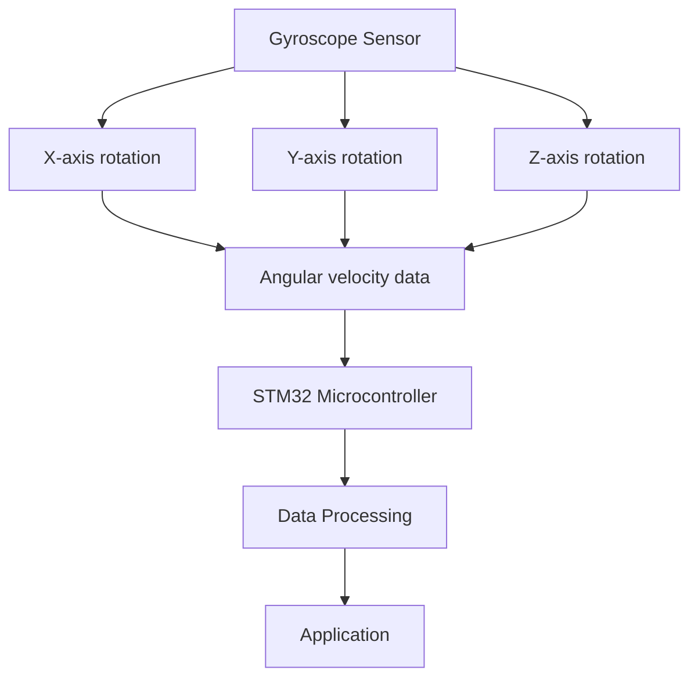

# STM32 Gyroscopes

## Introduction

Gyroscopes are essential sensors that measure angular velocity - how quickly an object rotates around an axis. Unlike accelerometers that measure linear acceleration, gyroscopes detect rotational movement, making them crucial for applications requiring orientation tracking, stabilization, and navigation.

In this tutorial, we'll explore how to integrate gyroscope sensors with STM32 microcontrollers. You'll learn about the principles of gyroscope operation, common interfaces, and how to implement both basic and advanced applications. By the end, you'll be able to incorporate gyroscope data into your STM32 projects with confidence.

## Understanding Gyroscopes

### What is a Gyroscope?

A gyroscope (or "gyro") is a sensor that measures rotational velocity around one or more axes, typically expressed in degrees per second (°/s). Modern MEMS (Micro-Electro-Mechanical Systems) gyroscopes are tiny devices that use the Coriolis effect to detect rotation.



### Common Gyroscope ICs for STM32

Several gyroscope sensors are compatible with STM32 microcontrollers:

- **L3GD20** - ST's 3-axis digital gyroscope (commonly used with STM32 discovery boards)
- **MPU6050** - InvenSense's popular 6-axis IMU with gyroscope and accelerometer
- **BMI160** - Bosch's low-power 6-axis IMU
- **LSM6DSO** - ST's 6-axis IMU with advanced features

These sensors typically communicate via I2C or SPI interfaces, which are well-supported by STM32 microcontrollers.

## Hardware Setup

### Required Components

- STM32 development board (F4, F3, or L4 series recommended)
- Gyroscope sensor module (L3GD20, MPU6050, or similar)
- Jumper wires
- Breadboard
- USB cable for programming

### Wiring for I2C Communication

Here's a typical connection diagram for I2C communication with an MPU6050 gyroscope:

| STM32 Pin | MPU6050 Pin | Function |
|-----------|-------------|----------|
| PB8 | SCL | I2C Clock |
| PB9 | SDA | I2C Data |
| 3.3V | VCC | Power |
| GND | GND | Ground |

### Wiring for SPI Communication

For the L3GD20 gyroscope using SPI:

| STM32 Pin | L3GD20 Pin | Function |
|-----------|------------|----------|
| PA5 | SCL/SCK | SPI Clock |
| PA6 | SDO/MISO | SPI MISO |
| PA7 | SDA/MOSI | SPI MOSI |
| PE3 | CS | Chip Select |
| 3.3V | VCC | Power |
| GND | GND | Ground |

## Basic Implementation

### Initializing the Gyroscope

Let's start with a basic example using the popular MPU6050 sensor via I2C.

First, we need to initialize the I2C peripheral and configure the gyroscope:

```c
#include "stm32f4xx_hal.h"

I2C_HandleTypeDef hi2c1;

#define MPU6050_ADDR 0xD0    // MPU6050 device address (0x68 << 1)
#define GYRO_CONFIG 0x1B     // Gyroscope configuration register address

void MPU6050_Init(void)
{
    uint8_t check, data;
    
    // Check if the device is responding
    HAL_I2C_Mem_Read(&hi2c1, MPU6050_ADDR, 0x75, 1, &check, 1, 1000);
    
    if (check == 0x68)  // 0x68 is the expected WHO_AM_I value for MPU6050
    {
        // Wake up the device
        data = 0x00;
        HAL_I2C_Mem_Write(&hi2c1, MPU6050_ADDR, 0x6B, 1, &data, 1, 1000);
        
        // Configure gyroscope range to ±250°/s
        data = 0x00;
        HAL_I2C_Mem_Write(&hi2c1, MPU6050_ADDR, GYRO_CONFIG, 1, &data, 1, 1000);
    }
}
```

### Reading Gyroscope Data

Next, let's create a function to read raw gyroscope data:

```c
typedef struct
{
    int16_t x;
    int16_t y;
    int16_t z;
} GyroRaw_t;

GyroRaw_t GyroReadRaw(void)
{
    uint8_t data[6];
    GyroRaw_t gyro;
    
    // Read 6 bytes of data starting from register 0x43
    HAL_I2C_Mem_Read(&hi2c1, MPU6050_ADDR, 0x43, 1, data, 6, 1000);
    
    // Combine the bytes to form 16-bit values
    gyro.x = (int16_t)(data[0] << 8 | data[1]);
    gyro.y = (int16_t)(data[2] << 8 | data[3]);
    gyro.z = (int16_t)(data[4] << 8 | data[5]);
    
    return gyro;
}
```

### Converting Raw Data to Degrees Per Second

The raw data needs to be converted to meaningful angular velocity values:

```c
typedef struct
{
    float x;
    float y;
    float z;
} GyroDPS_t;

#define GYRO_SCALE_FACTOR 131.0f  // For ±250°/s range

GyroDPS_t GyroReadDPS(void)
{
    GyroRaw_t raw = GyroReadRaw();
    GyroDPS_t gyro;
    
    // Convert raw values to degrees per second
    gyro.x = raw.x / GYRO_SCALE_FACTOR;
    gyro.y = raw.y / GYRO_SCALE_FACTOR;
    gyro.z = raw.z / GYRO_SCALE_FACTOR;
    
    return gyro;
}
```

### Complete Basic Example

Here's a complete example that initializes the gyroscope and prints readings via UART:

```c
#include "stm32f4xx_hal.h"
#include <stdio.h>

I2C_HandleTypeDef hi2c1;
UART_HandleTypeDef huart2;

// Function prototypes
void SystemClock_Config(void);
void Error_Handler(void);
void MPU6050_Init(void);
GyroRaw_t GyroReadRaw(void);
GyroDPS_t GyroReadDPS(void);

int main(void)
{
    // Initialize the HAL library
    HAL_Init();
    
    // Configure the system clock
    SystemClock_Config();
    
    // Initialize UART
    MX_UART2_Init();
    
    // Initialize I2C
    MX_I2C1_Init();
    
    // Initialize MPU6050
    MPU6050_Init();
    
    char buffer[100];
    
    while (1)
    {
        GyroDPS_t gyro = GyroReadDPS();
        
        // Format and send data over UART
        sprintf(buffer, "Gyro X: %.2f°/s, Y: %.2f°/s, Z: %.2f°/s\r
", 
                gyro.x, gyro.y, gyro.z);
        HAL_UART_Transmit(&huart2, (uint8_t*)buffer, strlen(buffer), HAL_MAX_DELAY);
        
        HAL_Delay(500);  // Update every 500ms
    }
}
```

Output Example:
```
Gyro X: 0.15°/s, Y: -0.22°/s, Z: 1.05°/s
Gyro X: 0.38°/s, Y: -0.30°/s, Z: 0.98°/s
Gyro X: -0.07°/s, Y: -0.15°/s, Z: 1.13°/s
```

## Advanced Techniques

### Gyroscope Calibration

Gyroscopes often have an offset or bias that needs to be calibrated:

```c
GyroDPS_t gyroOffset = {0};

void CalibrateGyro(uint16_t samples)
{
    GyroDPS_t gyroSum = {0};
    
    // Collect multiple samples
    for (uint16_t i = 0; i < samples; i++)
    {
        GyroDPS_t gyro = GyroReadDPS();
        gyroSum.x += gyro.x;
        gyroSum.y += gyro.y;
        gyroSum.z += gyro.z;
        HAL_Delay(5);
    }
    
    // Calculate average offset
    gyroOffset.x = gyroSum.x / samples;
    gyroOffset.y = gyroSum.y / samples;
    gyroOffset.z = gyroSum.z / samples;
}

GyroDPS_t GyroReadCalibrated(void)
{
    GyroDPS_t gyro = GyroReadDPS();
    
    // Apply calibration
    gyro.x -= gyroOffset.x;
    gyro.y -= gyroOffset.y;
    gyro.z -= gyroOffset.z;
    
    return gyro;
}
```

### Implementing a Complementary Filter

Gyroscope data can drift over time. A complementary filter combines gyroscope and accelerometer data for more stable orientation tracking:

```c
#include <math.h>

// Angle estimation
float angleX = 0;
float angleY = 0;
float prevTime = 0;

void UpdateAngle(void)
{
    GyroDPS_t gyro = GyroReadCalibrated();
    AccelData_t accel = AccelReadG();  // Function to read accelerometer
    
    // Calculate current time and delta time
    float currentTime = HAL_GetTick() / 1000.0f;
    float dt = currentTime - prevTime;
    prevTime = currentTime;
    
    // Calculate accelerometer angles
    float accelAngleX = atan2f(accel.y, accel.z) * 180.0f / M_PI;
    float accelAngleY = atan2f(-accel.x, sqrtf(accel.y * accel.y + accel.z * accel.z)) * 180.0f / M_PI;
    
    // Complementary filter (98% gyro, 2% accelerometer)
    angleX = 0.98f * (angleX + gyro.x * dt) + 0.02f * accelAngleX;
    angleY = 0.98f * (angleY + gyro.y * dt) + 0.02f * accelAngleY;
}
```

### Detecting Rotation Gestures

You can implement gesture detection based on gyroscope readings:

```c
typedef enum {
    GESTURE_NONE,
    GESTURE_TILT_LEFT,
    GESTURE_TILT_RIGHT,
    GESTURE_TILT_FORWARD,
    GESTURE_TILT_BACKWARD
} Gesture_t;

Gesture_t DetectGesture(void)
{
    GyroDPS_t gyro = GyroReadCalibrated();
    
    // Threshold for gesture detection
    const float THRESHOLD = 100.0f;
    
    if (gyro.x > THRESHOLD)
        return GESTURE_TILT_RIGHT;
    else if (gyro.x < -THRESHOLD)
        return GESTURE_TILT_LEFT;
    else if (gyro.y > THRESHOLD)
        return GESTURE_TILT_BACKWARD;
    else if (gyro.y < -THRESHOLD)
        return GESTURE_TILT_FORWARD;
    else
        return GESTURE_NONE;
}
```

## Real-World Applications

### Motion-Controlled Game

Here's a simple implementation of a motion-controlled game that uses gyroscope data to move an object on an OLED display:

```c
#include "ssd1306.h"  // OLED display library

// Position of the ball
uint8_t ball_x = 64;
uint8_t ball_y = 32;

void UpdateBallPosition(void)
{
    GyroDPS_t gyro = GyroReadCalibrated();
    
    // Update position based on gyroscope readings
    ball_x += (int8_t)(gyro.x / 10);
    ball_y += (int8_t)(gyro.y / 10);
    
    // Keep ball within screen boundaries
    if (ball_x < 5) ball_x = 5;
    if (ball_x > 123) ball_x = 123;
    if (ball_y < 5) ball_y = 5;
    if (ball_y > 59) ball_y = 59;
    
    // Draw on OLED
    SSD1306_Clear();
    SSD1306_DrawCircle(ball_x, ball_y, 5, SSD1306_COLOR_WHITE);
    SSD1306_UpdateScreen();
}
```

### Self-Balancing Robot

A common application of gyroscopes is in self-balancing robots using PID control:

```c
#include "pid.h"  // Simple PID library

// PID controller parameters
PID_t pidController;
float setpoint = 0;  // Target angle (upright position)

void BalanceRobot(void)
{
    // Read current angle
    UpdateAngle();
    float currentAngle = angleY;  // We want to balance on Y-axis
    
    // Calculate motor speed using PID controller
    float motorSpeed = PID_Calculate(&pidController, setpoint, currentAngle);
    
    // Apply motor speed to both motors
    if (motorSpeed > 0)
    {
        // Move forward
        SetMotorSpeed(MOTOR_LEFT, motorSpeed);
        SetMotorSpeed(MOTOR_RIGHT, motorSpeed);
    }
    else
    {
        // Move backward
        SetMotorSpeed(MOTOR_LEFT, -motorSpeed);
        SetMotorSpeed(MOTOR_RIGHT, -motorSpeed);
    }
}
```

### Drone Stabilization

Gyroscopes are critical for drone stabilization:

```c
// Define PID controllers for each axis
PID_t pidRoll;
PID_t pidPitch;
PID_t pidYaw;

void StabilizeDrone(void)
{
    // Read gyroscope data
    GyroDPS_t gyro = GyroReadCalibrated();
    
    // Calculate motor speeds using PID controllers
    float rollCorrection = PID_Calculate(&pidRoll, 0, gyro.x);
    float pitchCorrection = PID_Calculate(&pidPitch, 0, gyro.y);
    float yawCorrection = PID_Calculate(&pidYaw, 0, gyro.z);
    
    // Apply corrections to motors
    float motor1 = BASE_SPEED + pitchCorrection - rollCorrection - yawCorrection;
    float motor2 = BASE_SPEED + pitchCorrection + rollCorrection + yawCorrection;
    float motor3 = BASE_SPEED - pitchCorrection + rollCorrection - yawCorrection;
    float motor4 = BASE_SPEED - pitchCorrection - rollCorrection + yawCorrection;
    
    // Set motor speeds (with limits)
    SetMotorSpeed(MOTOR1, LimitSpeed(motor1));
    SetMotorSpeed(MOTOR2, LimitSpeed(motor2));
    SetMotorSpeed(MOTOR3, LimitSpeed(motor3));
    SetMotorSpeed(MOTOR4, LimitSpeed(motor4));
}
```

## Common Challenges and Troubleshooting

### Drift Issues

Gyroscopes naturally drift over time. Here are some strategies to minimize drift:

1. **Regular Calibration**: Recalibrate your gyroscope when the device is stationary
2. **Sensor Fusion**: Combine gyroscope data with accelerometer or magnetometer readings
3. **Temperature Compensation**: Many gyroscope values change with temperature

```c
// Example of runtime recalibration when device is detected as stationary
bool IsDeviceStationary(void)
{
    GyroDPS_t gyro = GyroReadDPS();
    float magnitude = sqrtf(gyro.x*gyro.x + gyro.y*gyro.y + gyro.z*gyro.z);
    
    return magnitude < 1.0f;  // Less than 1°/s of total rotation
}

void RuntimeCalibration(void)
{
    static uint32_t stationaryStartTime = 0;
    
    if (IsDeviceStationary())
    {
        if (stationaryStartTime == 0)
        {
            stationaryStartTime = HAL_GetTick();
        }
        else if (HAL_GetTick() - stationaryStartTime > 2000)  // 2 seconds stationary
        {
            CalibrateGyro(100);  // Recalibrate with 100 samples
            stationaryStartTime = 0;
        }
    }
    else
    {
        stationaryStartTime = 0;
    }
}
```

### Noise Reduction

Gyroscope readings can be noisy. Here's a simple moving average filter to reduce noise:

```c
#define FILTER_SIZE 10

GyroDPS_t FilterGyroData(void)
{
    static GyroDPS_t readings[FILTER_SIZE];
    static uint8_t index = 0;
    static bool bufferFilled = false;
    
    // Add new reading to buffer
    readings[index] = GyroReadCalibrated();
    
    // Update index and buffer status
    index = (index + 1) % FILTER_SIZE;
    if (index == 0)
        bufferFilled = true;
    
    // Calculate average
    GyroDPS_t average = {0};
    uint8_t count = bufferFilled ? FILTER_SIZE : index;
    
    for (uint8_t i = 0; i < count; i++)
    {
        average.x += readings[i].x;
        average.y += readings[i].y;
        average.z += readings[i].z;
    }
    
    average.x /= count;
    average.y /= count;
    average.z /= count;
    
    return average;
}
```

## Integration with STM32CubeMX

STM32CubeMX simplifies configuration of STM32 microcontrollers. Here's how to set up I2C for a gyroscope sensor:

1. Open STM32CubeMX and create a new project
2. Select your STM32 device
3. In the Pinout & Configuration tab:
   - Configure I2C1 (or your preferred I2C peripheral)
   - Set I2C Speed Mode to "Fast Mode"
   - Enable interrupts if needed
4. Configure GPIO pins for your specific needs
5. Generate code

The generated code will include initialization functions that you can use with the examples above.

## Summary

In this tutorial, you've learned:

- How gyroscopes work and why they're useful in embedded applications
- How to connect gyroscope sensors to STM32 microcontrollers
- Basic code for initializing and reading data from gyroscopes
- Advanced techniques like calibration and filtering
- Real-world applications such as motion control, balancing robots, and drone stabilization

Gyroscopes are powerful sensors that open up a world of possibilities for motion-sensing applications. Combined with STM32's processing capabilities, you can create sophisticated systems for orientation tracking, stabilization, and navigation.

## Exercises

1. **Basic**: Modify the example code to use SPI instead of I2C communication.
2. **Intermediate**: Implement a digital spirit level that shows the current tilt angle on an LCD display.
3. **Advanced**: Create a gesture recognition system that can identify specific movements (circular motion, shake, etc.).
4. **Challenge**: Combine gyroscope and accelerometer data to implement a 6DOF (six degrees of freedom) motion tracking system.

## Additional Resources

- ST Microelectronics documentation for L3GD20 and other gyroscope sensors
- STM32 HAL API reference for I2C and SPI communication
- Application notes on sensor fusion algorithms
- ST's X-CUBE-MEMS1 expansion package, which provides drivers for various MEMS sensors

Happy coding with your STM32 gyroscope projects!