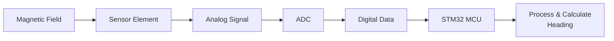
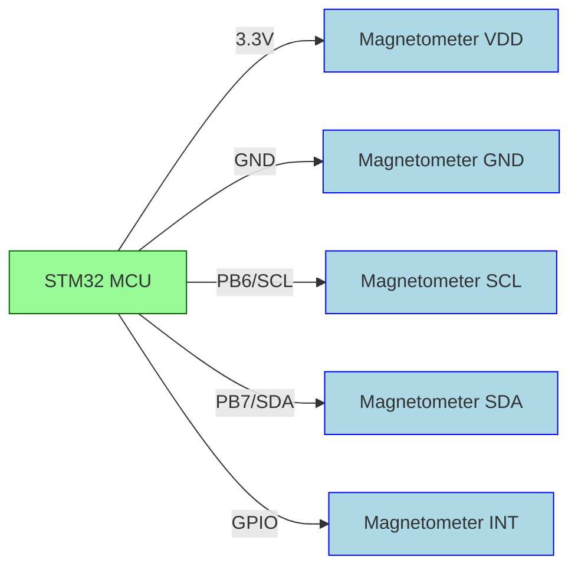

# STM32 Magnetometers

## Introduction

Magnetometers are sensors that measure magnetic fields, allowing your embedded systems to detect the Earth's magnetic field and function as digital compasses. When integrated with STM32 microcontrollers, magnetometers enable a wide range of applications including navigation systems, position tracking, and motion detection.

In this tutorial, we'll explore how to interface magnetometer sensors with STM32 microcontrollers, understand the underlying principles, and implement practical applications that utilize magnetic field measurements.

## What is a Magnetometer?

A magnetometer is a device that measures the strength and direction of magnetic fields. In embedded systems, magnetometers typically measure the magnetic field along three perpendicular axes (X, Y, and Z), allowing for complete 3D magnetic field detection.

Common magnetometer sensors used with STM32 include:

- LIS3MDL - ST's 3-axis magnetometer
- LSM303AGR - ST's combined accelerometer and magnetometer
- HMC5883L - Honeywell's 3-axis compass IC
- QMC5883L - QST's 3-axis magnetometer

## How Magnetometers Work

Magnetometers used in embedded systems typically employ either the Hall effect or Magnetoresistive (MR) technology:

1. **Hall Effect Sensors**: These detect magnetic fields based on the voltage difference created when a current-carrying conductor is placed in a magnetic field.

2. **Magnetoresistive Sensors**: These utilize materials that change their electrical resistance when exposed to a magnetic field.



## Interfacing Magnetometers with STM32

Most magnetometer sensors communicate with microcontrollers using I²C or SPI protocols. In this tutorial, we'll focus on I²C communication, which is the most common method for magnetometers.

### Hardware Connection

For a typical I²C magnetometer (like LIS3MDL), you'll need to connect:

- VDD to 3.3V power
- GND to ground
- SCL to the I²C clock pin (e.g., PB6 on many STM32 boards)
- SDA to the I²C data pin (e.g., PB7 on many STM32 boards)
- INT (if available) to a GPIO pin for interrupts (optional)

Here's a basic connection diagram:



### Basic Software Implementation

Let's implement a basic example using the LIS3MDL magnetometer with STM32 HAL library.

#### Step 1: Initialize the I²C Interface

First, we need to set up the I²C peripheral:

```c
// I2C handler declaration
I2C_HandleTypeDef hi2c1;

// Initialize I2C
void MX_I2C1_Init(void)
{
  hi2c1.Instance = I2C1;
  hi2c1.Init.ClockSpeed = 100000;  // 100 KHz
  hi2c1.Init.DutyCycle = I2C_DUTYCYCLE_2;
  hi2c1.Init.OwnAddress1 = 0;
  hi2c1.Init.AddressingMode = I2C_ADDRESSINGMODE_7BIT;
  hi2c1.Init.DualAddressMode = I2C_DUALADDRESS_DISABLE;
  hi2c1.Init.OwnAddress2 = 0;
  hi2c1.Init.GeneralCallMode = I2C_GENERALCALL_DISABLE;
  hi2c1.Init.NoStretchMode = I2C_NOSTRETCH_DISABLE;
  
  if (HAL_I2C_Init(&hi2c1) != HAL_OK)
  {
    Error_Handler();
  }
}
```

#### Step 2: Define Magnetometer Register Addresses and Constants

```c
// LIS3MDL I2C address
#define LIS3MDL_ADDR        0x1C << 1  // Default I2C address when SDO/SA1 connected to GND

// Register addresses
#define LIS3MDL_WHO_AM_I    0x0F
#define LIS3MDL_CTRL_REG1   0x20
#define LIS3MDL_CTRL_REG2   0x21
#define LIS3MDL_CTRL_REG3   0x22
#define LIS3MDL_CTRL_REG4   0x23
#define LIS3MDL_CTRL_REG5   0x24
#define LIS3MDL_STATUS_REG  0x27
#define LIS3MDL_OUT_X_L     0x28
#define LIS3MDL_OUT_X_H     0x29
#define LIS3MDL_OUT_Y_L     0x2A
#define LIS3MDL_OUT_Y_H     0x2B
#define LIS3MDL_OUT_Z_L     0x2C
#define LIS3MDL_OUT_Z_H     0x2D

// Expected WHO_AM_I value
#define LIS3MDL_WHO_AM_I_VALUE 0x3D
```

#### Step 3: Create Functions to Read and Write to the Magnetometer

```c
// Write a byte to register
HAL_StatusTypeDef LIS3MDL_WriteReg(uint8_t reg, uint8_t data)
{
  return HAL_I2C_Mem_Write(&hi2c1, LIS3MDL_ADDR, reg, I2C_MEMADD_SIZE_8BIT, &data, 1, HAL_MAX_DELAY);
}

// Read a byte from register
HAL_StatusTypeDef LIS3MDL_ReadReg(uint8_t reg, uint8_t *data)
{
  return HAL_I2C_Mem_Read(&hi2c1, LIS3MDL_ADDR, reg, I2C_MEMADD_SIZE_8BIT, data, 1, HAL_MAX_DELAY);
}

// Read multiple bytes from registers
HAL_StatusTypeDef LIS3MDL_ReadRegs(uint8_t reg, uint8_t *data, uint8_t length)
{
  return HAL_I2C_Mem_Read(&hi2c1, LIS3MDL_ADDR, reg, I2C_MEMADD_SIZE_8BIT, data, length, HAL_MAX_DELAY);
}
```

#### Step 4: Initialize the Magnetometer

```c
HAL_StatusTypeDef LIS3MDL_Init(void)
{
  uint8_t whoami = 0;
  
  // Check device ID
  if (LIS3MDL_ReadReg(LIS3MDL_WHO_AM_I, &whoami) != HAL_OK)
  {
    return HAL_ERROR;
  }
  
  if (whoami != LIS3MDL_WHO_AM_I_VALUE)
  {
    return HAL_ERROR;  // Wrong device
  }
  
  // Configure magnetometer
  // CTRL_REG1: Ultra-high-performance mode for X and Y axes, 80Hz data rate, no self-test
  if (LIS3MDL_WriteReg(LIS3MDL_CTRL_REG1, 0x7C) != HAL_OK)
    return HAL_ERROR;
    
  // CTRL_REG2: Full-scale range ±4 gauss
  if (LIS3MDL_WriteReg(LIS3MDL_CTRL_REG2, 0x00) != HAL_OK)
    return HAL_ERROR;
    
  // CTRL_REG3: Continuous-conversion mode
  if (LIS3MDL_WriteReg(LIS3MDL_CTRL_REG3, 0x00) != HAL_OK)
    return HAL_ERROR;
    
  // CTRL_REG4: Ultra-high-performance mode for Z-axis, little-endian data selection
  if (LIS3MDL_WriteReg(LIS3MDL_CTRL_REG4, 0x0C) != HAL_OK)
    return HAL_ERROR;
    
  // CTRL_REG5: No fast read, no block data update
  if (LIS3MDL_WriteReg(LIS3MDL_CTRL_REG5, 0x00) != HAL_OK)
    return HAL_ERROR;
    
  return HAL_OK;
}
```

#### Step 5: Read Magnetometer Data

```c
HAL_StatusTypeDef LIS3MDL_ReadMagData(int16_t *mag_data)
{
  uint8_t buffer[6];
  
  // Read all magnetometer output registers (X, Y, Z)
  if (LIS3MDL_ReadRegs(LIS3MDL_OUT_X_L, buffer, 6) != HAL_OK)
  {
    return HAL_ERROR;
  }
  
  // Combine high and low bytes
  mag_data[0] = (int16_t)(buffer[1] << 8 | buffer[0]);  // X
  mag_data[1] = (int16_t)(buffer[3] << 8 | buffer[2]);  // Y
  mag_data[2] = (int16_t)(buffer[5] << 8 | buffer[4]);  // Z
  
  return HAL_OK;
}
```

#### Step 6: Calculate Heading

The heading (compass direction) can be calculated from the X and Y magnetic field components:

```c
float LIS3MDL_CalculateHeading(int16_t *mag_data)
{
  float heading;
  
  // Calculate heading in radians
  heading = atan2((float)mag_data[1], (float)mag_data[0]);
  
  // Convert from radians to degrees
  heading = heading * 180.0 / M_PI;
  
  // Normalize to 0-360 degrees
  if (heading < 0)
    heading += 360.0;
    
  return heading;
}
```

## Complete Example: Digital Compass

Here's a complete example that reads the magnetometer data and calculates the heading:

```c
#include "main.h"
#include "math.h"

I2C_HandleTypeDef hi2c1;

// Function prototypes (from above)
void MX_I2C1_Init(void);
HAL_StatusTypeDef LIS3MDL_Init(void);
HAL_StatusTypeDef LIS3MDL_ReadMagData(int16_t *mag_data);
float LIS3MDL_CalculateHeading(int16_t *mag_data);

int main(void)
{
  HAL_Init();
  SystemClock_Config();  // Configure the system clock
  
  // Initialize peripherals
  MX_GPIO_Init();
  MX_I2C1_Init();
  
  // Initialize magnetometer
  if (LIS3MDL_Init() != HAL_OK)
  {
    Error_Handler();
  }
  
  while (1)
  {
    int16_t mag_data[3];  // X, Y, Z
    float heading;
    
    // Read magnetometer data
    if (LIS3MDL_ReadMagData(mag_data) == HAL_OK)
    {
      // Calculate heading
      heading = LIS3MDL_CalculateHeading(mag_data);
      
      // Do something with the heading...
      // For example, determine cardinal direction
      const char* direction;
      if (heading >= 337.5 || heading < 22.5)
        direction = "N";
      else if (heading >= 22.5 && heading < 67.5)
        direction = "NE";
      else if (heading >= 67.5 && heading < 112.5)
        direction = "E";
      else if (heading >= 112.5 && heading < 157.5)
        direction = "SE";
      else if (heading >= 157.5 && heading < 202.5)
        direction = "S";
      else if (heading >= 202.5 && heading < 247.5)
        direction = "SW";
      else if (heading >= 247.5 && heading < 292.5)
        direction = "W";
      else
        direction = "NW";
      
      // Print data (in a real application, you might display this on an LCD)
      printf("Magnetic field: X=%d, Y=%d, Z=%d\r
", mag_data[0], mag_data[1], mag_data[2]);
      printf("Heading: %.1f degrees (%s)\r
", heading, direction);
    }
    
    HAL_Delay(200);  // Update every 200ms
  }
}
```

## Advanced Topics

### Hard-Iron and Soft-Iron Calibration

One challenge with magnetometers is dealing with magnetic interference. Two types of distortion need to be addressed:

1. **Hard-Iron Distortion**: Caused by permanent magnets or magnetized materials near the sensor.
2. **Soft-Iron Distortion**: Caused by materials that distort the Earth's magnetic field.

To calibrate for these distortions:

```c
// Calculate hard-iron offsets by collecting min/max values while rotating the sensor
void calibrate_hard_iron(int16_t *offset_x, int16_t *offset_y, int16_t *offset_z)
{
  int16_t mag_data[3];
  int16_t mag_max[3] = {-32768, -32768, -32768};
  int16_t mag_min[3] = {32767, 32767, 32767};
  
  // Collect data for 20 seconds while rotating the sensor in all directions
  uint32_t start_time = HAL_GetTick();
  while (HAL_GetTick() - start_time < 20000)
  {
    if (LIS3MDL_ReadMagData(mag_data) == HAL_OK)
    {
      // Update min/max values
      for (int i = 0; i < 3; i++)
      {
        if (mag_data[i] > mag_max[i]) mag_max[i] = mag_data[i];
        if (mag_data[i] < mag_min[i]) mag_min[i] = mag_data[i];
      }
    }
    HAL_Delay(100);
  }
  
  // Calculate offsets
  *offset_x = (mag_max[0] + mag_min[0]) / 2;
  *offset_y = (mag_max[1] + mag_min[1]) / 2;
  *offset_z = (mag_max[2] + mag_min[2]) / 2;
}
```

Apply these offsets when reading data:

```c
void apply_calibration(int16_t *raw_data, int16_t offset_x, int16_t offset_y, int16_t offset_z)
{
  raw_data[0] -= offset_x;
  raw_data[1] -= offset_y;
  raw_data[2] -= offset_z;
}
```

### Tilt Compensation

When the magnetometer is not perfectly level, the heading calculation needs to be adjusted for tilt. This requires data from an accelerometer:

```c
float calculate_tilt_compensated_heading(int16_t *mag_data, int16_t *accel_data)
{
  float pitch, roll, heading;
  
  // Calculate pitch and roll from accelerometer data (in radians)
  pitch = asin(-accel_data[0] / sqrt(accel_data[0] * accel_data[0] + 
                                     accel_data[1] * accel_data[1] + 
                                     accel_data[2] * accel_data[2]));
  
  roll = asin(accel_data[1] / cos(pitch) / 
             sqrt(accel_data[0] * accel_data[0] + 
                 accel_data[1] * accel_data[1] + 
                 accel_data[2] * accel_data[2]));
  
  // Tilt-compensated magnetic field components
  float mag_x = mag_data[0] * cos(pitch) + mag_data[2] * sin(pitch);
  float mag_y = mag_data[0] * sin(roll) * sin(pitch) + mag_data[1] * cos(roll) - 
               mag_data[2] * sin(roll) * cos(pitch);
  
  // Calculate heading
  heading = atan2(mag_y, mag_x) * 180.0 / M_PI;
  
  // Normalize to 0-360 degrees
  if (heading < 0)
    heading += 360.0;
    
  return heading;
}
```

## Practical Applications

### 1. Navigation System

A simple navigation system that displays the current heading on an LCD:

```c
#include "lcd.h"  // Assume LCD library exists

void run_navigation_system(void)
{
  // Initialize LCD
  LCD_Init();
  
  // Initialize magnetometer
  if (LIS3MDL_Init() != HAL_OK)
  {
    LCD_Print("Error: Magnetometer init failed");
    Error_Handler();
  }
  
  // Calibrate magnetometer
  int16_t offset_x, offset_y, offset_z;
  LCD_Print("Calibrating...
Rotate sensor in all directions");
  calibrate_hard_iron(&offset_x, &offset_y, &offset_z);
  LCD_Print("Calibration complete!");
  HAL_Delay(1000);
  
  while (1)
  {
    int16_t mag_data[3];
    float heading;
    char lcd_buffer[40];
    
    // Read and apply calibration
    if (LIS3MDL_ReadMagData(mag_data) == HAL_OK)
    {
      apply_calibration(mag_data, offset_x, offset_y, offset_z);
      heading = LIS3MDL_CalculateHeading(mag_data);
      
      // Determine direction
      const char* direction;
      if (heading >= 337.5 || heading < 22.5)
        direction = "North";
      else if (heading >= 22.5 && heading < 67.5)
        direction = "Northeast";
      else if (heading >= 67.5 && heading < 112.5)
        direction = "East";
      else if (heading >= 112.5 && heading < 157.5)
        direction = "Southeast";
      else if (heading >= 157.5 && heading < 202.5)
        direction = "South";
      else if (heading >= 202.5 && heading < 247.5)
        direction = "Southwest";
      else if (heading >= 247.5 && heading < 292.5)
        direction = "West";
      else
        direction = "Northwest";
      
      // Format and display heading
      sprintf(lcd_buffer, "Heading: %.1f deg
%s", heading, direction);
      LCD_Clear();
      LCD_Print(lcd_buffer);
    }
    
    HAL_Delay(200);
  }
}
```

### 2. Metal Detector

A simple metal detector application that detects ferromagnetic objects:

```c
void run_metal_detector(void)
{
  // Initialize magnetometer
  if (LIS3MDL_Init() != HAL_OK)
  {
    Error_Handler();
  }
  
  // Establish baseline readings
  int16_t baseline[3];
  int16_t mag_data[3];
  
  LIS3MDL_ReadMagData(baseline);
  
  // Use these variables to detect changes
  float magnitude, baseline_magnitude;
  
  // Calculate baseline magnitude
  baseline_magnitude = sqrt(baseline[0] * baseline[0] + 
                           baseline[1] * baseline[1] + 
                           baseline[2] * baseline[2]);
  
  while (1)
  {
    if (LIS3MDL_ReadMagData(mag_data) == HAL_OK)
    {
      // Calculate current magnetic field magnitude
      magnitude = sqrt(mag_data[0] * mag_data[0] + 
                      mag_data[1] * mag_data[1] + 
                      mag_data[2] * mag_data[2]);
      
      // Calculate percentage change from baseline
      float change_percent = fabs(magnitude - baseline_magnitude) / baseline_magnitude * 100.0;
      
      // Detect if a ferromagnetic object is present
      if (change_percent > 10.0)  // Threshold: 10% change
      {
        // Metal detected! Activate buzzer or LED
        HAL_GPIO_WritePin(BUZZER_GPIO_Port, BUZZER_Pin, GPIO_PIN_SET);
        printf("Metal detected! Field strength change: %.1f%%\r
", change_percent);
      }
      else
      {
        HAL_GPIO_WritePin(BUZZER_GPIO_Port, BUZZER_Pin, GPIO_PIN_RESET);
      }
    }
    
    HAL_Delay(100);
  }
}
```

## Troubleshooting Common Issues

### Issue 1: Inconsistent Readings

If you're getting inconsistent or erratic readings:

- **Check proximity to interference**: Keep the magnetometer away from speakers, motors, or other electronics.
- **Perform calibration**: Implement hard-iron calibration as described above.
- **Verify power supply**: Ensure stable power to the sensor.

### Issue 2: Communication Failures

If you're having trouble communicating with the sensor:

- **Verify I²C address**: Some magnetometers have configurable addresses; check your specific device.
- **Check connections**: Ensure proper wiring and pull-up resistors on SDA/SCL.
- **Slow down I²C clock**: Try reducing the I²C clock frequency.

### Issue 3: No change in readings when rotated

- **Check initialization**: Ensure the sensor is properly configured.
- **Verify your axis orientation**: The X, Y, and Z axes might be different from what you expect.

## Summary

In this tutorial, you've learned how to:

1. Understand how magnetometers work and their applications
2. Interface a magnetometer with an STM32 microcontroller using I²C
3. Read raw magnetic field data and convert it to compass heading
4. Implement calibration to improve accuracy
5. Create practical applications using a magnetometer

Magnetometers are powerful sensors that enable a wide range of applications. By combining them with other sensors like accelerometers and gyroscopes, you can create even more sophisticated systems for orientation tracking, navigation, and motion detection.

## Additional Resources

- [ST LIS3MDL Datasheet](https://www.st.com/resource/en/datasheet/lis3mdl.pdf)
- [Application Note AN4602: Tilt-compensated eCompass](https://www.st.com/resource/en/application_note/an4602-tiltcompensated-ecompass-stmicroelectronics.pdf)
- [STM32 HAL I²C Documentation](https://www.st.com/resource/en/user_manual/um1897-description-of-stm32f4-hal-and-ll-drivers-stmicroelectronics.pdf)

## Exercises

1. **Basic**: Modify the example code to read and display the magnetometer data at a different rate.
2. **Intermediate**: Implement the hard-iron calibration function and save the calibration data to flash memory.
3. **Advanced**: Create a complete navigation system using a magnetometer, GPS module, and LCD display that shows both heading and coordinates.
4. **Challenge**: Build a motion-tracking system that combines magnetometer data with an accelerometer and gyroscope (9-DoF IMU) using sensor fusion algorithms.