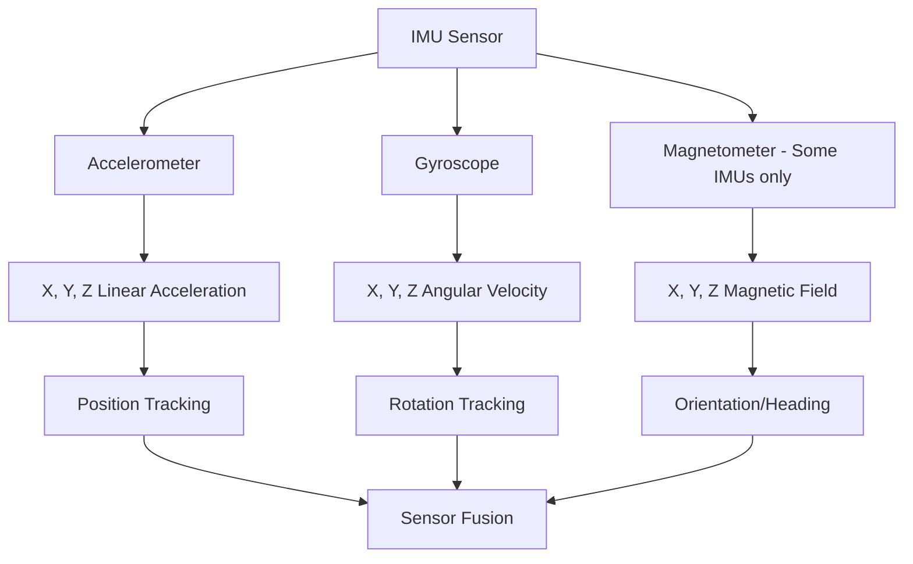

# STM32 IMU Integration

## Introduction

Inertial Measurement Units (IMUs) are essential components in modern motion sensing applications. They combine multiple sensors - typically accelerometers, gyroscopes, and sometimes magnetometers - to provide accurate data about an object's orientation, movement, and position in space. 

In this tutorial, we'll learn how to integrate an IMU with an STM32 microcontroller. This powerful combination enables various applications from simple tilt detection to complex motion tracking for robotics, drones, and wearable devices.

We'll focus on the MPU6050, one of the most popular and affordable IMU sensors, but the concepts apply to other IMU models with slight modifications.

## What You'll Learn

- Understanding IMU sensors and their capabilities
- Setting up the STM32 to communicate with an IMU
- Reading raw sensor data via I2C protocol
- Processing and interpreting IMU data
- Implementing sensor fusion algorithms
- Creating practical motion tracking applications

## Prerequisites

- Basic knowledge of STM32 microcontrollers
- Familiarity with C programming
- Understanding of I2C communication protocol
- STM32CubeIDE or similar development environment

## Hardware Requirements

- An STM32 development board (F4, F3, or L4 series recommended)
- MPU6050 IMU module
- Jumper wires
- Breadboard
- USB cable for programming

## Understanding IMU Sensors

IMU sensors contain multiple sensing elements in a single package:

1. **Accelerometer**: Measures linear acceleration along X, Y, and Z axes
2. **Gyroscope**: Measures angular velocity (rotation) around X, Y, and Z axes
3. **Magnetometer** (in some IMUs): Measures magnetic field strength for compass heading

The MPU6050 combines a 3-axis accelerometer and a 3-axis gyroscope in a single chip, providing 6 degrees of freedom (6DOF) motion tracking.



## Hardware Connection

Connect the MPU6050 to your STM32 board using the I2C interface:

| MPU6050 Pin | STM32 Pin      | Description           |
|-------------|----------------|-----------------------|
| VCC         | 3.3V           | Power supply          |
| GND         | GND            | Ground                |
| SCL         | PB6 (I2C1_SCL) | I2C clock line        |
| SDA         | PB7 (I2C1_SDA) | I2C data line         |
| INT         | PA1 (optional) | Interrupt for data ready |

> Note: Pin assignments may vary depending on your specific STM32 board. Check your board's documentation for the correct I2C pins.

## Software Setup

### 1. Configure I2C in STM32CubeIDE

Start by configuring the I2C peripheral in STM32CubeIDE:

1. Create a new STM32 project for your board
2. In the pinout configuration, enable I2C1
3. Set I2C speed to Fast Mode (400 kHz)
4. Configure the I2C pins as shown in the hardware connection section
5. Enable the necessary GPIO ports
6. Generate the code

### 2. Creating MPU6050 Driver

Let's create a driver for the MPU6050 to make working with it easier. We'll start with the header file:

```c
/* mpu6050.h */
#ifndef MPU6050_H
#define MPU6050_H

#include "main.h"

/* MPU6050 Register Addresses */
#define MPU6050_ADDR        0xD0  // I2C address (0x68 << 1)
#define WHO_AM_I_REG        0x75  // Should return 0x68
#define PWR_MGMT_1_REG      0x6B
#define SMPLRT_DIV_REG      0x19
#define ACCEL_CONFIG_REG    0x1C
#define ACCEL_XOUT_H_REG    0x3B
#define GYRO_CONFIG_REG     0x1B
#define GYRO_XOUT_H_REG     0x43

/* MPU6050 Structure */
typedef struct {
    int16_t Accel_X_RAW;
    int16_t Accel_Y_RAW;
    int16_t Accel_Z_RAW;
    float Ax;
    float Ay;
    float Az;
    
    int16_t Gyro_X_RAW;
    int16_t Gyro_Y_RAW;
    int16_t Gyro_Z_RAW;
    float Gx;
    float Gy;
    float Gz;
    
    float Temperature;
    
    // Calculated angles (optional)
    float AngleX;
    float AngleY;
    float AngleZ;
} MPU6050_t;

/* Function Prototypes */
uint8_t MPU6050_Init(I2C_HandleTypeDef *I2Cx);
void MPU6050_Read_Accel(I2C_HandleTypeDef *I2Cx, MPU6050_t *DataStruct);
void MPU6050_Read_Gyro(I2C_HandleTypeDef *I2Cx, MPU6050_t *DataStruct);
void MPU6050_Read_Temp(I2C_HandleTypeDef *I2Cx, MPU6050_t *DataStruct);
void MPU6050_Read_All(I2C_HandleTypeDef *I2Cx, MPU6050_t *DataStruct);

#endif /* MPU6050_H */
```

Now, let's implement the driver functions:

```c
/* mpu6050.c */
#include "mpu6050.h"

// Helper function to write to MPU6050 registers
static void MPU6050_Write_Reg(I2C_HandleTypeDef *I2Cx, uint8_t reg, uint8_t data) {
    uint8_t buffer[2] = {reg, data};
    HAL_I2C_Master_Transmit(I2Cx, MPU6050_ADDR, buffer, 2, HAL_MAX_DELAY);
}

// Helper function to read from MPU6050 registers
static void MPU6050_Read_Reg(I2C_HandleTypeDef *I2Cx, uint8_t reg, uint8_t *data, uint16_t size) {
    HAL_I2C_Master_Transmit(I2Cx, MPU6050_ADDR, &reg, 1, HAL_MAX_DELAY);
    HAL_I2C_Master_Receive(I2Cx, MPU6050_ADDR, data, size, HAL_MAX_DELAY);
}

// Initialize the MPU6050 sensor
uint8_t MPU6050_Init(I2C_HandleTypeDef *I2Cx) {
    uint8_t check;
    uint8_t data;
    
    // Check device ID
    MPU6050_Read_Reg(I2Cx, WHO_AM_I_REG, &check, 1);
    
    if (check == 0x68) {  // 0x68 is the expected device ID
        // Power management register - wake up the sensor
        data = 0x00;
        MPU6050_Write_Reg(I2Cx, PWR_MGMT_1_REG, data);
        
        // Set sample rate divider - 1kHz
        data = 0x07;
        MPU6050_Write_Reg(I2Cx, SMPLRT_DIV_REG, data);
        
        // Set accelerometer configuration - ±2g
        data = 0x00;
        MPU6050_Write_Reg(I2Cx, ACCEL_CONFIG_REG, data);
        
        // Set gyroscope configuration - ±250 degrees/s
        data = 0x00;
        MPU6050_Write_Reg(I2Cx, GYRO_CONFIG_REG, data);
        
        return 0; // Initialization success
    }
    
    return 1; // Initialization failed
}

// Read accelerometer data
void MPU6050_Read_Accel(I2C_HandleTypeDef *I2Cx, MPU6050_t *DataStruct) {
    uint8_t data[6];
    
    // Read 6 bytes from accelerometer registers (X, Y, Z)
    MPU6050_Read_Reg(I2Cx, ACCEL_XOUT_H_REG, data, 6);
    
    // Combine high and low bytes to get 16-bit values
    DataStruct->Accel_X_RAW = (int16_t)(data[0] << 8 | data[1]);
    DataStruct->Accel_Y_RAW = (int16_t)(data[2] << 8 | data[3]);
    DataStruct->Accel_Z_RAW = (int16_t)(data[4] << 8 | data[5]);
    
    // Convert to g units (1g = 9.81 m/s²) with ±2g sensitivity scale factor
    DataStruct->Ax = DataStruct->Accel_X_RAW / 16384.0;
    DataStruct->Ay = DataStruct->Accel_Y_RAW / 16384.0;
    DataStruct->Az = DataStruct->Accel_Z_RAW / 16384.0;
}

// Read gyroscope data
void MPU6050_Read_Gyro(I2C_HandleTypeDef *I2Cx, MPU6050_t *DataStruct) {
    uint8_t data[6];
    
    // Read 6 bytes from gyroscope registers (X, Y, Z)
    MPU6050_Read_Reg(I2Cx, GYRO_XOUT_H_REG, data, 6);
    
    // Combine high and low bytes to get 16-bit values
    DataStruct->Gyro_X_RAW = (int16_t)(data[0] << 8 | data[1]);
    DataStruct->Gyro_Y_RAW = (int16_t)(data[2] << 8 | data[3]);
    DataStruct->Gyro_Z_RAW = (int16_t)(data[4] << 8 | data[5]);
    
    // Convert to degrees per second with ±250 deg/s sensitivity scale factor
    DataStruct->Gx = DataStruct->Gyro_X_RAW / 131.0;
    DataStruct->Gy = DataStruct->Gyro_Y_RAW / 131.0;
    DataStruct->Gz = DataStruct->Gyro_Z_RAW / 131.0;
}

// Read temperature data
void MPU6050_Read_Temp(I2C_HandleTypeDef *I2Cx, MPU6050_t *DataStruct) {
    uint8_t data[2];
    int16_t temp;
    
    // Read 2 bytes from temperature registers
    MPU6050_Read_Reg(I2Cx, 0x41, data, 2);
    
    // Combine high and low bytes
    temp = (int16_t)(data[0] << 8 | data[1]);
    
    // Convert to degrees Celsius
    DataStruct->Temperature = (float)((temp / 340.0) + 36.53);
}

// Read all sensor data at once
void MPU6050_Read_All(I2C_HandleTypeDef *I2Cx, MPU6050_t *DataStruct) {
    uint8_t data[14];
    
    // Read 14 bytes starting from accelerometer registers
    MPU6050_Read_Reg(I2Cx, ACCEL_XOUT_H_REG, data, 14);
    
    // Parse accelerometer data
    DataStruct->Accel_X_RAW = (int16_t)(data[0] << 8 | data[1]);
    DataStruct->Accel_Y_RAW = (int16_t)(data[2] << 8 | data[3]);
    DataStruct->Accel_Z_RAW = (int16_t)(data[4] << 8 | data[5]);
    
    // Parse temperature data
    int16_t temp = (int16_t)(data[6] << 8 | data[7]);
    DataStruct->Temperature = (float)((temp / 340.0) + 36.53);
    
    // Parse gyroscope data
    DataStruct->Gyro_X_RAW = (int16_t)(data[8] << 8 | data[9]);
    DataStruct->Gyro_Y_RAW = (int16_t)(data[10] << 8 | data[11]);
    DataStruct->Gyro_Z_RAW = (int16_t)(data[12] << 8 | data[13]);
    
    // Convert accelerometer values to g
    DataStruct->Ax = DataStruct->Accel_X_RAW / 16384.0;
    DataStruct->Ay = DataStruct->Accel_Y_RAW / 16384.0;
    DataStruct->Az = DataStruct->Accel_Z_RAW / 16384.0;
    
    // Convert gyroscope values to degrees per second
    DataStruct->Gx = DataStruct->Gyro_X_RAW / 131.0;
    DataStruct->Gy = DataStruct->Gyro_Y_RAW / 131.0;
    DataStruct->Gz = DataStruct->Gyro_Z_RAW / 131.0;
}
```

## Using the MPU6050 Driver

Now let's create a basic example to read and display IMU data:

```c
/* main.c */
#include "main.h"
#include "mpu6050.h"
#include <stdio.h>

extern I2C_HandleTypeDef hi2c1;  // Defined in the auto-generated code

MPU6050_t mpu;
char buf[80];

int main(void) {
    // Initialization code (auto-generated)
    HAL_Init();
    SystemClock_Config();
    MX_GPIO_Init();
    MX_I2C1_Init();
    
    // Initialize MPU6050
    while (MPU6050_Init(&hi2c1) != 0) {
        printf("MPU6050 not detected\r
");
        HAL_Delay(1000);
    }
    
    printf("MPU6050 initialized successfully!\r
");
    
    while (1) {
        // Read all sensor data
        MPU6050_Read_All(&hi2c1, &mpu);
        
        // Print accelerometer data
        printf("Accel: X=%.2f g, Y=%.2f g, Z=%.2f g\r
", mpu.Ax, mpu.Ay, mpu.Az);
        
        // Print gyroscope data
        printf("Gyro: X=%.2f °/s, Y=%.2f °/s, Z=%.2f °/s\r
", mpu.Gx, mpu.Gy, mpu.Gz);
        
        // Print temperature
        printf("Temperature: %.2f °C\r

", mpu.Temperature);
        
        HAL_Delay(500);  // Update every 500ms
    }
}

// Implement printf
int _write(int file, char *ptr, int len) {
    HAL_UART_Transmit(&huart2, (uint8_t *)ptr, len, HAL_MAX_DELAY);
    return len;
}
```

### Understanding the Output

With this basic example running, you'll see raw sensor data from the IMU. Let's understand what these values mean:

- **Accelerometer Values**:
  - When stationary and flat, you should see approximately X=0, Y=0, Z=1g (gravity)
  - Tilting the sensor changes how gravity affects each axis
  - Sudden movements add linear acceleration to the gravity component

- **Gyroscope Values**:
  - When stationary, all values should be close to zero
  - Values represent rotation rate around each axis in degrees per second
  - Integrated over time, they provide rotation angles

## Sensor Calibration

IMU sensors have inherent biases and errors that should be calibrated for accurate measurements. Here's a simple calibration routine:

```c
void MPU6050_Calibrate(I2C_HandleTypeDef *I2Cx, MPU6050_t *DataStruct) {
    float gyro_bias[3] = {0, 0, 0};
    float accel_bias[3] = {0, 0, 0};
    int32_t gyro_bias_sum[3] = {0, 0, 0};
    int32_t accel_bias_sum[3] = {0, 0, 0};
    int i;
    
    printf("Calibrating IMU, keep the sensor still...\r
");
    
    // Take 1000 readings for calibration
    for (i = 0; i < 1000; i++) {
        MPU6050_Read_All(I2Cx, DataStruct);
        
        // Sum up gyro readings
        gyro_bias_sum[0] += DataStruct->Gyro_X_RAW;
        gyro_bias_sum[1] += DataStruct->Gyro_Y_RAW;
        gyro_bias_sum[2] += DataStruct->Gyro_Z_RAW;
        
        // Sum up accelerometer readings
        accel_bias_sum[0] += DataStruct->Accel_X_RAW;
        accel_bias_sum[1] += DataStruct->Accel_Y_RAW;
        accel_bias_sum[2] += DataStruct->Accel_Z_RAW - 16384;  // Remove gravity (1g = 16384 in ±2g mode)
        
        HAL_Delay(1);
    }
    
    // Calculate average bias
    gyro_bias[0] = (float)gyro_bias_sum[0] / 1000.0;
    gyro_bias[1] = (float)gyro_bias_sum[1] / 1000.0;
    gyro_bias[2] = (float)gyro_bias_sum[2] / 1000.0;
    
    accel_bias[0] = (float)accel_bias_sum[0] / 1000.0;
    accel_bias[1] = (float)accel_bias_sum[1] / 1000.0;
    accel_bias[2] = (float)accel_bias_sum[2] / 1000.0;
    
    printf("Calibration complete!\r
");
    printf("Gyro bias: X=%.2f, Y=%.2f, Z=%.2f\r
", gyro_bias[0], gyro_bias[1], gyro_bias[2]);
    printf("Accel bias: X=%.2f, Y=%.2f, Z=%.2f\r
", accel_bias[0], accel_bias[1], accel_bias[2]);
    
    // Apply bias correction to future readings
    // Store these values and subtract them in the reading functions
}
```

Add this function to your `mpu6050.c` file and call it once after initialization.

## Computing Orientation: Sensor Fusion

Now that we can read raw data from the IMU, let's implement a simple complementary filter to determine orientation. This filter combines accelerometer and gyroscope data:

```c
/* Add to mpu6050.c */
void MPU6050_Calculate_Angle(MPU6050_t *DataStruct, float dt) {
    // Calculate pitch and roll from accelerometer (in degrees)
    float accel_pitch = atan2f(DataStruct->Ay, DataStruct->Az) * 180.0f / M_PI;
    float accel_roll = atan2f(-DataStruct->Ax, sqrtf(DataStruct->Ay * DataStruct->Ay + DataStruct->Az * DataStruct->Az)) * 180.0f / M_PI;
    
    // Integrate gyroscope data
    DataStruct->AngleX += DataStruct->Gx * dt;  // Pitch
    DataStruct->AngleY += DataStruct->Gy * dt;  // Roll
    DataStruct->AngleZ += DataStruct->Gz * dt;  // Yaw
    
    // Apply complementary filter (98% gyro, 2% accelerometer)
    DataStruct->AngleX = 0.98f * DataStruct->AngleX + 0.02f * accel_pitch;
    DataStruct->AngleY = 0.98f * DataStruct->AngleY + 0.02f * accel_roll;
    
    // Yaw cannot be corrected with accelerometer, it will drift over time
}
```

Add this to your main loop:

```c
uint32_t prev_time = 0;
uint32_t current_time = 0;
float dt;

// Inside the while(1) loop
current_time = HAL_GetTick();
dt = (current_time - prev_time) / 1000.0f;  // Convert to seconds
prev_time = current_time;

MPU6050_Read_All(&hi2c1, &mpu);
MPU6050_Calculate_Angle(&mpu, dt);

printf("Angles: Pitch=%.2f°, Roll=%.2f°, Yaw=%.2f°\r
", 
       mpu.AngleX, mpu.AngleY, mpu.AngleZ);
```

## Practical Applications

Now let's look at some practical applications for IMU integration:

### 1. Tilt Detection

This simple application detects when the device is tilted beyond a certain threshold:

```c
void Detect_Tilt(MPU6050_t *mpu) {
    const float TILT_THRESHOLD = 30.0f;  // 30 degrees
    
    if (fabs(mpu->AngleX) > TILT_THRESHOLD || fabs(mpu->AngleY) > TILT_THRESHOLD) {
        printf("TILT DETECTED!\r
");
        HAL_GPIO_WritePin(GPIOA, GPIO_PIN_5, GPIO_PIN_SET);  // Turn on LED
    } else {
        HAL_GPIO_WritePin(GPIOA, GPIO_PIN_5, GPIO_PIN_RESET);  // Turn off LED
    }
}
```

### 2. Step Counter

Let's implement a basic step counter using accelerometer data:

```c
void Step_Counter(MPU6050_t *mpu, uint32_t *step_count) {
    static float prev_acc = 0;
    static uint32_t last_step_time = 0;
    uint32_t current_time = HAL_GetTick();
    
    // Calculate total acceleration magnitude
    float acc_magnitude = sqrtf(mpu->Ax * mpu->Ax + mpu->Ay * mpu->Ay + mpu->Az * mpu->Az);
    
    // Detect steps based on acceleration peaks
    if (acc_magnitude > 1.2f && prev_acc <= 1.2f && current_time - last_step_time > 300) {
        // Detected a step (threshold crossing with debounce time)
        (*step_count)++;
        last_step_time = current_time;
        printf("Steps: %lu\r
", *step_count);
    }
    
    prev_acc = acc_magnitude;
}
```

### 3. Gesture Recognition

This example recognizes simple gestures:

```c
typedef enum {
    GESTURE_NONE,
    GESTURE_SHAKE,
    GESTURE_FLIP
} Gesture_t;

Gesture_t Detect_Gesture(MPU6050_t *mpu) {
    static uint32_t shake_count = 0;
    static uint32_t last_shake_time = 0;
    uint32_t current_time = HAL_GetTick();
    
    // Calculate acceleration magnitude
    float acc_magnitude = sqrtf(mpu->Ax * mpu->Ax + mpu->Ay * mpu->Ay + mpu->Az * mpu->Az);
    
    // Detect shake (high acceleration)
    if (acc_magnitude > 2.0f && current_time - last_shake_time > 200) {
        shake_count++;
        last_shake_time = current_time;
        
        if (shake_count >= 3 && current_time - last_shake_time < 1000) {
            shake_count = 0;
            return GESTURE_SHAKE;
        }
    }
    
    // Reset shake count if too much time has passed
    if (current_time - last_shake_time > 1000) {
        shake_count = 0;
    }
    
    // Detect flip (Z-axis flipped)
    if (mpu->Az < -0.8f) {
        return GESTURE_FLIP;
    }
    
    return GESTURE_NONE;
}
```

## Advanced Topic: Kalman Filter

For more accurate orientation estimation, a Kalman filter is often used. This is a more complex algorithm but provides better results than the complementary filter. Here's a simplified implementation:

```c
/* kalman.h */
#ifndef KALMAN_H
#define KALMAN_H

typedef struct {
    float Q_angle;   // Process noise variance for the accelerometer
    float Q_bias;    // Process noise variance for the gyro bias
    float R_measure; // Measurement noise variance
    
    float angle;     // The angle calculated by the Kalman filter
    float bias;      // The gyro bias calculated by the Kalman filter
    float rate;      // Unbiased rate
    
    float P[2][2];   // Error covariance matrix
} Kalman_t;

void Kalman_Init(Kalman_t *Kalman);
float Kalman_Get_Angle(Kalman_t *Kalman, float new_angle, float new_rate, float dt);

#endif /* KALMAN_H */
```

```c
/* kalman.c */
#include "kalman.h"

void Kalman_Init(Kalman_t *Kalman) {
    // Initialize Kalman filter parameters
    Kalman->Q_angle = 0.001f;
    Kalman->Q_bias = 0.003f;
    Kalman->R_measure = 0.03f;
    
    Kalman->angle = 0.0f;
    Kalman->bias = 0.0f;
    
    Kalman->P[0][0] = 0.0f;
    Kalman->P[0][1] = 0.0f;
    Kalman->P[1][0] = 0.0f;
    Kalman->P[1][1] = 0.0f;
}

float Kalman_Get_Angle(Kalman_t *Kalman, float new_angle, float new_rate, float dt) {
    // Predict
    Kalman->rate = new_rate - Kalman->bias;
    Kalman->angle += dt * Kalman->rate;
    
    // Update error covariance matrix
    Kalman->P[0][0] += dt * (dt * Kalman->P[1][1] - Kalman->P[0][1] - Kalman->P[1][0] + Kalman->Q_angle);
    Kalman->P[0][1] -= dt * Kalman->P[1][1];
    Kalman->P[1][0] -= dt * Kalman->P[1][1];
    Kalman->P[1][1] += Kalman->Q_bias * dt;
    
    // Calculate Kalman gain
    float S = Kalman->P[0][0] + Kalman->R_measure;
    float K[2];
    K[0] = Kalman->P[0][0] / S;
    K[1] = Kalman->P[1][0] / S;
    
    // Calculate angle and bias
    float y = new_angle - Kalman->angle;
    Kalman->angle += K[0] * y;
    Kalman->bias += K[1] * y;
    
    // Update error covariance matrix
    float P00_temp = Kalman->P[0][0];
    float P01_temp = Kalman->P[0][1];
    
    Kalman->P[0][0] -= K[0] * P00_temp;
    Kalman->P[0][1] -= K[0] * P01_temp;
    Kalman->P[1][0] -= K[1] * P00_temp;
    Kalman->P[1][1] -= K[1] * P01_temp;
    
    return Kalman->angle;
}
```

Using the Kalman filter:

```c
Kalman_t kalman_pitch, kalman_roll;

// In initialization
Kalman_Init(&kalman_pitch);
Kalman_Init(&kalman_roll);

// In main loop
float accel_pitch = atan2f(mpu.Ay, mpu.Az) * 180.0f / M_PI;
float accel_roll = atan2f(-mpu.Ax, sqrtf(mpu.Ay * mpu.Ay + mpu.Az * mpu.Az)) * 180.0f / M_PI;

// Apply Kalman filter
float pitch = Kalman_Get_Angle(&kalman_pitch, accel_pitch, mpu.Gx, dt);
float roll = Kalman_Get_Angle(&kalman_roll, accel_roll, mpu.Gy, dt);

printf("Kalman Angles: Pitch=%.2f°, Roll=%.2f°\r
", pitch, roll);
```

## Complete Working Example

Here's a complete working example that combines everything we've learned:

```c
/* main.c */
#include "main.h"
#include "mpu6050.h"
#include "kalman.h"
#include <stdio.h>
#include <math.h>

extern I2C_HandleTypeDef hi2c1;
extern UART_HandleTypeDef huart2;

MPU6050_t mpu;
Kalman_t kalman_pitch, kalman_roll;
uint32_t step_count = 0;

int main(void) {
    // Initialization code (auto-generated)
    HAL_Init();
    SystemClock_Config();
    MX_GPIO_Init();
    MX_I2C1_Init();
    MX_USART2_UART_Init();
    
    printf("STM32 IMU Example\r
");
    
    // Initialize MPU6050
    while (MPU6050_Init(&hi2c1) != 0) {
        printf("MPU6050 not detected, check connections\r