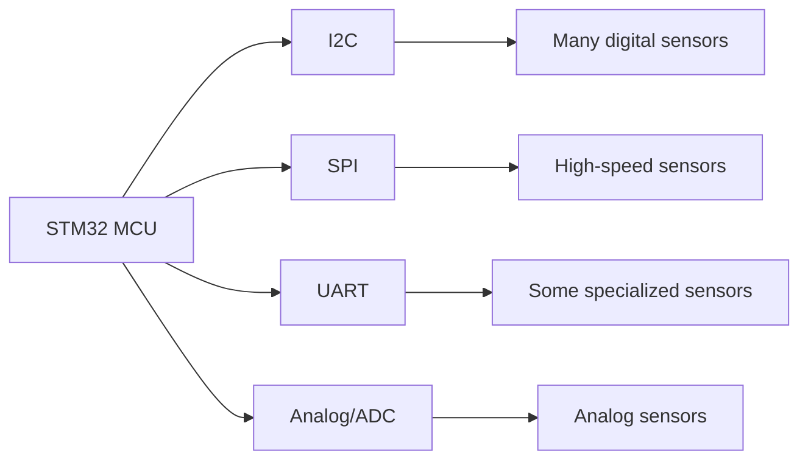

# STM32 Environmental Sensors

## Introduction

Environmental sensors play a crucial role in modern embedded systems, allowing applications to monitor and respond to conditions like temperature, humidity, air pressure, and air quality. The STM32 family of microcontrollers offers robust support for interfacing with a wide range of environmental sensors, making them ideal for IoT devices, weather stations, HVAC control systems, and environmental monitoring solutions.

In this guide, we'll explore how to integrate various environmental sensors with STM32 microcontrollers. We'll cover the fundamentals of sensor communication, provide practical examples with complete code, and walk through real-world applications. By the end, you'll have the knowledge to incorporate environmental sensing capabilities into your own STM32 projects.

## Types of Environmental Sensors

Before diving into implementation, let's understand the common types of environmental sensors compatible with STM32:

| Sensor Type | Measures | Common Applications |
| --- | --- | --- |
| Temperature | Ambient temperature | Climate control, equipment monitoring |
| Humidity | Relative humidity | Weather stations, HVAC systems |
| Barometric pressure | Atmospheric pressure | Weather prediction, altitude estimation |
| Gas/Air quality | VOCs, CO2, particulate matter | Air purifiers, pollution monitoring |
| Light | Ambient light intensity | Automatic brightness control, light-dependent applications |

## Communication Protocols

STM32 microcontrollers support multiple communication protocols for interfacing with sensors:



Most modern environmental sensors use I2C or SPI interfaces, though some analog sensors connect directly to the STM32's ADC inputs.

## Setting Up the Development Environment

Before we start coding, make sure you have:

1. An STM32 development board (like NUCLEO-F446RE or STM32F4-Discovery)
2. Environmental sensor breakout boards (examples will use BME280 for temperature/humidity/pressure)
3. STM32CubeIDE installed
4. STM32CubeMX for configuration
5. Jumper wires and a breadboard

## Getting Started with BME280

The BME280 is a popular sensor that measures temperature, humidity, and barometric pressure in a single package. It communicates via I2C or SPI, making it perfect for our first example.

### Hardware Connection

Connect the BME280 to your STM32 board as follows:

| BME280 Pin | STM32 Pin |
| --- | --- |
| VCC | 3.3V |
| GND | GND |
| SCL | SCL pin (e.g., PB8 on many boards) |
| SDA | SDA pin (e.g., PB9 on many boards) |
| CS | Leave unconnected for I2C mode |

### I2C Configuration with STM32CubeMX

1. Open STM32CubeMX and create a new project for your board
2. Configure an I2C peripheral (typically I2C1)
3. Set the pins for SCL and SDA
4. Configure the I2C speed to 100kHz (standard mode)
5. Generate the code and open in STM32CubeIDE

### BME280 Driver Implementation

First, let's create the header file for our BME280 driver:

```c
/* bme280.h */
#ifndef BME280_H
#define BME280_H

#include "main.h"

// BME280 I2C Address (0x76 or 0x77 depending on SDO pin)
#define BME280_I2C_ADDR 0x76 << 1

// Register addresses
#define BME280_REG_ID          0xD0
#define BME280_REG_RESET       0xE0
#define BME280_REG_CTRL_HUM    0xF2
#define BME280_REG_STATUS      0xF3
#define BME280_REG_CTRL_MEAS   0xF4
#define BME280_REG_CONFIG      0xF5
#define BME280_REG_PRESS_MSB   0xF7
#define BME280_REG_PRESS_LSB   0xF8
#define BME280_REG_PRESS_XLSB  0xF9
#define BME280_REG_TEMP_MSB    0xFA
#define BME280_REG_TEMP_LSB    0xFB
#define BME280_REG_TEMP_XLSB   0xFC
#define BME280_REG_HUM_MSB     0xFD
#define BME280_REG_HUM_LSB     0xFE

// Calibration data structure
typedef struct {
    uint16_t dig_T1;
    int16_t  dig_T2;
    int16_t  dig_T3;
    uint16_t dig_P1;
    int16_t  dig_P2;
    int16_t  dig_P3;
    int16_t  dig_P4;
    int16_t  dig_P5;
    int16_t  dig_P6;
    int16_t  dig_P7;
    int16_t  dig_P8;
    int16_t  dig_P9;
    uint8_t  dig_H1;
    int16_t  dig_H2;
    uint8_t  dig_H3;
    int16_t  dig_H4;
    int16_t  dig_H5;
    int8_t   dig_H6;
} BME280_CalibData;

// Sensor measurements
typedef struct {
    float temperature; // in °C
    float pressure;    // in hPa
    float humidity;    // in %
} BME280_Data;

// Functions
uint8_t BME280_Init(I2C_HandleTypeDef *hi2c);
uint8_t BME280_ReadID(I2C_HandleTypeDef *hi2c);
void BME280_ReadData(I2C_HandleTypeDef *hi2c, BME280_Data *data);

#endif /* BME280_H */
```

Now let's implement the driver:

```c
/* bme280.c */
#include "bme280.h"

static BME280_CalibData calibData;
static int32_t t_fine;

// Helper function to read registers
static uint8_t BME280_ReadReg(I2C_HandleTypeDef *hi2c, uint8_t reg) {
    uint8_t value;
    HAL_I2C_Mem_Read(hi2c, BME280_I2C_ADDR, reg, I2C_MEMADD_SIZE_8BIT, &value, 1, HAL_MAX_DELAY);
    return value;
}

// Helper function to write registers
static void BME280_WriteReg(I2C_HandleTypeDef *hi2c, uint8_t reg, uint8_t value) {
    HAL_I2C_Mem_Write(hi2c, BME280_I2C_ADDR, reg, I2C_MEMADD_SIZE_8BIT, &value, 1, HAL_MAX_DELAY);
}

// Read calibration data from sensor
static void BME280_ReadCalibData(I2C_HandleTypeDef *hi2c) {
    uint8_t data[24];
    
    // Read temperature and pressure calibration data (0x88-0x9F)
    HAL_I2C_Mem_Read(hi2c, BME280_I2C_ADDR, 0x88, I2C_MEMADD_SIZE_8BIT, data, 24, HAL_MAX_DELAY);
    
    calibData.dig_T1 = (data[1] << 8) | data[0];
    calibData.dig_T2 = (data[3] << 8) | data[2];
    calibData.dig_T3 = (data[5] << 8) | data[4];
    calibData.dig_P1 = (data[7] << 8) | data[6];
    calibData.dig_P2 = (data[9] << 8) | data[8];
    calibData.dig_P3 = (data[11] << 8) | data[10];
    calibData.dig_P4 = (data[13] << 8) | data[12];
    calibData.dig_P5 = (data[15] << 8) | data[14];
    calibData.dig_P6 = (data[17] << 8) | data[16];
    calibData.dig_P7 = (data[19] << 8) | data[18];
    calibData.dig_P8 = (data[21] << 8) | data[20];
    calibData.dig_P9 = (data[23] << 8) | data[22];
    
    // Read humidity calibration data
    calibData.dig_H1 = BME280_ReadReg(hi2c, 0xA1);
    
    HAL_I2C_Mem_Read(hi2c, BME280_I2C_ADDR, 0xE1, I2C_MEMADD_SIZE_8BIT, data, 7, HAL_MAX_DELAY);
    calibData.dig_H2 = (data[1] << 8) | data[0];
    calibData.dig_H3 = data[2];
    calibData.dig_H4 = (data[3] << 4) | (data[4] & 0x0F);
    calibData.dig_H5 = (data[5] << 4) | (data[4] >> 4);
    calibData.dig_H6 = (int8_t)data[6];
}

// Initialize BME280 sensor
uint8_t BME280_Init(I2C_HandleTypeDef *hi2c) {
    // Check sensor ID
    uint8_t id = BME280_ReadID(hi2c);
    if (id != 0x60) return 0; // BME280 ID should be 0x60
    
    // Reset the sensor
    BME280_WriteReg(hi2c, BME280_REG_RESET, 0xB6);
    HAL_Delay(100);
    
    // Wait for sensor to be ready
    while (BME280_ReadReg(hi2c, BME280_REG_STATUS) & 0x01);
    
    // Read calibration data
    BME280_ReadCalibData(hi2c);
    
    // Configure the sensor
    // Set humidity oversampling (×1)
    BME280_WriteReg(hi2c, BME280_REG_CTRL_HUM, 0x01);
    
    // Set temperature and pressure oversampling (×1) and normal mode
    BME280_WriteReg(hi2c, BME280_REG_CTRL_MEAS, 0x27);
    
    // Set standby time and filter (standby: 1s, filter: off)
    BME280_WriteReg(hi2c, BME280_REG_CONFIG, 0x50);
    
    return 1;
}

// Read sensor ID
uint8_t BME280_ReadID(I2C_HandleTypeDef *hi2c) {
    return BME280_ReadReg(hi2c, BME280_REG_ID);
}

// Compensation formulas from BME280 datasheet
static int32_t BME280_CompensateTemp(int32_t adc_T) {
    int32_t var1, var2, T;
    
    var1 = ((((adc_T >> 3) - ((int32_t)calibData.dig_T1 << 1))) * ((int32_t)calibData.dig_T2)) >> 11;
    var2 = (((((adc_T >> 4) - ((int32_t)calibData.dig_T1)) * ((adc_T >> 4) - ((int32_t)calibData.dig_T1))) >> 12) * ((int32_t)calibData.dig_T3)) >> 14;
    
    t_fine = var1 + var2;
    T = (t_fine * 5 + 128) >> 8;
    
    return T;
}

static uint32_t BME280_CompensatePress(int32_t adc_P) {
    int64_t var1, var2, p;
    
    var1 = ((int64_t)t_fine) - 128000;
    var2 = var1 * var1 * (int64_t)calibData.dig_P6;
    var2 = var2 + ((var1 * (int64_t)calibData.dig_P5) << 17);
    var2 = var2 + (((int64_t)calibData.dig_P4) << 35);
    var1 = ((var1 * var1 * (int64_t)calibData.dig_P3) >> 8) + ((var1 * (int64_t)calibData.dig_P2) << 12);
    var1 = (((((int64_t)1) << 47) + var1)) * ((int64_t)calibData.dig_P1) >> 33;
    
    if (var1 == 0) return 0; // Avoid division by zero
    
    p = 1048576 - adc_P;
    p = (((p << 31) - var2) * 3125) / var1;
    var1 = (((int64_t)calibData.dig_P9) * (p >> 13) * (p >> 13)) >> 25;
    var2 = (((int64_t)calibData.dig_P8) * p) >> 19;
    
    p = ((p + var1 + var2) >> 8) + (((int64_t)calibData.dig_P7) << 4);
    
    return (uint32_t)p;
}

static uint32_t BME280_CompensateHum(int32_t adc_H) {
    int32_t v_x1_u32r;
    
    v_x1_u32r = (t_fine - ((int32_t)76800));
    v_x1_u32r = (((((adc_H << 14) - (((int32_t)calibData.dig_H4) << 20) - (((int32_t)calibData.dig_H5) * v_x1_u32r)) + ((int32_t)16384)) >> 15) * (((((((v_x1_u32r * ((int32_t)calibData.dig_H6)) >> 10) * (((v_x1_u32r * ((int32_t)calibData.dig_H3)) >> 11) + ((int32_t)32768))) >> 10) + ((int32_t)2097152)) * ((int32_t)calibData.dig_H2) + 8192) >> 14));
    
    v_x1_u32r = (v_x1_u32r - (((((v_x1_u32r >> 15) * (v_x1_u32r >> 15)) >> 7) * ((int32_t)calibData.dig_H1)) >> 4));
    v_x1_u32r = (v_x1_u32r < 0 ? 0 : v_x1_u32r);
    v_x1_u32r = (v_x1_u32r > 419430400 ? 419430400 : v_x1_u32r);
    
    return (uint32_t)(v_x1_u32r >> 12);
}

// Read and calculate temperature, pressure, and humidity
void BME280_ReadData(I2C_HandleTypeDef *hi2c, BME280_Data *data) {
    uint8_t raw_data[8];
    
    // Read raw data from registers
    HAL_I2C_Mem_Read(hi2c, BME280_I2C_ADDR, BME280_REG_PRESS_MSB, I2C_MEMADD_SIZE_8BIT, raw_data, 8, HAL_MAX_DELAY);
    
    // Combine MSB, LSB, and XLSB for pressure, temperature, and humidity
    int32_t adc_P = ((uint32_t)raw_data[0] << 12) | ((uint32_t)raw_data[1] << 4) | ((uint32_t)raw_data[2] >> 4);
    int32_t adc_T = ((uint32_t)raw_data[3] << 12) | ((uint32_t)raw_data[4] << 4) | ((uint32_t)raw_data[5] >> 4);
    int32_t adc_H = ((uint32_t)raw_data[6] << 8) | ((uint32_t)raw_data[7]);
    
    // Calculate compensated temperature (temperature must be calculated first)
    int32_t temp = BME280_CompensateTemp(adc_T);
    data->temperature = (float)temp / 100.0f;
    
    // Calculate compensated pressure
    uint32_t press = BME280_CompensatePress(adc_P);
    data->pressure = (float)press / 256.0f / 100.0f; // Convert to hPa
    
    // Calculate compensated humidity
    uint32_t hum = BME280_CompensateHum(adc_H);
    data->humidity = (float)hum / 1024.0f;
}
```

## Using the BME280 in a Project

Now, let's implement a simple environmental monitoring system using our BME280 driver:

```c
/* main.c */
#include "main.h"
#include "bme280.h"
#include <stdio.h>

I2C_HandleTypeDef hi2c1;
UART_HandleTypeDef huart2;

// Function prototype declarations
static void SystemClock_Config(void);
static void MX_GPIO_Init(void);
static void MX_I2C1_Init(void);
static void MX_USART2_UART_Init(void);

int main(void) {
  // MCU Configuration and Initialization
  HAL_Init();
  SystemClock_Config();
  MX_GPIO_Init();
  MX_I2C1_Init();
  MX_USART2_UART_Init();

  // Buffer for UART output
  char msg[100];
  
  // Initialize BME280 sensor
  if (!BME280_Init(&hi2c1)) {
    sprintf(msg, "BME280 initialization failed!\r
");
    HAL_UART_Transmit(&huart2, (uint8_t*)msg, strlen(msg), HAL_MAX_DELAY);
    Error_Handler();
  }
  
  sprintf(msg, "BME280 sensor initialized. ID: 0x%02X\r
", BME280_ReadID(&hi2c1));
  HAL_UART_Transmit(&huart2, (uint8_t*)msg, strlen(msg), HAL_MAX_DELAY);
  
  // Structure to hold sensor data
  BME280_Data envData;
  
  while (1) {
    // Read sensor data
    BME280_ReadData(&hi2c1, &envData);
    
    // Format and send data over UART
    sprintf(msg, "Temperature: %.2f°C, Pressure: %.2f hPa, Humidity: %.2f%%\r
", 
            envData.temperature, envData.pressure, envData.humidity);
    
    HAL_UART_Transmit(&huart2, (uint8_t*)msg, strlen(msg), HAL_MAX_DELAY);
    
    // Wait 2 seconds before next reading
    HAL_Delay(2000);
  }
}

// Clock configuration function
static void SystemClock_Config(void) {
  // Clock configuration code (generated by CubeMX)
  // ...
}

// I2C initialization function
static void MX_I2C1_Init(void) {
  hi2c1.Instance = I2C1;
  hi2c1.Init.ClockSpeed = 100000;
  hi2c1.Init.DutyCycle = I2C_DUTYCYCLE_2;
  hi2c1.Init.OwnAddress1 = 0;
  hi2c1.Init.AddressingMode = I2C_ADDRESSINGMODE_7BIT;
  hi2c1.Init.DualAddressMode = I2C_DUALADDRESS_DISABLE;
  hi2c1.Init.OwnAddress2 = 0;
  hi2c1.Init.GeneralCallMode = I2C_GENERALCALL_DISABLE;
  hi2c1.Init.NoStretchMode = I2C_NOSTRETCH_DISABLE;
  if (HAL_I2C_Init(&hi2c1) != HAL_OK) {
    Error_Handler();
  }
}

// Other initialization functions...
```

### Expected Output

When you run this program and connect to the UART output with a terminal program (like PuTTY or Tera Term) at 115200 baud rate, you should see output similar to:

```
BME280 sensor initialized. ID: 0x60
Temperature: 24.32°C, Pressure: 1013.25 hPa, Humidity: 48.73%
Temperature: 24.35°C, Pressure: 1013.27 hPa, Humidity: 48.75%
Temperature: 24.33°C, Pressure: 1013.24 hPa, Humidity: 48.72%
...
```

## Adding an Air Quality Sensor: SGP30

Let's expand our environmental monitoring system by adding a SGP30 gas sensor that can detect volatile organic compounds (VOCs) and equivalent CO₂ (eCO₂) levels.

### Hardware Connection

Connect the SGP30 to your STM32 board:

| SGP30 Pin | STM32 Pin |
| --- | --- |
| VCC | 3.3V |
| GND | GND |
| SCL | SCL pin (same as BME280) |
| SDA | SDA pin (same as BME280) |

The SGP30 uses the I2C bus, so we can connect it to the same I2C pins as the BME280.

### SGP30 Driver Implementation

Here's a simple driver for the SGP30 sensor:

```c
/* sgp30.h */
#ifndef SGP30_H
#define SGP30_H

#include "main.h"

// SGP30 I2C Address
#define SGP30_I2C_ADDR 0x58 << 1

// SGP30 Commands
#define SGP30_CMD_INIT_AIR_QUALITY 0x2003
#define SGP30_CMD_MEASURE_AIR_QUALITY 0x2008

// Data structure
typedef struct {
    uint16_t TVOC;    // ppb (parts per billion)
    uint16_t eCO2;    // ppm (parts per million)
} SGP30_Data;

// Functions
uint8_t SGP30_Init(I2C_HandleTypeDef *hi2c);
void SGP30_ReadData(I2C_HandleTypeDef *hi2c, SGP30_Data *data);

#endif /* SGP30_H */
```

And the implementation:

```c
/* sgp30.c */
#include "sgp30.h"

// Helper function to send commands to SGP30
static void SGP30_SendCommand(I2C_HandleTypeDef *hi2c, uint16_t cmd) {
    uint8_t cmd_buffer[2];
    cmd_buffer[0] = cmd >> 8;    // MSB first
    cmd_buffer[1] = cmd & 0xFF;  // LSB
    
    HAL_I2C_Master_Transmit(hi2c, SGP30_I2C_ADDR, cmd_buffer, 2, HAL_MAX_DELAY);
}

// Initialize the SGP30 sensor
uint8_t SGP30_Init(I2C_HandleTypeDef *hi2c) {
    // Send init air quality command
    SGP30_SendCommand(hi2c, SGP30_CMD_INIT_AIR_QUALITY);
    
    // SGP30 needs 15 seconds to initialize
    HAL_Delay(15000);
    
    return 1;
}

// Read air quality measurements
void SGP30_ReadData(I2C_HandleTypeDef *hi2c, SGP30_Data *data) {
    uint8_t buffer[6];
    
    // Send measure air quality command
    SGP30_SendCommand(hi2c, SGP30_CMD_MEASURE_AIR_QUALITY);
    
    // Wait for measurement to complete (12ms)
    HAL_Delay(12);
    
    // Read the measurement results
    HAL_I2C_Master_Receive(hi2c, SGP30_I2C_ADDR, buffer, 6, HAL_MAX_DELAY);
    
    // Format: CO2_MSB, CO2_LSB, CO2_CRC, TVOC_MSB, TVOC_LSB, TVOC_CRC
    data->eCO2 = (buffer[0] << 8) | buffer[1];
    data->TVOC = (buffer[3] << 8) | buffer[4];
    
    // Note: CRC checking is omitted for simplicity
}
```

## Integrating Multiple Sensors

Now let's modify our main application to include both the BME280 and SGP30 sensors:

```c
/* main.c (updated) */
#include "main.h"
#include "bme280.h"
#include "sgp30.h"
#include <stdio.h>

I2C_HandleTypeDef hi2c1;
UART_HandleTypeDef huart2;

// Function prototype declarations
static void SystemClock_Config(void);
static void MX_GPIO_Init(void);
static void MX_I2C1_Init(void);
static void MX_USART2_UART_Init(void);

int main(void) {
  // MCU Configuration and Initialization
  HAL_Init();
  SystemClock_Config();
  MX_GPIO_Init();
  MX_I2C1_Init();
  MX_USART2_UART_Init();

  // Buffer for UART output
  char msg[150];
  
  // Initialize BME280 sensor
  if (!BME280_Init(&hi2c1)) {
    sprintf(msg, "BME280 initialization failed!\r
");
    HAL_UART_Transmit(&huart2, (uint8_t*)msg, strlen(msg), HAL_MAX_DELAY);
    Error_Handler();
  }
  
  sprintf(msg, "BME280 sensor initialized. ID: 0x%02X\r
", BME280_ReadID(&hi2c1));
  HAL_UART_Transmit(&huart2, (uint8_t*)msg, strlen(msg), HAL_MAX_DELAY);
  
  // Initialize SGP30 sensor
  sprintf(msg, "Initializing SGP30 air quality sensor...\r
");
  HAL_UART_Transmit(&huart2, (uint8_t*)msg, strlen(msg), HAL_MAX_DELAY);
  
  if (!SGP30_Init(&hi2c1)) {
    sprintf(msg, "SGP30 initialization failed!\r
");
    HAL_UART_Transmit(&huart2, (uint8_t*)msg, strlen(msg), HAL_MAX_DELAY);
    Error_Handler();
  }
  
  sprintf(msg, "SGP30 sensor initialized.\r
");
  HAL_UART_Transmit(&huart2, (uint8_t*)msg, strlen(msg), HAL_MAX_DELAY);
  
  // Structures to hold sensor data
  BME280_Data envData;
  SGP30_Data airData;
  
  while (1) {
    // Read sensor data
    BME280_ReadData(&hi2c1, &envData);
    SGP30_ReadData(&hi2c1, &airData);
    
    // Format and send data over UART
    sprintf(msg, "Environment:\r
  Temp: %.2f°C\r
  Pressure: %.2f hPa\r
  Humidity: %.2f%%\r
", 
            envData.temperature, envData.pressure, envData.humidity);
    HAL_UART_Transmit(&huart2, (uint8_t*)msg, strlen(msg), HAL_MAX_DELAY);
    
    sprintf(msg, "Air Quality:\r
  eCO2: %u ppm\r
  TVOC: %u ppb\r
\r
", 
            airData.eCO2, airData.TVOC);
    HAL_UART_Transmit(&huart2, (uint8_t*)msg, strlen(msg), HAL_MAX_DELAY);
    
    // Wait 2 seconds before next reading
    HAL_Delay(2000);
  }
}

// Rest of the initialization functions...
```

## Real-World Applications

Now that we've covered the basics of environmental sensing with STM32, let's explore some practical applications:

### 1. Weather Station

```c
/* weather_station.c (excerpt) */
// Weather trend analysis based on pressure changes
void AnalyzeWeatherTrend(float pressureHistory[24], char* trend) {
    // Calculate pressure change over last 3 hours
    float change = pressureHistory[23] - pressureHistory[20];
    
    if (change > 2.0f) {
        strcpy(trend, "Rapidly improving");
    } else if (change > 0.7f) {
        strcpy(trend, "Improving");
    } else if (change > -0.7f && change < 0.7f) {
        strcpy(trend, "Stable");
    } else if (change > -2.0f) {
        strcpy(trend, "Deteriorating");
    } else {
        strcpy(trend, "Rapidly deteriorating");
    }
}

// Add time and date using RTC module
// ...
```

### 2. Air Quality Monitor with Warning System

```c
/* air_quality_monitor.c (excerpt) */
// Evaluate air quality and trigger alerts if necessary
void EvaluateAirQuality(SGP30_Data *airData) {
    char msg[100];
    
    // CO2 levels
    if (airData->eCO2 > 2000) {
        sprintf(msg, "WARNING: High CO2 levels (%u ppm)! Ventilate immediately.\r
", airData->eCO2);
        HAL_UART_Transmit(&huart2, (uint8_t*)msg, strlen(msg), HAL_MAX_DELAY);
        
        // Activate warning LED
        HAL_GPIO_WritePin(WARNING_LED_GPIO_Port, WARNING_LED_Pin, GPIO_PIN_SET);
        
        // Optionally activate buzzer
        HAL_GPIO_WritePin