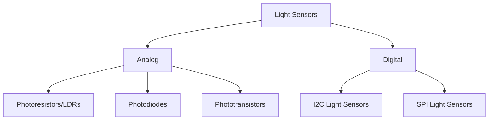
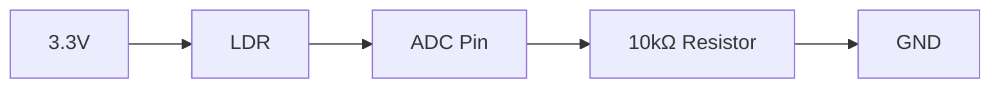

# STM32 Light Sensors

## Introduction

Light sensors are crucial components in many electronic systems, allowing devices to detect and respond to ambient light conditions. When integrated with STM32 microcontrollers, these sensors enable a wide range of applications, from automatic brightness control in displays to smart lighting systems and energy-efficient designs.

In this guide, we'll explore how to integrate various types of light sensors with STM32 microcontrollers. We'll cover everything from basic concepts to practical implementations, helping you understand how to measure light intensity and use this data in your projects.

## Light Sensor Basics

### Common Types of Light Sensors

There are several types of light sensors that can be integrated with STM32 microcontrollers:

1. **Photoresistors (LDRs)** - Simple resistors that change resistance based on light intensity
2. **Photodiodes** - PN junction semiconductors that generate current when exposed to light
3. **Phototransistors** - Transistors with light-sensitive base region
4. **Digital Light Sensors** - IC-based sensors that provide digital output (I2C, SPI)



### Working Principles

Light sensors work on the photoelectric effect principle, where light energy is converted into electrical signals. The intensity of the electrical signal corresponds to the intensity of the light being detected.

## Interfacing Light Sensors with STM32

### Analog Light Sensors (LDR/Photoresistor)

The simplest light sensor to integrate is a photoresistor or Light Dependent Resistor (LDR). These components change their resistance based on light intensity - resistance decreases as light intensity increases.

#### Hardware Setup

To connect an LDR to an STM32 microcontroller:

1. Create a voltage divider circuit with the LDR and a fixed resistor
2. Connect the voltage divider output to an ADC pin on the STM32
3. Configure the ADC to read the analog value

Here's a typical circuit diagram:



#### Code Example for LDR

```c
#include "main.h"
#include "stm32f4xx_hal.h"

ADC_HandleTypeDef hadc1;

void SystemClock_Config(void);
static void MX_GPIO_Init(void);
static void MX_ADC1_Init(void);

uint16_t readLightSensor(void) {
  uint16_t adcValue = 0;
  
  HAL_ADC_Start(&hadc1);
  if (HAL_ADC_PollForConversion(&hadc1, 100) == HAL_OK) {
    adcValue = HAL_ADC_GetValue(&hadc1);
  }
  HAL_ADC_Stop(&hadc1);
  
  return adcValue;
}

int main(void) {
  HAL_Init();
  SystemClock_Config();
  MX_GPIO_Init();
  MX_ADC1_Init();

  while (1) {
    uint16_t lightValue = readLightSensor();
    
    // Higher values indicate more light
    // Lower values indicate less light
    
    // Example: Turn on LED in low light conditions
    if (lightValue < 1000) {
      HAL_GPIO_WritePin(GPIOA, GPIO_PIN_5, GPIO_PIN_SET); // LED ON
    } else {
      HAL_GPIO_WritePin(GPIOA, GPIO_PIN_5, GPIO_PIN_RESET); // LED OFF
    }
    
    HAL_Delay(100); // Read every 100ms
  }
}

/* ADC1 init function */
static void MX_ADC1_Init(void) {
  ADC_ChannelConfTypeDef sConfig = {0};

  hadc1.Instance = ADC1;
  hadc1.Init.ClockPrescaler = ADC_CLOCK_SYNC_PCLK_DIV4;
  hadc1.Init.Resolution = ADC_RESOLUTION_12B;
  hadc1.Init.ScanConvMode = DISABLE;
  hadc1.Init.ContinuousConvMode = DISABLE;
  hadc1.Init.DiscontinuousConvMode = DISABLE;
  hadc1.Init.ExternalTrigConvEdge = ADC_EXTERNALTRIGCONVEDGE_NONE;
  hadc1.Init.ExternalTrigConv = ADC_SOFTWARE_START;
  hadc1.Init.DataAlign = ADC_DATAALIGN_RIGHT;
  hadc1.Init.NbrOfConversion = 1;
  hadc1.Init.DMAContinuousRequests = DISABLE;
  hadc1.Init.EOCSelection = ADC_EOC_SINGLE_CONV;
  HAL_ADC_Init(&hadc1);

  // Configure ADC channel (PA0 is connected to ADC1_IN0)
  sConfig.Channel = ADC_CHANNEL_0;
  sConfig.Rank = 1;
  sConfig.SamplingTime = ADC_SAMPLETIME_56CYCLES;
  HAL_ADC_ConfigChannel(&hadc1, &sConfig);
}
```

#### Output Analysis

The ADC will provide a 12-bit value (0-4095) corresponding to the voltage at the ADC pin. In bright light, the LDR's resistance decreases, resulting in a higher voltage and thus a higher ADC value. In darkness, the LDR's resistance increases, resulting in a lower voltage and a lower ADC value.

### Digital Light Sensors (I2C)

For more accurate measurements, digital light sensors like the BH1750, TSL2561, or VEML7700 are excellent choices. These communicate via I2C and provide calibrated light measurements in lux.

#### Hardware Setup for BH1750

Connect the BH1750 sensor to the STM32 I2C pins:
- VCC → 3.3V
- GND → GND
- SCL → STM32 I2C SCL pin
- SDA → STM32 I2C SDA pin
- ADDR → GND (for I2C address 0x23) or VCC (for address 0x5C)

#### Code Example for BH1750

```c
#include "main.h"
#include "stm32f4xx_hal.h"
#include <stdio.h>

I2C_HandleTypeDef hi2c1;

#define BH1750_ADDR (0x23 << 1)  // BH1750 I2C address (0x23 shifted left by 1 bit)
#define BH1750_POWER_ON 0x01
#define BH1750_RESET 0x07
#define BH1750_CONT_H_RES_MODE 0x10  // Continuous high resolution mode

void SystemClock_Config(void);
static void MX_GPIO_Init(void);
static void MX_I2C1_Init(void);

// Initialize BH1750 sensor
uint8_t BH1750_Init(void) {
  uint8_t data = BH1750_POWER_ON;
  HAL_StatusTypeDef status = HAL_I2C_Master_Transmit(&hi2c1, BH1750_ADDR, &data, 1, 100);
  HAL_Delay(10);
  
  data = BH1750_CONT_H_RES_MODE;
  status = HAL_I2C_Master_Transmit(&hi2c1, BH1750_ADDR, &data, 1, 100);
  HAL_Delay(200);  // Wait for measurement
  
  return (status == HAL_OK) ? 1 : 0;
}

// Read light intensity in lux
float BH1750_ReadLux(void) {
  uint8_t data[2];
  HAL_StatusTypeDef status = HAL_I2C_Master_Receive(&hi2c1, BH1750_ADDR, data, 2, 100);
  
  if (status == HAL_OK) {
    uint16_t raw = (data[0] << 8) | data[1];
    return (float)raw / 1.2f;  // Convert to lux according to datasheet
  }
  
  return 0;  // Return 0 on error
}

int main(void) {
  HAL_Init();
  SystemClock_Config();
  MX_GPIO_Init();
  MX_I2C1_Init();
  
  // Initialize BH1750 sensor
  if (!BH1750_Init()) {
    // Error handling
    while (1) {
      HAL_GPIO_TogglePin(GPIOA, GPIO_PIN_5);  // Blink LED to indicate error
      HAL_Delay(200);
    }
  }
  
  while (1) {
    float lux = BH1750_ReadLux();
    
    // Example: Control LED brightness based on light level
    if (lux < 10) {
      // Very dark: full brightness
      HAL_GPIO_WritePin(GPIOA, GPIO_PIN_5, GPIO_PIN_SET);
    } else if (lux < 100) {
      // Dim environment: blink slowly
      HAL_GPIO_TogglePin(GPIOA, GPIO_PIN_5);
      HAL_Delay(500);
    } else if (lux < 500) {
      // Normal indoor lighting: blink quickly
      HAL_GPIO_TogglePin(GPIOA, GPIO_PIN_5);
      HAL_Delay(100);
    } else {
      // Bright environment: LED off
      HAL_GPIO_WritePin(GPIOA, GPIO_PIN_5, GPIO_PIN_RESET);
    }
    
    HAL_Delay(1000);  // Read every second
  }
}

/* I2C1 init function */
static void MX_I2C1_Init(void) {
  hi2c1.Instance = I2C1;
  hi2c1.Init.ClockSpeed = 100000;
  hi2c1.Init.DutyCycle = I2C_DUTYCYCLE_2;
  hi2c1.Init.OwnAddress1 = 0;
  hi2c1.Init.AddressingMode = I2C_ADDRESSINGMODE_7BIT;
  hi2c1.Init.DualAddressMode = I2C_DUALADDRESS_DISABLE;
  hi2c1.Init.OwnAddress2 = 0;
  hi2c1.Init.GeneralCallMode = I2C_GENERALCALL_DISABLE;
  hi2c1.Init.NoStretchMode = I2C_NOSTRETCH_DISABLE;
  HAL_I2C_Init(&hi2c1);
}
```

## Converting Light Readings to Meaningful Values

### Calibration and Normalization

Raw ADC values from an LDR may not be directly useful. To make these readings meaningful:

1. **Calibration**: Take readings at known light levels
2. **Normalization**: Map raw values to a standard scale (0-100%)

```c
// Example: Map raw ADC value (0-4095) to percentage (0-100)
uint8_t mapLightPercentage(uint16_t adcValue) {
  // Assuming 4095 is brightest and 0 is darkest
  // You may need to adjust min/max based on your sensor characteristics
  const uint16_t MIN_LIGHT = 100;   // Minimum expected value in darkness
  const uint16_t MAX_LIGHT = 4000;  // Maximum expected value in bright light
  
  // Constrain input value
  if (adcValue < MIN_LIGHT) adcValue = MIN_LIGHT;
  if (adcValue > MAX_LIGHT) adcValue = MAX_LIGHT;
  
  // Map to percentage (0-100)
  return (uint8_t)((adcValue - MIN_LIGHT) * 100 / (MAX_LIGHT - MIN_LIGHT));
}
```

### Lux Calculation for Analog Sensors

For analog sensors, you can approximate lux values with calibration:

```c
float calculateLux(uint16_t adcValue) {
  // These values should be calibrated with a reference light meter
  float voltage = (float)adcValue * 3.3f / 4095.0f;
  
  // Example conversion formula (needs calibration)
  // R = 10K * (3.3V / voltage - 1)
  float resistance = 10000.0f * (3.3f / voltage - 1.0f);
  
  // Simplified lux conversion (based on typical LDR characteristics)
  // Lux = 500 / R * 1000 (approximate)
  return 500000.0f / resistance;
}
```

## Practical Applications

### Automatic Brightness Control

One common application is automatically adjusting display or LED brightness based on ambient light:

```c
void adjustBrightness(uint16_t lightValue) {
  // Convert light sensor value to PWM duty cycle
  // Brighter ambient = lower brightness needed
  uint8_t brightness;
  
  if (lightValue < 500) {
    brightness = 100;  // Max brightness in dark environment
  } else if (lightValue < 2000) {
    // Linear mapping for mid-range
    brightness = 100 - ((lightValue - 500) * 60 / 1500);
  } else {
    brightness = 40;  // Minimum brightness (40%) in bright environment
  }
  
  // Apply brightness using PWM
  // Assuming TIM3 CH1 is configured for PWM output
  TIM3->CCR1 = brightness;
}
```

### Light-Based Alarm System

```c
void lightBasedAlarm(uint16_t currentLight, uint16_t threshold) {
  static uint8_t alarmState = 0;
  static uint32_t lastChangeTime = 0;
  uint32_t currentTime = HAL_GetTick();
  
  // Detect sudden changes in light (e.g., someone opened a door)
  if (currentLight > threshold && !alarmState) {
    alarmState = 1;
    lastChangeTime = currentTime;
    
    // Trigger alarm
    HAL_GPIO_WritePin(ALARM_GPIO_Port, ALARM_Pin, GPIO_PIN_SET);
  }
  
  // Auto-reset alarm after 30 seconds
  if (alarmState && (currentTime - lastChangeTime > 30000)) {
    alarmState = 0;
    HAL_GPIO_WritePin(ALARM_GPIO_Port, ALARM_Pin, GPIO_PIN_RESET);
  }
}
```

### Energy-Efficient Lighting Control

```c
void smartLightControl(float luxValue) {
  // Define thresholds for different lighting conditions
  const float DARK_THRESHOLD = 20.0f;   // Below 20 lux is considered dark
  const float BRIGHT_THRESHOLD = 200.0f; // Above 200 lux is considered bright
  
  if (luxValue < DARK_THRESHOLD) {
    // It's dark - turn on lights at full brightness
    HAL_GPIO_WritePin(LIGHT_GPIO_Port, LIGHT_Pin, GPIO_PIN_SET);
    
    // Set PWM duty cycle to 100%
    TIM3->CCR1 = 100;
  } 
  else if (luxValue < BRIGHT_THRESHOLD) {
    // It's dim - turn on lights with adaptive brightness
    HAL_GPIO_WritePin(LIGHT_GPIO_Port, LIGHT_Pin, GPIO_PIN_SET);
    
    // Scale brightness inversely with ambient light
    uint8_t brightness = 100 - (uint8_t)((luxValue - DARK_THRESHOLD) * 100 / (BRIGHT_THRESHOLD - DARK_THRESHOLD));
    TIM3->CCR1 = brightness;
  } 
  else {
    // It's bright - turn off lights to save energy
    HAL_GPIO_WritePin(LIGHT_GPIO_Port, LIGHT_Pin, GPIO_PIN_RESET);
  }
}
```

## Advanced Topics

### Low-Power Light Sensing

For battery-powered applications, power consumption is critical. Here's how to implement low-power light sensing:

```c
void configureLowPowerLightSensing(void) {
  // 1. Use STM32's low-power modes between readings
  // 2. Reduce sampling frequency
  // 3. Use wake-up from sleep on significant light change
  
  // Example: Configure ADC for low-power operation
  hadc1.Init.ClockPrescaler = ADC_CLOCK_SYNC_PCLK_DIV8; // Slower clock
  hadc1.Init.Resolution = ADC_RESOLUTION_8B;            // Lower resolution
  HAL_ADC_Init(&hadc1);
  
  // Configure STM32 to enter sleep mode after measurement
  HAL_PWR_EnableSleepOnExit();
  
  // Use timer to wake up periodically (e.g., every 5 seconds)
  // Configure Timer for low-power wake-up
  // ...
}
```

### Reading Multiple Light Sensors

For applications requiring directional light sensing or more complex light analysis:

```c
typedef struct {
  uint16_t northSensor;
  uint16_t eastSensor;
  uint16_t southSensor;
  uint16_t westSensor;
} LightDirectionData;

LightDirectionData readDirectionalLightSensors(void) {
  LightDirectionData data;
  
  // Configure ADC for each sensor in sequence
  // This example assumes 4 LDRs connected to different ADC channels
  
  // Read North sensor (ADC Channel 0)
  ADC_ChannelConfTypeDef sConfig = {0};
  sConfig.Channel = ADC_CHANNEL_0;
  sConfig.Rank = 1;
  sConfig.SamplingTime = ADC_SAMPLETIME_28CYCLES;
  HAL_ADC_ConfigChannel(&hadc1, &sConfig);
  HAL_ADC_Start(&hadc1);
  HAL_ADC_PollForConversion(&hadc1, 100);
  data.northSensor = HAL_ADC_GetValue(&hadc1);
  
  // Read East sensor (ADC Channel 1)
  sConfig.Channel = ADC_CHANNEL_1;
  HAL_ADC_ConfigChannel(&hadc1, &sConfig);
  HAL_ADC_Start(&hadc1);
  HAL_ADC_PollForConversion(&hadc1, 100);
  data.eastSensor = HAL_ADC_GetValue(&hadc1);
  
  // Read South sensor (ADC Channel 2)
  sConfig.Channel = ADC_CHANNEL_2;
  HAL_ADC_ConfigChannel(&hadc1, &sConfig);
  HAL_ADC_Start(&hadc1);
  HAL_ADC_PollForConversion(&hadc1, 100);
  data.southSensor = HAL_ADC_GetValue(&hadc1);
  
  // Read West sensor (ADC Channel 3)
  sConfig.Channel = ADC_CHANNEL_3;
  HAL_ADC_ConfigChannel(&hadc1, &sConfig);
  HAL_ADC_Start(&hadc1);
  HAL_ADC_PollForConversion(&hadc1, 100);
  data.westSensor = HAL_ADC_GetValue(&hadc1);
  
  return data;
}

// Usage example: Solar panel orientation
void orientSolarPanel(LightDirectionData lightData) {
  // Find direction with highest light intensity
  uint16_t maxLight = lightData.northSensor;
  uint8_t direction = 0; // 0=N, 1=E, 2=S, 3=W
  
  if (lightData.eastSensor > maxLight) {
    maxLight = lightData.eastSensor;
    direction = 1;
  }
  
  if (lightData.southSensor > maxLight) {
    maxLight = lightData.southSensor;
    direction = 2;
  }
  
  if (lightData.westSensor > maxLight) {
    maxLight = lightData.westSensor;
    direction = 3;
  }
  
  // Adjust servo motors to point solar panel in optimal direction
  // ...
}
```

## Troubleshooting and Common Issues

### Noisy Readings

Light sensor readings can be noisy. Here's how to implement filtering:

```c
// Moving average filter for stable light readings
uint16_t filterLightReading(uint16_t newReading) {
  static uint16_t readings[10] = {0}; // Buffer for last 10 readings
  static uint8_t index = 0;
  static uint8_t count = 0;
  static uint32_t sum = 0;
  
  // Subtract old reading and add new one
  sum = sum - readings[index] + newReading;
  
  // Store new reading
  readings[index] = newReading;
  
  // Update index (circular buffer)
  index = (index + 1) % 10;
  
  // Update count
  if (count < 10) count++;
  
  // Return average
  return (uint16_t)(sum / count);
}
```

### Light Sensor Saturation

Some light sensors saturate in very bright conditions:

```c
// Check for sensor saturation (example for 12-bit ADC)
bool isSensorSaturated(uint16_t adcValue) {
  // If reading is near max value (4095 for 12-bit ADC)
  if (adcValue > 4090) {
    return true;
  }
  return false;
}

// Handling saturation
void handleSaturation(uint16_t adcValue) {
  if (isSensorSaturated(adcValue)) {
    // Optionally activate hardware protection (e.g., close blinds)
    HAL_GPIO_WritePin(BLIND_CONTROL_GPIO_Port, BLIND_CONTROL_Pin, GPIO_PIN_SET);
    
    // Log saturation event
    // ...
    
    // Use maximum value for calculations
    adcValue = 4095;
  }
}
```

## Summary

In this guide, we've explored how to integrate light sensors with STM32 microcontrollers. We've covered:

1. **Basic concepts** of different light sensor types and how they work
2. **Interfacing methods** for both analog and digital light sensors
3. **Practical applications** including automatic brightness control and smart lighting
4. **Advanced topics** like low-power operation and multi-sensor systems
5. **Troubleshooting techniques** for common issues

Light sensors are versatile components that can greatly enhance your STM32 projects, allowing them to respond intelligently to ambient lighting conditions. Whether you're building a smart home system, an outdoor weather station, or an energy-efficient device, the ability to sense and respond to light levels is invaluable.

## Additional Resources and Exercises

### Resources

- STM32 ADC Documentation - Refer to the STMicroelectronics official documentation
- STM32 I2C Communication - Check the HAL I2C drivers documentation
- Datasheets for specific sensors (BH1750, TSL2561, etc.)

### Exercises

1. **Basic Light Meter**: Create a simple light meter that displays the light level on an LCD or through UART
2. **Dawn/Dusk Detector**: Build a system that detects sunrise and sunset
3. **Plant Growth Monitor**: Design a light monitoring system for optimal plant growth conditions
4. **Multi-Zone Light Control**: Implement a system that controls lighting in different zones based on ambient light
5. **Data Logger**: Create a light data logger that records light levels over time and stores them in flash memory

### Challenge Project

Implement a complete smart lighting system that:
- Measures ambient light
- Adjusts artificial lighting to maintain constant illumination
- Includes presence detection (with a PIR sensor)
- Implements an energy-saving algorithm
- Records usage patterns