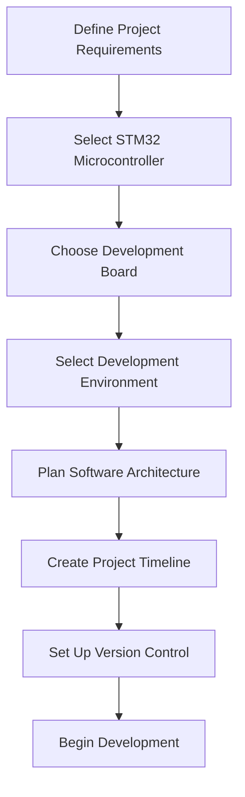
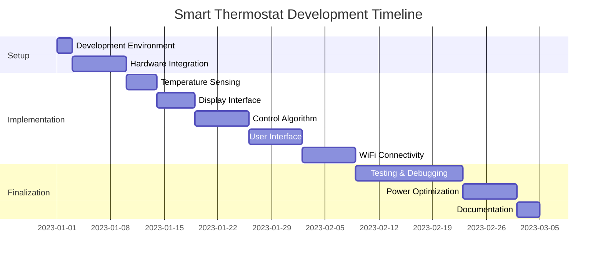
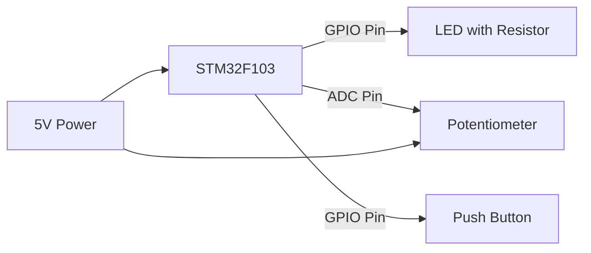

# STM32 Project Planning

## Introduction

Planning an STM32 microcontroller project is a critical first step that often determines the success of your embedded system development. STM32 microcontrollers, based on ARM Cortex-M cores, offer powerful capabilities for a wide range of applications, from simple LED blinking to complex industrial control systems. This guide will walk you through the essential steps of planning an STM32 project, from defining requirements to selecting hardware and software tools, and establishing a development workflow.

## Why Project Planning Matters

Proper planning helps you:

- Avoid costly hardware changes later in development
- Select the appropriate STM32 microcontroller for your needs
- Identify potential challenges before writing code
- Create realistic timelines and development milestones
- Ensure all required components and tools are available

## Project Planning Process

Let's break down the STM32 project planning process into manageable steps:



### 1. Define Project Requirements

Start by clearly defining what your project needs to accomplish:

- **Functionality**: What should your device do?
- **Inputs/Outputs**: What sensors, displays, or other peripherals will you need?
- **Performance**: What processing speed and memory requirements exist?
- **Power consumption**: Will it run on battery? How long should it last?
- **Size constraints**: Does it need to fit in a specific enclosure?
- **Environmental conditions**: Temperature range, humidity, vibration tolerance?
- **Connectivity**: WiFi, Bluetooth, Ethernet, CAN, USB, or other protocols?
- **Real-time requirements**: Does your application have strict timing constraints?

**Example Requirements Document:**

```
Project: Smart Thermostat Controller
Primary Requirements:
- Measure temperature with ±0.5°C accuracy
- Control HVAC relay based on programmable temperature thresholds
- Display current temperature and setpoint on LCD
- Allow user input via capacitive touch buttons
- Store settings in non-volatile memory
- Connect to home WiFi network for remote control
- Run on 3.3V power supply with battery backup
- Fit within 100mm x 80mm x 30mm enclosure
```

### 2. Select the Appropriate STM32 Microcontroller

Based on your requirements, choose an STM32 microcontroller that meets your needs:

| STM32 Family | Core Type | Features | Typical Applications |
|--------------|-----------|----------|----------------------|
| STM32F0 | Cortex-M0 | Low-cost, basic | Simple control, consumer products |
| STM32F1 | Cortex-M3 | General purpose | Motor control, appliances |
| STM32F2 | Cortex-M3 | High performance | Industrial control |
| STM32F3 | Cortex-M4 | Mixed signal, DSP | Sensor hubs, audio |
| STM32F4 | Cortex-M4 | High performance | Graphics, audio, motor control |
| STM32F7 | Cortex-M7 | Very high performance | HMI, real-time processing |
| STM32G0 | Cortex-M0+ | Ultra-low power | Battery applications |
| STM32G4 | Cortex-M4 | Mixed-signal, math | Motor control, digital power |
| STM32H7 | Cortex-M7 | Highest performance | Complex real-time systems |
| STM32L0 | Cortex-M0+ | Ultra-low power | IoT, wearables |
| STM32L4/L5 | Cortex-M4/M33 | Ultra-low power | IoT edge devices, sensors |
| STM32U5 | Cortex-M33 | Ultra-low power, security | IoT, secure applications |
| STM32WB | Cortex-M4+M0+ | Wireless | Bluetooth, Thread, Zigbee |
| STM32WL | Cortex-M4 | Wireless | LoRa, Sigfox, Sub-GHz |

**Selection Process:**

1. Determine required peripherals (UART, SPI, I2C, ADC, etc.)
2. Calculate minimum RAM and flash memory needed
3. Identify clock speed requirements
4. Consider power consumption targets
5. Check package options and pin count needs
6. Verify availability and pricing

**Example Selection:**

For our smart thermostat example, we might select an STM32L4 microcontroller due to:
- Low power consumption for battery operation
- Sufficient GPIO for LCD and buttons
- ADC for temperature sensor readings
- Connectivity options for WiFi module
- Cost-effective for a consumer product

### 3. Choose a Development Board

For initial development, choose between:

- **Discovery boards**: Feature-rich boards with on-board debugger, sensors, and LEDs
- **Nucleo boards**: Arduino-compatible form factor with on-board ST-LINK debugger
- **Evaluation boards**: More comprehensive boards for specific STM32 families
- **Custom boards**: Design your own PCB for final product integration

**Factors to consider:**

- Available peripherals and their accessibility
- Debug capabilities
- Form factor and mounting options
- Power supply options
- Cost vs. functionality

**Example:**

```
Selected Board: NUCLEO-L476RG
Reasoning:
- STM32L4 series meets low-power requirements
- On-board ST-LINK/V2-1 debugger/programmer
- Arduino-compatible headers for easy prototyping
- Affordable price point ($15-20)
- Multiple expansion board options
```

### 4. Select Development Environment

Choose the tools you'll use to develop your project:

#### IDE Options:

- **STM32CubeIDE**: Free integrated development environment based on Eclipse
- **Keil MDK**: Professional IDE with comprehensive debugging features
- **IAR Embedded Workbench**: Professional IDE with code optimization focus
- **Platform IO**: VS Code extension for embedded development
- **Mbed OS**: Online and offline development environment

#### Configuration Tools:

- **STM32CubeMX**: Graphical tool for configuring STM32 microcontrollers
- **STM32CubeProgrammer**: For programming and verifying firmware

**Example Environment Setup:**

```
Development Environment: STM32CubeIDE
Configuration: STM32CubeMX
Reason: Free, integrated solution with good debugging capabilities and HAL library support
```

### 5. Plan Software Architecture

Decide on your approach to writing firmware:

- **HAL (Hardware Abstraction Layer)**: Easier to use but more overhead
- **LL (Low Layer)**: More efficient but requires deeper hardware knowledge
- **Direct register manipulation**: Maximum efficiency but least portable

Also consider:

- Using an RTOS (FreeRTOS, Azure RTOS, etc.) or bare-metal approach
- Software modularity and component reuse
- Error handling strategy
- Testing methodology

**Example Software Architecture Plan:**

```c
// Project Structure for Smart Thermostat
/include
  /drivers            // Hardware-specific code
    temp_sensor.h     // Temperature sensor interface
    display.h         // LCD display driver
    wifi_module.h     // WiFi communication
  /middleware
    temp_control.h    // Temperature control algorithm
    user_interface.h  // User input handling
    settings.h        // Configuration storage
  /app
    main.h            // Application entry point
    app_config.h      // Project-wide configurations

/src
  // Implementation files for each module
```

### 6. Create a Project Timeline

Establish realistic milestones and deadlines:

1. **Development Setup**: Configure tools and environment (1-2 days)
2. **Hardware Integration**: Connect and test peripherals (1 week)
3. **Core Functionality**: Implement main features (2-3 weeks)
4. **Testing & Debugging**: Verify functionality (1-2 weeks)
5. **Optimization**: Improve performance and power usage (1 week)
6. **Documentation**: Create technical documentation (2-3 days)

**Example Timeline Gantt Chart:**



### 7. Set Up Version Control

Establish a source code management system:

- Create a Git repository (GitHub, GitLab, Bitbucket, etc.)
- Define branching strategy (e.g., main, development, feature branches)
- Set up .gitignore file for STM32 projects
- Configure backup procedures

**Example .gitignore for STM32 Projects:**

```
# Object files
*.o
*.ko
*.obj
*.elf

# Precompiled Headers
*.gch
*.pch

# Libraries
*.lib
*.a
*.la
*.lo

# Shared objects
*.so
*.so.*

# Executables
*.exe
*.out
*.app
*.i*86
*.x86_64
*.hex
*.bin

# Debug files
*.dSYM/
*.su

# STM32CubeIDE specific
.settings/
Debug/
Release/
.metadata/
RemoteSystemsTempFiles/
```

## Practical Example: LED Blinking Project Planning

Let's walk through a simple example to demonstrate the planning process:

### Project Requirements:

- Blink an LED at 1Hz frequency
- Adjust blink rate via potentiometer
- Toggle between two modes using a button
- Run on standard development board

### Microcontroller Selection:

- STM32F103C8 (Blue Pill) - inexpensive and widely available
- 72MHz Cortex-M3 core
- 20KB RAM, 64KB Flash
- Sufficient GPIO, one ADC channel needed

### Development Environment:

- STM32CubeIDE for coding and debugging
- STM32CubeMX for pin configuration

### Software Structure:

```c
// main.c - pseudocode structure
void main() {
    // Initialize system
    SystemClock_Config();
    InitGPIO();
    InitADC();
    
    while (1) {
        // Read mode button
        current_mode = ReadButtonState();
        
        // Read potentiometer
        blink_rate = ReadPotValue();
        
        // Apply mode logic
        if (current_mode == MODE_1) {
            // Mode 1 blinking pattern
            ToggleLED();
        } else {
            // Mode 2 blinking pattern
            BlinkLEDWithPattern();
        }
        
        // Delay based on potentiometer value
        Delay(CalculateDelay(blink_rate));
    }
}
```

### Hardware Setup Diagram:



### Implementation Plan:

1. Configure GPIO pins for LED and button
2. Set up ADC for potentiometer reading
3. Implement button debouncing
4. Create LED control functions
5. Integrate all components in main loop

## Hardware Components Selection

Once you've selected your microcontroller, you'll need to consider other hardware components:

### Power Supply

- Voltage regulators (linear or switching)
- Battery management (if applicable)
- Power filtering capacitors

### Input Devices

- Buttons, switches, keypads
- Sensors (temperature, pressure, light, etc.)
- Communication interfaces (UART, I2C, SPI)

### Output Devices

- LEDs and indicators
- Display options (LCD, OLED, TFT)
- Actuators (motors, relays, solenoids)

### Peripheral Components

- Oscillators/crystals for precise timing
- External memory (EEPROM, Flash)
- Real-time clock modules

**Example BOM (Bill of Materials):**

| Component | Description | Quantity | Purpose |
|-----------|-------------|----------|---------|
| STM32L476RG | Microcontroller | 1 | Main processor |
| DHT22 | Temperature/humidity sensor | 1 | Environmental sensing |
| SSD1306 | OLED display | 1 | User interface |
| TTP223 | Capacitive touch sensor | 4 | User input |
| ESP8266 | WiFi module | 1 | Network connectivity |
| LM1117-3.3 | Voltage regulator | 1 | Power supply |
| CR2032 | Battery | 1 | Backup power |

## Software Design Patterns for STM32

Consider these common patterns when planning your software architecture:

### State Machine

Ideal for systems with defined operational modes:

```c
typedef enum {
    STATE_IDLE,
    STATE_RUNNING,
    STATE_ERROR,
    STATE_SLEEP
} SystemState;

SystemState currentState = STATE_IDLE;

void main() {
    // Initialize system
    SystemInit();
    
    while (1) {
        switch (currentState) {
            case STATE_IDLE:
                // Handle idle state
                HandleIdleState();
                break;
                
            case STATE_RUNNING:
                // Handle running state
                HandleRunningState();
                break;
                
            case STATE_ERROR:
                // Handle error state
                HandleErrorState();
                break;
                
            case STATE_SLEEP:
                // Handle sleep state
                HandleSleepState();
                break;
        }
    }
}
```

### Interrupt-Based Architecture

For responsive systems that need to handle asynchronous events:

```c
// Configure interrupts in initialization
void InitSystem() {
    // Configure button interrupt
    HAL_GPIO_Init(BUTTON_GPIO_Port, &GPIO_InitStruct);
    HAL_NVIC_SetPriority(BUTTON_EXTI_IRQn, 0, 0);
    HAL_NVIC_EnableIRQ(BUTTON_EXTI_IRQn);
    
    // Configure timer interrupt
    HAL_TIM_Base_Start_IT(&htim2);
}

// Button interrupt handler
void HAL_GPIO_EXTI_Callback(uint16_t GPIO_Pin) {
    if (GPIO_Pin == BUTTON_Pin) {
        // Handle button press
        ToggleOperatingMode();
    }
}

// Timer interrupt handler
void HAL_TIM_PeriodElapsedCallback(TIM_HandleTypeDef *htim) {
    if (htim->Instance == TIM2) {
        // Handle timer event
        UpdateSystem();
    }
}
```

### Event Queue

For systems that need to handle multiple events without interrupt conflicts:

```c
typedef struct {
    EventType type;
    uint32_t data;
} SystemEvent;

#define MAX_EVENTS 10
SystemEvent eventQueue[MAX_EVENTS];
volatile uint8_t queueHead = 0;
volatile uint8_t queueTail = 0;

// Add event to queue (can be called from interrupt)
void QueueEvent(EventType type, uint32_t data) {
    uint8_t nextTail = (queueTail + 1) % MAX_EVENTS;
    
    if (nextTail != queueHead) {  // Not full
        eventQueue[queueTail].type = type;
        eventQueue[queueTail].data = data;
        queueTail = nextTail;
    }
}

// Process events in main loop
void ProcessEvents() {
    while (queueHead != queueTail) {
        SystemEvent event = eventQueue[queueHead];
        queueHead = (queueHead + 1) % MAX_EVENTS;
        
        // Handle event based on type
        HandleEvent(event);
    }
}
```

## Debugging Strategies

Plan your debugging approach:

1. **Serial Debug Output**: Configure UART for debug messages
2. **Logic Analyzer**: Plan test points for external signal monitoring
3. **LED Status Indicators**: Define LED patterns for different states
4. **Debugger Usage**: Set up SWD interface for step-through debugging
5. **Fault Handlers**: Implement handlers for hard faults and errors

**Example Debug UART Function:**

```c
// Configure UART for debugging
void InitDebugUART() {
    // UART configuration (115200 baud, 8N1)
    huart2.Instance = USART2;
    huart2.Init.BaudRate = 115200;
    huart2.Init.WordLength = UART_WORDLENGTH_8B;
    huart2.Init.StopBits = UART_STOPBITS_1;
    huart2.Init.Parity = UART_PARITY_NONE;
    huart2.Init.Mode = UART_MODE_TX;
    HAL_UART_Init(&huart2);
}

// Send debug message
void DebugPrint(const char* message) {
    HAL_UART_Transmit(&huart2, (uint8_t*)message, strlen(message), 100);
}
```

## Summary

Effective STM32 project planning involves:

1. **Define clear requirements** for your project's functionality
2. **Select appropriate hardware** including the STM32 microcontroller and peripherals
3. **Choose development tools** that match your experience and project needs
4. **Plan your software architecture** with modularity and maintainability in mind
5. **Create a realistic timeline** with defined milestones
6. **Set up version control** to track changes and collaborate
7. **Plan for debugging** to address issues efficiently

Taking time for proper planning will save you countless hours of troubleshooting and rework later in the development process. It will also help ensure that your final product meets all requirements and functions reliably.

## Additional Resources

To continue learning about STM32 development:

- **Documentation**: STMicroelectronics reference manuals and datasheets
- **Training**: STM32 online courses and workshops
- **Communities**: STM32 forums and user groups
- **Example Projects**: Study open-source STM32 projects related to your application

## Exercises

1. Create a requirements document for an STM32-based weather station that measures temperature, humidity, and pressure.
2. Research and select an appropriate STM32 microcontroller for a battery-powered fitness tracker.
3. Design a software architecture diagram for an STM32 project that controls a small robot.
4. Create a project timeline for developing an STM32-based digital thermometer with LCD display.
5. Set up an STM32 development environment and create a simple LED blinking project following the planning principles discussed.