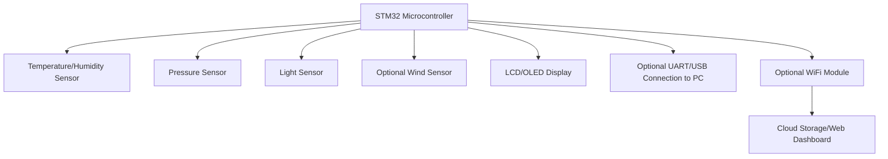
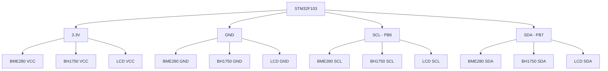

# STM32 Weather Station

## Introduction

Welcome to this comprehensive guide on creating your own weather station using the STM32 microcontroller! Weather stations are fascinating projects that combine hardware interfacing, sensor data collection, and real-time processing - making them perfect for learning embedded systems development.

In this tutorial, we'll build a complete weather station that measures:
- Temperature
- Humidity 
- Atmospheric pressure
- Light intensity
- Wind speed (optional)

By the end of this guide, you'll have a fully functional weather station that displays readings on an LCD screen and can optionally send data to your computer or cloud services for logging and analysis.

## Prerequisites

Before starting this project, you should be familiar with:
- Basic C programming concepts
- STM32CubeIDE or similar development environment
- Basic electronics and circuit connections
- Fundamental concepts of I2C and SPI communication protocols

## Hardware Components

Here's what you'll need for this project:

1. **Microcontroller**: STM32F103C8T6 (Blue Pill) or STM32F411RE (Nucleo Board)
2. **Sensors**:
   - BME280 or DHT22 for temperature and humidity
   - BMP180 for atmospheric pressure
   - BH1750 for light intensity
   - Optional: Anemometer for wind speed
3. **Display**: 16x2 LCD with I2C adapter or SSD1306 OLED display
4. **Miscellaneous**:
   - Breadboard and jumper wires
   - Power supply (USB or battery)
   - Enclosure (optional for outdoor use)

## Project Architecture

Let's first understand the overall architecture of our weather station:



The STM32 microcontroller acts as the brain of our weather station, reading data from various sensors through I2C or SPI interfaces, processing that data, and then displaying it on an LCD or OLED screen. Optionally, we can add connectivity features to transmit data to a computer or cloud service.

## Setting Up the Development Environment

First, let's set up our development environment:

1. Install STM32CubeIDE (or your preferred STM32 development environment)
2. Create a new project for your specific STM32 board
3. Configure the necessary peripherals (I2C, SPI, UART, GPIO)

Here's a basic configuration for the STM32F103C8T6 (Blue Pill):

```c
// Clock and peripheral initialization
void SystemClock_Config(void)
{
  RCC_OscInitTypeDef RCC_OscInitStruct = {0};
  RCC_ClkInitTypeDef RCC_ClkInitStruct = {0};

  // Configure the main internal regulator output voltage
  RCC_OscInitStruct.OscillatorType = RCC_OSCILLATORTYPE_HSE;
  RCC_OscInitStruct.HSEState = RCC_HSE_ON;
  RCC_OscInitStruct.HSEPredivValue = RCC_HSE_PREDIV_DIV1;
  RCC_OscInitStruct.PLL.PLLState = RCC_PLL_ON;
  RCC_OscInitStruct.PLL.PLLSource = RCC_PLLSOURCE_HSE;
  RCC_OscInitStruct.PLL.PLLMUL = RCC_PLL_MUL9;
  HAL_RCC_OscConfig(&RCC_OscInitStruct);

  // Initialize the CPU, AHB and APB buses clocks
  RCC_ClkInitStruct.ClockType = RCC_CLOCKTYPE_HCLK|RCC_CLOCKTYPE_SYSCLK
                              |RCC_CLOCKTYPE_PCLK1|RCC_CLOCKTYPE_PCLK2;
  RCC_ClkInitStruct.SYSCLKSource = RCC_SYSCLKSOURCE_PLLCLK;
  RCC_ClkInitStruct.AHBCLKDivider = RCC_SYSCLK_DIV1;
  RCC_ClkInitStruct.APB1CLKDivider = RCC_HCLK_DIV2;
  RCC_ClkInitStruct.APB2CLKDivider = RCC_HCLK_DIV1;
  HAL_RCC_ClockConfig(&RCC_ClkInitStruct, FLASH_LATENCY_2);
}

// I2C initialization for sensors
void I2C_Init(void)
{
  hi2c1.Instance = I2C1;
  hi2c1.Init.ClockSpeed = 100000;
  hi2c1.Init.DutyCycle = I2C_DUTYCYCLE_2;
  hi2c1.Init.OwnAddress1 = 0;
  hi2c1.Init.AddressingMode = I2C_ADDRESSINGMODE_7BIT;
  hi2c1.Init.DualAddressMode = I2C_DUALADDRESS_DISABLE;
  hi2c1.Init.GeneralCallMode = I2C_GENERALCALL_DISABLE;
  hi2c1.Init.NoStretchMode = I2C_NOSTRETCH_DISABLE;
  HAL_I2C_Init(&hi2c1);
}
```

## Connecting the Sensors

### 1. BME280 Temperature/Humidity/Pressure Sensor

The BME280 is a versatile sensor that can measure temperature, humidity, and pressure. It communicates using I2C or SPI protocol. We'll use I2C for simplicity:

```c
// BME280 I2C address
#define BME280_ADDRESS 0x76

// BME280 registers
#define BME280_REG_ID 0xD0
#define BME280_REG_CTRL_HUM 0xF2
#define BME280_REG_CTRL_MEAS 0xF4
#define BME280_REG_CONFIG 0xF5
#define BME280_REG_PRESS_MSB 0xF7
#define BME280_REG_PRESS_LSB 0xF8
#define BME280_REG_PRESS_XLSB 0xF9
#define BME280_REG_TEMP_MSB 0xFA
#define BME280_REG_TEMP_LSB 0xFB
#define BME280_REG_TEMP_XLSB 0xFC
#define BME280_REG_HUM_MSB 0xFD
#define BME280_REG_HUM_LSB 0xFE

// BME280 compensation parameters
int32_t t_fine;
uint16_t dig_T1, dig_P1, dig_H1, dig_H3;
int16_t dig_T2, dig_T3, dig_P2, dig_P3, dig_P4, dig_P5, dig_P6, dig_P7, dig_P8, dig_P9, dig_H2, dig_H4, dig_H5, dig_H6;

// Initialize BME280
uint8_t BME280_Init(void)
{
  uint8_t chip_id = 0;
  HAL_I2C_Mem_Read(&hi2c1, BME280_ADDRESS<<1, BME280_REG_ID, I2C_MEMADD_SIZE_8BIT, &chip_id, 1, HAL_MAX_DELAY);
  
  if (chip_id != 0x60) // BME280 chip ID
    return 0;
    
  // Read compensation parameters
  // ... (code to read calibration data)
  
  // Configure the sensor (oversampling, mode)
  uint8_t config = 0;
  config = (0x01 << 5) | (0x01 << 2) | 0x00; // t_sb = 0.5ms, filter = 2, spi3w_en = 0
  HAL_I2C_Mem_Write(&hi2c1, BME280_ADDRESS<<1, BME280_REG_CONFIG, I2C_MEMADD_SIZE_8BIT, &config, 1, HAL_MAX_DELAY);
  
  // Set humidity oversampling
  config = 0x01; // Humidity oversampling x1
  HAL_I2C_Mem_Write(&hi2c1, BME280_ADDRESS<<1, BME280_REG_CTRL_HUM, I2C_MEMADD_SIZE_8BIT, &config, 1, HAL_MAX_DELAY);
  
  // Set temperature and pressure oversampling and mode
  config = (0x01 << 5) | (0x01 << 2) | 0x03; // temp x1, press x1, normal mode
  HAL_I2C_Mem_Write(&hi2c1, BME280_ADDRESS<<1, BME280_REG_CTRL_MEAS, I2C_MEMADD_SIZE_8BIT, &config, 1, HAL_MAX_DELAY);
  
  return 1;
}

// Read temperature from BME280
float BME280_ReadTemperature(void)
{
  uint8_t data[3];
  HAL_I2C_Mem_Read(&hi2c1, BME280_ADDRESS<<1, BME280_REG_TEMP_MSB, I2C_MEMADD_SIZE_8BIT, data, 3, HAL_MAX_DELAY);
  
  int32_t adc_T = ((uint32_t)data[0] << 12) | ((uint32_t)data[1] << 4) | ((data[2] >> 4) & 0x0F);
  
  // Temperature compensation formula (from BME280 datasheet)
  int32_t var1, var2, T;
  var1 = ((((adc_T>>3) - ((int32_t)dig_T1<<1))) * ((int32_t)dig_T2)) >> 11;
  var2 = (((((adc_T>>4) - ((int32_t)dig_T1)) * ((adc_T>>4) - ((int32_t)dig_T1))) >> 12) * ((int32_t)dig_T3)) >> 14;
  t_fine = var1 + var2;
  T = (t_fine * 5 + 128) >> 8;
  
  return (float)T / 100.0f;
}

// Read humidity from BME280
float BME280_ReadHumidity(void)
{
  uint8_t data[2];
  HAL_I2C_Mem_Read(&hi2c1, BME280_ADDRESS<<1, BME280_REG_HUM_MSB, I2C_MEMADD_SIZE_8BIT, data, 2, HAL_MAX_DELAY);
  
  int32_t adc_H = ((uint32_t)data[0] << 8) | (uint32_t)data[1];
  
  // Humidity compensation formula (from BME280 datasheet)
  int32_t v_x1_u32r;
  v_x1_u32r = (t_fine - ((int32_t)76800));
  v_x1_u32r = (((((adc_H << 14) - (((int32_t)dig_H4) << 20) - (((int32_t)dig_H5) * v_x1_u32r)) + 
              ((int32_t)16384)) >> 15) * (((((((v_x1_u32r * ((int32_t)dig_H6)) >> 10) * 
              (((v_x1_u32r * ((int32_t)dig_H3)) >> 11) + ((int32_t)32768))) >> 10) + 
              ((int32_t)2097152)) * ((int32_t)dig_H2) + 8192) >> 14));
  v_x1_u32r = (v_x1_u32r - (((((v_x1_u32r >> 15) * (v_x1_u32r >> 15)) >> 7) * ((int32_t)dig_H1)) >> 4));
  v_x1_u32r = (v_x1_u32r < 0 ? 0 : v_x1_u32r);
  v_x1_u32r = (v_x1_u32r > 419430400 ? 419430400 : v_x1_u32r);
  
  return (float)(v_x1_u32r >> 12) / 1024.0f;
}

// Read pressure from BME280
float BME280_ReadPressure(void)
{
  uint8_t data[3];
  HAL_I2C_Mem_Read(&hi2c1, BME280_ADDRESS<<1, BME280_REG_PRESS_MSB, I2C_MEMADD_SIZE_8BIT, data, 3, HAL_MAX_DELAY);
  
  int32_t adc_P = ((uint32_t)data[0] << 12) | ((uint32_t)data[1] << 4) | ((data[2] >> 4) & 0x0F);
  
  // Pressure compensation formula (from BME280 datasheet)
  int64_t var1, var2, p;
  var1 = ((int64_t)t_fine) - 128000;
  var2 = var1 * var1 * (int64_t)dig_P6;
  var2 = var2 + ((var1 * (int64_t)dig_P5) << 17);
  var2 = var2 + (((int64_t)dig_P4) << 35);
  var1 = ((var1 * var1 * (int64_t)dig_P3) >> 8) + ((var1 * (int64_t)dig_P2) << 12);
  var1 = (((((int64_t)1) << 47) + var1)) * ((int64_t)dig_P1) >> 33;
  
  if (var1 == 0) {
    return 0; // Avoid division by zero
  }
  
  p = 1048576 - adc_P;
  p = (((p << 31) - var2) * 3125) / var1;
  var1 = (((int64_t)dig_P9) * (p >> 13) * (p >> 13)) >> 25;
  var2 = (((int64_t)dig_P8) * p) >> 19;
  p = ((p + var1 + var2) >> 8) + (((int64_t)dig_P7) << 4);
  
  return (float)p / 256.0f;
}
```

### 2. BH1750 Light Intensity Sensor

The BH1750 is a digital ambient light sensor that also communicates over I2C:

```c
// BH1750 I2C address
#define BH1750_ADDRESS 0x23

// BH1750 commands
#define BH1750_POWER_DOWN 0x00
#define BH1750_POWER_ON 0x01
#define BH1750_RESET 0x07
#define BH1750_CONTINUOUS_H_MODE 0x10
#define BH1750_CONTINUOUS_H_MODE_2 0x11
#define BH1750_CONTINUOUS_L_MODE 0x13
#define BH1750_ONE_TIME_H_MODE 0x20
#define BH1750_ONE_TIME_H_MODE_2 0x21
#define BH1750_ONE_TIME_L_MODE 0x23

// Initialize BH1750
void BH1750_Init(void)
{
  uint8_t command = BH1750_POWER_ON;
  HAL_I2C_Master_Transmit(&hi2c1, BH1750_ADDRESS<<1, &command, 1, HAL_MAX_DELAY);
  
  command = BH1750_CONTINUOUS_H_MODE;
  HAL_I2C_Master_Transmit(&hi2c1, BH1750_ADDRESS<<1, &command, 1, HAL_MAX_DELAY);
  
  HAL_Delay(180); // Wait for the sensor to stabilize
}

// Read light intensity from BH1750
float BH1750_ReadLightIntensity(void)
{
  uint8_t data[2];
  HAL_I2C_Master_Receive(&hi2c1, BH1750_ADDRESS<<1, data, 2, HAL_MAX_DELAY);
  
  uint16_t level = (data[0] << 8) | data[1];
  float lux = (float)level / 1.2f; // Convert to lux units
  
  return lux;
}
```

## Setting Up the Display

For our weather station display, we'll use a common 16x2 LCD with an I2C adapter, which makes wiring much simpler:

```c
// LCD I2C address
#define LCD_ADDRESS 0x27

// LCD commands
#define LCD_CLEARDISPLAY 0x01
#define LCD_RETURNHOME 0x02
#define LCD_ENTRYMODESET 0x04
#define LCD_DISPLAYCONTROL 0x08
#define LCD_CURSORSHIFT 0x10
#define LCD_FUNCTIONSET 0x20
#define LCD_SETCGRAMADDR 0x40
#define LCD_SETDDRAMADDR 0x80

// LCD flags
#define LCD_BACKLIGHT 0x08
#define LCD_ENABLE 0x04
#define LCD_COMMAND 0x00
#define LCD_DATA 0x01

// Send a command to the LCD
void LCD_SendCommand(uint8_t command)
{
  uint8_t data_u, data_l;
  uint8_t data_t[4];
  data_u = (command & 0xF0);
  data_l = ((command << 4) & 0xF0);
  data_t[0] = data_u | LCD_BACKLIGHT | LCD_ENABLE;
  data_t[1] = data_u | LCD_BACKLIGHT;
  data_t[2] = data_l | LCD_BACKLIGHT | LCD_ENABLE;
  data_t[3] = data_l | LCD_BACKLIGHT;
  HAL_I2C_Master_Transmit(&hi2c1, LCD_ADDRESS<<1, data_t, 4, HAL_MAX_DELAY);
}

// Send data to the LCD
void LCD_SendData(uint8_t data)
{
  uint8_t data_u, data_l;
  uint8_t data_t[4];
  data_u = (data & 0xF0);
  data_l = ((data << 4) & 0xF0);
  data_t[0] = data_u | LCD_BACKLIGHT | LCD_DATA | LCD_ENABLE;
  data_t[1] = data_u | LCD_BACKLIGHT | LCD_DATA;
  data_t[2] = data_l | LCD_BACKLIGHT | LCD_DATA | LCD_ENABLE;
  data_t[3] = data_l | LCD_BACKLIGHT | LCD_DATA;
  HAL_I2C_Master_Transmit(&hi2c1, LCD_ADDRESS<<1, data_t, 4, HAL_MAX_DELAY);
}

// Initialize the LCD
void LCD_Init(void)
{
  HAL_Delay(50);  // Wait for LCD to power up
  
  // Initialize in 4-bit mode
  LCD_SendCommand(0x33);
  HAL_Delay(5);
  LCD_SendCommand(0x32);
  HAL_Delay(5);
  
  // Configure LCD
  LCD_SendCommand(LCD_FUNCTIONSET | 0x08); // 4-bit mode, 2 lines, 5x8 font
  LCD_SendCommand(LCD_DISPLAYCONTROL | 0x04); // Display on, cursor off, blink off
  LCD_SendCommand(LCD_CLEARDISPLAY); // Clear display
  HAL_Delay(2);
  LCD_SendCommand(LCD_ENTRYMODESET | 0x02); // Increment cursor position, no display shift
}

// Clear the LCD display
void LCD_Clear(void)
{
  LCD_SendCommand(LCD_CLEARDISPLAY);
  HAL_Delay(2);
}

// Set the cursor position
void LCD_SetCursor(uint8_t row, uint8_t col)
{
  uint8_t row_offsets[] = {0x00, 0x40};
  LCD_SendCommand(LCD_SETDDRAMADDR | (col + row_offsets[row]));
}

// Write a string to the LCD
void LCD_WriteString(char *str)
{
  while (*str) {
    LCD_SendData(*str++);
  }
}
```

## Putting It All Together

Now, let's combine all these components into a unified weather station program:

```c
#include "main.h"
#include <stdio.h>
#include <string.h>

I2C_HandleTypeDef hi2c1;

// Function prototypes
void SystemClock_Config(void);
static void MX_GPIO_Init(void);
static void MX_I2C1_Init(void);

// Main program
int main(void)
{
  // Initialize the system
  HAL_Init();
  SystemClock_Config();
  MX_GPIO_Init();
  MX_I2C1_Init();
  
  // Initialize components
  LCD_Init();
  uint8_t bme280_status = BME280_Init();
  BH1750_Init();
  
  // Variables for sensor readings
  float temperature, humidity, pressure, light;
  char lcd_buffer[17]; // Buffer for LCD display (16 chars + null terminator)
  
  // Check if BME280 initialization succeeded
  if (!bme280_status) {
    LCD_Clear();
    LCD_SetCursor(0, 0);
    LCD_WriteString("BME280 Error!");
    LCD_SetCursor(1, 0);
    LCD_WriteString("Check wiring...");
    while(1); // Halt execution
  }
  
  while (1)
  {
    // Read sensor data
    temperature = BME280_ReadTemperature();
    humidity = BME280_ReadHumidity();
    pressure = BME280_ReadPressure() / 100.0f; // Convert to hPa
    light = BH1750_ReadLightIntensity();
    
    // Display temperature and humidity
    LCD_Clear();
    LCD_SetCursor(0, 0);
    sprintf(lcd_buffer, "Temp: %.1fC", temperature);
    LCD_WriteString(lcd_buffer);
    
    LCD_SetCursor(1, 0);
    sprintf(lcd_buffer, "Hum: %.1f%%", humidity);
    LCD_WriteString(lcd_buffer);
    
    HAL_Delay(2000); // Wait 2 seconds
    
    // Display pressure and light
    LCD_Clear();
    LCD_SetCursor(0, 0);
    sprintf(lcd_buffer, "Pres: %.1fhPa", pressure);
    LCD_WriteString(lcd_buffer);
    
    LCD_SetCursor(1, 0);
    sprintf(lcd_buffer, "Light: %.1flux", light);
    LCD_WriteString(lcd_buffer);
    
    HAL_Delay(2000); // Wait 2 seconds
  }
}
```

## Circuit Diagram

Here's how to connect all the components together:



## Extending the Weather Station

### Adding Data Logging Capability

We can add a microSD card to log weather data over time:

```c
// SD card SPI interface
SPI_HandleTypeDef hspi1;
FATFS fs;
FIL weather_log;

// Initialize SD card
uint8_t SD_Init(void)
{
  if (f_mount(&fs, "", 0) != FR_OK)
    return 0;
  return 1;
}

// Log data to SD card
void LogWeatherData(float temp, float humidity, float pressure, float light)
{
  char buffer[100];
  UINT bytes_written;
  
  // Get current time (if RTC is available)
  // RTC_TimeTypeDef time;
  // RTC_DateTypeDef date;
  // HAL_RTC_GetTime(&hrtc, &time, RTC_FORMAT_BIN);
  // HAL_RTC_GetDate(&hrtc, &date, RTC_FORMAT_BIN);
  
  // Create log entry
  sprintf(buffer, "%lu,%.2f,%.2f,%.2f,%.2f\r
", 
          HAL_GetTick(), temp, humidity, pressure, light);
  
  // Open file for appending
  if (f_open(&weather_log, "WEATHER.CSV", FA_OPEN_ALWAYS | FA_WRITE) == FR_OK) {
    // Move to end of file
    f_lseek(&weather_log, f_size(&weather_log));
    
    // Write data
    f_write(&weather_log, buffer, strlen(buffer), &bytes_written);
    
    // Close file
    f_close(&weather_log);
  }
}
```

### Adding WiFi Connectivity

For more advanced users, we can add an ESP8266 WiFi module to upload data to cloud services:

```c
// ESP8266 AT commands
#define ESP8266_OK "OK\r
"
#define ESP8266_CONNECT "AT+CWJAP=\"SSID\",\"PASSWORD\"\r
"
#define ESP8266_TCP_CONNECT "AT+CIPSTART=\"TCP\",\"api.example.com\",80\r
"
#define ESP8266_SEND "AT+CIPSEND="

UART_HandleTypeDef huart2; // UART for ESP8266 communication

// Initialize ESP8266
uint8_t ESP8266_Init(void)
{
  char response[100];
  
  // Reset module
  HAL_UART_Transmit(&huart2, (uint8_t*)"AT+RST\r
", 8, 1000);
  HAL_Delay(2000);
  
  // Connect to WiFi
  HAL_UART_Transmit(&huart2, (uint8_t*)ESP8266_CONNECT, strlen(ESP8266_CONNECT), 1000);
  HAL_Delay(5000);
  
  // Check if connected
  HAL_UART_Transmit(&huart2, (uint8_t*)"AT+CWJAP?\r
", 11, 1000);
  HAL_UART_Receive(&huart2, (uint8_t*)response, 100, 1000);
  
  if (strstr(response, "+CWJAP:") != NULL)
    return 1;
  else
    return 0;
}

// Send weather data to cloud
void SendDataToCloud(float temp, float humidity, float pressure, float light)
{
  char data[200];
  char length[10];
  
  // Prepare HTTP request
  sprintf(data, "GET /api/weather?temp=%.2f&humidity=%.2f&pressure=%.2f&light=%.2f HTTP/1.1\r
Host: api.example.com\r
\r
", 
          temp, humidity, pressure, light);
  
  sprintf(length, "%d\r
", strlen(data));
  
  // Connect to server
  HAL_UART_Transmit(&huart2, (uint8_t*)ESP8266_TCP_CONNECT, strlen(ESP8266_TCP_CONNECT), 1000);
  HAL_Delay(1000);
  
  // Send data length
  HAL_UART_Transmit(&huart2, (uint8_t*)ESP8266_SEND, strlen(ESP8266_SEND), 1000);
  HAL_UART_Transmit(&huart2, (uint8_t*)length, strlen(length), 1000);
  HAL_Delay(100);
  
  // Send data
  HAL_UART_Transmit(&huart2, (uint8_t*)data, strlen(data), 1000);
  HAL_Delay(1000);
}
```

## Enclosure Design

For a complete weather station, consider designing an appropriate enclosure:

1. Use waterproof material for outdoor use
2. Include ventilation holes for accurate temperature readings
3. Position light sensor where it won't be shadowed
4. Consider a clear acrylic cover for the display
5. Mount at a suitable height away from heat sources

## Troubleshooting Common Issues

1. **Sensors not responding:**
   - Check I2C addresses (some sensors allow address selection)
   - Verify power connections (3.3V vs 5V requirements)
   - Check pull-up resistors on I2C lines

2. **Inaccurate readings:**
   - Ensure sensor is not affected by heat from other components
   - For outdoor use, shield from direct sunlight for temperature readings
   - Calibrate sensors against known references

3. **Display issues:**
   - Adjust contrast potentiometer on LCD
   - Verify I2C address (common addresses: 0x27, 0x3F)
   - Check initialization sequence

4. **Power issues:**
   - Use adequate power supply (battery or adapter)
   - Add capacitors near sensors for stable power
   - Implement low-power modes for battery operation

## Sample Output

When properly assembled and programmed, your weather station will cycle through displays showing:

- Temperature: 23.5°C
- Humidity: 45.2%
- Pressure: 1013.2 hPa
- Light: 325.7 lux

## Project Extensions

Here are some ways to enhance your weather station:

1. **Add more sensors:**
   - Rain gauge
   - UV index sensor
   - Air quality sensor
   - Wind direction sensor

2. **Improve the interface:**
   - Larger graphic LCD
   - Touch screen interface
   - Web interface for remote monitoring

3. **Add data analysis:**
   - Weather prediction algorithms
   - Historical data graphing
   - Alerts for extreme conditions

4. **Energy efficiency:**
   - Solar power with battery backup
   - Low-power sleep modes
   - Optimize