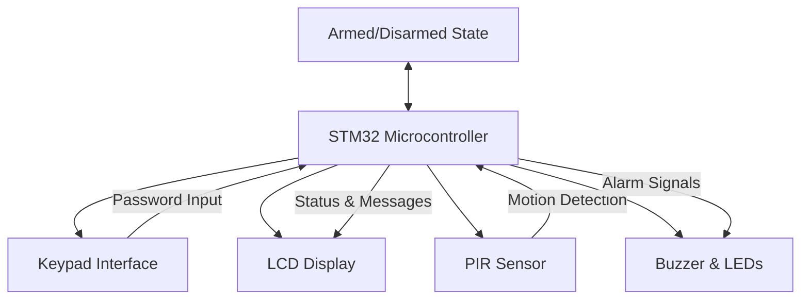

# STM32 Security System

Welcome to our guide on building a comprehensive security system using the STM32 microcontroller! This project is perfect for beginners looking to apply their STM32 knowledge to a practical, real-world application. By the end, you'll have a functional security system that can detect motion, verify access codes, and trigger alerts.

## Introduction

Security systems are essential in our daily lives - from home security to access control for sensitive areas. Building your own security system with an STM32 microcontroller not only teaches valuable embedded programming skills but also provides insight into how commercial security systems function.

In this tutorial, we'll build a basic security system with:

- Keypad password authentication
- PIR motion detection
- Alert system with buzzer and LED indicators
- LCD status display
- Optional communication module for remote notifications

Our system will operate in two states: armed and disarmed, controlled by a numeric password entered through a keypad.

## Components Required

To build this project, you'll need:

- STM32F103C8T6 "Blue Pill" board (or similar STM32 microcontroller)
- 4x4 Matrix Keypad
- 16x2 LCD display (with I2C adapter)
- PIR motion sensor
- Active buzzer
- LEDs (red and green)
- Resistors (220Ω)
- Breadboard and jumper wires
- ST-Link programmer
- 5V power supply

## System Overview

Before diving into code, let's understand the overall design of our security system:



The system functions in two main states:
1. **Disarmed** - motion detection is ignored
2. **Armed** - motion detection triggers an alarm

The state transition is controlled by entering the correct password on the keypad.

## Setting Up the Development Environment

First, make sure you have your development environment properly set up:

1. Install STM32CubeIDE or use your preferred STM32 development tool
2. Connect the ST-Link programmer to your STM32 board
3. Create a new project for your STM32 model (we'll use STM32F103C8T6 in this tutorial)

## Basic Project Configuration

Let's start by configuring the clock and peripherals in STM32CubeIDE:

1. Set the system clock to 72MHz
2. Enable GPIO ports for all connected components
3. Configure I2C for the LCD display
4. Set up the necessary timers

Here's a sample configuration in code:

```c
void SystemClock_Config(void)
{
  RCC_OscInitTypeDef RCC_OscInitStruct = {0};
  RCC_ClkInitTypeDef RCC_ClkInitStruct = {0};

  // Configure LSI used for RTC
  RCC_OscInitStruct.OscillatorType = RCC_OSCILLATORTYPE_HSE;
  RCC_OscInitStruct.HSEState = RCC_HSE_ON;
  RCC_OscInitStruct.HSEPredivValue = RCC_HSE_PREDIV_DIV1;
  RCC_OscInitStruct.PLL.PLLState = RCC_PLL_ON;
  RCC_OscInitStruct.PLL.PLLSource = RCC_PLLSOURCE_HSE;
  RCC_OscInitStruct.PLL.PLLMUL = RCC_PLL_MUL9;
  HAL_RCC_OscConfig(&RCC_OscInitStruct);

  // Configure the main internal regulator output voltage
  RCC_ClkInitStruct.ClockType = RCC_CLOCKTYPE_HCLK|RCC_CLOCKTYPE_SYSCLK
                              |RCC_CLOCKTYPE_PCLK1|RCC_CLOCKTYPE_PCLK2;
  RCC_ClkInitStruct.SYSCLKSource = RCC_SYSCLKSOURCE_PLLCLK;
  RCC_ClkInitStruct.AHBCLKDivider = RCC_SYSCLK_DIV1;
  RCC_ClkInitStruct.APB1CLKDivider = RCC_HCLK_DIV2;
  RCC_ClkInitStruct.APB2CLKDivider = RCC_HCLK_DIV1;
  HAL_RCC_ClockConfig(&RCC_ClkInitStruct, FLASH_LATENCY_2);
}

void PeripheralInit(void)
{
  // Enable GPIO ports
  __HAL_RCC_GPIOA_CLK_ENABLE();
  __HAL_RCC_GPIOB_CLK_ENABLE();
  __HAL_RCC_GPIOC_CLK_ENABLE();
  
  // Enable I2C for LCD
  __HAL_RCC_I2C1_CLK_ENABLE();
  
  // Configure GPIO pins (basic setup, will detail in later sections)
  // ...
}
```

## Interfacing with the Keypad

The 4x4 matrix keypad is a common input device with 16 keys arranged in 4 rows and 4 columns. We'll connect it to GPIO pins and scan for key presses.

### Keypad Connections:

- Connect row pins to GPIO pins configured as outputs (PB0-PB3)
- Connect column pins to GPIO pins configured as inputs with pull-up resistors (PB4-PB7)

### Keypad Interface Code:

```c
#define ROW_NUM 4
#define COL_NUM 4

// Define keypad layout
const char keypad[ROW_NUM][COL_NUM] = {
  {'1', '2', '3', 'A'},
  {'4', '5', '6', 'B'},
  {'7', '8', '9', 'C'},
  {'*', '0', '#', 'D'}
};

// GPIO pins for rows and columns
GPIO_TypeDef* row_ports[ROW_NUM] = {GPIOB, GPIOB, GPIOB, GPIOB};
uint16_t row_pins[ROW_NUM] = {GPIO_PIN_0, GPIO_PIN_1, GPIO_PIN_2, GPIO_PIN_3};

GPIO_TypeDef* col_ports[COL_NUM] = {GPIOB, GPIOB, GPIOB, GPIOB};
uint16_t col_pins[COL_NUM] = {GPIO_PIN_4, GPIO_PIN_5, GPIO_PIN_6, GPIO_PIN_7};

void keypad_init(void) {
  GPIO_InitTypeDef GPIO_InitStruct = {0};
  
  // Configure row pins as output
  for (int i = 0; i < ROW_NUM; i++) {
    GPIO_InitStruct.Pin = row_pins[i];
    GPIO_InitStruct.Mode = GPIO_MODE_OUTPUT_PP;
    GPIO_InitStruct.Pull = GPIO_NOPULL;
    GPIO_InitStruct.Speed = GPIO_SPEED_FREQ_LOW;
    HAL_GPIO_Init(row_ports[i], &GPIO_InitStruct);
    HAL_GPIO_WritePin(row_ports[i], row_pins[i], GPIO_PIN_SET);
  }
  
  // Configure column pins as input with pull-up
  for (int i = 0; i < COL_NUM; i++) {
    GPIO_InitStruct.Pin = col_pins[i];
    GPIO_InitStruct.Mode = GPIO_MODE_INPUT;
    GPIO_InitStruct.Pull = GPIO_PULLUP;
    HAL_GPIO_Init(col_ports[i], &GPIO_InitStruct);
  }
}

char keypad_scan(void) {
  char key = 0;
  
  // Scan each row
  for (int i = 0; i < ROW_NUM; i++) {
    // Set current row to LOW
    HAL_GPIO_WritePin(row_ports[i], row_pins[i], GPIO_PIN_RESET);
    
    // Check each column
    for (int j = 0; j < COL_NUM; j++) {
      // If key is pressed (column reads LOW)
      if (HAL_GPIO_ReadPin(col_ports[j], col_pins[j]) == GPIO_PIN_RESET) {
        // Debounce
        HAL_Delay(50);
        if (HAL_GPIO_ReadPin(col_ports[j], col_pins[j]) == GPIO_PIN_RESET) {
          key = keypad[i][j];
          
          // Wait for key release
          while (HAL_GPIO_ReadPin(col_ports[j], col_pins[j]) == GPIO_PIN_RESET);
          HAL_Delay(50);
        }
      }
    }
    
    // Set row back to HIGH
    HAL_GPIO_WritePin(row_ports[i], row_pins[i], GPIO_PIN_SET);
    
    // If key was found, return it
    if (key != 0) {
      return key;
    }
  }
  
  return 0; // No key pressed
}
```

## I2C LCD Display Integration

We'll use a standard 16x2 LCD with an I2C adapter for displaying system status and messages.

### LCD Connection:

- Connect SDA to PB7
- Connect SCL to PB6
- Connect VCC and GND appropriately

### LCD Driver Code:

Here's a simplified I2C LCD driver (you'll need to include the full library in your actual project):

```c
#define LCD_ADDR 0x27 // I2C address of LCD (may vary, check your module)

I2C_HandleTypeDef hi2c1;

void lcd_init(void) {
  // I2C initialization
  hi2c1.Instance = I2C1;
  hi2c1.Init.ClockSpeed = 100000;
  hi2c1.Init.DutyCycle = I2C_DUTYCYCLE_2;
  hi2c1.Init.OwnAddress1 = 0;
  hi2c1.Init.AddressingMode = I2C_ADDRESSINGMODE_7BIT;
  hi2c1.Init.DualAddressMode = I2C_DUALADDRESS_DISABLE;
  hi2c1.Init.OwnAddress2 = 0;
  hi2c1.Init.GeneralCallMode = I2C_GENERALCALL_DISABLE;
  hi2c1.Init.NoStretchMode = I2C_NOSTRETCH_DISABLE;
  HAL_I2C_Init(&hi2c1);
  
  // LCD initialization sequence
  HAL_Delay(50);
  lcd_send_cmd(0x30);
  HAL_Delay(5);
  lcd_send_cmd(0x30);
  HAL_Delay(1);
  lcd_send_cmd(0x30);
  HAL_Delay(10);
  lcd_send_cmd(0x20);
  HAL_Delay(10);
  
  // Function set: 4-bit mode, 2 lines, 5x8 font
  lcd_send_cmd(0x28);
  // Display control: display on, cursor off, blink off
  lcd_send_cmd(0x0C);
  // Entry mode set: increment cursor, no shift
  lcd_send_cmd(0x06);
  // Clear display
  lcd_send_cmd(0x01);
  HAL_Delay(2);
}

void lcd_send_cmd(uint8_t cmd) {
  uint8_t data_u, data_l;
  uint8_t data_t[4];
  
  data_u = (cmd & 0xF0);
  data_l = ((cmd << 4) & 0xF0);
  
  data_t[0] = data_u | 0x0C;  // en=1, rs=0
  data_t[1] = data_u | 0x08;  // en=0, rs=0
  data_t[2] = data_l | 0x0C;  // en=1, rs=0
  data_t[3] = data_l | 0x08;  // en=0, rs=0
  
  HAL_I2C_Master_Transmit(&hi2c1, LCD_ADDR << 1, (uint8_t*)data_t, 4, 100);
}

void lcd_send_data(uint8_t data) {
  uint8_t data_u, data_l;
  uint8_t data_t[4];
  
  data_u = (data & 0xF0);
  data_l = ((data << 4) & 0xF0);
  
  data_t[0] = data_u | 0x0D;  // en=1, rs=1
  data_t[1] = data_u | 0x09;  // en=0, rs=1
  data_t[2] = data_l | 0x0D;  // en=1, rs=1
  data_t[3] = data_l | 0x09;  // en=0, rs=1
  
  HAL_I2C_Master_Transmit(&hi2c1, LCD_ADDR << 1, (uint8_t*)data_t, 4, 100);
}

void lcd_clear(void) {
  lcd_send_cmd(0x01);
  HAL_Delay(2);
}

void lcd_put_cursor(uint8_t row, uint8_t col) {
  switch (row) {
    case 0:
      col |= 0x80;
      break;
    case 1:
      col |= 0xC0;
      break;
  }
  lcd_send_cmd(col);
}

void lcd_print(char *str) {
  while (*str) {
    lcd_send_data(*str++);
  }
}
```

## PIR Motion Sensor Integration

The PIR (Passive Infrared) sensor is used to detect motion in the secured area. When movement is detected, the sensor outputs a HIGH signal.

### PIR Sensor Connection:

- Connect VCC to the 5V power supply
- Connect GND to the ground
- Connect OUT pin to PA0 (configured as input)

### PIR Sensor Code:

```c
#define PIR_PORT GPIOA
#define PIR_PIN GPIO_PIN_0

void pir_init(void) {
  GPIO_InitTypeDef GPIO_InitStruct = {0};
  
  // Configure PIR pin as input
  GPIO_InitStruct.Pin = PIR_PIN;
  GPIO_InitStruct.Mode = GPIO_MODE_INPUT;
  GPIO_InitStruct.Pull = GPIO_NOPULL;
  HAL_GPIO_Init(PIR_PORT, &GPIO_InitStruct);
}

uint8_t pir_detect_motion(void) {
  return HAL_GPIO_ReadPin(PIR_PORT, PIR_PIN) == GPIO_PIN_SET;
}
```

## Alert System Components

Our alert system consists of a buzzer and LEDs to indicate the system status.

### Connections:

- Buzzer: Connect to PB8 with a current-limiting resistor
- Green LED: Connect to PA1 with a 220Ω resistor (indicates disarmed state)
- Red LED: Connect to PA2 with a 220Ω resistor (indicates armed state or alarm)

### Alert System Code:

```c
#define BUZZER_PORT GPIOB
#define BUZZER_PIN GPIO_PIN_8

#define GREEN_LED_PORT GPIOA
#define GREEN_LED_PIN GPIO_PIN_1

#define RED_LED_PORT GPIOA
#define RED_LED_PIN GPIO_PIN_2

void alert_system_init(void) {
  GPIO_InitTypeDef GPIO_InitStruct = {0};
  
  // Configure buzzer pin as output
  GPIO_InitStruct.Pin = BUZZER_PIN;
  GPIO_InitStruct.Mode = GPIO_MODE_OUTPUT_PP;
  GPIO_InitStruct.Pull = GPIO_NOPULL;
  GPIO_InitStruct.Speed = GPIO_SPEED_FREQ_LOW;
  HAL_GPIO_Init(BUZZER_PORT, &GPIO_InitStruct);
  
  // Configure LED pins as output
  GPIO_InitStruct.Pin = GREEN_LED_PIN;
  HAL_GPIO_Init(GREEN_LED_PORT, &GPIO_InitStruct);
  
  GPIO_InitStruct.Pin = RED_LED_PIN;
  HAL_GPIO_Init(RED_LED_PORT, &GPIO_InitStruct);
  
  // Initialize outputs to low
  HAL_GPIO_WritePin(BUZZER_PORT, BUZZER_PIN, GPIO_PIN_RESET);
  HAL_GPIO_WritePin(GREEN_LED_PORT, GREEN_LED_PIN, GPIO_PIN_RESET);
  HAL_GPIO_WritePin(RED_LED_PORT, RED_LED_PIN, GPIO_PIN_RESET);
}

void sound_alarm(uint8_t enable) {
  HAL_GPIO_WritePin(BUZZER_PORT, BUZZER_PIN, enable ? GPIO_PIN_SET : GPIO_PIN_RESET);
}

void set_armed_status(uint8_t armed) {
  HAL_GPIO_WritePin(GREEN_LED_PORT, GREEN_LED_PIN, armed ? GPIO_PIN_RESET : GPIO_PIN_SET);
  HAL_GPIO_WritePin(RED_LED_PORT, RED_LED_PIN, armed ? GPIO_PIN_SET : GPIO_PIN_RESET);
}

// Function to make alarm sound pattern
void alarm_pattern(void) {
  for (int i = 0; i < 5; i++) {
    sound_alarm(1);
    HAL_Delay(200);
    sound_alarm(0);
    HAL_Delay(100);
  }
}
```

## Password Management System

We'll implement a simple password system that allows users to enter a numeric code to arm/disarm the system.

```c
#define PASSWORD_LENGTH 4
#define MAX_ATTEMPTS 3

char default_password[PASSWORD_LENGTH + 1] = "1234"; // Default password
char input_password[PASSWORD_LENGTH + 1] = {0};
uint8_t password_index = 0;
uint8_t attempt_count = 0;

void reset_password_input(void) {
  for (int i = 0; i < PASSWORD_LENGTH + 1; i++) {
    input_password[i] = 0;
  }
  password_index = 0;
}

uint8_t verify_password(void) {
  return (strcmp(input_password, default_password) == 0);
}

void handle_keypad_input(char key) {
  if (key >= '0' && key <= '9' && password_index < PASSWORD_LENGTH) {
    // Store digit in password buffer
    input_password[password_index++] = key;
    input_password[password_index] = '\0';
    
    // Display asterisk for each digit
    lcd_send_data('*');
  } 
  else if (key == '#') {
    // Verify password
    if (verify_password()) {
      // Password correct, toggle armed state
      armed_state = !armed_state;
      attempt_count = 0;
      
      lcd_clear();
      
      if (armed_state) {
        lcd_put_cursor(0, 0);
        lcd_print("System Armed");
        lcd_put_cursor(1, 0);
        lcd_print("Exit in 10s");
        
        // Give time to exit before arming
        for (int i = 10; i > 0; i--) {
          lcd_put_cursor(1, 9);
          lcd_send_data('0' + i);
          HAL_Delay(1000);
        }
      } 
      else {
        lcd_put_cursor(0, 0);
        lcd_print("System Disarmed");
      }
      
      // Update LED status
      set_armed_status(armed_state);
    } 
    else {
      // Password incorrect
      attempt_count++;
      lcd_clear();
      lcd_put_cursor(0, 0);
      lcd_print("Wrong Password");
      lcd_put_cursor(1, 0);
      lcd_print("Attempts: ");
      lcd_send_data('0' + attempt_count);
      
      // Trigger alarm if too many wrong attempts
      if (attempt_count >= MAX_ATTEMPTS) {
        lcd_clear();
        lcd_put_cursor(0, 0);
        lcd_print("Too Many Attempts");
        lcd_put_cursor(1, 0);
        lcd_print("Alarm Triggered!");
        
        trigger_alarm();
        attempt_count = 0;
      }
      
      HAL_Delay(2000);
      lcd_clear();
      lcd_put_cursor(0, 0);
      lcd_print("Enter Password:");
      lcd_put_cursor(1, 0);
    }
    
    reset_password_input();
  } 
  else if (key == '*') {
    // Clear input
    reset_password_input();
    lcd_clear();
    lcd_put_cursor(0, 0);
    lcd_print("Enter Password:");
    lcd_put_cursor(1, 0);
  }
}
```

## Main Security System

Now let's put everything together to create our complete security system:

```c
uint8_t armed_state = 0;
uint8_t alarm_triggered = 0;

void security_system_init(void) {
  // Initialize system clock
  SystemClock_Config();
  
  // Initialize peripherals
  PeripheralInit();
  
  // Initialize components
  keypad_init();
  lcd_init();
  pir_init();
  alert_system_init();
  
  // Set initial states
  armed_state = 0;
  alarm_triggered = 0;
  set_armed_status(armed_state);
  
  // Display welcome message
  lcd_clear();
  lcd_put_cursor(0, 0);
  lcd_print("Security System");
  lcd_put_cursor(1, 0);
  lcd_print("Initializing...");
  HAL_Delay(2000);
  
  lcd_clear();
  lcd_put_cursor(0, 0);
  lcd_print("Enter Password:");
  lcd_put_cursor(1, 0);
}

void trigger_alarm(void) {
  alarm_triggered = 1;
  
  // Flash red LED and sound buzzer
  for (int i = 0; i < 30; i++) {
    HAL_GPIO_TogglePin(RED_LED_PORT, RED_LED_PIN);
    sound_alarm(1);
    HAL_Delay(100);
    sound_alarm(0);
    HAL_Delay(100);
  }
  
  alarm_triggered = 0;
  HAL_GPIO_WritePin(RED_LED_PORT, RED_LED_PIN, armed_state ? GPIO_PIN_SET : GPIO_PIN_RESET);
}

void check_motion(void) {
  if (armed_state && pir_detect_motion() && !alarm_triggered) {
    lcd_clear();
    lcd_put_cursor(0, 0);
    lcd_print("Motion Detected!");
    lcd_put_cursor(1, 0);
    lcd_print("Alarm Triggered!");
    
    trigger_alarm();
    
    lcd_clear();
    lcd_put_cursor(0, 0);
    lcd_print("Enter Password:");
    lcd_put_cursor(1, 0);
  }
}

int main(void) {
  // Initialize the security system
  security_system_init();
  
  while (1) {
    // Check for motion if system is armed
    check_motion();
    
    // Scan keypad for input
    char key = keypad_scan();
    if (key != 0) {
      handle_keypad_input(key);
    }
    
    // Small delay to reduce CPU usage
    HAL_Delay(50);
  }
}
```

## Real-World Application Example

This security system can be adapted for various real-world applications:

### Home Security System

For a home security application, you could:
- Add door/window sensors using magnetic reed switches
- Implement multiple zones for different rooms
- Add a GSM module to send SMS alerts
- Include a backup battery for power outages

### Secure Storage Box

For a secure storage application:
- Use a smaller enclosure
- Add a servo motor to control a locking mechanism
- Implement a more complex password or RFID authorization
- Add tamper detection sensors

### Laboratory Access Control

For lab access control:
- Interface with electronic door locks
- Implement user access levels with different permissions
- Add a log of entry/exit times
- Integrate with existing building management systems

## Enhancing the System

Here are some ways to enhance your security system:

### Improving Password Security

```c
// Use SHA-256 hash for password storage instead of plaintext
uint8_t password_hash[32] = {0x5e, 0x88, 0x48, 0x98, 0xda, 0x28, 0x04, 0x71, ...}; // Hash of "1234"

uint8_t verify_password(void) {
  // Calculate hash of input password
  uint8_t input_hash[32];
  SHA256_CTX ctx;
  sha256_init(&ctx);
  sha256_update(&ctx, (uint8_t*)input_password, strlen(input_password));
  sha256_final(&ctx, input_hash);
  
  // Compare hashes
  return memcmp(input_hash, password_hash, 32) == 0;
}
```

### Adding Remote Notifications

To add SMS or email notifications when an alarm is triggered, you could integrate a GSM module:

```c
void send_sms_alert(void) {
  // Initialize UART for GSM module communication
  // ...
  
  // Send AT commands to the GSM module
  uart_send_string("AT+CMGF=1\r
");  // Set to text mode
  HAL_Delay(500);
  
  uart_send_string("AT+CMGS=\"+1234567890\"\r
");  // Phone number
  HAL_Delay(500);
  
  uart_send_string("ALERT! Motion detected by security system.");  // Message
  HAL_Delay(100);
  
  uart_send_byte(0x1A);  // Send Ctrl+Z to end message
  HAL_Delay(1000);
}
```

### Implementing a Timeout Feature

To prevent unauthorized access if the system is left disarmed:

```c
#define DISARM_TIMEOUT 300000  // 5 minutes in milliseconds

uint32_t disarm_time = 0;

void check_auto_rearm(void) {
  if (!armed_state && (HAL_GetTick() - disarm_time > DISARM_TIMEOUT)) {
    // Auto-rearm after timeout
    armed_state = 1;
    set_armed_status(armed_state);
    
    lcd_clear();
    lcd_put_cursor(0, 0);
    lcd_print("Auto-Armed");
    lcd_put_cursor(1, 0);
    lcd_print("Timeout Reached");
    HAL_Delay(2000);
    
    lcd_clear();
    lcd_put_cursor(0, 0);
    lcd_print("System Armed");
  }
}
```

## Troubleshooting Common Issues

Here are some common issues you might encounter and how to solve them:

1. **False Motion Detection**
   - Adjust the sensitivity of the PIR sensor using its onboard potentiometer
   - Position the sensor away from heat sources and direct sunlight
   - Implement a confirmation delay (multiple detections required)

2. **Keypad Not Responding**
   - Check wiring connections
   - Verify pull-up resistors are properly configured
   - Ensure row scan timing is appropriate

3. **LCD Display Issues**
   - Verify I2C address is correct
   - Check I2C connections
   - Adjust contrast if needed (some I2C adapters have a potentiometer)

4. **System Resets Unexpectedly**
   - Check power supply stability
   - Implement debounce for buttons
   - Enable the watchdog timer for recovery from crashes

## Summary

In this tutorial, we've built a complete security system using an STM32 microcontroller. The system includes:

- Password protection using a keypad
- Motion detection with a PIR sensor
- Visual and audible alerts
- LCD status display

You've learned how to:
- Interface with various sensors and input devices
- Implement password authentication
- Create a state-based security system
- Handle alerts and notifications

This project demonstrates how you can use STM32 microcontrollers for practical, real-world applications beyond simple blinking LEDs. The skills you've gained can be applied to many other embedded systems projects.

## Further Exercises

1. Add a log of events (entries, exits, alarms) stored in flash memory
2. Implement multiple user passwords with different access levels
3. Add a real-time clock to enable/disable the system at scheduled times
4. Create a web interface using an ESP8266 or Ethernet module
5. Implement a fingerprint sensor for biometric authentication

## Additional Resources

- STM32 HAL Documentation
- PIR Sensor Datasheets
- I2C LCD Programming Guides
- Embedded Security Best Practices

Happy coding, and enjoy building your own customized security systems with STM32!