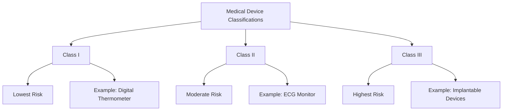
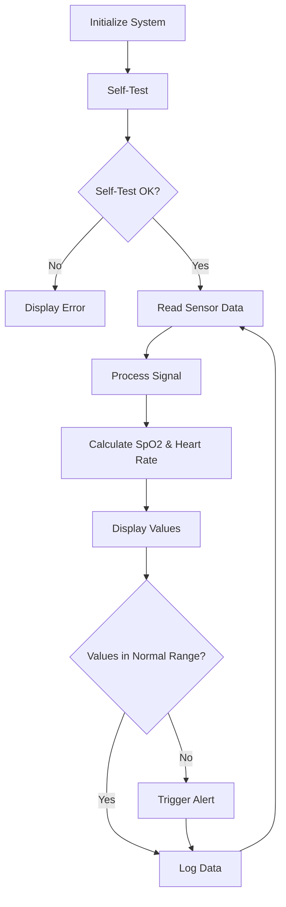

# STM32 Medical Devices

## Introduction

Medical devices represent one of the most impactful applications of embedded systems, directly influencing patient care and health outcomes. STM32 microcontrollers, with their balance of performance, power efficiency, and reliability, have become popular choices for developing medical and healthcare devices ranging from simple monitoring equipment to complex diagnostic tools.

In this guide, we'll explore how to use STM32 microcontrollers for medical device applications, covering the basics of medical device development, regulatory considerations, and practical examples to get you started on your own healthcare projects.

## Why STM32 for Medical Devices?

STM32 microcontrollers offer several advantages that make them suitable for medical applications:

- **High reliability**: Critical for devices where failures could impact patient safety
- **Low power consumption**: Essential for portable and wearable medical devices
- **Sufficient processing power**: For complex signal processing and data analysis
- **Rich peripheral set**: For interfacing with various sensors and communication protocols
- **Safety certifications**: Many STM32 families are certified for safety-critical applications
- **Long-term availability**: Important for medical devices with long development and service lifespans

## Understanding Medical Device Classifications

Before diving into development, it's important to understand that medical devices are classified based on their risk level and regulatory requirements:



The classification affects documentation requirements, verification processes, and regulatory approval pathways. Even for hobby or educational projects, understanding these classifications provides valuable context.

## Setting Up Your Development Environment

Let's start by setting up a basic development environment for STM32 medical device prototyping:

1. **Hardware requirements**:
   - STM32 development board (STM32F4 Discovery or Nucleo boards are good starting points)
   - Biomedical sensors (e.g., heart rate, temperature, blood oxygen)
   - Breadboard and jumper wires
   - Optional: display module (OLED/LCD)

2. **Software requirements**:
   - STM32CubeIDE for code development
   - STM32CubeMX for peripheral configuration
   - Version control system (Git recommended)
   - Documentation tools

## Basic Medical Device Project: Patient Temperature Monitor

Let's build a simple patient temperature monitor using an STM32F4 microcontroller and a medical-grade temperature sensor.

### Hardware Setup

Connect a digital temperature sensor (like the MAX30205, which is designed for medical applications) to your STM32 board:

```
MAX30205 Sensor  ---->  STM32F4 Board
VCC              ---->  3.3V
GND              ---->  GND
SCL              ---->  PB6 (I2C1_SCL)
SDA              ---->  PB7 (I2C1_SDA)
```

### Software Implementation

First, initialize the I2C peripheral and temperature sensor:

```c
/* Initialize I2C for temperature sensor communication */
void TempSensor_Init(void)
{
  // Enable I2C peripheral clock
  __HAL_RCC_I2C1_CLK_ENABLE();
  __HAL_RCC_GPIOB_CLK_ENABLE();
  
  // Configure I2C pins
  GPIO_InitTypeDef GPIO_InitStruct = {0};
  GPIO_InitStruct.Pin = GPIO_PIN_6|GPIO_PIN_7;
  GPIO_InitStruct.Mode = GPIO_MODE_AF_OD;
  GPIO_InitStruct.Pull = GPIO_PULLUP;
  GPIO_InitStruct.Speed = GPIO_SPEED_FREQ_VERY_HIGH;
  GPIO_InitStruct.Alternate = GPIO_AF4_I2C1;
  HAL_GPIO_Init(GPIOB, &GPIO_InitStruct);
  
  // Configure I2C
  hi2c1.Instance = I2C1;
  hi2c1.Init.ClockSpeed = 100000;
  hi2c1.Init.DutyCycle = I2C_DUTYCYCLE_2;
  hi2c1.Init.OwnAddress1 = 0;
  hi2c1.Init.AddressingMode = I2C_ADDRESSINGMODE_7BIT;
  HAL_I2C_Init(&hi2c1);
  
  // Initialize MAX30205 sensor (0x48 is the default I2C address)
  uint8_t config_data = 0x00; // Configuration register value
  HAL_I2C_Mem_Write(&hi2c1, 0x48 << 1, 0x01, I2C_MEMADD_SIZE_8BIT, &config_data, 1, HAL_MAX_DELAY);
}
```

Next, create a function to read temperature data:

```c
/* Read temperature from the sensor */
float TempSensor_ReadTemperature(void)
{
  uint8_t temp_data[2];
  float temperature;
  
  // Read temperature register (0x00)
  HAL_I2C_Mem_Read(&hi2c1, 0x48 << 1, 0x00, I2C_MEMADD_SIZE_8BIT, temp_data, 2, HAL_MAX_DELAY);
  
  // Convert the 16-bit value to temperature in Celsius
  int16_t temp_raw = (temp_data[0] << 8) | temp_data[1];
  temperature = temp_raw * 0.00390625; // Each bit equals 0.00390625°C
  
  return temperature;
}
```

Now, implement patient temperature monitoring with alerts:

```c
/* Main monitoring function with medical-grade thresholds */
void MonitorPatientTemperature(void)
{
  float temperature;
  char lcd_buffer[32];
  
  // Medical temperature thresholds (in Celsius)
  const float HYPOTHERMIA_THRESHOLD = 35.0;
  const float FEVER_THRESHOLD = 38.0;
  const float HIGH_FEVER_THRESHOLD = 39.5;
  const float HYPERPYREXIA_THRESHOLD = 41.0;
  
  while (1)
  {
    // Read current patient temperature
    temperature = TempSensor_ReadTemperature();
    
    // Format temperature for display
    sprintf(lcd_buffer, "Temp: %.1f C", temperature);
    LCD_DisplayString(0, 0, lcd_buffer);
    
    // Clinical assessment and alerts
    if (temperature < HYPOTHERMIA_THRESHOLD)
    {
      LCD_DisplayString(0, 1, "ALERT: Hypothermia");
      HAL_GPIO_WritePin(BLUE_LED_PORT, BLUE_LED_PIN, GPIO_PIN_SET);
    }
    else if (temperature >= HYPERPYREXIA_THRESHOLD)
    {
      LCD_DisplayString(0, 1, "EMERGENCY: Hyperpyrexia");
      HAL_GPIO_WritePin(RED_LED_PORT, RED_LED_PIN, GPIO_PIN_SET);
      TriggerAlarm(); // Activate audible alarm
    }
    else if (temperature >= HIGH_FEVER_THRESHOLD)
    {
      LCD_DisplayString(0, 1, "ALERT: High Fever");
      HAL_GPIO_WritePin(RED_LED_PORT, RED_LED_PIN, GPIO_PIN_SET);
    }
    else if (temperature >= FEVER_THRESHOLD)
    {
      LCD_DisplayString(0, 1, "WARNING: Fever");
      HAL_GPIO_WritePin(YELLOW_LED_PORT, YELLOW_LED_PIN, GPIO_PIN_SET);
    }
    else
    {
      LCD_DisplayString(0, 1, "Status: Normal");
      HAL_GPIO_WritePin(GREEN_LED_PORT, GREEN_LED_PIN, GPIO_PIN_SET);
    }
    
    // Store readings in memory for trend analysis
    StoreTemperatureReading(temperature);
    
    // Wait for next reading
    HAL_Delay(10000); // 10-second interval between readings
    
    // Turn off all indicator LEDs
    HAL_GPIO_WritePin(ALL_LEDS_PORT, ALL_LEDS_PIN, GPIO_PIN_RESET);
  }
}
```

### Data Logging and Analysis

For medical devices, data logging is crucial. Let's implement a simple circular buffer to store temperature readings:

```c
/* Temperature reading data structure */
typedef struct {
  float temperature;
  uint32_t timestamp;
} TempReading;

/* Circular buffer for temperature readings */
#define MAX_READINGS 144 // Store 24 hours of readings (at 10-min intervals)
TempReading temp_history[MAX_READINGS];
uint16_t reading_index = 0;
uint16_t total_readings = 0;

/* Store a temperature reading with timestamp */
void StoreTemperatureReading(float temperature)
{
  // Get current timestamp (seconds since device started)
  uint32_t current_time = HAL_GetTick() / 1000;
  
  // Store reading in circular buffer
  temp_history[reading_index].temperature = temperature;
  temp_history[reading_index].timestamp = current_time;
  
  // Update index and count
  reading_index = (reading_index + 1) % MAX_READINGS;
  if (total_readings < MAX_READINGS) {
    total_readings++;
  }
}

/* Calculate average temperature over the last hour */
float CalculateHourlyAverage(void)
{
  float sum = 0.0f;
  uint16_t count = 0;
  uint32_t current_time = HAL_GetTick() / 1000;
  uint32_t one_hour_ago = (current_time > 3600) ? (current_time - 3600) : 0;
  
  for (uint16_t i = 0; i < total_readings; i++) {
    uint16_t idx = (reading_index - 1 - i + MAX_READINGS) % MAX_READINGS;
    if (temp_history[idx].timestamp >= one_hour_ago) {
      sum += temp_history[idx].temperature;
      count++;
    }
  }
  
  return (count > 0) ? (sum / count) : 0.0f;
}
```

## Advanced Project: ECG Monitor with STM32

For a more advanced project, let's look at how to implement a basic ECG (Electrocardiogram) monitor using an STM32F4 and the AD8232 ECG sensor.

### Hardware Setup

```
AD8232 ECG Sensor  ---->  STM32F4 Board
VCC                ---->  3.3V
GND                ---->  GND
OUTPUT             ---->  PA0 (ADC1_IN0)
LO+                ---->  PA1 (GPIO Input)
LO-                ---->  PA2 (GPIO Input)
```

### Software Implementation

First, initialize the ADC for ECG signal acquisition:

```c
/* Initialize ADC for ECG signal acquisition */
void ECG_Init(void)
{
  // Enable GPIO and ADC clocks
  __HAL_RCC_GPIOA_CLK_ENABLE();
  __HAL_RCC_ADC1_CLK_ENABLE();
  
  // Configure ADC pin (PA0)
  GPIO_InitTypeDef GPIO_InitStruct = {0};
  GPIO_InitStruct.Pin = GPIO_PIN_0;
  GPIO_InitStruct.Mode = GPIO_MODE_ANALOG;
  GPIO_InitStruct.Pull = GPIO_NOPULL;
  HAL_GPIO_Init(GPIOA, &GPIO_InitStruct);
  
  // Configure lead-off detection pins
  GPIO_InitStruct.Pin = GPIO_PIN_1 | GPIO_PIN_2;
  GPIO_InitStruct.Mode = GPIO_MODE_INPUT;
  GPIO_InitStruct.Pull = GPIO_PULLUP;
  HAL_GPIO_Init(GPIOA, &GPIO_InitStruct);
  
  // Configure ADC
  hadc1.Instance = ADC1;
  hadc1.Init.ClockPrescaler = ADC_CLOCK_SYNC_PCLK_DIV4;
  hadc1.Init.Resolution = ADC_RESOLUTION_12B;
  hadc1.Init.ScanConvMode = DISABLE;
  hadc1.Init.ContinuousConvMode = DISABLE;
  hadc1.Init.DiscontinuousConvMode = DISABLE;
  hadc1.Init.ExternalTrigConvEdge = ADC_EXTERNALTRIGCONVEDGE_NONE;
  hadc1.Init.ExternalTrigConv = ADC_SOFTWARE_START;
  hadc1.Init.DataAlign = ADC_DATAALIGN_RIGHT;
  hadc1.Init.NbrOfConversion = 1;
  hadc1.Init.DMAContinuousRequests = DISABLE;
  hadc1.Init.EOCSelection = ADC_EOC_SINGLE_CONV;
  HAL_ADC_Init(&hadc1);
  
  // Configure ADC channel
  ADC_ChannelConfTypeDef sConfig = {0};
  sConfig.Channel = ADC_CHANNEL_0;
  sConfig.Rank = 1;
  sConfig.SamplingTime = ADC_SAMPLETIME_480CYCLES;
  HAL_ADC_ConfigChannel(&hadc1, &sConfig);
}
```

Next, implement ECG signal acquisition:

```c
/* Read ECG signal value */
uint16_t ECG_ReadSignal(void)
{
  uint16_t adc_value = 0;
  
  // Check if leads are properly connected
  if (HAL_GPIO_ReadPin(GPIOA, GPIO_PIN_1) == GPIO_PIN_SET ||
      HAL_GPIO_ReadPin(GPIOA, GPIO_PIN_2) == GPIO_PIN_SET) {
    // Leads are not properly connected
    return 0;
  }
  
  // Start ADC conversion
  HAL_ADC_Start(&hadc1);
  
  // Wait for conversion to complete
  if (HAL_ADC_PollForConversion(&hadc1, 100) == HAL_OK) {
    // Read conversion result
    adc_value = HAL_ADC_GetValue(&hadc1);
  }
  
  return adc_value;
}
```

To process the ECG signal and detect heart rate:

```c
/* ECG processing to detect heart rate */
#define SAMPLE_RATE 500 // 500 Hz sampling
#define THRESHOLD_PERCENTAGE 70 // R peak detection threshold

uint16_t ecg_buffer[SAMPLE_RATE * 5]; // 5 seconds of data
uint32_t r_peak_timestamps[50]; // Timestamps of detected R peaks
uint8_t r_peak_count = 0;

void ProcessECGSignal(void)
{
  uint32_t current_time = 0;
  uint16_t ecg_value = 0;
  uint16_t max_value = 0;
  uint16_t threshold = 0;
  
  // Find maximum value for adaptive thresholding
  for (uint16_t i = 0; i < SAMPLE_RATE * 5; i++) {
    if (ecg_buffer[i] > max_value) {
      max_value = ecg_buffer[i];
    }
  }
  
  // Set threshold at 70% of maximum value
  threshold = (max_value * THRESHOLD_PERCENTAGE) / 100;
  
  // Detect R peaks (above threshold)
  r_peak_count = 0;
  for (uint16_t i = 1; i < SAMPLE_RATE * 5 - 1; i++) {
    current_time = i * (1000 / SAMPLE_RATE); // Convert to milliseconds
    
    // Simple peak detection algorithm
    if (ecg_buffer[i] > threshold && 
        ecg_buffer[i] > ecg_buffer[i-1] && 
        ecg_buffer[i] >= ecg_buffer[i+1]) {
      
      // Store timestamp of R peak
      r_peak_timestamps[r_peak_count++] = current_time;
      
      if (r_peak_count >= 50) {
        break; // Buffer full
      }
    }
  }
}

/* Calculate heart rate from R-R intervals */
uint8_t CalculateHeartRate(void)
{
  if (r_peak_count < 2) {
    return 0; // Not enough peaks detected
  }
  
  uint32_t total_interval = 0;
  
  // Calculate average R-R interval
  for (uint8_t i = 1; i < r_peak_count; i++) {
    total_interval += (r_peak_timestamps[i] - r_peak_timestamps[i-1]);
  }
  
  uint32_t avg_interval = total_interval / (r_peak_count - 1);
  
  // Convert to heart rate (beats per minute)
  uint8_t heart_rate = (uint8_t)(60000 / avg_interval);
  
  return heart_rate;
}
```

## Medical Device Safety and Regulatory Considerations

When developing medical devices, even for educational purposes, consider these important aspects:

### Safety First

```c
/* Example of a safety watchdog implementation */
void InitializeWatchdog(void)
{
  // Configure Independent Watchdog Timer (IWDG)
  hiwdg.Instance = IWDG;
  hiwdg.Init.Prescaler = IWDG_PRESCALER_64; // ~1.6s timeout
  hiwdg.Init.Reload = 4095;
  HAL_IWDG_Init(&hiwdg);
}

/* Critical error handler */
void HandleCriticalError(uint8_t error_code)
{
  // Log error to non-volatile memory
  LogError(error_code);
  
  // Disable all outputs that could affect patient
  DisableAllOutputs();
  
  // Display error message
  char error_msg[32];
  sprintf(error_msg, "ERROR: %d - SYSTEM HALTED", error_code);
  LCD_DisplayString(0, 0, error_msg);
  LCD_DisplayString(0, 1, "Contact technician");
  
  // Blink LED to indicate error state
  while (1) {
    HAL_GPIO_TogglePin(RED_LED_PORT, RED_LED_PIN);
    HAL_Delay(500);
    // Reset watchdog to prevent system reset
    HAL_IWDG_Refresh(&hiwdg);
  }
}
```

### Regulatory Awareness

Even for educational projects, understanding basic regulatory requirements builds good habits:

1. **Documentation**: Maintain detailed development logs and design specifications
2. **Risk management**: Identify potential failure modes and their impact
3. **Verification and validation**: Test thoroughly under various conditions
4. **User interface design**: Ensure clear, unambiguous information display
5. **Data protection**: Secure any patient data according to privacy standards

## Real-world STM32 Medical Device Applications

STM32 microcontrollers are used in various medical and healthcare applications:

1. **Patient Monitoring Systems**
   - Vital signs monitors (temperature, heart rate, blood pressure)
   - ECG/EKG devices
   - Pulse oximeters

2. **Point-of-Care Testing**
   - Blood glucose meters
   - Portable analyzers
   - Rapid diagnostic tools

3. **Wearable Health Devices**
   - Activity trackers
   - Sleep monitors
   - Fall detection systems

4. **Therapeutic Devices**
   - Smart drug delivery systems
   - Physical therapy equipment
   - TENS (Transcutaneous Electrical Nerve Stimulation) devices

## Project Example: Portable Pulse Oximeter

A pulse oximeter measures blood oxygen saturation (SpO₂) and is a good example of a medical device you can prototype with STM32.

### Key Components:

- STM32F4 microcontroller
- MAX30102 pulse oximetry sensor
- OLED display
- Battery power system
- Alert system (buzzer and LEDs)

### Basic Algorithm Flow:



## Ensuring Medical Device Reliability

For medical devices, reliability is paramount. Here are key practices to implement:

### Power Management

```c
/* Battery monitoring function */
float MonitorBatteryLevel(void)
{
  uint16_t adc_value;
  float battery_voltage;
  
  // Read battery voltage through voltage divider
  HAL_ADC_Start(&hadc2);
  HAL_ADC_PollForConversion(&hadc2, 100);
  adc_value = HAL_ADC_GetValue(&hadc2);
  
  // Convert ADC value to voltage (assuming 3.3V reference)
  // With voltage divider of R1=10K, R2=10K
  battery_voltage = (float)adc_value * 3.3 * 2 / 4095.0;
  
  // Trigger low battery warning at 3.3V (for LiPo battery)
  if (battery_voltage < 3.3) {
    // Display low battery warning
    LCD_DisplayString(0, 3, "LOW BATTERY!");
    HAL_GPIO_WritePin(YELLOW_LED_PORT, YELLOW_LED_PIN, GPIO_PIN_SET);
  }
  
  // Critical battery level - save data and prepare for shutdown
  if (battery_voltage < 3.0) {
    // Save critical data to flash memory
    SaveDataToFlash();
    
    // Display critical battery warning
    LCD_DisplayString(0, 3, "CRITICAL BATTERY - SHUTTING DOWN");
    HAL_GPIO_WritePin(RED_LED_PORT, RED_LED_PIN, GPIO_PIN_SET);
    
    // Prepare for shutdown
    PrepareForShutdown();
  }
  
  return battery_voltage;
}
```

### Data Validation

Always validate sensor readings to ensure data integrity:

```c
/* Validate temperature reading for medical use */
bool ValidateTemperatureReading(float temperature)
{
  // Check if reading is within physiologically possible range
  // Human body temperature range: 25°C (severe hypothermia) to 45°C (extreme hyperpyrexia)
  if (temperature < 25.0 || temperature > 45.0) {
    return false;
  }
  
  // Check for rapid changes that might indicate sensor error
  // More than 2°C change in 30 seconds is physiologically unlikely
  static float last_valid_temp = 37.0;
  static uint32_t last_valid_time = 0;
  uint32_t current_time = HAL_GetTick();
  
  if (last_valid_time > 0 && 
      (current_time - last_valid_time) < 30000 &&
      fabs(temperature - last_valid_temp) > 2.0) {
    return false;
  }
  
  // Reading passed validation
  last_valid_temp = temperature;
  last_valid_time = current_time;
  return true;
}
```

## Summary

STM32 microcontrollers offer an excellent platform for developing medical and healthcare devices due to their reliability, performance, and extensive peripheral support. While developing medical devices requires additional considerations for safety, regulatory compliance, and reliability, the STM32 ecosystem provides the tools needed to meet these requirements.

In this guide, we've explored:

- Why STM32 is suitable for medical device development
- Basic and advanced medical device projects using STM32
- Regulatory and safety considerations
- Techniques for ensuring device reliability and data integrity

Remember that any medical device developed for actual use with patients requires proper certification and regulatory approval. The examples provided here are for educational purposes and should not be used for actual patient care without proper development, testing, and certification.

## Resources and Exercises

### Further Learning

To continue exploring STM32 for medical applications, consider these resources:

1. ST's Medical Applications Guide for STM32
2. IEC 60601 (Medical Electrical Equipment) standards overview
3. STM32 FDA-recognized software development guidelines

### Exercises

1. **Basic**: Extend the temperature monitor to include data logging to SD card and graphical display of temperature trends.

2. **Intermediate**: Develop a pulse oximeter using STM32 and the MAX30102 sensor. Implement power-saving features for extended battery life.

3. **Advanced**: Create a multi-parameter vital signs monitor combining temperature, ECG, and SpO₂ measurements with a unified display and alert system.

4. **Challenge**: Design a medical device with wireless connectivity to transmit patient data to a mobile application or cloud service, including appropriate security measures.

By working through these projects, you'll gain practical experience with STM32 medical device development while learning important principles of medical electronics, signal processing, and reliability engineering.