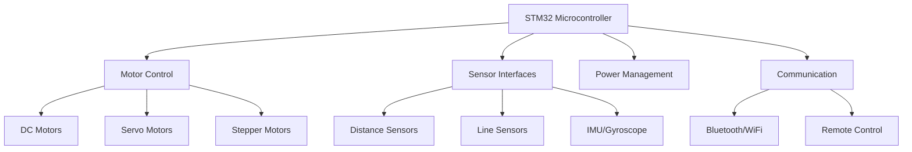

# STM32 Robotics

Welcome to the exciting world of robotics with STM32 microcontrollers! This guide will introduce you to the fundamental concepts of building robotic systems using STM32 microcontrollers, walking you through the basics and gradually moving to more advanced topics.

## Introduction to STM32 for Robotics

STM32 microcontrollers are perfect for robotics projects due to their processing power, extensive peripheral support, and excellent power efficiency. Based on ARM Cortex-M cores, these microcontrollers provide the computational capabilities needed for various robotic applications, from simple line-following robots to complex autonomous systems.

### Why Choose STM32 for Robotics?

- **Processing Power**: STM32 microcontrollers offer high-performance processing capabilities
- **Rich Peripheral Set**: Built-in support for numerous communication protocols (I2C, SPI, UART, CAN)
- **Timer Capabilities**: Advanced PWM generation for motor control
- **ADC and DAC**: Precise analog signal processing for sensors
- **Low Power Modes**: Essential for battery-powered robots
- **Extensive Ecosystem**: Abundant libraries, development tools, and community support

## Setting Up Your Development Environment

Before building robotic systems, you need to set up your development environment:

```bash
# Installation steps may vary depending on your operating system
# For Windows, download and install STM32CubeIDE

# For Ubuntu/Debian Linux
sudo apt-get update
sudo apt-get install -y gcc-arm-none-eabi
sudo apt-get install -y openocd
sudo apt-get install -y stlink-tools
```

## Basic Components of an STM32 Robot

A typical STM32-based robot consists of several key components:



## Motor Control with STM32

### DC Motor Control using PWM

DC motors are commonly used in robotics for wheel drive systems. Here's how to control them using PWM:

```c
/* Initialize GPIO for motor control */
void Motor_GPIO_Init(void)
{
    GPIO_InitTypeDef GPIO_InitStruct = {0};
    
    /* Enable clock for GPIOA */
    __HAL_RCC_GPIOA_CLK_ENABLE();
    
    /* Configure GPIO pins for motor control */
    GPIO_InitStruct.Pin = GPIO_PIN_1 | GPIO_PIN_2;
    GPIO_InitStruct.Mode = GPIO_MODE_OUTPUT_PP;
    GPIO_InitStruct.Pull = GPIO_NOPULL;
    GPIO_InitStruct.Speed = GPIO_SPEED_FREQ_LOW;
    HAL_GPIO_Init(GPIOA, &GPIO_InitStruct);
}

/* Initialize Timer for PWM generation */
void Motor_PWM_Init(void)
{
    TIM_HandleTypeDef htim2;
    TIM_OC_InitTypeDef sConfigOC = {0};
    
    /* Initialize TIM2 */
    htim2.Instance = TIM2;
    htim2.Init.Prescaler = 72-1;
    htim2.Init.CounterMode = TIM_COUNTERMODE_UP;
    htim2.Init.Period = 1000-1;
    htim2.Init.ClockDivision = TIM_CLOCKDIVISION_DIV1;
    HAL_TIM_PWM_Init(&htim2);
    
    /* Configure PWM channel */
    sConfigOC.OCMode = TIM_OCMODE_PWM1;
    sConfigOC.Pulse = 0;
    sConfigOC.OCPolarity = TIM_OCPOLARITY_HIGH;
    HAL_TIM_PWM_ConfigChannel(&htim2, &sConfigOC, TIM_CHANNEL_1);
    
    /* Start PWM generation */
    HAL_TIM_PWM_Start(&htim2, TIM_CHANNEL_1);
}

/* Set motor speed and direction */
void Motor_Control(int16_t speed)
{
    if (speed >= 0) {
        /* Forward direction */
        HAL_GPIO_WritePin(GPIOA, GPIO_PIN_1, GPIO_PIN_SET);
        HAL_GPIO_WritePin(GPIOA, GPIO_PIN_2, GPIO_PIN_RESET);
        __HAL_TIM_SET_COMPARE(&htim2, TIM_CHANNEL_1, speed);
    } else {
        /* Reverse direction */
        HAL_GPIO_WritePin(GPIOA, GPIO_PIN_1, GPIO_PIN_RESET);
        HAL_GPIO_WritePin(GPIOA, GPIO_PIN_2, GPIO_PIN_SET);
        __HAL_TIM_SET_COMPARE(&htim2, TIM_CHANNEL_1, -speed);
    }
}
```

### Servo Motor Control

Servo motors are ideal for precise angular positioning in robotics:

```c
/* Initialize Timer for Servo PWM generation */
void Servo_Init(void)
{
    TIM_HandleTypeDef htim3;
    TIM_OC_InitTypeDef sConfigOC = {0};
    
    /* Initialize TIM3 */
    htim3.Instance = TIM3;
    htim3.Init.Prescaler = 72-1;
    htim3.Init.CounterMode = TIM_COUNTERMODE_UP;
    htim3.Init.Period = 20000-1;  /* 20ms period for standard servos */
    htim3.Init.ClockDivision = TIM_CLOCKDIVISION_DIV1;
    HAL_TIM_PWM_Init(&htim3);
    
    /* Configure PWM channel */
    sConfigOC.OCMode = TIM_OCMODE_PWM1;
    sConfigOC.Pulse = 1500;  /* 1.5ms pulse for neutral position */
    sConfigOC.OCPolarity = TIM_OCPOLARITY_HIGH;
    HAL_TIM_PWM_ConfigChannel(&htim3, &sConfigOC, TIM_CHANNEL_1);
    
    /* Start PWM generation */
    HAL_TIM_PWM_Start(&htim3, TIM_CHANNEL_1);
}

/* Set servo position (angle in degrees) */
void Servo_SetPosition(uint8_t angle)
{
    uint16_t pulse;
    
    /* Convert angle to pulse width (500-2500μs range) */
    pulse = 500 + (angle * 2000 / 180);
    
    /* Limit pulse width to valid range */
    if (pulse < 500) pulse = 500;
    if (pulse > 2500) pulse = 2500;
    
    /* Set pulse width */
    __HAL_TIM_SET_COMPARE(&htim3, TIM_CHANNEL_1, pulse);
}
```

## Sensor Integration for Robot Navigation

### Ultrasonic Distance Sensor (HC-SR04)

Distance measurement is crucial for obstacle avoidance:

```c
/* Initialize GPIO for HC-SR04 sensor */
void HCSR04_Init(void)
{
    GPIO_InitTypeDef GPIO_InitStruct = {0};
    
    /* Enable clocks */
    __HAL_RCC_GPIOB_CLK_ENABLE();
    
    /* Configure trigger pin as output */
    GPIO_InitStruct.Pin = GPIO_PIN_10;
    GPIO_InitStruct.Mode = GPIO_MODE_OUTPUT_PP;
    GPIO_InitStruct.Pull = GPIO_NOPULL;
    GPIO_InitStruct.Speed = GPIO_SPEED_FREQ_LOW;
    HAL_GPIO_Init(GPIOB, &GPIO_InitStruct);
    
    /* Configure echo pin as input */
    GPIO_InitStruct.Pin = GPIO_PIN_11;
    GPIO_InitStruct.Mode = GPIO_MODE_INPUT;
    GPIO_InitStruct.Pull = GPIO_PULLDOWN;
    HAL_GPIO_Init(GPIOB, &GPIO_InitStruct);
}

/* Measure distance in centimeters */
float HCSR04_ReadDistance(void)
{
    uint32_t startTime, endTime;
    float distance;
    
    /* Send trigger pulse */
    HAL_GPIO_WritePin(GPIOB, GPIO_PIN_10, GPIO_PIN_RESET);
    HAL_Delay(2);
    HAL_GPIO_WritePin(GPIOB, GPIO_PIN_10, GPIO_PIN_SET);
    HAL_Delay_Microseconds(10);
    HAL_GPIO_WritePin(GPIOB, GPIO_PIN_10, GPIO_PIN_RESET);
    
    /* Wait for echo to go high */
    startTime = HAL_GetTick();
    while (HAL_GPIO_ReadPin(GPIOB, GPIO_PIN_11) == GPIO_PIN_RESET) {
        if (HAL_GetTick() - startTime > 500) {
            return -1.0f;  /* Timeout error */
        }
    }
    
    /* Measure pulse width */
    startTime = DWT_GetCounter();
    while (HAL_GPIO_ReadPin(GPIOB, GPIO_PIN_11) == GPIO_PIN_SET) {
        if ((DWT_GetCounter() - startTime) > 0.5f * SystemCoreClock) {
            return -1.0f;  /* Timeout error */
        }
    }
    endTime = DWT_GetCounter();
    
    /* Calculate distance */
    distance = ((endTime - startTime) * 0.000343f) / 2.0f;
    
    return distance;
}
```

### Line Follower Sensor

Line following robots require IR sensors to detect lines:

```c
/* Initialize ADC for line sensors */
void LineSensor_Init(void)
{
    ADC_HandleTypeDef hadc1;
    ADC_ChannelConfTypeDef sConfig = {0};
    
    /* Initialize ADC1 */
    hadc1.Instance = ADC1;
    hadc1.Init.ScanConvMode = ADC_SCAN_DISABLE;
    hadc1.Init.ContinuousConvMode = DISABLE;
    hadc1.Init.DiscontinuousConvMode = DISABLE;
    hadc1.Init.ExternalTrigConv = ADC_SOFTWARE_START;
    hadc1.Init.DataAlign = ADC_DATAALIGN_RIGHT;
    hadc1.Init.NbrOfConversion = 1;
    HAL_ADC_Init(&hadc1);
    
    /* Configure ADC channel */
    sConfig.Channel = ADC_CHANNEL_0;
    sConfig.Rank = 1;
    sConfig.SamplingTime = ADC_SAMPLETIME_55CYCLES_5;
    HAL_ADC_ConfigChannel(&hadc1, &sConfig);
}

/* Read line sensor value */
uint16_t LineSensor_Read(uint8_t sensor_num)
{
    ADC_ChannelConfTypeDef sConfig = {0};
    
    /* Select ADC channel based on sensor number */
    sConfig.Channel = ADC_CHANNEL_0 + sensor_num;
    sConfig.Rank = 1;
    sConfig.SamplingTime = ADC_SAMPLETIME_55CYCLES_5;
    HAL_ADC_ConfigChannel(&hadc1, &sConfig);
    
    /* Start conversion and wait for completion */
    HAL_ADC_Start(&hadc1);
    HAL_ADC_PollForConversion(&hadc1, 100);
    
    /* Read and return ADC value */
    return HAL_ADC_GetValue(&hadc1);
}
```

## Building a Complete Line-Following Robot

Let's build a complete line-following robot using the components we've discussed:

```c
/* Main application code */
int main(void)
{
    /* Initialize system */
    HAL_Init();
    SystemClock_Config();
    
    /* Initialize peripherals */
    Motor_GPIO_Init();
    Motor_PWM_Init();
    LineSensor_Init();
    
    while (1) {
        /* Read line sensors */
        uint16_t leftSensor = LineSensor_Read(0);
        uint16_t rightSensor = LineSensor_Read(1);
        
        /* Line following algorithm */
        if (leftSensor < THRESHOLD && rightSensor < THRESHOLD) {
            /* Both sensors on line - move forward */
            Motor_Control(LEFT_MOTOR, 300);
            Motor_Control(RIGHT_MOTOR, 300);
        } else if (leftSensor < THRESHOLD && rightSensor >= THRESHOLD) {
            /* Left sensor on line, right sensor off - turn left */
            Motor_Control(LEFT_MOTOR, 100);
            Motor_Control(RIGHT_MOTOR, 300);
        } else if (leftSensor >= THRESHOLD && rightSensor < THRESHOLD) {
            /* Right sensor on line, left sensor off - turn right */
            Motor_Control(LEFT_MOTOR, 300);
            Motor_Control(RIGHT_MOTOR, 100);
        } else {
            /* Both sensors off line - search for line */
            Motor_Control(LEFT_MOTOR, 200);
            Motor_Control(RIGHT_MOTOR, -200);
        }
        
        /* Small delay */
        HAL_Delay(10);
    }
}
```

## PID Control for Smooth Robot Movement

To make your robot move smoothly and accurately, implementing PID (Proportional, Integral, Derivative) control is highly beneficial:

```c
/* PID controller structure */
typedef struct {
    float Kp;           /* Proportional gain */
    float Ki;           /* Integral gain */
    float Kd;           /* Derivative gain */
    float setpoint;     /* Desired value */
    float integral;     /* Integral term */
    float prev_error;   /* Previous error for derivative term */
    float output_limit; /* Output limit */
} PID_Controller;

/* Initialize PID controller */
void PID_Init(PID_Controller *pid, float Kp, float Ki, float Kd, float setpoint, float output_limit)
{
    pid->Kp = Kp;
    pid->Ki = Ki;
    pid->Kd = Kd;
    pid->setpoint = setpoint;
    pid->integral = 0.0f;
    pid->prev_error = 0.0f;
    pid->output_limit = output_limit;
}

/* Calculate PID output */
float PID_Calculate(PID_Controller *pid, float measurement, float dt)
{
    float error, derivative, output;
    
    /* Calculate error */
    error = pid->setpoint - measurement;
    
    /* Calculate integral term */
    pid->integral += error * dt;
    
    /* Calculate derivative term */
    derivative = (error - pid->prev_error) / dt;
    
    /* Calculate output */
    output = pid->Kp * error + pid->Ki * pid->integral + pid->Kd * derivative;
    
    /* Limit output */
    if (output > pid->output_limit) {
        output = pid->output_limit;
    } else if (output < -pid->output_limit) {
        output = -pid->output_limit;
    }
    
    /* Save error for next iteration */
    pid->prev_error = error;
    
    return output;
}
```

Implementation in a line-following robot:

```c
int main(void)
{
    /* Initialize system */
    HAL_Init();
    SystemClock_Config();
    
    /* Initialize peripherals */
    Motor_GPIO_Init();
    Motor_PWM_Init();
    LineSensor_Init();
    
    /* Initialize PID controller */
    PID_Controller linePID;
    PID_Init(&linePID, 1.0f, 0.1f, 0.05f, 0.0f, 500.0f);
    
    uint32_t lastTime = HAL_GetTick();
    
    while (1) {
        /* Calculate time difference */
        uint32_t currentTime = HAL_GetTick();
        float dt = (currentTime - lastTime) / 1000.0f;
        lastTime = currentTime;
        
        /* Read line sensors */
        uint16_t leftSensor = LineSensor_Read(0);
        uint16_t rightSensor = LineSensor_Read(1);
        
        /* Calculate position error (0 means centered on line) */
        float position = leftSensor - rightSensor;
        
        /* Calculate PID output */
        float pidOutput = PID_Calculate(&linePID, position, dt);
        
        /* Set motor speeds based on PID output */
        Motor_Control(LEFT_MOTOR, 300 - pidOutput);
        Motor_Control(RIGHT_MOTOR, 300 + pidOutput);
        
        /* Small delay */
        HAL_Delay(10);
    }
}
```

## Obstacle Avoidance Robot

Let's create a robot that can navigate around obstacles:

```c
int main(void)
{
    /* Initialize system */
    HAL_Init();
    SystemClock_Config();
    
    /* Initialize peripherals */
    Motor_GPIO_Init();
    Motor_PWM_Init();
    HCSR04_Init();
    
    while (1) {
        /* Read distance to obstacle */
        float distance = HCSR04_ReadDistance();
        
        if (distance < 0.0f) {
            /* Sensor error - stop */
            Motor_Control(LEFT_MOTOR, 0);
            Motor_Control(RIGHT_MOTOR, 0);
        } else if (distance < 20.0f) {
            /* Obstacle detected - turn right */
            Motor_Control(LEFT_MOTOR, 300);
            Motor_Control(RIGHT_MOTOR, -300);
            HAL_Delay(500); /* Turn for 500ms */
        } else {
            /* No obstacle - move forward */
            Motor_Control(LEFT_MOTOR, 300);
            Motor_Control(RIGHT_MOTOR, 300);
        }
        
        /* Small delay */
        HAL_Delay(100);
    }
}
```

## Wireless Control with Bluetooth

Adding wireless control to your robot enhances its functionality:

```c
/* Initialize UART for Bluetooth communication */
void Bluetooth_Init(void)
{
    UART_HandleTypeDef huart2;
    
    /* Initialize UART2 */
    huart2.Instance = USART2;
    huart2.Init.BaudRate = 9600;
    huart2.Init.WordLength = UART_WORDLENGTH_8B;
    huart2.Init.StopBits = UART_STOPBITS_1;
    huart2.Init.Parity = UART_PARITY_NONE;
    huart2.Init.Mode = UART_MODE_TX_RX;
    huart2.Init.HwFlowCtl = UART_HWCONTROL_NONE;
    huart2.Init.OverSampling = UART_OVERSAMPLING_16;
    HAL_UART_Init(&huart2);
}

/* Receive command from Bluetooth */
uint8_t Bluetooth_ReceiveCommand(void)
{
    uint8_t command = 0;
    HAL_UART_Receive(&huart2, &command, 1, 100);
    return command;
}

/* Main application with Bluetooth control */
int main(void)
{
    /* Initialize system */
    HAL_Init();
    SystemClock_Config();
    
    /* Initialize peripherals */
    Motor_GPIO_Init();
    Motor_PWM_Init();
    Bluetooth_Init();
    
    while (1) {
        /* Receive command from Bluetooth */
        uint8_t command = Bluetooth_ReceiveCommand();
        
        /* Process command */
        switch (command) {
            case 'F': /* Forward */
                Motor_Control(LEFT_MOTOR, 300);
                Motor_Control(RIGHT_MOTOR, 300);
                break;
            case 'B': /* Backward */
                Motor_Control(LEFT_MOTOR, -300);
                Motor_Control(RIGHT_MOTOR, -300);
                break;
            case 'L': /* Left */
                Motor_Control(LEFT_MOTOR, -200);
                Motor_Control(RIGHT_MOTOR, 200);
                break;
            case 'R': /* Right */
                Motor_Control(LEFT_MOTOR, 200);
                Motor_Control(RIGHT_MOTOR, -200);
                break;
            case 'S': /* Stop */
                Motor_Control(LEFT_MOTOR, 0);
                Motor_Control(RIGHT_MOTOR, 0);
                break;
            default:
                break;
        }
    }
}
```

## Advanced Project: Autonomous Navigation

For more advanced robotics, implementing autonomous navigation requires combining sensors and control algorithms:

```c
/* Robot state machine states */
typedef enum {
    STATE_IDLE,
    STATE_NAVIGATE,
    STATE_AVOID_OBSTACLE,
    STATE_RETURN_HOME
} RobotState;

/* Main application with state machine */
int main(void)
{
    /* Initialize system */
    HAL_Init();
    SystemClock_Config();
    
    /* Initialize peripherals */
    Motor_GPIO_Init();
    Motor_PWM_Init();
    HCSR04_Init();
    IMU_Init();
    Bluetooth_Init();
    
    /* Initialize variables */
    RobotState state = STATE_IDLE;
    uint8_t command = 0;
    
    while (1) {
        /* Check for commands */
        command = Bluetooth_ReceiveCommand();
        if (command == 'A') {
            state = STATE_NAVIGATE;
        } else if (command == 'H') {
            state = STATE_RETURN_HOME;
        } else if (command == 'S') {
            state = STATE_IDLE;
        }
        
        /* State machine */
        switch (state) {
            case STATE_IDLE:
                /* Stop motors */
                Motor_Control(LEFT_MOTOR, 0);
                Motor_Control(RIGHT_MOTOR, 0);
                break;
                
            case STATE_NAVIGATE:
                /* Read sensors */
                float distance = HCSR04_ReadDistance();
                
                if (distance < 30.0f) {
                    /* Obstacle detected */
                    state = STATE_AVOID_OBSTACLE;
                } else {
                    /* Navigate forward */
                    Motor_Control(LEFT_MOTOR, 300);
                    Motor_Control(RIGHT_MOTOR, 300);
                }
                break;
                
            case STATE_AVOID_OBSTACLE:
                /* Turn to avoid obstacle */
                Motor_Control(LEFT_MOTOR, 300);
                Motor_Control(RIGHT_MOTOR, -200);
                HAL_Delay(800);
                
                /* Resume navigation */
                state = STATE_NAVIGATE;
                break;
                
            case STATE_RETURN_HOME:
                /* Use IMU to navigate back to starting position */
                /* This would require more complex navigation code */
                /* For simplicity, just turning around */
                Motor_Control(LEFT_MOTOR, 300);
                Motor_Control(RIGHT_MOTOR, -300);
                HAL_Delay(1500); /* 180-degree turn */
                state = STATE_NAVIGATE;
                break;
        }
        
        /* Small delay */
        HAL_Delay(50);
    }
}
```

## Troubleshooting Common Issues

When working with STM32 robotics, you might encounter some common issues:

1. **Motor Not Responding**
   - Check the PWM configuration and GPIO pins
   - Verify motor driver connections and power supply
   - Test with direct GPIO signals before using PWM

2. **Sensor Reading Errors**
   - Calibrate sensors before use
   - Add filtering to reduce noise in readings
   - Check power supply stability

3. **Erratic Movement**
   - Tune PID parameters for smoother control
   - Check for mechanical issues like friction
   - Ensure consistent power supply

## Summary

In this guide, we've covered the fundamentals of building robotic systems using STM32 microcontrollers. We've explored:

- Setting up the development environment
- Motor control using PWM
- Sensor integration for navigation
- PID control for smooth movement
- Building line-following and obstacle-avoidance robots
- Wireless control with Bluetooth
- Advanced autonomous navigation

With these foundations, you're now equipped to start building your own STM32-based robots. Start with simple projects like line followers, and gradually move to more complex systems as you gain confidence.

## Additional Resources and Exercises

### Exercises

1. Modify the line follower code to work with three sensors instead of two.
2. Implement speed control based on the distance to obstacles.
3. Add a display to show sensor readings and robot status.
4. Integrate a GPS module for outdoor navigation.

### Resources

- STM32 HAL Documentation on the ST Microelectronics website
- ARM Cortex-M Programming Guide
- "Introduction to Robotics" by John J. Craig
- Online robotics communities like RobotShop and Instructables