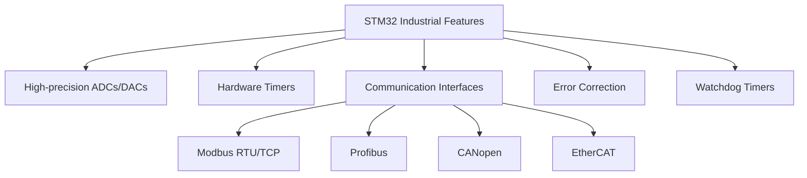

# STM32 Industrial Control

## Introduction

Industrial control systems are the backbone of modern manufacturing and process automation. These systems monitor and control industrial processes, from simple temperature regulation to complex assembly line operations. STM32 microcontrollers, with their powerful processing capabilities, rich peripheral set, and robust design, are excellent candidates for building industrial control applications.

In this tutorial, we'll explore how to use STM32 microcontrollers to develop industrial control systems. We'll start with the basics of industrial I/O handling, move on to implementing control algorithms like PID (Proportional-Integral-Derivative) controllers, and conclude with industrial communication protocols integration.

## Prerequisites

Before diving into this tutorial, you should have:

- Basic knowledge of STM32 microcontrollers
- Experience with STM32CubeIDE or similar development environment
- Understanding of C programming
- Access to an STM32 development board (preferably STM32F4 or STM32H7 series)

## Industrial Control Basics

### What Makes Control "Industrial"?

Industrial control systems differ from consumer electronics in several key aspects:

1. **Reliability**: Industrial systems must operate 24/7 with minimal downtime
2. **Robustness**: They must withstand harsh environments (temperature, vibration, electrical noise)
3. **Safety**: Failures must be handled gracefully without causing damage
4. **Precision**: Control loops often require high accuracy and deterministic timing
5. **Standards Compliance**: Must adhere to industry standards like IEC 61131

### STM32 Features for Industrial Applications

STM32 microcontrollers offer several features that make them suitable for industrial applications:



## Digital I/O for Industrial Control

### Reading Industrial Sensors

Industrial sensors often provide digital outputs that indicate states (ON/OFF) or use pulse-width modulation (PWM) to represent analog values. Let's implement a basic digital input reading function:

```c
/* Configure pin as input with pull-up */
void ConfigureDigitalInput(GPIO_TypeDef* GPIOx, uint16_t GPIO_Pin) {
    GPIO_InitTypeDef GPIO_InitStruct = {0};
    
    /* Enable GPIO clock */
    if(GPIOx == GPIOA)
        __HAL_RCC_GPIOA_CLK_ENABLE();
    else if(GPIOx == GPIOB)
        __HAL_RCC_GPIOB_CLK_ENABLE();
    /* Add other GPIO ports as needed */
    
    GPIO_InitStruct.Pin = GPIO_Pin;
    GPIO_InitStruct.Mode = GPIO_MODE_INPUT;
    GPIO_InitStruct.Pull = GPIO_PULLUP;
    GPIO_InitStruct.Speed = GPIO_SPEED_FREQ_LOW;
    
    HAL_GPIO_Init(GPIOx, &GPIO_InitStruct);
}

/* Read digital input with debouncing */
GPIO_PinState ReadDigitalInputDebounced(GPIO_TypeDef* GPIOx, uint16_t GPIO_Pin) {
    GPIO_PinState currentState = HAL_GPIO_ReadPin(GPIOx, GPIO_Pin);
    HAL_Delay(5); // Simple debounce delay
    
    if(currentState == HAL_GPIO_ReadPin(GPIOx, GPIO_Pin))
        return currentState;
    
    // If readings don't match, read a third time
    HAL_Delay(5);
    return HAL_GPIO_ReadPin(GPIOx, GPIO_Pin);
}
```

### Controlling Industrial Actuators

Industrial actuators like relays, solenoids, and motor drivers often require digital control signals. Here's a function to configure and control digital outputs:

```c
/* Configure pin as output */
void ConfigureDigitalOutput(GPIO_TypeDef* GPIOx, uint16_t GPIO_Pin) {
    GPIO_InitTypeDef GPIO_InitStruct = {0};
    
    /* Enable GPIO clock */
    if(GPIOx == GPIOA)
        __HAL_RCC_GPIOA_CLK_ENABLE();
    else if(GPIOx == GPIOB)
        __HAL_RCC_GPIOB_CLK_ENABLE();
    /* Add other GPIO ports as needed */
    
    GPIO_InitStruct.Pin = GPIO_Pin;
    GPIO_InitStruct.Mode = GPIO_MODE_OUTPUT_PP;
    GPIO_InitStruct.Pull = GPIO_NOPULL;
    GPIO_InitStruct.Speed = GPIO_SPEED_FREQ_MEDIUM;
    
    HAL_GPIO_Init(GPIOx, &GPIO_InitStruct);
}

/* Safe actuator control with error handling */
HAL_StatusTypeDef ControlActuator(GPIO_TypeDef* GPIOx, uint16_t GPIO_Pin, GPIO_PinState state) {
    // Safety check - ensure the pin is configured as output
    GPIO_InitTypeDef GPIO_InitStruct;
    uint32_t position = 0x00;
    uint32_t iocurrent = 0x00;
    uint32_t temp = 0x00;
    
    // Get current mode
    position = GPIO_Pin & 0x1F;
    iocurrent = (GPIOx->MODER >> (position * 2)) & GPIO_MODE;
    
    // Check if configured as output
    if(iocurrent != GPIO_MODE_OUTPUT_PP) {
        return HAL_ERROR;
    }
    
    // Set the pin state
    HAL_GPIO_WritePin(GPIOx, GPIO_Pin, state);
    
    // Verify pin state was set correctly
    if(HAL_GPIO_ReadPin(GPIOx, GPIO_Pin) != state) {
        return HAL_ERROR;
    }
    
    return HAL_OK;
}
```

## Analog I/O for Industrial Control

### Reading Analog Sensors

Industrial analog sensors (temperature, pressure, flow, etc.) often output 0-10V, 4-20mA, or other standard signals. STM32's ADCs can be configured to read these signals:

```c
#define ADC_RESOLUTION_12BIT 4095.0
#define VREF 3.3 // Reference voltage

/* Configure ADC for industrial sensor reading */
void ConfigureAnalogInput(ADC_HandleTypeDef* hadc, uint32_t Channel) {
    ADC_ChannelConfTypeDef sConfig = {0};
    
    sConfig.Channel = Channel;
    sConfig.Rank = 1;
    sConfig.SamplingTime = ADC_SAMPLETIME_480CYCLES; // Long sampling time for noise immunity
    
    HAL_ADC_ConfigChannel(hadc, &sConfig);
}

/* Read analog sensor with filtering */
float ReadAnalogSensor(ADC_HandleTypeDef* hadc) {
    uint32_t sum = 0;
    const uint8_t SAMPLES = 16; // Multiple samples for averaging
    
    for(uint8_t i = 0; i < SAMPLES; i++) {
        HAL_ADC_Start(hadc);
        HAL_ADC_PollForConversion(hadc, 100);
        sum += HAL_ADC_GetValue(hadc);
        HAL_Delay(1);
    }
    
    uint32_t averageADC = sum / SAMPLES;
    
    // Convert ADC value to voltage
    float voltage = (averageADC / ADC_RESOLUTION_12BIT) * VREF;
    
    return voltage;
}

/* Convert 4-20mA reading to engineering units */
float Convert4to20mA(float voltage, float minValue, float maxValue) {
    // Assuming voltage reading from a 4-20mA sensor with 165 ohm shunt resistor
    // 4mA * 165 ohm = 0.66V, 20mA * 165 ohm = 3.3V
    
    float currentmA = (voltage / 165.0) * 1000.0; // Convert to mA
    
    // Map 4-20mA to minValue-maxValue
    float engineeringValue = ((currentmA - 4.0) / 16.0) * (maxValue - minValue) + minValue;
    
    return engineeringValue;
}
```

### Analog Output Control

For precise control of analog actuators, STM32's DACs can be used to generate control signals:

```c
/* Configure DAC for analog output */
void ConfigureAnalogOutput(DAC_HandleTypeDef* hdac, uint32_t Channel) {
    DAC_ChannelConfTypeDef sConfig = {0};
    
    sConfig.DAC_Trigger = DAC_TRIGGER_NONE;
    sConfig.DAC_OutputBuffer = DAC_OUTPUTBUFFER_ENABLE;
    
    HAL_DAC_ConfigChannel(hdac, &sConfig, Channel);
    HAL_DAC_Start(hdac, Channel);
}

/* Set analog output with value limiting */
HAL_StatusTypeDef SetAnalogOutput(DAC_HandleTypeDef* hdac, uint32_t Channel, float value, float minValue, float maxValue) {
    // Limit the value to specified range
    if(value < minValue) value = minValue;
    if(value > maxValue) value = maxValue;
    
    // Map the value to 12-bit DAC range (0-4095)
    float normalized = (value - minValue) / (maxValue - minValue);
    uint32_t dacValue = (uint32_t)(normalized * 4095.0);
    
    // Set DAC output
    return HAL_DAC_SetValue(hdac, Channel, DAC_ALIGN_12B_R, dacValue);
}
```

## PID Controller Implementation

PID (Proportional-Integral-Derivative) controllers are fundamental in industrial control systems. Let's implement a basic PID controller on STM32:

```c
typedef struct {
    float Kp;          // Proportional gain
    float Ki;          // Integral gain
    float Kd;          // Derivative gain
    float setpoint;    // Desired value
    float integral;    // Accumulated error
    float prevError;   // Previous error for derivative
    float minOutput;   // Output limits
    float maxOutput;
    uint32_t lastTime; // For calculating dt
} PIDController;

/* Initialize PID controller */
void PID_Init(PIDController* pid, float Kp, float Ki, float Kd, float setpoint, float minOutput, float maxOutput) {
    pid->Kp = Kp;
    pid->Ki = Ki;
    pid->Kd = Kd;
    pid->setpoint = setpoint;
    pid->integral = 0.0f;
    pid->prevError = 0.0f;
    pid->minOutput = minOutput;
    pid->maxOutput = maxOutput;
    pid->lastTime = HAL_GetTick();
}

/* Compute PID output */
float PID_Compute(PIDController* pid, float processValue) {
    // Calculate time delta
    uint32_t now = HAL_GetTick();
    float dt = (float)(now - pid->lastTime) / 1000.0f; // Convert to seconds
    pid->lastTime = now;
    
    // Avoid division by zero
    if(dt <= 0.0f) dt = 0.001f;
    
    // Calculate error
    float error = pid->setpoint - processValue;
    
    // Proportional term
    float pTerm = pid->Kp * error;
    
    // Integral term with anti-windup
    pid->integral += error * dt;
    float iTerm = pid->Ki * pid->integral;
    
    // Derivative term (on measurement, not error, to avoid derivative kick)
    float dTerm = pid->Kd * (error - pid->prevError) / dt;
    pid->prevError = error;
    
    // Calculate total output
    float output = pTerm + iTerm + dTerm;
    
    // Apply output limits
    if(output > pid->maxOutput)
        output = pid->maxOutput;
    else if(output < pid->minOutput)
        output = pid->minOutput;
    
    return output;
}

/* Change setpoint with ramp to avoid sudden changes */
void PID_SetSetpoint(PIDController* pid, float setpoint, float maxRatePerSecond) {
    uint32_t now = HAL_GetTick();
    float dt = (float)(now - pid->lastTime) / 1000.0f;
    float maxChange = maxRatePerSecond * dt;
    
    if(setpoint > pid->setpoint) {
        pid->setpoint += (setpoint - pid->setpoint > maxChange) ? maxChange : (setpoint - pid->setpoint);
    } else {
        pid->setpoint -= (pid->setpoint - setpoint > maxChange) ? maxChange : (pid->setpoint - setpoint);
    }
}
```

### Example: Temperature Control System

Let's implement a temperature control system using our PID controller:

```c
/* Temperature control system example */
void TemperatureControlExample(void) {
    // Hardware setup
    ADC_HandleTypeDef hadc1;
    DAC_HandleTypeDef hdac1;
    PIDController tempController;
    
    // Initialize ADC and DAC (code not shown for brevity)
    
    // Configure temperature sensor input and heater output
    ConfigureAnalogInput(&hadc1, ADC_CHANNEL_0);
    ConfigureAnalogOutput(&hdac1, DAC_CHANNEL_1);
    
    // Initialize PID controller
    // Kp=2.0, Ki=0.5, Kd=1.0, setpoint=50.0°C, output range 0-100%
    PID_Init(&tempController, 2.0f, 0.5f, 1.0f, 50.0f, 0.0f, 100.0f);
    
    // Control loop
    while(1) {
        // Read temperature sensor (PT100 sensor, 0°C = 100Ω, 100°C = 138.5Ω)
        float voltage = ReadAnalogSensor(&hadc1);
        
        // Convert voltage to temperature
        // Example conversion for PT100 with signal conditioning circuit
        float temperature = (voltage - 0.5f) * 100.0f / 2.5f;
        
        // Compute PID output (0-100% heater power)
        float heaterPower = PID_Compute(&tempController, temperature);
        
        // Set heater output
        SetAnalogOutput(&hdac1, DAC_CHANNEL_1, heaterPower, 0.0f, 100.0f);
        
        // Display current status (if LCD or debug output available)
        
        // Delay for next control cycle (100ms for this example)
        HAL_Delay(100);
    }
}
```

## Industrial Communication Protocols

### Implementing Modbus RTU

Modbus is one of the most widely used industrial communication protocols. Here's a basic implementation for STM32:

```c
#define MODBUS_ADDRESS 0x01
#define MODBUS_BUFFER_SIZE 256

typedef struct {
    UART_HandleTypeDef* huart;
    uint8_t address;
    uint8_t rxBuffer[MODBUS_BUFFER_SIZE];
    uint8_t txBuffer[MODBUS_BUFFER_SIZE];
    uint16_t holdingRegisters[100];
    uint16_t inputRegisters[100];
    uint8_t coils[100];
    uint8_t discreteInputs[100];
} ModbusHandler;

/* Initialize Modbus RTU */
void Modbus_Init(ModbusHandler* modbus, UART_HandleTypeDef* huart, uint8_t address) {
    modbus->huart = huart;
    modbus->address = address;
    
    // Set UART for Modbus RTU (typically 9600 baud, 8 data bits, 1 stop bit, no parity)
    modbus->huart->Init.BaudRate = 9600;
    modbus->huart->Init.WordLength = UART_WORDLENGTH_8B;
    modbus->huart->Init.StopBits = UART_STOPBITS_1;
    modbus->huart->Init.Parity = UART_PARITY_NONE;
    HAL_UART_Init(modbus->huart);
    
    // Initialize registers and coils to 0
    memset(modbus->holdingRegisters, 0, sizeof(modbus->holdingRegisters));
    memset(modbus->inputRegisters, 0, sizeof(modbus->inputRegisters));
    memset(modbus->coils, 0, sizeof(modbus->coils));
    memset(modbus->discreteInputs, 0, sizeof(modbus->discreteInputs));
    
    // Start receiving
    HAL_UART_Receive_IT(modbus->huart, modbus->rxBuffer, 1);
}

/* Calculate Modbus CRC16 */
uint16_t Modbus_CRC16(uint8_t* buffer, uint16_t length) {
    uint16_t crc = 0xFFFF;
    
    for(uint16_t i = 0; i < length; i++) {
        crc ^= (uint16_t)buffer[i];
        
        for(uint8_t j = 0; j < 8; j++) {
            if(crc & 0x0001) {
                crc >>= 1;
                crc ^= 0xA001;
            } else {
                crc >>= 1;
            }
        }
    }
    
    return crc;
}

/* Process Modbus request */
void Modbus_ProcessRequest(ModbusHandler* modbus, uint16_t length) {
    // Minimum valid Modbus RTU frame is 4 bytes (address, function, CRC16)
    if(length < 4)
        return;
    
    // Check if message is for this device
    if(modbus->rxBuffer[0] != modbus->address && modbus->rxBuffer[0] != 0)
        return;
    
    // Check CRC
    uint16_t receivedCRC = (modbus->rxBuffer[length-1] << 8) | modbus->rxBuffer[length-2];
    uint16_t calculatedCRC = Modbus_CRC16(modbus->rxBuffer, length-2);
    
    if(receivedCRC != calculatedCRC)
        return;
    
    // Process function code
    uint8_t functionCode = modbus->rxBuffer[1];
    uint16_t responseLength = 0;
    
    switch(functionCode) {
        case 0x01: // Read Coils
            // Implement Read Coils function
            break;
            
        case 0x03: // Read Holding Registers
            {
                uint16_t startAddress = (modbus->rxBuffer[2] << 8) | modbus->rxBuffer[3];
                uint16_t quantity = (modbus->rxBuffer[4] << 8) | modbus->rxBuffer[5];
                
                // Check if request is valid
                if(startAddress + quantity > 100) {
                    // Respond with exception
                    modbus->txBuffer[0] = modbus->address;
                    modbus->txBuffer[1] = 0x83; // 0x80 + function code
                    modbus->txBuffer[2] = 0x02; // Illegal data address
                    responseLength = 3;
                } else {
                    // Prepare response
                    modbus->txBuffer[0] = modbus->address;
                    modbus->txBuffer[1] = functionCode;
                    modbus->txBuffer[2] = quantity * 2; // Byte count
                    
                    for(uint16_t i = 0; i < quantity; i++) {
                        modbus->txBuffer[3 + i*2] = modbus->holdingRegisters[startAddress + i] >> 8;
                        modbus->txBuffer[4 + i*2] = modbus->holdingRegisters[startAddress + i] & 0xFF;
                    }
                    
                    responseLength = 3 + quantity * 2;
                }
            }
            break;
            
        case 0x06: // Write Single Register
            {
                uint16_t address = (modbus->rxBuffer[2] << 8) | modbus->rxBuffer[3];
                uint16_t value = (modbus->rxBuffer[4] << 8) | modbus->rxBuffer[5];
                
                // Check if address is valid
                if(address >= 100) {
                    // Respond with exception
                    modbus->txBuffer[0] = modbus->address;
                    modbus->txBuffer[1] = 0x86; // 0x80 + function code
                    modbus->txBuffer[2] = 0x02; // Illegal data address
                    responseLength = 3;
                } else {
                    // Write value and prepare response (echo request)
                    modbus->holdingRegisters[address] = value;
                    memcpy(modbus->txBuffer, modbus->rxBuffer, 6);
                    responseLength = 6;
                }
            }
            break;
            
        // Add other function codes as needed
        
        default:
            // Unsupported function code
            modbus->txBuffer[0] = modbus->address;
            modbus->txBuffer[1] = 0x80 + functionCode;
            modbus->txBuffer[2] = 0x01; // Illegal function
            responseLength = 3;
            break;
    }
    
    // Add CRC to response
    uint16_t crc = Modbus_CRC16(modbus->txBuffer, responseLength);
    modbus->txBuffer[responseLength] = crc & 0xFF;
    modbus->txBuffer[responseLength + 1] = crc >> 8;
    responseLength += 2;
    
    // Send response
    HAL_UART_Transmit(modbus->huart, modbus->txBuffer, responseLength, 100);
}
```

### Integrating with Ethernet for Industrial IoT

STM32 microcontrollers with Ethernet capabilities can be used for industrial IoT applications:

```c
/* Example code to initialize Ethernet for industrial monitoring */
void InitializeIndustrialEthernet(void) {
    // Initialize Ethernet MAC and PHY
    // Code depends on specific STM32 model and HAL library version
    
    // Set up LWIP stack
    // Set up web server or MQTT client for IoT connectivity
    
    // Create a simple HTTP server for system monitoring
    httpd_init();
    
    // Register URI handlers
    httpd_uri_t status_uri = {
        .uri      = "/status",
        .method   = HTTP_GET,
        .handler  = statusHandler,
        .user_ctx = NULL
    };
    httpd_register_uri_handler(server, &status_uri);
}

/* HTTP handler for system status */
esp_err_t statusHandler(httpd_req_t *req) {
    char resp[512];
    
    // Read current system status
    float temperature = ReadAnalogSensor(&hadc1); // Temperature
    float pressure = ReadAnalogSensor(&hadc2);    // Pressure
    uint8_t systemState = GetSystemState();       // System state
    
    // Format JSON response
    sprintf(resp, "{"
                  "\"temperature\": %.2f,"
                  "\"pressure\": %.2f,"
                  "\"state\": %d,"
                  "\"uptime\": %lu"
                  "}",
                  temperature, pressure, systemState, HAL_GetTick()/1000);
    
    // Send response
    httpd_resp_set_type(req, "application/json");
    httpd_resp_send(req, resp, strlen(resp));
    
    return ESP_OK;
}
```

## Real-World Example: Motor Control System

Let's put everything together to create a complete industrial motor control system:

```c
/* Global variables */
PIDController speedController;
ModbusHandler modbusRTU;
uint8_t emergencyStop = 0;

/* Main application */
int main(void) {
    // Initialize system clock and peripherals
    HAL_Init();
    SystemClock_Config();
    
    // Initialize hardware
    GPIO_InitTypeDef GPIO_InitStruct = {0};
    ADC_HandleTypeDef hadc1;
    TIM_HandleTypeDef htim1;
    UART_HandleTypeDef huart2;
    
    // Configure emergency stop input
    ConfigureDigitalInput(GPIOA, GPIO_PIN_0);
    
    // Configure motor PWM output
    __HAL_RCC_TIM1_CLK_ENABLE();
    htim1.Instance = TIM1;
    htim1.Init.Prescaler = 0;
    htim1.Init.CounterMode = TIM_COUNTERMODE_UP;
    htim1.Init.Period = 1000; // PWM frequency = SystemClock / (Prescaler+1) / Period
    htim1.Init.ClockDivision = TIM_CLOCKDIVISION_DIV1;
    HAL_TIM_PWM_Init(&htim1);
    
    TIM_OC_InitTypeDef sConfigOC = {0};
    sConfigOC.OCMode = TIM_OCMODE_PWM1;
    sConfigOC.Pulse = 0;
    sConfigOC.OCPolarity = TIM_OCPOLARITY_HIGH;
    HAL_TIM_PWM_ConfigChannel(&htim1, &sConfigOC, TIM_CHANNEL_1);
    HAL_TIM_PWM_Start(&htim1, TIM_CHANNEL_1);
    
    // Configure speed feedback input (tachometer)
    ConfigureAnalogInput(&hadc1, ADC_CHANNEL_1);
    
    // Initialize PID controller for speed control
    PID_Init(&speedController, 1.0f, 0.2f, 0.1f, 0.0f, 0.0f, 1000.0f);
    
    // Initialize Modbus RTU communication
    Modbus_Init(&modbusRTU, &huart2, 0x01);
    
    // Map parameters to Modbus registers for remote monitoring and control
    // Holding Register 0: Speed setpoint (0-1000)
    // Holding Register 1: Kp * 100
    // Holding Register 2: Ki * 100
    // Holding Register 3: Kd * 100
    // Input Register 0: Current speed (0-1000)
    // Input Register 1: Motor current
    // Input Register 2: Motor temperature
    // Coil 0: Motor enable/disable
    
    // Main control loop
    while (1) {
        // Check emergency stop
        emergencyStop = !ReadDigitalInputDebounced(GPIOA, GPIO_PIN_0);
        
        if(emergencyStop) {
            // Immediately stop motor
            __HAL_TIM_SET_COMPARE(&htim1, TIM_CHANNEL_1, 0);
            modbusRTU.coils[0] = 0; // Update Modbus status
            continue;
        }
        
        // Get speed setpoint from Modbus
        speedController.setpoint = (float)modbusRTU.holdingRegisters[0];
        
        // Update PID parameters if changed via Modbus
        speedController.Kp = (float)modbusRTU.holdingRegisters[1] / 100.0f;
        speedController.Ki = (float)modbusRTU.holdingRegisters[2] / 100.0f;
        speedController.Kd = (float)modbusRTU.holdingRegisters[3] / 100.0f;
        
        // Check if motor is enabled via Modbus
        if(!modbusRTU.coils[0]) {
            __HAL_TIM_SET_COMPARE(&htim1, TIM_CHANNEL_1, 0);
            continue;
        }
        
        // Read current speed from tachometer
        float voltage = ReadAnalogSensor(&hadc1);
        float currentSpeed = (voltage / 3.3f) * 1000.0f; // Scale to 0-1000 range
        
        // Update Modbus input register with current speed
        modbusRTU.inputRegisters[0] = (uint16_t)currentSpeed;
        
        // Compute PID output
        float motorPWM = PID_Compute(&speedController, currentSpeed);
        
        // Set motor speed via PWM
        __HAL_TIM_SET_COMPARE(&htim1, TIM_CHANNEL_1, (uint32_t)motorPWM);
        
        // Read motor current (if current sensor available)
        // Read motor temperature (if temperature sensor available)
        
        // Process any received Modbus messages
        // Note: In a real application, this would be done in UART interrupt handler
        
        // Delay for next control cycle (10ms for this example)
        HAL_Delay(10);
    }
}
```

## Advanced Topics

### Fault Detection and Handling

Industrial control systems must be able to detect and handle faults gracefully:

```c
typedef enum {
    FAULT_NONE = 0,
    FAULT_OVERCURRENT,
    FAULT_OVERVOLTAGE,
    FAULT_UNDERVOLTAGE,
    FAULT_OVERTEMPERATURE,
    FAULT_COMMUNICATION,
    FAULT_SENSOR
} FaultType;

typedef struct {
    FaultType type;
    uint32_t timestamp;
    float value;
    char description[64];
} FaultRecord;

#define FAULT_HISTORY_SIZE 10
FaultRecord faultHistory[FAULT_HISTORY_SIZE];
uint8_t faultHistoryIndex = 0;
uint8_t activeFaults = 0;

/* Record a new fault */
void RecordFault(FaultType type, float value, const char* description) {
    // Store fault in history
    faultHistory[faultHistoryIndex].type = type;
    faultHistory[faultHistoryIndex].timestamp = HAL_GetTick();
    faultHistory[faultHistoryIndex].value = value;
    strncpy(faultHistory[faultHistoryIndex].description, description, 63);
    faultHistory[faultHistoryIndex].description[63] = '\0';
    
    // Update index (circular buffer)
    faultHistoryIndex = (faultHistoryIndex + 1) % FAULT_HISTORY_SIZE;
    
    // Set active fault flag
    activeFaults |= (1 << type);
    
    // Log fault (e.g., to UART, SD card, etc.)
    
    // Handle fault based on type
    switch(type) {
        case FAULT_OVERCURRENT:
        case FAULT_OVERVOLTAGE:
        case FAULT_OVERTEMPERATURE:
            // Critical faults - immediately shut down
            EmergencyShutdown();
            break;
            
        case FAULT_UNDERVOLTAGE:
        case FAULT_SENSOR:
            // Non-critical faults - continue with reduced functionality
            break;
            
        case FAULT_COMMUNICATION:
            // Communication faults - retry or switch to