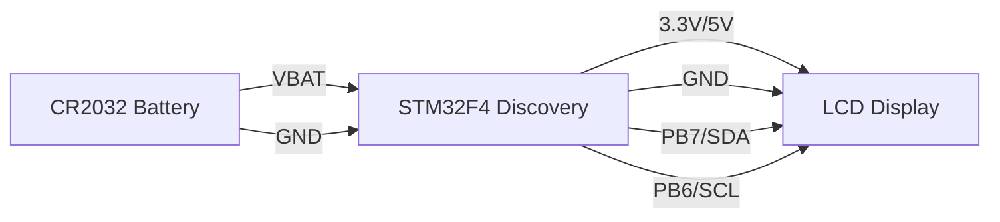

# STM32 Digital Clock

## Introduction

Building a digital clock is a fantastic project for beginners working with STM32 microcontrollers. This project combines several fundamental concepts in embedded programming: working with the Real-Time Clock (RTC), interfacing with displays, managing time, and creating a user interface. By following this tutorial, you'll create a functional digital clock that can display the time and date, and even be extended with features like alarms or timers.

The STM32 family of microcontrollers is particularly well-suited for this project because they include built-in RTC modules that can maintain accurate time, even during power loss (with battery backup).

## Prerequisites

Before starting this project, make sure you have:

1. An STM32 development board (this tutorial uses the STM32F4 Discovery board, but can be adapted for other STM32 boards)
2. An LCD display (we'll use a 16x2 character LCD with I2C interface)
3. Jumper wires
4. STM32CubeIDE installed
5. Basic understanding of C programming
6. Basic knowledge of STM32 GPIO operations

## Hardware Setup

### Components Required

- STM32F4 Discovery Board (or any STM32 board)
- 16x2 LCD with I2C interface
- 3V CR2032 battery (for RTC backup)
- Breadboard and jumper wires

### Connections

Connect the LCD display to the STM32 board:

- Connect VCC of LCD to 5V or 3.3V of STM32 (check your LCD's requirements)
- Connect GND of LCD to GND of STM32
- Connect SDA of LCD to SDA pin of STM32 (PB7 on STM32F4 Discovery)
- Connect SCL of LCD to SCL pin of STM32 (PB6 on STM32F4 Discovery)

For RTC battery backup (optional but recommended):
- Connect the positive terminal of CR2032 battery to VBAT pin
- Connect the negative terminal to GND

Here's a diagram of the connections:



## Project Overview

Our digital clock project will consist of these main components:

1. **RTC Configuration** - Setting up the STM32's Real-Time Clock
2. **LCD Interface** - Code to communicate with the LCD display
3. **Time Display** - Formatting and displaying time
4. **User Interface** - Adding buttons to set the time
5. **Battery Backup** - Maintaining time during power loss

Let's build each component step by step.

## Setting Up the Project

### Creating a New Project in STM32CubeIDE

1. Open STM32CubeIDE and create a new STM32 project
2. Select your board (or your specific STM32 microcontroller)
3. Give your project a name (e.g., "STM32_Digital_Clock")
4. In the device configuration tool (CubeMX):
   - Configure the RTC clock source (LSE is recommended for accuracy)
   - Set up I2C peripheral for LCD communication
   - Configure GPIO pins for user buttons
   - Generate the code

### Configuring the RTC

The RTC (Real-Time Clock) is a key component of our digital clock. Here's how to configure it:

```c
// RTC initialization function
void RTC_Init(void) {
  RTC_TimeTypeDef sTime = {0};
  RTC_DateTypeDef sDate = {0};
  
  // Enable RTC
  __HAL_RCC_RTC_ENABLE();
  
  // Initialize RTC
  hrtc.Instance = RTC;
  hrtc.Init.HourFormat = RTC_HOURFORMAT_24;
  hrtc.Init.AsynchPrediv = 127;
  hrtc.Init.SynchPrediv = 255;
  hrtc.Init.OutPut = RTC_OUTPUT_DISABLE;
  if (HAL_RTC_Init(&hrtc) != HAL_OK) {
    Error_Handler();
  }
  
  // Set default time 12:00:00
  sTime.Hours = 12;
  sTime.Minutes = 0;
  sTime.Seconds = 0;
  sTime.DayLightSaving = RTC_DAYLIGHTSAVING_NONE;
  sTime.StoreOperation = RTC_STOREOPERATION_RESET;
  if (HAL_RTC_SetTime(&hrtc, &sTime, RTC_FORMAT_BIN) != HAL_OK) {
    Error_Handler();
  }
  
  // Set default date 01/01/2023
  sDate.WeekDay = RTC_WEEKDAY_MONDAY;
  sDate.Month = RTC_MONTH_JANUARY;
  sDate.Date = 1;
  sDate.Year = 23;
  if (HAL_RTC_SetDate(&hrtc, &sDate, RTC_FORMAT_BIN) != HAL_OK) {
    Error_Handler();
  }
}
```

### LCD Driver

For our project, we'll use an I2C LCD display. Here's a simple driver to interface with it:

```c
#include "lcd_i2c.h"

// I2C handle declaration
extern I2C_HandleTypeDef hi2c1;
#define LCD_I2C_ADDR 0x27 << 1  // I2C address of the LCD (shifted left)

// Send command to LCD
void LCD_SendCommand(uint8_t cmd) {
  uint8_t data_buf[4];
  data_buf[0] = 0x0C;  // Enable=1, RW=0, RS=0
  data_buf[1] = cmd & 0xF0;  // Higher nibble
  data_buf[2] = 0x08;  // Enable=0, RW=0, RS=0
  data_buf[3] = (cmd << 4) & 0xF0;  // Lower nibble
  HAL_I2C_Master_Transmit(&hi2c1, LCD_I2C_ADDR, data_buf, 4, 100);
}

// Send data to LCD
void LCD_SendData(uint8_t data) {
  uint8_t data_buf[4];
  data_buf[0] = 0x0D;  // Enable=1, RW=0, RS=1
  data_buf[1] = data & 0xF0;  // Higher nibble
  data_buf[2] = 0x09;  // Enable=0, RW=0, RS=1
  data_buf[3] = (data << 4) & 0xF0;  // Lower nibble
  HAL_I2C_Master_Transmit(&hi2c1, LCD_I2C_ADDR, data_buf, 4, 100);
}

// Initialize LCD
void LCD_Init(void) {
  // Wait for LCD to power up
  HAL_Delay(50);
  
  // 4-bit initialization sequence
  LCD_SendCommand(0x30);
  HAL_Delay(5);
  LCD_SendCommand(0x30);
  HAL_Delay(1);
  LCD_SendCommand(0x30);
  HAL_Delay(10);
  LCD_SendCommand(0x20);  // 4-bit mode
  HAL_Delay(10);
  
  // Configure display
  LCD_SendCommand(0x28);  // 4-bit, 2 lines, 5x8 font
  LCD_SendCommand(0x08);  // Display off
  LCD_SendCommand(0x01);  // Clear display
  HAL_Delay(2);
  LCD_SendCommand(0x06);  // Entry mode set
  LCD_SendCommand(0x0C);  // Display on, cursor off
}

// Clear display
void LCD_Clear(void) {
  LCD_SendCommand(0x01);
  HAL_Delay(2);
}

// Set cursor position
void LCD_SetCursor(uint8_t row, uint8_t col) {
  uint8_t row_offsets[] = {0x00, 0x40};
  LCD_SendCommand(0x80 | (col + row_offsets[row]));
}

// Print string
void LCD_Print(char *str) {
  while (*str) {
    LCD_SendData(*str++);
  }
}
```

## Main Digital Clock Application

Now, let's implement the main application that combines the RTC and LCD to create our digital clock:

```c
#include "main.h"
#include "lcd_i2c.h"
#include <stdio.h>

I2C_HandleTypeDef hi2c1;
RTC_HandleTypeDef hrtc;

void SystemClock_Config(void);
static void MX_GPIO_Init(void);
static void MX_I2C1_Init(void);
static void MX_RTC_Init(void);
void RTC_Init(void);
void DisplayTime(void);
void DisplayDate(void);

int main(void) {
  // Initialize HAL
  HAL_Init();
  
  // Configure system clock
  SystemClock_Config();
  
  // Initialize peripherals
  MX_GPIO_Init();
  MX_I2C1_Init();
  MX_RTC_Init();
  
  // Initialize LCD
  LCD_Init();
  LCD_Clear();
  LCD_SetCursor(0, 0);
  LCD_Print("STM32 Clock");
  HAL_Delay(2000);
  LCD_Clear();
  
  // Main loop
  while (1) {
    DisplayTime();
    DisplayDate();
    HAL_Delay(500);  // Update display every 500ms
  }
}

// Display the current time on LCD
void DisplayTime(void) {
  RTC_TimeTypeDef sTime;
  char timeStr[16];
  
  // Get current time
  HAL_RTC_GetTime(&hrtc, &sTime, RTC_FORMAT_BIN);
  
  // Format time string (HH:MM:SS)
  sprintf(timeStr, "Time: %02d:%02d:%02d", sTime.Hours, sTime.Minutes, sTime.Seconds);
  
  // Display on LCD
  LCD_SetCursor(0, 0);
  LCD_Print(timeStr);
}

// Display the current date on LCD
void DisplayDate(void) {
  RTC_DateTypeDef sDate;
  char dateStr[16];
  char *weekDay[] = {"Mon", "Tue", "Wed", "Thu", "Fri", "Sat", "Sun"};
  
  // Get current date
  HAL_RTC_GetDate(&hrtc, &sDate, RTC_FORMAT_BIN);
  
  // Format date string (DD/MM/YY DOW)
  sprintf(dateStr, "Date: %02d/%02d/%02d %s", 
          sDate.Date, sDate.Month, sDate.Year, 
          weekDay[sDate.WeekDay - 1]);
  
  // Display on LCD
  LCD_SetCursor(1, 0);
  LCD_Print(dateStr);
}
```

## Adding Time Setting Functionality

Let's add buttons to set the time:

```c
// Global variables for time setting mode
uint8_t settingMode = 0;  // 0: Normal, 1: Hours, 2: Minutes, 3: Seconds
uint8_t buttonPressed = 0;

// Button press handler (to be called from GPIO interrupt)
void HAL_GPIO_EXTI_Callback(uint16_t GPIO_Pin) {
  if (GPIO_Pin == MODE_BTN_Pin) {
    settingMode = (settingMode + 1) % 4;  // Cycle through modes
    buttonPressed = 1;
  }
  else if (GPIO_Pin == UP_BTN_Pin) {
    if (settingMode > 0) {
      // Update time based on current setting mode
      RTC_TimeTypeDef sTime;
      HAL_RTC_GetTime(&hrtc, &sTime, RTC_FORMAT_BIN);
      
      switch (settingMode) {
        case 1:  // Hours
          sTime.Hours = (sTime.Hours + 1) % 24;
          break;
        case 2:  // Minutes
          sTime.Minutes = (sTime.Minutes + 1) % 60;
          break;
        case 3:  // Seconds
          sTime.Seconds = (sTime.Seconds + 1) % 60;
          break;
      }
      
      HAL_RTC_SetTime(&hrtc, &sTime, RTC_FORMAT_BIN);
      buttonPressed = 1;
    }
  }
}

// Modified DisplayTime to show setting mode
void DisplayTime(void) {
  RTC_TimeTypeDef sTime;
  char timeStr[16];
  
  // Get current time
  HAL_RTC_GetTime(&hrtc, &sTime, RTC_FORMAT_BIN);
  
  // Format time string (HH:MM:SS)
  if (settingMode == 0) {
    sprintf(timeStr, "Time: %02d:%02d:%02d", sTime.Hours, sTime.Minutes, sTime.Seconds);
  }
  else {
    // In setting mode, make the current setting blink
    if (HAL_GetTick() % 1000 < 500) {
      switch (settingMode) {
        case 1:  // Hours
          sprintf(timeStr, "Time: __:%02d:%02d", sTime.Minutes, sTime.Seconds);
          break;
        case 2:  // Minutes
          sprintf(timeStr, "Time: %02d:__:%02d", sTime.Hours, sTime.Seconds);
          break;
        case 3:  // Seconds
          sprintf(timeStr, "Time: %02d:%02d:__", sTime.Hours, sTime.Minutes);
          break;
      }
    }
    else {
      sprintf(timeStr, "Time: %02d:%02d:%02d", sTime.Hours, sTime.Minutes, sTime.Seconds);
    }
  }
  
  // Display on LCD
  LCD_SetCursor(0, 0);
  LCD_Print(timeStr);
}
```

## Advanced Features: Alarm Functionality

Let's add a simple alarm feature to our digital clock:

```c
// Global variables for alarm
uint8_t alarmHours = 7;
uint8_t alarmMinutes = 0;
uint8_t alarmEnabled = 0;

// Check and trigger alarm
void CheckAlarm(void) {
  RTC_TimeTypeDef sTime;
  
  // Get current time
  HAL_RTC_GetTime(&hrtc, &sTime, RTC_FORMAT_BIN);
  
  // Check if alarm should trigger
  if (alarmEnabled && 
      sTime.Hours == alarmHours && 
      sTime.Minutes == alarmMinutes && 
      sTime.Seconds == 0) {
    // Trigger alarm - beep or flash LED
    HAL_GPIO_WritePin(ALARM_LED_GPIO_Port, ALARM_LED_Pin, GPIO_PIN_SET);
    HAL_Delay(500);
    HAL_GPIO_WritePin(ALARM_LED_GPIO_Port, ALARM_LED_Pin, GPIO_PIN_RESET);
  }
}

// Display alarm status
void DisplayAlarm(void) {
  char alarmStr[16];
  
  sprintf(alarmStr, "Alarm: %02d:%02d %s", 
          alarmHours, alarmMinutes, 
          alarmEnabled ? "ON " : "OFF");
  
  LCD_SetCursor(1, 0);
  LCD_Print(alarmStr);
}

// Toggle alarm state
void ToggleAlarm(void) {
  alarmEnabled = !alarmEnabled;
}

// Set alarm time
void SetAlarmTime(uint8_t hours, uint8_t minutes) {
  alarmHours = hours;
  alarmMinutes = minutes;
}
```

## Complete Project Integration

Now let's update our main function to integrate all these features:

```c
int main(void) {
  // Initialize HAL
  HAL_Init();
  
  // Configure system clock
  SystemClock_Config();
  
  // Initialize peripherals
  MX_GPIO_Init();
  MX_I2C1_Init();
  MX_RTC_Init();
  
  // Initialize LCD
  LCD_Init();
  LCD_Clear();
  LCD_SetCursor(0, 0);
  LCD_Print("STM32 Digital");
  LCD_SetCursor(1, 0);
  LCD_Print("Clock v1.0");
  HAL_Delay(2000);
  LCD_Clear();
  
  uint8_t displayMode = 0;  // 0: Time & Date, 1: Time & Alarm
  
  // Main loop
  while (1) {
    // Display current view
    if (displayMode == 0) {
      DisplayTime();
      DisplayDate();
    } else {
      DisplayTime();
      DisplayAlarm();
    }
    
    // Check alarm
    CheckAlarm();
    
    // Check if button was pressed
    if (buttonPressed) {
      buttonPressed = 0;
      
      // Handle display mode switching
      if (settingMode == 0) {
        // Long press on mode button (detected elsewhere)
        if (longButtonPress) {
          displayMode = !displayMode;
          longButtonPress = 0;
          LCD_Clear();
        }
      }
    }
    
    HAL_Delay(100);  // Update interval
  }
}
```

## Considerations for Power-Efficient Operation

For a digital clock, power efficiency is important, especially if you plan to run it on batteries. Here are some power-saving techniques:

```c
// Power-saving mode implementation
void EnterLowPowerMode(void) {
  // Dim LCD backlight (if controllable)
  // HAL_GPIO_WritePin(LCD_BL_GPIO_Port, LCD_BL_Pin, GPIO_PIN_RESET);
  
  // Reduce LCD update frequency
  // Instead of updating every 100ms, update every second
  
  // Put MCU in sleep mode between updates
  HAL_SuspendTick();
  HAL_PWR_EnterSLEEPMode(PWR_LOWPOWERREGULATOR_ON, PWR_SLEEPENTRY_WFI);
  HAL_ResumeTick();
}

// Wake up from low power mode
void ExitLowPowerMode(void) {
  // Restore LCD backlight
  // HAL_GPIO_WritePin(LCD_BL_GPIO_Port, LCD_BL_Pin, GPIO_PIN_SET);
  
  // Resume normal update frequency
}
```

## Testing and Debugging

When developing your digital clock, use these debugging techniques:

1. Monitor the I2C communication using a logic analyzer if available
2. Print debug messages via UART if LCD isn't working
3. Use LEDs to indicate the current state or errors
4. Verify RTC settings by reading back registers

## Challenges and Extensions

Once you have your basic digital clock working, try these extensions:

1. **Multiple Time Zones**: Add support for displaying multiple time zones
2. **Temperature Display**: Add a temperature sensor and display current temperature
3. **Calendar**: Implement a full calendar function
4. **Stopwatch/Timer**: Add stopwatch or countdown timer functionality
5. **Custom Characters**: Create custom characters for special symbols on the LCD

## Complete Header Files

For completeness, here are the header files you'll need:

```c
// lcd_i2c.h
#ifndef LCD_I2C_H
#define LCD_I2C_H

#include "main.h"

void LCD_Init(void);
void LCD_SendCommand(uint8_t cmd);
void LCD_SendData(uint8_t data);
void LCD_Clear(void);
void LCD_SetCursor(uint8_t row, uint8_t col);
void LCD_Print(char *str);

#endif /* LCD_I2C_H */
```

## Summary

In this tutorial, you've learned how to build a digital clock using an STM32 microcontroller. We covered:

1. Setting up the STM32 RTC for keeping accurate time
2. Interfacing with an I2C LCD display
3. Implementing a user interface with buttons
4. Adding alarm functionality
5. Power-saving considerations
6. Extending the project with additional features

This project demonstrates several key embedded systems concepts: peripheral interfacing, time management, user input handling, and power management. By completing this project, you've gained valuable experience that will help you with more advanced STM32 projects in the future.

## Additional Resources

- [STM32 HAL RTC Documentation](https://www.st.com/resource/en/user_manual/dm00105879-description-of-stm32f4-hal-and-ll-drivers-stmicroelectronics.pdf)
- [Working with I2C LCDs](https://controllerstech.com/i2c-lcd-in-stm32/)
- [STM32 Power Modes](https://www.st.com/resource/en/application_note/dm00025071-getting-started-with-stm32f4xxxx-mcu-hardware-development-stmicroelectronics.pdf)

## Exercises

1. Modify the code to display time in 12-hour format with AM/PM indicator
2. Add support for daylight saving time adjustments
3. Implement a menu system for setting date, time, and alarms
4. Add an external EEPROM to store user preferences
5. Implement a backup battery monitoring system

Happy coding with your STM32 Digital Clock project!