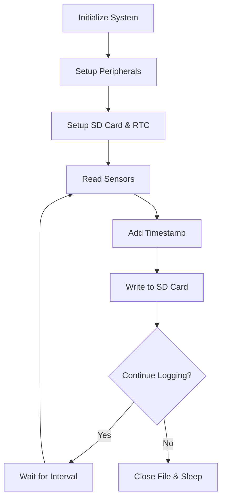

# STM32 Data Logger

## Introduction

A data logger is a device that captures and records measurements from sensors over time. It's one of the most practical applications of microcontrollers in the real world, used in weather stations, industrial monitoring, scientific research, and many DIY projects.

In this tutorial, we'll build a data logger using an STM32 microcontroller that can:

1. Read data from various sensors
2. Process the collected data
3. Store data on an SD card
4. Provide timestamps for each measurement
5. Operate autonomously on battery power

This project is perfect for beginners who want to learn about interfacing sensors, managing storage, and developing practical embedded applications.

## Required Hardware

To follow along with this tutorial, you'll need:

- STM32F4 Discovery board (or any STM32 development board)
- SD card module with SPI interface
- DS3231 RTC (Real-Time Clock) module
- Sensors (we'll use DHT11 for temperature/humidity and BMP280 for pressure)
- Breadboard and jumper wires
- Micro USB cable
- 3.7V LiPo battery (optional, for portable operation)

## Required Software

- STM32CubeIDE (or your preferred STM32 development environment)
- FatFs library (for SD card operations)
- Sensor libraries (for DHT11 and BMP280)

## Project Overview

Let's start by understanding how our data logger will work:



Our logger will initialize the system, set up necessary peripherals, then enter a loop where it reads sensor values, timestamps them, and saves the data to an SD card. This cycle repeats at a specified interval until manually stopped or until battery depletion.

## Step 1: Setting Up the Project

Let's start by creating a new project in STM32CubeIDE:

1. Launch STM32CubeIDE
2. Create a new STM32 project
3. Select your development board (we'll use STM32F407G-DISC1 for this tutorial)
4. Configure the project with default settings

Next, we'll need to configure the STM32 peripherals using the CubeMX graphical interface:

- Enable the SPI peripheral for the SD card module
- Set up I2C for the RTC and pressure sensor
- Configure a GPIO pin for the DHT11 sensor
- Enable a timer for interval-based logging
- Configure low-power modes (optional)

## Step 2: Connecting the Hardware

Let's connect our components:

### SD Card Module (SPI Connection)
- CS → PA4
- SCK → PA5 (SPI1_SCK)
- MISO → PA6 (SPI1_MISO)
- MOSI → PA7 (SPI1_MOSI)
- VCC → 3.3V
- GND → GND

### RTC Module (I2C Connection)
- SCL → PB6 (I2C1_SCL)
- SDA → PB7 (I2C1_SDA)
- VCC → 3.3V
- GND → GND

### DHT11 Temperature/Humidity Sensor
- DATA → PC0
- VCC → 3.3V
- GND → GND

### BMP280 Pressure Sensor (I2C Connection)
- SCL → PB6 (I2C1_SCL)
- SDA → PB7 (I2C1_SDA)
- VCC → 3.3V
- GND → GND

## Step 3: Setting Up the SD Card Interface

First, let's initialize the SD card using the FatFs library. Add the FATFS middleware to your project through the CubeMX interface.

Here's the code to initialize the SD card:

```c
/* Private includes */
#include "fatfs.h"

/* Private variables */
FATFS fs;  /* File system object */
FIL logFile;  /* File object */
FRESULT result;
char fileName[13] = "LOG000.CSV";

/* Initialize SD card function */
uint8_t SD_Init(void)
{
  /* Mount the file system */
  result = f_mount(&fs, "", 1);
  if (result != FR_OK)
  {
    /* Handle error */
    return 0;
  }
  
  /* Find an available filename (LOG000.CSV to LOG999.CSV) */
  for (int i = 0; i < 1000; i++)
  {
    sprintf(fileName, "LOG%03d.CSV", i);
    if (f_open(&logFile, fileName, FA_READ) != FR_OK)
    {
      /* File doesn't exist, so we can use this name */
      break;
    }
    f_close(&logFile);
  }
  
  /* Create and open the new log file for writing */
  result = f_open(&logFile, fileName, FA_WRITE | FA_CREATE_ALWAYS);
  if (result != FR_OK)
  {
    /* Handle error */
    return 0;
  }
  
  /* Write CSV header */
  f_printf(&logFile, "Time,Temperature (C),Humidity (%),Pressure (hPa)
");
  f_sync(&logFile);
  
  return 1;
}
```

## Step 4: Reading from Sensors

Let's implement functions to read from our sensors:

### DHT11 Temperature/Humidity Sensor

```c
#include "main.h"
#include "dht.h"

DHT_DataTypedef DHT11_Data;
GPIO_TypeDef* DHT11_PORT = GPIOC;
uint16_t DHT11_PIN = GPIO_PIN_0;

float readTemperature(void)
{
  DHT_GetData(&DHT11_Data);
  return DHT11_Data.Temperature;
}

float readHumidity(void)
{
  DHT_GetData(&DHT11_Data);
  return DHT11_Data.Humidity;
}
```

### BMP280 Pressure Sensor

```c
#include "bmp280.h"

BMP280_HandleTypedef bmp280;

float readPressure(void)
{
  float pressure;
  BMP280_ReadPressure(&pressure);
  return pressure / 100.0; // Convert Pa to hPa
}

void initBMP280(void)
{
  bmp280.i2c = &hi2c1;
  bmp280.addr = BMP280_I2C_ADDRESS_1;
  BMP280_Init(&bmp280);
}
```

## Step 5: Setting Up the Real-Time Clock

We need to set up the DS3231 RTC to provide accurate timestamps for our measurements:

```c
#include "ds3231.h"

RTC_HandleTypeDef hrtc;
RTC_TimeTypeDef sTime;
RTC_DateTypeDef sDate;

void RTC_Init(void)
{
  // Initialize the DS3231 module
  DS3231_Init(&hi2c1);
  
  // Get the time from DS3231
  DS3231_GetTime(&hi2c1, &sTime);
  DS3231_GetDate(&hi2c1, &sDate);
}

void getTimeStamp(char* timeBuffer)
{
  // Get current time from DS3231
  DS3231_GetTime(&hi2c1, &sTime);
  DS3231_GetDate(&hi2c1, &sDate);
  
  // Format the timestamp as YYYY-MM-DD HH:MM:SS
  sprintf(timeBuffer, "%04d-%02d-%02d %02d:%02d:%02d",
          2000 + sDate.Year, sDate.Month, sDate.Date,
          sTime.Hours, sTime.Minutes, sTime.Seconds);
}
```

## Step 6: Logging Data

Now, let's combine everything to log data to the SD card:

```c
void logData(void)
{
  char timeBuffer[20];
  float temperature, humidity, pressure;
  
  // Get current timestamp
  getTimeStamp(timeBuffer);
  
  // Read sensor values
  temperature = readTemperature();
  humidity = readHumidity();
  pressure = readPressure();
  
  // Write data to SD card
  f_printf(&logFile, "%s,%.1f,%.1f,%.1f
", 
           timeBuffer, temperature, humidity, pressure);
  
  // Ensure data is written by syncing
  f_sync(&logFile);
  
  // For debugging
  printf("Logged: %s, Temp: %.1fC, Humidity: %.1f%%, Pressure: %.1fhPa\r
",
         timeBuffer, temperature, humidity, pressure);
}
```

## Step 7: Main Program Loop

Let's put everything together in our main function:

```c
#include "main.h"
#include "fatfs.h"
#include "dht.h"
#include "bmp280.h"
#include "ds3231.h"

// Timer handle for interval timing
TIM_HandleTypeDef htim2;

// Sample interval in seconds
#define LOGGING_INTERVAL 60

int main(void)
{
  /* MCU Configuration */
  HAL_Init();
  SystemClock_Config();
  
  /* Initialize all configured peripherals */
  MX_GPIO_Init();
  MX_SPI1_Init();
  MX_I2C1_Init();
  MX_FATFS_Init();
  MX_TIM2_Init();
  
  /* Initialize sensors */
  initBMP280();
  
  /* Initialize RTC */
  RTC_Init();
  
  /* Initialize SD card */
  if (!SD_Init())
  {
    /* SD initialization failed */
    Error_Handler();
  }
  
  /* Start timer for interval logging */
  HAL_TIM_Base_Start_IT(&htim2);
  
  /* Infinite loop */
  while (1)
  {
    /* Wait for timer interrupt to log data */
    HAL_Delay(100);
  }
}

/* Timer callback for regular logging */
void HAL_TIM_PeriodElapsedCallback(TIM_HandleTypeDef *htim)
{
  if (htim->Instance == TIM2)
  {
    /* Log data at the specified interval */
    logData();
  }
}
```

## Step 8: Power Management (Optional)

For a battery-powered data logger, we need to implement power management:

```c
void enterLowPowerMode(void)
{
  /* Close the file before sleep to ensure data is saved */
  f_close(&logFile);
  
  /* Enter stop mode until next RTC alarm */
  HAL_PWR_EnterSTOPMode(PWR_LOWPOWERREGULATOR_ON, PWR_STOPENTRY_WFI);
  
  /* System will wake up from STOP mode, need to reconfigure clocks */
  SystemClock_Config();
  
  /* Reopen the log file */
  f_open(&logFile, fileName, FA_OPEN_APPEND | FA_WRITE);
}
```

This function can be called instead of `HAL_Delay()` to save power between logging intervals.

## Real-World Applications

Let's look at some practical applications of your STM32 data logger:

1. **Weather Monitoring Station**: Place your data logger outdoors to collect temperature, humidity, and pressure data over time. Add a light sensor to monitor sunlight and a rain gauge to measure precipitation.

2. **Home Energy Monitoring**: Connect your data logger to current sensors to track power consumption of appliances over time.

3. **Plant Growth Monitoring**: Use soil moisture sensors and light sensors to track conditions for growing plants. This data helps optimize watering schedules and lighting.

4. **Machine Health Monitoring**: Attach vibration and temperature sensors to industrial equipment to detect potential failures before they occur.

5. **Environmental Research**: Deploy multiple data loggers to collect data across different locations for scientific research projects.

## Extending Your Data Logger

Once you've built the basic data logger, you can extend it with these advanced features:

1. **Wireless Connectivity**: Add Bluetooth or WiFi to transmit data to a computer or smartphone in real-time.

2. **Solar Power**: Connect a small solar panel to make your data logger self-sustaining for long-term deployment.

3. **Multiple Sensor Support**: Design your code to support multiple sensor types that can be hot-swapped.

4. **Data Visualization**: Create a simple PC application to visualize the logged data in graphs and charts.

5. **Advanced Power Management**: Implement more sophisticated sleep modes to extend battery life to weeks or months.

## Troubleshooting

Here are some common issues you might encounter:

1. **SD Card Not Detected**: Ensure proper wiring and check that your SD card is formatted as FAT32.

2. **Sensor Reading Errors**: Verify power connections and check that pull-up resistors are properly installed where needed.

3. **Inaccurate Timestamps**: Make sure the RTC module has a backup battery and is properly initialized.

4. **System Lockups**: Implement a watchdog timer to reset the system if it becomes unresponsive.

5. **Battery Drains Quickly**: Review your power management code and ensure peripherals are properly put to sleep when not in use.

## Summary

In this tutorial, we've built a versatile STM32-based data logger that can:

- Read multiple sensors (temperature, humidity, pressure)
- Store data on an SD card in CSV format
- Provide accurate timestamps for measurements
- Operate autonomously
- Manage power efficiently

This project demonstrates key embedded systems concepts including:
- Interfacing with various sensors using different protocols
- Managing file systems on external storage
- Working with real-time clocks
- Implementing power management techniques
- Developing a complete, practical embedded application

## Additional Exercises

1. **Add More Sensors**: Extend your data logger to include light, air quality, or sound level sensors.

2. **Implement Triggers**: Program your logger to increase sampling rate when certain conditions are met (e.g., temperature rises above a threshold).

3. **Create Configuration File**: Allow users to change logging parameters by reading a configuration file from the SD card.

4. **Add an Alert System**: Make your data logger trigger an alarm or send an alert when readings exceed predefined limits.

5. **Develop a User Interface**: Add a small OLED display and buttons to make the data logger configurable in the field without a computer.

## Additional Resources

- STM32 HAL Documentation
- FatFs Documentation for file system operations
- Sensor datasheets (DHT11, BMP280, DS3231)
- Power management techniques for STM32 microcontrollers
- Data visualization tools for analyzing your logged data

Happy building and data logging!