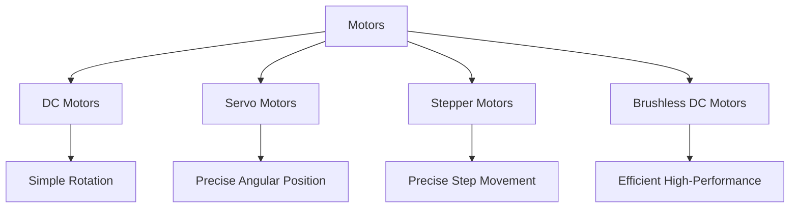

# STM32 Motor Control

Motors are essential components in numerous applications, from simple robots to complex industrial machinery. This guide will walk you through controlling various types of motors using STM32 microcontrollers, explaining the concepts and providing practical code examples.

## Introduction

STM32 microcontrollers offer powerful features for motor control applications, including advanced timer peripherals, PWM capabilities, and sufficient GPIO pins. Whether you're building a small robot, a CNC machine, or a home automation system, understanding how to control motors with STM32 is a valuable skill.

In this tutorial, we'll cover:
- Basic motor control theory
- Controlling DC motors
- Working with servo motors
- Driving stepper motors
- Advanced motor control techniques

## Prerequisites

Before diving into motor control, you should have:
- Basic knowledge of STM32 microcontrollers
- STM32CubeIDE or similar development environment set up
- Understanding of GPIO and timer peripherals
- A compatible STM32 development board (like Nucleo or Discovery)

## Motor Control Basics

### Types of Motors



### Control Methods

Most motor control techniques involve:
1. **Pulse Width Modulation (PWM)** - Varying the duty cycle of a square wave to control motor speed
2. **H-Bridge** - A circuit configuration that allows voltage to be applied across a load in either direction
3. **Motor Drivers** - Specialized ICs that simplify motor control and provide protection

## Controlling DC Motors

DC motors are the simplest to control, requiring just basic speed and direction management.

### Hardware Setup

For this example, we'll use:
- STM32F4 development board
- L298N motor driver (a common H-bridge driver)
- DC motor
- External power supply for the motor

Connect the components as follows:
- STM32 GPIO pin → IN1 on L298N
- STM32 GPIO pin → IN2 on L298N
- STM32 PWM pin → ENA on L298N
- DC motor to OUT1 and OUT2 on L298N
- Power supply to L298N

### PWM Configuration

We'll use a timer to generate PWM signals for speed control:

```c
/* Configure Timer for PWM generation */
void PWM_Init(void) {
  // Enable GPIO and Timer clocks
  __HAL_RCC_GPIOA_CLK_ENABLE();
  __HAL_RCC_TIM2_CLK_ENABLE();
  
  // Configure GPIO pin for PWM output
  GPIO_InitTypeDef GPIO_InitStruct = {0};
  GPIO_InitStruct.Pin = GPIO_PIN_5;  // PA5 connected to TIM2_CH1
  GPIO_InitStruct.Mode = GPIO_MODE_AF_PP;
  GPIO_InitStruct.Pull = GPIO_NOPULL;
  GPIO_InitStruct.Speed = GPIO_SPEED_FREQ_HIGH;
  GPIO_InitStruct.Alternate = GPIO_AF1_TIM2;
  HAL_GPIO_Init(GPIOA, &GPIO_InitStruct);
  
  // Configure Timer
  TIM_HandleTypeDef htim2;
  htim2.Instance = TIM2;
  htim2.Init.Prescaler = 84-1;  // For 84 MHz clock
  htim2.Init.CounterMode = TIM_COUNTERMODE_UP;
  htim2.Init.Period = 1000-1;   // 1 kHz PWM frequency
  htim2.Init.ClockDivision = TIM_CLOCKDIVISION_DIV1;
  HAL_TIM_PWM_Init(&htim2);
  
  // Configure PWM channel
  TIM_OC_InitTypeDef sConfig = {0};
  sConfig.OCMode = TIM_OCMODE_PWM1;
  sConfig.Pulse = 0;  // Start with 0% duty cycle
  sConfig.OCPolarity = TIM_OCPOLARITY_HIGH;
  HAL_TIM_PWM_ConfigChannel(&htim2, &sConfig, TIM_CHANNEL_1);
  
  // Start PWM
  HAL_TIM_PWM_Start(&htim2, TIM_CHANNEL_1);
}
```

### DC Motor Control Implementation

Now, let's implement a complete DC motor control:

```c
/* GPIO pins for motor direction control */
#define MOTOR_IN1_PIN GPIO_PIN_8
#define MOTOR_IN1_PORT GPIOA
#define MOTOR_IN2_PIN GPIO_PIN_9
#define MOTOR_IN2_PORT GPIOA

/* Initialize motor control pins */
void Motor_Init(void) {
  // Initialize PWM
  PWM_Init();
  
  // Configure direction control pins
  GPIO_InitTypeDef GPIO_InitStruct = {0};
  GPIO_InitStruct.Pin = MOTOR_IN1_PIN | MOTOR_IN2_PIN;
  GPIO_InitStruct.Mode = GPIO_MODE_OUTPUT_PP;
  GPIO_InitStruct.Pull = GPIO_NOPULL;
  GPIO_InitStruct.Speed = GPIO_SPEED_FREQ_LOW;
  HAL_GPIO_Init(MOTOR_IN1_PORT, &GPIO_InitStruct);
}

/* Set motor speed (0-100%) */
void Motor_SetSpeed(uint8_t speed) {
  // Limit speed to 0-100%
  if (speed > 100) speed = 100;
  
  // Convert percentage to timer value (0-999)
  uint32_t pulse = (speed * (1000-1)) / 100;
  __HAL_TIM_SET_COMPARE(&htim2, TIM_CHANNEL_1, pulse);
}

/* Set motor direction */
void Motor_SetDirection(uint8_t direction) {
  if (direction == 0) {  // Forward
    HAL_GPIO_WritePin(MOTOR_IN1_PORT, MOTOR_IN1_PIN, GPIO_PIN_SET);
    HAL_GPIO_WritePin(MOTOR_IN2_PORT, MOTOR_IN2_PIN, GPIO_PIN_RESET);
  } else {  // Reverse
    HAL_GPIO_WritePin(MOTOR_IN1_PORT, MOTOR_IN1_PIN, GPIO_PIN_RESET);
    HAL_GPIO_WritePin(MOTOR_IN2_PORT, MOTOR_IN2_PIN, GPIO_PIN_SET);
  }
}

/* Stop motor */
void Motor_Stop(void) {
  HAL_GPIO_WritePin(MOTOR_IN1_PORT, MOTOR_IN1_PIN, GPIO_PIN_RESET);
  HAL_GPIO_WritePin(MOTOR_IN2_PORT, MOTOR_IN2_PIN, GPIO_PIN_RESET);
}
```

### Usage Example

```c
int main(void) {
  HAL_Init();
  SystemClock_Config();
  
  Motor_Init();
  
  while (1) {
    // Accelerate forward
    Motor_SetDirection(0);  // Forward
    for (uint8_t speed = 0; speed <= 100; speed += 10) {
      Motor_SetSpeed(speed);
      HAL_Delay(200);
    }
    
    HAL_Delay(1000);
    
    // Decelerate to stop
    for (uint8_t speed = 100; speed > 0; speed -= 10) {
      Motor_SetSpeed(speed);
      HAL_Delay(200);
    }
    Motor_Stop();
    
    HAL_Delay(1000);
    
    // Accelerate backward
    Motor_SetDirection(1);  // Reverse
    for (uint8_t speed = 0; speed <= 100; speed += 10) {
      Motor_SetSpeed(speed);
      HAL_Delay(200);
    }
    
    HAL_Delay(1000);
    
    // Decelerate to stop
    for (uint8_t speed = 100; speed > 0; speed -= 10) {
      Motor_SetSpeed(speed);
      HAL_Delay(200);
    }
    Motor_Stop();
    
    HAL_Delay(1000);
  }
}
```

## Controlling Servo Motors

Servo motors provide precise angular positioning and are commonly used in robotics and automation.

### Servo Basics

Standard servo motors:
- Typically rotate within a 180° range
- Require a specific PWM signal (usually 50 Hz with 1-2ms pulse width)
- Include built-in control circuitry and gearing

### Hardware Setup

For this example, we'll use:
- STM32F4 development board
- Standard servo motor (like SG90 or MG996R)
- 5V power supply for the servo

Connect the servo:
- Signal wire → STM32 PWM pin
- Power wire (red) → 5V
- Ground wire (black) → GND

### Servo Control Implementation

We'll configure a timer to generate the specific PWM signal needed for servo control:

```c
/* Servo control parameters */
#define SERVO_MIN_PULSE 50   // Pulse width for 0 degrees (in timer ticks)
#define SERVO_MAX_PULSE 250  // Pulse width for 180 degrees (in timer ticks)

TIM_HandleTypeDef htim3;

/* Initialize servo control */
void Servo_Init(void) {
  // Enable GPIO and Timer clocks
  __HAL_RCC_GPIOB_CLK_ENABLE();
  __HAL_RCC_TIM3_CLK_ENABLE();
  
  // Configure GPIO pin for PWM output
  GPIO_InitTypeDef GPIO_InitStruct = {0};
  GPIO_InitStruct.Pin = GPIO_PIN_4;  // PB4 connected to TIM3_CH1
  GPIO_InitStruct.Mode = GPIO_MODE_AF_PP;
  GPIO_InitStruct.Pull = GPIO_NOPULL;
  GPIO_InitStruct.Speed = GPIO_SPEED_FREQ_HIGH;
  GPIO_InitStruct.Alternate = GPIO_AF2_TIM3;
  HAL_GPIO_Init(GPIOB, &GPIO_InitStruct);
  
  // Configure Timer for 50Hz signal (servo standard)
  htim3.Instance = TIM3;
  htim3.Init.Prescaler = 1680-1;  // For 84 MHz clock: 84MHz/1680 = 50kHz
  htim3.Init.CounterMode = TIM_COUNTERMODE_UP;
  htim3.Init.Period = 1000-1;     // 50kHz/1000 = 50Hz PWM frequency
  htim3.Init.ClockDivision = TIM_CLOCKDIVISION_DIV1;
  HAL_TIM_PWM_Init(&htim3);
  
  // Configure PWM channel
  TIM_OC_InitTypeDef sConfig = {0};
  sConfig.OCMode = TIM_OCMODE_PWM1;
  sConfig.Pulse = SERVO_MIN_PULSE;  // Start at 0 degrees
  sConfig.OCPolarity = TIM_OCPOLARITY_HIGH;
  HAL_TIM_PWM_ConfigChannel(&htim3, &sConfig, TIM_CHANNEL_1);
  
  // Start PWM
  HAL_TIM_PWM_Start(&htim3, TIM_CHANNEL_1);
}

/* Set servo angle (0-180 degrees) */
void Servo_SetAngle(uint8_t angle) {
  // Limit angle to 0-180
  if (angle > 180) angle = 180;
  
  // Convert angle to pulse width
  uint32_t pulse = SERVO_MIN_PULSE + (angle * (SERVO_MAX_PULSE - SERVO_MIN_PULSE)) / 180;
  
  // Set the pulse width
  __HAL_TIM_SET_COMPARE(&htim3, TIM_CHANNEL_1, pulse);
}
```

### Servo Control Example

```c
int main(void) {
  HAL_Init();
  SystemClock_Config();
  
  Servo_Init();
  
  while (1) {
    // Sweep from 0 to 180 degrees
    for (uint8_t angle = 0; angle <= 180; angle += 10) {
      Servo_SetAngle(angle);
      HAL_Delay(100);
    }
    
    HAL_Delay(500);
    
    // Sweep from 180 to 0 degrees
    for (uint8_t angle = 180; angle > 0; angle -= 10) {
      Servo_SetAngle(angle);
      HAL_Delay(100);
    }
    
    HAL_Delay(500);
    
    // Move to specific positions
    Servo_SetAngle(0);    // 0 degrees
    HAL_Delay(1000);
    Servo_SetAngle(90);   // 90 degrees
    HAL_Delay(1000);
    Servo_SetAngle(180);  // 180 degrees
    HAL_Delay(1000);
  }
}
```

## Controlling Stepper Motors

Stepper motors provide precise position control by rotating in discrete steps, making them ideal for applications requiring accurate movement.

### Stepper Motor Basics

Key characteristics:
- Rotates in precise, fixed angular increments (steps)
- Maintains position when powered
- Available in various step resolutions (e.g., 1.8° per step)
- Common types: unipolar and bipolar

### Hardware Setup

For this example, we'll use:
- STM32F4 development board
- A4988 or DRV8825 stepper motor driver
- Bipolar stepper motor (e.g., NEMA 17)
- External power supply for the motor

Connect the components:
- STM32 GPIO pin → STEP pin on driver
- STM32 GPIO pin → DIR pin on driver
- Stepper motor coils to driver outputs
- Power supply to driver

### Stepper Motor Control Implementation

```c
/* Stepper motor control pins */
#define STEPPER_STEP_PIN GPIO_PIN_10
#define STEPPER_STEP_PORT GPIOB
#define STEPPER_DIR_PIN GPIO_PIN_11
#define STEPPER_DIR_PORT GPIOB

/* Initialize stepper motor control */
void Stepper_Init(void) {
  // Enable GPIO clock
  __HAL_RCC_GPIOB_CLK_ENABLE();
  
  // Configure GPIO pins
  GPIO_InitTypeDef GPIO_InitStruct = {0};
  GPIO_InitStruct.Pin = STEPPER_STEP_PIN | STEPPER_DIR_PIN;
  GPIO_InitStruct.Mode = GPIO_MODE_OUTPUT_PP;
  GPIO_InitStruct.Pull = GPIO_NOPULL;
  GPIO_InitStruct.Speed = GPIO_SPEED_FREQ_HIGH;
  HAL_GPIO_Init(STEPPER_STEP_PORT, &GPIO_InitStruct);
}

/* Set stepper motor direction (0 = CW, 1 = CCW) */
void Stepper_SetDirection(uint8_t direction) {
  HAL_GPIO_WritePin(STEPPER_DIR_PORT, STEPPER_DIR_PIN, direction ? GPIO_PIN_SET : GPIO_PIN_RESET);
}

/* Generate a step pulse */
void Stepper_Step(void) {
  HAL_GPIO_WritePin(STEPPER_STEP_PORT, STEPPER_STEP_PIN, GPIO_PIN_SET);
  HAL_Delay(1);  // Short delay for pulse width
  HAL_GPIO_WritePin(STEPPER_STEP_PORT, STEPPER_STEP_PIN, GPIO_PIN_RESET);
}

/* Move stepper motor by specified number of steps */
void Stepper_Move(uint32_t steps, uint8_t direction, uint16_t delay_ms) {
  // Set direction
  Stepper_SetDirection(direction);
  
  // Generate step pulses
  for (uint32_t i = 0; i < steps; i++) {
    Stepper_Step();
    HAL_Delay(delay_ms);  // Controls speed
  }
}
```

### Stepper Motor Control Example

```c
int main(void) {
  HAL_Init();
  SystemClock_Config();
  
  Stepper_Init();
  
  while (1) {
    // Rotate 200 steps clockwise (full revolution for 1.8° stepper)
    Stepper_Move(200, 0, 5);  // 5ms delay between steps
    
    HAL_Delay(1000);
    
    // Rotate 200 steps counterclockwise
    Stepper_Move(200, 1, 5);
    
    HAL_Delay(1000);
    
    // Rotate 50 steps clockwise (quarter revolution)
    Stepper_Move(50, 0, 10);  // Slower speed
    
    HAL_Delay(1000);
    
    // Rotate 50 steps counterclockwise
    Stepper_Move(50, 1, 10);
    
    HAL_Delay(1000);
  }
}
```

## Advanced Motor Control Techniques

### Closed-Loop Control

For more precise control, implement feedback mechanisms:

```c
/* Example of closed-loop speed control using encoder feedback */
void ClosedLoop_SpeedControl(uint16_t target_rpm) {
  int16_t error, last_error = 0;
  int16_t integral = 0;
  int16_t derivative;
  uint16_t output;
  
  // PID constants
  const float Kp = 1.5;
  const float Ki = 0.2;
  const float Kd = 0.1;
  
  while (1) {
    // Read current speed from encoder (implementation depends on hardware)
    uint16_t current_rpm = Read_EncoderSpeed();
    
    // Calculate error
    error = target_rpm - current_rpm;
    
    // Calculate integral term
    integral += error;
    
    // Limit integral to prevent wind-up
    if (integral > 1000) integral = 1000;
    if (integral < -1000) integral = -1000;
    
    // Calculate derivative term
    derivative = error - last_error;
    
    // Calculate PID output
    output = (Kp * error) + (Ki * integral) + (Kd * derivative);
    
    // Limit output to valid PWM range
    if (output > 100) output = 100;
    if (output < 0) output = 0;
    
    // Apply output to motor
    Motor_SetSpeed(output);
    
    // Store error for next iteration
    last_error = error;
    
    // Control loop delay
    HAL_Delay(10);
  }
}
```

### Using Timer Interrupts for Smoother Control

For more precise timing, especially for stepper motors, use timer interrupts:

```c
TIM_HandleTypeDef htim4;

/* Initialize stepper control with timer interrupt */
void Stepper_InitWithTimer(void) {
  // Basic initialization (same as earlier)
  Stepper_Init();
  
  // Configure timer for interrupts
  __HAL_RCC_TIM4_CLK_ENABLE();
  
  htim4.Instance = TIM4;
  htim4.Init.Prescaler = 84-1;  // 84 MHz / 84 = 1 MHz
  htim4.Init.CounterMode = TIM_COUNTERMODE_UP;
  htim4.Init.Period = 1000-1;   // 1 MHz / 1000 = 1 kHz interrupt
  HAL_TIM_Base_Init(&htim4);
  
  // Enable interrupt
  HAL_NVIC_SetPriority(TIM4_IRQn, 0, 0);
  HAL_NVIC_EnableIRQ(TIM4_IRQn);
  
  // Start timer
  HAL_TIM_Base_Start_IT(&htim4);
}

/* Global variables for stepper control */
volatile uint32_t step_counter = 0;
volatile uint32_t target_steps = 0;
volatile uint8_t stepping_active = 0;

/* Timer interrupt handler */
void TIM4_IRQHandler(void) {
  HAL_TIM_IRQHandler(&htim4);
  
  if (stepping_active && step_counter < target_steps) {
    // Generate step pulse
    HAL_GPIO_TogglePin(STEPPER_STEP_PORT, STEPPER_STEP_PIN);
    
    // Count steps (only on falling edge)
    if (HAL_GPIO_ReadPin(STEPPER_STEP_PORT, STEPPER_STEP_PIN) == GPIO_PIN_RESET) {
      step_counter++;
    }
  } else {
    stepping_active = 0;
    HAL_GPIO_WritePin(STEPPER_STEP_PORT, STEPPER_STEP_PIN, GPIO_PIN_RESET);
  }
}

/* Start a stepper movement with timer-based control */
void Stepper_MoveWithTimer(uint32_t steps, uint8_t direction) {
  // Reset counters
  step_counter = 0;
  target_steps = steps;
  
  // Set direction
  Stepper_SetDirection(direction);
  
  // Start stepping
  stepping_active = 1;
}
```

## Practical Projects

Let's explore some practical applications of motor control with STM32:

### 1. Line-Following Robot

A simple line-following robot uses DC motors for movement and sensors to detect a line:

```c
void LineFollowing_Loop(void) {
  // Read left and right sensors
  uint8_t left_sensor = HAL_GPIO_ReadPin(SENSOR_LEFT_PORT, SENSOR_LEFT_PIN);
  uint8_t right_sensor = HAL_GPIO_ReadPin(SENSOR_RIGHT_PORT, SENSOR_RIGHT_PIN);
  
  if (left_sensor == 0 && right_sensor == 0) {
    // Both sensors on the line - move forward
    Motor_SetDirection(0);  // Left motor forward
    Motor_SetSpeed(50);     // Left motor 50% speed
    Motor2_SetDirection(0); // Right motor forward
    Motor2_SetSpeed(50);    // Right motor 50% speed
  }
  else if (left_sensor == 0 && right_sensor == 1) {
    // Line is to the left - turn left
    Motor_SetDirection(1);  // Left motor reverse
    Motor_SetSpeed(30);     // Left motor 30% speed
    Motor2_SetDirection(0); // Right motor forward
    Motor2_SetSpeed(70);    // Right motor 70% speed
  }
  else if (left_sensor == 1 && right_sensor == 0) {
    // Line is to the right - turn right
    Motor_SetDirection(0);  // Left motor forward
    Motor_SetSpeed(70);     // Left motor 70% speed
    Motor2_SetDirection(1); // Right motor reverse
    Motor2_SetSpeed(30);    // Right motor 30% speed
  }
  else {
    // No line detected - stop or search
    Motor_Stop();
    Motor2_Stop();
  }
}
```

### 2. Pan-Tilt Camera System

A pan-tilt mechanism using two servo motors for camera positioning:

```c
void PanTilt_Control(uint8_t pan_angle, uint8_t tilt_angle) {
  // Set pan servo angle (horizontal movement)
  Servo_SetAngle(pan_angle);
  
  // Set tilt servo angle (vertical movement)
  Servo2_SetAngle(tilt_angle);
}

/* Example of camera tracking */
void CameraTracking(void) {
  // Scan area
  for (uint8_t pan = 0; pan <= 180; pan += 10) {
    for (uint8_t tilt = 30; tilt <= 150; tilt += 10) {
      PanTilt_Control(pan, tilt);
      HAL_Delay(100);
      
      // Read object detection sensor (implementation depends on your sensor)
      if (Object_Detected()) {
        // Object found - stop scanning and track
        while (Object_Detected()) {
          // Implement tracking algorithm here
          // Example: Adjust pan/tilt based on object position
          uint8_t object_x = Get_ObjectX();
          uint8_t object_y = Get_ObjectY();
          
          // Simple proportional control
          if (object_x < 40) pan++;
          if (object_x > 60) pan--;
          if (object_y < 40) tilt++;
          if (object_y > 60) tilt--;
          
          // Update position
          PanTilt_Control(pan, tilt);
          HAL_Delay(50);
        }
      }
    }
  }
}
```

### 3. CNC Plotter

A simple CNC plotter using two stepper motors:

```c
/* Move to absolute coordinates */
void Plotter_MoveTo(uint16_t x, uint16_t y) {
  // Calculate steps needed for X axis
  int32_t x_steps = x - current_x;
  uint8_t x_dir = (x_steps >= 0) ? 0 : 1;
  
  // Calculate steps needed for Y axis
  int32_t y_steps = y - current_y;
  uint8_t y_dir = (y_steps >= 0) ? 0 : 1;
  
  // Take absolute values
  x_steps = (x_steps >= 0) ? x_steps : -x_steps;
  y_steps = (y_steps >= 0) ? y_steps : -y_steps;
  
  // Set directions
  Stepper_X_SetDirection(x_dir);
  Stepper_Y_SetDirection(y_dir);
  
  // Determine which axis has more steps
  if (x_steps >= y_steps) {
    // X axis has more steps, use it as reference
    float y_step_ratio = (float)y_steps / (float)x_steps;
    float y_step_counter = 0;
    
    for (uint32_t i = 0; i < x_steps; i++) {
      // Always step X
      Stepper_X_Step();
      
      // Step Y when needed
      y_step_counter += y_step_ratio;
      if (y_step_counter >= 1.0) {
        Stepper_Y_Step();
        y_step_counter -= 1.0;
      }
      
      HAL_Delay(2);  // Speed control
    }
  } else {
    // Y axis has more steps, use it as reference
    float x_step_ratio = (float)x_steps / (float)y_steps;
    float x_step_counter = 0;
    
    for (uint32_t i = 0; i < y_steps; i++) {
      // Always step Y
      Stepper_Y_Step();
      
      // Step X when needed
      x_step_counter += x_step_ratio;
      if (x_step_counter >= 1.0) {
        Stepper_X_Step();
        x_step_counter -= 1.0;
      }
      
      HAL_Delay(2);  // Speed control
    }
  }
  
  // Update current position
  current_x = x;
  current_y = y;
}

/* Draw a square */
void Plotter_DrawSquare(uint16_t x, uint16_t y, uint16_t size) {
  Plotter_MoveTo(x, y);  // Move to starting position
  
  // Draw four sides
  Plotter_MoveTo(x + size, y);
  Plotter_MoveTo(x + size, y + size);
  Plotter_MoveTo(x, y + size);
  Plotter_MoveTo(x, y);
}
```

## Troubleshooting Common Issues

### Motor Not Rotating

1. **Check Power Supply**: Ensure the motor power supply is connected and providing sufficient voltage/current
2. **Verify Connections**: Double-check all wiring between MCU, driver, and motor
3. **Test Motor Directly**: Connect the motor directly to power to verify it works
4. **Check Code**: Ensure PWM and GPIO configurations are correct
5. **Measure Signals**: Use an oscilloscope to verify PWM signals are being generated

### Erratic Movement

1. **Check for Noise**: Add decoupling capacitors near motor drivers
2. **Verify PWM Frequency**: Some motors perform better at specific frequencies
3. **Check Power Supply Stability**: Ensure voltage doesn't drop during operation
4. **Verify Driver IC**: Make sure the driver IC isn't overheating

### Motor Overheating

1. **Check Current Limiting**: Ensure motor driver current limiting is properly set
2. **Verify Duty Cycle**: Reduce PWM duty cycle
3. **Check for Mechanical Obstructions**: Ensure motor can rotate freely
4. **Increase Cooling**: Add heatsinks or cooling fans if necessary

## Summary

In this tutorial, we've covered:

1. **Basic motor control theory** and different motor types
2. **DC motor control** using PWM and H-bridge drivers
3. **Servo motor control** for precise angular positioning
4. **Stepper motor control** for accurate step-by-step movement
5. **Advanced techniques** like closed-loop control and interrupt-driven timing
6. **Practical applications** including robots, camera systems, and plotters

Motor control is a fundamental skill in embedded systems development, and STM32 microcontrollers provide powerful features to implement sophisticated motor control applications.

## Further Learning

To deepen your understanding of motor control with STM32:

1. Explore ST's motor control ecosystem and dedicated MCUs
2. Learn about FOC (Field Oriented Control) for brushless motors
3. Study encoder feedback for closed-loop control
4. Experiment with different motor drivers and compare performance
5. Implement more complex motion profiles and trajectories

## Exercises

1. Modify the DC motor example to implement smooth acceleration and deceleration
2. Create a multi-axis stepper motor controller with simultaneous movement
3. Implement a position control system using servo motors and potentiometer feedback
4. Build a simple robot arm with multiple servo motors
5. Develop a closed-loop speed control for a DC motor using encoder feedback