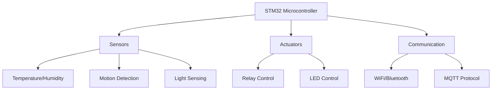
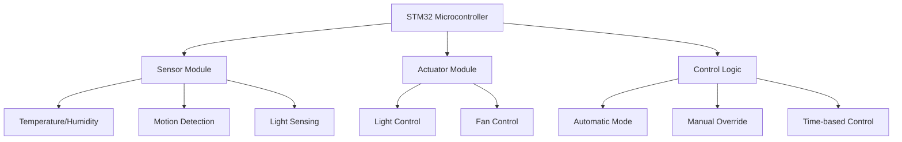

# STM32 Home Automation

## Introduction

Home automation has transformed from a luxury to an accessible technology that anyone with basic programming knowledge can implement. Using STM32 microcontrollers, you can create sophisticated home automation systems that control lighting, monitor temperature, detect motion, and much more—all while learning valuable embedded programming skills.

In this tutorial, we'll explore how to use STM32 microcontrollers to build a simple yet powerful home automation system. We'll cover everything from basic sensor integration to creating a complete multi-room control system that you can expand as your skills grow.

## What You'll Need

- STM32F4 Discovery Board or any STM32 development board
- DHT11/DHT22 temperature and humidity sensor
- Relay module (2-4 channels)
- PIR motion sensor
- LDR (Light Dependent Resistor)
- Jumper wires
- Breadboard
- LED lights (for testing)
- STM32CubeIDE installed on your computer

## Understanding STM32 for Home Automation

STM32 microcontrollers are an excellent choice for home automation projects due to their:

- Processing power (up to 180 MHz)
- Rich peripheral set (I2C, SPI, UART, etc.)
- Low power consumption modes
- Affordable price point
- Extensive documentation and community support



## Project Overview

Our home automation system will include the following components:

1. **Environmental monitoring** - Temperature and humidity sensing
2. **Lighting control** - Automatic and manual control of lights
3. **Motion detection** - Security and automatic lighting
4. **Central control** - Coordinating all automation tasks

Let's build this system step by step!

## Step 1: Setting Up Your STM32 Development Environment

Before diving into code, make sure your development environment is properly configured:

1. Install STM32CubeIDE (available from ST Microelectronics website)
2. Create a new STM32 project for your specific board
3. Configure the clock settings (we'll use the default settings)

## Step 2: Reading Temperature and Humidity

Let's start by connecting a DHT11/DHT22 sensor to monitor temperature and humidity in your home.

### Hardware Connection

Connect the DHT11/DHT22 sensor to your STM32 board:
- VCC pin to 3.3V
- GND pin to ground
- DATA pin to a GPIO pin (PA1 in our example)

### DHT11/DHT22 Driver Code

Create a file named `dht.h`:

```c
#ifndef DHT_H
#define DHT_H

#include "main.h"

typedef struct {
    float temperature;
    float humidity;
} DHT_Data;

void DHT_Init(GPIO_TypeDef* GPIOx, uint16_t GPIO_Pin);
uint8_t DHT_ReadData(GPIO_TypeDef* GPIOx, uint16_t GPIO_Pin, DHT_Data* data);

#endif /* DHT_H */
```

Now, create `dht.c`:

```c
#include "dht.h"

static void DHT_DelayUs(uint32_t us) {
    uint32_t startTick = DWT->CYCCNT;
    uint32_t delayTicks = us * (SystemCoreClock / 1000000);
    while ((DWT->CYCCNT - startTick) < delayTicks);
}

void DHT_Init(GPIO_TypeDef* GPIOx, uint16_t GPIO_Pin) {
    // Enable DWT for microsecond delay
    CoreDebug->DEMCR |= CoreDebug_DEMCR_TRCENA_Msk;
    DWT->CTRL |= DWT_CTRL_CYCCNTENA_Msk;
    
    // Configure the GPIO as output
    GPIO_InitTypeDef GPIO_InitStruct = {0};
    GPIO_InitStruct.Pin = GPIO_Pin;
    GPIO_InitStruct.Mode = GPIO_MODE_OUTPUT_PP;
    GPIO_InitStruct.Pull = GPIO_NOPULL;
    GPIO_InitStruct.Speed = GPIO_SPEED_FREQ_LOW;
    HAL_GPIO_Init(GPIOx, &GPIO_InitStruct);
    
    // Set the pin high
    HAL_GPIO_WritePin(GPIOx, GPIO_Pin, GPIO_PIN_SET);
    
    // Wait for DHT to stabilize (at least 1 second)
    HAL_Delay(1500);
}

uint8_t DHT_ReadData(GPIO_TypeDef* GPIOx, uint16_t GPIO_Pin, DHT_Data* data) {
    uint8_t bits[5] = {0}; // 40 bits (8*5)
    uint8_t i, j;
    
    // Start signal
    GPIO_InitTypeDef GPIO_InitStruct = {0};
    GPIO_InitStruct.Pin = GPIO_Pin;
    GPIO_InitStruct.Mode = GPIO_MODE_OUTPUT_PP;
    GPIO_InitStruct.Pull = GPIO_NOPULL;
    GPIO_InitStruct.Speed = GPIO_SPEED_FREQ_LOW;
    HAL_GPIO_Init(GPIOx, &GPIO_InitStruct);
    
    // Pull low for at least 18ms
    HAL_GPIO_WritePin(GPIOx, GPIO_Pin, GPIO_PIN_RESET);
    HAL_Delay(20);
    
    // Pull high for 20-40us
    HAL_GPIO_WritePin(GPIOx, GPIO_Pin, GPIO_PIN_SET);
    DHT_DelayUs(30);
    
    // Switch to input mode with pull-up
    GPIO_InitStruct.Mode = GPIO_MODE_INPUT;
    GPIO_InitStruct.Pull = GPIO_PULLUP;
    HAL_GPIO_Init(GPIOx, &GPIO_InitStruct);
    
    // Wait for DHT response
    DHT_DelayUs(40);
    
    if (HAL_GPIO_ReadPin(GPIOx, GPIO_Pin) == GPIO_PIN_RESET) {
        // DHT responded
        DHT_DelayUs(80); // Wait for DHT to pull up
        
        // DHT should now be pulling up
        if (HAL_GPIO_ReadPin(GPIOx, GPIO_Pin) == GPIO_PIN_SET) {
            DHT_DelayUs(50); // Wait for DHT to pull down
            
            // Read 40 bits (5 bytes)
            for (i = 0; i < 5; i++) {
                for (j = 0; j < 8; j++) {
                    // Wait for rising edge
                    while (HAL_GPIO_ReadPin(GPIOx, GPIO_Pin) == GPIO_PIN_RESET);
                    
                    // Wait ~30us
                    DHT_DelayUs(30);
                    
                    // If pin is still high after 30us, it's a '1'
                    if (HAL_GPIO_ReadPin(GPIOx, GPIO_Pin) == GPIO_PIN_SET) {
                        bits[i] |= (1 << (7 - j));
                    }
                    
                    // Wait for falling edge
                    while (HAL_GPIO_ReadPin(GPIOx, GPIO_Pin) == GPIO_PIN_SET);
                }
            }
            
            // Verify checksum
            if (bits[4] == ((bits[0] + bits[1] + bits[2] + bits[3]) & 0xFF)) {
                // DHT11 - integer data
                // DHT22 - float data with scale factor
                #if defined(DHT11)
                    data->humidity = bits[0];
                    data->temperature = bits[2];
                #else // DHT22
                    data->humidity = (bits[0] << 8 | bits[1]) / 10.0f;
                    
                    // Handle negative temperature
                    if (bits[2] & 0x80) {
                        data->temperature = -((bits[2] & 0x7F) << 8 | bits[3]) / 10.0f;
                    } else {
                        data->temperature = (bits[2] << 8 | bits[3]) / 10.0f;
                    }
                #endif
                
                return 1; // Success
            }
        }
    }
    
    return 0; // Error
}
```

### Using the DHT Sensor in Your Main Code

Add this to your `main.c`:

```c
#include "dht.h"

int main(void) {
    /* MCU Configuration */
    HAL_Init();
    SystemClock_Config();
    
    /* Initialize all configured peripherals */
    MX_GPIO_Init();
    MX_USART2_UART_Init();
    
    // Initialize DHT sensor
    DHT_Init(GPIOA, GPIO_PIN_1);
    
    DHT_Data dhtData;
    char uartBuffer[50];
    
    while (1) {
        if (DHT_ReadData(GPIOA, GPIO_PIN_1, &dhtData)) {
            // Format and send data via UART
            sprintf(uartBuffer, "Temp: %.1f°C, Humidity: %.1f%%\r
", 
                    dhtData.temperature, dhtData.humidity);
            HAL_UART_Transmit(&huart2, (uint8_t*)uartBuffer, strlen(uartBuffer), 100);
            
            // Add your automation logic based on temperature or humidity
            if (dhtData.temperature > 25.0f) {
                // Turn on a fan or AC by controlling a relay
                // HAL_GPIO_WritePin(FAN_GPIO_Port, FAN_Pin, GPIO_PIN_SET);
            }
        }
        
        HAL_Delay(2000); // Read every 2 seconds
    }
}
```

## Step 3: Controlling Lights with Relays

Now, let's add the ability to control lights using relay modules.

### Hardware Connection

Connect a 4-channel relay module:
- VCC to 5V (use external power if needed)
- GND to ground
- IN1 to PA4
- IN2 to PA5
- IN3 to PA6
- IN4 to PA7

### Relay Control Code

Create a file named `relay.h`:

```c
#ifndef RELAY_H
#define RELAY_H

#include "main.h"

// Define relay channels
typedef enum {
    RELAY_CHANNEL_1 = 0,
    RELAY_CHANNEL_2,
    RELAY_CHANNEL_3,
    RELAY_CHANNEL_4,
    RELAY_CHANNEL_MAX
} RelayChannel;

void Relay_Init(void);
void Relay_On(RelayChannel channel);
void Relay_Off(RelayChannel channel);
void Relay_Toggle(RelayChannel channel);

#endif /* RELAY_H */
```

Create `relay.c`:

```c
#include "relay.h"

// GPIO configurations for each relay channel
static const struct {
    GPIO_TypeDef* port;
    uint16_t pin;
} relayChannels[RELAY_CHANNEL_MAX] = {
    {GPIOA, GPIO_PIN_4},  // RELAY_CHANNEL_1
    {GPIOA, GPIO_PIN_5},  // RELAY_CHANNEL_2
    {GPIOA, GPIO_PIN_6},  // RELAY_CHANNEL_3
    {GPIOA, GPIO_PIN_7}   // RELAY_CHANNEL_4
};

void Relay_Init(void) {
    GPIO_InitTypeDef GPIO_InitStruct = {0};
    
    // Initialize all relay channels as outputs
    for (int i = 0; i < RELAY_CHANNEL_MAX; i++) {
        GPIO_InitStruct.Pin = relayChannels[i].pin;
        GPIO_InitStruct.Mode = GPIO_MODE_OUTPUT_PP;
        GPIO_InitStruct.Pull = GPIO_NOPULL;
        GPIO_InitStruct.Speed = GPIO_SPEED_FREQ_LOW;
        HAL_GPIO_Init(relayChannels[i].port, &GPIO_InitStruct);
        
        // Initial state is OFF (HIGH for active-low relays)
        HAL_GPIO_WritePin(relayChannels[i].port, relayChannels[i].pin, GPIO_PIN_SET);
    }
}

void Relay_On(RelayChannel channel) {
    if (channel < RELAY_CHANNEL_MAX) {
        // Active LOW relay modules
        HAL_GPIO_WritePin(relayChannels[channel].port, 
                          relayChannels[channel].pin, 
                          GPIO_PIN_RESET);
    }
}

void Relay_Off(RelayChannel channel) {
    if (channel < RELAY_CHANNEL_MAX) {
        // Active LOW relay modules
        HAL_GPIO_WritePin(relayChannels[channel].port, 
                          relayChannels[channel].pin, 
                          GPIO_PIN_SET);
    }
}

void Relay_Toggle(RelayChannel channel) {
    if (channel < RELAY_CHANNEL_MAX) {
        HAL_GPIO_TogglePin(relayChannels[channel].port, 
                          relayChannels[channel].pin);
    }
}
```

## Step 4: Motion Detection with PIR Sensor

Let's add motion detection to automatically control lights.

### Hardware Connection

Connect the PIR motion sensor:
- VCC to 3.3V or 5V (depending on your sensor)
- GND to ground
- OUT to PB0 (interrupt capable pin)

### PIR Sensor Code

Create a file named `pir.h`:

```c
#ifndef PIR_H
#define PIR_H

#include "main.h"

void PIR_Init(GPIO_TypeDef* GPIOx, uint16_t GPIO_Pin);
uint8_t PIR_DetectMotion(GPIO_TypeDef* GPIOx, uint16_t GPIO_Pin);
void PIR_EnableInterrupt(GPIO_TypeDef* GPIOx, uint16_t GPIO_Pin);

#endif /* PIR_H */
```

Create `pir.c`:

```c
#include "pir.h"

void PIR_Init(GPIO_TypeDef* GPIOx, uint16_t GPIO_Pin) {
    GPIO_InitTypeDef GPIO_InitStruct = {0};
    
    // Configure the PIR output pin as input
    GPIO_InitStruct.Pin = GPIO_Pin;
    GPIO_InitStruct.Mode = GPIO_MODE_INPUT;
    GPIO_InitStruct.Pull = GPIO_NOPULL;
    HAL_GPIO_Init(GPIOx, &GPIO_InitStruct);
    
    // Allow the PIR sensor to calibrate (typically takes 10-60 seconds)
    HAL_Delay(10000);
}

uint8_t PIR_DetectMotion(GPIO_TypeDef* GPIOx, uint16_t GPIO_Pin) {
    // Read the PIR output (HIGH when motion is detected)
    return HAL_GPIO_ReadPin(GPIOx, GPIO_Pin) == GPIO_PIN_SET;
}

void PIR_EnableInterrupt(GPIO_TypeDef* GPIOx, uint16_t GPIO_Pin) {
    GPIO_InitTypeDef GPIO_InitStruct = {0};
    
    // Configure the PIR output pin as interrupt on rising edge
    GPIO_InitStruct.Pin = GPIO_Pin;
    GPIO_InitStruct.Mode = GPIO_MODE_IT_RISING;
    GPIO_InitStruct.Pull = GPIO_NOPULL;
    HAL_GPIO_Init(GPIOx, &GPIO_InitStruct);
    
    // Enable the interrupt in NVIC
    IRQn_Type IRQn = EXTI0_IRQn; // Adjust based on your pin
    HAL_NVIC_SetPriority(IRQn, 5, 0);
    HAL_NVIC_EnableIRQ(IRQn);
}
```

## Step 5: Light Sensing with LDR

Let's add light sensing to automatically control lights based on ambient brightness.

### Hardware Connection

Connect the LDR (Light Dependent Resistor):
- One leg to 3.3V
- Other leg to both an analog pin (PA0) and through a 10kΩ resistor to ground

### LDR Code

Create a file named `ldr.h`:

```c
#ifndef LDR_H
#define LDR_H

#include "main.h"

void LDR_Init(ADC_HandleTypeDef* hadc, uint32_t channel);
uint16_t LDR_ReadRaw(ADC_HandleTypeDef* hadc);
uint8_t LDR_IsDark(ADC_HandleTypeDef* hadc, uint16_t threshold);

#endif /* LDR_H */
```

Create `ldr.c`:

```c
#include "ldr.h"

void LDR_Init(ADC_HandleTypeDef* hadc, uint32_t channel) {
    ADC_ChannelConfTypeDef sConfig = {0};
    
    // Configure the ADC channel
    sConfig.Channel = channel;
    sConfig.Rank = 1;
    sConfig.SamplingTime = ADC_SAMPLETIME_56CYCLES;
    HAL_ADC_ConfigChannel(hadc, &sConfig);
}

uint16_t LDR_ReadRaw(ADC_HandleTypeDef* hadc) {
    uint16_t adcValue = 0;
    
    // Start the ADC conversion
    HAL_ADC_Start(hadc);
    
    // Wait for the conversion to complete
    if (HAL_ADC_PollForConversion(hadc, 100) == HAL_OK) {
        // Read the ADC value
        adcValue = HAL_ADC_GetValue(hadc);
    }
    
    HAL_ADC_Stop(hadc);
    
    return adcValue;
}

uint8_t LDR_IsDark(ADC_HandleTypeDef* hadc, uint16_t threshold) {
    uint16_t lightLevel = LDR_ReadRaw(hadc);
    
    // In a typical LDR setup, lower values indicate darker conditions
    // Adjust the threshold based on your specific setup
    return lightLevel < threshold;
}
```

## Step 6: Implementing the Main Home Automation System

Now, let's integrate all components into a complete home automation system.

### Main System Architecture



### Integrated Main Code

Here's a complete example that integrates all the components:

```c
#include "main.h"
#include "dht.h"
#include "relay.h"
#include "pir.h"
#include "ldr.h"
#include <string.h>
#include <stdio.h>

// Handle definitions
ADC_HandleTypeDef hadc1;
UART_HandleTypeDef huart2;

// Function prototypes
static void SystemClock_Config(void);
static void MX_GPIO_Init(void);
static void MX_ADC1_Init(void);
static void MX_USART2_UART_Init(void);

// Global variables
volatile uint8_t motionDetected = 0;
uint32_t lastMotionTime = 0;
const uint32_t LIGHT_AUTO_OFF_DELAY = 60000; // 1 minute in ms

// Automation mode
typedef enum {
    MODE_MANUAL,
    MODE_AUTO,
    MODE_SCHEDULE
} OperationMode;

OperationMode currentMode = MODE_AUTO;

// EXTI interrupt handler for motion detection
void HAL_GPIO_EXTI_Callback(uint16_t GPIO_Pin) {
    if (GPIO_Pin == GPIO_PIN_0) { // PIR sensor pin
        motionDetected = 1;
        lastMotionTime = HAL_GetTick();
    }
}

int main(void) {
    // MCU Configuration
    HAL_Init();
    SystemClock_Config();
    
    // Initialize peripherals
    MX_GPIO_Init();
    MX_ADC1_Init();
    MX_USART2_UART_Init();
    
    // Initialize sensors and actuators
    DHT_Init(GPIOA, GPIO_PIN_1);
    Relay_Init();
    PIR_Init(GPIOB, GPIO_PIN_0);
    PIR_EnableInterrupt(GPIOB, GPIO_PIN_0);
    LDR_Init(&hadc1, ADC_CHANNEL_0);
    
    // Variables for sensor readings
    DHT_Data dhtData;
    uint8_t isDark;
    char uartBuffer[100];
    uint32_t lastSensorReadTime = 0;
    
    // Main loop
    while (1) {
        // Read sensors every 5 seconds
        if (HAL_GetTick() - lastSensorReadTime > 5000) {
            lastSensorReadTime = HAL_GetTick();
            
            // Read temperature and humidity
            if (DHT_ReadData(GPIOA, GPIO_PIN_1, &dhtData)) {
                sprintf(uartBuffer, "Temp: %.1f°C, Humidity: %.1f%%\r
", 
                        dhtData.temperature, dhtData.humidity);
                HAL_UART_Transmit(&huart2, (uint8_t*)uartBuffer, strlen(uartBuffer), 100);
                
                // Temperature-based fan control (Relay Channel 2)
                if (dhtData.temperature > 25.0f) {
                    Relay_On(RELAY_CHANNEL_2);  // Turn on fan
                } else if (dhtData.temperature < 23.0f) {
                    Relay_Off(RELAY_CHANNEL_2); // Turn off fan
                }
            }
            
            // Read light level
            isDark = LDR_IsDark(&hadc1, 2000);
            sprintf(uartBuffer, "Light Condition: %s\r
", isDark ? "Dark" : "Bright");
            HAL_UART_Transmit(&huart2, (uint8_t*)uartBuffer, strlen(uartBuffer), 100);
        }
        
        // Automatic lighting control based on motion and light level
        if (currentMode == MODE_AUTO) {
            // Check if motion is detected and it's dark
            if (motionDetected && isDark) {
                Relay_On(RELAY_CHANNEL_1);  // Turn on lights
                motionDetected = 0;
                
                sprintf(uartBuffer, "Motion detected! Lights ON\r
");
                HAL_UART_Transmit(&huart2, (uint8_t*)uartBuffer, strlen(uartBuffer), 100);
            }
            
            // Auto turn off lights after delay
            if (HAL_GetTick() - lastMotionTime > LIGHT_AUTO_OFF_DELAY) {
                Relay_Off(RELAY_CHANNEL_1);  // Turn off lights
            }
        }
        
        // Additional code for other automation rules...
        
        // Handle UART commands (simplified example)
        uint8_t rxBuffer[20];
        if (HAL_UART_Receive(&huart2, rxBuffer, sizeof(rxBuffer), 10) == HAL_OK) {
            // Process commands (example: "LIGHT1_ON", "LIGHT1_OFF", "MODE_AUTO", etc.)
            // This would be expanded in a real implementation
        }
    }
}

// Clock configuration function
static void SystemClock_Config(void) {
    // Your clock configuration code here
}

// GPIO initialization function
static void MX_GPIO_Init(void) {
    // Your GPIO initialization code here
}

// ADC initialization function
static void MX_ADC1_Init(void) {
    // Your ADC initialization code here
}

// UART initialization function
static void MX_USART2_UART_Init(void) {
    // Your UART initialization code here
}
```

## Step 7: Adding Wi-Fi Connectivity (Optional Extension)

To make your home automation system remotely controllable, you can add Wi-Fi connectivity using an ESP8266 or ESP32 module.

Connect the ESP8266 module to the STM32:
- ESP8266 VCC to 3.3V
- ESP8266 GND to GND
- ESP8266 TX to STM32 RX (PA10)
- ESP8266 RX to STM32 TX (PA9)

Create `wifi.h` and `wifi.c` files to handle the communication with the ESP8266 module and implement a simple HTTP server or MQTT client to control your home automation system.

## Practical Applications

This home automation system can be extended in several ways:

1. **Smart Lighting System**
   - Automatically turn on/off lights based on motion and ambient light
   - Implement scheduled lighting patterns

2. **Climate Control**
   - Monitor and control temperature and humidity
   - Automate fans, heaters, or connect to AC systems

3. **Security System**
   - Motion detection for security alerts
   - Door/window sensors integration
   - Security camera triggering

4. **Energy Monitoring**
   - Track power consumption of connected devices
   - Implement energy-saving routines

5. **Voice Control Integration**
   - Connect to voice assistants through MQTT or other protocols
   - Allow voice commands to control your home automation system

## Troubleshooting Common Issues

1. **Sensor Reading Errors**
   - Check wiring connections
   - Verify power supply stability
   - Ensure proper timing in code

2. **Relay Not Switching**
   - Check if the relay module is active-high or active-low
   - Verify that the GPIO pin is configured correctly
   - Ensure sufficient current for relay operation

3. **Communication Issues**
   - Check UART configurations
   - Verify baud rate settings
   - Check for buffer overflow issues

4. **System Responsiveness**
   - Review delay usage in code
   - Consider using interrupts for critical events
   - Implement a state machine for better control flow

## Summary

In this tutorial, we've built a comprehensive STM32-based home automation system that can:
- Monitor temperature and humidity
- Detect motion
- Sense ambient light levels
- Control lights and appliances
- Make intelligent automation decisions

This system provides a solid foundation that you can expand upon with additional sensors, actuators, and communication interfaces. The modular approach allows you to easily add new features as your skills and requirements grow.

## Additional Resources

- [STM32 HAL Documentation](https://www.st.com/resource/en/user_manual/dm00105879-description-of-stm32f4-hal-and-ll-drivers-stmicroelectronics.pdf)
- [STM32F4 Discovery User Manual](https://www.st.com/resource/en/user_manual/dm00039084-discovery-kit-with-stm32f407vg-mcu-stmicroelectronics.pdf)
- [Home Automation Protocol Standards](https://www.home-assistant.io/docs/mqtt/)

## Exercises

1. Add a real-time clock (RTC) module to implement time-based automation schedules.
2. Implement a serial command interface to manually control devices.
3. Add support for multiple rooms by expanding the relay channels and sensors.
4. Implement data logging to track environmental conditions over time.
5. Extend the system with a simple web interface using an ESP8266/ESP32 module.